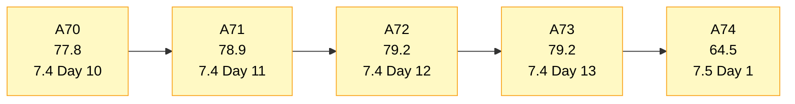
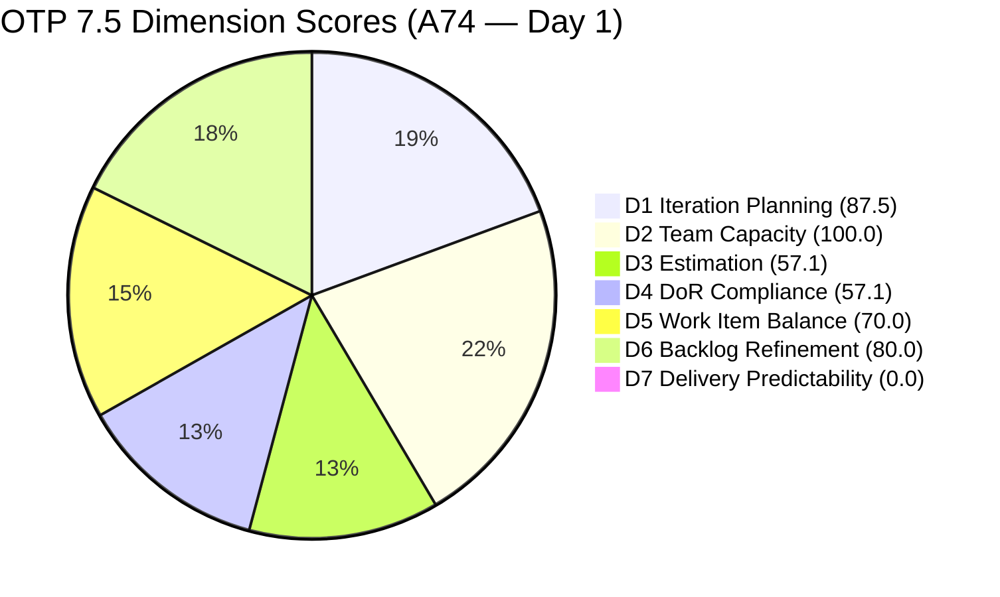
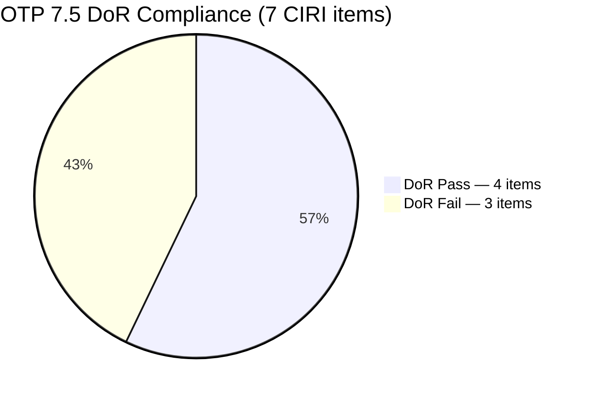
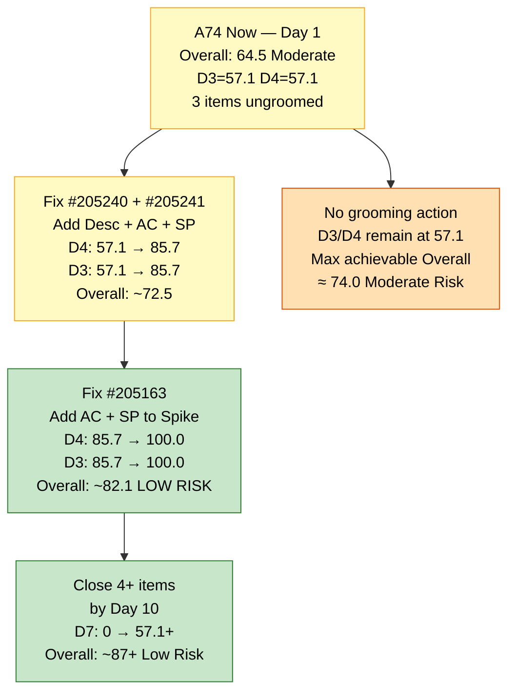
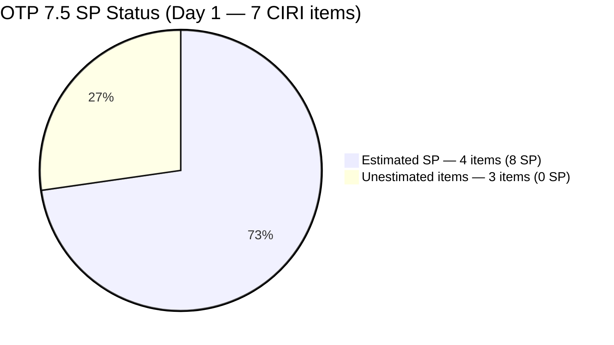

# OTP Team — SAFe Iteration Audit A74
**Date:** 2026-06-01 | **Sprint Day:** 1 of 14 — SPRINT OPEN | **Iteration:** 7.5 (June 1 – June 14, 2026)
**Auditor:** Claude Code (ADO SAFe Audit Skill v1) | **Prior Audit:** A73 (2026-05-30 09:00)

---

## 1. Audit Metadata

| Field | Value |
|---|---|
| **Audit ID** | A74 |
| **Report File** | `AUDIT_20260601_0203.md` |
| **Prior Audit** | A73 — `AUDIT_20260530_0900.md` (Overall 79.2, Moderate Risk — 7.4 Day 13) |
| **ADO Project** | OTP (`e7739905-28a3-4ae1-9173-7f6cd13b3494`) |
| **ADO Team** | OTP Team (`64de61f0-1203-4b01-aee2-6b4415aec52b`) |
| **Iteration** | 7.5 (`d1bb3b59-5d69-4489-987c-c5577c0a3cf1`) |
| **Iteration Dates** | June 1 – June 14, 2026 |
| **Sprint Day** | **1 of 14 — SPRINT OPEN** |
| **Audit Date** | 2026-06-01 02:03 UTC-6 |
| **Overall Score** | **64.5 — Moderate Risk** |
| **Risk Band** | Moderate (60–79.9) |
| **Visible Backlog Items (VRBI)** | 8 open root items |
| **Current Iteration Root Items (CIRI)** | 7 items (IterationPath = 7.5) |
| **Capacity Source** | `work_get_team_capacity` — Grace: activities configured (Documentation, Requirements); 0.0h/day set for 7.5 (capacity not yet entered) |
| **Project Exceptions Applied** | Single-assignee model (Grace) — accepted per `CLAUDE.md` |

> **Sprint Day 1 note:** This is the opening audit for Iteration 7.5. The sprint began today (June 1). D7 = 0.0 is expected at Day 1 — no closures possible yet. Three new items (#205240 SOW Verification, #205241 Gathering of Akira's Letter Invitation) were added to 7.5 on May 30 but have no SP or AC. Capacity for 7.5 has not yet been configured (0.0h/day). Immediate actions needed: set capacity in ADO, estimate missing items, and add AC to unresolved items.

---

## 2. Executive Summary

The OTP team opens Iteration 7.5 at **64.5 — Moderate Risk**, a drop of 14.7 points from the 7.4 final score (79.2). The score decline is expected at sprint opening: D7 resets to 0.0 (Day 1, no closures) and three items carry DoR gaps into the new sprint. Strengths persist in capacity coverage (D2 = 100.0), iteration planning (D1 = 87.5), and backlog freshness (D6 = 80.0). The most pressing risks are the two items with no Story Points or Acceptance Criteria (#205240 SOW Verification, #205241 Gathering of Akira's Letter Invitation) — these entered the sprint ungroomed and must be corrected this week. Spike #205163 also lacks Acceptance Criteria. Setting 7.5 capacity in ADO and resolving all three DoR gaps within the first two sprint days would raise the overall score to approximately 75.6 (borderline Low Risk).

---

## 3. Previous Audit Delta (A73 → A74)

| Dimension | A73 Score (7.4 Day 13) | A74 Score (7.5 Day 1) | Delta | Driver |
|---|---|---|---|---|
| D1 Iteration Planning | 57.1 | **87.5** | **+30.4** | 7/8 items in 7.5 vs. 8/14 in 7.4. Better sprint allocation at 7.5 open. |
| D2 Team Capacity | 100.0 | **100.0** | **0.0** | Grace has activities configured (Documentation, Requirements) — CC = 1 per rubric. |
| D3 Estimation | 100.0 | **57.1** | **−42.9** | 3 of 7 CIRI items lack Story Points (#205240, #205241, #205163). 4/7 estimated. |
| D4 DoR Compliance | 100.0 | **57.1** | **−42.9** | 3 of 7 CIRI items fail DoR: #205240 (no Desc/AC), #205241 (no Desc/AC), #205163 (no AC). 4/7 pass. |
| D5 Work Item Balance | 70.0 | **70.0** | **0.0** | User Story dominance 85.7% > 60% → persistent −30 penalty. 1 Spike in sprint. |
| D6 Backlog Refinement | 100.0 | **80.0** | **−20.0** | Base = 100 (all 8 items fresh). −20 penalty: 7/7 CIRI items untouched since before sprint start (ChangedDate < June 1). |
| D7 Delivery Predictability | 27.3 | **0.0** | **−27.3** | Sprint Day 1 reset — 0/8 SP closed (expected). Early-sprint annotation applies. |
| **Overall** | **79.2** | **64.5** | **−14.7** | Score drop driven by D7 reset (Day 1) and DoR/Estimation gaps in 3 ungroomed items. |

**Key observations A73 → A74:**
- Iteration 7.4 closed. Several 7.4 items appear to have closed and departed the backlog API (only 8 items remain vs. 14 in A73). Closed items (#204117, #204122, #204354, and potentially others from the final day) are not visible.
- Two new items were added on May 30 (#205240 SOW Verification, #205241 Gathering of Akira's Letter Invitation) without Description, Story Points, or Acceptance Criteria.
- 7.5 capacity has not been set in ADO — action required before Day 2.

---

## 4. Current Iteration Snapshot

| Metric | Value |
|---|---|
| Visible Backlog Items (VRBI) | 8 |
| Current Iteration Root Items (CIRI) | 7 (IterationPath = OTP\2026 - PI7\Iteration 7.5) |
| Non-current Items | 1 (203864 in Iteration 7.6) |
| Story Points Committed (CSP) | 8 SP (4 estimated items × 2 SP) |
| Story Points Closed (CLSP) | 0 SP |
| Delivery Rate | 0% (Day 1 — expected) |
| Team Size (distinct assignees in CIRI) | 1 (Grace; #205240 unassigned) |
| Sprint Day / Total | **Day 1 of 14** |
| Iteration Start / Finish | June 1, 2026 – June 14, 2026 |

---

## 5. Work Item Analysis

### All Current Iteration Items (7 items — IterationPath = 7.5)

| ID | Title | Type | State | SP | Assignee | DoR | ChangedDate |
|---|---|---|---|---|---|---|---|
| #202912 | Fabrication of Signage | User Story | New | 2 | Grace | **Pass** | May 21 |
| #202913 | Installation of Street Signage | User Story | Active | 2 | Grace | **Pass** | May 21 |
| #204193 | Philgeps Document Consolidation | User Story | New | 2 | Grace | **Pass** | May 21 |
| #204194 | Philgeps Online Submission | User Story | New | 2 | Grace | **Pass** | May 21 |
| #205163 | Business Requirements & Workflow Mapping | Spike | New | — | Grace | **Fail** (no AC) | May 28 |
| #205240 | SOW Verification | User Story | New | — | *(unassigned)* | **Fail** (no Desc, no AC) | May 30 |
| #205241 | Gathering of Akira's Letter Invitation | User Story | New | New | Grace | **Fail** (no Desc, no AC) | May 30 |

**DoR breakdown legend:** Pass = Description ≥30 chars AND AC ≥20 chars (non-whitespace, HTML stripped). Fail = one or both missing.

### Non-current Backlog Item (1 item — future iteration)

| ID | Title | Iteration | Type | State | SP | Changed |
|---|---|---|---|---|---|---|
| #203864 | Release and collect of TCT | 7.6 | User Story | New | 2 | May 21 |

### Type Distribution (7 CIRI items)

| Type | Count | Share |
|---|---|---|
| User Story | 6 | 85.7% |
| Spike | 1 | 14.3% |
| **Total** | **7** | **100%** |

### DoR Gap Detail

| ID | Title | Desc chars | AC chars | Verdict |
|---|---|---|---|---|
| #202912 | Fabrication of Signage | ~108 (HTML stripped) | ~59 | Pass |
| #202913 | Installation of Street Signage | ~112 | ~23 | Pass |
| #204193 | Philgeps Document Consolidation | ~112 | ~91 | Pass |
| #204194 | Philgeps Online Submission | ~88 | ~38 | Pass |
| #205163 | Business Requirements & Workflow Mapping | ~223 | 0 (null) | **Fail — no AC** |
| #205240 | SOW Verification | 0 (null) | 0 (null) | **Fail — no Desc, no AC** |
| #205241 | Gathering of Akira's Letter Invitation | 0 (null) | 0 (null) | **Fail — no Desc, no AC** |

---

## 6. SAFe Compliance Scorecard

| Dimension | Score | Band | Evidence | Notes |
|---|---|---|---|---|
| D1 Iteration Planning | **87.5** | Low | 7 CIRI / 8 VRBI | Strong. 1 item (203864) planned for 7.6 — appropriate future staging. |
| D2 Team Capacity | **100.0** | Low | 1/1 contributor with capacity | Grace has Documentation + Requirements activities configured; 0h/day not yet entered for 7.5 but activities satisfy rubric. |
| D3 Estimation | **57.1** | High | 4 ECI / 7 PECI | 3 items without SP (#205163, #205240, #205241). Must be estimated before Day 3. |
| D4 DoR Compliance | **57.1** | High | 4 DCI / 7 CIRI | 3 items fail DoR (#205163 no AC; #205240, #205241 no Desc/AC). Must be resolved by Day 3. |
| D5 Work Item Balance | **70.0** | Moderate | US 85.7% > 60% threshold | Structural −30 penalty. Spike present but US dominance persists. |
| D6 Backlog Refinement | **80.0** | Low | base=100; −20 untouched | All 8 items fresh. −20 for 100% of CIRI untouched since before sprint start (Day 1 artifact). |
| D7 Delivery Predictability | **0.0** | Critical | 0 SP closed / 8 SP committed | Sprint Day 1 — early-sprint, low delivery expected. No penalty adjustment; rubric score = 0. |
| **OVERALL** | **64.5** | **Moderate** | (87.5+100.0+57.1+57.1+70.0+80.0+0.0)/7 | Day 1 opening score. D7 = 0 is expected; D3/D4 gaps are the actionable concerns. |

**Formula verification:** (87.5 + 100.0 + 57.1 + 57.1 + 70.0 + 80.0 + 0.0) / 7 = 451.7 / 7 = **64.5**

---

## 7. Dimension Findings

### D1 — Iteration Planning: 87.5 / 100 — Low Risk

**Formula:** CIRI / VRBI × 100 = 7 / 8 × 100 = **87.5**

| Metric | Value |
|---|---|
| Visible root backlog items (VRBI) | 8 |
| Items assigned to Iteration 7.5 (CIRI) | 7 |
| Items in future iterations (not CIRI) | 1 — #203864 (7.6) |
| Score | **87.5** |

Significant improvement from A73 (57.1 → 87.5, +30.4). Seven of eight visible backlog items are allocated to the current sprint, reflecting good iteration planning at 7.5 kickoff. The single non-current item (#203864, Release and Collect of TCT) is appropriately staged to 7.6 and represents normal forward planning. D1 will recalibrate as items are closed and depart the backlog API during the sprint.

---

### D2 — Team Capacity: 100.0 / 100 — Low Risk

**Formula:** CC / CW × 100 = 1 / 1 × 100 = **100.0**

| Metric | Value |
|---|---|
| Contributors with work on CIRI (CW) | 1 — Grace (#202912, #202913, #204193, #204194, #205163, #205241) |
| Contributors with capacity (CC) | 1 — Grace has "Documentation" and "Requirements" activities configured (satisfies rubric: "at least one activity configured") |
| #205240 assignee | Unassigned — excluded from CW/CC (no assignee) |
| Capacity (h/day for 7.5) | 0.0h/day — not yet set for this iteration |
| Score | **100.0** |

Grace is the sole contributor with current work. Per rubric, CC counts a member with "positive daily capacity OR at least one activity configured." Grace has two activities configured (Documentation, Requirements), satisfying the CC condition despite the 0h/day entry. **Action required:** Grace should set her daily capacity for Iteration 7.5 before Day 2 to support proper sprint planning. Project Exception for single-assignee model applied — no bus factor penalty per CLAUDE.md.

---

### D3 — Estimation: 57.1 / 100 — High Risk

**Formula:** ECI / PECI × 100 = 4 / 7 × 100 = **57.1**

| # | Title | Type | SP | Estimated? |
|---|---|---|---|---|
| #202912 | Fabrication of Signage | User Story | 2 | Yes |
| #202913 | Installation of Street Signage | User Story | 2 | Yes |
| #204193 | Philgeps Document Consolidation | User Story | 2 | Yes |
| #204194 | Philgeps Online Submission | User Story | 2 | Yes |
| #205163 | Business Requirements & Workflow Mapping | Spike | — | **No (null SP)** |
| #205240 | SOW Verification | User Story | — | **No (null SP)** |
| #205241 | Gathering of Akira's Letter Invitation | User Story | — | **No (null SP)** |

| Metric | Value |
|---|---|
| Point-eligible current items (PECI) | 7 (all CIRI items are User Story or Spike) |
| Estimated current items (ECI) | 4 (SP > 0) |
| Un-estimated items | 3 (#205163, #205240, #205241) |
| Score | **57.1** |

Three items entered the sprint without Story Points. #205240 and #205241 were added on May 30 — just before sprint start — and appear incompletely groomed. #205163 is a Spike and may intentionally use time-boxed hours instead of SP, but the rubric still requires SP > 0 for Spike type. All three must be estimated by Day 3 to recover D3.

---

### D4 — DoR Compliance: 57.1 / 100 — High Risk

**Formula:** DCI / CIRI × 100 = 4 / 7 × 100 = **57.1**

| # | Title | Desc ≥30 | AC ≥20 | Pass |
|---|---|---|---|---|
| #202912 | Fabrication of Signage | ✓ (~108 chars) | ✓ (~59 chars) | **Pass** |
| #202913 | Installation of Street Signage | ✓ (~112 chars) | ✓ (~23 chars) | **Pass** |
| #204193 | Philgeps Document Consolidation | ✓ (~112 chars) | ✓ (~91 chars) | **Pass** |
| #204194 | Philgeps Online Submission | ✓ (~88 chars) | ✓ (~38 chars) | **Pass** |
| #205163 | Business Requirements & Workflow Mapping | ✓ (~223 chars) | ✗ (null — 0 chars) | **Fail** |
| #205240 | SOW Verification | ✗ (null — 0 chars) | ✗ (null — 0 chars) | **Fail** |
| #205241 | Gathering of Akira's Letter Invitation | ✗ (null — 0 chars) | ✗ (null — 0 chars) | **Fail** |

| Metric | Value |
|---|---|
| CIRI | 7 |
| DoR-compliant items (DCI) | 4 |
| Non-compliant items | 3 |
| Score | **57.1** |

This is the first audit in over ten iterations where DoR has dropped below 100. Three items entered 7.5 without meeting the Definition of Ready. #205240 and #205241 are blank stubs — no description, no acceptance criteria. #205163 has a detailed description but no AC. Resolving all three would restore D4 to 100.0 and raise Overall to approximately 75.6.

---

### D5 — Work Item Balance: 70.0 / 100 — Moderate Risk

**Formula:** Base 100 − penalties applied independently

| Penalty | Trigger | Calculated | Applied |
|---|---|---|---|
| −40: no User Story type in CIRI | User Story present (6 of 7 items) | — | **No** |
| −30: dominant_type_share > 60% | User Story = 6/7 = 85.7% > 60% | Yes | **Yes** |
| −20: spike_share > 40% | Spike = 1/7 = 14.3% < 40% | — | **No** |

**Score:** 100 − 30 = **70.0**

User Story dominance at 85.7% continues to trigger the structural −30 penalty, identical to 7.4 (87.5%). The addition of Spike #205163 slightly reduced the US share from 87.5% to 85.7%, but not below the 60% threshold. For 7.5 sprint planning improvement, at least 2–3 additional Enabler or Spike items would need to be present to drive User Story share below 60%.

---

### D6 — Backlog Refinement: 80.0 / 100 — Low Risk

**Freshness window:** Items with ChangedDate ≥ 2026-04-17 (45 days before 2026-06-01)

| Metric | Value |
|---|---|
| Total visible backlog items (VRBI) | 8 |
| Fresh items (ChangedDate ≥ Apr 17) | 8 — oldest: May 21 (#202912, #202913, #203864, #204193, #204194) |
| stale_90 items (ChangedDate < 2026-03-03) | 0 |
| stale_180 items (ChangedDate < 2025-12-04) | 0 |
| Base score | 8/8 × 100 = 100.0 |

**Penalty calculation:**

| Penalty | Trigger | Calculated | Applied |
|---|---|---|---|
| −20 (stale_90 > 25%) | 0/8 = 0% | — | No |
| −10 (stale_90 > 10%) | 0/8 = 0% | — | No |
| −20 (stale_180 ≥ 1 item) | 0 items | — | No |
| −20 (untouched/CIRI > 30%) | 7/7 = 100% > 30% | Yes | **Yes** |

**Untouched current items:** All 7 CIRI items have ChangedDate before June 1 (iteration start). This is a Day 1 artifact — items were carried forward or newly added before sprint start.

**Score:** max(0, 100.0 − 20) = **80.0**

The −20 untouched penalty is expected on Day 1 as no work has begun yet. D6 will recover to 100 as Grace touches items in the first few days of the sprint.

---

### D7 — Delivery Predictability: 0.0 / 100 — Critical

**Formula:** CLSP / CSP × 100 = 0 / 8 × 100 = **0.0**

> **Early-sprint annotation:** Sprint Day 1 of 14 — low delivery is expected at this stage. The 0.0 score reflects the normal sprint state at opening. This is NOT a delivery failure; it is a baseline reading.

| Metric | Value |
|---|---|
| Point-eligible current items (PECI) | 7 |
| Estimated current items (ECI) | 4 (#202912, #202913, #204193, #204194) |
| Committed Story Points (CSP) | 4 items × 2 SP = **8 SP** |
| Closed/Done items in ECI | 0 |
| Closed Story Points (CLSP) | 0 SP |
| Score | **0.0** |

With 8 SP committed across 4 estimated items, the 7.5 committed baseline is lower than 7.4 (22 SP) — primarily because 3 items lack SP estimates. Once #205163, #205240, and #205241 are estimated, CSP will increase. At Grace's demonstrated throughput of approximately 6–8 SP per sprint in prior iterations, the estimated items alone (8 SP) represent a full sprint's capacity.

**Projected D7 recovery path (if 3 items are estimated at 2 SP each → CSP = 14 SP):**

| Scenario | SP Closed / CSP | D7 | Overall |
|---|---|---|---|
| Day 1 (current) | 0/8 | 0.0 | 64.5 |
| Close 2 items (Days 2–3) | 4/8 (or 4/14 if items estimated) | 50.0 / 28.6 | ~73.1 / ~65.8 |
| Close 4 items mid-sprint | 8/14 | 57.1 | ~75.7 |
| Close 7 items by Day 14 | 14/14 | 100.0 | ~87.9 |

---

## 8. Risks and Bottlenecks

| # | Severity | Dimension | Risk | Action |
|---|---|---|---|---|
| R1 | **HIGH** | D3 + D4 | Three items entered 7.5 without Story Points or Acceptance Criteria: #205240 (SOW Verification — no Desc, no SP, no AC), #205241 (Gathering of Akira's Letter Invitation — no Desc, no SP, no AC). These are blank stubs. | Grace + Ramon: fill Description and AC for #205240 and #205241 today (Day 1). Set SP. Target: Day 1 EOD. |
| R2 | **HIGH** | D4 | #205163 (Business Requirements & Workflow Mapping) is a well-described Spike but has no Acceptance Criteria. Per DoR rubric, null AC = 0 chars = fail. | Grace: add AC to #205163 by Day 2. Define the expected deliverable (e.g., "BRD document with X sections finalized and reviewed by PM"). |
| R3 | **HIGH** | D3 | #205163, #205240, #205241 have no Story Points. All three are Spike or User Story types — estimation required. | Estimate all 3 items by Day 2. Typical SP for similar OTP work items: 2 SP each. |
| R4 | **MEDIUM** | D2 | Grace's capacity for Iteration 7.5 is 0.0h/day — not yet configured. The rubric counts activities configured (Documentation, Requirements) as satisfying CC, but 0h/day makes sprint planning inaccurate. | Grace (or Ramon): set daily capacity in ADO for Iteration 7.5 before Day 2 standup. |
| R5 | **MEDIUM** | D5 | User Story dominance at 85.7% sustains the structural −30 penalty. No corrective path available mid-sprint. | For 7.6 planning: introduce ≥2 Enabler items to bring US share below 60%. Candidates: SM Career Path follow-on, compliance work. |
| R6 | **MEDIUM** | D6 | All 7 CIRI items are untouched (ChangedDate < June 1). Day 1 penalty (−20) is structural but will persist into Day 2 if no items are updated. | Grace: begin work on any CIRI item today. Even a state change (New → Active) satisfies the "touched" threshold. |
| R7 | **LOW** | D1 | #205240 is unassigned. If left unassigned, it reduces team accountability and makes it invisible in workload planning. | Ramon or Grace: assign #205240 to Grace (or the appropriate person) today. |
| R8 | **LOW** | Structural | Iteration 7.5 has only 8 SP committed (4 estimated items). Grace's historical throughput suggests 8–10 SP is realistic, but 3 unestimated items may add 4–6 SP. Sprint may be underloaded if SOW Verification and Akira items are quick (< 1 SP each). | Estimate items by Day 2 and confirm the sprint is appropriately loaded for a 14-day iteration. |

---

## 9. Prioritized Recommendations

1. **[HIGH — TODAY Day 1]** Grace + Ramon: Write Description and Acceptance Criteria for #205240 (SOW Verification) and #205241 (Gathering of Akira's Letter Invitation). Both items are blank stubs. Minimum viable content: Description ≥30 non-whitespace chars, AC ≥20 non-whitespace chars. Resolving both recovers D4 from 57.1 → 85.7 and raises Overall from 64.5 → ~72.5.

2. **[HIGH — Day 1–2]** Add Acceptance Criteria to #205163 (Business Requirements & Workflow Mapping). The description is well-written, but AC is missing. Define the expected output: e.g., "Completed BRD document covering warehouse workflow steps, system requirements, and approval sign-off from PM." Resolving this recovers D4 from 85.7 → 100.0 and raises Overall to ~75.6.

3. **[HIGH — Day 1–2]** Estimate Story Points for #205163, #205240, and #205241. All three lack SP. If each is 2 SP, total committed SP rises from 8 to 14 SP, providing a more realistic D7 baseline. This recovers D3 from 57.1 → 100.0 and raises Overall to ~82.1 (Low Risk).

4. **[MEDIUM — Day 1–2]** Set Grace's daily capacity for Iteration 7.5 in ADO. The current 0.0h/day entry is a planning gap. Set to the actual available hours (e.g., 1.0h/day consistent with prior iterations). This ensures sprint load vs. capacity calculations are accurate.

5. **[MEDIUM — Day 1–2]** Assign #205240 (SOW Verification) to Grace (or appropriate person). The item is currently unassigned, which makes it invisible in workload tracking and reduces team accountability.

6. **[MEDIUM — Days 3–7]** Begin execution on the four groomed User Stories: #202912 (Fabrication of Signage), #202913 (Installation of Street Signage), #204193 (Philgeps Document Consolidation), #204194 (Philgeps Online Submission). Closing 2 of these by Day 7 drives D7 to 28.6–50.0 and Overall to approximately 65–73.

7. **[MEDIUM — Ongoing]** Touch each CIRI item at least once to clear the D6 "untouched" penalty. A state change (New → Active) or comment is sufficient. After Day 1 activity, D6 should recover from 80.0 → 100.0.

8. **[LOW — 7.6 Planning]** Introduce ≥2 Enabler items for 7.6 to break the structural User Story dominance (currently 85.7%). Candidates: SM Career Path follow-on, compliance enablers. Bringing US share below 60% eliminates the −30 D5 penalty and adds ~4.3 points to the Overall score.

---

## 10. Visualizations

### Score Trend (A70 → A74 — Iterations 7.4 and 7.5 Opening)

### Dimension Scorecard (A74 — 7.5 Day 1)

### DoR Status — 7.5 CIRI Items

### Score Recovery Path — If Grooming Gaps Fixed by Day 3

### Story Points — Committed vs. Estimated

---

## 11. Evidence Gaps and Limitations

| Gap | Impact | Notes |
|---|---|---|
| 7.4 closed items departed backlog API | D1 denominator | Items closed in 7.4 (e.g., #204117, #204122, #204354, and any closed on May 31) are no longer visible in the backlog API. VRBI = 8 reflects the current open state. CIRI/VRBI formula uses what the API returns, consistent with methodology. |
| 7.5 capacity not configured (0h/day) | D2 note | Grace's capacity for 7.5 is 0.0h/day. Rubric allows CC count based on activities configured (Documentation, Requirements are present). D2 = 100.0 is valid per rubric, but sprint capacity planning accuracy is reduced until h/day is set. |
| #205240 unassigned — no assignee field | D2/D3 note | #205240 (SOW Verification) has no AssignedTo value. Excluded from CW count (CW requires non-empty assignees). Included in CIRI for D1/D3/D4 rubric calculations. |
| #205240 and #205241 have no Description or AC | D4 precision | Both items returned null for Description and AcceptanceCriteria fields in the API response. Char count = 0. DoR Fail is definitive. |
| 7.4 final-day closures not confirmed | Context gap | It is unknown how many items were closed on May 31 (the final day of 7.4). The backlog API returned 8 items, suggesting some 7.4 items closed and departed. Closed SP for 7.4 final tally is not captured in this audit (out of scope — this audit covers 7.5). |
| Spike #205163 SP rubric treatment | D3 note | Spike type is included in PECI per rubric definition ("User Story, Feature, Spike — NOT Task/Bug"). Despite common practice of time-boxing Spikes, the rubric requires SP > 0 for inclusion in ECI. #205163 has null SP → counted as unestimated. |

---

## 12. Audit Trail

| Source | Tool Used | Data Retrieved |
|---|---|---|
| Current iteration | `work_list_team_iterations` (project `e7739905-28a3-4ae1-9173-7f6cd13b3494`, team `64de61f0-1203-4b01-aee2-6b4415aec52b`, timeframe=current) | Iteration 7.5: June 1–14, 2026; ID `d1bb3b59-5d69-4489-987c-c5577c0a3cf1` |
| Backlog items | `wit_list_backlog_work_items` (backlogId `Microsoft.RequirementCategory`) | 8 open root items: #205241, #205240, #202913, #202912, #203864, #204193, #204194, #205163 |
| Work item details | `wit_get_work_items_batch_by_ids` (8 items) | SP, State, Type, Desc, AC, ChangedDate, IterationPath, AssignedTo confirmed for all 8 items |
| Team capacity | `work_get_team_capacity` (project `e7739905-28a3-4ae1-9173-7f6cd13b3494`, team `64de61f0-1203-4b01-aee2-6b4415aec52b`, iterationId `d1bb3b59-5d69-4489-987c-c5577c0a3cf1`) | Grace (grace@jairosoft.com): 0.0h/day, activities: Documentation + Requirements, 0 days off |
| Iteration capacities | `work_get_iteration_capacities` (project `e7739905-28a3-4ae1-9173-7f6cd13b3494`, iterationId `d1bb3b59-5d69-4489-987c-c5577c0a3cf1`) | OTP Team (64de61f0): 0.0h/day total |
| Prior audit | `AUDIT_20260530_0900.md` (A73) | Overall 79.2, Moderate Risk, 7.4 Day 13, 8 open Active items, 22 SP committed, 6 SP closed |
