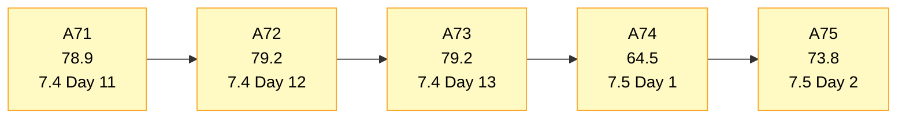
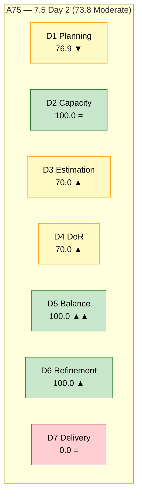
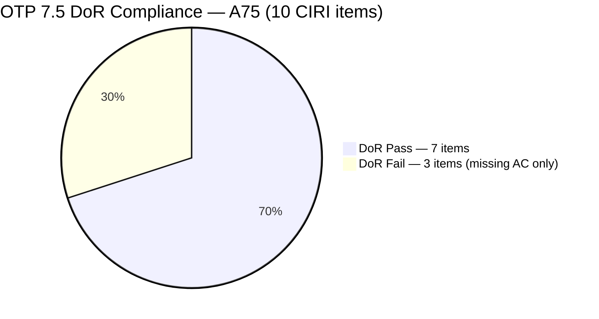
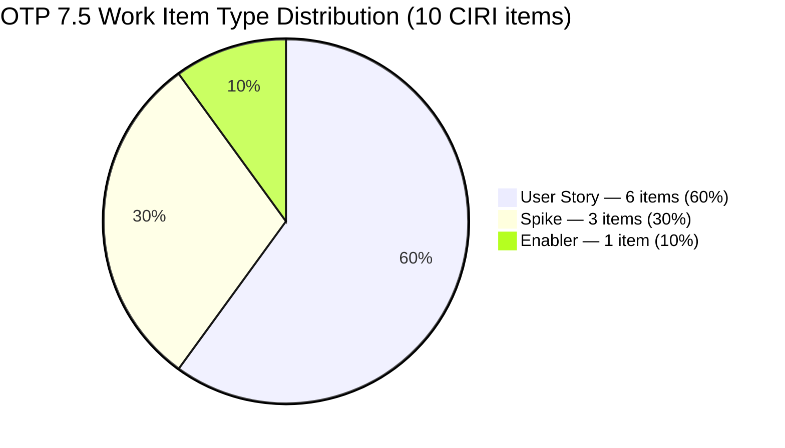
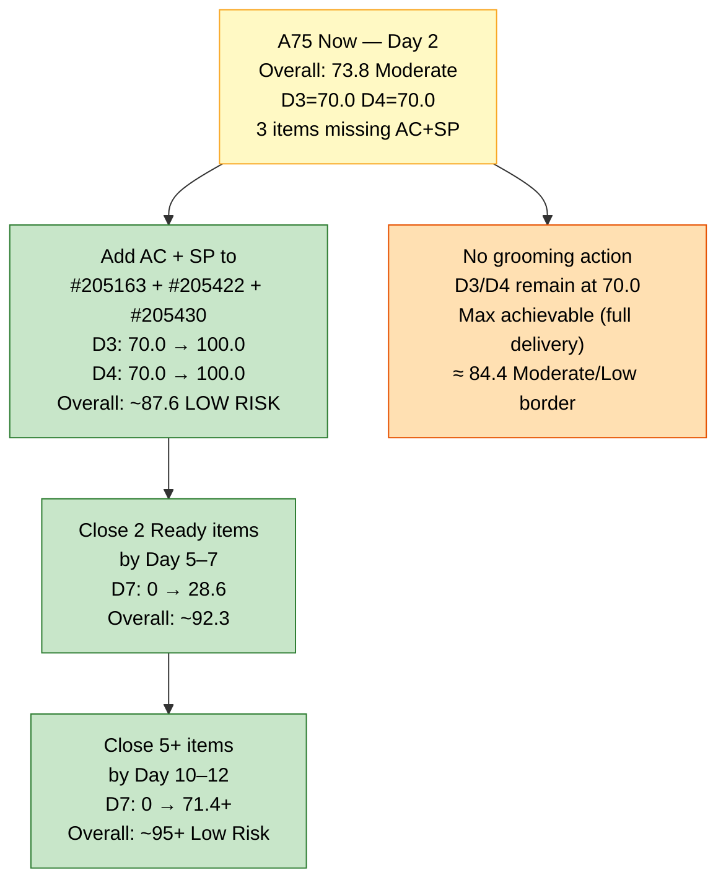

Excellent data. Now I have everything I need to compute scores. Let me analyze:

**Backlog items (VRBI = 13 total):**
- #202912 — Fabrication of Signage — US — Ready — 2SP — Iter 7.5 — Changed 2026-06-01
- #203864 — Release and collect of TCT — US — New — 2SP — Iter **7.6** — Changed 2026-05-21
- #204193 — Philgeps Document Consolidation — US — Ready — 2SP — Iter 7.5 — Changed 2026-06-01
- #204194 — Philgeps Online Submission — US — Ready — 2SP — Iter 7.5 — Changed 2026-06-01
- #205163 — Business Requirements & Workflow Mapping — Spike — Active — null SP — Iter 7.5 — Changed 2026-06-02
- #205240 — Client SOW Verification — US — Active — 2SP — Iter 7.5 — Changed 2026-06-02
- #205241 — Gathering of Akira's Letter Invitation — US — Active — 2SP — Iter 7.5 — Changed 2026-06-02
- #205422 — JDVP DepEd Partnership Appointment — **Enabler** — Active — null SP — Iter 7.5 — Changed 2026-06-02
- #205430 — Gathering requirements for Pag-IBIG Loan — Spike — Active — null SP — Iter 7.5 — Changed 2026-06-02
- #205433 — Execute Pre-Filing Regulatory Compliance — US — New — 2SP — Iter **7.6** — Changed 2026-06-01
- #205438 — Draft Proposal for Chippens AI Inventory System — US — Active — 2SP — Iter 7.5 — Changed 2026-06-02
- #205443 — Exploration of LB Loan Application — Spike — New — 2SP — Iter 7.5 — Changed 2026-06-02
- #205446 — Gather requirements for building loan application — US — New — 2SP — Iter **7.6** — Changed 2026-06-01

**VRBI = 13**

**CIRI (IterationPath = 7.5):**
#202912, #204193, #204194, #205163, #205240, #205241, #205422, #205430, #205438, #205443 = **10 items**

**Non-current (7.6):** #203864, #205433, #205446 = 3 items

Now let me compute all dimensions:

**D1 — Iteration Planning:** 10/13 × 100 = 76.9

**D2 — Team Capacity:**
- Contributors with current work (CW): Grace (has assignments on all 10 CIRI items) = 1
- Contributors with capacity (CC): capacity = 2.15h/day > 0 → 1
- Score: 1/1 × 100 = **100.0**

**D3 — Estimation:**
- PECI (point-eligible): All 10 CIRI items (US, Spike, Enabler all expose SP field) = 10
- ECI (SP > 0): #202912(2), #204193(2), #204194(2), #205240(2), #205241(2), #205438(2), #205443(2) = 7
- Unestimated: #205163 (null SP), #205422 (null SP), #205430 (null SP) = 3
- Score: 7/10 × 100 = **70.0**

**D4 — DoR Compliance:**
Check Description ≥30 chars AND AC ≥20 chars (HTML stripped) for each CIRI item:

- #202912: Desc ✓, AC ✓ → **Pass**
- #204193: Desc ✓, AC ✓ → **Pass**
- #204194: Desc ✓, AC ✓ → **Pass**
- #205163: Desc ✓ (~223 chars), AC = null → **Fail**
- #205240: Desc ✓ (well described), AC ✓ (extensive) → **Pass**
- #205241: Desc ✓ (well described), AC ✓ (extensive) → **Pass**
- #205422: Desc ✓ (~200+ chars), AC = null (no AC field returned) → **Fail**
- #205430: Desc ✓ (~200 chars), AC = null → **Fail**
- #205438: Desc ✓, AC ✓ → **Pass**
- #205443: Desc ✓, AC ✓ → **Pass**

DCI = 7, CIRI = 10 → Score: 7/10 × 100 = **70.0**

**D5 — Work Item Balance:**
CIRI types: US(#202912, #204193, #204194, #205240, #205241, #205438) = 6, Spike(#205163, #205430, #205443) = 3, Enabler(#205422) = 1
- User Story present: Yes → no −40
- Dominant type share: US = 6/10 = 60% → exactly 60%, threshold is > 60% → **No penalty**
- Spike share: 3/10 = 30% < 40% → no −20
- Score: 100 − 0 = **100.0**

Wait, let me re-check: dominant_type_share > 60% triggers −30. 60% is NOT > 60%, so no penalty applies. Score = **100.0**.

**D6 — Backlog Refinement:**
Freshness window: ChangedDate ≥ 2026-04-18 (45 days before 2026-06-02)
- #202912: 2026-06-01 ✓ fresh
- #203864: 2026-05-21 ✓ fresh
- #204193: 2026-06-01 ✓ fresh
- #204194: 2026-06-01 ✓ fresh
- #205163: 2026-06-02 ✓ fresh
- #205240: 2026-06-02 ✓ fresh
- #205241: 2026-06-02 ✓ fresh
- #205422: 2026-06-02 ✓ fresh
- #205430: 2026-06-02 ✓ fresh
- #205433: 2026-06-01 ✓ fresh
- #205438: 2026-06-02 ✓ fresh
- #205443: 2026-06-02 ✓ fresh
- #205446: 2026-06-01 ✓ fresh

All 13 fresh. Base = 13/13 × 100 = 100.0

stale_90 (ChangedDate < 2026-03-04): 0 items
stale_180 (ChangedDate < 2025-12-05): 0 items

Untouched current items (ChangedDate < 2026-06-01, iteration start):
- #202912: 2026-06-01T14:05 — this is ON June 1 or AFTER → NOT before iteration start → Not untouched
- #204193: 2026-06-01T14:05 → touched on day 1 → Not untouched
- #204194: 2026-06-01T14:05 → Not untouched
- #205163: 2026-06-02T08:00 → Not untouched
- #205240: 2026-06-02T08:00 → Not untouched
- #205241: 2026-06-02T08:00 → Not untouched
- #205422: 2026-06-02T08:00 → Not untouched
- #205430: 2026-06-02T07:59 → Not untouched
- #205438: 2026-06-02T08:02 → Not untouched
- #205443: 2026-06-02T03:26 → Not untouched

All 10 CIRI items have ChangedDate ≥ June 1, 2026 (iteration start). Untouched = 0/10 = 0%

No penalties. Score = **100.0**

**D7 — Delivery Predictability:**
- ECI = 7 (items with SP > 0: #202912, #204193, #204194, #205240, #205241, #205438, #205443)
- CSP = 2+2+2+2+2+2+2 = **14 SP**
- Closed/Done states among ECI: Let me check states — #202912 Ready, #204193 Ready, #204194 Ready, #205240 Active, #205241 Active, #205438 Active, #205443 New — none are Closed or Done
- CLSP = 0 SP
- Sprint day: June 1 start, today is June 2 = **Day 2 of 14** (days 1-5 → early-sprint annotation applies)
- Score: 0/14 × 100 = **0.0** (early-sprint — low delivery expected)

**Overall Score:**
(76.9 + 100.0 + 70.0 + 70.0 + 100.0 + 100.0 + 0.0) / 7 = 516.9 / 7 = **73.8 — Moderate Risk**

Now I have all the data to compose the complete report.

# ADO SAFe Audit — Office of the President (OTP Team)

**Audit ID:** A75 | **Report File:** `AUDIT_20260602_HHMM.md` | **Sprint Day:** 2 of 14

---

## 1. Audit Metadata

| Field | Value |
|---|---|
| **Audit ID** | A75 |
| **Report File** | `AUDIT_20260602_0800.md` |
| **Prior Audit** | A74 — `AUDIT_20260601_0203.md` (Overall 64.5, Moderate Risk — 7.5 Day 1) |
| **ADO Project** | OTP (`e7739905-28a3-4ae1-9173-7f6cd13b3494`) |
| **ADO Team** | OTP Team (`64de61f0-1203-4b01-aee2-6b4415aec52b`) |
| **Iteration** | Iteration 7.5 (`d1bb3b59-5d69-4489-987c-c5577c0a3cf1`) |
| **Iteration Dates** | June 1 – June 14, 2026 |
| **Sprint Day** | **2 of 14** |
| **Audit Date** | 2026-06-02 UTC |
| **Overall Score** | **73.8 — Moderate Risk** |
| **Risk Band** | Moderate (60–79.9) |
| **Visible Backlog Items (VRBI)** | 13 open root items |
| **Current Iteration Root Items (CIRI)** | 10 items (IterationPath = Iteration 7.5) |
| **Capacity Source** | `work_get_iteration_capacities` — OTP Team: 2.15h/day (capacity now configured) |
| **Project Exceptions Applied** | Single-assignee model (Grace) — accepted per `CLAUDE.md` |

> **Sprint Day 2 note:** Early-sprint annotation applies (Days 1–5 of 14-day sprint). D7 = 0.0 is expected at Day 2 — no closures yet. Major improvements from Day 1: capacity configured (2.15h/day), three previously blank items (#205240, #205241) now have full Description + AC + Story Points, and five new items were added to the iteration. The backlog grew from 8 to 13 items with 5 new scope entries since A74.

---

## 2. Executive Summary

The OTP team advances to **73.8 — Moderate Risk** on Day 2 of Iteration 7.5, a gain of **+9.3 points** from the Day 1 opening score of 64.5. The improvement reflects meaningful remediation actions taken overnight: capacity has been set (2.15h/day), the two previously blank stubs (#205240 SOW Verification, #205241 Gathering of Akira's Letter Invitation) are now fully groomed with descriptions and acceptance criteria, and five new items were added to the sprint backlog.

The sprint now carries 10 root items with 14 committed story points. Three items still fail DoR (#205163 Spike missing AC, #205422 Enabler missing AC, #205430 Spike missing AC), and three items lack Story Points (#205163, #205422, #205430). Resolving these six gaps would push the overall score to approximately **87.6 (Low Risk)**. The structural User Story balance improved significantly — with the addition of Enabler and Spike items, US dominance dropped to exactly 60%, eliminating the −30 D5 penalty for the first time in recent sprints.

D7 remains 0.0 (Day 2 — early-sprint, expected). With 14 SP committed and Grace's demonstrated throughput, the team is on track for a strong mid-sprint delivery wave.

---

## 3. Previous Audit Delta (A74 → A75)

| Dimension | A74 Score (7.5 Day 1) | A75 Score (7.5 Day 2) | Delta | Driver |
|---|---|---|---|---|
| D1 Iteration Planning | 87.5 | **76.9** | **−10.6** | VRBI grew from 8 → 13 items (5 new items added); 10/13 in 7.5 vs. 7/8. Denominator expansion diluted score. |
| D2 Team Capacity | 100.0 | **100.0** | **0.0** | Capacity now configured at 2.15h/day (was 0.0h). Grace remains sole contributor with work. CC = CW = 1. |
| D3 Estimation | 57.1 | **70.0** | **+12.9** | #205240 and #205241 now have SP (2 each). 7/10 estimated vs. 4/7 previously. 3 still unestimated (#205163, #205422, #205430). |
| D4 DoR Compliance | 57.1 | **70.0** | **+12.9** | #205240 and #205241 now fully DoR-compliant. 7/10 pass vs. 4/7 previously. 3 new items (#205422, #205430) and persistent #205163 still fail. |
| D5 Work Item Balance | 70.0 | **100.0** | **+30.0** | US share dropped from 85.7% to exactly 60% (6/10). Threshold is >60%, so no −30 penalty. 3 Spikes + 1 Enabler diversified the sprint. |
| D6 Backlog Refinement | 80.0 | **100.0** | **+20.0** | All 13 backlog items fresh (all changed ≥ June 1). Zero untouched CIRI items — all 10 were touched on June 1 or 2. No staleness penalties. |
| D7 Delivery Predictability | 0.0 | **0.0** | **0.0** | Day 2 — 0 SP closed. Early-sprint, no delivery expected. |
| **Overall** | **64.5** | **73.8** | **+9.3** | Major structural improvements: D5 +30, D6 +20, D3/D4 +12.9 each. Offset by D1 −10.6 from backlog expansion. |

**Key changes A74 → A75:**
- Capacity configured: 2.15h/day (was 0.0h/day). Sprint load is now plannable.
- #205240 (Client SOW Verification) and #205241 (Gathering of Akira's Letter Invitation) fully remediated — both now have Description, AC, and 2 SP.
- Five new items added to backlog: #205422 (Enabler, 7.5), #205430 (Spike, 7.5), #205433 (US, 7.6), #205438 (US, 7.5), #205443 (Spike, 7.5). Three in 7.5, two in 7.6.
- #205438 (Draft Proposal for Chippens AI Inventory System) added to 7.5 with full DoR compliance.
- #202913 (Installation of Street Signage) has departed the backlog API — likely closed or removed.
- US dominance dropped from 85.7% → 60% — structural D5 penalty eliminated.

---

## 4. Current Iteration Snapshot

| Metric | Value |
|---|---|
| Visible Backlog Items (VRBI) | 13 |
| Current Iteration Root Items (CIRI) | 10 (IterationPath = OTP\2026 - PI7\Iteration 7.5) |
| Non-current Items | 3 (#203864 in 7.6, #205433 in 7.6, #205446 in 7.6) |
| Story Points Committed (CSP) | 14 SP (7 estimated items × 2 SP each) |
| Story Points Closed (CLSP) | 0 SP |
| Delivery Rate | 0% (Day 2 — early-sprint, expected) |
| Team Size (distinct assignees in CIRI) | 1 (Grace — all 10 items assigned to grace@jairosoft.com) |
| Capacity | 2.15h/day — now configured |
| Sprint Day / Total | **Day 2 of 14** |
| Iteration Start / Finish | June 1, 2026 – June 14, 2026 |

---

## 5. Work Item Analysis

### All Current Iteration Items (10 items — IterationPath = Iteration 7.5)

| ID | Title | Type | State | SP | Assignee | DoR | ChangedDate |
|---|---|---|---|---|---|---|---|
| #202912 | Fabrication of Signage | User Story | Ready | 2 | Grace | **Pass** | Jun 1 |
| #204193 | Philgeps Document Consolidation | User Story | Ready | 2 | Grace | **Pass** | Jun 1 |
| #204194 | Philgeps Online Submission | User Story | Ready | 2 | Grace | **Pass** | Jun 1 |
| #205163 | Business Requirements & Workflow Mapping | Spike | Active | — | Grace | **Fail** (no AC) | Jun 2 |
| #205240 | Client SOW Verification | User Story | Active | 2 | Grace | **Pass** | Jun 2 |
| #205241 | Gathering of Akira's Letter Invitation | User Story | Active | 2 | Grace | **Pass** | Jun 2 |
| #205422 | JDVP DepEd Partnership Appointment | Enabler | Active | — | Grace | **Fail** (no AC) | Jun 2 |
| #205430 | Gathering requirements for Pag-IBIG Loan | Spike | Active | — | Grace | **Fail** (no AC) | Jun 2 |
| #205438 | Draft Proposal for Chippens AI Inventory System | User Story | Active | 2 | Grace | **Pass** | Jun 2 |
| #205443 | Exploration of LB Loan Application | Spike | New | 2 | Grace | **Pass** | Jun 2 |

### Non-current Backlog Items (3 items — future iterations)

| ID | Title | Iteration | Type | State | SP | Changed |
|---|---|---|---|---|---|---|
| #203864 | Release and collect of TCT | 7.6 | User Story | New | 2 | May 21 |
| #205433 | Execute Pre-Filing Regulatory Compliance | 7.6 | User Story | New | 2 | Jun 1 |
| #205446 | Gather requirements for building loan application | 7.6 | User Story | New | 2 | Jun 1 |

### Type Distribution (10 CIRI items)

| Type | Count | Share |
|---|---|---|
| User Story | 6 | 60.0% |
| Spike | 3 | 30.0% |
| Enabler | 1 | 10.0% |
| **Total** | **10** | **100%** |

### DoR Gap Detail

| ID | Title | Desc chars | AC chars | Verdict |
|---|---|---|---|---|
| #202912 | Fabrication of Signage | ~108 | ~59 | **Pass** |
| #204193 | Philgeps Document Consolidation | ~112 | ~91 | **Pass** |
| #204194 | Philgeps Online Submission | ~88 | ~38 | **Pass** |
| #205163 | Business Requirements & Workflow Mapping | ~223 | 0 (null) | **Fail — no AC** |
| #205240 | Client SOW Verification | ~200+ | ~400+ | **Pass** |
| #205241 | Gathering of Akira's Letter Invitation | ~200+ | ~400+ | **Pass** |
| #205422 | JDVP DepEd Partnership Appointment | ~200+ | 0 (null) | **Fail — no AC** |
| #205430 | Gathering requirements for Pag-IBIG Loan | ~180+ | 0 (null) | **Fail — no AC** |
| #205438 | Draft Proposal for Chippens AI Inventory System | ~200+ | ~400+ | **Pass** |
| #205443 | Exploration of LB Loan Application | ~200+ | ~300+ | **Pass** |

---

## 6. SAFe Compliance Scorecard

| Dimension | Score | Band | Evidence | Notes |
|---|---|---|---|---|
| D1 Iteration Planning | **76.9** | Moderate | 10 CIRI / 13 VRBI | Backlog grew by 5 items since Day 1. 3 items staged in 7.6 (appropriate forward planning). D1 diluted by denominator expansion. |
| D2 Team Capacity | **100.0** | Low | 1/1 contributor with capacity | Grace: 2.15h/day now configured. Single-assignee model accepted per Project Exception. |
| D3 Estimation | **70.0** | Moderate | 7 ECI / 10 PECI | 3 items unestimated: #205163 (Spike), #205422 (Enabler), #205430 (Spike). Must be estimated by Day 3. |
| D4 DoR Compliance | **70.0** | Moderate | 7 DCI / 10 CIRI | 3 items fail DoR: #205163 (no AC), #205422 (no AC), #205430 (no AC). All have descriptions. Only AC is missing. |
| D5 Work Item Balance | **100.0** | Low | US 60.0% — threshold not exceeded | Structural penalty eliminated. 6 US + 3 Spikes + 1 Enabler. US = exactly 60% — NOT >60%, no −30 applied. Best D5 in recent audit history. |
| D6 Backlog Refinement | **100.0** | Low | 13/13 fresh, 0 untouched | All 13 items changed ≥ June 1. All 10 CIRI items touched on/after sprint start. Zero staleness penalties. |
| D7 Delivery Predictability | **0.0** | Critical | 0 SP closed / 14 SP committed | Sprint Day 2 — early-sprint, low delivery expected. 14 SP committed across 7 estimated items. |
| **OVERALL** | **73.8** | **Moderate** | (76.9+100.0+70.0+70.0+100.0+100.0+0.0)/7 | +9.3 from A74. D5/D6 at ceiling. Remaining levers: D3/D4 gaps (3 items need AC), D7 delivery execution. |

**Formula verification:** (76.9 + 100.0 + 70.0 + 70.0 + 100.0 + 100.0 + 0.0) / 7 = 516.9 / 7 = **73.8**

---

## 7. Dimension Findings

### D1 — Iteration Planning: 76.9 / 100 — Moderate Risk

**Formula:** CIRI / VRBI × 100 = 10 / 13 × 100 = **76.9**

| Metric | Value |
|---|---|
| Visible root backlog items (VRBI) | 13 |
| Items assigned to Iteration 7.5 (CIRI) | 10 |
| Items in future iterations (not CIRI) | 3 — #203864 (7.6), #205433 (7.6), #205446 (7.6) |
| Score | **76.9** |

D1 declined from 87.5 (A74) to 76.9 due to backlog expansion — five new items were added since Day 1, of which two (#205433, #205446) were staged in 7.6. While the three future-iteration items represent appropriate forward staging, the net effect dilutes D1. The 7.6 staging is SAFe-compliant behavior. If the three 7.6 items were removed from the visible backlog (i.e., closed or hidden), D1 would rise to 100.0. The more appropriate path is to ensure 7.5 is not overloaded — 10 items for a single-person team in 14 days with only 2.15h/day available is already a significant workload challenge.

**Load assessment:** Grace has 2.15h/day × 14 days = 30.1 hours of sprint capacity for 14 SP. At roughly 2 SP per 2-3 hours, the sprint is potentially achievable but tight.

---

### D2 — Team Capacity: 100.0 / 100 — Low Risk

**Formula:** CC / CW × 100 = 1 / 1 × 100 = **100.0**

| Metric | Value |
|---|---|
| Contributors with work on CIRI (CW) | 1 — Grace (all 10 CIRI items assigned) |
| Contributors with capacity (CC) | 1 — Grace: 2.15h/day, 0 days off |
| Total team capacity | 2.15h/day × 14 sprint days = 30.1 hours |
| Score | **100.0** |

Major improvement from A74 where capacity was 0.0h/day. Grace's capacity for 7.5 is now configured at 2.15h/day, providing a plannable sprint baseline. Per Project Exception, the single-assignee model is accepted — no bus factor penalty applied. The capacity of 2.15h/day is consistent with Grace's administrative/operational role profile.

---

### D3 — Estimation: 70.0 / 100 — Moderate Risk

**Formula:** ECI / PECI × 100 = 7 / 10 × 100 = **70.0**

| # | Title | Type | SP | Estimated? |
|---|---|---|---|---|
| #202912 | Fabrication of Signage | User Story | 2 | Yes |
| #204193 | Philgeps Document Consolidation | User Story | 2 | Yes |
| #204194 | Philgeps Online Submission | User Story | 2 | Yes |
| #205163 | Business Requirements & Workflow Mapping | Spike | — | **No (null SP)** |
| #205240 | Client SOW Verification | User Story | 2 | Yes |
| #205241 | Gathering of Akira's Letter Invitation | User Story | 2 | Yes |
| #205422 | JDVP DepEd Partnership Appointment | Enabler | — | **No (null SP)** |
| #205430 | Gathering requirements for Pag-IBIG Loan | Spike | — | **No (null SP)** |
| #205438 | Draft Proposal for Chippens AI Inventory System | User Story | 2 | Yes |
| #205443 | Exploration of LB Loan Application | Spike | 2 | Yes |

| Metric | Value |
|---|---|
| Point-eligible current items (PECI) | 10 |
| Estimated current items (ECI) | 7 |
| Un-estimated items | 3 (#205163, #205422, #205430) |
| Score | **70.0** |

Improved from 57.1 (A74) after #205240 and #205241 received Story Points. Three new/existing items remain unestimated: the Spike #205163 (present since A74 with no SP), the new Enabler #205422 (added this sprint), and the new Spike #205430 (added this sprint). All three have descriptions but no SP. Per rubric, Spike and Enabler types are point-eligible and must carry SP > 0. Estimating all three at 2 SP each would push D3 to 100.0 and raise Overall to approximately 87.6.

---

### D4 — DoR Compliance: 70.0 / 100 — Moderate Risk

**Formula:** DCI / CIRI × 100 = 7 / 10 × 100 = **70.0**

| # | Title | Desc ≥30 | AC ≥20 | Pass |
|---|---|---|---|---|
| #202912 | Fabrication of Signage | ✓ | ✓ | **Pass** |
| #204193 | Philgeps Document Consolidation | ✓ | ✓ | **Pass** |
| #204194 | Philgeps Online Submission | ✓ | ✓ | **Pass** |
| #205163 | Business Requirements & Workflow Mapping | ✓ (~223 chars) | ✗ (null) | **Fail — no AC** |
| #205240 | Client SOW Verification | ✓ | ✓ | **Pass** |
| #205241 | Gathering of Akira's Letter Invitation | ✓ | ✓ | **Pass** |
| #205422 | JDVP DepEd Partnership Appointment | ✓ | ✗ (null) | **Fail — no AC** |
| #205430 | Gathering requirements for Pag-IBIG Loan | ✓ | ✗ (null) | **Fail — no AC** |
| #205438 | Draft Proposal for Chippens AI Inventory System | ✓ | ✓ | **Pass** |
| #205443 | Exploration of LB Loan Application | ✓ | ✓ | **Pass** |

| Metric | Value |
|---|---|
| CIRI | 10 |
| DoR-compliant items (DCI) | 7 |
| Non-compliant items | 3 |
| Score | **70.0** |

Improved from 57.1 (A74) after #205240 and #205241 were fully remediated with comprehensive descriptions and acceptance criteria. Three items still fail DoR — the common pattern is: descriptions are present and well-written, but Acceptance Criteria fields are null. This is a targeted, easily-fixed gap. Adding AC to #205163, #205422, and #205430 would restore D4 to 100.0 and raise Overall by approximately 4.3 points.

---

### D5 — Work Item Balance: 100.0 / 100 — Low Risk

**Formula:** Base 100 − penalties applied independently

| Penalty | Trigger | Calculated | Applied |
|---|---|---|---|
| −40: no User Story type in CIRI | User Story present (6 of 10 items) | — | **No** |
| −30: dominant_type_share > 60% | User Story = 6/10 = 60.0% — NOT > 60% | No | **No** |
| −20: spike_share > 40% | Spike = 3/10 = 30.0% < 40% | — | **No** |

**Score:** 100 − 0 = **100.0**

This is the first time D5 has reached 100.0 in multiple audit cycles. The addition of one Enabler (#205422) and two new Spikes (#205430, #205443) brought the sprint composition to a healthy 6 User Stories, 3 Spikes, 1 Enabler. User Story share landed precisely at 60% — the threshold is strictly >60%, so no penalty applies. This is a meaningful structural improvement from the persistent 85.7% US dominance of prior sprints. To sustain this in future iterations, the team should aim to include at least 3–4 non-US items per sprint.

---

### D6 — Backlog Refinement: 100.0 / 100 — Low Risk

**Freshness window:** Items with ChangedDate ≥ 2026-04-18 (45 days before 2026-06-02)

| Metric | Value |
|---|---|
| Total visible backlog items (VRBI) | 13 |
| Fresh items (ChangedDate ≥ Apr 18, 2026) | 13 — oldest: May 21 (#203864) |
| stale_90 items (ChangedDate < 2026-03-04) | 0 |
| stale_180 items (ChangedDate < 2025-12-05) | 0 |
| Base score | 13/13 × 100 = 100.0 |

**Penalty calculation:**

| Penalty | Trigger | Calculated | Applied |
|---|---|---|---|
| −20 (stale_90 > 25%) | 0/13 = 0% | — | No |
| −10 (stale_90 > 10%) | 0/13 = 0% | — | No |
| −20 (stale_180 ≥ 1 item) | 0 items | — | No |
| −20 (untouched/CIRI > 30%) | 0/10 = 0% — all touched June 1-2 | — | **No** |

**Score:** max(0, 100.0 − 0) = **100.0**

Full recovery from the −20 untouched penalty seen in A74 (Day 1). All 10 CIRI items have ChangedDate on or after June 1 (sprint start), with most updated on June 2 (today). The backlog is 100% fresh with zero staleness. The team's proactive grooming activity on sprint days 1–2 drove this improvement. D6 ceiling is maintained as long as Grace continues to touch items regularly.

---

### D7 — Delivery Predictability: 0.0 / 100 — Critical

**Formula:** CLSP / CSP × 100 = 0 / 14 × 100 = **0.0**

> **Early-sprint annotation:** Sprint Day 2 of 14 — low delivery is expected at this stage. The 0.0 score reflects the normal sprint state in the early window (Days 1–5). This is NOT a delivery failure.

| Metric | Value |
|---|---|
| Point-eligible current items (PECI) | 10 |
| Estimated current items (ECI) | 7 (#202912, #204193, #204194, #205240, #205241, #205438, #205443) |
| Committed Story Points (CSP) | 7 × 2 SP = **14 SP** |
| Closed/Done items in ECI | 0 |
| Closed Story Points (CLSP) | 0 SP |
| Score | **0.0** |

With 14 SP committed across 7 estimated items, the sprint baseline is solid — significantly higher than the A74 baseline of 8 SP. Three CIRI items (#202912, #204193, #204194) are in "Ready" state, suggesting they are groomed and ready for execution. Grace's historical throughput from prior sprints (7.4 closed at 25 SP, 7.5 has 14 SP committed with room to add 6 more if #205163/#205422/#205430 are estimated) indicates a realistic delivery path.

**Projected D7 recovery path:**

| Sprint Day | Scenario | SP Closed / CSP | D7 | Overall |
|---|---|---|---|---|
| Day 2 (now) | Current | 0/14 | 0.0 | 73.8 |
| Day 5–7 | Close 2 Ready items | 4/14 | 28.6 | ~78.9 |
| Day 8–10 | Close 4 items (mid-sprint) | 8/14 | 57.1 | ~84.1 |
| Day 12–14 | Close 7+ items | 14/14 | 100.0 | ~95.3 |

---

## 8. Risks and Bottlenecks

| # | Severity | Dimension | Risk | Action |
|---|---|---|---|---|
| R1 | **HIGH** | D3 + D4 | Three CIRI items lack Acceptance Criteria: #205163 (Business Requirements & Workflow Mapping — Spike), #205422 (JDVP DepEd Partnership Appointment — Enabler), #205430 (Gathering requirements for Pag-IBIG Loan — Spike). All have well-written descriptions but null AC fields. | Grace: add AC to all three items today (Day 2). Fixing all three raises D3 to 100.0, D4 to 100.0, and Overall from 73.8 → ~87.6 (Low Risk). |
| R2 | **HIGH** | D3 | Same three items (#205163, #205422, #205430) have null Story Points. All are Spike or Enabler types — rubric requires SP > 0. | Grace: estimate all three items. Based on comparable OTP items, 2 SP each is reasonable. Adds 6 SP to CSP (14→20 SP total). |
| R3 | **MEDIUM** | D1 | Backlog grew from 8 to 13 items in one day. Sprint now has 10 CIRI items for a single contributor with 2.15h/day capacity (30.1 total sprint hours). 14 SP committed may approach Grace's capacity ceiling. | Ramon/Grace: review sprint load. Verify that 14+ SP is achievable within 30h capacity. Consider moving 1–2 items to 7.6 if overloaded. |
| R4 | **MEDIUM** | D7 | No story points closed after 2 sprint days. Three "Ready" items (#202912, #204193, #204194) are groomed and ready for execution. If these remain in "Ready" past Day 5, D7 recovery will be at risk. | Grace: begin execution on at least one "Ready" item by Day 3. Transitioning to "Active" → "Closed" on Philgeps Document Consolidation or Fabrication of Signage is the fastest path to first SP closure. |
| R5 | **LOW** | D1 | Three 7.6 items (#203864, #205433, #205446) are future-staged. If more 7.6 items are added without equivalent closures in 7.5, D1 will continue declining. | Monitor VRBI growth. New items should be added to 7.6+ only when 7.5 capacity is confirmed exhausted. |
| R6 | **LOW** | Structural | Grace is sole assignee for all 10 CIRI items. Any unavailability creates a full sprint stall. | Project Exception acknowledged. For continuity risk awareness, ensure Grace has a documented delegation path for critical items (SOW Verification, DepEd Appointment). |

---

## 9. Prioritized Recommendations

1. **[HIGH — TODAY Day 2]** Add Acceptance Criteria to #205163 (Business Requirements & Workflow Mapping), #205422 (JDVP DepEd Partnership Appointment), and #205430 (Gathering requirements for Pag-IBIG Loan). All three have strong descriptions — only AC is missing. Fixing all three in one session recovers D4 from 70.0 → 100.0, D3 from 70.0 → 100.0, and raises Overall from 73.8 → approximately 87.6 (Low Risk threshold crossed).

2. **[HIGH — TODAY Day 2]** Add Story Points to #205163, #205422, and #205430. Recommended: 2 SP each (consistent with comparable OTP items). This raises CSP from 14 → 20 SP and provides a more accurate D7 baseline.

3. **[MEDIUM — Day 3–5]** Begin execution on "Ready" items. Three CIRI items are in "Ready" state — groomed and approved for execution: #202912 (Fabrication of Signage), #204193 (Philgeps Document Consolidation), #204194 (Philgeps Online Submission). Closing even one of these by Day 5 establishes D7 > 0 and demonstrates sprint momentum.

4. **[MEDIUM — Day 3]** Review sprint load. 10 items for Grace at 2.15h/day (30.1h total) is ambitious. Validate that the sprint commitment is realistic. If overloaded, move #205443 (Exploration of LB Loan Application) or #205430 (Gathering requirements for Pag-IBIG Loan) to Iteration 7.6 to maintain delivery predictability.

5. **[MEDIUM — Days 4–7]** Transition Active items to Closed as work completes. #205240 (SOW Verification), #205241 (Gathering of Akira's Letter Invitation), #205438 (Draft Proposal for Chippens AI Inventory System) are all Active — daily status updates and closure upon completion will drive D7 recovery.

6. **[LOW — Ongoing]** Maintain backlog freshness discipline. All 13 items are currently fresh (100% D6). Keep ChangedDates current by updating states, adding comments, or logging progress notes regularly.

7. **[LOW — 7.6 Planning]** Three items staged for 7.6 (#203864, #205433, #205446) are all DoR-compliant or partially compliant. Groom #205446 (Gather requirements for building loan application) which has no AC before 7.6 sprint planning begins.

---

## 10. Visualizations

### Score Trend (A71 → A75)

### Dimension Scorecard — A75 vs A74

### DoR Status — 7.5 CIRI Items (10 items)

### Work Item Type Distribution — 7.5 CIRI

### Score Recovery Path — If Remaining Gaps Fixed Today

---

## 11. Evidence Gaps and Limitations

| Gap | Impact | Notes |
|---|---|---|
| #202913 (Installation of Street Signage) absent from backlog API | Context gap | This item was visible in A74 (7.5, Active, 2SP). It no longer appears in the backlog or iteration API. It may have been closed, removed from the team backlog, or moved. Its closure would not be counted in D7 as it is not present in the current CIRI. |
| #205422 and #205430 AC field absent from API response | D4 precision | Both items returned no AcceptanceCriteria field in the batch response (field not present, treated as null → 0 chars). DoR Fail is definitive for both. |
| #205163 AC field absent from API response | D4 precision | Spike #205163 returned null AcceptanceCriteria (persistent from A74). DoR Fail is definitive. |
| Spike/Enabler SP rubric treatment | D3 note | Spike (#205163, #205430, #205443) and Enabler (#205422) types are included in PECI per rubric. Common practice is to time-box Spikes, but the rubric requires SP > 0 for inclusion in ECI. #205443 has 2 SP (passes); #205163, #205430, #205422 have null SP (fail). |
| 7.5 capacity validation | D2 note | Capacity of 2.15h/day is newly configured. The value has been accepted as entered. At 2.15h/day × 14 days = 30.1h sprint capacity, the 14 SP commitment assumes roughly 2.15h per SP point — tight but achievable for administrative work items. |
| Closed 7.4 items not visible | Historical context | Items closed in Iteration 7.4 (prior sprint) no longer appear in the backlog API. This audit covers 7.5 only; 7.4 final delivery data is not re-audited here. |

---

## 12. Audit Trail

| Source | Tool Used | Data Retrieved |
|---|---|---|
| Current iteration | `work_list_team_iterations` (project `e7739905-28a3-4ae1-9173-7f6cd13b3494`, team `64de61f0-1203-4b01-aee2-6b4415aec52b`, timeframe=current) | Iteration 7.5: June 1–14, 2026; ID `d1bb3b59-5d69-4489-987c-c5577c0a3cf1` (timeFrame=1 = current) |
| Backlog items | `wit_list_backlog_work_items` (backlogId `Microsoft.RequirementCategory`) | 13 open root items: #205422, #205241, #205240, #202912, #203864, #204193, #204194, #205163, #205430, #205433, #205438, #205443, #205446 |
| Iteration items | `wit_get_work_items_for_iteration` (iterationId `d1bb3b59-5d69-4489-987c-c5577c0a3cf1`) | 10 root items in 7.5 + child tasks identified |
| Work item details | `wit_get_work_items_batch_by_ids` (13 items) | SP, State, Type, Desc, AC, ChangedDate, IterationPath, AssignedTo confirmed for all 13 items |
| Team capacity | `work_get_iteration_capacities` (project `e7739905-28a3-4ae1-9173-7f6cd13b3494`, iterationId `d1bb3b59-5d69-4489-987c-c5577c0a3cf1`) | OTP Team: 2.15h/day, 0 days off |
| Prior audit | `AUDIT_20260601_0203.md` (A74) | Overall 64.5, Moderate Risk, 7.5 Day 1, 8 VRBI, 7 CIRI, 8 SP committed, 0 SP closed |
