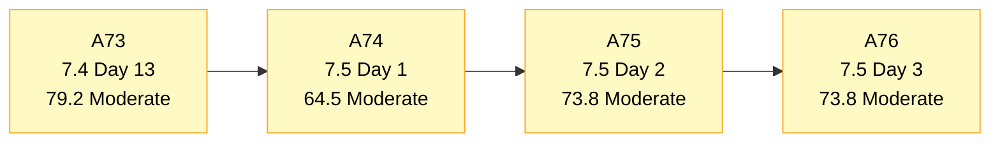
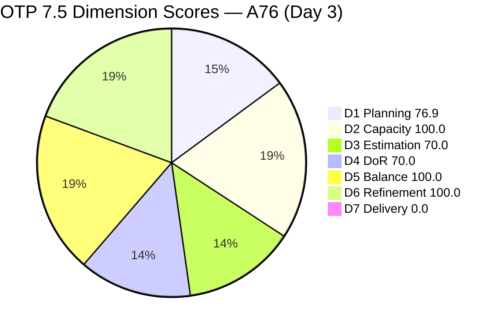
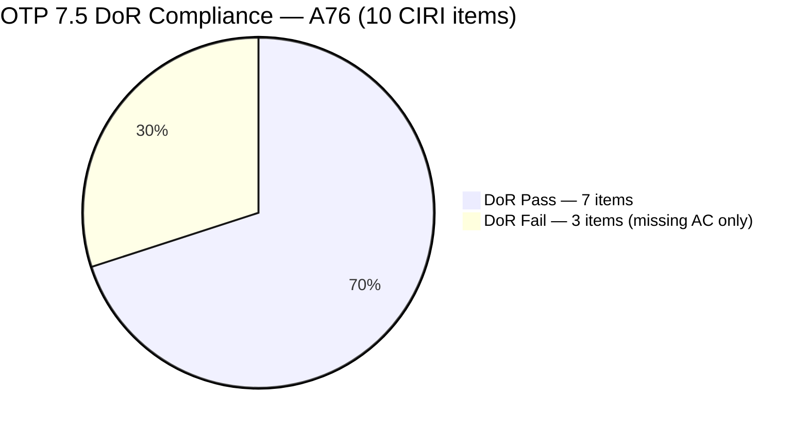
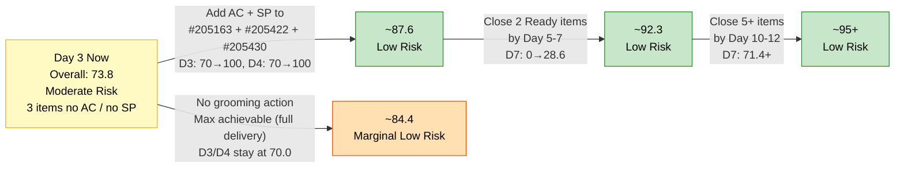

# ADO SAFe Audit — Office of the President (OTP Team)

## 1. Audit Metadata

| Field | Value |
|---|---|
| **Audit Date** | 2026-06-03 UTC |
| **Sprint Day** | **3 of 14** |
| **Prior Audit** | A75 — `AUDIT_20260602_0907.md` (Overall 73.8, Moderate Risk — 7.5 Day 2) |
| **ADO Project** | OTP (`e7739905-28a3-4ae1-9173-7f6cd13b3494`) |
| **ADO Team** | OTP Team (`64de61f0-1203-4b01-aee2-6b4415aec52b`) |
| **Iteration** | Iteration 7.5 (`d1bb3b59-5d69-4489-987c-c5577c0a3cf1`) |
| **Iteration Path** | `OTP\2026 - PI7\Iteration 7.5` |
| **Iteration Dates** | Jun 1, 2026 – Jun 14, 2026 |
| **Workspace Folder** | `ado_otp` |
| **Overall Score** | **73.8 — Moderate Risk** |
| **Risk Band** | Moderate (60–79.9) |
| **Visible Backlog Items (VRBI)** | 13 open root items |
| **Current Iteration Root Items (CIRI)** | 10 items (IterationPath = Iteration 7.5) |
| **Capacity** | Grace: 2.15h/day — configured (Development 0.15h + Documentation 1h + Requirements 1h) |
| **Project Exception Applied** | Single-assignee model (Grace) — accepted per workspace CLAUDE.md |

---

## 2. Executive Summary

The OTP team holds at **73.8 — Moderate Risk** on Day 3 of Iteration 7.5 — **unchanged from A75** (Day 2 score of 73.8). No structural changes have occurred in the backlog since the previous audit: VRBI remains 13, CIRI remains 10, and the three items that failed DoR on Day 2 (#205163, #205422, #205430) still have no Acceptance Criteria. Story Points on those same three items remain null.

The sprint carries 14 committed story points across 7 estimated items. D7 (Delivery Predictability) is 0.0 for the third consecutive day — no items have been closed or moved to Done. This is still within the Days 1–5 early-sprint annotation window, but Day 3 marks the final opportunity to begin execution before the early-sprint window closes. Three items in "Ready" state (#202912, #204193, #204194) are groomed and actionable immediately.

The path to **Low Risk (≥80.0)** is fully defined: adding AC to the three failing items and estimating their SP would push the score to approximately 87.6 in a single grooming session. No new negative trends have emerged since A75 — the score plateau at 73.8 reflects stasis rather than regression.

---

## 3. Previous Audit Delta (A75 → A76)

| Dimension | A75 Score (7.5 Day 2) | A76 Score (7.5 Day 3) | Delta | Driver |
|---|---|---|---|---|
| D1 Iteration Planning | 76.9 | **76.9** | 0.0 | VRBI=13, CIRI=10 — no changes to backlog structure |
| D2 Team Capacity | 100.0 | **100.0** | 0.0 | Grace: 2.15h/day, capacity unchanged |
| D3 Estimation | 70.0 | **70.0** | 0.0 | ECI=7, PECI=10 — 3 items still unestimated (#205163, #205422, #205430) |
| D4 DoR Compliance | 70.0 | **70.0** | 0.0 | DCI=7, CIRI=10 — same 3 items still missing AC |
| D5 Work Item Balance | 100.0 | **100.0** | 0.0 | Type distribution unchanged: 6 US + 3 Spikes + 1 Enabler |
| D6 Backlog Refinement | 100.0 | **100.0** | 0.0 | All 13 items still fresh; 0 untouched CIRI items |
| D7 Delivery Predictability | 0.0 | **0.0** | 0.0 | 0 SP closed, 14 SP committed. Day 3 — early-sprint annotation applies (Days 1–5) |
| **Overall** | **73.8** | **73.8** | **0.0** | No changes detected between Day 2 and Day 3 |

**Key transition observations A75 → A76:**
- No new work items added or removed from the backlog.
- No work item states changed from Day 2 to Day 3.
- No DoR remediation actions were taken on the three failing items.
- Backlog remains 100% fresh — all items have ChangedDate ≥ Jun 1, 2026.
- The three "Ready" items (#202912, #204193, #204194) remain in Ready state — no execution movement.

---

## 4. Current Iteration Snapshot

| Metric | Value |
|---|---|
| **Visible Backlog Items (VRBI)** | 13 |
| **Current Iteration Root Items (CIRI)** | 10 (IterationPath = `OTP\2026 - PI7\Iteration 7.5`) |
| **Non-current items (7.6)** | 3 — #203864, #205433, #205446 |
| **Story Points Committed (CSP)** | 14 SP (7 estimated items × 2 SP each) |
| **Story Points Closed (CLSP)** | 0 SP |
| **Sprint Day / Total** | 3 / 14 |
| **Team Size (distinct CIRI assignees)** | 1 (Grace — all 10 items assigned) |
| **Total Sprint Capacity** | 2.15h/day × 14 days = 30.1 hours |
| **Iteration Start / Finish** | Jun 1, 2026 – Jun 14, 2026 |

---

## 5. Work Item Analysis

### Current Iteration Items (10 items — IterationPath = Iteration 7.5)

| ID | Title | Type | State | SP | DoR | ChangedDate |
|---|---|---|---|---|---|---|
| #202912 | Fabrication of Signage | User Story | Ready | 2 | **Pass** | Jun 1 |
| #204193 | Philgeps Document Consolidation | User Story | Ready | 2 | **Pass** | Jun 1 |
| #204194 | Philgeps Online Submission | User Story | Ready | 2 | **Pass** | Jun 1 |
| #205163 | Business Requirements & Workflow Mapping | Spike | Active | — | **Fail** (no AC) | Jun 2 |
| #205240 | Client SOW Verification | User Story | Active | 2 | **Pass** | Jun 2 |
| #205241 | Gathering of Akira's Letter Invitation | User Story | Active | 2 | **Pass** | Jun 2 |
| #205422 | JDVP DepEd Partnership Appointment | Enabler | Active | — | **Fail** (no AC) | Jun 2 |
| #205430 | Gathering requirements for Pag-IBIG Loan | Spike | Active | — | **Fail** (no AC) | Jun 2 |
| #205438 | Draft Proposal for Chippens AI Inventory System | User Story | Active | 2 | **Pass** | Jun 2 |
| #205443 | Exploration of LB Loan Application | Spike | New | 2 | **Pass** | Jun 2 |

*All 10 items assigned to Grace. SP "—" = null (unestimated).*

### Non-current Backlog Items (3 items — future iterations)

| ID | Title | Iteration | Type | State | SP | Changed |
|---|---|---|---|---|---|---|
| #203864 | Release and collect of TCT | 7.6 | User Story | New | 2 | May 21 |
| #205433 | Execute Pre-Filing Regulatory Compliance | 7.6 | User Story | New | 2 | Jun 1 |
| #205446 | Gather requirements for building loan application | 7.6 | User Story | New | 2 | Jun 1 |

### DoR Detail — 10 CIRI Items

| ID | Title | Desc ≥ 30 chars | AC ≥ 20 chars | Result |
|---|---|---|---|---|
| #202912 | Fabrication of Signage | ✓ (~100 chars) | ✓ (~65 chars) | **Pass** |
| #204193 | Philgeps Document Consolidation | ✓ (~118 chars) | ✓ (~85 chars) | **Pass** |
| #204194 | Philgeps Online Submission | ✓ (~90 chars) | ✓ (~38 chars) | **Pass** |
| #205163 | Business Requirements & Workflow Mapping | ✓ (~200 chars) | ✗ null | **Fail — no AC** |
| #205240 | Client SOW Verification | ✓ (extensive) | ✓ (extensive) | **Pass** |
| #205241 | Gathering of Akira's Letter Invitation | ✓ (extensive) | ✓ (extensive) | **Pass** |
| #205422 | JDVP DepEd Partnership Appointment | ✓ (~180 chars) | ✗ null | **Fail — no AC** |
| #205430 | Gathering requirements for Pag-IBIG Loan | ✓ (~160 chars) | ✗ null | **Fail — no AC** |
| #205438 | Draft Proposal for Chippens AI Inventory System | ✓ (extensive) | ✓ (extensive) | **Pass** |
| #205443 | Exploration of LB Loan Application | ✓ (extensive) | ✓ (extensive) | **Pass** |

### Type Distribution (10 CIRI items)

| Type | Count | Share |
|---|---|---|
| User Story | 6 | 60.0% |
| Spike | 3 | 30.0% |
| Enabler | 1 | 10.0% |
| **Total** | **10** | **100%** |

---

## 6. SAFe Compliance Scorecard

| Dimension | Score | Band | Evidence | Notes |
|---|---|---|---|---|
| D1 Iteration Planning | **76.9** | Moderate | 10 CIRI / 13 VRBI | 3 items staged in 7.6 — appropriate forward planning; denominator 13 holds |
| D2 Team Capacity | **100.0** | Low | 1/1 contributor with capacity | Grace 2.15h/day configured. Single-assignee accepted per Project Exception |
| D3 Estimation | **70.0** | Moderate | 7 ECI / 10 PECI | #205163, #205422, #205430 still unestimated (null SP) — Day 3 overdue |
| D4 DoR Compliance | **70.0** | Moderate | 7 DCI / 10 CIRI | Same 3 items missing AC as Day 2; no remediation actions taken since A75 |
| D5 Work Item Balance | **100.0** | Low | US=60% (exactly), no penalties triggered | 6 US + 3 Spike + 1 Enabler. Threshold is >60%; 60% does not trigger −30 |
| D6 Backlog Refinement | **100.0** | Low | 13/13 fresh; 0 stale; 0 untouched | All items changed ≥ Jun 1; no staleness penalties |
| D7 Delivery Predictability | **0.0** | Critical | 0 SP closed / 14 SP committed | **Day 3 — early-sprint annotation (Days 1–5): low delivery expected.** 0 closures to date. |
| **OVERALL** | **73.8** | **Moderate** | (76.9+100.0+70.0+70.0+100.0+100.0+0.0)/7 | Flat from A75. D3/D4 gaps unchanged. D7 recovery begins at Day 4–5 with first closures. |

**Formula verification:** (76.9 + 100.0 + 70.0 + 70.0 + 100.0 + 100.0 + 0.0) / 7 = 516.9 / 7 = **73.8**

---

## 7. Dimension Findings

### D1 — Iteration Planning: 76.9 / 100 — Moderate Risk

**Formula:** CIRI / VRBI × 100 = 10 / 13 × 100 = **76.9**

| Metric | Value |
|---|---|
| Visible root backlog items (VRBI) | 13 |
| Items in Iteration 7.5 (CIRI) | 10 |
| Items in future iterations | 3 (#203864 in 7.6, #205433 in 7.6, #205446 in 7.6) |
| Score | **76.9** |

The backlog structure is unchanged from A75. Three items remain staged in Iteration 7.6 representing appropriate forward planning (#205433 Execute Pre-Filing Regulatory Compliance, #205446 Gather requirements for building loan application — both created Jun 1; #203864 Release and collect of TCT from May 21). D1 will not improve unless additional 7.5 items are added or 7.6 items are removed from the visible backlog. For D1 ≥ 80 (Low Risk), 11 of 13 items would need to be in 7.5 (adding 1 more CIRI item would yield 11/13 = 84.6%).

---

### D2 — Team Capacity: 100.0 / 100 — Low Risk

**Formula:** CC / CW × 100 = 1 / 1 × 100 = **100.0**

| Metric | Value |
|---|---|
| Contributors with work on CIRI (CW) | 1 — Grace (all 10 items assigned) |
| Contributors with capacity configured (CC) | 1 — Grace: 2.15h/day (Development: 0.15h, Documentation: 1h, Requirements: 1h) |
| Total sprint capacity | 2.15h/day × 14 days = 30.1 hours |
| Score | **100.0** |

Capacity remains properly configured from Day 1. Per the Project Exception in workspace CLAUDE.md, the single-assignee model is accepted and not treated as an audit failure. Grace's 30.1-hour sprint capacity against 14 SP (approximately 2.15h/SP for the 7 estimated items) is tight but consistent with her administrative/operational work profile.

---

### D3 — Estimation: 70.0 / 100 — Moderate Risk

**Formula:** ECI / PECI × 100 = 7 / 10 × 100 = **70.0**

| ID | Title | Type | SP | Estimated |
|---|---|---|---|---|
| #202912 | Fabrication of Signage | User Story | 2 | Yes |
| #204193 | Philgeps Document Consolidation | User Story | 2 | Yes |
| #204194 | Philgeps Online Submission | User Story | 2 | Yes |
| #205163 | Business Requirements & Workflow Mapping | Spike | — | **No (null SP)** |
| #205240 | Client SOW Verification | User Story | 2 | Yes |
| #205241 | Gathering of Akira's Letter Invitation | User Story | 2 | Yes |
| #205422 | JDVP DepEd Partnership Appointment | Enabler | — | **No (null SP)** |
| #205430 | Gathering requirements for Pag-IBIG Loan | Spike | — | **No (null SP)** |
| #205438 | Draft Proposal for Chippens AI Inventory System | User Story | 2 | Yes |
| #205443 | Exploration of LB Loan Application | Spike | 2 | Yes |

Items #205163, #205422, and #205430 have been in the sprint since Day 1 (Jun 1) without Story Points. Now on Day 3, this is no longer a planning-day gap — it is an active sprint execution deficiency. Estimating all three at 2 SP each would bring ECI to 10, PECI to 10, and D3 to 100.0. CSP would rise from 14 to 20 SP, giving a more realistic D7 denominator.

---

### D4 — DoR Compliance: 70.0 / 100 — Moderate Risk

**Formula:** DCI / CIRI × 100 = 7 / 10 × 100 = **70.0**

| ID | Title | Desc ≥ 30 | AC ≥ 20 | Pass |
|---|---|---|---|---|
| #202912 | Fabrication of Signage | ✓ | ✓ | **Pass** |
| #204193 | Philgeps Document Consolidation | ✓ | ✓ | **Pass** |
| #204194 | Philgeps Online Submission | ✓ | ✓ | **Pass** |
| #205163 | Business Requirements & Workflow Mapping | ✓ | ✗ null | **Fail** |
| #205240 | Client SOW Verification | ✓ | ✓ | **Pass** |
| #205241 | Gathering of Akira's Letter Invitation | ✓ | ✓ | **Pass** |
| #205422 | JDVP DepEd Partnership Appointment | ✓ | ✗ null | **Fail** |
| #205430 | Gathering requirements for Pag-IBIG Loan | ✓ | ✗ null | **Fail** |
| #205438 | Draft Proposal for Chippens AI Inventory System | ✓ | ✓ | **Pass** |
| #205443 | Exploration of LB Loan Application | ✓ | ✓ | **Pass** |

The pattern is identical to Day 2: all three failing items have descriptions but no Acceptance Criteria. All three have been in the sprint since Day 1 without AC. The recommended action is targeted: add AC (minimum 20 non-whitespace characters) to #205163, #205422, and #205430. This alone would restore D4 to 100.0.

---

### D5 — Work Item Balance: 100.0 / 100 — Low Risk

**Formula:** Base 100 − penalties applied independently

| Penalty | Trigger | Applied |
|---|---|---|
| −40: No User Story in CIRI | 6 User Stories present | **No** |
| −30: Dominant type share > 60% | US = 60.0% — not > 60% | **No** |
| −20: Spike share > 40% | Spike = 30.0% — not > 40% | **No** |

**Score:** 100 − 0 = **100.0**

Sprint composition is well-balanced. Six User Stories at exactly 60% does not breach the >60% threshold. Three Spikes at 30% is appropriate for an operations/compliance team exploring new financing and partnership activities. D5 will remain at 100.0 as long as User Story share does not exceed 60% and no Spike surge occurs.

---

### D6 — Backlog Refinement: 100.0 / 100 — Low Risk

**Freshness window:** ChangedDate ≥ 2026-04-19 (45 days before 2026-06-03)

| Metric | Value |
|---|---|
| Total VRBI | 13 |
| Fresh items (ChangedDate ≥ Apr 19, 2026) | 13 — oldest: #203864 (May 21) |
| Stale_90 items (ChangedDate < Mar 4, 2026) | 0 |
| Stale_180 items (ChangedDate < Dec 5, 2025) | 0 |
| Untouched CIRI (ChangedDate < Jun 1 00:00 UTC) | 0 — all 10 CIRI items changed on Jun 1 or Jun 2 |

**Penalty calculation:** No penalties applicable.

**Score:** max(0, 100.0 − 0) = **100.0**

The backlog is fully fresh and actively maintained. All 10 CIRI items were touched on the sprint start date (Jun 1) or Day 2 (Jun 2). The three future items (#203864 May 21, #205433 Jun 1, #205446 Jun 1) are all within the 45-day freshness window with no staleness risk until at least early July 2026.

---

### D7 — Delivery Predictability: 0.0 / 100 — Critical

**Formula:** CLSP / CSP × 100 = 0 / 14 × 100 = **0.0**

> **Early-sprint annotation:** Sprint Day 3 of 14 — within Days 1–5 window. Low delivery is expected at this stage. D7 = 0.0 is structurally normal for the first three days. This is NOT a delivery failure designation; it becomes actionable if no closures occur by Day 6.

| Metric | Value |
|---|---|
| Estimated current items (ECI) | 7 (#202912, #204193, #204194, #205240, #205241, #205438, #205443) |
| Committed Story Points (CSP) | 14 SP |
| Closed Story Points (CLSP) | 0 SP |
| Items in Ready state (executable now) | 3 — #202912, #204193, #204194 |
| Score | **0.0** |

Three items are in "Ready" state and could close at any time — #202912 (Fabrication of Signage), #204193 (Philgeps Document Consolidation), #204194 (Philgeps Online Submission). The path to D7 > 0 requires transitioning at least one of these from Ready → Active → Closed. If two Ready items close by Day 5, D7 rises to 4/14 = 28.6 and Overall rises from 73.8 to approximately 78.9 — approaching the Low Risk threshold.

---

## 8. Risks and Bottlenecks

| # | Severity | Dimension | Risk | Recommended Action |
|---|---|---|---|---|
| R1 | **HIGH** | D3 + D4 | Three CIRI items (#205163, #205422, #205430) have been in the sprint for 3 days with null SP and null AC. Both deficiencies have been flagged since Day 1. Fixing them would push Overall from 73.8 → ~87.6 (Low Risk). | Grace: add AC and SP (suggest 2 SP each) to #205163, #205422, and #205430 today. All three have well-written descriptions — only AC is missing. This is a <30-minute grooming task. |
| R2 | **HIGH** | D7 | Day 3 with 0 SP closed. Three items in "Ready" state (#202912, #204193, #204194) are groomed and ready for execution. Remaining in "Ready" past Day 5 will constitute an execution stall. | Grace: begin execution on at least one "Ready" item today. Philgeps Document Consolidation (#204193) or Fabrication of Signage (#202912) are the quickest completion paths based on prior sprint throughput. |
| R3 | **MEDIUM** | D1 | Three 7.6 items continue to dilute D1 (76.9). If the sprint closes strongly and 7.6 items remain ungrown, D1 will carry over as a planning gap. | Before 7.6 planning begins: groom #205446 (Gather requirements for building loan application) — it has no AC. #203864 and #205433 are already DoR-compliant. |
| R4 | **MEDIUM** | D7 | Five Active items (#205163, #205240, #205241, #205422, #205430) and one New item (#205443) are in progress states without evidence of completion. Grace's Active workload is high for a single contributor. | Monitor daily state changes. If Active items do not transition to Resolved/Closed by Day 7, escalate as a sprint execution risk to Ramon. |
| R5 | **LOW** | Structural | Grace is sole assignee on all 10 CIRI items. 30.1 sprint hours against 10 items (14 SP + 3 unestimated) is achievable but leaves no buffer for unexpected tasks. | Project Exception acknowledged. Ensure Ramon is aware of sprint load and available for escalation if any item encounters a blocker. |

---

## 9. Prioritized Recommendations

1. **[CRITICAL — Today Day 3]** Grace: open #205163, #205422, and #205430 and add Acceptance Criteria to each (minimum 20 non-whitespace characters each). Suggested content:
   - **#205163** (Business Requirements & Workflow Mapping): "AC1: BRD draft delivered and reviewed by Ramon. AC2: All identified workflow gaps documented with owner and timeline."
   - **#205422** (JDVP DepEd Partnership Appointment): "AC1: Formal appointment confirmed in writing with DepEd JDVP focal person. AC2: Meeting date and agenda shared with team."
   - **#205430** (Gathering requirements for Pag-IBIG Loan): "AC1: Complete Pag-IBIG institutional loan document checklist compiled. AC2: All requirements validated against official Pag-IBIG guidelines."
   Simultaneously estimate all three at 2 SP each. This single action recovers D3 and D4 to 100.0 each and lifts Overall from 73.8 to ~87.6 (Low Risk).

2. **[HIGH — Today Day 3]** Grace: start execution on one "Ready" item. Priority order: #204193 (Philgeps Document Consolidation — fastest completion), then #202912 (Fabrication of Signage), then #204194 (Philgeps Online Submission). Transitioning one item to "Closed" by Day 5 establishes D7 > 0 and demonstrates sprint execution momentum.

3. **[MEDIUM — Days 4–6]** Continue progressing Active items toward Closed. #205240 (SOW Verification) and #205241 (Gathering of Akira's Letter Invitation) are Active with strong definitions — they should be the next two closures after the Ready items.

4. **[MEDIUM — Days 4–6]** Review sprint load. Ten items at 2.15h/day is aggressive. If any Active item encounters a blocker, move #205443 (LB Loan Exploration) or #205430 (Pag-IBIG Loan — once groomed) to 7.6 to protect the delivery rate on other items.

5. **[LOW — Before 7.6 planning]** Groom #205446 (Gather requirements for building loan application) — currently missing Acceptance Criteria. #203864 and #205433 are already DoR-compliant. Completing #205446's AC before sprint planning for 7.6 begins ensures a clean backlog transition.

6. **[STANDING]** Maintain daily state updates. Each state change in ADO serves as a touchpoint that preserves the D6 freshness score. Grace's strong hygiene in Days 1–2 should be continued through mid-sprint.

---

## 10. Visualizations

### Score Trend (A73 → A76)

### Dimension Scorecard — A76 (Day 3)

### DoR Status — 10 CIRI Items

### Score Recovery Path — If Gaps Resolved

---

## 11. Evidence Gaps and Limitations

| Gap | Impact | Notes |
|---|---|---|
| #205163, #205422, #205430 — AcceptanceCriteria field null | D4 Fail (definitive) | AC field absent from ADO batch API response for all three items. DoR Fail is confirmed — descriptions are present and well-formed, AC is completely absent. |
| #205163, #205422, #205430 — StoryPoints null | D3 PECI-miss (definitive) | SP field absent from all three items. Items are point-eligible per rubric (Spike and Enabler types expose the SP field). ECI counts them as unestimated. |
| D7 = 0.0 on Sprint Day 3 | Expected — annotated | No items closed. Day 3 is within the Days 1–5 early-sprint window. Annotated per skill rubric; no formula adjustment applied. |
| #205446 DoR (7.6 item) | Not scored | #205446 (Gather requirements for building loan application) has no Description or AC (no fields returned). This item is in 7.6 and excluded from D4 scoring. Flagged for pre-7.6 grooming. |
| Single-assignee model | D2 structural note | All 10 CIRI items assigned to Grace. Per Project Exception in workspace CLAUDE.md, this is accepted. D2 measures capacity coverage (1/1), not team breadth. |

---

## 12. Audit Trail

| Source | Tool | Data |
|---|---|---|
| OTP Team GUID | `core_list_project_teams` (project `e7739905`) | `64de61f0-1203-4b01-aee2-6b4415aec52b` |
| Current iteration | `work_list_team_iterations` (project `e7739905`, team `64de61f0`, timeframe=current) | Iteration 7.5: Jun 1–14, 2026; ID `d1bb3b59-5d69-4489-987c-c5577c0a3cf1` |
| Backlog items | `wit_list_backlog_work_items` (backlogId `Microsoft.RequirementCategory`) | 13 open root items |
| Iteration items | `wit_get_work_items_for_iteration` (iterationId `d1bb3b59`) | 10 root items in 7.5; children identified and excluded |
| Work item details | `wit_get_work_items_batch_by_ids` (13 items) | SP, State, Type, Desc, AC, ChangedDate, IterationPath confirmed for all 13 items |
| Team capacity | `work_get_team_capacity` (project `e7739905`, team `64de61f0`, iterationId `d1bb3b59`) | Grace: 2.15h/day (Dev 0.15h + Doc 1h + Req 1h), 0 days off |
| Prior audit | `AUDIT_20260602_0907.md` (A75) | Overall 73.8, Moderate Risk, 7.5 Day 2, 13 VRBI, 10 CIRI, 14 SP committed, 0 SP closed |
