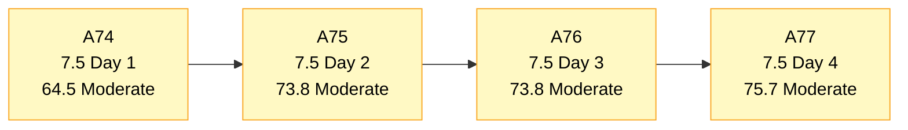
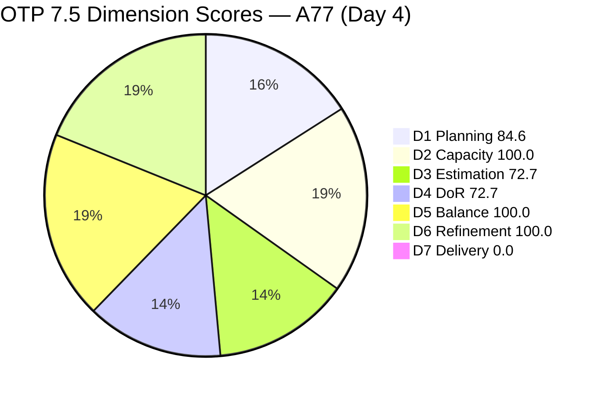
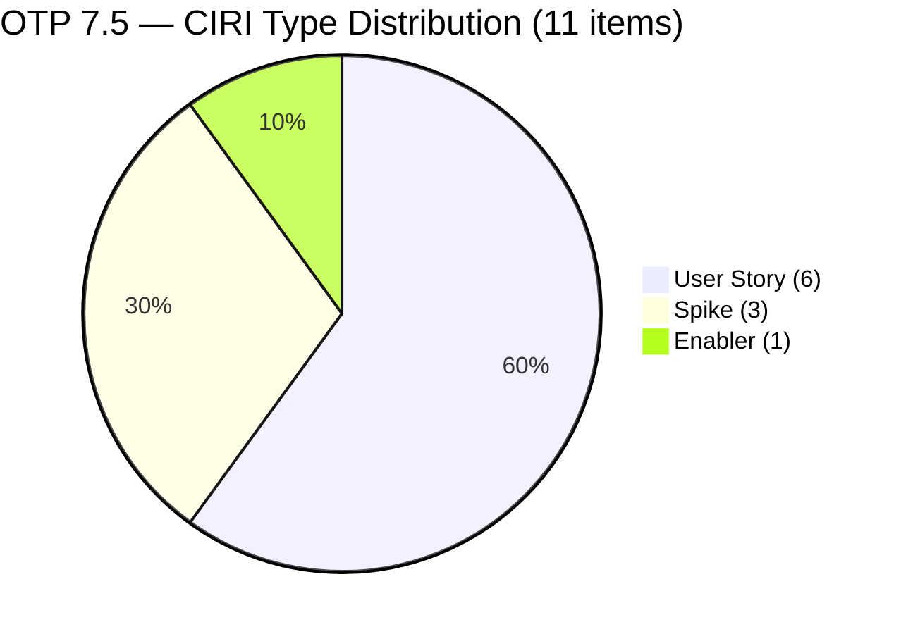
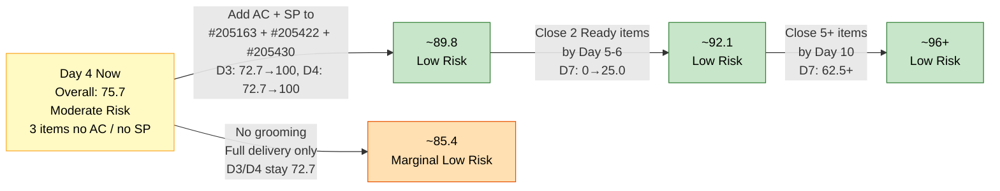

# ADO SAFe Audit — Office of the President (OTP Team)

## 1. Audit Metadata

| Field | Value |
|---|---|
| **Audit Date** | 2026-06-04 UTC |
| **Sprint Day** | **4 of 14** |
| **Prior Audit** | A76 — `AUDIT_20260603_0207.md` (Overall 73.8, Moderate Risk — 7.5 Day 3) |
| **ADO Project** | OTP (`e7739905-28a3-4ae1-9173-7f6cd13b3494`) |
| **ADO Team** | OTP Team (`64de61f0-1203-4b01-aee2-6b4415aec52b`) |
| **Iteration** | Iteration 7.5 (`d1bb3b59-5d69-4489-987c-c5577c0a3cf1`) |
| **Iteration Path** | `OTP\2026 - PI7\Iteration 7.5` |
| **Iteration Dates** | Jun 1, 2026 – Jun 14, 2026 |
| **Workspace Folder** | `ado_otp` |
| **Overall Score** | **75.7 — Moderate Risk** |
| **Risk Band** | Moderate (60–79.9) |
| **Visible Backlog Items (VRBI)** | 13 open root items |
| **Current Iteration Root Items (CIRI)** | 11 items (IterationPath = Iteration 7.5) |
| **Capacity** | Grace: 2.15h/day — configured (Development 0.15h + Documentation 1h + Requirements 1h) |
| **Project Exception Applied** | Single-assignee model (Grace) — accepted per workspace CLAUDE.md |

---

## 2. Executive Summary

The OTP team improves to **75.7 — Moderate Risk** on Day 4 of Iteration 7.5, rising +1.9 points from A76 (73.8). The improvement is driven by a single structural change: **#205446 (Gather requirements for building loan application) moved from Iteration 7.6 to 7.5** on Jun 4 and now carries full DoR-compliant content (Description ✓, Acceptance Criteria ✓, SP = 2). This adds one more CIRI item (11 vs 10), one more estimated item (ECI 7→8), one more DoR-compliant item (DCI 7→8), and lifts D1 from 76.9 to 84.6 — pushing D1 into Low Risk territory for the first time this sprint.

The three persistent gaps from Days 1–3 remain unresolved: **#205163, #205422, and #205430** still have no Acceptance Criteria and no Story Points. Day 4 marks the last day of the early-sprint annotation window for D7 (Days 1–5). With 0 SP closed, execution must begin today to prevent D7 from becoming a confirmed delivery stall by Day 6.

The path to Low Risk (≥80.0) remains accessible: adding AC + SP to the three failing items would lift Overall to approximately 89.8. First closure(s) before Day 6 would further extend the score well into Low Risk territory.

---

## 3. Previous Audit Delta (A76 → A77)

| Dimension | A76 Score (7.5 Day 3) | A77 Score (7.5 Day 4) | Delta | Driver |
|---|---|---|---|---|
| D1 Iteration Planning | 76.9 | **84.6** | **+7.7** | #205446 moved from 7.6 → 7.5; CIRI grew 10→11, denominator stays at 13 |
| D2 Team Capacity | 100.0 | **100.0** | 0.0 | Grace: 2.15h/day, capacity unchanged |
| D3 Estimation | 70.0 | **72.7** | **+2.7** | ECI 7→8 (#205446 has 2 SP); PECI 10→11; D3 = 8/11 |
| D4 DoR Compliance | 70.0 | **72.7** | **+2.7** | DCI 7→8 (#205446 has Desc+AC); CIRI 10→11; D4 = 8/11 |
| D5 Work Item Balance | 100.0 | **100.0** | 0.0 | US = 6/11 = 54.5% (not >60%). No penalties triggered |
| D6 Backlog Refinement | 100.0 | **100.0** | 0.0 | All 13 items still fresh; 0 untouched CIRI items |
| D7 Delivery Predictability | 0.0 | **0.0** | 0.0 | 0 SP closed, 14 SP committed. Day 4 — final day of early-sprint window (Days 1–5) |
| **Overall** | **73.8** | **75.7** | **+1.9** | Incremental improvement from #205446 grooming action. Core gaps (#205163, #205422, #205430) remain |

**Key transition observations A76 → A77:**
- **#205446** moved to 7.5 and received full DoR content on Jun 4 (ChangedDate: 2026-06-04T08:03:32.37Z). This is the first grooming action Grace has taken since sprint start.
- **#205163, #205422, #205430** remain unestimated with null AC for a fourth consecutive day.
- No work item state changes detected — no items advanced toward Closed.
- All three "Ready" items (#202912, #204193, #204194) remain in Ready state — no execution movement.

---

## 4. Current Iteration Snapshot

| Metric | Value |
|---|---|
| **Visible Backlog Items (VRBI)** | 13 |
| **Current Iteration Root Items (CIRI)** | 11 (IterationPath = `OTP\2026 - PI7\Iteration 7.5`) |
| **Non-current items (7.6)** | 2 — #203864, #205433 |
| **Story Points Committed (CSP)** | 14 SP (8 estimated items, same SP total as A76 + #205446 at 2SP → wait: #205446 has 2SP, so CSP = 2+2+2+2+2+2+2+2 = 16 SP across 8 items) |
| **Story Points Closed (CLSP)** | 0 SP |
| **Sprint Day / Total** | 4 / 14 |
| **Team Size (distinct CIRI assignees)** | 1 (Grace — all 11 items assigned) |
| **Total Sprint Capacity** | 2.15h/day × 14 days = 30.1 hours |
| **Iteration Start / Finish** | Jun 1, 2026 – Jun 14, 2026 |

*CSP = 16 SP (8 estimated items × 2 SP each): #202912, #204193, #204194, #205240, #205241, #205438, #205443, #205446.*

---

## 5. Work Item Analysis

### Current Iteration Items (11 items — IterationPath = Iteration 7.5)

| ID | Title | Type | State | SP | DoR | ChangedDate |
|---|---|---|---|---|---|---|
| #202912 | Fabrication of Signage | User Story | Ready | 2 | **Pass** | Jun 1 |
| #204193 | Philgeps Document Consolidation | User Story | Ready | 2 | **Pass** | Jun 1 |
| #204194 | Philgeps Online Submission | User Story | Ready | 2 | **Pass** | Jun 1 |
| #205163 | Business Requirements & Workflow Mapping | Spike | Active | — | **Fail** (no AC) | Jun 2 |
| #205240 | Client SOW Verification | User Story | Active | 2 | **Pass** | Jun 2 |
| #205241 | Gathering of Akira's Letter Invitation | User Story | Active | 2 | **Pass** | Jun 2 |
| #205422 | JDVP DepEd Partnership Appointment | Enabler | Active | — | **Fail** (no AC) | Jun 2 |
| #205430 | Gathering requirements for Pag-IBIG Loan | Spike | Active | — | **Fail** (no AC) | Jun 2 |
| #205438 | Draft Proposal for Chippens AI Inventory System | User Story | Active | 2 | **Pass** | Jun 2 |
| #205443 | Exploration of LB Loan Application | Spike | New | 2 | **Pass** | Jun 2 |
| #205446 | Gather requirements for building loan application | User Story | New | 2 | **Pass** | **Jun 4** (new to 7.5) |

*All 11 items assigned to Grace. SP "—" = null (unestimated). **Bold ChangedDate** = changed since A76.*

### Non-current Backlog Items (2 items — future iterations)

| ID | Title | Iteration | Type | State | SP | Changed |
|---|---|---|---|---|---|---|
| #203864 | Release and collect of TCT | 7.6 | User Story | New | 2 | May 21 |
| #205433 | Execute Pre-Filing Regulatory Compliance | 7.6 | User Story | New | 2 | Jun 1 |

*Note: #205446 moved from 7.6 to 7.5 on Jun 4 — this reduces the non-current count from 3 (A76) to 2 (A77).*

### DoR Assessment — 11 CIRI Items

| ID | Title | Desc ≥ 30 chars | AC ≥ 20 chars | Result |
|---|---|---|---|---|
| #202912 | Fabrication of Signage | ✓ | ✓ | **Pass** |
| #204193 | Philgeps Document Consolidation | ✓ | ✓ | **Pass** |
| #204194 | Philgeps Online Submission | ✓ | ✓ | **Pass** |
| #205163 | Business Requirements & Workflow Mapping | ✓ | ✗ null | **Fail — no AC** |
| #205240 | Client SOW Verification | ✓ | ✓ | **Pass** |
| #205241 | Gathering of Akira's Letter Invitation | ✓ | ✓ | **Pass** |
| #205422 | JDVP DepEd Partnership Appointment | ✓ | ✗ null | **Fail — no AC** |
| #205430 | Gathering requirements for Pag-IBIG Loan | ✓ | ✗ null | **Fail — no AC** |
| #205438 | Draft Proposal for Chippens AI Inventory System | ✓ | ✓ | **Pass** |
| #205443 | Exploration of LB Loan Application | ✓ | ✓ | **Pass** |
| #205446 | Gather requirements for building loan application | ✓ | ✓ | **Pass** |

Pass: 8 (#202912, #204193, #204194, #205240, #205241, #205438, #205443, #205446). Fail: 3 (#205163, #205422, #205430).

### Type Distribution (11 CIRI items)

| Type | Count | Share |
|---|---|---|
| User Story | 6 | 54.5% |
| Spike | 3 | 27.3% |
| Enabler | 1 | 9.1% |
| **Total** | **11** | **100%** |

*Note: #205446 added as a User Story. US share dropped from 60.0% to 54.5%, further from the >60% penalty threshold.*

---

## 6. SAFe Compliance Scorecard

| Dimension | Score | Band | Evidence | Notes |
|---|---|---|---|---|
| D1 Iteration Planning | **84.6** | Low | 11 CIRI / 13 VRBI | **+7.7 from A76.** #205446 moved 7.6→7.5. D1 crosses Low Risk threshold. |
| D2 Team Capacity | **100.0** | Low | 1/1 contributor with capacity | Grace 2.15h/day configured. Single-assignee accepted per Project Exception. |
| D3 Estimation | **72.7** | Moderate | 8 ECI / 11 PECI | +2.7 from A76. #205446 (2 SP) added to ECI. #205163, #205422, #205430 still null SP. |
| D4 DoR Compliance | **72.7** | Moderate | 8 DCI / 11 CIRI | +2.7 from A76. #205446 (Desc+AC) passes. Same 3 items still missing AC. |
| D5 Work Item Balance | **100.0** | Low | US=54.5%, no penalties | 6 US + 3 Spike + 1 Enabler + 1 US (#205446). No penalty thresholds breached. |
| D6 Backlog Refinement | **100.0** | Low | 13/13 fresh; 0 untouched | All items changed ≥ May 21; 0 CIRI untouched (all changed Jun 1+) |
| D7 Delivery Predictability | **0.0** | Critical | 0 SP closed / 16 SP committed | **Day 4 — last day of early-sprint annotation (Days 1–5). 0 closures to date.** |
| **OVERALL** | **75.7** | **Moderate** | (84.6+100.0+72.7+72.7+100.0+100.0+0.0)/7 | +1.9 from A76. D1 now Low Risk. D3/D4 gaps narrowed but not resolved. |

**Formula verification:** (84.6 + 100.0 + 72.7 + 72.7 + 100.0 + 100.0 + 0.0) / 7 = 530.0 / 7 = **75.7**

---

## 7. Dimension Findings

### D1 — Iteration Planning: 84.6 / 100 — Low Risk

**Formula:** CIRI / VRBI × 100 = 11 / 13 × 100 = **84.6**

| Metric | Value |
|---|---|
| Visible root backlog items (VRBI) | 13 |
| Items in Iteration 7.5 (CIRI) | 11 |
| Items in future iterations | 2 (#203864 in 7.6, #205433 in 7.6) |
| Score | **84.6** |

#205446 (Gather requirements for building loan application) was moved from 7.6 to 7.5 on Jun 4, bringing CIRI to 11 and lifting D1 from 76.9 (Moderate) to 84.6 (Low Risk). The two remaining 7.6 items are both DoR-compliant and represent appropriate forward planning — #203864 (Release and collect of TCT, May 21, fully groomed) and #205433 (Execute Pre-Filing Regulatory Compliance, Jun 1, fully groomed). D1 will remain at 84.6 as long as no new ungroomed items are added to the visible backlog.

---

### D2 — Team Capacity: 100.0 / 100 — Low Risk

**Formula:** CC / CW × 100 = 1 / 1 × 100 = **100.0**

| Metric | Value |
|---|---|
| Contributors with work on CIRI (CW) | 1 — Grace (all 11 items assigned) |
| Contributors with capacity configured (CC) | 1 — Grace: 2.15h/day (Development: 0.15h, Documentation: 1h, Requirements: 1h) |
| Total sprint capacity | 2.15h/day × 14 days = 30.1 hours |
| Score | **100.0** |

Capacity remains properly configured and unchanged. Per the Project Exception in workspace CLAUDE.md, the single-assignee model is accepted. With 11 CIRI items (16 SP committed across 8 estimated items) and 30.1 hours of sprint capacity, Grace's sprint load is achievable assuming 1.9h/item on average.

---

### D3 — Estimation: 72.7 / 100 — Moderate Risk

**Formula:** ECI / PECI × 100 = 8 / 11 × 100 = **72.7**

| ID | Title | Type | SP | Estimated |
|---|---|---|---|---|
| #202912 | Fabrication of Signage | User Story | 2 | Yes |
| #204193 | Philgeps Document Consolidation | User Story | 2 | Yes |
| #204194 | Philgeps Online Submission | User Story | 2 | Yes |
| #205163 | Business Requirements & Workflow Mapping | Spike | — | **No (null SP)** |
| #205240 | Client SOW Verification | User Story | 2 | Yes |
| #205241 | Gathering of Akira's Letter Invitation | User Story | 2 | Yes |
| #205422 | JDVP DepEd Partnership Appointment | Enabler | — | **No (null SP)** |
| #205430 | Gathering requirements for Pag-IBIG Loan | Spike | — | **No (null SP)** |
| #205438 | Draft Proposal for Chippens AI Inventory System | User Story | 2 | Yes |
| #205443 | Exploration of LB Loan Application | Spike | 2 | Yes |
| #205446 | Gather requirements for building loan application | User Story | 2 | Yes |

Items #205163, #205422, and #205430 have been in the sprint for 4 days without Story Points. Grace's grooming action on #205446 (assigning SP = 2) demonstrates the capability to estimate — the same action needs to be applied to the three unestimated items. Estimating all three at 2 SP each would bring ECI to 11, PECI to 11, D3 to 100.0, and CSP from 16 to 22 SP.

---

### D4 — DoR Compliance: 72.7 / 100 — Moderate Risk

**Formula:** DCI / CIRI × 100 = 8 / 11 × 100 = **72.7**

| ID | Title | Desc ≥ 30 | AC ≥ 20 | Pass |
|---|---|---|---|---|
| #202912 | Fabrication of Signage | ✓ | ✓ | **Pass** |
| #204193 | Philgeps Document Consolidation | ✓ | ✓ | **Pass** |
| #204194 | Philgeps Online Submission | ✓ | ✓ | **Pass** |
| #205163 | Business Requirements & Workflow Mapping | ✓ | ✗ null | **Fail** |
| #205240 | Client SOW Verification | ✓ | ✓ | **Pass** |
| #205241 | Gathering of Akira's Letter Invitation | ✓ | ✓ | **Pass** |
| #205422 | JDVP DepEd Partnership Appointment | ✓ | ✗ null | **Fail** |
| #205430 | Gathering requirements for Pag-IBIG Loan | ✓ | ✗ null | **Fail** |
| #205438 | Draft Proposal for Chippens AI Inventory System | ✓ | ✓ | **Pass** |
| #205443 | Exploration of LB Loan Application | ✓ | ✓ | **Pass** |
| #205446 | Gather requirements for building loan application | ✓ | ✓ | **Pass** |

The pattern remains identical across four sprint days for the three failing items: all have well-written descriptions but zero Acceptance Criteria. #205446's successful grooming on Jun 4 provides a template — the same completion effort is needed for #205163, #205422, and #205430. Adding AC to all three would push D4 to 11/11 = 100.0.

---

### D5 — Work Item Balance: 100.0 / 100 — Low Risk

**Formula:** Base 100 − penalties applied independently

| Penalty | Trigger | Applied |
|---|---|---|
| −40: No User Story in CIRI | 6 User Stories present | **No** |
| −30: Dominant type share > 60% | US = 54.5% — not > 60% | **No** |
| −20: Spike share > 40% | Spike = 27.3% — not > 40% | **No** |

**Score:** 100 − 0 = **100.0**

Sprint composition remains well-balanced. The addition of #205446 as a User Story moved US share from 60.0% to 54.5%, providing more headroom below the 60% penalty threshold. Three Spikes at 27.3% is appropriate for an operations/compliance team running parallel exploration activities.

---

### D6 — Backlog Refinement: 100.0 / 100 — Low Risk

**Freshness window:** ChangedDate ≥ 2026-04-20 (45 days before 2026-06-04)

| Metric | Value |
|---|---|
| Total VRBI | 13 |
| Fresh items (ChangedDate ≥ Apr 20, 2026) | 13 — oldest: #203864 (May 21) |
| Stale_90 items (ChangedDate < Mar 6, 2026) | 0 |
| Stale_180 items (ChangedDate < Dec 7, 2025) | 0 |
| Untouched CIRI (ChangedDate < Jun 1, 2026) | 0 — all 11 CIRI items changed Jun 1 or later |

**Penalty calculation:** No penalties applicable.

**Score:** max(0, 100.0 − 0) = **100.0**

The backlog is fully fresh. All 13 items are within the 45-day freshness window, with the oldest being #203864 (May 21). No CIRI items are untouched — all changed Jun 1 or later. Grace's Jun 4 update on #205446 contributed to this zero-untouched status.

---

### D7 — Delivery Predictability: 0.0 / 100 — Critical

**Formula:** CLSP / CSP × 100 = 0 / 16 × 100 = **0.0**

> **Early-sprint annotation (final day):** Sprint Day 4 of 14 — Day 4 is the last full day within the Days 1–5 early-sprint window. D7 = 0.0 remains in the annotated window today. Beginning Day 5, zero closures will be classified as an execution stall, and by Day 6 it becomes an active sprint delivery risk. This is the final day where 0.0 is structurally expected rather than alarming.

| Metric | Value |
|---|---|
| Estimated current items (ECI) | 8 |
| Committed Story Points (CSP) | 16 SP |
| Closed Story Points (CLSP) | 0 SP |
| Items in Ready state (executable now) | 3 — #202912, #204193, #204194 |
| Score | **0.0** |

Three items have been in "Ready" state since Day 1 with no movement to Active or Closed. Day 5 is the critical inflection point: if at least one Ready item closes by Day 5 (tomorrow), D7 rises to 2/16 = 12.5% and Overall lifts from 75.7 to approximately 77.5. If two Ready items close, D7 = 4/16 = 25.0%, Overall ≈ 79.3 — approaching the Low Risk threshold.

---

## 8. Risks and Bottlenecks

| # | Severity | Dimension | Risk | Recommended Action |
|---|---|---|---|---|
| R1 | **HIGH** | D3 + D4 | Three CIRI items (#205163, #205422, #205430) have been in the sprint for 4 days with null SP and null AC. Grace successfully groomed #205446 today — the same action applied to these three would push Overall from 75.7 to ~89.8 (Low Risk). | Grace: today, add AC and SP (2 SP each) to #205163, #205422, and #205430. All three have descriptions ready — only AC is missing. This is a <30-minute action. |
| R2 | **CRITICAL** | D7 | Day 4 with 0 SP closed. This is the last day of the early-sprint annotation window. Three items remain in "Ready" state (#202912, #204193, #204194) without any Active movement. Starting Day 5, D7 = 0 becomes an active stall classification. | Grace: begin execution immediately on one "Ready" item today or tomorrow (Day 5). Priority: #204193 (Philgeps Document Consolidation) — document consolidation is the type of task achievable within a single work session. |
| R3 | **MEDIUM** | D7 | Five Active items (#205163, #205240, #205241, #205422, #205430) are in progress states. Grace's workload spans 11 items on 30.1 hours — concentration risk if any item hits a bureaucratic/external blocker. | Monitor daily. If Active items do not transition to Resolved/Closed by Day 7, escalate to Ramon. #205240 (SOW Verification) and #205241 (Akira Letter) are likely the fastest Active completions. |
| R4 | **LOW** | D1 | Two 7.6 items remain (#203864, #205433). Both are DoR-compliant. Their presence holds D1 at 84.6 rather than ~92.3 that would result if both were pulled to 7.5. | Monitor. If sprint velocity supports additional capacity, Ramon could decide to pull one or both to 7.5 before mid-sprint. No urgent action needed — D1 is now in Low Risk band. |
| R5 | **LOW** | Structural | Grace is sole assignee on all 11 CIRI items. 30.1 sprint hours against 16 SP (11 items) leaves minimal buffer. | Project Exception acknowledged. Ensure Ramon monitors daily for blockers, especially on Philgeps-related and JDVP items that require external coordination. |

---

## 9. Prioritized Recommendations

1. **[CRITICAL — Today Day 4]** Grace: add Acceptance Criteria to #205163, #205422, and #205430 and estimate each at 2 SP. These items have been ungroomed for 4 sprint days. #205446's successful grooming today proves this takes minutes. Suggested AC:
   - **#205163** (Business Requirements & Workflow Mapping): "AC1: BRD draft delivered to Ramon for review. AC2: All identified workflow gaps documented with responsible owner and target timeline."
   - **#205422** (JDVP DepEd Partnership Appointment): "AC1: Formal appointment request sent and confirmed in writing with DepEd JDVP focal. AC2: Meeting date and agenda shared with team."
   - **#205430** (Gathering requirements for Pag-IBIG Loan): "AC1: Complete institutional loan document checklist compiled per Pag-IBIG requirements. AC2: All requirements validated against official Pag-IBIG guidelines."
   This single action lifts Overall from 75.7 to ~89.8 (Low Risk), recovers D3 and D4 to 100.0 each.

2. **[CRITICAL — Day 5 at latest]** Grace: begin execution on one "Ready" item. Priority: #204193 (Philgeps Document Consolidation) → #202912 (Fabrication of Signage) → #204194 (Philgeps Online Submission). Transitioning any item from Ready → Closed by Day 5 establishes D7 > 0 before the early-sprint window closes. A single 2 SP closure lifts Overall by ~1.8 points.

3. **[HIGH — Days 5–7]** Progress Active items toward Closed. #205240 (Client SOW Verification) and #205241 (Gathering of Akira's Letter Invitation) are both Active with strong DoR definitions — these are the natural next closures after the Ready items. Target: 2 Active items Closed by Day 7.

4. **[MEDIUM — Before Day 7]** Review sprint load. If any Active item encounters an external blocker (e.g., awaiting external contact for JDVP appointment or Pag-IBIG), move affected item to "Blocked" state in ADO with a comment describing the blocker. This preserves D6 freshness and gives Ramon visibility for escalation.

5. **[STANDING]** Maintain daily ADO state updates. Each state change preserves D6 freshness. Grace's consistent update cadence (all items Jun 1–2) should continue. The next critical D6 checkpoint is Jun 19 (45-day freshness boundary for Jun 1 items).

---

## 10. Visualizations

### Score Trend (A74 → A77)

### Dimension Scorecard — A77 (Day 4)

### CIRI Type Distribution — 11 Items

### Score Recovery Path — If Gaps Resolved

---

## 11. Evidence Gaps and Limitations

| Gap | Impact | Notes |
|---|---|---|
| #205163, #205422, #205430 — AcceptanceCriteria null | D4 Fail (definitive) | AC field absent from ADO batch API. DoR Fail confirmed for 4th consecutive day. |
| #205163, #205422, #205430 — StoryPoints null | D3 PECI-miss (definitive) | SP field absent from all three items. ECI = 8 of 11 eligible. |
| D7 = 0.0 on Sprint Day 4 | Expected — annotated (last day) | No items closed through Day 4. Day 4 is the final day within the Days 1–5 early-sprint window. |
| Single-assignee model | D2 structural note | All 11 CIRI items assigned to Grace. Per Project Exception, accepted. D2 = 100 measures capacity coverage (1/1). |

---

## 12. Audit Trail

| Source | Tool | Data |
|---|---|---|
| OTP Team GUID | `core_list_project_teams` (project `e7739905`) | `64de61f0-1203-4b01-aee2-6b4415aec52b` |
| Current iteration | `work_list_team_iterations` (project `e7739905`, team `64de61f0`, timeframe=current) | Iteration 7.5: Jun 1–14, 2026; ID `d1bb3b59-5d69-4489-987c-c5577c0a3cf1` |
| Backlog items | `wit_list_backlog_work_items` (backlogId `Microsoft.RequirementCategory`) | 13 open root items |
| Work item details | `wit_get_work_items_batch_by_ids` (13 items) | SP, State, Type, Desc, AC, ChangedDate, IterationPath confirmed for all 13 items |
| Team capacity | `work_get_team_capacity` (project `e7739905`, team `64de61f0`, iterationId `d1bb3b59`) | Grace: 2.15h/day (Dev 0.15h + Doc 1h + Req 1h), 0 days off |
| Prior audit | `AUDIT_20260603_0207.md` (A76) | Overall 73.8, Moderate Risk, 7.5 Day 3, 13 VRBI, 10 CIRI, 14 SP committed, 0 SP closed |
