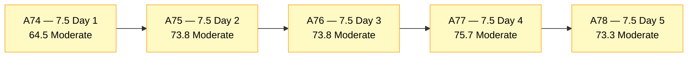
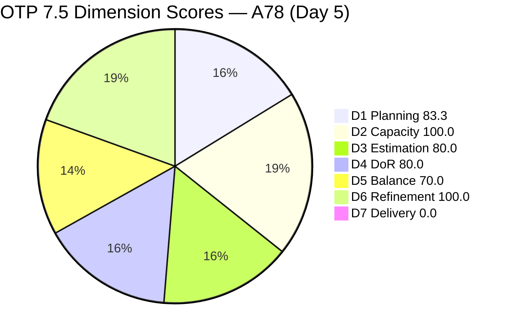
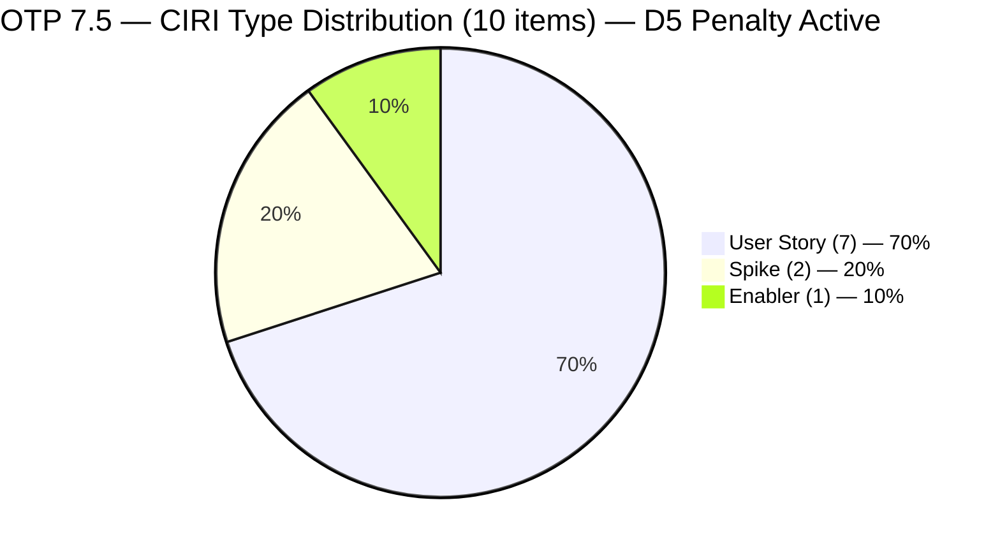
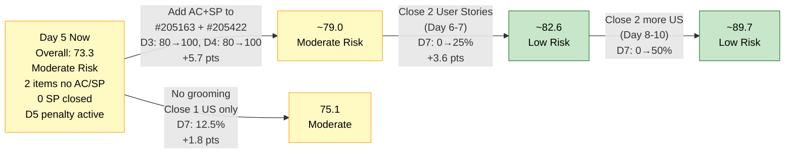

# ADO SAFe Audit — Office of the President (OTP Team)

## 1. Audit Metadata

| Field | Value |
|---|---|
| **Audit Date** | 2026-06-05 UTC |
| **Sprint Day** | **5 of 14** |
| **Prior Audit** | A77 — `AUDIT_20260604_0006.md` (Overall 75.7, Moderate Risk — 7.5 Day 4) |
| **ADO Project** | OTP (`e7739905-28a3-4ae1-9173-7f6cd13b3494`) |
| **ADO Team** | OTP Team (`64de61f0-1203-4b01-aee2-6b4415aec52b`) |
| **Iteration** | Iteration 7.5 (`d1bb3b59-5d69-4489-987c-c5577c0a3cf1`) |
| **Iteration Path** | `OTP\2026 - PI7\Iteration 7.5` |
| **Iteration Dates** | Jun 1, 2026 – Jun 14, 2026 |
| **Workspace Folder** | `ado_otp` |
| **Overall Score** | **73.3 — Moderate Risk** |
| **Risk Band** | Moderate (60–79.9) |
| **Visible Backlog Items (VRBI)** | 12 open root items |
| **Current Iteration Root Items (CIRI)** | 10 items (IterationPath = Iteration 7.5) |
| **Capacity** | Grace: 2.15h/day — configured (Development 0.15h + Documentation 1h + Requirements 1h) |
| **Project Exception Applied** | Single-assignee model (Grace) — accepted per workspace CLAUDE.md |

---

## 2. Executive Summary

The OTP team scores **73.3 — Moderate Risk** on Day 5 of Iteration 7.5, a decrease of **−2.4 points** from A77 (75.7). The decline is driven by two competing structural events from Jun 4:

1. **#205430 (Gathering requirements for Pag-IBIG Loan) was Closed on Jun 4** (ChangedDate: 2026-06-04T21:36:29.61Z). This is the first sprint closure — a positive delivery event. However, because it was a failing DoR/estimation item (no AC, no SP), its exit from CIRI changes denominators: VRBI drops from 13→12, CIRI from 11→10, PECI from 11→10. The net effect is **D3 rises from 72.7→80.0 and D4 rises from 72.7→80.0**, both crossing into Low Risk territory.

2. **#205422 (JDVP DepEd Partnership Appointment) and #205163 (Business Requirements & Workflow Mapping) still have no Acceptance Criteria and no Story Points** after 5 sprint days. These two items are now the sole barrier preventing D3 and D4 from reaching 100.0.

3. **User Story share rose to 70%** with the exit of Spike #205430, triggering the D5 dominant-type penalty (−30) for the first time this sprint. D5 drops from 100.0 to 70.0. This is the primary driver of the overall score decline.

4. **D7 = 0.0 with 0 SP closed against 16 SP committed.** Today is Day 5 — the last day of the early-sprint annotation window. Beginning Day 6, D7 = 0.0 will be treated as an active stall, not a structurally expected early-sprint condition.

The path to Low Risk (≥80.0) requires: (a) Grace adds AC + SP to #205163 and #205422, and (b) at least one Ready item closes. Completing both actions would push Overall to approximately 88.1.

---

## 3. Previous Audit Delta (A77 → A78)

| Dimension | A77 Score (7.5 Day 4) | A78 Score (7.5 Day 5) | Delta | Driver |
|---|---|---|---|---|
| D1 Iteration Planning | 84.6 | **83.3** | **−1.3** | #205430 closed — VRBI 13→12, CIRI 11→10; D1 = 10/12 |
| D2 Team Capacity | 100.0 | **100.0** | 0.0 | Grace: 2.15h/day, capacity unchanged |
| D3 Estimation | 72.7 | **80.0** | **+7.3** | #205430 (no SP) exited CIRI; PECI 11→10; ECI stays 8; D3 = 8/10 |
| D4 DoR Compliance | 72.7 | **80.0** | **+7.3** | #205430 (no AC) exited CIRI; CIRI 11→10; DCI stays 8; D4 = 8/10 |
| D5 Work Item Balance | 100.0 | **70.0** | **−30.0** | US share rose to 70% (7/10) after Spike #205430 exited; >60% penalty triggered |
| D6 Backlog Refinement | 100.0 | **100.0** | 0.0 | 12/12 fresh; 0 untouched CIRI items; no penalty |
| D7 Delivery Predictability | 0.0 | **0.0** | 0.0 | 0 SP closed; 16 SP committed. Day 5 — final day of early-sprint window |
| **Overall** | **75.7** | **73.3** | **−2.4** | D5 penalty from type imbalance offsets D3/D4 gains from #205430 closure |

**Key transition observations A77 → A78:**
- **#205430** Closed on Jun 4 at 21:36 UTC (ChangedDate: 2026-06-04T21:36:29.61Z). First sprint closure. Item had no SP and no AC — its exit reduces both PECI and DCI denominators, improving D3 and D4 ratios but also removing a Spike from the type mix.
- **#205443** (Exploration of LB Loan Application) updated Jun 4 at 21:37 UTC — state still Active, no change to SP or AC.
- **#205163 and #205422** remain unestimated with null AC for a fifth consecutive day.
- **Three Ready items** (#202912, #204193, #204194) remain in "Ready" state — no execution movement for 5 days.

---

## 4. Current Iteration Snapshot

| Metric | Value |
|---|---|
| **Visible Backlog Items (VRBI)** | 12 |
| **Current Iteration Root Items (CIRI)** | 10 (IterationPath = `OTP\2026 - PI7\Iteration 7.5`) |
| **Non-current items** | 2 — #203864 (7.6), #205433 (7.6) |
| **Closed this sprint (exited backlog)** | 1 — #205430 (Pag-IBIG Loan, Spike, Jun 4) |
| **Story Points Committed (CSP)** | 16 SP (8 estimated items × 2 SP each) |
| **Story Points Closed (CLSP)** | 0 SP (live CIRI; #205430 had no SP before closing) |
| **Sprint Day / Total** | 5 / 14 |
| **Team Size (distinct CIRI assignees)** | 1 (Grace — all 10 items) |
| **Total Sprint Capacity** | 2.15h/day × 14 days = 30.1 hours |
| **Iteration Start / Finish** | Jun 1, 2026 – Jun 14, 2026 |

*CSP = 16 SP: #202912(2), #204193(2), #204194(2), #205240(2), #205241(2), #205438(2), #205443(2), #205446(2). Items #205163 and #205422 have no SP.*

---

## 5. Work Item Analysis

### Current Iteration Items (10 items — IterationPath = Iteration 7.5)

| ID | Title | Type | State | SP | DoR | ChangedDate |
|---|---|---|---|---|---|---|
| #202912 | Fabrication of Signage | User Story | Ready | 2 | **Pass** | Jun 1 |
| #204193 | Philgeps Document Consolidation | User Story | Ready | 2 | **Pass** | Jun 1 |
| #204194 | Philgeps Online Submission | User Story | Ready | 2 | **Pass** | Jun 1 |
| #205163 | Business Requirements & Workflow Mapping | Spike | Active | — | **Fail** (no AC) | Jun 2 |
| #205240 | Client SOW Verification | User Story | Active | 2 | **Pass** | Jun 2 |
| #205241 | Gathering of Akira's Letter Invitation | User Story | Active | 2 | **Pass** | Jun 2 |
| #205422 | JDVP DepEd Partnership Appointment | Enabler | Active | — | **Fail** (no AC) | Jun 2 |
| #205438 | Draft Proposal for Chippens AI Inventory System | User Story | Active | 2 | **Pass** | Jun 2 |
| #205443 | Exploration of LB Loan Application | Spike | Active | 2 | **Pass** | **Jun 4** |
| #205446 | Gather requirements for building loan application | User Story | New | 2 | **Pass** | Jun 4 |

*All 10 items assigned to Grace. SP "—" = null (unestimated).*

### Closed Items This Sprint (exited backlog)

| ID | Title | Type | SP | State | ClosedDate |
|---|---|---|---|---|---|
| #205430 | Gathering requirements for Pag-IBIG Loan | Spike | — (null) | Closed | Jun 4, 21:36 UTC |

*Note: #205430 had no Story Points before closing. Not counted in CSP or CLSP.*

### Non-current Backlog Items (2 items — future iterations)

| ID | Title | Iteration | Type | State | SP | Changed |
|---|---|---|---|---|---|---|
| #203864 | Release and collect of TCT | 7.6 | User Story | New | 2 | May 21 |
| #205433 | Execute Pre-Filing Regulatory Compliance | 7.6 | User Story | New | 2 | Jun 1 |

### DoR Assessment — 10 CIRI Items

| ID | Title | Desc ≥ 30 NWS | AC ≥ 20 NWS | Result |
|---|---|---|---|---|
| #202912 | Fabrication of Signage | ✓ | ✓ | **Pass** |
| #204193 | Philgeps Document Consolidation | ✓ | ✓ | **Pass** |
| #204194 | Philgeps Online Submission | ✓ | ✓ | **Pass** |
| #205163 | Business Requirements & Workflow Mapping | ✓ | ✗ null | **Fail — no AC** |
| #205240 | Client SOW Verification | ✓ | ✓ | **Pass** |
| #205241 | Gathering of Akira's Letter Invitation | ✓ | ✓ | **Pass** |
| #205422 | JDVP DepEd Partnership Appointment | ✓ | ✗ null | **Fail — no AC** |
| #205438 | Draft Proposal for Chippens AI Inventory System | ✓ | ✓ | **Pass** |
| #205443 | Exploration of LB Loan Application | ✓ | ✓ | **Pass** |
| #205446 | Gather requirements for building loan application | ✓ | ✓ | **Pass** |

Pass: 8. Fail: 2 (#205163, #205422).

### Type Distribution (10 CIRI items)

| Type | Count | Share |
|---|---|---|
| User Story | 7 | **70.0%** |
| Spike | 2 | 20.0% |
| Enabler | 1 | 10.0% |
| **Total** | **10** | **100%** |

*User Story share crossed the 60% threshold (70.0% > 60%) after Spike #205430 exited. D5 dominant-type penalty −30 now applies.*

---

## 6. SAFe Compliance Scorecard

| Dimension | Score | Band | Evidence | Notes |
|---|---|---|---|---|
| D1 Iteration Planning | **83.3** | Low | 10 CIRI / 12 VRBI | −1.3 from A77. #205430 exited backlog (Closed). CIRI 11→10, VRBI 13→12. |
| D2 Team Capacity | **100.0** | Low | 1/1 contributor with capacity | Grace 2.15h/day configured. Single-assignee accepted per Project Exception. |
| D3 Estimation | **80.0** | Low | 8 ECI / 10 PECI | **+7.3 from A77.** #205430 (no SP) exited; PECI 11→10; D3 = 8/10. Both #205163 and #205422 still null SP. |
| D4 DoR Compliance | **80.0** | Low | 8 DCI / 10 CIRI | **+7.3 from A77.** #205430 (no AC) exited; CIRI 11→10; D4 = 8/10. Both #205163 and #205422 still no AC. |
| D5 Work Item Balance | **70.0** | Moderate | US=70% → >60% penalty −30 | **−30.0 from A77.** #205430 (Spike) exit raised US share to 70%. Dominant-type penalty now active. |
| D6 Backlog Refinement | **100.0** | Low | 12/12 fresh; 0 untouched | All items changed ≥ May 21; 0 CIRI untouched (all changed Jun 1+). No penalties. |
| D7 Delivery Predictability | **0.0** | Critical | 0 SP closed / 16 SP committed | **Day 5 — final day of early-sprint annotation window (Days 1–5). Stall classification begins Day 6.** |
| **OVERALL** | **73.3** | **Moderate** | (83.3+100.0+80.0+80.0+70.0+100.0+0.0)/7 | −2.4 from A77. D3/D4 into Low Risk; D5 penalty offsets gains. |

**Formula verification:** (83.3 + 100.0 + 80.0 + 80.0 + 70.0 + 100.0 + 0.0) / 7 = 513.3 / 7 = **73.3**

---

## 7. Dimension Findings

### D1 — Iteration Planning: 83.3 / 100 — Low Risk

**Formula:** CIRI / VRBI × 100 = 10 / 12 × 100 = **83.3**

| Metric | Value |
|---|---|
| Visible root backlog items (VRBI) | 12 |
| Items in Iteration 7.5 (CIRI) | 10 |
| Items in future iterations | 2 (#203864 in 7.6, #205433 in 7.6) |
| Items exited this sprint | 1 (#205430 Closed Jun 4) |
| Score | **83.3** |

D1 slips 1.3 points from A77 (84.6) due to the net denominator effect of #205430's closure: both CIRI (−1) and VRBI (−1) decreased, but the ratio shifts slightly because VRBI dropped from 13 to 12 while CIRI dropped from 11 to 10. Both future-iteration items (#203864, #205433) are DoR-compliant and properly queued. D1 remains solidly in Low Risk.

---

### D2 — Team Capacity: 100.0 / 100 — Low Risk

**Formula:** CC / CW × 100 = 1 / 1 × 100 = **100.0**

| Metric | Value |
|---|---|
| Contributors with work on CIRI (CW) | 1 — Grace (all 10 items) |
| Contributors with capacity configured (CC) | 1 — Grace: 2.15h/day (Dev 0.15h + Doc 1h + Req 1h) |
| Total sprint capacity | 2.15h/day × 14 days = 30.1 hours |
| Score | **100.0** |

Capacity unchanged and properly configured. 10 CIRI items (16 SP) against 30.1 hours = 1.9h per SP on average, which remains achievable.

---

### D3 — Estimation: 80.0 / 100 — Low Risk

**Formula:** ECI / PECI × 100 = 8 / 10 × 100 = **80.0**

| ID | Title | Type | SP | Estimated |
|---|---|---|---|---|
| #202912 | Fabrication of Signage | User Story | 2 | Yes |
| #204193 | Philgeps Document Consolidation | User Story | 2 | Yes |
| #204194 | Philgeps Online Submission | User Story | 2 | Yes |
| #205163 | Business Requirements & Workflow Mapping | Spike | — | **No (null SP — Day 5)** |
| #205240 | Client SOW Verification | User Story | 2 | Yes |
| #205241 | Gathering of Akira's Letter Invitation | User Story | 2 | Yes |
| #205422 | JDVP DepEd Partnership Appointment | Enabler | — | **No (null SP — Day 5)** |
| #205438 | Draft Proposal for Chippens AI Inventory System | User Story | 2 | Yes |
| #205443 | Exploration of LB Loan Application | Spike | 2 | Yes |
| #205446 | Gather requirements for building loan application | User Story | 2 | Yes |

D3 crossed into Low Risk (80.0) for the first time this sprint, driven by #205430's exit reducing PECI from 11 to 10. The two remaining unestimated items (#205163, #205422) have been in the sprint for 5 full days. Estimating both at 2 SP each would lift D3 to 10/10 = 100.0 and CSP from 16 to 20 SP.

---

### D4 — DoR Compliance: 80.0 / 100 — Low Risk

**Formula:** DCI / CIRI × 100 = 8 / 10 × 100 = **80.0**

| ID | Title | Desc ≥ 30 NWS | AC ≥ 20 NWS | Pass |
|---|---|---|---|---|
| #202912 | Fabrication of Signage | ✓ | ✓ | **Pass** |
| #204193 | Philgeps Document Consolidation | ✓ | ✓ | **Pass** |
| #204194 | Philgeps Online Submission | ✓ | ✓ | **Pass** |
| #205163 | Business Requirements & Workflow Mapping | ✓ | ✗ null — Day 5 | **Fail** |
| #205240 | Client SOW Verification | ✓ | ✓ | **Pass** |
| #205241 | Gathering of Akira's Letter Invitation | ✓ | ✓ | **Pass** |
| #205422 | JDVP DepEd Partnership Appointment | ✓ | ✗ null — Day 5 | **Fail** |
| #205438 | Draft Proposal for Chippens AI Inventory System | ✓ | ✓ | **Pass** |
| #205443 | Exploration of LB Loan Application | ✓ | ✓ | **Pass** |
| #205446 | Gather requirements for building loan application | ✓ | ✓ | **Pass** |

D4 also crossed into Low Risk (80.0) this audit. Both failing items have solid descriptions; only Acceptance Criteria are missing. Adding AC to both would push D4 to 100.0 and contribute ~2.9 points to Overall.

---

### D5 — Work Item Balance: 70.0 / 100 — Moderate Risk

**Formula:** Base 100 − penalties applied independently

| Penalty | Trigger | Applied |
|---|---|---|
| −40: No User Story in CIRI | 7 User Stories present | **No** |
| −30: Dominant type share > 60% | US = 7/10 = **70.0%** — > 60% | **YES — applied** |
| −20: Spike share > 40% | Spike = 2/10 = 20.0% | **No** |

**Score:** 100 − 30 = **70.0**

This is the first audit in Iteration 7.5 where D5 has not scored 100.0. The penalty is a direct consequence of the Spike #205430 exit: the User Story share rose from 54.5% (A77, 6 of 11) to 70.0% (A78, 7 of 10). The team had 3 Spikes in A77 (27.3%) — now down to 2 Spikes (20.0%). To restore D5 to 100.0, either: (a) add another Spike or non-US item to CIRI to dilute the 70% US dominance, or (b) close one User Story before adding work (reducing CIRI to 9 items with 6 US = 66.7% — still > 60%).

The only clean path to eliminating the D5 penalty within current CIRI is to close at least 2 User Stories (e.g., both #202912 and #204193 from "Ready" state: 5 US of 8 = 62.5% — still >60%) or close 3 User Stories (4 of 7 = 57.1% — below threshold).

---

### D6 — Backlog Refinement: 100.0 / 100 — Low Risk

**Freshness window:** ChangedDate ≥ 2026-04-21 (45 days before Jun 5, 2026)

| Metric | Value |
|---|---|
| Total VRBI | 12 |
| Fresh items (ChangedDate ≥ Apr 21, 2026) | 12 — oldest: #203864 (May 21) |
| Stale_90 items (ChangedDate < Mar 7, 2026) | 0 |
| Stale_180 items (ChangedDate < Dec 8, 2025) | 0 |
| Untouched CIRI (ChangedDate < Jun 1, 2026) | 0 — all 10 CIRI items changed Jun 1 or later |

**Penalty calculation:** No penalties applicable. **Score: 100.0**

The backlog remains fully fresh. All 10 CIRI items were last touched on Jun 1 or later. The exit of #205430 removes one item from the freshness pool but does not affect the score since all remaining items are well within the 45-day window.

---

### D7 — Delivery Predictability: 0.0 / 100 — Critical

**Formula:** CLSP / CSP × 100 = 0 / 16 × 100 = **0.0**

> **Early-sprint annotation (final day):** Sprint Day 5 of 14 — Day 5 is the final day of the early-sprint annotation window (Days 1–5). Starting Day 6, D7 = 0.0 will be classified as an active execution stall. The early-sprint grace period expires tonight.

> **Note on #205430 closure:** #205430 was closed on Jun 4 but had no Story Points. Therefore it contributes 0 to CLSP. The team's first sprint closure is a positive behavior signal, but it does not yet move the D7 needle.

| Metric | Value |
|---|---|
| Estimated current items (ECI) | 8 |
| Committed Story Points (CSP) | 16 SP |
| Closed Story Points (CLSP) | 0 SP |
| Items in Ready state (executable now) | 3 — #202912, #204193, #204194 |
| Score | **0.0** |

Three items remain in "Ready" state (sprint Days 1–5 without Active movement) and five items remain in "Active" state. Grace's closure of #205430 yesterday demonstrates execution capacity — the same effort directed toward an estimated "Ready" item would directly move D7 above zero.

---

## 8. Risks and Bottlenecks

| # | Severity | Dimension | Risk | Recommended Action |
|---|---|---|---|---|
| R1 | **CRITICAL** | D7 | Day 5 with 0 SP closed from estimated items. The early-sprint window expires today. #205430 closed with 0 SP (no estimation). Three Ready items (#202912, #204193, #204194) have been in Ready for 5 days without transition to Active. Beginning Day 6, D7 = 0.0 becomes an active stall classification with no annotation relief. | Grace: close at least one Ready item today. Priority: #204193 (Philgeps Document Consolidation — document consolidation is achievable within a single work session). Closing 1 item (2 SP) lifts D7 to 2/16 = 12.5% and Overall from 73.3 to 75.6. |
| R2 | **HIGH** | D3 + D4 | #205163 and #205422 have been in the sprint for 5 full days with no Acceptance Criteria and no Story Points. D3 = 80.0 and D4 = 80.0 are the direct result of these two items failing. Adding AC + SP to both would push D3 and D4 each to 100.0, adding ~5.7 points to Overall (73.3 → ~79.0). | Grace: add AC and SP (2 SP each) to #205163 and #205422. #205163 (Business Requirements & Workflow Mapping): "AC1: BRD draft delivered to Ramon for review. AC2: All identified workflow gaps documented with responsible owner and target timeline." #205422 (JDVP DepEd Partnership Appointment): "AC1: Formal appointment request sent and confirmed in writing with DepEd JDVP focal. AC2: Meeting date and agenda shared with team." |
| R3 | **HIGH** | D5 | User Story dominance at 70% triggers the −30 D5 penalty for the first time. This is a structural artifact of the Spike #205430 exit. D5 = 70.0 will persist and worsen if User Stories continue to close while Spikes do not, driving US% further above the 60% threshold. | Monitor type mix. Grace: if adding new work, prioritize Spike or Enabler types to balance the sprint mix. If no new items are warranted, focus on closing User Stories efficiently to shorten the period of penalty exposure. |
| R4 | **MEDIUM** | D7 | Five Active items (#205163, #205240, #205241, #205422, #205438, #205443) remain in progress states. With Grace as sole assignee on 10 items, any external blocker (e.g., awaiting DepEd confirmation for #205422, Akira letter for #205241) could stall multiple items simultaneously. | Grace: add ADO comments on any externally blocked items. If #205422 is pending an external contact, mark as "Blocked" with blocker description. Preserves D6 freshness and gives Ramon daily visibility. |
| R5 | **LOW** | D1 | Two 7.6 items (#203864, #205433) remain. Both are DoR-compliant. If either moves to 7.5, D1 would improve to 11/13 = 84.6 or 12/13 = 92.3. | Low priority — both items are properly scoped and DoR-ready for 7.6. No urgent action needed. |
| R6 | **LOW** | Structural | Grace is sole assignee on all 10 CIRI items at Sprint Day 5 with 0 SP credited. The sprint midpoint (Day 7) is two days away with no closures yet from estimated work. | Ramon: consider a mid-sprint check-in with Grace on Day 6 to assess blockers and confirm at least one Ready item can close. |

---

## 9. Prioritized Recommendations

1. **[CRITICAL — Today Day 5]** Grace: close one Ready item before end of day. Priority order: #204193 (Philgeps Document Consolidation) → #202912 (Fabrication of Signage) → #204194 (Philgeps Online Submission). Closing #204193 (2 SP) today prevents D7 from entering stall classification on Day 6. A single closure lifts Overall from 73.3 to approximately 75.6.

2. **[HIGH — Today Day 5]** Grace: add Acceptance Criteria and Story Points to #205163 and #205422. Both items have descriptions ready — only AC is missing. Suggested:
   - **#205163** (Business Requirements & Workflow Mapping): Add SP = 2 and AC: "AC1: BRD draft delivered to Ramon for review. AC2: All identified workflow gaps documented with responsible owner and target timeline."
   - **#205422** (JDVP DepEd Partnership Appointment): Add SP = 2 and AC: "AC1: Formal appointment request sent and confirmed in writing with DepEd JDVP focal. AC2: Meeting date and agenda shared with team."
   Combined effect: D3 and D4 both rise to 100.0 (+20 SP to CSP; Overall from 73.3 to ~79.0).

3. **[HIGH — Days 5–7]** Grace: begin executing Active items. #205240 (Client SOW Verification) and #205241 (Gathering of Akira's Letter Invitation) are both Active with full DoR definitions. Target: 2 Active items Closed by Day 7. At 2 SP each, two closures bring CLSP to 4 SP → D7 = 4/16 = 25.0%.

4. **[MEDIUM — Days 6–8]** Monitor D5 type balance. If the US share remains above 60% through sprint midpoint, the penalty will increasingly depress the Overall score. If Grace takes on any new work, prefer Spike types (exploratory analysis, research tasks) to dilute the US share back below 60%.

5. **[STANDING]** Daily ADO updates preserve D6. All 10 CIRI items should have state or comment updates each working day. The D6 freshness checkpoint for Jun 1–2 items is approximately Jul 15–17 (90-day stale boundary) — well beyond this sprint.

---

## 10. Visualizations

### Score Trend (A74 → A78)

### Dimension Scorecard — A78 (Day 5)

### CIRI Type Distribution — 10 Items (D5 Alert)

### Score Recovery Path — From Day 5

---

## 11. Evidence Gaps and Limitations

| Gap | Impact | Notes |
|---|---|---|
| #205163, #205422 — AcceptanceCriteria null | D4 Fail (definitive) | AC field absent from ADO batch API for both items. DoR Fail confirmed for 5th consecutive day. |
| #205163, #205422 — StoryPoints null | D3 PECI-miss (definitive) | SP field absent from both items. ECI = 8 of 10 eligible. |
| #205430 — Closed with null SP | CLSP = 0 | #205430 was the sprint's first closure. No SP credited because it had no Story Points when closed. |
| D7 = 0.0 on Sprint Day 5 | Final annotated day | Day 5 is the last day of the early-sprint window. D7 = 0.0 becomes a stall classification from Day 6. |
| D5 penalty newly active | D5 = 70.0 | US dominance at 70% crossed the 60% threshold due to Spike #205430 exit. This is a structural artifact of healthy sprint closure, not a grooming failure. |
| Single-assignee model | D2 structural note | All 10 CIRI items assigned to Grace. Per Project Exception, accepted. D2 = 100.0. |

---

## 12. Audit Trail

| Source | Tool | Data |
|---|---|---|
| Current iteration | `work_list_team_iterations` (project `e7739905`, team `OTP Team`, timeframe=current) | Iteration 7.5: Jun 1–14, 2026; ID `d1bb3b59-5d69-4489-987c-c5577c0a3cf1` |
| Backlog items | `wit_list_backlog_work_items` (backlogId `Microsoft.RequirementCategory`) | 12 open root items (down from 13 — #205430 closed and exited) |
| Work item details | `wit_get_work_items_batch_by_ids` (12 backlog items + #205430 direct fetch) | SP, State, Type, Desc, AC, ChangedDate, IterationPath confirmed for all 13 items |
| Team capacity | `work_get_team_capacity` (project `e7739905`, team `OTP Team`, iterationId `d1bb3b59`) | Grace: 2.15h/day (Dev 0.15h + Doc 1h + Req 1h), 0 days off |
| Prior audit | `AUDIT_20260604_0006.md` (A77) | Overall 75.7, Moderate Risk, 7.5 Day 4, 13 VRBI, 11 CIRI, 16 SP committed, 0 SP closed |
