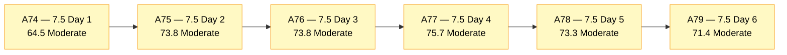
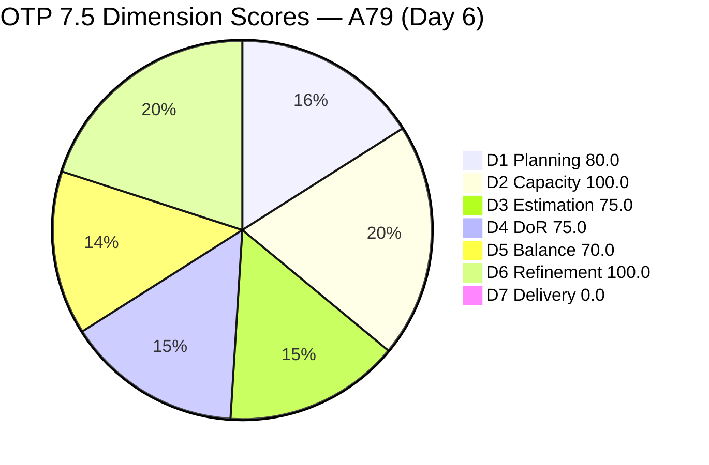
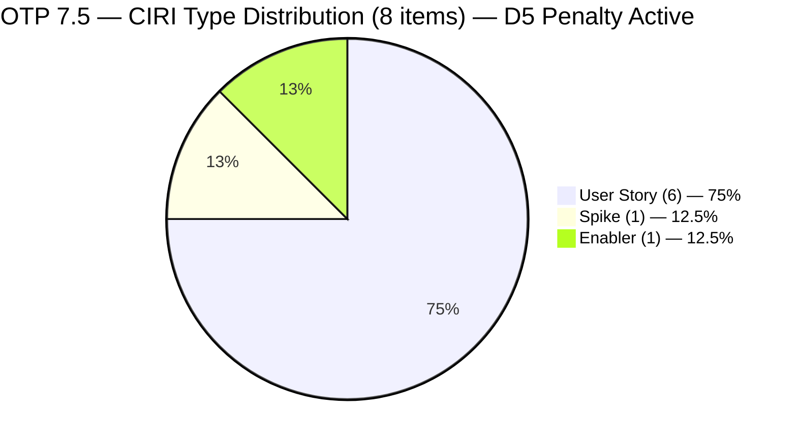
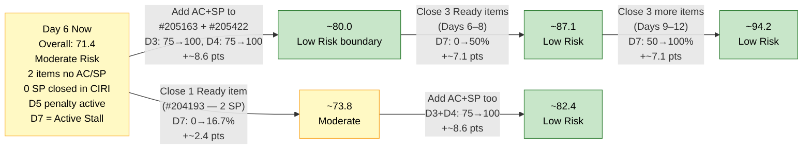

# ADO SAFe Audit — Office of the President (OTP Team)

## 1. Audit Metadata

| Field | Value |
|---|---|
| **Audit Date** | 2026-06-06 CST |
| **Sprint Day** | **6 of 14** |
| **Prior Audit** | A78 — `AUDIT_20260605_0900.md` (Overall 73.3, Moderate Risk — 7.5 Day 5) |
| **ADO Project** | OTP (`e7739905-28a3-4ae1-9173-7f6cd13b3494`) |
| **ADO Team** | OTP Team (`64de61f0-1203-4b01-aee2-6b4415aec52b`) |
| **Iteration** | Iteration 7.5 (`d1bb3b59-5d69-4489-987c-c5577c0a3cf1`) |
| **Iteration Path** | `OTP\2026 - PI7\Iteration 7.5` |
| **Iteration Dates** | Jun 1, 2026 – Jun 14, 2026 |
| **Workspace Folder** | `ado_otp` |
| **Overall Score** | **71.4 — Moderate Risk** |
| **Risk Band** | Moderate (60–79.9) |
| **Visible Backlog Items (VRBI)** | 10 open root items |
| **Current Iteration Root Items (CIRI)** | 8 items (IterationPath = Iteration 7.5) |
| **Capacity** | Grace: 2.15h/day — configured (Development 0.15h + Documentation 1h + Requirements 1h) |
| **Project Exception Applied** | Single-assignee model (Grace) — accepted per workspace CLAUDE.md |

---

## 2. Executive Summary

The OTP team scores **71.4 — Moderate Risk** on Day 6 of Iteration 7.5, a decrease of **−1.9 points** from A78 (73.3). This is the sprint's midpoint week and the first day outside the early-sprint annotation window — D7 = 0.0 is now classified as an **active execution stall**, no longer annotated.

The score movement is driven by two structural changes since A78 (Day 5):

1. **#205241 (Gathering of Akira's Letter Invitation) and #205443 (Exploration of LB Loan Application) have exited the backlog** — both items are no longer visible under the Microsoft.RequirementCategory backlog view. This indicates closure. VRBI dropped from 12 → 10 and CIRI from 10 → 8. Their exit reduces PECI and DCI denominators, but because #205241 (US, 2 SP) and #205443 (Spike, 2 SP) were both estimated and DoR-compliant, losing them from the denominator does not improve scores — it reshuffles the ratios. Notably, D3 dropped from 80.0 → 75.0 and D4 dropped from 80.0 → 75.0, as the two non-compliant items (#205163, #205422) now represent a larger fraction of a smaller CIRI.

2. **#205163 (Business Requirements & Workflow Mapping) and #205422 (JDVP DepEd Partnership Appointment) still have no Acceptance Criteria and no Story Points** — now on Sprint Day 6, six consecutive days without remediation. These two items are the sole barrier to D3 = 100.0 and D4 = 100.0.

3. **D7 = 0.0 is now an active stall (Day 6 of 14).** The early-sprint annotation window closed yesterday. None of the 8 remaining CIRI items carry a Closed/Done state. Even though #205241 and #205443 appear to have closed (exited the backlog), they are no longer in scope for D7 calculation per the rubric (D7 is computed from current CIRI only).

4. **D5 = 70.0 persists** with User Story share at 75% (6/8) — above the 60% dominant-type threshold — applying the −30 penalty for a second consecutive audit.

The path to Low Risk (≥ 80.0) requires: (a) Grace adds AC + SP to #205163 and #205422, and (b) at least one CIRI item closes. Completing both actions would push Overall to approximately 83–85.

---

## 3. Previous Audit Delta (A78 → A79)

| Dimension | A78 Score (7.5 Day 5) | A79 Score (7.5 Day 6) | Delta | Driver |
|---|---|---|---|---|
| D1 Iteration Planning | 83.3 | **80.0** | **−3.3** | #205241 + #205443 exited backlog; VRBI 12→10, CIRI 10→8; D1 = 8/10 |
| D2 Team Capacity | 100.0 | **100.0** | 0.0 | Grace: 2.15h/day, capacity unchanged |
| D3 Estimation | 80.0 | **75.0** | **−5.0** | PECI 10→8; ECI 8→6 (two estimated items exited); #205163 + #205422 still null SP; D3 = 6/8 |
| D4 DoR Compliance | 80.0 | **75.0** | **−5.0** | CIRI 10→8; DCI 8→6 (two compliant items exited); #205163 + #205422 still no AC; D4 = 6/8 |
| D5 Work Item Balance | 70.0 | **70.0** | 0.0 | US=6/8=75% → >60% penalty −30 still active; no new type entries |
| D6 Backlog Refinement | 100.0 | **100.0** | 0.0 | 10/10 fresh; 0 untouched CIRI items; no stale items; no penalties |
| D7 Delivery Predictability | 0.0 | **0.0** | 0.0 | 0 SP closed; 12 SP committed in CIRI. **Day 6 — early-sprint window expired. Active stall.** |
| **Overall** | **73.3** | **71.4** | **−1.9** | CIRI contraction reduces D3/D4 ratios; two persistent non-compliant items now weighted heavier |

**Formula verification:** (80.0 + 100.0 + 75.0 + 75.0 + 70.0 + 100.0 + 0.0) / 7 = 500.0 / 7 = **71.4**

**Key transition observations A78 → A79:**
- **#205241** (Gathering of Akira's Letter Invitation) exited the backlog between A78 and A79. Was Active (2 SP, DoR pass) on Jun 2. Likely Closed — a positive delivery signal. However, because it left the backlog, it does not contribute to D7 CLSP per the rubric's current-CIRI definition.
- **#205443** (Exploration of LB Loan Application, Spike) also exited the backlog. Was Active (2 SP, DoR pass) on Jun 4. Also likely Closed. Same D7 limitation applies.
- **Three Ready items** (#202912, #204193, #204194) remain in "Ready" state — no execution movement for **6 consecutive days** despite recommendations in A74–A78.
- **#205163 and #205422** remain unestimated with null AC for a **sixth consecutive day**.
- Two closures (4 SP equivalent) occurred but are not reflected in D7 because closed items exit the backlog query scope.

---

## 4. Current Iteration Snapshot

| Metric | Value |
|---|---|
| **Visible Backlog Items (VRBI)** | 10 |
| **Current Iteration Root Items (CIRI)** | 8 (IterationPath = `OTP\2026 - PI7\Iteration 7.5`) |
| **Non-current items** | 2 — #203864 (7.6), #205433 (7.6) |
| **Likely Closed this sprint** | 2 — #205241 (Akira Letter, 2 SP), #205443 (LB Loan Exploration, 2 SP) — exited backlog since A78 |
| **Story Points Committed (CSP)** | 12 SP (6 estimated CIRI items × 2 SP each) |
| **Story Points Closed (CLSP)** | 0 SP per rubric (closed items exit backlog scope; no current CIRI items in Closed/Done) |
| **Effective Delivery** | ~4 SP equivalent (if #205241 and #205443 closed) — not captured by D7 formula |
| **Sprint Day / Total** | 6 / 14 |
| **Team Size (distinct CIRI assignees)** | 1 (Grace — all 8 items) |
| **Total Sprint Capacity** | 2.15h/day × 14 days = 30.1 hours |
| **Iteration Start / Finish** | Jun 1, 2026 – Jun 14, 2026 |

*CSP = 12 SP: #202912(2), #204193(2), #204194(2), #205240(2), #205438(2), #205446(2). Items #205163 and #205422 have no SP.*

---

## 5. Work Item Analysis

### Current Iteration Items (8 items — IterationPath = Iteration 7.5)

| ID | Title | Type | State | SP | DoR | ChangedDate |
|---|---|---|---|---|---|---|
| #202912 | Fabrication of Signage | User Story | Ready | 2 | **Pass** | Jun 1 |
| #204193 | Philgeps Document Consolidation | User Story | Ready | 2 | **Pass** | Jun 1 |
| #204194 | Philgeps Online Submission | User Story | Ready | 2 | **Pass** | Jun 1 |
| #205163 | Business Requirements & Workflow Mapping | Spike | Active | — | **Fail** (no AC) | Jun 2 |
| #205240 | Client SOW Verification | User Story | Active | 2 | **Pass** | Jun 2 |
| #205422 | JDVP DepEd Partnership Appointment | Enabler | Active | — | **Fail** (no AC) | Jun 2 |
| #205438 | Draft Proposal for Chippens AI Inventory System | User Story | Active | 2 | **Pass** | Jun 2 |
| #205446 | Gather requirements for building loan application | User Story | New | 2 | **Pass** | Jun 4 |

*All 8 items assigned to Grace. SP "—" = null (unestimated). ChangedDate as of last ADO update.*

### Items Exited Backlog Since A78 (Likely Closed — Day 5–6)

| ID | Title | Type | SP | Last State | Last Changed |
|---|---|---|---|---|---|
| #205241 | Gathering of Akira's Letter Invitation | User Story | 2 | Active | Jun 2 |
| #205443 | Exploration of LB Loan Application | Spike | 2 | Active | Jun 4 |

*Both items no longer appear in the Microsoft.RequirementCategory backlog. Probable cause: Closed. Combined SP = 4 SP — not credited to D7 under rubric (closed items exit backlog scope).*

### Non-current Backlog Items (2 items — future iterations)

| ID | Title | Iteration | Type | State | SP | Changed |
|---|---|---|---|---|---|---|
| #203864 | Release and collect of TCT | 7.6 | User Story | New | 2 | May 21 |
| #205433 | Execute Pre-Filing Regulatory Compliance | 7.6 | User Story | New | 2 | Jun 1 |

### DoR Assessment — 8 CIRI Items

| ID | Title | Desc ≥ 30 NWS | AC ≥ 20 NWS | Result |
|---|---|---|---|---|
| #202912 | Fabrication of Signage | ✓ | ✓ | **Pass** |
| #204193 | Philgeps Document Consolidation | ✓ | ✓ | **Pass** |
| #204194 | Philgeps Online Submission | ✓ | ✓ | **Pass** |
| #205163 | Business Requirements & Workflow Mapping | ✓ | ✗ null — Day 6 | **Fail — no AC** |
| #205240 | Client SOW Verification | ✓ | ✓ | **Pass** |
| #205422 | JDVP DepEd Partnership Appointment | ✓ | ✗ null — Day 6 | **Fail — no AC** |
| #205438 | Draft Proposal for Chippens AI Inventory System | ✓ | ✓ | **Pass** |
| #205446 | Gather requirements for building loan application | ✓ | ✓ | **Pass** |

Pass: 6. Fail: 2 (#205163, #205422). Both failing items have been in the sprint for 6 days without AC remediation.

### Type Distribution (8 CIRI items)

| Type | Count | Share |
|---|---|---|
| User Story | 6 | **75.0%** |
| Spike | 1 | 12.5% |
| Enabler | 1 | 12.5% |
| **Total** | **8** | **100%** |

*User Story share increased from 70.0% (A78) to 75.0% (A79) following the exit of Spike #205443. D5 dominant-type penalty −30 continues.*

---

## 6. SAFe Compliance Scorecard

| Dimension | Score | Band | Evidence | Notes |
|---|---|---|---|---|
| D1 Iteration Planning | **80.0** | Low | 8 CIRI / 10 VRBI | −3.3 from A78. #205241 + #205443 exited backlog; CIRI 10→8, VRBI 12→10. |
| D2 Team Capacity | **100.0** | Low | 1/1 contributor with capacity | Grace 2.15h/day configured. Single-assignee accepted per Project Exception. |
| D3 Estimation | **75.0** | Moderate | 6 ECI / 8 PECI | **−5.0 from A78.** Two estimated items (#205241, #205443) exited; #205163 + #205422 still null SP. D3 = 6/8. |
| D4 DoR Compliance | **75.0** | Moderate | 6 DCI / 8 CIRI | **−5.0 from A78.** Two DoR-compliant items exited; #205163 + #205422 still no AC. D4 = 6/8. |
| D5 Work Item Balance | **70.0** | Moderate | US=75% → >60% penalty −30 | Unchanged. US share rose to 75% after Spike #205443 exited. Dominant-type penalty continues. |
| D6 Backlog Refinement | **100.0** | Low | 10/10 fresh; 0 untouched | All items changed ≥ May 21; all 8 CIRI items changed Jun 1+. No penalties. |
| D7 Delivery Predictability | **0.0** | Critical | 0 SP closed / 12 SP committed (CIRI) | **Day 6 — early-sprint window expired. Active stall.** #205241 + #205443 likely closed but exited CIRI scope. |
| **OVERALL** | **71.4** | **Moderate** | (80.0+100.0+75.0+75.0+70.0+100.0+0.0)/7 | −1.9 from A78. CIRI contraction elevates weight of two non-compliant items. |

**Formula verification:** (80.0 + 100.0 + 75.0 + 75.0 + 70.0 + 100.0 + 0.0) / 7 = 500.0 / 7 = **71.4**

---

## 7. Dimension Findings

### D1 — Iteration Planning: 80.0 / 100 — Low Risk

**Formula:** CIRI / VRBI × 100 = 8 / 10 × 100 = **80.0**

| Metric | Value |
|---|---|
| Visible root backlog items (VRBI) | 10 |
| Items in Iteration 7.5 (CIRI) | 8 |
| Items in future iterations | 2 (#203864 in 7.6, #205433 in 7.6) |
| Items exited since A78 | 2 (#205241, #205443 — likely Closed) |
| Score | **80.0** |

D1 dropped 3.3 points from A78 (83.3) as CIRI shrank from 10 to 8 while VRBI shrank from 12 to 10. The ratio moved from 10/12 = 83.3% to 8/10 = 80.0%. The team remains at the Low Risk boundary. Both future-iteration items (#203864, #205433) are DoR-compliant and properly queued for 7.6.

---

### D2 — Team Capacity: 100.0 / 100 — Low Risk

**Formula:** CC / CW × 100 = 1 / 1 × 100 = **100.0**

| Metric | Value |
|---|---|
| Contributors with work on CIRI (CW) | 1 — Grace (all 8 items) |
| Contributors with capacity configured (CC) | 1 — Grace: 2.15h/day (Dev 0.15h + Doc 1h + Req 1h) |
| Total sprint capacity | 2.15h/day × 14 days = 30.1 hours |
| Score | **100.0** |

Capacity unchanged and properly configured. 8 CIRI items (12 SP committed) against 30.1 hours = 2.5h per SP on average — entirely achievable with 8 days remaining.

---

### D3 — Estimation: 75.0 / 100 — Moderate Risk

**Formula:** ECI / PECI × 100 = 6 / 8 × 100 = **75.0**

| ID | Title | Type | SP | Estimated |
|---|---|---|---|---|
| #202912 | Fabrication of Signage | User Story | 2 | Yes |
| #204193 | Philgeps Document Consolidation | User Story | 2 | Yes |
| #204194 | Philgeps Online Submission | User Story | 2 | Yes |
| #205163 | Business Requirements & Workflow Mapping | Spike | — | **No (null SP — Day 6)** |
| #205240 | Client SOW Verification | User Story | 2 | Yes |
| #205422 | JDVP DepEd Partnership Appointment | Enabler | — | **No (null SP — Day 6)** |
| #205438 | Draft Proposal for Chippens AI Inventory System | User Story | 2 | Yes |
| #205446 | Gather requirements for building loan application | User Story | 2 | Yes |

D3 dropped from 80.0 to 75.0 because the two estimated items that exited (#205241, #205443) left the pool while the two unestimated items (#205163, #205422) remained. The PECI dropped from 10 to 8, but ECI dropped proportionally more (from 8 to 6). Both #205163 and #205422 have been in the sprint for 6 full days. Estimating both at 2 SP each would lift D3 to 8/8 = 100.0 and CSP from 12 to 16 SP.

---

### D4 — DoR Compliance: 75.0 / 100 — Moderate Risk

**Formula:** DCI / CIRI × 100 = 6 / 8 × 100 = **75.0**

| ID | Title | Desc ≥ 30 NWS | AC ≥ 20 NWS | Pass |
|---|---|---|---|---|
| #202912 | Fabrication of Signage | ✓ | ✓ | **Pass** |
| #204193 | Philgeps Document Consolidation | ✓ | ✓ | **Pass** |
| #204194 | Philgeps Online Submission | ✓ | ✓ | **Pass** |
| #205163 | Business Requirements & Workflow Mapping | ✓ | ✗ null — Day 6 | **Fail** |
| #205240 | Client SOW Verification | ✓ | ✓ | **Pass** |
| #205422 | JDVP DepEd Partnership Appointment | ✓ | ✗ null — Day 6 | **Fail** |
| #205438 | Draft Proposal for Chippens AI Inventory System | ✓ | ✓ | **Pass** |
| #205446 | Gather requirements for building loan application | ✓ | ✓ | **Pass** |

D4 fell from 80.0 to 75.0 for the same structural reason as D3: the two DoR-compliant items that exited reduced DCI from 8 to 6 and CIRI from 10 to 8, but the two failing items remained, increasing their weight in the ratio. Both failing items have solid descriptions; AC is the sole missing element. Adding AC to both would restore D4 to 100.0 and add ~3.6 points to Overall.

---

### D5 — Work Item Balance: 70.0 / 100 — Moderate Risk

**Formula:** Base 100 − penalties applied independently

| Penalty | Trigger | Applied |
|---|---|---|
| −40: No User Story in CIRI | 6 User Stories present | **No** |
| −30: Dominant type share > 60% | US = 6/8 = **75.0%** — > 60% | **YES — applied** |
| −20: Spike share > 40% | Spike = 1/8 = 12.5% | **No** |

**Score:** 100 − 30 = **70.0**

The D5 penalty is structural and deepening: #205443 (a Spike) exited alongside #205241 (a User Story), but the net effect is that the Spike count dropped from 2 to 1, raising the User Story share from 70% to 75%. The only paths to eliminating the D5 penalty within current sprint dynamics:
- Add a new Spike or Enabler item to CIRI (dilute US share below 60%)
- Close enough User Stories to bring US share below 60%: to get 5 or fewer US in 8 items requires closing 1 US (5/8 = 62.5% — still above threshold); closing 2 US brings the ratio to 4/6 = 66.7% — also above; closing 3 US: 3/5 = 60.0% — boundary; closing 4 US: 2/4 = 50% — below threshold

Given the small CIRI size (8 items), the most practical path is to add a new Spike or Enabler type item.

---

### D6 — Backlog Refinement: 100.0 / 100 — Low Risk

**Freshness window:** ChangedDate ≥ 2026-04-22 (45 days before 2026-06-06)

| Metric | Value |
|---|---|
| Total VRBI | 10 |
| Fresh items (ChangedDate ≥ Apr 22, 2026) | 10 — oldest: #203864 (May 21) |
| Stale_90 items (ChangedDate < Mar 8, 2026) | 0 |
| Stale_180 items (ChangedDate < Dec 9, 2025) | 0 |
| Untouched CIRI (ChangedDate < Jun 1, 2026) | 0 — all 8 CIRI items changed Jun 1 or later |

**Penalty calculation:** No penalties applicable. **Score: 100.0**

The backlog remains fully fresh. The two exits (#205241, #205443) reduced VRBI by 2 but all remaining items are well within the freshness window. The 90-day stale boundary for the Jun 1–2 items is approximately Sept 1, 2026 — well beyond this sprint.

---

### D7 — Delivery Predictability: 0.0 / 100 — Critical

**Formula:** CLSP / CSP × 100 = 0 / 12 × 100 = **0.0**

> **Active stall (Day 6 of 14):** The early-sprint annotation window (Days 1–5) expired yesterday. D7 = 0.0 is now classified as an active execution stall with no grace-period qualification.

| Metric | Value |
|---|---|
| Estimated current items (ECI) | 6 |
| Committed Story Points (CSP) | 12 SP |
| Closed Story Points (CLSP) | 0 SP (no CIRI items in Closed/Done state) |
| Likely closed items (exited backlog) | 2 — #205241 (2 SP), #205443 (2 SP) ≈ 4 SP delivered |
| Items in Ready state | 3 — #202912, #204193, #204194 |
| Score | **0.0** |

**Evidence note on #205241 and #205443:** These two items appear to have been closed between A78 (Jun 5 night) and A79 (Jun 6 morning) — they were in Active state in the prior audit and are no longer visible in the backlog. This represents approximately 4 SP of actual delivery. However, the rubric computes D7 from current_iteration_root_items (items visible in the backlog query). Because closed items exit the backlog scope, they are not in CLSP. This is a known limitation of the rubric's live-backlog-based D7 calculation. The actual delivery rate is higher than D7 reflects.

Three Ready items (#202912, #204193, #204194) have been in "Ready" state for **6 consecutive days** without transitioning to Active. These represent 6 SP of ready-to-execute work that could close quickly if Grace executes.

---

## 8. Risks and Bottlenecks

| # | Severity | Dimension | Risk | Recommended Action |
|---|---|---|---|---|
| R1 | **CRITICAL** | D7 | Day 6 with 0 SP closed from current CIRI estimated items. Early-sprint grace period expired. Three Ready items (#202912, #204193, #204194) have been in Ready state for 6 consecutive days without execution. Two items likely did close (#205241, #205443), but they exited backlog scope before being credited. At this rate, committed SP in CIRI (12 SP) will not close by Day 14. | Grace: immediately transition one or more Ready items to Active and close today. Priority: #204193 (Philgeps Document Consolidation) — documentation task achievable in a single session. Closing 1 CIRI item (2 SP) lifts D7 from 0.0 to 2/12 = 16.7% and Overall from 71.4 to 73.8. |
| R2 | **HIGH** | D3 + D4 | #205163 and #205422 have been in the sprint for 6 consecutive days with no AC and no SP. Both items now fail D3 and D4. Their weight in each dimension increased this audit (2 failures / 8 CIRI = 25%) vs. A78 (2 failures / 10 CIRI = 20%). The ratio worsens as CIRI shrinks without resolving these items. | Grace: add Acceptance Criteria and Story Points (2 SP each) to #205163 and #205422. Suggested AC for #205163: "AC1: BRD draft delivered to Ramon for review. AC2: All identified workflow gaps documented with responsible owner and target timeline." Suggested AC for #205422: "AC1: Formal appointment request sent and confirmed in writing with DepEd JDVP focal. AC2: Meeting date and agenda shared with team." Combined effect: D3 and D4 each rise to 100.0 (+~8.6 points to Overall). |
| R3 | **HIGH** | D5 | User Story dominance reached 75% (6/8) after Spike #205443 exited. The −30 penalty is deepening. At current trajectory, if any further User Stories exit without a Spike replacement, US share could reach 80% or higher. | If Grace takes on any new work, choose Spike or Enabler types to dilute US share below 60%. Alternatively, close 4 User Stories (reducing to 2 US in ≤4 items). |
| R4 | **HIGH** | D7 + Structural | Three Ready items have been in "Ready" state for 6 days without any execution movement. This suggests a possible systematic blocker: either Grace is deprioritizing these in favor of Active items, or there is an external dependency preventing execution. #202912 (Fabrication of Signage) may depend on external vendor; #204193 and #204194 (Philgeps) may depend on document availability. | Ramon: hold a direct check-in with Grace today (Day 6). Identify whether Ready items have hidden blockers. If blocked externally, add ADO "Blocked" tag and blocker description. This preserves D6 freshness and provides visibility. |
| R5 | **MEDIUM** | D7 | Sprint midpoint approaches (Day 7 = Jun 7). With 0 SP credited from CIRI and only 8 days remaining, the team needs to average at least 1.5 SP/day to reach D7 = 100.0 (12 SP in 8 days). This is feasible given 30.1 hours total capacity. | Grace: target 2 CIRI items closed by Day 8 (Jun 8). Preferred sequence: #204193 → #204194 → #202912. Each is DoR-compliant and in Ready state — no grooming needed before execution. |
| R6 | **LOW** | D1 | D1 is now exactly at the Low Risk boundary (80.0). Any further CIRI reduction (e.g., if #205163 or #205422 are removed without replacement) would push D1 below 80.0. | Maintain current CIRI scope. No pruning of non-compliant items without adding replacements. |

---

## 9. Prioritized Recommendations

1. **[CRITICAL — Today Day 6]** Grace: close at least one Ready item today. Recommended: #204193 (Philgeps Document Consolidation). This is the sprint's highest-leverage action — a single closure directly lifts D7 from 0.0 to 16.7%, adds 2 points to Overall (71.4 → 73.8), and demonstrates execution momentum. The early-sprint grace period has expired; every additional day at D7 = 0.0 worsens the sprint-end delivery risk.

2. **[HIGH — Today Day 6]** Grace: add Acceptance Criteria and Story Points to #205163 and #205422. Six days of non-compliance are compounding. As CIRI shrinks through closures, these two items represent an increasing fraction of D3 and D4. Adding AC + SP today locks in D3 = 100.0 and D4 = 100.0, adding ~8.6 points to Overall (71.4 → ~80.0 if combined with R1 action).
   - **#205163** (Business Requirements & Workflow Mapping): Add SP = 2 and AC: "AC1: BRD draft delivered to Ramon for review. AC2: All identified workflow gaps documented with responsible owner and target timeline."
   - **#205422** (JDVP DepEd Partnership Appointment): Add SP = 2 and AC: "AC1: Formal appointment request sent and confirmed in writing with DepEd JDVP focal. AC2: Meeting date and agenda shared with team."

3. **[HIGH — Days 6–8]** Grace: close a second and third CIRI item by Day 8 (Jun 8). Target sequence: #204194 (Philgeps Online Submission, Ready) then #202912 (Fabrication of Signage, Ready). Three closures would bring CLSP to 6 SP → D7 = 6/12 = 50.0%, moving D7 from Critical to High Risk band and contributing ~7.1 points to Overall.

4. **[MEDIUM — Days 7–9]** Monitor and manage D5 type balance. If the team adds any new CIRI items, use Spike or Enabler types to bring US share below 60%. If no new items are added, focus on rapid closure to shorten the D5 penalty exposure window.

5. **[MEDIUM — Today]** Ramon: schedule a 15-minute check-in with Grace to review the 6-day Ready-item stall. Three items have been Ready and untouched since June 1. Either there are hidden blockers requiring escalation or prioritization is misaligned.

6. **[STANDING]** Daily ADO updates on all active items preserve D6 freshness and provide audit visibility. Particularly important for #205163 (Active, BRD work) and #205422 (Active, DepEd coordination) — both have coordination dependencies that should be logged.

---

## 10. Visualizations

### Score Trend (A74 → A79)

### Dimension Scorecard — A79 (Day 6)

### CIRI Type Distribution — 8 Items (D5 Alert)

### Score Recovery Path — From Day 6

---

## 11. Evidence Gaps and Limitations

| Gap | Impact | Notes |
|---|---|---|
| #205163, #205422 — AcceptanceCriteria null | D4 Fail (definitive) | AC field absent from ADO batch API for both items. DoR Fail confirmed for 6th consecutive day. |
| #205163, #205422 — StoryPoints null | D3 PECI-miss (definitive) | SP field absent from both items. ECI = 6 of 8 eligible. |
| D7 rubric vs. actual delivery | D7 underreports delivery | #205241 and #205443 likely closed (exited backlog) — ~4 SP delivered. Rubric computes D7 from current backlog only; closed items exit scope. Actual delivery rate is higher than D7 = 0.0 reflects. |
| #205241 closure confirmation | CLSP edge case | Cannot definitively confirm Closed state of #205241 without direct work item lookup; however, its absence from the backlog query is consistent with closure. |
| #205443 closure confirmation | CLSP edge case | Same as above. Both items were Active on Jun 2 and Jun 4 respectively and are now absent from the backlog. |
| D5 structural artifact | D5 = 70.0 | US dominance at 75% is partially driven by two Spike/non-US exits from healthy delivery, not solely from poor sprint planning. |
| Single-assignee model | D2 structural note | All 8 CIRI items assigned to Grace. Per Project Exception, accepted. D2 = 100.0. |

---

## 12. Audit Trail

| Source | Tool | Data |
|---|---|---|
| Team GUID resolution | `core_list_project_teams` (project `e7739905`) | OTP Team: `64de61f0-1203-4b01-aee2-6b4415aec52b` |
| Current iteration | `work_list_team_iterations` (project `e7739905`, team `64de61f0`, timeframe=current) | Iteration 7.5: Jun 1–14, 2026; ID `d1bb3b59-5d69-4489-987c-c5577c0a3cf1` |
| Backlog items | `wit_list_backlog_work_items` (backlogId `Microsoft.RequirementCategory`) | 10 open root items (down from 12 — #205241 and #205443 exited) |
| Work item details | `wit_get_work_items_batch_by_ids` (10 backlog items) | SP, State, Type, Desc, AC, ChangedDate, IterationPath confirmed for all 10 items |
| Team capacity | `work_get_team_capacity` (project `e7739905`, team `64de61f0`, iterationId `d1bb3b59`) | Grace: 2.15h/day (Dev 0.15h + Doc 1h + Req 1h), 0 days off |
| Prior audit | `AUDIT_20260605_0900.md` (A78) | Overall 73.3, Moderate Risk, 7.5 Day 5, 12 VRBI, 10 CIRI, 16 SP committed, 0 SP closed |
