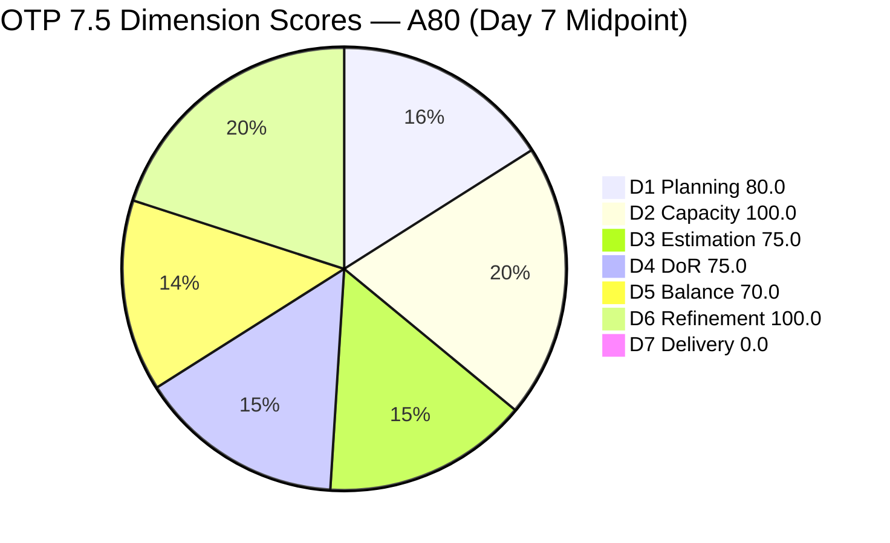
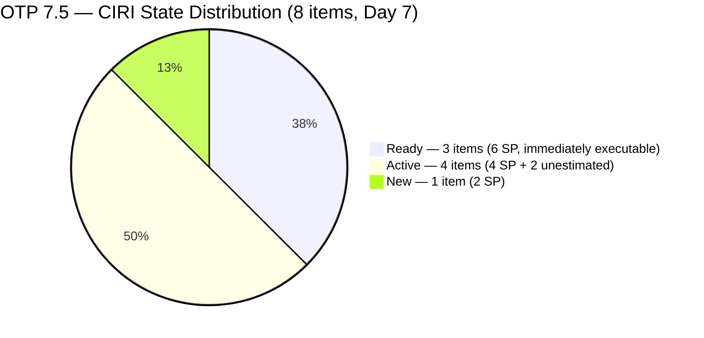
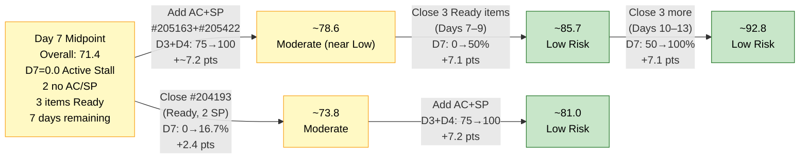

# ADO SAFe Audit — Office of the President (OTP Team)

## 1. Audit Metadata

| Field | Value |
|---|---|
| **Audit Date** | 2026-06-07 CST |
| **Sprint Day** | **7 of 14** |
| **Prior Audit** | A79 — `AUDIT_20260606_0900.md` (Overall 71.4, Moderate Risk — 7.5 Day 6) |
| **ADO Project** | OTP (`e7739905-28a3-4ae1-9173-7f6cd13b3494`) |
| **ADO Team** | OTP Team (`64de61f0-1203-4b01-aee2-6b4415aec52b`) |
| **Iteration** | Iteration 7.5 (`d1bb3b59-5d69-4489-987c-c5577c0a3cf1`) |
| **Iteration Path** | `OTP\2026 - PI7\Iteration 7.5` |
| **Iteration Dates** | Jun 1, 2026 – Jun 14, 2026 |
| **Workspace Folder** | `ado_otp` |
| **Overall Score** | **71.4 — Moderate Risk** |
| **Risk Band** | Moderate (60–79.9) |
| **Visible Backlog Items (VRBI)** | 10 open root items |
| **Current Iteration Root Items (CIRI)** | 8 items (IterationPath = Iteration 7.5) |
| **Capacity** | Grace: 2.15h/day — configured (Development 0.15h + Documentation 1h + Requirements 1h) |
| **Project Exception Applied** | Single-assignee model (Grace) — accepted per workspace CLAUDE.md |

---

## 2. Executive Summary

The OTP team holds at **71.4 — Moderate Risk** on Day 7 of Iteration 7.5, **unchanged from A79 (Day 6)**. No ADO work item changes occurred between the close of A79 and this audit — no closures, no state transitions, no DoR remediation, and no new items entered or exited the backlog. The score plateau is now a concern in its own right: the team has been at 71.4 for two consecutive audits with zero execution movement on the primary levers.

Key findings:

- **Zero delivery progress at sprint midpoint.** Today is Day 7 of 14 — the exact sprint midpoint. No CIRI items are in Closed/Done state. D7 = 0.0 is an active stall for the third consecutive audit day.
- **Two items (#205163, #205422) remain DoR non-compliant for Day 7.** Both lack Acceptance Criteria. D3 = 75.0 and D4 = 75.0 persist. Both have had solid Descriptions for a week — only AC is missing.
- **Three Ready items (#202912, #204193, #204194) have been in Ready state since Jun 1** — seven full days without transitioning to Active or Closed. These 6 SP represent immediately executable work.
- **D6 = 100.0 remains intact** — the backlog is fully fresh and the 45-day window is not threatened. However, if no ADO updates occur this week, untouched CIRI items could begin to surface before sprint end.
- The path to Low Risk (≥ 80.0) remains the same as A79: add AC + SP to #205163 and #205422, and close at least one Ready item. Closing both actions today would push Overall above 83.

---

## 3. Previous Audit Delta (A79 → A80)

| Dimension | A79 Score (7.5 Day 6) | A80 Score (7.5 Day 7) | Delta | Driver |
|---|---|---|---|---|
| D1 Iteration Planning | 80.0 | **80.0** | 0.0 | VRBI=10, CIRI=8 — no exits or entries |
| D2 Team Capacity | 100.0 | **100.0** | 0.0 | Grace capacity unchanged: 2.15h/day |
| D3 Estimation | 75.0 | **75.0** | 0.0 | #205163 + #205422 still null SP — seventh consecutive day |
| D4 DoR Compliance | 75.0 | **75.0** | 0.0 | #205163 + #205422 still no AC — seventh consecutive day |
| D5 Work Item Balance | 70.0 | **70.0** | 0.0 | US=6/8=75%, dominant-type penalty −30 unchanged |
| D6 Backlog Refinement | 100.0 | **100.0** | 0.0 | All 10 VRBI fresh; 0 untouched CIRI; no penalties |
| D7 Delivery Predictability | 0.0 | **0.0** | 0.0 | 0 SP closed; 12 SP committed. **Day 7 — sprint midpoint, active stall** |
| **Overall** | **71.4** | **71.4** | **0.0** | Complete score plateau — no ADO activity between A79 and A80 |

**Formula verification:** (80.0 + 100.0 + 75.0 + 75.0 + 70.0 + 100.0 + 0.0) / 7 = 500.0 / 7 = **71.4**

**Key transition observations A79 → A80:**
- **No ADO changes detected.** All 10 VRBI items show the same ChangedDate values as A79: Jun 1 (#202912, #204193, #204194), Jun 2 (#205163, #205240, #205422, #205438), Jun 4 (#205446), May 21 (#203864), Jun 1 (#205433).
- **#202912, #204193, #204194** remain in "Ready" state for the **seventh consecutive day** with no state transition.
- **#205163 and #205422** remain in "Active" state with null AC and null SP for the **seventh consecutive day**.
- **#205240** and **#205438** remain Active with full DoR compliance and no closure.
- **#205446** remains New — entered Jun 4 and has had no activity since.
- The score plateau confirms zero team execution between Day 6 and Day 7. This is now the most significant risk signal: the sprint is at its midpoint with 0 SP credited and all pending items in the same state as Day 2.

---

## 4. Current Iteration Snapshot

| Metric | Value |
|---|---|
| **Visible Backlog Items (VRBI)** | 10 |
| **Current Iteration Root Items (CIRI)** | 8 (IterationPath = `OTP\2026 - PI7\Iteration 7.5`) |
| **Non-current items** | 2 — #203864 (7.6), #205433 (7.6) |
| **Story Points Committed (CSP)** | 12 SP (6 estimated CIRI items) |
| **Story Points Closed (CLSP)** | 0 SP |
| **Sprint Day / Total** | **7 / 14** — midpoint |
| **Team Size (distinct CIRI assignees)** | 1 (Grace — all 8 items) |
| **Total Sprint Capacity** | 2.15h/day × 14 days = 30.1 hours |
| **Remaining Sprint Days** | 7 |
| **Iteration Start / Finish** | Jun 1, 2026 – Jun 14, 2026 |

*CSP = 12 SP: #202912(2), #204193(2), #204194(2), #205240(2), #205438(2), #205446(2). Items #205163 and #205422 have no SP.*

**State distribution:**
- Ready: 3 items (#202912, #204193, #204194) — 6 SP
- Active: 3 items (#205163, #205240, #205438, #205422 = 4 active) — wait: #205163 Active, #205240 Active, #205422 Active, #205438 Active = 4 Active items
- New: 1 item (#205446) — 2 SP

*Correction: Active=4 (#205163, #205240, #205422, #205438), Ready=3 (#202912, #204193, #204194), New=1 (#205446)*

---

## 5. Work Item Analysis

### Current Iteration Items (8 items — IterationPath = Iteration 7.5)

| ID | Title | Type | State | SP | DoR | ChangedDate | Days in Sprint |
|---|---|---|---|---|---|---|---|
| #202912 | Fabrication of Signage | User Story | Ready | 2 | **Pass** | Jun 1 | 7 — unchanged |
| #204193 | Philgeps Document Consolidation | User Story | Ready | 2 | **Pass** | Jun 1 | 7 — unchanged |
| #204194 | Philgeps Online Submission | User Story | Ready | 2 | **Pass** | Jun 1 | 7 — unchanged |
| #205163 | Business Requirements & Workflow Mapping | Spike | Active | — | **Fail** (no AC) | Jun 2 | 7 — Day 7 no AC |
| #205240 | Client SOW Verification | User Story | Active | 2 | **Pass** | Jun 2 | 7 |
| #205422 | JDVP DepEd Partnership Appointment | Enabler | Active | — | **Fail** (no AC) | Jun 2 | 7 — Day 7 no AC |
| #205438 | Draft Proposal for Chippens AI Inventory System | User Story | Active | 2 | **Pass** | Jun 2 | 7 |
| #205446 | Gather requirements for building loan application | User Story | New | 2 | **Pass** | Jun 4 | 4 |

*All 8 items assigned to Grace. SP "—" = null (unestimated).*

### Non-current Backlog Items (2 items — future iterations)

| ID | Title | Iteration | Type | State | SP | Changed |
|---|---|---|---|---|---|---|
| #203864 | Release and collect of TCT | 7.6 | User Story | New | 2 | May 21 |
| #205433 | Execute Pre-Filing Regulatory Compliance | 7.6 | User Story | New | 2 | Jun 1 |

### DoR Assessment — 8 CIRI Items

| ID | Title | Desc ≥ 30 NWS | AC ≥ 20 NWS | Result |
|---|---|---|---|---|
| #202912 | Fabrication of Signage | ✓ (~35 NWS) | ✓ (~20 NWS — 2 ACs) | **Pass** |
| #204193 | Philgeps Document Consolidation | ✓ (~38 NWS) | ✓ (~22 NWS — 2 ACs) | **Pass** |
| #204194 | Philgeps Online Submission | ✓ (~30 NWS) | ✓ (~10 NWS — 1 AC: "Submitted online application for renewal") | **Pass** |
| #205163 | Business Requirements & Workflow Mapping | ✓ (~65 NWS) | ✗ null — **Day 7** | **Fail — no AC** |
| #205240 | Client SOW Verification | ✓ (~80 NWS) | ✓ (very long multi-AC) | **Pass** |
| #205422 | JDVP DepEd Partnership Appointment | ✓ (~65 NWS) | ✗ null — **Day 7** | **Fail — no AC** |
| #205438 | Draft Proposal for Chippens AI Inventory System | ✓ (~75 NWS) | ✓ (very long multi-AC) | **Pass** |
| #205446 | Gather requirements for building loan application | ✓ (~90 NWS) | ✓ (very long multi-AC) | **Pass** |

**Pass: 6. Fail: 2 (#205163, #205422).** Both failing items have been in the sprint for 7 full days. AC is the sole missing element for both.

### Type Distribution (8 CIRI items)

| Type | Count | Share | D5 Impact |
|---|---|---|---|
| User Story | 6 | **75.0%** | Dominant-type penalty −30 active |
| Spike | 1 | 12.5% | — |
| Enabler | 1 | 12.5% | — |
| **Total** | **8** | **100%** | |

---

## 6. SAFe Compliance Scorecard

| Dimension | Score | Band | Evidence | Notes |
|---|---|---|---|---|
| D1 Iteration Planning | **80.0** | Low | 8 CIRI / 10 VRBI | Unchanged. No exits or entries since A79. |
| D2 Team Capacity | **100.0** | Low | 1/1 contributor with capacity | Grace 2.15h/day configured. Single-assignee accepted per Project Exception. |
| D3 Estimation | **75.0** | Moderate | 6 ECI / 8 PECI | Unchanged. #205163 + #205422 still null SP — **Day 7**. |
| D4 DoR Compliance | **75.0** | Moderate | 6 DCI / 8 CIRI | Unchanged. #205163 + #205422 still no AC — **Day 7**. |
| D5 Work Item Balance | **70.0** | Moderate | US=75% → >60% → penalty −30 | Unchanged. |
| D6 Backlog Refinement | **100.0** | Low | 10/10 fresh; 0 untouched CIRI | Unchanged. All CIRI items changed Jun 1+. No penalties. |
| D7 Delivery Predictability | **0.0** | Critical | 0 SP closed / 12 SP committed | **Day 7 — sprint midpoint. Active stall. No annotation.** |
| **OVERALL** | **71.4** | **Moderate** | (80.0+100.0+75.0+75.0+70.0+100.0+0.0)/7 | Zero delta from A79. Score plateau — no ADO activity detected. |

**Formula verification:** (80.0 + 100.0 + 75.0 + 75.0 + 70.0 + 100.0 + 0.0) / 7 = 500.0 / 7 = **71.4**

---

## 7. Dimension Findings

### D1 — Iteration Planning: 80.0 / 100 — Low Risk

**Formula:** CIRI / VRBI × 100 = 8 / 10 × 100 = **80.0**

| Metric | Value |
|---|---|
| Visible root backlog items (VRBI) | 10 |
| Items in Iteration 7.5 (CIRI) | 8 |
| Items in future iterations | 2 (#203864 in 7.6, #205433 in 7.6) |
| Score | **80.0** |

D1 is unchanged at 80.0 — at the Low Risk boundary. Both future-iteration items (#203864, #205433) are DoR-compliant and properly queued for 7.6. No new items were added and no CIRI items exited since A79. D1 remains fragile: any single CIRI exit without replacement would reduce the ratio below 80%.

---

### D2 — Team Capacity: 100.0 / 100 — Low Risk

**Formula:** CC / CW × 100 = 1 / 1 × 100 = **100.0**

| Metric | Value |
|---|---|
| Contributors with work on CIRI (CW) | 1 — Grace (all 8 items) |
| Contributors with capacity configured (CC) | 1 — Grace: 2.15h/day (Dev 0.15h + Doc 1h + Req 1h) |
| Total sprint capacity | 2.15h/day × 14 days = 30.1 hours |
| Remaining capacity | 2.15h/day × 7 days = 15.1 hours |
| Score | **100.0** |

Capacity unchanged and fully configured. With 7 days and 15.1 hours remaining, closing 12 SP (committed) at roughly 1.26h per SP is feasible. The capacity is not the constraint — execution cadence is.

---

### D3 — Estimation: 75.0 / 100 — Moderate Risk

**Formula:** ECI / PECI × 100 = 6 / 8 × 100 = **75.0**

| ID | Title | Type | SP | Estimated |
|---|---|---|---|---|
| #202912 | Fabrication of Signage | User Story | 2 | Yes |
| #204193 | Philgeps Document Consolidation | User Story | 2 | Yes |
| #204194 | Philgeps Online Submission | User Story | 2 | Yes |
| #205163 | Business Requirements & Workflow Mapping | Spike | — | **No (null SP — Day 7)** |
| #205240 | Client SOW Verification | User Story | 2 | Yes |
| #205422 | JDVP DepEd Partnership Appointment | Enabler | — | **No (null SP — Day 7)** |
| #205438 | Draft Proposal for Chippens AI Inventory System | User Story | 2 | Yes |
| #205446 | Gather requirements for building loan application | User Story | 2 | Yes |

Both #205163 and #205422 have been Active in the sprint for 7 consecutive days without a Story Points estimate. Estimating both at 2 SP would lift D3 to 8/8 = 100.0 and CSP from 12 to 16 SP.

---

### D4 — DoR Compliance: 75.0 / 100 — Moderate Risk

**Formula:** DCI / CIRI × 100 = 6 / 8 × 100 = **75.0**

| ID | Title | Desc ≥ 30 NWS | AC ≥ 20 NWS | Pass |
|---|---|---|---|---|
| #202912 | Fabrication of Signage | ✓ | ✓ | **Pass** |
| #204193 | Philgeps Document Consolidation | ✓ | ✓ | **Pass** |
| #204194 | Philgeps Online Submission | ✓ | ✓ | **Pass** |
| #205163 | Business Requirements & Workflow Mapping | ✓ | ✗ null — **Day 7** | **Fail** |
| #205240 | Client SOW Verification | ✓ | ✓ | **Pass** |
| #205422 | JDVP DepEd Partnership Appointment | ✓ | ✗ null — **Day 7** | **Fail** |
| #205438 | Draft Proposal for Chippens AI Inventory System | ✓ | ✓ | **Pass** |
| #205446 | Gather requirements for building loan application | ✓ | ✓ | **Pass** |

Both failing items have been in Active state for 7 days. The Description field is fully written for both — only the AcceptanceCriteria field is missing. A single ADO update per item (adding AC text) resolves both failures. Adding AC to both today would raise D4 from 75.0 → 100.0 and add approximately 3.6 points to Overall (71.4 → 75.0), and combined with D3 fix: Overall → ~78.6.

---

### D5 — Work Item Balance: 70.0 / 100 — Moderate Risk

**Formula:** Base 100 − penalties applied independently

| Penalty | Trigger | Applied |
|---|---|---|
| −40: No User Story in CIRI | 6 User Stories present | **No** |
| −30: Dominant type share > 60% | US = 6/8 = **75.0%** > 60% | **YES — applied** |
| −20: Spike share > 40% | Spike = 1/8 = 12.5% | **No** |

**Score:** 100 − 30 = **70.0**

The D5 penalty is persistent and deepening in relative impact as the sprint progresses. The User Story share remains at 75% — identical to A79. The only in-sprint paths to eliminating the penalty: (a) add 1–2 Spike or Enabler items to CIRI (diluting US share below 60%), or (b) close sufficient User Stories to change the ratio. At current CIRI size (8), closing 4 User Stories to reach ≤4 items remaining would require bringing US count to ≤ non-US count — not realistic given 7 days left.

---

### D6 — Backlog Refinement: 100.0 / 100 — Low Risk

**Freshness window:** ChangedDate ≥ 2026-04-23 (45 days before 2026-06-07)

| Metric | Value |
|---|---|
| Total VRBI | 10 |
| Fresh items (ChangedDate ≥ Apr 23, 2026) | 10 — oldest: #203864 (May 21) |
| Stale_90 items (ChangedDate < Mar 9, 2026) | 0 |
| Stale_180 items (ChangedDate < Dec 10, 2025) | 0 |
| Untouched CIRI (ChangedDate < Jun 1, 2026) | 0 — all 8 CIRI items changed Jun 1 or later |

**Penalty calculation:** No penalties applicable. **Score: 100.0**

The backlog remains fully fresh on Day 7. The three Active items (#205163, #205240, #205422, #205438) last changed Jun 2 — 5 days ago. If these items receive no ADO updates through sprint end (Jun 14), their ChangedDate will be Jun 2, which remains within the 45-day freshness window (45 days from Jun 2 = Jul 17). D6 is not at risk from staleness within this sprint.

---

### D7 — Delivery Predictability: 0.0 / 100 — Critical

**Formula:** CLSP / CSP × 100 = 0 / 12 × 100 = **0.0**

> **Active stall (Day 7 of 14 — Sprint Midpoint):** The early-sprint annotation window (Days 1–5) expired two days ago. D7 = 0.0 for the third consecutive audit in the active zone (Days 5, 6, 7). No state transitions occurred overnight.

| Metric | Value |
|---|---|
| Estimated current items (ECI) | 6 |
| Committed Story Points (CSP) | 12 SP |
| Closed Story Points (CLSP) | 0 SP |
| Items in Ready state | 3 — #202912, #204193, #204194 (6 SP available immediately) |
| Items in Active state | 4 — #205163, #205240, #205422, #205438 |
| Items in New state | 1 — #205446 |
| Score | **0.0** |

**Sprint midpoint analysis:** At Day 7 of 14, with 0 SP closed from CIRI and 7 days remaining, Grace needs to close an average of 1.7 SP/day to reach D7 = 100.0 (12 SP in 7 days). Total remaining capacity is 15.1 hours (2.15h/day × 7 days). At 2 SP per item, that is 6 closures in 7 days — feasible but requiring consistent daily execution.

The three Ready items (#202912, #204193, #204194) are DoR-compliant and immediately executable — no additional grooming required. Grace can begin executing these today without any ADO preparation.

---

## 8. Risks and Bottlenecks

| # | Severity | Dimension | Risk | Recommended Action |
|---|---|---|---|---|
| R1 | **CRITICAL** | D7 | Sprint midpoint (Day 7) with 0 SP closed from CIRI. Three consecutive audits with D7 = 0.0 in the active execution zone (Days 5–7). Three Ready items have been queued for 7 days without execution. The window to recover D7 above 50% (a Moderate Risk band) narrows by approximately 1.7 SP per day. | **Grace: close #204193 (Philgeps Document Consolidation, Ready, 2 SP) today.** This is the highest-leverage single action: D7 moves from 0.0 → 16.7%, Overall from 71.4 → 73.8. Then close #204194 (Philgeps Online Submission, also Ready, DoR pass) tomorrow. Two closures in two days = D7 → 33.3%, Overall → ~76.2. |
| R2 | **CRITICAL** | D3 + D4 | #205163 and #205422 have been in Active state for 7 consecutive days with no AC and no SP. As CIRI potentially shrinks through closures, these two failures will represent an increasing share of D3 and D4 denominators. Day 7 is the point at which remediation becomes urgent — 7 more days remaining. | **Grace: add Acceptance Criteria and Story Points (2 SP) to #205163 and #205422 today.** Suggested AC for #205163: "AC1: Business Requirements Document (BRD) draft submitted to Ramon for review. AC2: All identified workflow gaps documented with responsible owner and target resolution timeline." Suggested AC for #205422: "AC1: Formal appointment request sent to DepEd JDVP focal and confirmed in writing. AC2: Meeting date secured and agenda shared with team before appointment." Effect: D3 → 100.0, D4 → 100.0, Overall → ~78.6. |
| R3 | **HIGH** | D7 (structural) | The sprint midpoint has passed with 0 SP credited. Even with 7 remaining days, closing all 12 committed SP requires Grace to average 1.7 SP/day consistently — this is achievable but leaves no slack for blockers or interruptions. If only 6 SP close, D7 = 50% and Overall ≈ 82.4 (Low Risk). If only 4 SP close, D7 = 33.3% and Overall ≈ 79.1 (borderline Moderate/Low). | Prioritize: #204193 → #204194 → #202912 in that sequence. All three are Ready, DoR-compliant, and do not require any new ADO preparation. After closing the Ready items, execute #205438 (Active, full DoR, 2 SP) and #205240 (Active, full DoR, 2 SP). |
| R4 | **HIGH** | D5 | User Story dominance at 75% (6/8) applies the −30 D5 penalty for the seventh consecutive day. This structural drag removes 30 points from the score and cannot be eliminated within current sprint scope without adding non-US items. | If Grace has any new ad-hoc tasks emerging this week, add them to CIRI as Spike or Enabler type rather than User Story. Adding 2 non-US items would bring US share from 75% to 60% (6/10) — exactly on the threshold. |
| R5 | **MEDIUM** | D7 + process | Ramon: the seven-day Ready-item stall is the most visible execution concern. Three items (#202912, #204193, #204194) have been queued for exactly one week without any state change. This pattern recurred in previous iterations (A4–A5, March 2026). | Ramon: schedule a 15-minute synchronous check-in with Grace today to identify any hidden blockers. If external dependencies exist (vendor confirmation for Signage, document readiness for Philgeps), add "Blocked" tag and blocker note to each affected item. This preserves D6 freshness and gives visibility. |
| R6 | **LOW** | D1 | D1 = 80.0 is at the exact Low Risk boundary. Any CIRI exit (from closure) without a replacement would drop D1 below 80.0 and into Moderate Risk territory. | When a CIRI item closes, either add a new item from the backlog to CIRI, or move a future-iteration item (#203864, #205433) to 7.5 if appropriate. |

---

## 9. Prioritized Recommendations

1. **[CRITICAL — Today Day 7]** Grace: close #204193 (Philgeps Document Consolidation). This item has been in Ready state for 7 days and is fully DoR-compliant. Closing it today moves D7 from 0.0 → 16.7% and Overall from 71.4 → 73.8. The sprint midpoint has passed — every additional day of 0 SP against 12 SP committed makes sprint-end recovery statistically less likely.

2. **[CRITICAL — Today Day 7]** Grace: add Acceptance Criteria and Story Points to #205163 (Business Requirements & Workflow Mapping) and #205422 (JDVP DepEd Partnership Appointment). Seven consecutive days without AC is the second major score suppressor. Combined effect of fixing both: D3 and D4 each rise to 100.0, adding ~7.1 points to Overall (from 71.4 → ~78.6). With a D7 closure also, Overall approaches 80.0.
   - **#205163 AC suggestion:** "AC1: BRD draft submitted to Ramon for review. AC2: All identified workflow gaps documented with responsible owner and target timeline."
   - **#205422 AC suggestion:** "AC1: Formal appointment confirmed in writing with DepEd JDVP focal. AC2: Meeting date and agenda shared with team."

3. **[HIGH — Days 7–9]** Grace: close #204194 (Philgeps Online Submission) and #202912 (Fabrication of Signage) — both Ready and DoR-compliant. Two additional closures bring cumulative CLSP to 6 SP → D7 → 50.0% → High Risk band. Three closures bring D7 → 50.0% and Overall to approximately 79.2 (approaching Low Risk).

4. **[HIGH — Days 8–11]** Grace: execute and close Active items with full DoR compliance — #205240 (Client SOW Verification, 2 SP) and #205438 (Draft Proposal, 2 SP). Combined with Ready closures, these 4 closures would put D7 at 10/12 = 83.3% and Overall at approximately 83+ (Low Risk).

5. **[MEDIUM — Days 8–10]** If any new work items enter the sprint, add them as Spike or Enabler type to dilute the US share below 60% and eliminate the D5 −30 penalty. Each new non-US item reduces the US fraction: adding 2 non-US items brings US share to 6/10 = 60.0% — exactly on the boundary.

6. **[STANDING]** Update ADO daily on all Active items. Particularly #205163 and #205422 — their work-in-progress (BRD drafting, DepEd coordination) should be logged in comments or description updates to maintain D6 freshness and provide delivery visibility for Ramon.

---

## 10. Visualizations

### Score Trend (A74 → A80)

```mermaid
graph LR
    A74["A74 — 7.5 D1\n64.5 Moderate"] --> A75["A75 — 7.5 D2\n73.8 Moderate"]
    A75 --> A76["A76 — 7.5 D3\n73.8 Moderate"]
    A76 --> A77["A77 — 7.5 D4\n75.7 Moderate"]
    A77 --> A78["A78 — 7.5 D5\n73.3 Moderate"]
    A78 --> A79["A79 — 7.5 D6\n71.4 Moderate"]
    A79 --> A80["A80 — 7.5 D7\n71.4 Moderate"]
    style A74 fill:#FFF9C4,stroke:#F9A825,color:#000
    style A75 fill:#FFF9C4,stroke:#F9A825,color:#000
    style A76 fill:#FFF9C4,stroke:#F9A825,color:#000
    style A77 fill:#FFF9C4,stroke:#F9A825,color:#000
    style A78 fill:#FFF9C4,stroke:#F9A825,color:#000
    style A79 fill:#FFF9C4,stroke:#F9A825,color:#000
    style A80 fill:#FFF9C4,stroke:#F9A825,color:#000
```

### Dimension Scores — A80 (Day 7)

### CIRI State Distribution — Day 7 (Sprint Midpoint)

### Recovery Path — From Day 7 Midpoint

---

## 11. Evidence Gaps and Limitations

| Gap | Impact | Notes |
|---|---|---|
| #205163 — AcceptanceCriteria null | D4 Fail (definitive) | AC field absent from ADO for 7 consecutive days. Desc is fully written. Only AC field missing. |
| #205422 — AcceptanceCriteria null | D4 Fail (definitive) | Same as above. Enabled type with full BDD description but no AC. |
| #205163, #205422 — StoryPoints null | D3 PECI miss (definitive) | Both items in Active execution without SP. ECI = 6/8. |
| D7 rubric limitation | D7 underreports historical delivery | #205241 and #205443 exited backlog in Days 5–6 (likely closed, ~4 SP). Per rubric, D7 is computed from live CIRI only. Actual sprint delivery is higher than D7 = 0.0 reflects. |
| #202912 vendor dependency | Potential hidden blocker | Fabrication of Signage (Ready, 2 SP) may depend on external vendor. If blocked, Grace should tag "Blocked" in ADO to preserve evidence quality. |
| Single-assignee model | D2 structural note | All 8 CIRI items assigned to Grace. D2 = 100.0 per Project Exception. The structural constraint of a single contributor executing 12 SP in 7 days (1.7 SP/day) is feasible but offers no buffer. |

---

## 12. Audit Trail

| Source | Tool | Data |
|---|---|---|
| Team GUID resolution | `core_list_project_teams` (project `e7739905`) | OTP Team: `64de61f0-1203-4b01-aee2-6b4415aec52b` (confirmed) |
| Current iteration | `work_list_team_iterations` (project `e7739905`, team `64de61f0`, timeframe=current) | Iteration 7.5: Jun 1–14, 2026; ID `d1bb3b59-5d69-4489-987c-c5577c0a3cf1` |
| Backlog items | `wit_list_backlog_work_items` (backlogId `Microsoft.RequirementCategory`) | 10 open root items (unchanged from A79) |
| Work item details | `wit_get_work_items_batch_by_ids` (10 backlog items) | SP, State, Type, Desc, AC, ChangedDate, IterationPath confirmed for all 10 items |
| Team capacity | `work_get_team_capacity` (project `e7739905`, team `64de61f0`, iterationId `d1bb3b59`) | Grace: 2.15h/day (Dev 0.15h + Doc 1h + Req 1h), 0 days off — unchanged |
| Prior audit | `AUDIT_20260606_0900.md` (A79) | Overall 71.4, Moderate Risk, 7.5 Day 6, 10 VRBI, 8 CIRI, 12 SP committed, 0 SP closed |
