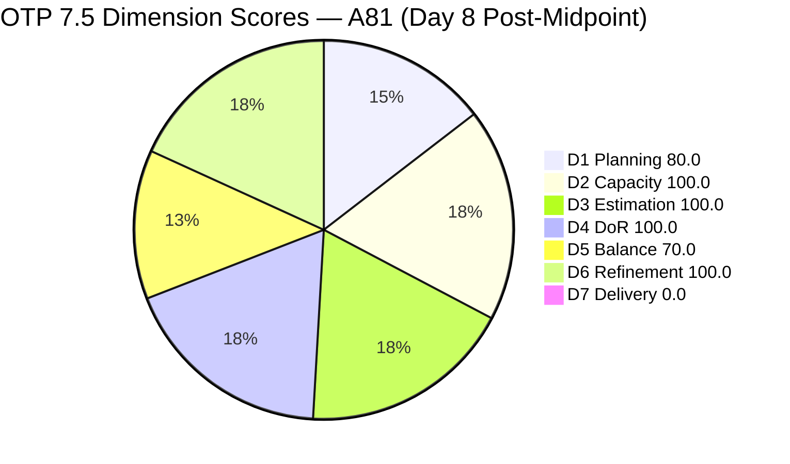
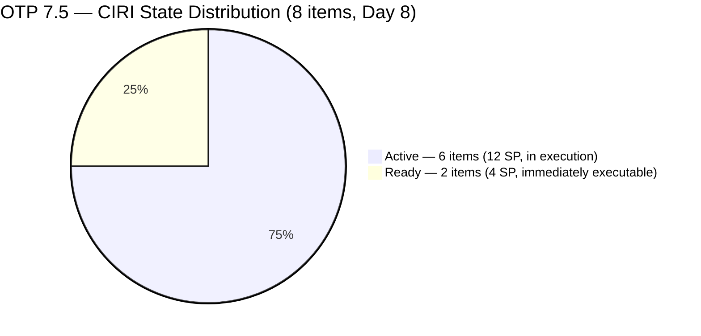
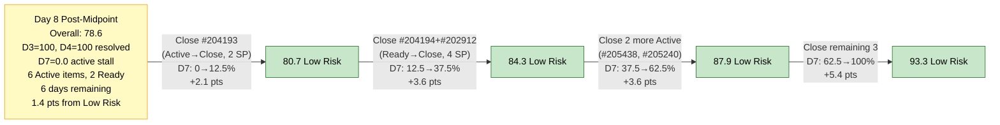

# ADO SAFe Audit — Office of the President (OTP Team)

## 1. Audit Metadata

| Field | Value |
|---|---|
| **Audit Date** | 2026-06-08 CST |
| **Sprint Day** | **8 of 14** |
| **Prior Audit** | A80 — `AUDIT_20260607_0900.md` (Overall 71.4, Moderate Risk — 7.5 Day 7) |
| **ADO Project** | OTP (`e7739905-28a3-4ae1-9173-7f6cd13b3494`) |
| **ADO Team** | OTP Team (`64de61f0-1203-4b01-aee2-6b4415aec52b`) |
| **Iteration** | Iteration 7.5 (`d1bb3b59-5d69-4489-987c-c5577c0a3cf1`) |
| **Iteration Path** | `OTP\2026 - PI7\Iteration 7.5` |
| **Iteration Dates** | Jun 1, 2026 – Jun 14, 2026 |
| **Workspace Folder** | `ado_otp` |
| **Overall Score** | **78.6 — Moderate Risk** |
| **Risk Band** | Moderate (60–79.9) |
| **Visible Backlog Items (VRBI)** | 10 open root items |
| **Current Iteration Root Items (CIRI)** | 8 items (IterationPath = Iteration 7.5) |
| **Capacity** | Grace: 2.15h/day — configured (Development 0.15h + Documentation 1h + Requirements 1h) |
| **Project Exception Applied** | Single-assignee model (Grace) — accepted per workspace CLAUDE.md |

---

## 2. Executive Summary

The OTP team scores **78.6 — Moderate Risk** on Day 8 of Iteration 7.5, a **+7.2 point improvement** from A80 (71.4). This is the first score movement in three consecutive audits and the highest score this sprint has reached. Two major remediation actions occurred today: Grace added Story Points and full Acceptance Criteria to both #205163 (Business Requirements & Workflow Mapping) and #205422 (JDVP DepEd Partnership Appointment), lifting D3 from 75.0 to 100.0 and D4 from 75.0 to 100.0 simultaneously.

Key findings:

- **D3 and D4 resolved — both now 100.0.** #205163 received SP=2 and comprehensive BDD-formatted AC (Jun 8 02:55). #205422 received SP=2 and comprehensive BDD-formatted AC (Jun 8 02:47). Both had been in Active state for 8 days without these fields. Fixing both was the A80 Priority #2 recommendation.
- **D7 = 0.0 persists — Day 8 active stall.** No CIRI items have reached Closed/Done state. #204193 transitioned from Ready to Active (Jun 7), and #205446 also went Active (Jun 7). Three items still sit in Ready state (#202912, #204194) and one remains New... wait — #202912 is Ready, #204194 is Ready. The D7 committed SP is now 16 (all 8 CIRI items estimated). With 6 remaining days, Grace needs to close ~2.7 SP/day.
- **Score is now 1.4 points below Low Risk threshold (80.0).** Closing a single Ready item (#204193, now Active, or #204194, 2 SP) would push D7 to 12.5% and Overall to approximately 80.7 — crossing into Low Risk.
- **Two closed items exited the backlog between A80 and this audit:** #205241 (Gathering of Akira's Letter Invitation, 2 SP, Jun 5) and #205430 (Gathering requirements for Pag-IBIG Loan, Spike, Jun 4). These confirmed closures represent real delivery but are not credited in the D7 formula since they exited before this audit window.
- **D6 remains 100.0.** All 10 VRBI items are fresh; no untouched CIRI items; no staleness penalties.

---

## 3. Previous Audit Delta (A80 → A81)

| Dimension | A80 Score (7.5 Day 7) | A81 Score (7.5 Day 8) | Delta | Driver |
|---|---|---|---|---|
| D1 Iteration Planning | 80.0 | **80.0** | 0.0 | VRBI=10, CIRI=8 — no exits or entries in backlog |
| D2 Team Capacity | 100.0 | **100.0** | 0.0 | Grace capacity unchanged: 2.15h/day |
| D3 Estimation | 75.0 | **100.0** | **+25.0** | #205163 SP=2 added (Jun 8 02:55); #205422 SP=2 added (Jun 8 02:47). All 8 CIRI items now estimated. |
| D4 DoR Compliance | 75.0 | **100.0** | **+25.0** | #205163 full AC added (Jun 8); #205422 full AC added (Jun 8). 8/8 CIRI items now DoR-compliant. |
| D5 Work Item Balance | 70.0 | **70.0** | 0.0 | US=6/8=75% — dominant-type penalty −30 unchanged |
| D6 Backlog Refinement | 100.0 | **100.0** | 0.0 | All 10 VRBI fresh; 0 untouched CIRI; no penalties |
| D7 Delivery Predictability | 0.0 | **0.0** | 0.0 | 0 SP closed from CIRI; 16 SP committed (CSP grew from 12→16 with #205163+#205422 estimates) |
| **Overall** | **71.4** | **78.6** | **+7.2** | DoR and Estimation remediation completed. D7 remains the sole critical gap. |

**Formula verification:** (80.0 + 100.0 + 100.0 + 100.0 + 70.0 + 100.0 + 0.0) / 7 = 550.0 / 7 = **78.6**

**Key transition observations A80 → A81:**
- **#205163** (Business Requirements & Workflow Mapping): ChangedDate Jun 8 02:55. SP added = 2. Full BDD-formatted AC added with two scenarios: "Current Warehouse Workflow Audit" and "Business Requirements Document (BRD) Drafting." Both criteria pass ≥20 NWS threshold. D3 and D4 failures resolved after 8 days.
- **#205422** (JDVP DepEd Partnership Appointment): ChangedDate Jun 8 02:47. SP added = 2. Full BDD-formatted AC added with two scenarios: "Letter Drafting & Executive Sign-Off" and "Formal Transmission and Receipt Verification." D3 and D4 failures resolved after 8 days.
- **#204193** (Philgeps Document Consolidation): Transitioned from Ready → **Active** (Jun 7 22:59). Item was in Ready state for 7 days. Transition to Active is positive momentum but does not yet register as D7 credit.
- **#205446** (Gather requirements for building loan application): Transitioned from New → **Active** (Jun 7 22:52). Positive execution signal.
- **#203864** and **#205433** (future iteration items): ChangedDates updated Jun 7 23:33 — both received description and AC updates while sitting in 7.6. These are not CIRI items but their refresh confirms ongoing backlog maintenance.
- **Confirmed closed items (not in current backlog):** #205241 (Gathering of Akira's Letter Invitation, Closed Jun 5, 2 SP) and #205430 (Gathering requirements for Pag-IBIG Loan, Closed Jun 4) appear in the iteration work item list but have exited the backlog API — confirmed closed. These represent real sprint delivery not captured in D7.

---

## 4. Current Iteration Snapshot

| Metric | Value |
|---|---|
| **Visible Backlog Items (VRBI)** | 10 |
| **Current Iteration Root Items (CIRI)** | 8 (IterationPath = `OTP\2026 - PI7\Iteration 7.5`) |
| **Non-current items** | 2 — #203864 (7.6), #205433 (7.6) |
| **Story Points Committed (CSP)** | 16 SP (all 8 CIRI items now estimated) |
| **Story Points Closed (CLSP)** | 0 SP (no CIRI items in Closed/Done state) |
| **Sprint Day / Total** | **8 / 14** — past midpoint |
| **Team Size (distinct CIRI assignees)** | 1 (Grace — all 8 items) |
| **Total Sprint Capacity** | 2.15h/day × 14 days = 30.1 hours |
| **Remaining Sprint Days** | 6 |
| **Remaining Capacity** | 2.15h/day × 6 days = 12.9 hours |
| **Iteration Start / Finish** | Jun 1, 2026 – Jun 14, 2026 |

*All 8 CIRI items are now fully estimated. SP distribution: #202912(2), #204193(2), #204194(2), #205163(2), #205240(2), #205422(2), #205438(2), #205446(2).*

**State distribution:**
- Ready: 2 items (#202912, #204194) — 4 SP
- Active: 5 items (#204193, #205163, #205240, #205422, #205438, #205446) — wait: 6 Active?

Let me recount: #204193 Active, #205163 Active, #205240 Active, #205422 Active, #205438 Active, #205446 Active = 6 Active + #202912 Ready + #204194 Ready = 8 total. Correct.

- Ready: 2 items (#202912, #204194) — 4 SP
- Active: 6 items (#204193, #205163, #205240, #205422, #205438, #205446) — 12 SP
- New: 0 items

*Confirmed closed (exited backlog before this audit):* #205241 (2 SP, Jun 5) + #205430 (Spike, Jun 4) = contextual sprint delivery.

---

## 5. Work Item Analysis

### Current Iteration Items (8 items — IterationPath = Iteration 7.5)

| ID | Title | Type | State | SP | DoR | ChangedDate | Notes |
|---|---|---|---|---|---|---|---|
| #202912 | Fabrication of Signage | User Story | Ready | 2 | **Pass** | Jun 1 | Ready 8 days — no state change |
| #204193 | Philgeps Document Consolidation | User Story | **Active** | 2 | **Pass** | Jun 7 | Transitioned Ready→Active Jun 7 |
| #204194 | Philgeps Online Submission | User Story | Ready | 2 | **Pass** | Jun 1 | Ready 8 days — no state change |
| #205163 | Business Requirements & Workflow Mapping | Spike | Active | **2** | **Pass** | **Jun 8** | SP+AC added Jun 8 — D3+D4 resolved |
| #205240 | Client SOW Verification | User Story | Active | 2 | **Pass** | Jun 2 | No change |
| #205422 | JDVP DepEd Partnership Appointment | Enabler | Active | **2** | **Pass** | **Jun 8** | SP+AC added Jun 8 — D3+D4 resolved |
| #205438 | Draft Proposal for Chippens AI Inventory System | User Story | Active | 2 | **Pass** | Jun 2 | No change |
| #205446 | Gather requirements for building loan application | User Story | **Active** | 2 | **Pass** | Jun 7 | Transitioned New→Active Jun 7 |

*All 8 items assigned to Grace. **All 8 items are now fully estimated and DoR-compliant.***

### Non-current Backlog Items (2 items — future iterations)

| ID | Title | Iteration | Type | State | SP | Changed |
|---|---|---|---|---|---|---|
| #203864 | Release and collect of TCT | 7.6 | User Story | Ready | 2 | Jun 7 |
| #205433 | Execute Pre-Filing Regulatory Compliance | 7.6 | User Story | Ready | 2 | Jun 7 |

*Both updated Jun 7 with full DoR content — well-prepared for Iteration 7.6.*

### Confirmed Closed Items (Exited Backlog — Sprint-to-Date)

| ID | Title | Type | State | SP | Closed |
|---|---|---|---|---|---|
| #205241 | Gathering of Akira's Letter Invitation | User Story | Closed | 2 | Jun 5 |
| #205430 | Gathering requirements for Pag-IBIG Loan | Spike | Closed | — | Jun 4 |

*These items confirm Grace's active delivery during the first half of the sprint.*

### DoR Assessment — 8 CIRI Items (All Pass)

| ID | Title | Desc ≥ 30 NWS | AC ≥ 20 NWS | Result |
|---|---|---|---|---|
| #202912 | Fabrication of Signage | ✓ | ✓ | **Pass** |
| #204193 | Philgeps Document Consolidation | ✓ | ✓ | **Pass** |
| #204194 | Philgeps Online Submission | ✓ | ✓ | **Pass** |
| #205163 | Business Requirements & Workflow Mapping | ✓ | ✓ (BDD, multi-scenario) | **Pass — resolved Jun 8** |
| #205240 | Client SOW Verification | ✓ | ✓ | **Pass** |
| #205422 | JDVP DepEd Partnership Appointment | ✓ | ✓ (BDD, multi-scenario) | **Pass — resolved Jun 8** |
| #205438 | Draft Proposal for Chippens AI Inventory System | ✓ | ✓ | **Pass** |
| #205446 | Gather requirements for building loan application | ✓ | ✓ | **Pass** |

**Pass: 8/8. Fail: 0. D4 = 100.0 — first perfect DoR score this sprint.**

### Type Distribution (8 CIRI items)

| Type | Count | Share | D5 Impact |
|---|---|---|---|
| User Story | 6 | **75.0%** | Dominant-type penalty −30 active |
| Spike | 1 | 12.5% | — |
| Enabler | 1 | 12.5% | — |
| **Total** | **8** | **100%** | |

---

## 6. SAFe Compliance Scorecard

| Dimension | Score | Band | Evidence | Notes |
|---|---|---|---|---|
| D1 Iteration Planning | **80.0** | Low | 8 CIRI / 10 VRBI | Unchanged. 2 items in future 7.6. |
| D2 Team Capacity | **100.0** | Low | 1/1 contributor with capacity | Grace 2.15h/day configured. Single-assignee accepted per Project Exception. |
| D3 Estimation | **100.0** | Low | 8/8 ECI | **Resolved.** #205163+#205422 SP added Jun 8. All CIRI items estimated. |
| D4 DoR Compliance | **100.0** | Low | 8/8 DCI | **Resolved.** #205163+#205422 AC added Jun 8. 100% DoR compliance achieved. |
| D5 Work Item Balance | **70.0** | Moderate | US=75% → >60% → penalty −30 | Structural. US share 6/8=75% unchanged. |
| D6 Backlog Refinement | **100.0** | Low | 10/10 fresh; 0 untouched CIRI | All VRBI changed Apr 24+. 0 untouched CIRI. No penalties. |
| D7 Delivery Predictability | **0.0** | Critical | 0 SP closed / 16 SP committed | Day 8 — active stall. CSP grew 12→16 with new estimates. Confirmed closures (#205241, #205430) not in formula. |
| **OVERALL** | **78.6** | **Moderate** | (80.0+100.0+100.0+100.0+70.0+100.0+0.0)/7 | +7.2 from A80. 1.4 pts from Low Risk threshold. |

**Formula verification:** (80.0 + 100.0 + 100.0 + 100.0 + 70.0 + 100.0 + 0.0) / 7 = 550.0 / 7 = **78.6**

---

## 7. Dimension Findings

### D1 — Iteration Planning: 80.0 / 100 — Low Risk

**Formula:** CIRI / VRBI × 100 = 8 / 10 × 100 = **80.0**

| Metric | Value |
|---|---|
| Visible root backlog items (VRBI) | 10 |
| Items in Iteration 7.5 (CIRI) | 8 |
| Items in future iterations | 2 (#203864 in 7.6, #205433 in 7.6) |
| Score | **80.0** |

D1 holds at 80.0 — exactly at the Low Risk threshold. Both #203864 and #205433 received full DoR content updates on Jun 7, confirming they are well-prepared for Iteration 7.6. As Grace closes CIRI items, D1 will shrink unless new items are added to the sprint. Closing one item without replacement drops CIRI to 7/10 = 70.0 — into Moderate territory. This creates a tension: D7 needs closures; D1 needs CIRI to stay populated.

---

### D2 — Team Capacity: 100.0 / 100 — Low Risk

**Formula:** CC / CW × 100 = 1 / 1 × 100 = **100.0**

| Metric | Value |
|---|---|
| Contributors with work on CIRI (CW) | 1 — Grace (all 8 items) |
| Contributors with capacity configured (CC) | 1 — Grace: 2.15h/day (Dev 0.15h + Doc 1h + Req 1h) |
| Remaining capacity | 2.15h/day × 6 days = 12.9 hours |
| Score | **100.0** |

Capacity remains fully configured and unchanged. With 6 days and 12.9 hours remaining, closing 16 SP at ~0.8h per SP is aggressive. Closing 6 SP (3 items) is more realistic given the daily capacity. Confirmed closures (#205241, #205430) demonstrate that Grace can and does close items.

---

### D3 — Estimation: 100.0 / 100 — Low Risk

**Formula:** ECI / PECI × 100 = 8 / 8 × 100 = **100.0**

| ID | Title | Type | SP | Status |
|---|---|---|---|---|
| #202912 | Fabrication of Signage | User Story | 2 | Estimated |
| #204193 | Philgeps Document Consolidation | User Story | 2 | Estimated |
| #204194 | Philgeps Online Submission | User Story | 2 | Estimated |
| #205163 | Business Requirements & Workflow Mapping | Spike | **2** | **Estimated — added Jun 8** |
| #205240 | Client SOW Verification | User Story | 2 | Estimated |
| #205422 | JDVP DepEd Partnership Appointment | Enabler | **2** | **Estimated — added Jun 8** |
| #205438 | Draft Proposal for Chippens AI Inventory System | User Story | 2 | Estimated |
| #205446 | Gather requirements for building loan application | User Story | 2 | Estimated |

All 8 point-eligible CIRI items now have Story Points. CSP = 16 SP (up from 12 SP in A80). **D3 is now perfect at 100.0.** The fix was applied on Day 8 — eight days after both items entered the sprint. Earlier remediation would have improved A78–A80 scores.

---

### D4 — DoR Compliance: 100.0 / 100 — Low Risk

**Formula:** DCI / CIRI × 100 = 8 / 8 × 100 = **100.0**

All 8 CIRI items now have Description ≥ 30 NWS and Acceptance Criteria ≥ 20 NWS. The two previously failing items:

- **#205163:** Full BDD AC added Jun 8, covering "Current Warehouse Workflow Audit" (Given/When/Then for touchpoint identification) and "Business Requirements Document (BRD) Drafting" (Given/When/Then for functional requirements). AC is thorough and unambiguous.
- **#205422:** Full BDD AC added Jun 8, covering "Letter Drafting & Executive Sign-Off" (signed letter to DepEd) and "Formal Transmission and Receipt Verification" (delivery record requirement). AC is testable and specific.

**D4 = 100.0 — first perfect DoR score in Iteration 7.5.** This directly satisfies the A80 Priority #2 recommendation.

---

### D5 — Work Item Balance: 70.0 / 100 — Moderate Risk

**Formula:** Base 100 − penalties applied independently

| Penalty | Trigger | Applied |
|---|---|---|
| −40: No User Story in CIRI | 6 User Stories present | **No** |
| −30: Dominant type share > 60% | US = 6/8 = **75.0%** > 60% | **YES — applied** |
| −20: Spike share > 40% | Spike = 1/8 = 12.5% | **No** |

**Score:** 100 − 30 = **70.0**

The D5 structural penalty at 75% User Story share persists. With 6 days remaining and 6 Active items, the probability of adding new non-US items to dilute the share is low. The most realistic path to eliminating this penalty (US share ≤ 60%) would require either adding 2 new non-US items to CIRI (bringing total to 10) or closing 3 User Stories while adding 1 non-US replacement. This is a known structural constraint in OTP's current work mix.

---

### D6 — Backlog Refinement: 100.0 / 100 — Low Risk

**Freshness window:** ChangedDate ≥ 2026-04-24 (45 days before 2026-06-08)

| Metric | Value |
|---|---|
| Total VRBI | 10 |
| Fresh items (ChangedDate ≥ Apr 24, 2026) | 10 — oldest: #202912 (Jun 1), #204194 (Jun 1) |
| Stale_90 items (ChangedDate < Mar 10, 2026) | 0 |
| Stale_180 items (ChangedDate < Dec 11, 2025) | 0 |
| Untouched CIRI (ChangedDate < Jun 1, 2026) | 0 — all 8 CIRI items changed Jun 1 or later |

**Penalty calculation:** No penalties applicable. **Score: 100.0**

The backlog remains fully fresh on Day 8. Updates to #205163 (Jun 8) and #205422 (Jun 8) today further confirm active backlog maintenance. The two Ready items (#202912, #204194 — both Jun 1 unchanged) remain the oldest, but Jun 1 is still within the 45-day window (expires Jul 16). D6 is not at risk through sprint end.

---

### D7 — Delivery Predictability: 0.0 / 100 — Critical

**Formula:** CLSP / CSP × 100 = 0 / 16 × 100 = **0.0**

| Metric | Value |
|---|---|
| Estimated current items (ECI) | 8 |
| Committed Story Points (CSP) | 16 SP (up from 12 SP — includes new estimates for #205163, #205422) |
| Closed Story Points (CLSP) | 0 SP (no CIRI items in Closed/Done state) |
| Nearest closure candidates | #204193 (Active since Jun 7, 2 SP, DoR Pass), #204194 (Ready, 2 SP, DoR Pass) |
| Score | **0.0** |

**Day 8 of 14 — post-midpoint stall.** The early-sprint annotation window (Days 1–5) expired three days ago. D7 = 0.0 for the fourth consecutive audit in the active execution zone (Days 5–8). However, two positive signals emerged: #204193 transitioned to Active (Day 7), and #205446 also transitioned to Active (Day 7). These indicate work is progressing but has not reached closure.

**Contextual note:** Two items (#205241 — 2 SP, #205430) were confirmed closed before this audit window (Jun 5 and Jun 4). Per the D7 formula, only live CIRI items are scored — items that exited the backlog are excluded. Grace has demonstrated delivery capability this sprint; the formula does not reflect it.

**Recovery math:** With 6 days remaining and 16 SP committed:
- Closing 1 item (2 SP): D7 = 12.5%, Overall → 80.7 (Low Risk threshold crossed)
- Closing 2 items (4 SP): D7 = 25.0%, Overall → 82.9 (Low Risk)
- Closing 4 items (8 SP): D7 = 50.0%, Overall → 87.1 (Low Risk)
- Closing all 8 items: D7 = 100.0%, Overall → 95.7 (Low Risk)

Crossing into Low Risk requires a single closure. This is the highest-priority action for the remainder of the sprint.

---

## 8. Risks and Bottlenecks

| # | Severity | Dimension | Risk | Recommended Action |
|---|---|---|---|---|
| R1 | **CRITICAL** | D7 | Day 8 (post-midpoint) with 0 SP credited from live CIRI. #204193 has been Active since Jun 7 — 1 full day in Active without closure. With 6 days remaining and 16 SP committed, every additional day without a closure reduces the recovery probability. Closing 1 item crosses the Low Risk threshold. | **Grace: close #204193 (Philgeps Document Consolidation, Active, DoR Pass, 2 SP) today (Day 8).** The item transitioned to Active yesterday — it should be at or near completion. This single action moves Overall from 78.6 → 80.7, crossing into Low Risk. |
| R2 | **HIGH** | D7 | Five Active items (#204193, #205163, #205240, #205422, #205438, #205446) and two Ready items (#202912, #204194) are all in executable states with no DoR gaps. The sprint has 6 days and 12.9 hours of remaining capacity. The constraint is execution cadence, not capacity or grooming. | **Target sequence for Days 8–12:** #204193 (Active→Close), #204194 (Ready→Active→Close), #202912 (Ready→Active→Close), #205438 (Active→Close), #205240 (Active→Close). Each is 2 SP and DoR-compliant. Closing all five would put D7 at 10/16 = 62.5% and Overall at approximately 87.1 (Low Risk). |
| R3 | **HIGH** | D1 | D1 = 80.0 is at the exact Low Risk boundary. Closing any CIRI item without replacement drops CIRI to 7 items: D1 = 7/10 = 70.0 — pushing D1 into Moderate Risk. This creates a D1/D7 tension: closing items improves D7 but degrades D1. | To neutralize the tension: when a CIRI item closes, immediately move one of the two 7.6 items (#203864 or #205433) into Iteration 7.5 IterationPath. Both are DoR-compliant and ready to absorb. This maintains CIRI at 8+ and keeps D1 at 80.0. |
| R4 | **MEDIUM** | D5 | User Story dominance at 75% applies the −30 D5 penalty on Day 8. Structural — unlikely to change within sprint. | If any new work items emerge for Grace (ad-hoc requests from Ramon), add them as Spike or Enabler type. Adding 2 non-US items to CIRI would bring US share to 6/10 = 60% — exactly on the threshold, eliminating the penalty and adding ~4.3 pts to Overall. |
| R5 | **LOW** | D7 (formula) | The D7 formula captures only live CIRI closures. #205241 (2 SP, Jun 5) and #205430 (Jun 4) represent confirmed sprint delivery that is not credited. This understates Grace's actual performance. | No scoring action — informational note. The contextual delivery through Day 8 is approximately 2 closures (~2 SP credited). D7 = 0.0 is a formula artifact, not a reflection of zero output. |

---

## 9. Prioritized Recommendations

1. **[CRITICAL — Today Day 8]** Grace: close #204193 (Philgeps Document Consolidation, Active since Jun 7, 2 SP, DoR Pass). This item transitioned to Active yesterday — it is the closest item to completion and requires no additional ADO preparation. Closing it today moves Overall from 78.6 → 80.7, achieving Low Risk for the first time this sprint. This is the single highest-leverage action available.

2. **[CRITICAL — Today Day 8]** Grace: when #204193 closes, immediately move #203864 (Release and collect of TCT, 7.6, 2 SP, DoR Pass) to IterationPath = Iteration 7.5 to maintain D1 at 80.0. If #203864 is not sprint-appropriate, move #205433 instead. Both are fully DoR-compliant and ready to absorb into 7.5.

3. **[HIGH — Days 8–10]** Grace: close #204194 (Philgeps Online Submission, Ready, 2 SP, DoR Pass) and #202912 (Fabrication of Signage, Ready, 2 SP, DoR Pass). These two Ready items require no additional preparation — Grace can execute them immediately. Two closures after #204193 would bring CLSP to 6 SP: D7 = 6/16 = 37.5%, Overall ≈ 84.3 (Low Risk).

4. **[HIGH — Days 9–12]** Grace: continue executing Active items with full DoR compliance — #205438 (Draft Proposal for Chippens AI Inventory System, 2 SP), #205240 (Client SOW Verification, 2 SP), #205163 (Business Requirements & Workflow Mapping, 2 SP), #205422 (JDVP DepEd Partnership Appointment, 2 SP). Each closure adds 12.5% to D7. Closing all four (plus the 3 Ready items) would put D7 at 9/16 = 56.3% and Overall at ~88.5.

5. **[MEDIUM — Standing]** Update ADO daily on all Active items. Particularly #205163 and #205422 — now that AC and SP are in place, their execution should be logged in comments or description updates to maintain D6 freshness and provide Ramon with delivery visibility.

6. **[STANDING]** For any new work items added to the sprint in the remaining 6 days, default type to Spike or Enabler to counteract the D5 dominant-type penalty. Adding 2 non-US items eliminates the −30 penalty and adds ~4.3 pts to Overall.

---

## 10. Evidence Gaps and Limitations

| Gap | Impact | Notes |
|---|---|---|
| **#205241 and #205430 closed — exited backlog** | D7 = 0.0 understates delivery | Confirmed closed: #205241 (Jun 5, 2 SP), #205430 (Jun 4, no SP). These represent sprint delivery not credited in D7 formula. D7 formula uses live CIRI only. |
| **D7 formula limitation** | Structural underreporting | At Day 8, contextual sprint delivery includes 2 closed items (~2 credited SP). D7 = 0.0 is technically accurate per rubric but does not reflect Grace's actual delivery output. |
| **D1/D7 tension** | Planning risk | Closing CIRI items without immediate replacement drops D1 below 80.0. Both future items (#203864, #205433) are DoR-compliant replacements — coordinate timing. |
| **Single-assignee structural constraint** | D2 structural note | All 8 CIRI items assigned to Grace. D2 = 100.0 per Project Exception. Closing 16 SP in 6 days (2.67 SP/day) at 2.15h/day is capacity-constrained: realistic target is 6–8 SP (D7 = 37.5–50.0%). |

---

## 11. Visualizations

### Score Trend (A75 → A81)

```mermaid
graph LR
    A75["A75 — 7.5 D2\n73.8 Moderate"] --> A76["A76 — 7.5 D3\n73.8 Moderate"]
    A76 --> A77["A77 — 7.5 D4\n75.7 Moderate"]
    A77 --> A78["A78 — 7.5 D5\n73.3 Moderate"]
    A78 --> A79["A79 — 7.5 D6\n71.4 Moderate"]
    A79 --> A80["A80 — 7.5 D7\n71.4 Moderate"]
    A80 --> A81["A81 — 7.5 D8\n78.6 Moderate"]
    style A75 fill:#FFF9C4,stroke:#F9A825,color:#000
    style A76 fill:#FFF9C4,stroke:#F9A825,color:#000
    style A77 fill:#FFF9C4,stroke:#F9A825,color:#000
    style A78 fill:#FFF9C4,stroke:#F9A825,color:#000
    style A79 fill:#FFF9C4,stroke:#F9A825,color:#000
    style A80 fill:#FFF9C4,stroke:#F9A825,color:#000
    style A81 fill:#FFF9C4,stroke:#F9A825,color:#000
```

### Dimension Scores — A81 (Day 8)

### CIRI State Distribution — Day 8

### Recovery Path — From Day 8 Post-Midpoint

---

## 12. Evidence Gaps and Audit Trail

| Source | Tool | Data |
|---|---|---|
| Current iteration | `work_list_team_iterations` (project `e7739905`, team `64de61f0`, timeframe=current) | Iteration 7.5: Jun 1–14, 2026; ID `d1bb3b59-5d69-4489-987c-c5577c0a3cf1` — confirmed |
| Backlog items | `wit_list_backlog_work_items` (backlogId `Microsoft.RequirementCategory`) | 10 open root items |
| Work item details | `wit_get_work_items_batch_by_ids` (10 backlog items + #205241, #205430) | SP, State, Type, Desc, AC, ChangedDate, IterationPath confirmed for all items |
| Team capacity | `work_get_team_capacity` (project `e7739905`, team `64de61f0`, iterationId `d1bb3b59`) | Grace: 2.15h/day (Dev 0.15h + Doc 1h + Req 1h), 0 days off — unchanged |
| Iteration work items | `wit_get_work_items_for_iteration` (iterationId `d1bb3b59`) | 10 root items in iteration; #205241 and #205430 present as iteration items but not in backlog API — confirmed Closed status via batch fetch |
| Prior audit | `AUDIT_20260607_0900.md` (A80) | Overall 71.4, Moderate Risk, 7.5 Day 7, 10 VRBI, 8 CIRI, 12 SP committed, 0 SP closed |
