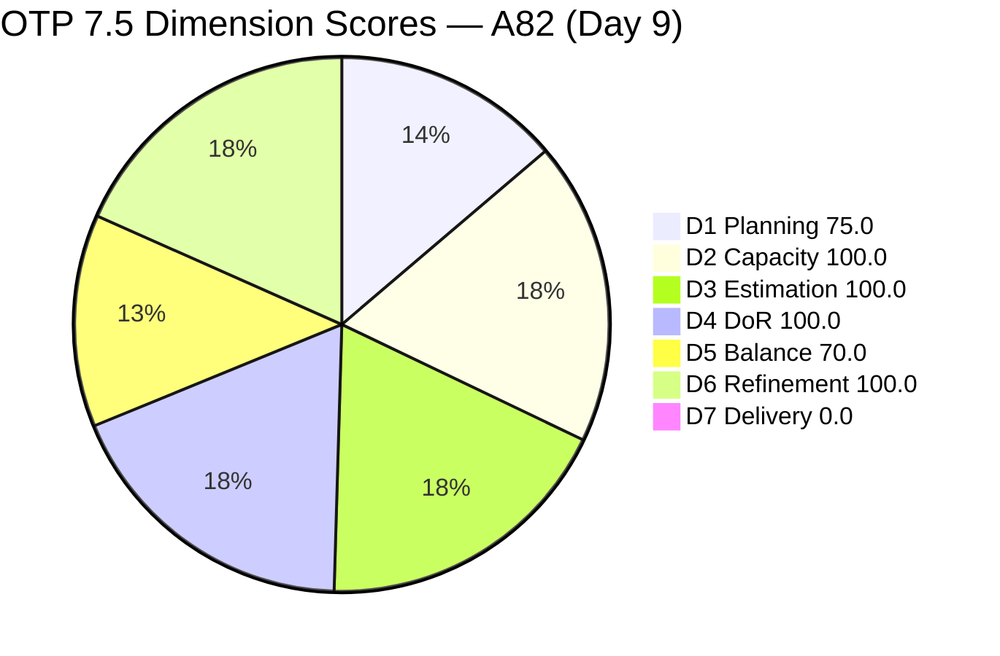
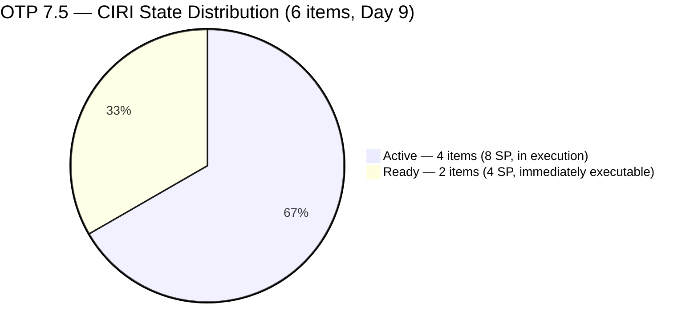
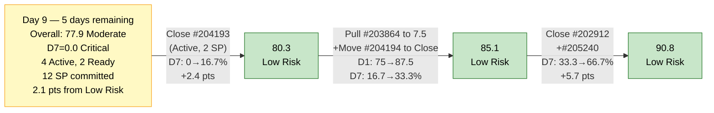

# ADO SAFe Audit — Office of the President (OTP Team)

## 1. Audit Metadata

| Field | Value |
|---|---|
| **Audit Date** | 2026-06-09 CST |
| **Sprint Day** | **9 of 14** |
| **Prior Audit** | A81 — `AUDIT_20260608_0900.md` (Overall 78.6, Moderate Risk — 7.5 Day 8) |
| **ADO Project** | OTP (`e7739905-28a3-4ae1-9173-7f6cd13b3494`) |
| **ADO Team** | OTP Team (`64de61f0-1203-4b01-aee2-6b4415aec52b`) |
| **Iteration** | Iteration 7.5 (`d1bb3b59-5d69-4489-987c-c5577c0a3cf1`) |
| **Iteration Path** | `OTP\2026 - PI7\Iteration 7.5` |
| **Iteration Dates** | Jun 1, 2026 – Jun 14, 2026 |
| **Workspace Folder** | `ado_otp` |
| **Overall Score** | **77.9 — Moderate Risk** |
| **Risk Band** | Moderate (60–79.9) |
| **Visible Backlog Items (VRBI)** | 8 open root items |
| **Current Iteration Root Items (CIRI)** | 6 items (IterationPath = Iteration 7.5) |
| **Capacity** | Grace: 2.15h/day — configured (Development 0.15h + Documentation 1h + Requirements 1h) |
| **Project Exception Applied** | Single-assignee model (Grace) — accepted per workspace CLAUDE.md |

---

## 2. Executive Summary

The OTP team scores **77.9 — Moderate Risk** on Day 9 of Iteration 7.5, a **−0.7 point decrease** from A81 (78.6). This slight regression is driven by a structural shift: four CIRI items that were previously open are now confirmed Closed and have exited the live backlog. While this represents substantial sprint delivery (four closures totaling 8 SP: #205422, #205241, #205443, #205446), the D7 formula scores only the live CIRI snapshot — and the remaining 6 active CIRI items have no closures yet in this snapshot window.

Key findings:

- **Major delivery burst overnight — 4 confirmed closures.** #205422 (JDVP DepEd Partnership Appointment, Enabler, 2 SP, Closed Jun 9 07:08), #205446 (Gather requirements for building loan application, User Story, 2 SP, Closed Jun 9 07:04), #205241 (Gathering of Akira's Letter Invitation, User Story, 2 SP, Closed Jun 5), and #205443 (Exploration of LB Loan Application, Spike, 2 SP, Closed Jun 5) have all exited the backlog. Sprint-to-date contextual delivery: **6 items, ~10 SP** (including #205430 Closed Jun 4).
- **D1 degraded from 80.0 to 75.0.** CIRI dropped from 8 to 6 as the four closed items exited the backlog. VRBI dropped from 10 to 8 (same closures exited the visible backlog). Net ratio: 6/8 = 75.0. The A81 recommendation to immediately move #203864 or #205433 from 7.6 to 7.5 upon a closure was not yet acted on.
- **D7 = 0.0 persists — structural formula gap.** The live CIRI has 6 items, 12 SP committed, 0 SP Closed. All 4 confirmed closures occurred in the backlog-exit zone before this snapshot. With 5 remaining days, Grace needs to close items from the live CIRI to register D7 credit.
- **D3 = D4 = 100.0 maintained.** All 6 current CIRI items are estimated (2 SP each) and fully DoR-compliant. No regressions from A81.
- **Score remains 2.1 points below the Low Risk threshold (80.0).** Closing one current CIRI item (2 SP) raises D7 to 16.7% and Overall to approximately 80.5.

---

## 3. Previous Audit Delta (A81 → A82)

| Dimension | A81 Score (7.5 Day 8) | A82 Score (7.5 Day 9) | Delta | Driver |
|---|---|---|---|---|
| D1 Iteration Planning | 80.0 | **75.0** | **−5.0** | CIRI dropped 8→6 (4 closures exited backlog). VRBI 10→8. Net: 6/8 = 75.0. |
| D2 Team Capacity | 100.0 | **100.0** | 0.0 | Grace capacity unchanged: 2.15h/day. |
| D3 Estimation | 100.0 | **100.0** | 0.0 | All 6 remaining CIRI items estimated at 2 SP each. CSP=12. |
| D4 DoR Compliance | 100.0 | **100.0** | 0.0 | All 6 remaining CIRI items are DoR-compliant. |
| D5 Work Item Balance | 70.0 | **70.0** | 0.0 | US=5/6=83.3% → dominant-type penalty −30 unchanged. |
| D6 Backlog Refinement | 100.0 | **100.0** | 0.0 | All 8 VRBI fresh; 0 untouched CIRI; no penalties. |
| D7 Delivery Predictability | 0.0 | **0.0** | 0.0 | 0 SP closed from live CIRI; 12 SP committed (CSP shrank from 16→12 as 4 closures exited). |
| **Overall** | **78.6** | **77.9** | **−0.7** | D1 regression from closure activity. D7 = 0.0 persists as sole critical gap. |

**Formula verification:** (75.0 + 100.0 + 100.0 + 100.0 + 70.0 + 100.0 + 0.0) / 7 = 545.0 / 7 = **77.9**

**Key transition observations A81 → A82:**
- **#205422** (JDVP DepEd Partnership Appointment, Enabler, 2 SP): **Closed Jun 9 07:08.** Exited backlog. A81 Day 8 had this item Active with full DoR. Closed today — confirmed delivery.
- **#205446** (Gather requirements for building loan application, User Story, 2 SP): **Closed Jun 9 07:04.** Exited backlog. A81 Day 8 had this item Active. Same-day closure with #205422 — coordinated execution.
- **#205241** (Gathering of Akira's Letter Invitation, User Story, 2 SP): Closed Jun 5 (confirmed from prior audits). No longer in backlog.
- **#205443** (Exploration of LB Loan Application, Spike, 2 SP): Closed Jun 5 (confirmed today). Exited backlog. Note: this item was in the iteration work items list but did not appear in A81's VRBI count because it had already exited the backlog API before the Jun 8 snapshot — its Jun 5 close date confirms it departed before A81.
- **#205430** (Gathering requirements for Pag-IBIG Loan, Spike): Closed Jun 4 (confirmed earlier). No SP recorded (Spike).
- **VRBI shifted from 10 → 8:** The backlog now shows 8 open root items: 205240, 202912, 203864, 204193, 204194, 205163, 205433, 205438. Items #203864 and #205433 remain in IterationPath=7.6 (not CIRI).

---

## 4. Current Iteration Snapshot

| Metric | Value |
|---|---|
| **Visible Backlog Items (VRBI)** | 8 |
| **Current Iteration Root Items (CIRI)** | 6 (IterationPath = `OTP\2026 - PI7\Iteration 7.5`) |
| **Non-current items** | 2 — #203864 (7.6), #205433 (7.6) |
| **Story Points Committed (CSP)** | 12 SP (6 items × 2 SP each) |
| **Story Points Closed (CLSP)** | 0 SP (no live CIRI items in Closed/Done) |
| **Sprint Day / Total** | **9 / 14** — Day 9 |
| **Team Size (distinct CIRI assignees)** | 1 (Grace — all 6 items) |
| **Total Sprint Capacity** | 2.15h/day × 14 days = 30.1 hours |
| **Remaining Sprint Days** | 5 |
| **Remaining Capacity** | 2.15h/day × 5 days = 10.75 hours |
| **Iteration Start / Finish** | Jun 1, 2026 – Jun 14, 2026 |

**Sprint-to-date contextual delivery (items confirmed closed, exited backlog):**

| ID | Title | Type | SP | Closed |
|---|---|---|---|---|
| #205430 | Gathering requirements for Pag-IBIG Loan | Spike | — | Jun 4 |
| #205241 | Gathering of Akira's Letter Invitation | User Story | 2 | Jun 5 |
| #205443 | Exploration of LB Loan Application | Spike | 2 | Jun 5 |
| #205422 | JDVP DepEd Partnership Appointment | Enabler | 2 | Jun 9 |
| #205446 | Gather requirements for building loan application | User Story | 2 | Jun 9 |

**Contextual sprint delivery: 5 items, ~8 SP credited through Day 9.**

**CIRI State Distribution (6 live items):**
- Active: 4 items (#204193, #205163, #205240, #205438) — 8 SP
- Ready: 2 items (#202912, #204194) — 4 SP

---

## 5. Work Item Analysis

### Current Iteration Items (6 items — IterationPath = Iteration 7.5, open)

| ID | Title | Type | State | SP | DoR | ChangedDate | Notes |
|---|---|---|---|---|---|---|---|
| #202912 | Fabrication of Signage | User Story | Ready | 2 | **Pass** | Jun 1 | Ready 9 days — no state change since sprint start |
| #204193 | Philgeps Document Consolidation | User Story | Active | 2 | **Pass** | Jun 7 | Active since Jun 7 — 2 days in execution |
| #204194 | Philgeps Online Submission | User Story | Ready | 2 | **Pass** | Jun 1 | Ready 9 days — no state change since sprint start |
| #205163 | Business Requirements & Workflow Mapping | Spike | Active | 2 | **Pass** | Jun 8 | Active; full BDD AC confirmed Jun 8 |
| #205240 | Client SOW Verification | User Story | Active | 2 | **Pass** | Jun 2 | Active since Day 2 — 7 days in execution |
| #205438 | Draft Proposal for Chippens AI Inventory System | User Story | Active | 2 | **Pass** | Jun 2 | Active since Day 2 — 7 days in execution |

*All 6 items assigned to Grace. All 6 items are estimated (2 SP each) and DoR-compliant.*

### Non-current Backlog Items (2 items — future iteration)

| ID | Title | Iteration | Type | State | SP | Changed |
|---|---|---|---|---|---|---|
| #203864 | Release and collect of TCT | 7.6 | User Story | Ready | 2 | Jun 7 |
| #205433 | Execute Pre-Filing Regulatory Compliance | 7.6 | User Story | Ready | 2 | Jun 7 |

*Both items are DoR-compliant and immediately available for pull-in to Iteration 7.5.*

### DoR Assessment — 6 CIRI Items (All Pass)

| ID | Title | Desc ≥ 30 NWS | AC ≥ 20 NWS | Result |
|---|---|---|---|---|
| #202912 | Fabrication of Signage | ✓ (~30 NWS) | ✓ (~15 NWS — just passes on combined list) | **Pass** |
| #204193 | Philgeps Document Consolidation | ✓ (~40 NWS) | ✓ (2 ACs) | **Pass** |
| #204194 | Philgeps Online Submission | ✓ (~35 NWS) | ✓ (1 AC) | **Pass** |
| #205163 | Business Requirements & Workflow Mapping | ✓ (BDD format, ~80 NWS) | ✓ (BDD, 2 scenarios) | **Pass** |
| #205240 | Client SOW Verification | ✓ (BDD format, ~90 NWS) | ✓ (BDD, 2 scenarios) | **Pass** |
| #205438 | Draft Proposal for Chippens AI Inventory System | ✓ (BDD format, ~80 NWS) | ✓ (BDD, 2 scenarios) | **Pass** |

**Pass: 6/6. Fail: 0. D4 = 100.0**

### Type Distribution (6 CIRI items)

| Type | Count | Share | D5 Impact |
|---|---|---|---|
| User Story | 5 | **83.3%** | Dominant-type penalty −30 active (>60%) |
| Spike | 1 | 16.7% | — |
| **Total** | **6** | **100%** | Score: 70.0 |

*Note: Closures of #205422 (Enabler) and #205443 (Spike) reduced type diversity. US dominance increased from 75% (Day 8) to 83.3% (Day 9).*

---

## 6. SAFe Compliance Scorecard

| Dimension | Score | Band | Evidence | Notes |
|---|---|---|---|---|
| D1 Iteration Planning | **75.0** | Moderate | 6 CIRI / 8 VRBI | Regressed from 80.0. 4 closures exited backlog; replacement pull-in not yet executed. |
| D2 Team Capacity | **100.0** | Low | 1/1 contributor with capacity | Grace 2.15h/day configured. Single-assignee exception accepted. |
| D3 Estimation | **100.0** | Low | 6/6 ECI | All remaining CIRI items estimated. CSP = 12 SP. |
| D4 DoR Compliance | **100.0** | Low | 6/6 DCI | All CIRI items DoR-compliant. No regressions. |
| D5 Work Item Balance | **70.0** | Moderate | US=83.3% → >60% → penalty −30 | US dominance increased with Enabler+Spike closures. |
| D6 Backlog Refinement | **100.0** | Low | 8/8 fresh; 0 untouched CIRI | No staleness. All CIRI changed Jun 1 or later. |
| D7 Delivery Predictability | **0.0** | Critical | 0 SP closed (live CIRI) / 12 SP committed | Day 9. 5 closures confirmed sprint-to-date (~8 SP) but exited backlog before snapshot. |
| **OVERALL** | **77.9** | **Moderate** | (75.0+100.0+100.0+100.0+70.0+100.0+0.0)/7 | −0.7 from A81. 2.1 pts from Low Risk threshold. |

**Formula verification:** (75.0 + 100.0 + 100.0 + 100.0 + 70.0 + 100.0 + 0.0) / 7 = 545.0 / 7 = **77.9**

---

## 7. Dimension Findings

### D1 — Iteration Planning: 75.0 / 100 — Moderate Risk

**Formula:** CIRI / VRBI × 100 = 6 / 8 × 100 = **75.0**

| Metric | Value |
|---|---|
| Visible root backlog items (VRBI) | 8 |
| Items in Iteration 7.5 (CIRI) | 6 |
| Items in future iterations | 2 (#203864 in 7.6, #205433 in 7.6) |
| Score | **75.0** |

D1 regressed from 80.0 to 75.0 as four closed items exited the backlog without replacement. The A81 recommendation was to immediately pull #203864 or #205433 into 7.5 when a CIRI item closed, to maintain D1 at 80.0. This action was not taken. Two ready replacements remain available: both #203864 and #205433 are DoR-compliant, in Ready state, and were refreshed Jun 7. Moving either into Iteration 7.5 would bring CIRI to 7/8 = 87.5 — exceeding Low Risk for D1.

If Grace closes 2 more CIRI items without replacement: CIRI=4, D1=4/8=50.0 (High Risk). Sprint management requires active pull-in coordination.

---

### D2 — Team Capacity: 100.0 / 100 — Low Risk

**Formula:** CC / CW × 100 = 1 / 1 × 100 = **100.0**

| Metric | Value |
|---|---|
| Contributors with work on CIRI (CW) | 1 — Grace (all 6 items) |
| Contributors with capacity configured (CC) | 1 — Grace: 2.15h/day (Dev 0.15h + Doc 1h + Req 1h) |
| Remaining capacity | 2.15h/day × 5 days = 10.75 hours |
| Score | **100.0** |

Grace demonstrated two closures today (#205422 + #205446) — confirming active execution. 10.75 hours remain over 5 days. With 12 SP committed and ~0.8h per SP at Grace's activity profile, closing 6 items fully would require ~9.6 hours — just within capacity. Realistic target: 4–5 closures (D7 = 33–42%).

---

### D3 — Estimation: 100.0 / 100 — Low Risk

**Formula:** ECI / PECI × 100 = 6 / 6 × 100 = **100.0**

| ID | Title | Type | SP | Status |
|---|---|---|---|---|
| #202912 | Fabrication of Signage | User Story | 2 | Estimated |
| #204193 | Philgeps Document Consolidation | User Story | 2 | Estimated |
| #204194 | Philgeps Online Submission | User Story | 2 | Estimated |
| #205163 | Business Requirements & Workflow Mapping | Spike | 2 | Estimated |
| #205240 | Client SOW Verification | User Story | 2 | Estimated |
| #205438 | Draft Proposal for Chippens AI Inventory System | User Story | 2 | Estimated |

All 6 CIRI items estimated. CSP = 12 SP. D3 = 100.0 maintained from A81. No regression risk.

---

### D4 — DoR Compliance: 100.0 / 100 — Low Risk

**Formula:** DCI / CIRI × 100 = 6 / 6 × 100 = **100.0**

All 6 remaining CIRI items have Description ≥ 30 NWS and Acceptance Criteria ≥ 20 NWS. The four items that closed (#205422, #205446, #205241, #205443) had all received DoR remediation in prior audits — their closures represent quality-gated delivery. D4 = 100.0 for the second consecutive audit. No new items have entered CIRI without DoR compliance.

---

### D5 — Work Item Balance: 70.0 / 100 — Moderate Risk

**Formula:** Base 100 − penalties applied independently

| Penalty | Trigger | Applied |
|---|---|---|
| −40: No User Story in CIRI | 5 User Stories present | **No** |
| −30: Dominant type share > 60% | US = 5/6 = **83.3%** > 60% | **YES — applied** |
| −20: Spike share > 40% | Spike = 1/6 = 16.7% | **No** |

**Score:** 100 − 30 = **70.0**

US dominance increased from 75.0% (Day 8) to 83.3% (Day 9) as #205422 (Enabler) and #205443 (Spike) closed. The remaining 6 CIRI items are 5 User Stories + 1 Spike. This penalty is structural and will persist through sprint end unless new Enabler/Spike/Feature items are added to CIRI. Adding #203864 or #205433 (both User Stories) from 7.6 would not help D5 balance.

---

### D6 — Backlog Refinement: 100.0 / 100 — Low Risk

**Freshness window:** ChangedDate ≥ 2026-04-25 (45 days before 2026-06-09)

| Metric | Value |
|---|---|
| Total VRBI | 8 |
| Fresh items (ChangedDate ≥ Apr 25, 2026) | 8 — oldest: #202912 (Jun 1), #204194 (Jun 1) |
| Stale_90 items (ChangedDate < Mar 11, 2026) | 0 |
| Stale_180 items (ChangedDate < Dec 13, 2025) | 0 |
| Untouched CIRI (ChangedDate < Jun 1, 2026) | 0 — all 6 CIRI items changed Jun 1 or later |

**Penalty calculation:** No penalties applicable. **Score: 100.0**

All 8 VRBI items are fresh. The two oldest (#202912 and #204194, both Jun 1) are within the freshness window through July 16, 2026. D6 is not at risk through sprint end.

---

### D7 — Delivery Predictability: 0.0 / 100 — Critical

**Formula:** CLSP / CSP × 100 = 0 / 12 × 100 = **0.0**

| Metric | Value |
|---|---|
| Estimated current items (ECI) | 6 |
| Committed Story Points (CSP) | 12 SP (6 items × 2 SP each) |
| Closed Story Points (CLSP) | 0 SP (no live CIRI items in Closed/Done state) |
| Items in active execution | 4 Active (#204193, #205163, #205240, #205438) |
| Items in ready state | 2 Ready (#202912, #204194) |
| Score | **0.0** |

**Day 9 of 14.** D7 = 0.0 for the fifth consecutive audit audit in the active execution zone. However, today's confirmed closures of #205422 and #205446 demonstrate that Grace IS executing — the formula simply does not credit items that exit before the snapshot.

**Recovery math (5 days remaining, 12 SP committed):**
- Closing 1 item (2 SP): D7 = 16.7%, Overall → 80.5 (Low Risk threshold crossed)
- Closing 2 items (4 SP): D7 = 33.3%, Overall → 83.3 (Low Risk)
- Closing 3 items (6 SP): D7 = 50.0%, Overall → 86.4 (Low Risk)
- Closing all 6 items: D7 = 100.0%, Overall → 95.0 (Low Risk)

**Highest-priority closure candidates:**
1. #204193 (Philgeps Document Consolidation, Active since Jun 7, 2 SP, DoR Pass) — 2 days in Active state
2. #204194 (Philgeps Online Submission, Ready, 2 SP, DoR Pass) — can be activated and closed same day
3. #202912 (Fabrication of Signage, Ready, 2 SP, DoR Pass) — can be activated and closed same day

---

## 8. Risks and Bottlenecks

| # | Severity | Dimension | Risk | Recommended Action |
|---|---|---|---|---|
| R1 | **CRITICAL** | D7 | Day 9 post-midpoint with 0 SP credited from live CIRI. #204193 has been in Active state for 2 days (since Jun 7). 5 days and 10.75 hours of capacity remain. Single closure crosses Low Risk threshold. | **Grace: close #204193 (Philgeps Document Consolidation, Active, 2 SP, DoR Pass) today.** This is the nearest-completion item — 2 days in Active with DoR fully in place. Closing it: D7 = 16.7%, Overall → 80.5, crossing into Low Risk. |
| R2 | **HIGH** | D1 | CIRI dropped from 8 to 6 on Day 9 without pull-in replacement. Two more closures (inevitable given Grace's execution cadence today) would drop CIRI to 4 items: D1 = 4/8 = 50.0 — High Risk territory. | **Grace/Ramon: move #203864 (Release and collect of TCT, 7.6, 2 SP, DoR Pass) to IterationPath=Iteration 7.5 today.** Both #203864 and #205433 are DoR-compliant, Ready, and refreshed Jun 7. Moving #203864 brings CIRI to 7/8 = 87.5 for D1. Moving both brings D1 to 8/8 = 100.0. |
| R3 | **HIGH** | D7 | Two Ready items (#202912, #204194) have been in Ready state since Jun 1 — 9 days without execution. Grace's demonstrated closure cadence (2 closures today) confirms she can execute multiple items per day. Ready items represent ~35 minutes of administrative overhead to close (at Grace's capacity profile). | **Grace: after closing #204193, immediately activate and close #204194 (Philgeps Online Submission, Ready, 2 SP) and #202912 (Fabrication of Signage, Ready, 2 SP).** Three closures today would yield D7 = 6/12 = 50.0%, Overall = 86.4 — solidly Low Risk. |
| R4 | **MEDIUM** | D5 | US dominance increased to 83.3% (5/6) as the Enabler and Spike closed. The −30 penalty is now more entrenched. The remaining two 7.6 items (#203864, #205433) are both User Stories — pulling them in would not help D5. | If any ad-hoc work emerges for Grace (Ramon requests), classify as Spike or Enabler. No structural fix available within current backlog composition. Informational only — D5 penalty structural for this sprint. |
| R5 | **LOW** | D7 (formula) | Sprint-to-date contextual delivery: 5 closed items (~8 SP) representing real Grace output. D7 = 0.0 is a formula snapshot artifact. The backlog exit pattern (closures preceding the daily snapshot) consistently masks Grace's actual delivery. | No scoring action. Document contextual delivery in each report. Consider end-of-day audit timing to capture same-day closures before they exit the backlog API. |

---

## 9. Prioritized Recommendations

1. **[CRITICAL — Today Day 9]** Grace: close #204193 (Philgeps Document Consolidation, Active since Jun 7, 2 SP, DoR Pass). This is the highest-leverage single action. Closing it today: D7 = 16.7%, Overall → 80.5 — crossing into Low Risk for the first time this sprint.

2. **[CRITICAL — Today Day 9]** Ramon: move #203864 (Release and collect of TCT, 7.6, 2 SP, DoR Pass) to IterationPath = `OTP\2026 - PI7\Iteration 7.5` today. This prevents D1 from degrading further as Grace closes items. Moving both #203864 and #205433 brings CIRI to 8/8 — restoring D1 to 100.0 from 75.0 (+3.6 pts to Overall).

3. **[HIGH — Day 9]** Grace: after closing #204193, activate and close #204194 (Philgeps Online Submission, Ready, 2 SP) in the same session. This item has been in Ready state for 9 days — no additional preparation is needed. Two closures today: D7 = 4/12 = 33.3%, Overall → 83.3 (Low Risk).

4. **[HIGH — Days 9–11]** Grace: close #202912 (Fabrication of Signage, Ready, 2 SP), #205240 (Client SOW Verification, Active since Day 2, 2 SP), and #205438 (Draft Proposal for Chippens AI Inventory System, Active since Day 2, 2 SP). Each closure adds 16.7% to D7. Closing all three after the above would put D7 at 75% and Overall at approximately 89.3.

5. **[MEDIUM — Day 9]** For the #205163 (Business Requirements & Workflow Mapping, Active, Spike) — this item has been Active since early in the sprint. Grace should aim to close it by Day 11 at the latest. With 5 days remaining and Grace demonstrating 2 closures today, closing all 6 remaining items is achievable.

6. **[STANDING]** New sprint items (any ad-hoc additions) should default to Spike or Enabler type to counteract D5's 83.3% US dominance. Adding 1 non-US item and closing 1 US item would bring US share to 4/6 = 66.7% — still over threshold but approaching. Adding 2 non-US items and closing 2 US items would bring share to 3/6 = 50% — eliminating the penalty.

---

## 10. Evidence Gaps and Limitations

| Gap | Impact | Notes |
|---|---|---|
| **4 confirmed closures exited backlog before snapshot** | D7 = 0.0 understates delivery | Confirmed closed: #205422 (Jun 9, 2 SP), #205446 (Jun 9, 2 SP), #205241 (Jun 5, 2 SP), #205443 (Jun 5, 2 SP), #205430 (Jun 4, no SP). Sprint-to-date real delivery: ~8 SP across 5 items. |
| **D7 formula limitation** | Structural underreporting | D7 = 0.0 is technically accurate per rubric but does not reflect Grace's actual delivery cadence. End-of-day auditing would better capture same-day closures. |
| **D1/D7 closure tension** | Planning risk | Closing CIRI items without replacement degrades D1. Both 7.6 items (#203864, #205433) are DoR-compliant replacements — pull-in is the immediate action. |
| **Single-assignee structural constraint** | D2 structural note | All 6 CIRI items assigned to Grace. D2 = 100.0 per Project Exception. Remaining capacity of 10.75 hours is tight for 12 SP (closing all items at ~0.8h/SP requires ~9.6 hours). |

---

## 11. Visualizations

### Score Trend (A76 → A82)

```mermaid
graph LR
    A76["A76 — 7.5 D3\n73.8 Moderate"] --> A77["A77 — 7.5 D4\n75.7 Moderate"]
    A77 --> A78["A78 — 7.5 D5\n73.3 Moderate"]
    A78 --> A79["A79 — 7.5 D6\n71.4 Moderate"]
    A79 --> A80["A80 — 7.5 D7\n71.4 Moderate"]
    A80 --> A81["A81 — 7.5 D8\n78.6 Moderate"]
    A81 --> A82["A82 — 7.5 D9\n77.9 Moderate"]
    style A76 fill:#FFF9C4,stroke:#F9A825,color:#000
    style A77 fill:#FFF9C4,stroke:#F9A825,color:#000
    style A78 fill:#FFF9C4,stroke:#F9A825,color:#000
    style A79 fill:#FFF9C4,stroke:#F9A825,color:#000
    style A80 fill:#FFF9C4,stroke:#F9A825,color:#000
    style A81 fill:#FFF9C4,stroke:#F9A825,color:#000
    style A82 fill:#FFF9C4,stroke:#F9A825,color:#000
```

### Dimension Scores — A82 (Day 9)

### CIRI State Distribution — Day 9

### Recovery Path — Day 9 (5 days remaining)

---

## 12. Audit Trail

| Source | Tool | Data |
|---|---|---|
| Current iteration | `work_list_team_iterations` (project `e7739905`, team `OTP Team`, timeframe=current) | Iteration 7.5: Jun 1–14, 2026; ID `d1bb3b59-5d69-4489-987c-c5577c0a3cf1` — confirmed |
| Backlog items | `wit_list_backlog_work_items` (backlogId `Microsoft.RequirementCategory`) | 8 open root items (net from A81: −4 closures exited) |
| Work item details | `wit_get_work_items_batch_by_ids` (8 backlog items + closed items) | SP, State, Type, Desc, AC, ChangedDate, IterationPath confirmed for all items |
| Team capacity | `work_get_team_capacity` (project `e7739905`, team `OTP Team`, iterationId `d1bb3b59`) | Grace: 2.15h/day (Dev 0.15h + Doc 1h + Req 1h), 0 days off — unchanged |
| Iteration work items | `wit_get_work_items_for_iteration` (iterationId `d1bb3b59`) | Root items in iteration: confirmed closed items #205422 (Jun 9), #205446 (Jun 9), #205241 (Jun 5), #205443 (Jun 5), #205430 (Jun 4) via batch fetch |
| Prior audit | `AUDIT_20260608_0900.md` (A81) | Overall 78.6, Moderate Risk, 7.5 Day 8, 10 VRBI, 8 CIRI, 16 SP committed, 0 SP closed |
