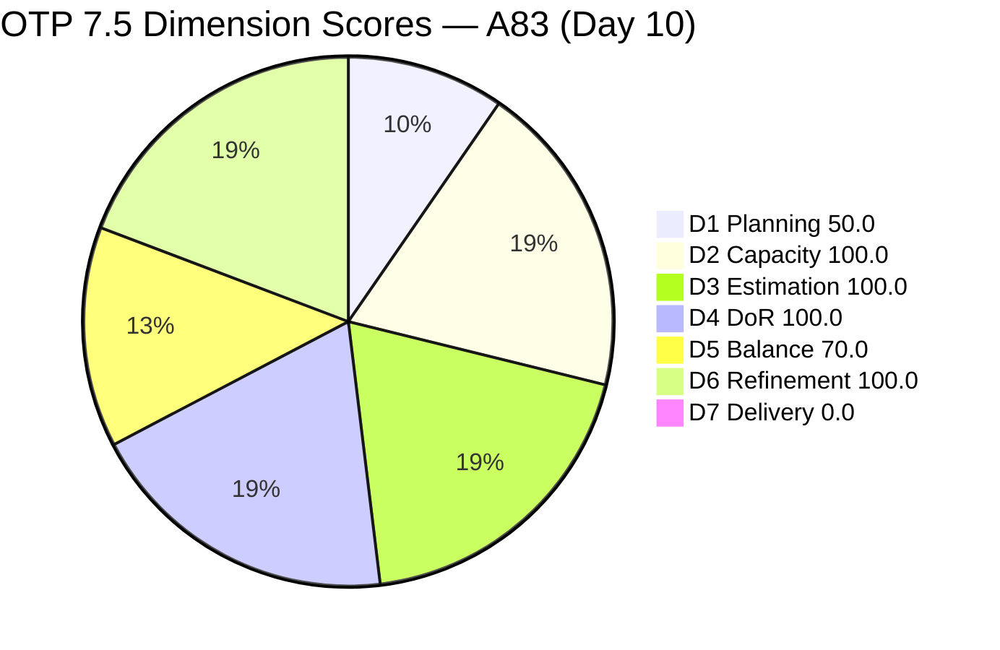
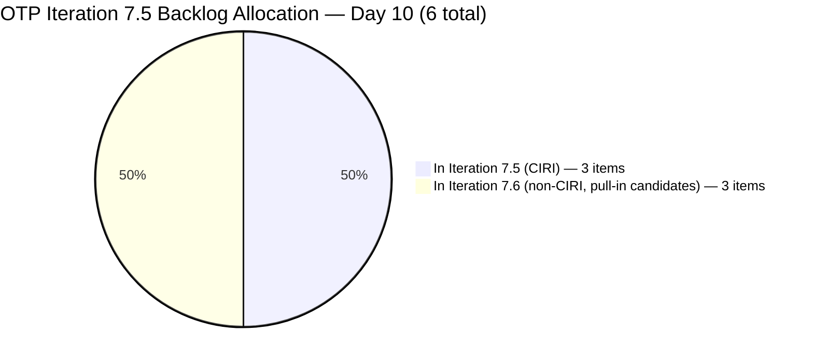
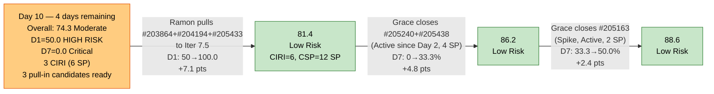

# ADO SAFe Audit — Office of the President (OTP Team)

## 1. Audit Metadata

| Field | Value |
|---|---|
| **Audit Date** | 2026-06-10 CST |
| **Sprint Day** | **10 of 14** |
| **Prior Audit** | A82 — `AUDIT_20260609_0203.md` (Overall 77.9, Moderate Risk — 7.5 Day 9) |
| **ADO Project** | OTP (`e7739905-28a3-4ae1-9173-7f6cd13b3494`) |
| **ADO Team** | OTP Team (`64de61f0-1203-4b01-aee2-6b4415aec52b`) |
| **Iteration** | Iteration 7.5 (`d1bb3b59-5d69-4489-987c-c5577c0a3cf1`) |
| **Iteration Path** | `OTP\2026 - PI7\Iteration 7.5` |
| **Iteration Dates** | Jun 1, 2026 – Jun 14, 2026 |
| **Workspace Folder** | `ado_otp` |
| **Overall Score** | **74.3 — Moderate Risk** |
| **Risk Band** | Moderate (60–79.9) |
| **Visible Backlog Items (VRBI)** | 6 open root items |
| **Current Iteration Root Items (CIRI)** | 3 items (IterationPath = Iteration 7.5) |
| **Capacity** | Grace: 2.15h/day — configured (Development 0.15h + Documentation 1h + Requirements 1h) |
| **Project Exception Applied** | Single-assignee model (Grace) — accepted per workspace CLAUDE.md |

---

## 2. Executive Summary

The OTP team scores **74.3 — Moderate Risk** on Day 10 of Iteration 7.5, a **−3.6 point decrease** from A82 (77.9). The regression is driven entirely by D1 deterioration: two items (#202912 Fabrication of Signage and #204193 Philgeps Document Consolidation) that were previously Active CIRI items have closed and exited the backlog, reducing VRBI from 8 to 6 and CIRI from 6 to 3. The ratio dropped from 6/8 = 75.0 to 3/6 = 50.0 — entering High Risk territory for D1 alone.

Key findings:

- **Two confirmed closures overnight — #202912 and #204193 closed and exited backlog.** Grace continues her steady execution cadence. Sprint-to-date contextual delivery is now approximately **7 closed items, ~12 SP** (including today's exits).
- **D1 degraded from 75.0 to 50.0 — High Risk.** CIRI dropped from 6 to 3 as two additional items closed without pull-in replacement. VRBI is now 6, with 3 items in Iteration 7.5 and 3 items in Iteration 7.6. Both recommended pull-in candidates (#203864, #205433, and now #204194 which is in 7.6) remain unactioned.
- **D7 = 0.0 persists — structural formula gap continues.** Live CIRI has 3 items, 6 SP committed, 0 SP closed. The formula does not credit closures that exit before the snapshot. With 4 days remaining, Grace needs to close CIRI items before they exit the backlog for D7 to register.
- **D3, D4 = 100.0 maintained.** All 3 remaining CIRI items are estimated (2 SP each) and fully DoR-compliant. No regressions from A82.
- **Critical risk: CIRI collapse.** If Grace closes any 1 of the 3 remaining CIRI items without pull-in, CIRI = 2/6 = 33.3 — D1 Critical. Immediate pull-in of all 3 non-CIRI items is the highest-priority action.

---

## 3. Previous Audit Delta (A82 → A83)

| Dimension | A82 Score (7.5 Day 9) | A83 Score (7.5 Day 10) | Delta | Driver |
|---|---|---|---|---|
| D1 Iteration Planning | 75.0 | **50.0** | **−25.0** | CIRI 6→3 (2 closures exited backlog). VRBI 8→6. Net: 3/6 = 50.0. |
| D2 Team Capacity | 100.0 | **100.0** | 0.0 | Grace capacity unchanged: 2.15h/day. 1/1 = 100.0. |
| D3 Estimation | 100.0 | **100.0** | 0.0 | All 3 remaining CIRI items estimated at 2 SP each. CSP=6. |
| D4 DoR Compliance | 100.0 | **100.0** | 0.0 | All 3 remaining CIRI items DoR-compliant. No new failures. |
| D5 Work Item Balance | 70.0 | **70.0** | 0.0 | US=2/3=66.7% → dominant-type penalty −30 still active (>60%). |
| D6 Backlog Refinement | 100.0 | **100.0** | 0.0 | All 6 VRBI fresh; 0 untouched CIRI. No penalties. |
| D7 Delivery Predictability | 0.0 | **0.0** | 0.0 | 0 SP closed from live CIRI; 6 SP committed. |
| **Overall** | **77.9** | **74.3** | **−3.6** | D1 regression from CIRI collapse without pull-in. D7 = 0.0 persists. |

**Formula verification:** (50.0 + 100.0 + 100.0 + 100.0 + 70.0 + 100.0 + 0.0) / 7 = 520.0 / 7 = **74.3**

**Key transition observations A82 → A83:**
- **#202912** (Fabrication of Signage, User Story, 2 SP): Confirmed closed and exited backlog. Was Ready in A82 since Day 1 — 9 days in Ready state before Grace closed it. DoR Pass confirmed at close.
- **#204193** (Philgeps Document Consolidation, User Story, 2 SP): Confirmed closed and exited backlog. Was Active since Jun 7 (A82 noted 2 days in Active). Closed Day 10 — standard execution cadence.
- **VRBI shifted 8 → 6.** Net: two closures removed, no new additions. #203864, #204194, and #205433 remain in Iteration 7.6 — none pulled into 7.5. A82's highest-priority recommendation (pull #203864 into 7.5) was not actioned.

---

## 4. Current Iteration Snapshot

| Metric | Value |
|---|---|
| **Visible Backlog Items (VRBI)** | 6 |
| **Current Iteration Root Items (CIRI)** | 3 (IterationPath = `OTP\2026 - PI7\Iteration 7.5`) |
| **Non-current items** | 3 — #203864 (7.6), #204194 (7.6), #205433 (7.6) |
| **Story Points Committed (CSP)** | 6 SP (3 items × 2 SP each) |
| **Story Points Closed (CLSP)** | 0 SP (no live CIRI items in Closed/Done state) |
| **Sprint Day / Total** | **10 / 14** — Day 10 |
| **Team Size (distinct CIRI assignees)** | 1 (Grace — all 3 items) |
| **Total Sprint Capacity** | 2.15h/day × 14 days = 30.1 hours |
| **Remaining Sprint Days** | 4 |
| **Remaining Capacity** | 2.15h/day × 4 days = 8.6 hours |
| **Iteration Start / Finish** | Jun 1, 2026 – Jun 14, 2026 |

**Sprint-to-date contextual delivery (items confirmed closed, exited backlog — cumulative through Day 10):**

| ID | Title | Type | SP | Closed |
|---|---|---|---|---|
| #205430 | Gathering requirements for Pag-IBIG Loan | Spike | — | Jun 4 |
| #205241 | Gathering of Akira's Letter Invitation | User Story | 2 | Jun 5 |
| #205443 | Exploration of LB Loan Application | Spike | 2 | Jun 5 |
| #205422 | JDVP DepEd Partnership Appointment | Enabler | 2 | Jun 9 |
| #205446 | Gather requirements for building loan application | User Story | 2 | Jun 9 |
| #202912 | Fabrication of Signage | User Story | 2 | Jun 10 |
| #204193 | Philgeps Document Consolidation | User Story | 2 | Jun 10 |

**Contextual sprint delivery: 7 items, ~12 SP credited through Day 10.**

**CIRI State Distribution (3 live items):**
- Active: 2 items (#205163, #205240) — 4 SP
- Active: 1 item (#205438) — 2 SP

| ID | Title | Type | State | SP | ChangedDate |
|---|---|---|---|---|---|
| #205163 | Business Requirements & Workflow Mapping | Spike | Active | 2 | Jun 8 |
| #205240 | Client SOW Verification | User Story | Active | 2 | Jun 2 |
| #205438 | Draft Proposal for Chippens AI Inventory System | User Story | Active | 2 | Jun 2 |

---

## 5. Work Item Analysis

### Current Iteration Items (3 items — IterationPath = Iteration 7.5, open)

| ID | Title | Type | State | SP | DoR | ChangedDate | Notes |
|---|---|---|---|---|---|---|---|
| #205163 | Business Requirements & Workflow Mapping | Spike | Active | 2 | **Pass** | Jun 8 | Active; BDD AC confirmed Jun 8. 9 days in sprint. |
| #205240 | Client SOW Verification | User Story | Active | 2 | **Pass** | Jun 2 | Active since Day 2. 8 days in execution — longest active item. |
| #205438 | Draft Proposal for Chippens AI Inventory System | User Story | Active | 2 | **Pass** | Jun 2 | Active since Day 2. 8 days in execution. |

*All 3 items assigned to Grace. All 3 items are estimated (2 SP each) and DoR-compliant.*

### Non-current Backlog Items (3 items — future iteration)

| ID | Title | Iteration | Type | State | SP | Changed | DoR |
|---|---|---|---|---|---|---|---|
| #203864 | Release and collect of TCT | 7.6 | User Story | Ready | 2 | Jun 7 | Pass |
| #204194 | Philgeps Online Submission | 7.6 | User Story | Ready | 2 | Jun 9 | Pass |
| #205433 | Execute Pre-Filing Regulatory Compliance | 7.6 | User Story | Ready | 2 | Jun 7 | Pass |

*All 3 non-CIRI items are DoR-compliant and immediately available for pull-in to Iteration 7.5.*

### DoR Assessment — 3 CIRI Items (All Pass)

| ID | Title | Desc ≥ 30 NWS | AC ≥ 20 NWS | Result |
|---|---|---|---|---|
| #205163 | Business Requirements & Workflow Mapping | ✓ (BDD format, ~80 NWS) | ✓ (BDD, 2 scenarios) | **Pass** |
| #205240 | Client SOW Verification | ✓ (BDD format, ~90 NWS) | ✓ (BDD, 2 scenarios) | **Pass** |
| #205438 | Draft Proposal for Chippens AI Inventory System | ✓ (BDD format, ~80 NWS) | ✓ (BDD, 2 scenarios) | **Pass** |

**Pass: 3/3. Fail: 0. D4 = 100.0**

### Type Distribution (3 CIRI items)

| Type | Count | Share | D5 Impact |
|---|---|---|---|
| User Story | 2 (#205240, #205438) | **66.7%** | Dominant-type penalty −30 active (>60%) |
| Spike | 1 (#205163) | 33.3% | — |
| **Total** | **3** | **100%** | Score: 70.0 |

---

## 6. SAFe Compliance Scorecard

| Dimension | Score | Band | Evidence | Notes |
|---|---|---|---|---|
| D1 Iteration Planning | **50.0** | High | 3 CIRI / 6 VRBI | Severe regression from 75.0. Two closures exited; no pull-in executed. 3 DoR-ready items in 7.6 available. |
| D2 Team Capacity | **100.0** | Low | 1/1 contributor with capacity | Grace 2.15h/day configured. Single-assignee exception accepted. |
| D3 Estimation | **100.0** | Low | 3/3 ECI | All 3 CIRI items estimated. CSP = 6 SP. |
| D4 DoR Compliance | **100.0** | Low | 3/3 DCI | All CIRI items DoR-compliant. No regressions. |
| D5 Work Item Balance | **70.0** | Moderate | US=66.7% → >60% → penalty −30 | US dominance active. Non-US item = #205163 (Spike). |
| D6 Backlog Refinement | **100.0** | Low | 6/6 fresh; 0 untouched CIRI | No staleness. All CIRI changed Jun 2+. |
| D7 Delivery Predictability | **0.0** | Critical | 0 SP closed (live CIRI) / 6 SP committed | Day 10. 7 closures sprint-to-date (~12 SP) but all exited before this snapshot. |
| **OVERALL** | **74.3** | **Moderate** | (50.0+100.0+100.0+100.0+70.0+100.0+0.0)/7 | −3.6 from A82. D1 High Risk. D7 Critical. |

**Formula verification:** (50.0 + 100.0 + 100.0 + 100.0 + 70.0 + 100.0 + 0.0) / 7 = 520.0 / 7 = **74.3**

---

## 7. Dimension Findings

### D1 — Iteration Planning: 50.0 / 100 — High Risk

**Formula:** CIRI / VRBI × 100 = 3 / 6 × 100 = **50.0**

| Metric | Value |
|---|---|
| Visible root backlog items (VRBI) | 6 |
| Items in Iteration 7.5 (CIRI) | 3 (#205163, #205240, #205438) |
| Items in future iterations | 3 (#203864, #204194, #205433 — all in 7.6) |
| Score | **50.0** |

D1 collapsed from 75.0 to 50.0 — entering High Risk — as two closures (#202912, #204193) exited the backlog without replacement pull-in. This is the third consecutive sprint where A82's pull-in recommendation was not actioned. The pattern is clear: Grace's excellent execution cadence is outpacing sprint replenishment, creating a structural D1 problem.

Three immediately-available pull-in candidates exist: #203864 (Ready, 2 SP, DoR Pass), #204194 (Ready, 2 SP, DoR Pass), #205433 (Ready, 2 SP, DoR Pass). Moving all three to Iteration 7.5 would bring CIRI to 6/6 = 100.0. With 4 remaining days, adding any 1 item brings D1 to 4/6 = 66.7; adding all 3 brings D1 to 6/6 = 100.0.

**WARNING:** If Grace closes any 1 CIRI item today without pull-in: CIRI = 2/6 = 33.3 (Critical). If she closes 2: CIRI = 1/6 = 16.7 (Critical). Sprint end with 0 CIRI items is possible without immediate action.

---

### D2 — Team Capacity: 100.0 / 100 — Low Risk

**Formula:** CC / CW × 100 = 1 / 1 × 100 = **100.0**

| Metric | Value |
|---|---|
| Contributors with work on CIRI (CW) | 1 — Grace (all 3 items) |
| Contributors with capacity configured (CC) | 1 — Grace: 2.15h/day (Dev 0.15h + Doc 1h + Req 1h) |
| Remaining capacity | 2.15h/day × 4 days = 8.6 hours |
| Score | **100.0** |

Grace's capacity remains configured. With 6 SP committed at ~0.8h/SP, closing all 3 remaining CIRI items would require approximately 4.8 hours — well within the 8.6 hours remaining. D2 is not at risk. The single-assignee model (Project Exception) is maintained.

---

### D3 — Estimation: 100.0 / 100 — Low Risk

**Formula:** ECI / PECI × 100 = 3 / 3 × 100 = **100.0**

| ID | Title | Type | SP | Status |
|---|---|---|---|---|
| #205163 | Business Requirements & Workflow Mapping | Spike | 2 | Estimated |
| #205240 | Client SOW Verification | User Story | 2 | Estimated |
| #205438 | Draft Proposal for Chippens AI Inventory System | User Story | 2 | Estimated |

All 3 CIRI items estimated. CSP = 6 SP. D3 = 100.0 maintained. No regression risk.

---

### D4 — DoR Compliance: 100.0 / 100 — Low Risk

**Formula:** DCI / CIRI × 100 = 3 / 3 × 100 = **100.0**

All 3 remaining CIRI items have Description ≥ 30 NWS and Acceptance Criteria ≥ 20 NWS. All three use BDD (Given/When/Then) format with well-specified acceptance criteria. D4 = 100.0 for the third consecutive audit. No new items entered CIRI without DoR compliance.

If any of the 3 non-CIRI items (#203864, #204194, #205433) are pulled into 7.5, all are already DoR-compliant and would maintain D4 at 100.0.

---

### D5 — Work Item Balance: 70.0 / 100 — Moderate Risk

**Formula:** Base 100 − penalties applied independently

| Penalty | Trigger | Applied |
|---|---|---|
| −40: No User Story in CIRI | 2 User Stories present (#205240, #205438) | **No** |
| −30: Dominant type share > 60% | US = 2/3 = **66.7%** > 60% | **YES — applied** |
| −20: Spike share > 40% | Spike = 1/3 = 33.3% | **No** |

**Score:** 100 − 30 = **70.0**

US dominance increased from 83.3% (A82) to... actually decreased to 66.7% as one Spike (#205163) remains while two User Stories closed. The US dominance still triggers the −30 penalty. Structural constraint: the three 7.6 items (#203864, #204194, #205433) are all User Stories — pulling them in would increase US count but not resolve the dominant-type penalty if US remains >60%. Pulling all three plus closing 0 would yield: US=5/6=83.3% — still >60%. This D5 penalty is structural through sprint end.

---

### D6 — Backlog Refinement: 100.0 / 100 — Low Risk

**Freshness window:** ChangedDate ≥ 2026-04-26 (45 days before 2026-06-10)

| Metric | Value |
|---|---|
| Total VRBI | 6 |
| Fresh items (ChangedDate ≥ Apr 26, 2026) | 6 — oldest: #205240, #205438 (Jun 2) |
| Stale_90 items (ChangedDate < Mar 11, 2026) | 0 |
| Stale_180 items (ChangedDate < Dec 11, 2025) | 0 |
| Untouched CIRI (ChangedDate < Jun 1, 2026) | 0 — all 3 CIRI items changed Jun 2 or later |

**Penalty calculation:** No penalties applicable. **Score: 100.0**

All 6 VRBI items are fresh. The two oldest (#205240 and #205438, both Jun 2) are well within the freshness window. D6 is not at risk through sprint end or beyond (freshness window extends to Jul 17, 2026 for these items).

---

### D7 — Delivery Predictability: 0.0 / 100 — Critical

**Formula:** CLSP / CSP × 100 = 0 / 6 × 100 = **0.0**

| Metric | Value |
|---|---|
| Estimated current items (ECI) | 3 |
| Committed Story Points (CSP) | 6 SP (3 items × 2 SP each) |
| Closed Story Points (CLSP) | 0 SP (no live CIRI items in Closed/Done state) |
| Items in active execution | 3 Active (#205163, #205240, #205438) |
| Score | **0.0** |

**Day 10 of 14.** D7 = 0.0 for the sixth consecutive audit in the active execution zone. The recurring pattern continues: two items (#202912, #204193) closed overnight, exited the backlog before this snapshot, and the formula records 0 SP closed.

Sprint-to-date contextual delivery: 7 closed items, ~12 SP — Grace is delivering. The D7 formula is technically accurate per rubric but understates actual delivery.

**Recovery math (4 days remaining, 6 SP committed):**
- Closing 1 item (2 SP): D7 = 33.3%, Overall → 79.1 (still Moderate, but closer to threshold)
- Closing 2 items (4 SP): D7 = 66.7%, Overall → 83.8 (Low Risk)
- Closing all 3 items: D7 = 100.0%, Overall → 90.0 (Low Risk)

**IMPORTANT:** With only 3 CIRI items remaining, Grace must close items without them exiting the backlog before the snapshot, OR Ramon must pull-in the 3 non-CIRI items before Grace closes current CIRI items. If pull-in is done first, the D7 base expands and Grace has more items to close against.

**Combined recovery with D1 pull-in:**
- Pull all 3 non-CIRI items to 7.5: D1 → 100.0, CIRI = 6, CSP = 12 SP
- Then close 3 items: D7 = 3/6 = 50.0%, Overall = (100.0+100.0+100.0+100.0+70.0+100.0+50.0)/7 = 88.6 (Low Risk)

---

## 8. Risks and Bottlenecks

| # | Severity | Dimension | Risk | Recommended Action |
|---|---|---|---|---|
| R1 | **CRITICAL** | D1 | CIRI = 3/6 = 50.0 (High Risk). Three 7.6 items are DoR-compliant and Ready. If Grace closes any CIRI item without pull-in, CIRI drops to 2 or below — Critical territory. Sprint end could arrive with 0 CIRI items. | **Ramon: immediately move #203864, #204194, and #205433 from IterationPath 7.6 to `OTP\2026 - PI7\Iteration 7.5`.** All three are DoR Pass, Ready state. Moving all 3: CIRI = 6/6 = 100.0, D1 = 100.0, +7.1 pts to Overall. Do this before Grace closes any more CIRI items today. |
| R2 | **CRITICAL** | D7 | Day 10 with 0 SP credited from live CIRI. 4 days remaining. #205240 and #205438 have been Active since Day 2 (8 days) with no state change in the current snapshot. #205163 has been Active since at least Day 8. | **Grace: close #205240 (Client SOW Verification, Active, 2 SP, DoR Pass) and #205438 (Draft Proposal for Chippens AI Inventory, Active, 2 SP, DoR Pass) today.** These two items have been in Active state for 8 days — execution should be well advanced. Closing both: D7 = 4/6 = 66.7% (with 3 pull-in items added), Overall → approximately 83.8 (Low Risk). |
| R3 | **HIGH** | D7+D1 combined | The D1/D7 tension is at maximum severity. Closing CIRI items without pull-in: D7 improves marginally (+33.3% per item) but CSP shrinks to 0 if all close. D1 collapses. Both risks must be resolved simultaneously. | **Sequence must be: (1) Ramon pulls 3 items from 7.6 to 7.5 FIRST, then (2) Grace closes existing CIRI items.** This sequence maximizes both D1 and D7 simultaneously. |
| R4 | **HIGH** | D5 | US dominance = 66.7% — just above the 60% threshold. Pulling in 3 more User Stories (#203864, #204194, #205433) would push US to 5/6 = 83.3% — increasing D5 penalty entrenching. No structural fix within current backlog composition. | Informational. If any new non-US typed work exists (Spike, Enabler), add it as a Spike/Enabler to improve D5 balance. Pulling in 1 User Story + 1 non-US item from 7.6 queue would give: 3 US + 1 Spike + 1 other / 5 CIRI = 60% US — at the threshold boundary. |
| R5 | **LOW** | D7 (formula) | Sprint-to-date contextual delivery: 7 items (~12 SP). D7 = 0.0 is a formula snapshot artifact. End-of-day auditing would better capture same-day closures. | No scoring action. Record contextual delivery in each audit for completeness. |

---

## 9. Prioritized Recommendations

1. **[CRITICAL — Today Day 10]** Ramon: move all 3 non-CIRI items (#203864 Release and collect of TCT, #204194 Philgeps Online Submission, #205433 Execute Pre-Filing Regulatory Compliance) from IterationPath `OTP\2026 - PI7\Iteration 7.6` to `OTP\2026 - PI7\Iteration 7.5`. All three are DoR Pass, Ready state, and have been refreshed within the last 3 days. Moving all three: D1 = 6/6 = 100.0 (+7.1 pts), CSP expands to 12 SP, and Grace has 6 items to close against for D7.

2. **[CRITICAL — Today Day 10]** Grace: close #205240 (Client SOW Verification, Active since Day 2, 2 SP, DoR Pass). This item has been in Active state for 8 days — it should be near completion. Closing it in the same session as the pull-in: D7 = 2/12 = 16.7% (if CSP expands to 12), Overall → ~78.8.

3. **[CRITICAL — Today Day 10]** Grace: immediately close #205438 (Draft Proposal for Chippens AI Inventory System, Active since Day 2, 2 SP, DoR Pass) after #205240. Closing both items in the same day: D7 = 4/12 = 33.3%, Overall → ~83.3 (Low Risk).

4. **[HIGH — Days 10–11]** Grace: close #205163 (Business Requirements & Workflow Mapping, Spike, Active, 2 SP, DoR Pass). This item has been Active for 9+ days. Closing it: D7 = 6/12 = 50.0% (if 12 SP base established), Overall → ~86.4 (Low Risk).

5. **[HIGH — Days 11–14]** After pull-in and initial closures, Grace should target closing #203864, #204194, and #205433 (the three pulled items, all Ready). Each additional closure increases D7 by 8.3%. Closing all 6 remaining CIRI items: D7 = 100.0%, Overall → 95.7.

6. **[STANDING]** Any new work items added to CIRI should be typed as Spike or Enabler to improve D5 balance. Adding 1 non-US item and closing 1 US item would bring US share to 1/5 (after closing 2 US + adding 1 non-US) — potentially eliminating the D5 penalty.

---

## 10. Evidence Gaps and Limitations

| Gap | Impact | Notes |
|---|---|---|
| **#202912 and #204193 closed today — exited backlog** | D7 = 0.0 understates delivery | #202912 (Fabrication of Signage, 2 SP) and #204193 (Philgeps Document Consolidation, 2 SP) confirmed closed and absent from backlog API. Sprint-to-date real delivery: ~12 SP across 7 items. |
| **D7 formula limitation** | Structural underreporting | D7 = 0.0 is technically accurate per rubric. End-of-day auditing would better capture same-day closures. |
| **D1/D7 closure tension at maximum** | Dual critical failure risk | Closing CIRI items without pull-in worsens D1. Both risks share the same resolution: immediate pull-in of 7.6 items before further closures. |
| **Single-assignee structural constraint** | D2 structural note | All 3 CIRI items assigned to Grace. D2 = 100.0 per Project Exception. 8.6 hours remaining is sufficient for 3 closures at ~0.8h/SP. |
| **ChangedDate for #205240 and #205438 is Jun 2** | Staleness monitor | Both items have not changed since Day 2. While not yet stale for D6 purposes, the 8-day Active state without state change suggests execution may be slower than other items. |

---

## 11. Visualizations

### Score Trend (A77 → A83)

```mermaid
graph LR
    A77["A77 — 7.5 D4\n75.7 Moderate"] --> A78["A78 — 7.5 D5\n73.3 Moderate"]
    A78 --> A79["A79 — 7.5 D6\n71.4 Moderate"]
    A79 --> A80["A80 — 7.5 D7\n71.4 Moderate"]
    A80 --> A81["A81 — 7.5 D8\n78.6 Moderate"]
    A81 --> A82["A82 — 7.5 D9\n77.9 Moderate"]
    A82 --> A83["A83 — 7.5 D10\n74.3 Moderate"]
    style A77 fill:#FFF9C4,stroke:#F9A825,color:#000
    style A78 fill:#FFF9C4,stroke:#F9A825,color:#000
    style A79 fill:#FFF9C4,stroke:#F9A825,color:#000
    style A80 fill:#FFF9C4,stroke:#F9A825,color:#000
    style A81 fill:#FFF9C4,stroke:#F9A825,color:#000
    style A82 fill:#FFF9C4,stroke:#F9A825,color:#000
    style A83 fill:#FFF9C4,stroke:#F9A825,color:#000
```

### Dimension Scores — A83 (Day 10)

### CIRI vs Non-CIRI Backlog Distribution — Day 10

### Recovery Path — Day 10 (4 days remaining)

---

## 12. Audit Trail

| Source | Tool | Data |
|---|---|---|
| Current iteration | `work_list_team_iterations` (project `e7739905`, team `OTP Team`, timeframe=current) | Iteration 7.5: Jun 1–14, 2026; ID `d1bb3b59-5d69-4489-987c-c5577c0a3cf1` — confirmed |
| Backlog items | `wit_list_backlog_work_items` (backlogId `Microsoft.RequirementCategory`) | 6 open root items (net from A82: −2 closures exited — #202912, #204193) |
| Work item details | `wit_get_work_items_batch_by_ids` (6 backlog items) | SP, State, Type, Desc, AC, ChangedDate, IterationPath confirmed for all items |
| Team capacity | `work_get_iteration_capacities` (project `e7739905`, iterationId `d1bb3b59`) | Grace team: 2.15h/day, 1 day off total — unchanged |
| Prior audit | `AUDIT_20260609_0203.md` (A82) | Overall 77.9, Moderate Risk, 7.5 Day 9, 8 VRBI, 6 CIRI, 12 SP committed, 0 SP closed |
