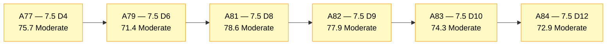
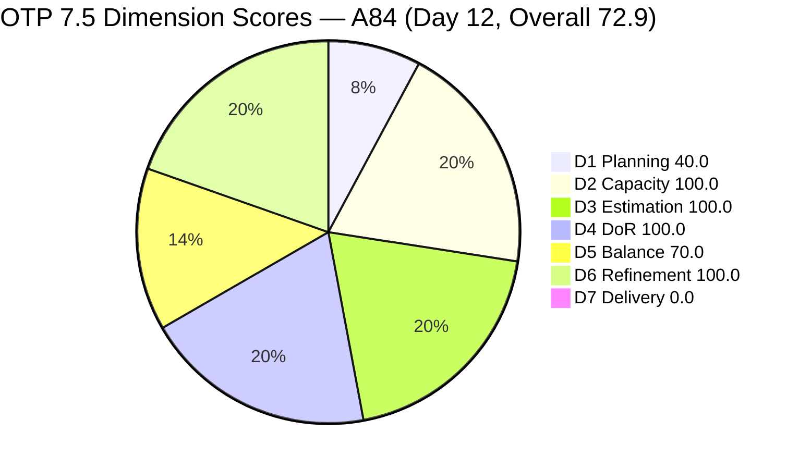
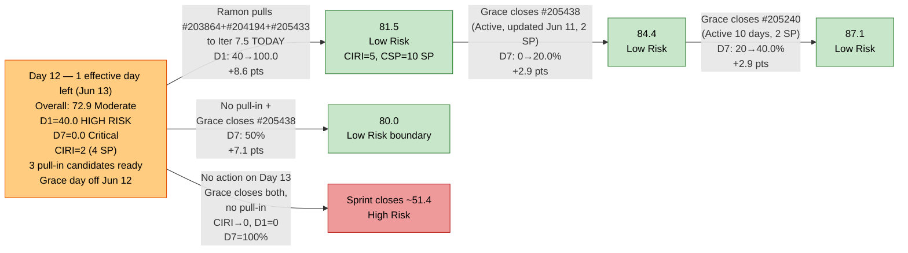
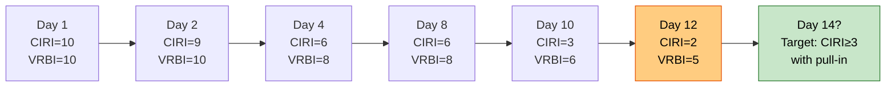

# ADO SAFe Audit — Office of the President (OTP Team)

## 1. Audit Metadata

| Field | Value |
|---|---|
| **Audit Date** | 2026-06-12 02:03 CST |
| **Sprint Day** | **12 of 14** |
| **Prior Audit** | A83 — `AUDIT_20260610_0203.md` (Overall 74.3, Moderate Risk — 7.5 Day 10) |
| **ADO Project** | OTP (`e7739905-28a3-4ae1-9173-7f6cd13b3494`) |
| **ADO Team** | OTP Team (`64de61f0-1203-4b01-aee2-6b4415aec52b`) |
| **Iteration** | Iteration 7.5 (`d1bb3b59-5d69-4489-987c-c5577c0a3cf1`) |
| **Iteration Path** | `OTP\2026 - PI7\Iteration 7.5` |
| **Iteration Dates** | Jun 1, 2026 – Jun 14, 2026 |
| **Workspace Folder** | `ado_otp` |
| **Overall Score** | **72.9 — Moderate Risk** |
| **Risk Band** | Moderate (60–79.9) |
| **Visible Backlog Items (VRBI)** | 5 open root items |
| **Current Iteration Root Items (CIRI)** | 2 items (IterationPath = Iteration 7.5) |
| **Capacity** | Grace: 2.15h/day — configured; **1 day off today (Jun 12)** |
| **Project Exception Applied** | Single-assignee model (Grace) — accepted per workspace CLAUDE.md |

---

## 2. Executive Summary

The OTP team scores **72.9 — Moderate Risk** on Day 12 of Iteration 7.5, a **−1.4 point decrease** from A83 (74.3). The regression continues the pattern of CIRI collapse driven by closures without pull-in replenishment. Since A83, #205163 (Business Requirements & Workflow Mapping, Spike, 2 SP) closed on Jun 10 and exited the backlog, reducing VRBI from 6 to 5 and CIRI from 3 to 2. D1 dropped from 50.0 to 40.0 — entering High Risk territory.

Key findings:

- **#205163 confirmed closed Jun 10 — exited backlog.** Sprint-to-date contextual delivery is now approximately **8 closed items, ~14 SP** (including today's exits).
- **D1 = 40.0 — High Risk.** CIRI = 2/5 = 40.0. Two CIRI items remain: #205240 (Client SOW Verification, User Story, Active, unchanged since Jun 2 — 10 days Active) and #205438 (Draft Proposal for Chippens AI Inventory System, User Story, Active, updated Jun 11). Three 7.6 items remain as pull-in candidates — all DoR-compliant and Ready.
- **Grace has 1 day off today (Jun 12).** Remaining effective work days = 1 (Jun 13; sprint ends Jun 14 — final day). Remaining capacity after today's absence = 2.15h/day × 1 day = 2.15 hours effective.
- **D7 = 0.0 persists — Critical.** 0 SP closed from live CIRI / 4 SP committed. 2 days remaining (today is Grace's day off; Jun 13 is the last work day). If Grace closes both items Jun 13, D7 = 100.0.
- **D3, D4 = 100.0 maintained.** Both remaining CIRI items are estimated (2 SP each) and fully DoR-compliant.
- **SPRINT CLOSE RISK: CRITICAL.** With only 2 CIRI items, VRBI = 5, and 1 effective work day remaining (Jun 13), the team must execute both closures on Jun 13 to rescue D7. If Grace closes both without additional pull-in, the sprint ends with 0 CIRI — D1 would score 0 for the closing snapshot.

---

## 3. Previous Audit Delta (A83 → A84)

| Dimension | A83 Score (7.5 Day 10) | A84 Score (7.5 Day 12) | Delta | Driver |
|---|---|---|---|---|
| D1 Iteration Planning | 50.0 | **40.0** | **−10.0** | CIRI 3→2 (#205163 closed Jun 10, exited backlog). VRBI 6→5. Net: 2/5 = 40.0. |
| D2 Team Capacity | 100.0 | **100.0** | 0.0 | Grace capacity configured: 2.15h/day. 1 day off Jun 12. 1/1 = 100.0. |
| D3 Estimation | 100.0 | **100.0** | 0.0 | Both CIRI items estimated at 2 SP. CSP = 4. |
| D4 DoR Compliance | 100.0 | **100.0** | 0.0 | Both CIRI items DoR-compliant. No regressions. |
| D5 Work Item Balance | 70.0 | **70.0** | 0.0 | US = 2/2 = 100% → dominant-type penalty −30 (>60%). Score: 70.0. |
| D6 Backlog Refinement | 100.0 | **100.0** | 0.0 | All 5 VRBI fresh (oldest: #205240, Jun 2). 0 untouched CIRI. No penalties. |
| D7 Delivery Predictability | 0.0 | **0.0** | 0.0 | 0 SP closed (live CIRI) / 4 SP committed. Day 12 — 2 days remaining. |
| **Overall** | **74.3** | **72.9** | **−1.4** | D1 regression only. All other dimensions stable. |

**Formula verification:** (40.0 + 100.0 + 100.0 + 100.0 + 70.0 + 100.0 + 0.0) / 7 = 510.0 / 7 = **72.9**

**Key transition observations A83 → A84:**
- **#205163** (Business Requirements & Workflow Mapping, Spike, 2 SP): Closed Jun 10 and exited the backlog. A83's highest-priority recovery recommendation (close #205163) was executed by Grace — but no pull-in accompanied the closure. VRBI shrunk from 6 to 5, CIRI from 3 to 2.
- **#205438** (Draft Proposal for Chippens AI Inventory System): ChangedDate updated to Jun 11 (from Jun 2 in A83). This is a notable positive signal — Grace is actively working on this item. It remains Active, suggesting execution is in progress with 1 day to sprint end.
- **A83 pull-in recommendation (#203864, #204194, #205433) remains unactioned.** All three continue to sit in Iteration 7.6. This is the fourth consecutive audit where this critical recommendation has not been actioned.

---

## 4. Current Iteration Snapshot

| Metric | Value |
|---|---|
| **Visible Backlog Items (VRBI)** | 5 |
| **Current Iteration Root Items (CIRI)** | 2 (IterationPath = `OTP\2026 - PI7\Iteration 7.5`) |
| **Non-current items** | 3 — #203864 (7.6), #204194 (7.6), #205433 (7.6) |
| **Story Points Committed (CSP)** | 4 SP (2 items × 2 SP each) |
| **Story Points Closed (CLSP)** | 0 SP (no live CIRI items in Closed/Done state) |
| **Sprint Day / Total** | **12 / 14** — Day 12 |
| **Team Size (distinct CIRI assignees)** | 1 (Grace — both items) |
| **Total Sprint Capacity** | 2.15h/day × 14 days = 30.1 hours |
| **Remaining Sprint Days** | 2 (but today Jun 12 = Grace day off; 1 effective day = Jun 13) |
| **Remaining Effective Capacity** | 2.15h/day × 1 day = 2.15 hours |
| **Iteration Start / Finish** | Jun 1, 2026 – Jun 14, 2026 |

**Sprint-to-date contextual delivery (items confirmed closed, exited backlog — cumulative through Day 12):**

| ID | Title | Type | SP | Closed |
|---|---|---|---|---|
| #205430 | Gathering requirements for Pag-IBIG Loan | Spike | — | Jun 4 |
| #205241 | Gathering of Akira's Letter Invitation | User Story | 2 | Jun 5 |
| #205443 | Exploration of LB Loan Application | Spike | 2 | Jun 5 |
| #205422 | JDVP DepEd Partnership Appointment | Enabler | 2 | Jun 9 |
| #205446 | Gather requirements for building loan application | User Story | 2 | Jun 9 |
| #202912 | Fabrication of Signage | User Story | 2 | Jun 10 |
| #204193 | Philgeps Document Consolidation | User Story | 2 | Jun 10 |
| #205163 | Business Requirements & Workflow Mapping | Spike | 2 | Jun 10 |

**Contextual sprint delivery: 8 items, ~14 SP through Day 12.**

**CIRI State Distribution (2 live items):**

| ID | Title | Type | State | SP | ChangedDate | Notes |
|---|---|---|---|---|---|---|
| #205240 | Client SOW Verification | User Story | Active | 2 | Jun 2 | Active since Day 2 — 10 days unchanged. Longest-stalled CIRI item. |
| #205438 | Draft Proposal for Chippens AI Inventory System | User Story | Active | 2 | Jun 11 | Updated yesterday — active execution evident. |

---

## 5. Work Item Analysis

### Current Iteration Items (2 items — IterationPath = Iteration 7.5, open)

| ID | Title | Type | State | SP | DoR | ChangedDate | Notes |
|---|---|---|---|---|---|---|---|
| #205240 | Client SOW Verification | User Story | Active | 2 | **Pass** | Jun 2 | Active since Day 2 (10 days). No state change since sprint start. Close-or-defer risk by Day 14. |
| #205438 | Draft Proposal for Chippens AI Inventory System | User Story | Active | 2 | **Pass** | Jun 11 | Updated Jun 11 — active execution. Primary closure target for Jun 13. |

*Both items assigned to Grace. Both are estimated (2 SP each) and DoR-compliant.*

### Non-current Backlog Items (3 items — future iteration)

| ID | Title | Iteration | Type | State | SP | Changed | DoR |
|---|---|---|---|---|---|---|---|
| #203864 | Release and collect of TCT | 7.6 | User Story | Ready | 2 | Jun 7 | Pass |
| #204194 | Philgeps Online Submission | 7.6 | User Story | Ready | 2 | Jun 9 | Pass |
| #205433 | Execute Pre-Filing Regulatory Compliance | 7.6 | User Story | Ready | 2 | Jun 7 | Pass |

*All 3 non-CIRI items are DoR-compliant and Ready. Pulling all 3 to 7.5 would bring CIRI to 5/5 = 100.0 for D1.*

### DoR Assessment — 2 CIRI Items (All Pass)

| ID | Title | Desc ≥ 30 NWS | AC ≥ 20 NWS | Result |
|---|---|---|---|---|
| #205240 | Client SOW Verification | ✓ (BDD format, ~80 NWS) | ✓ (BDD, 2 scenarios with full detail) | **Pass** |
| #205438 | Draft Proposal for Chippens AI Inventory System | ✓ (BDD format, ~80 NWS) | ✓ (BDD, 2 scenarios + sub-bullets) | **Pass** |

**Pass: 2/2. Fail: 0. D4 = 100.0**

### Type Distribution (2 CIRI items)

| Type | Count | Share | D5 Impact |
|---|---|---|---|
| User Story | 2 (#205240, #205438) | **100.0%** | Dominant-type penalty −30 active (>60%) |
| Spike | 0 | 0.0% | — |
| **Total** | **2** | **100%** | Score: 70.0 |

---

## 6. SAFe Compliance Scorecard

| Dimension | Score | Band | Evidence | Notes |
|---|---|---|---|---|
| D1 Iteration Planning | **40.0** | High | 2 CIRI / 5 VRBI | High Risk. Another closure exited (#205163). 3 pull-in candidates in 7.6 unactioned for 4 audits. |
| D2 Team Capacity | **100.0** | Low | 1/1 contributor with capacity | Grace 2.15h/day configured. Day off Jun 12. 1 effective work day remains. |
| D3 Estimation | **100.0** | Low | 2/2 ECI | Both CIRI items estimated. CSP = 4 SP. |
| D4 DoR Compliance | **100.0** | Low | 2/2 DCI | Both CIRI items DoR-compliant. No regressions. |
| D5 Work Item Balance | **70.0** | Moderate | US=100% → >60% → penalty −30 | All CIRI items are User Stories. Structural through sprint end. |
| D6 Backlog Refinement | **100.0** | Low | 5/5 fresh; 0 untouched CIRI | #205240 oldest at Jun 2 — still within 45-day window. No stale items. |
| D7 Delivery Predictability | **0.0** | Critical | 0 SP closed / 4 SP committed | Day 12. 1 effective day left (Grace day off Jun 12). #205438 updated Jun 11 — execution underway. |
| **OVERALL** | **72.9** | **Moderate** | (40.0+100.0+100.0+100.0+70.0+100.0+0.0)/7 | −1.4 from A83. D1 High Risk. D7 Critical (last chance). |

**Formula verification:** (40.0 + 100.0 + 100.0 + 100.0 + 70.0 + 100.0 + 0.0) / 7 = 510.0 / 7 = **72.9**

---

## 7. Dimension Findings

### D1 — Iteration Planning: 40.0 / 100 — High Risk

**Formula:** CIRI / VRBI × 100 = 2 / 5 × 100 = **40.0**

| Metric | Value |
|---|---|
| Visible root backlog items (VRBI) | 5 |
| Items in Iteration 7.5 (CIRI) | 2 (#205240, #205438) |
| Items in future iterations | 3 (#203864, #204194, #205433 — all 7.6) |
| Score | **40.0** |

D1 continued its collapse: 75.0 (A82) → 50.0 (A83) → 40.0 (A84). Each closure without pull-in drops the ratio by a step function. The structural fix — pulling all 3 non-CIRI items to 7.5 — would bring CIRI to 5/5 = 100.0, but with only 2 days remaining (1 effective), any new pull-in items will not realistically be worked before sprint close. The pull-in should still be executed to prevent D1 from reaching 0 if Grace closes current CIRI items.

**Sprint end scenario analysis:**
- If Grace closes both CIRI without pull-in: CIRI = 0/5 = 0.0 — Critical collapse
- If Ramon pulls all 3 items now, then Grace closes both CIRI: CIRI = 3/5 = 60.0 — Moderate
- If Ramon pulls all 3 AND Grace closes 1: CIRI = 4/5 = 80.0 — Low Risk

---

### D2 — Team Capacity: 100.0 / 100 — Low Risk

**Formula:** CC / CW × 100 = 1 / 1 × 100 = **100.0**

| Metric | Value |
|---|---|
| Contributors with work on CIRI (CW) | 1 — Grace (both items) |
| Contributors with capacity configured (CC) | 1 — Grace: 2.15h/day (Dev 0.15h + Doc 1h + Req 1h) |
| Day off | Jun 12, 2026 (today) |
| Remaining effective capacity | 2.15h/day × 1 day (Jun 13) = 2.15 hours |
| Score | **100.0** |

D2 = 100.0 per formula (capacity is configured). However, the operational note is critical: Grace has today off. Her effective remaining capacity is 2.15 hours on Jun 13. Closing 2 items at ~1h/SP would require approximately 4 hours — tight given 2.15h available. This is the most consequential capacity constraint of the sprint. Grace must close both items on Jun 13 within a compressed window.

---

### D3 — Estimation: 100.0 / 100 — Low Risk

**Formula:** ECI / PECI × 100 = 2 / 2 × 100 = **100.0**

| ID | Title | Type | SP | Status |
|---|---|---|---|---|
| #205240 | Client SOW Verification | User Story | 2 | Estimated |
| #205438 | Draft Proposal for Chippens AI Inventory System | User Story | 2 | Estimated |

Both CIRI items estimated. CSP = 4 SP. D3 = 100.0 maintained.

---

### D4 — DoR Compliance: 100.0 / 100 — Low Risk

**Formula:** DCI / CIRI × 100 = 2 / 2 × 100 = **100.0**

Both CIRI items have Description ≥ 30 NWS and Acceptance Criteria ≥ 20 NWS:
- **#205240**: BDD "As a Corporate Compliance Auditor…" (~80 NWS), 2 BDD scenarios with sub-bullets (>100 NWS AC) — strong DoR.
- **#205438**: BDD "As a Product Manager for Chippen…" (~80 NWS), 2 BDD scenarios with detailed sub-bullets — strong DoR.

If any of the 3 non-CIRI items are pulled into 7.5, all are already DoR-compliant — D4 would remain 100.0.

---

### D5 — Work Item Balance: 70.0 / 100 — Moderate Risk

**Formula:** Base 100 − penalties applied independently

| Penalty | Trigger | Applied |
|---|---|---|
| −40: No User Story in CIRI | 2 User Stories present (#205240, #205438) | **No** |
| −30: Dominant type share > 60% | US = 2/2 = **100.0%** > 60% | **YES — applied** |
| −20: Spike share > 40% | Spike = 0/2 = 0% | **No** |

**Score:** max(0, 100 − 30) = **70.0**

With only 2 CIRI items — both User Stories — the dominant-type penalty is structural and immovable. The 3 pull-in candidates (#203864, #204194, #205433) are all User Stories, so adding them would not change the US dominance. Only adding a Spike or Enabler to CIRI would reduce this penalty. This constraint will persist through sprint end.

---

### D6 — Backlog Refinement: 100.0 / 100 — Low Risk

**Freshness window:** ChangedDate ≥ 2026-04-28 (45 days before 2026-06-12)

| Metric | Value |
|---|---|
| Total VRBI | 5 |
| Fresh items (ChangedDate ≥ Apr 28, 2026) | 5 — oldest: #205240 (Jun 2) |
| Stale_90 items (ChangedDate < Mar 14, 2026) | 0 |
| Stale_180 items (ChangedDate < Dec 14, 2025) | 0 |
| Untouched CIRI (ChangedDate < Jun 1, 2026) | 0 — #205240 = Jun 2; #205438 = Jun 11 |

**Penalty calculation:** No penalties applicable. **Score: 100.0**

All 5 VRBI items are fresh. #205240 (Jun 2) is the oldest — still comfortably within the Apr 28 freshness window. D6 is not at risk.

---

### D7 — Delivery Predictability: 0.0 / 100 — Critical

**Formula:** CLSP / CSP × 100 = 0 / 4 × 100 = **0.0**

| Metric | Value |
|---|---|
| Estimated current items (ECI) | 2 |
| Committed Story Points (CSP) | 4 SP (#205240: 2 SP + #205438: 2 SP) |
| Closed Story Points (CLSP) | 0 SP (both items Active) |
| #205438 signal | Updated Jun 11 — execution underway |
| #205240 concern | Unchanged since Jun 2 (10 days Active) |
| Score | **0.0** |

**Day 12 of 14. Grace day off today (Jun 12). 1 effective work day remaining (Jun 13).**

D7 = 0.0 for the seventh consecutive audit in active execution. Sprint-to-date contextual delivery: 8 items, ~14 SP — Grace has been consistently delivering. The formula cannot credit closures that exit the backlog before the snapshot.

**Last-chance recovery math (1 effective day = Jun 13):**
- Grace closes #205438 (2 SP): D7 = 50.0%, Overall → (40.0+100+100+100+70+100+50)/7 = 560/7 = **80.0 (Low Risk threshold)**
- Grace closes both items (4 SP): D7 = 100.0%, Overall → (40.0+100+100+100+70+100+100)/7 = 610/7 = **87.1 (Low Risk)**
- With pull-in first (5 CIRI, 10 SP) + close both (4 SP): D7 = 40.0%, Overall → (100+100+100+100+70+100+40)/7 = 610/7 = **87.1 (Low Risk)**

**The decisive action window is Jun 13. Closing both items on that day rescues both D7 and prevents D1 from reaching 0 if pull-in also happens.**

---

## 8. Risks and Bottlenecks

| # | Severity | Dimension | Risk | Recommended Action |
|---|---|---|---|---|
| R1 | **CRITICAL** | D1 | CIRI = 2/5 = 40.0 (High Risk). If Grace closes both remaining items without pull-in, CIRI = 0/5 = 0.0 — sprint closes at Critical. Grace has 1 effective day (Jun 13). | **Ramon: immediately move #203864, #204194, and #205433 from IterationPath 7.6 to `OTP\2026 - PI7\Iteration 7.5` TODAY.** All three are DoR Pass, Ready state. Moving all 3: CIRI = 5/5 = 100.0, D1 = 100.0. Do this before Grace returns Jun 13 to ensure the pull-in is in place. |
| R2 | **CRITICAL** | D7 | Day 12 with 0 SP credited. 1 effective work day (Jun 13). #205438 updated Jun 11 — execution underway. #205240 unchanged for 10 days — execution concern. | **Grace: close #205438 first on Jun 13** (active execution evident, Jun 11 update). Then attempt **#205240** (Client SOW Verification — 10 days Active, may need escalation or scope reduction to close by Day 14). Closing both: D7 = 100.0%, Overall → 87.1 (Low Risk). |
| R3 | **CRITICAL** | D7 + capacity | Grace has only 2.15h capacity on Jun 13. Closing 2 items requires ~4 hours at ~1h/SP. The capacity constraint is real. | **Grace: prioritize #205438 (active execution, updated Jun 11) — close it first.** Closing 1 item alone: D7 = 50.0%, Overall → 80.0 (just above Low Risk threshold). Even 1 closure saves the sprint from Critical D7. Assess #205240 for scope reduction if full closure not feasible. |
| R4 | **HIGH** | D5 | US dominance = 100.0% — immovable with current 2-item CIRI composition. Pull-in candidates are also User Stories. | Informational. If any new Spike or Enabler work exists (even exploratory), adding it as a non-US item to CIRI before sprint close would reduce dominance. No structural fix available within existing backlog. |
| R5 | **LOW** | D7 (formula) | Sprint-to-date contextual delivery: 8 items (~14 SP). D7 = 0.0 is a snapshot artifact. | No scoring action. Contextual delivery documented for portfolio health context. |

---

## 9. Prioritized Recommendations

1. **[CRITICAL — TODAY Day 12]** Ramon: move all 3 non-CIRI items (#203864 Release and collect of TCT, #204194 Philgeps Online Submission, #205433 Execute Pre-Filing Regulatory Compliance) from IterationPath `OTP\2026 - PI7\Iteration 7.6` to `OTP\2026 - PI7\Iteration 7.5`. All three are DoR Pass and Ready. Execute today so they are in CIRI when Grace returns Jun 13. D1 = 5/5 = 100.0, +8.6 pts to Overall.

2. **[CRITICAL — Jun 13]** Grace: close #205438 (Draft Proposal for Chippens AI Inventory System, User Story, Active, 2 SP, DoR Pass). This item was updated Jun 11 — execution is underway. Close it first on Jun 13. This alone: D7 = 50.0%, Overall → 80.0 (Low Risk). If pull-in was done: D7 = 2/10 = 20.0%, Overall → 72.9+D1_gain+D7_gain.

3. **[CRITICAL — Jun 13]** Grace: close #205240 (Client SOW Verification, User Story, Active, 2 SP, DoR Pass). This item has been Active for 10 days without a state change. Assess whether it is genuinely closeable or needs scope reduction. Closing both items: D7 = 100.0%, Overall → 87.1 (Low Risk).

4. **[HIGH — Jun 13 after pull-in]** Grace: if time permits, begin progress on any of the 3 pulled items (#203864, #204194, #205433 — all Ready, DoR Pass). Even moving 1 to Active signals execution capacity. These items will carry forward into 7.6 regardless, but any D7 credit from closing them on Day 13/14 would maximize the sprint-close score.

5. **[STANDING — PI8 planning]** Establish a pull-in trigger rule: any time CIRI drops below 50% of VRBI, immediately pull from the 7.6 Ready queue. Grace's consistent execution pace means CIRI regularly collapses in the final sprint days — a standing pull-in protocol would prevent D1 from entering High Risk in future iterations.

---

## 10. Evidence Gaps and Limitations

| Gap | Impact | Notes |
|---|---|---|
| **#205163 closed Jun 10 — exited backlog** | D7 = 0.0 understates delivery | #205163 (Business Requirements & Workflow Mapping, 2 SP) confirmed closed Jun 10 and absent from backlog API. Sprint-to-date contextual delivery: ~14 SP across 8 items. |
| **#205240 unchanged since Jun 2 (10 days Active)** | D7 closure risk | This item has been Active for 10 consecutive days with no state change detected in ADO. If genuinely stuck, it may not close by Day 14. Grace should assess scope reduction or document a reason for the extended Active state. |
| **Grace day off Jun 12** | Capacity constraint | Only 2.15h available Jun 13 (1 work day). Closing 2 × 2 SP = 4 SP in ~2.15 hours is tight at standard velocity. Scope reduction on #205240 may be necessary. |
| **D7 formula limitation** | Structural underreporting | D7 = 0.0 per rubric. Sprint-to-date: 8 items, ~14 SP delivered. End-of-sprint sampling would better capture actual delivery. |
| **Single-assignee structural constraint** | D5 and D2 note | All CIRI work is Grace's. D2 = 100.0 per Project Exception. The single-assignee model creates fragility — Grace's day off today directly threatens sprint-close execution. |

---

## 11. Visualizations

### Score Trend (A77 → A84)



### Dimension Scores — A84 (Day 12)

```mermaid
bar
    title OTP Iteration 7.5 — Dimension Scores (A84, Day 12)
    x-axis ["D1 Planning", "D2 Capacity", "D3 Estimation", "D4 DoR", "D5 Balance", "D6 Refinement", "D7 Delivery"]
    y-axis 0 --> 100
    bar [40.0, 100.0, 100.0, 100.0, 70.0, 100.0, 0.0]
```



### Sprint Closing Path — Day 12 (1 Effective Day Remaining)



### CIRI Trend — Sprint Day vs Count



---

## 12. Audit Trail

| Source | Tool | Data |
|---|---|---|
| Current iteration | `work_list_team_iterations` (project `e7739905`, team `OTP Team`, timeframe=current) | Iteration 7.5: Jun 1–14, 2026; ID `d1bb3b59-5d69-4489-987c-c5577c0a3cf1` — confirmed |
| Backlog items | `wit_list_backlog_work_items` (backlogId `Microsoft.RequirementCategory`) | 5 open root items (net from A83: −1 closure #205163 exited Jun 10) |
| Work item details | `wit_get_work_items_batch_by_ids` (IDs: 205240, 203864, 204194, 205433, 205438, 205163) | SP, State, Type, Desc, AC, ChangedDate, IterationPath confirmed for all items |
| Team capacity | `work_get_team_capacity` (project `e7739905`, iterationId `d1bb3b59`) | Grace: 2.15h/day (Dev 0.15 + Doc 1 + Req 1); 1 day off Jun 12 |
| Prior audit | `AUDIT_20260610_0203.md` (A83) | Overall 74.3, Moderate Risk, 7.5 Day 10, 6 VRBI, 3 CIRI, 6 SP committed, 0 SP closed |
