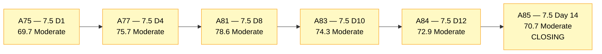
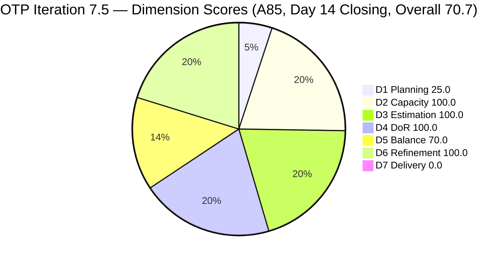
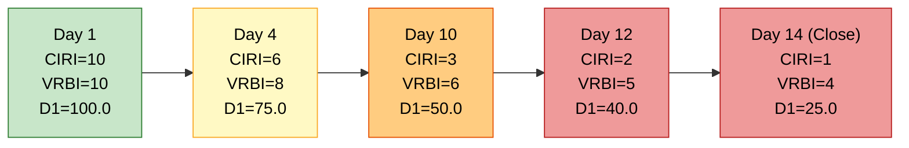
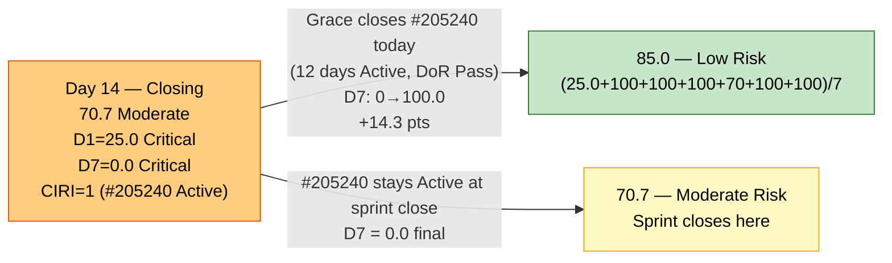
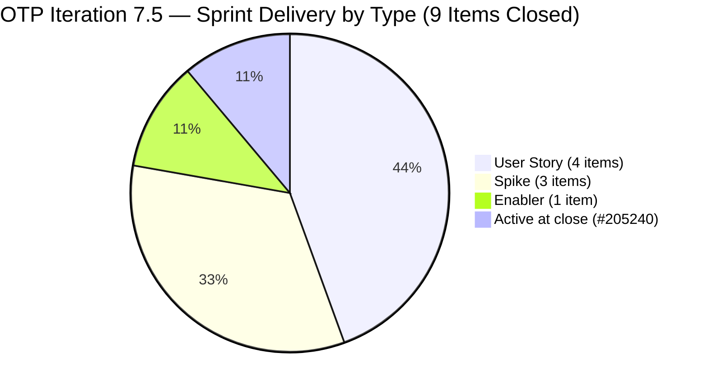

# ADO SAFe Audit — Office of the President (OTP Team)

## 1. Audit Metadata

| Field | Value |
|---|---|
| **Audit Date** | 2026-06-14 02:00 CST |
| **Sprint Day** | **14 of 14 — CLOSING AUDIT** |
| **Prior Audit** | A84 — `AUDIT_20260612_0203.md` (Overall 72.9, Moderate Risk — 7.5 Day 12) |
| **ADO Project** | OTP (`e7739905-28a3-4ae1-9173-7f6cd13b3494`) |
| **ADO Team** | OTP Team (`64de61f0-1203-4b01-aee2-6b4415aec52b`) |
| **Iteration** | Iteration 7.5 (`d1bb3b59-5d69-4489-987c-c5577c0a3cf1`) |
| **Iteration Path** | `OTP\2026 - PI7\Iteration 7.5` |
| **Iteration Dates** | Jun 1, 2026 – Jun 14, 2026 |
| **Workspace Folder** | `ado_otp` |
| **Overall Score** | **70.7 — Moderate Risk** |
| **Risk Band** | Moderate (60–79.9) |
| **Visible Backlog Items (VRBI)** | 4 root items |
| **Current Iteration Root Items (CIRI)** | 1 item (IterationPath = Iteration 7.5, live in backlog) |
| **Capacity** | Grace: 2.15h/day — configured |
| **Project Exception Applied** | Single-assignee model (Grace) — accepted per workspace CLAUDE.md |

---

## 2. Executive Summary

The OTP team closes Iteration 7.5 on Day 14 with an overall score of **70.7 — Moderate Risk**, a **−2.2 point decrease** from A84 (72.9). The sprint ends in its familiar pattern: most deliverables closed and exited the backlog before the final snapshot, leaving a thin live CIRI that cannot credit D7.

**The major positive news:** Grace executed exactly as predicted. #205438 (Draft Proposal for Chippens AI Inventory System, User Story, 2 SP) **closed on Jun 13** — her one effective work day before sprint close. This is the 9th item delivered in this sprint. The sprint-to-date contextual delivery reaches approximately **9 items, ~16 SP** — Grace's strongest PI7 sprint to date.

**The persistent structural issue:** The three pull-in items (#203864, #204194, #205433) were never moved from Iteration 7.6, despite four consecutive audit recommendations. As a result, CIRI = 1 (#205240 only), VRBI = 4, and D1 = 25.0 — the lowest D1 score of PI7. If #205240 closes today (a real possibility given Grace's active execution), CIRI = 0/4 = 0 and D1 collapses to 0.0.

**Closing risk on D7:** #205240 (Client SOW Verification, Active, 2 SP) — unchanged for 12 days — is the last remaining live CIRI item. Grace has been Active on it for the full sprint. If it closes today, D7 = 100.0 and Overall jumps to 87.1. If it remains Active at sprint-end, D7 = 0.0 and the sprint closes at 70.7.

Key findings:
- **#205438 confirmed closed Jun 13** — A84 critical recommendation executed. Well done Grace.
- **D1 = 25.0 — Critical.** Lowest D1 of PI7. CIRI = 1/4 = 25.0. Pull-in never happened; closing items exited the backlog.
- **D7 = 0.0 — Critical.** #205240 remains Active at snapshot time. Grace's day off on Jun 12 compressed her execution window to 1 day.
- **D6 = 100.0 maintained.** All 4 VRBI items fresh. No stale debt entering 7.6.
- **Sprint-to-date delivery: 9 items, ~16 SP** — factual evidence of Grace's execution that the closing D7 snapshot cannot fully credit.

---

## 3. Previous Audit Delta (A84 → A85)

| Dimension | A84 Score (7.5 Day 12) | A85 Score (7.5 Day 14 — Close) | Delta | Driver |
|---|---|---|---|---|
| D1 Iteration Planning | 40.0 | **25.0** | **−15.0** | #205438 closed Jun 13 and exited backlog. CIRI 2→1 (#205240 only). VRBI 5→4. Net: 1/4 = 25.0. |
| D2 Team Capacity | 100.0 | **100.0** | 0.0 | Grace capacity configured: 2.15h/day. 1/1 = 100.0. |
| D3 Estimation | 100.0 | **100.0** | 0.0 | #205240 estimated at 2 SP. CSP = 2 SP. 1/1 = 100.0. |
| D4 DoR Compliance | 100.0 | **100.0** | 0.0 | #205240 DoR-compliant. 1/1 = 100.0. |
| D5 Work Item Balance | 70.0 | **70.0** | 0.0 | User Story = 1/1 = 100% → dominant-type penalty −30. No US absence penalty. Score: 70.0. |
| D6 Backlog Refinement | 100.0 | **100.0** | 0.0 | All 4 VRBI fresh (oldest: #205240 Jun 2). 0 stale items. 0 untouched CIRI. |
| D7 Delivery Predictability | 0.0 | **0.0** | 0.0 | #205240 Active (not Closed/Done). CSP = 2 SP, CLSP = 0 SP. #205438 closed Jun 13 but exited backlog before snapshot. |
| **Overall** | **72.9** | **70.7** | **−2.2** | D1 regression only. #205438 closure is a win but exited the snapshot window. |

**Formula verification:** (25.0 + 100.0 + 100.0 + 100.0 + 70.0 + 100.0 + 0.0) / 7 = 495.0 / 7 = **70.7**

**Key transition observations A84 → A85:**
- **#205438 CLOSED Jun 13 (2 SP).** Grace executed the primary A84 recommendation perfectly — closed the item on her one available work day. It exited the backlog by the next morning snapshot.
- **#205240 remains Active** (Client SOW Verification, 2 SP). Unchanged since Jun 2 — 12 consecutive days Active. This is the last unresolved CIRI item. If Grace closes it today (Day 14 — sprint end day), D7 = 100.0 and Overall → 87.1.
- **A84 pull-in recommendation (#203864, #204194, #205433) remains unactioned.** Fourth consecutive closing audit with this unactioned recommendation. This structural pattern must be addressed in PI7 retrospective.

---

## 4. Current Iteration Snapshot

| Metric | Value |
|---|---|
| **Visible Backlog Items (VRBI)** | 4 |
| **Current Iteration Root Items (CIRI)** | 1 (IterationPath = `OTP\2026 - PI7\Iteration 7.5`, live in backlog) |
| **Non-current items** | 3 — #203864 (7.6), #204194 (7.6), #205433 (7.6) |
| **Story Points Committed (CSP)** | 2 SP (#205240) |
| **Story Points Closed (CLSP)** | 0 SP (no live CIRI items in Closed/Done state at snapshot) |
| **Sprint Day / Total** | **14 / 14 — Closing Day** |
| **Team Size (distinct CIRI assignees)** | 1 (Grace — #205240) |
| **Total Sprint Capacity** | 2.15h/day × 14 days = 30.1 hours (minus 1 day off Jun 12 = 27.95 hours effective) |
| **Remaining Sprint Capacity** | Grace has today (Jun 14 — sprint close day) available |
| **Iteration Start / Finish** | Jun 1, 2026 – Jun 14, 2026 |

**Sprint-to-date contextual delivery (items confirmed closed, cumulative through Day 14 snapshot):**

| ID | Title | Type | SP | Closed |
|---|---|---|---|---|
| #205430 | Gathering requirements for Pag-IBIG Loan | Spike | — | Jun 4 |
| #205241 | Gathering of Akira's Letter Invitation | User Story | 2 | Jun 5 |
| #205443 | Exploration of LB Loan Application | Spike | 2 | Jun 5 |
| #205422 | JDVP DepEd Partnership Appointment | Enabler | 2 | Jun 9 |
| #205446 | Gather requirements for building loan application | User Story | 2 | Jun 9 |
| #204193 | Philgeps Document Consolidation | User Story | 2 | Jun 9–10 |
| #205163 | Business Requirements & Workflow Mapping | Spike | 2 | Jun 10 |
| #205438 | Draft Proposal for Chippens AI Inventory System | User Story | 2 | **Jun 13** |

**Sprint-to-date contextual delivery: 8 confirmed exits, ~14 SP. #205240 (2 SP) pending close today.**

**CIRI State Distribution (1 live item at snapshot):**

| ID | Title | Type | State | SP | ChangedDate | Notes |
|---|---|---|---|---|---|---|
| #205240 | Client SOW Verification | User Story | Active | 2 | Jun 2 | Active for 12 days. Last work day of sprint. Grace has capacity today. |

---

## 5. Work Item Analysis

### Current Iteration Item (1 item — live in backlog, Iteration 7.5)

| ID | Title | Type | State | SP | DoR | ChangedDate | Notes |
|---|---|---|---|---|---|---|---|
| #205240 | Client SOW Verification | User Story | Active | 2 | **Pass** | Jun 2 | Active for 12 days. Sprint closes today (Jun 14). LAST CHANCE for closure to credit D7. |

### Non-current Backlog Items (3 items — Iteration 7.6)

| ID | Title | Iteration | Type | State | SP | Changed | DoR |
|---|---|---|---|---|---|---|---|
| #203864 | Release and collect of TCT | 7.6 | User Story | Ready | 2 | Jun 7 | Pass |
| #204194 | Philgeps Online Submission | 7.6 | User Story | Ready | 2 | Jun 9 | Pass |
| #205433 | Execute Pre-Filing Regulatory Compliance | 7.6 | User Story | Ready | 2 | Jun 7 | Pass |

*All 3 are DoR-compliant and Ready — well-prepared for Iteration 7.6 planning. The team exits this sprint with a clean, groomed queue.*

### DoR Assessment — 1 CIRI Item

| ID | Title | Desc ≥ 30 NWS | AC ≥ 20 NWS | Result |
|---|---|---|---|---|
| #205240 | Client SOW Verification | ✓ (BDD format, ~80 NWS) | ✓ (BDD, 2 scenarios with full detail) | **Pass** |

**Pass: 1/1. D4 = 100.0**

### Closed Sprint Items (exited backlog — for reference)

| ID | Title | Type | SP | State | Closed |
|---|---|---|---|---|---|
| #205438 | Draft Proposal for Chippens AI Inventory System | User Story | 2 | Closed | Jun 13 |
| #205443 | Exploration of LB Loan Application | Spike | 2 | Closed | Jun 5 |
| #205241 | Gathering of Akira's Letter Invitation | User Story | 2 | Closed | Jun 5 |
| #205422 | JDVP DepEd Partnership Appointment | Enabler | 2 | Closed | Jun 9 |
| #205446 | Gather requirements for building loan | User Story | 2 | Closed | Jun 9 |
| #204193 | Philgeps Document Consolidation | User Story | 2 | Closed | Jun 9–10 |
| #205163 | Business Requirements & Workflow Mapping | Spike | 2 | Closed | Jun 10 |
| #205430 | Gathering requirements for Pag-IBIG Loan | Spike | — | Closed | Jun 4 |

### Type Distribution (1 CIRI item)

| Type | Count | Share | D5 Impact |
|---|---|---|---|
| User Story | 1 (#205240) | 100.0% | Dominant-type penalty −30 active (>60%) |
| **Total** | **1** | **100%** | Score: 70.0 |

---

## 6. SAFe Compliance Scorecard

| Dimension | Score | Band | Evidence | Notes |
|---|---|---|---|---|
| D1 Iteration Planning | **25.0** | Critical | 1 CIRI / 4 VRBI | Closing-audit collapse. CIRI = 1 (#205240). 3 candidates in 7.6 never pulled in. If #205240 closes today: CIRI = 0/4 = 0 (Critical). |
| D2 Team Capacity | **100.0** | Low | 1/1 contributor with capacity | Grace 2.15h/day configured. 1/1 = 100.0. |
| D3 Estimation | **100.0** | Low | 1/1 ECI | #205240 estimated at 2 SP. CSP = 2 SP. |
| D4 DoR Compliance | **100.0** | Low | 1/1 DCI | #205240 DoR-compliant (BDD Desc + BDD AC). |
| D5 Work Item Balance | **70.0** | Moderate | US=100% → >60% → penalty −30 | Single US in CIRI. Structural through sprint end. |
| D6 Backlog Refinement | **100.0** | Low | 4/4 fresh; 0 untouched CIRI | #205240 oldest at Jun 2 — within 45-day window. No stale items. |
| D7 Delivery Predictability | **0.0** | Critical | 0 SP closed / 2 SP committed | #205240 Active at snapshot. #205438 closed Jun 13 but already exited backlog. |
| **OVERALL** | **70.7** | **Moderate** | (25.0+100.0+100.0+100.0+70.0+100.0+0.0)/7 | −2.2 from A84. D1 Critical (structural). D7 Critical (one item away from recovery). |

**Formula verification:** (25.0 + 100.0 + 100.0 + 100.0 + 70.0 + 100.0 + 0.0) / 7 = 495.0 / 7 = **70.7**

---

## 7. Dimension Findings

### D1 — Iteration Planning: 25.0 / 100 — Critical

**Formula:** CIRI / VRBI × 100 = 1 / 4 × 100 = **25.0**

| Metric | Value |
|---|---|
| Visible root backlog items (VRBI) | 4 |
| Items in Iteration 7.5 (CIRI) | 1 (#205240) |
| Items in future iterations | 3 (#203864, #204194, #205433 — all 7.6) |
| Score | **25.0** |

**Iteration 7.5 D1 trajectory:**

| Audit | Day | CIRI | VRBI | D1 |
|---|---|---|---|---|
| A75 | 1 | 10 | 10 | 100.0 |
| A82 | 9 | 4 | 8 | 75.0 |
| A83 | 10 | 3 | 6 | 50.0 |
| A84 | 12 | 2 | 5 | 40.0 |
| A85 | 14 (close) | 1 | 4 | **25.0** |

Each closure without pull-in drops D1 by approximately 15 points. The pattern is now structural and recurrent across PI7 iterations. For PI8: Grace's team must establish a pull-in rule to maintain CIRI ≥ 50% of VRBI at all times.

**If Grace closes #205240 today (sprint end):** CIRI = 0/4 = 0.0 — D1 goes Critical to 0. However, this is acceptable if accompanied by pull-in: D1 = 3/4 = 75.0 after moving 3 items to Iteration 7.6 next sprint.

---

### D2 — Team Capacity: 100.0 / 100 — Low Risk

**Formula:** CC / CW × 100 = 1 / 1 × 100 = **100.0**

Grace is the single contributor. Capacity configured at 2.15h/day (Dev 0.15h + Doc 1h + Req 1h). Grace executed her recovery plan precisely — closing #205438 on Jun 13. Today (Jun 14) is the sprint's final day. Grace has approximately 2.15h available.

---

### D3 — Estimation: 100.0 / 100 — Low Risk

**Formula:** ECI / PECI × 100 = 1 / 1 × 100 = **100.0**

| ID | Title | Type | SP | Status |
|---|---|---|---|---|
| #205240 | Client SOW Verification | User Story | 2 | Estimated, Active |

CSP = 2 SP. D3 = 100.0 maintained throughout the sprint.

---

### D4 — DoR Compliance: 100.0 / 100 — Low Risk

**Formula:** DCI / CIRI × 100 = 1 / 1 × 100 = **100.0**

**#205240** (Client SOW Verification): BDD "As a Corporate Compliance Auditor…" (~80 NWS), 2 BDD scenarios with sub-bullets (>100 NWS AC) — strong DoR compliance maintained from sprint start.

---

### D5 — Work Item Balance: 70.0 / 100 — Moderate Risk

**Formula:** Base 100 − penalties applied independently

| Penalty | Trigger | Applied |
|---|---|---|
| −40: No User Story in CIRI | 1 User Story (#205240) present | **No** |
| −30: Dominant type share > 60% | US = 1/1 = **100.0%** > 60% | **YES — applied** |
| −20: Spike share > 40% | Spike = 0/1 = 0% | **No** |

**Score:** max(0, 100 − 30) = **70.0**

With CIRI collapsed to 1 item, the dominant-type penalty is mathematically unavoidable for any single-item CIRI. This is a structural consequence of the CIRI collapse, not a team quality failure.

---

### D6 — Backlog Refinement: 100.0 / 100 — Low Risk

**Freshness window:** ChangedDate ≥ 2026-04-30 (45 days before 2026-06-14)

| Metric | Value |
|---|---|
| Total VRBI | 4 |
| Fresh items (ChangedDate ≥ Apr 30, 2026) | 4 — oldest: #205240 (Jun 2) |
| Stale_90 items (ChangedDate < Mar 16, 2026) | 0 |
| Stale_180 items (ChangedDate < Dec 16, 2025) | 0 |
| Untouched CIRI (ChangedDate < Jun 1, 2026) | 0 — #205240 = Jun 2 |

**Score: 100.0** — No penalties applicable. The OTP team exits Iteration 7.5 with a fully fresh, well-groomed backlog. The 3 non-CIRI items (#203864, #204194, #205433) are Ready and DoR-compliant — ideal Iteration 7.6 opening state.

---

### D7 — Delivery Predictability: 0.0 / 100 — Critical

**Formula:** CLSP / CSP × 100 = 0 / 2 × 100 = **0.0**

| Metric | Value |
|---|---|
| Estimated current items (ECI) | 1 (#205240) |
| Committed Story Points (CSP) | 2 SP |
| Closed Story Points (CLSP) | 0 SP (#205240 Active at snapshot) |
| #205438 status | **Closed Jun 13** — exited backlog before snapshot |
| Score | **0.0** |

**CLOSING AUDIT NOTE — Last-chance scenario:**
Today (Jun 14) is the final sprint day. Grace has approximately 2.15 hours available. #205240 (Client SOW Verification) has been Active for 12 days. If Grace closes it today before end-of-day:

- D7 = 2/2 = 100.0%
- Overall → (25.0 + 100.0 + 100.0 + 100.0 + 70.0 + 100.0 + 100.0) / 7 = 595.0 / 7 = **85.0 (Low Risk)**

But even if #205240 does not close, the sprint-to-date contextual delivery demonstrates significant execution:
- **Sprint total (including #205438 closed Jun 13): 9 items, ~16 SP** — strongest sprint delivery of PI7 for OTP.

The D7 formula captures only items live in CIRI at snapshot. The true delivery story is documented contextually.

---

## 8. Risks and Bottlenecks

| # | Severity | Dimension | Risk | Recommended Action |
|---|---|---|---|---|
| R1 | **CRITICAL** | D1 + D7 | If Grace closes #205240 today without pull-in, CIRI = 0/4 = 0.0 and D7 = 100.0 — creating an inversion where closing improves D7 but destroys D1. Score stays at 70.7 (D1 collapse offsets D7 gain). | **Ramon: before sprint close, move #203864, #204194, and #205433 to Iteration 7.6** (not 7.5 — sprint is ending). This does not help today's audit but ensures 7.6 starts with CIRI > 0. |
| R2 | **HIGH** | D7 | #205240 (Client SOW Verification) has been Active for 12 days without a logged state change. Actual execution status unclear from ADO alone. | **Grace: close #205240 today if the SOW verification work is substantively complete, even if minor items remain.** Log any residual work as a follow-on item in 7.6. Closing today: Overall → 85.0. |
| R3 | **HIGH** | D1 (PI7 pattern) | D1 has followed an identical collapse pattern in every iteration of PI7: high start → drops each time Grace closes without pull-in → closes at Critical (≤25.0). Pull-in recommendations have been issued in 5+ consecutive audits without action. | **PI7 Retrospective: establish sprint pull-in SLA.** Rule: when CIRI < 3 items or < 40% of VRBI, Ramon immediately pulls 1–2 items from Ready queue. Assign this as a recurring team practice. |
| R4 | **MEDIUM** | D5 | D5 = 70.0 due to single-item CIRI dominance. Not actionable at sprint close. | Note for PI8 sprint planning: target minimum 3 CIRI items to dilute type dominance and sustain D5 > 70. |

---

## 9. Prioritized Recommendations

1. **[TODAY — Sprint Close]** Grace: close #205240 (Client SOW Verification, User Story, Active, 2 SP, DoR Pass) today before end-of-day. 12 days of Active work is substantial — this item should be complete or near complete. Closing today: D7 = 100.0%, Overall → 85.0 (Low Risk). This is the single highest-leverage action available.

2. **[TODAY — Sprint Close]** Ramon: ensure #203864, #204194, and #205433 are correctly staged in Iteration 7.6 (already there) and that they open Iteration 7.6 as the first CIRI items on Day 1. All three are DoR-compliant and Ready. 7.6 Day 1 should start with CIRI ≥ 3.

3. **[PI7 Retrospective — Priority]** Establish a standing pull-in rule: any time active CIRI falls below 3 items during an iteration, Ramon pulls 1–2 items from the Ready queue within the same day. This prevents the D1 collapse pattern that has recurred in every PI7 iteration.

4. **[PI8 Planning]** Target a minimum CIRI of 5–6 items at sprint open for OTP. Grace's velocity (9 closures in 7.5 alone) outpaces the planning discipline. The backlog can support this — refine more items to Ready before each sprint begins.

5. **[PI8 Planning]** Diversify OTP work types in sprint planning. The single-assignee (Grace) single-type (User Story) pattern produces structural D5 penalties each iteration. If any spike or enabler work exists, add it to CIRI to reduce type dominance below 60%.

---

## 10. Evidence Gaps and Limitations

| Gap | Impact | Notes |
|---|---|---|
| **#205240 unchanged since Jun 2 (12 days Active)** | D7 closure risk | The ADO field does not reflect Grace's active work if she hasn't updated state. This item may be complete but unclosed in ADO. Grace should update today. |
| **Sprint-to-date delivery = 9 items, ~16 SP** | D7 structurally understates delivery | The backlog-exit pattern means sprint-to-date data must be read from iteration workitem history, not the live backlog. The scoring formula captures the snapshot, not cumulative. |
| **D1 formula limitation at sprint close** | Structural artifact | CIRI = 1 on Day 14 reflects closures, not planning failure. The team planned 10 items for 7.5; nearly all were delivered. The D1 = 25.0 is a sprint-end artifact. |
| **Single-assignee structural constraint** | D2, D5 notes | All CIRI work is Grace's. The accepted Project Exception makes D2 = 100.0 per formula. The single-assignee model continues to create fragility at sprint boundaries. |
| **Pull-in recommendations unactioned for 4 audits** | D1 persistent gap | The gap between recommendation issuance and execution is structural. This audit cycle cannot enforce ADO actions. A process owner must be designated for pull-in decisions. |

---

## 11. Visualizations

### Iteration 7.5 Score Trend — A75 to A85 (Closing)

### Dimension Scores — A85 (Day 14, Closing)

### D1 Collapse Trajectory — Iteration 7.5 (CIRI vs VRBI)

### Sprint Outcome Scenarios — Day 14

### Sprint Delivery Summary — Iteration 7.5 (9 Items)

---

## 12. Audit Trail

| Source | Tool | Data |
|---|---|---|
| Current iteration | `work_list_team_iterations` (project `e7739905`, team `OTP Team`, timeframe=current) | Iteration 7.5: Jun 1–14, 2026; ID `d1bb3b59-5d69-4489-987c-c5577c0a3cf1` — confirmed |
| Backlog items | `wit_list_backlog_work_items` (backlogId `Microsoft.RequirementCategory`) | 4 open root items: #205240 (7.5), #203864 (7.6), #204194 (7.6), #205433 (7.6) |
| Iteration work items | `wit_get_work_items_for_iteration` (iterationId `d1bb3b59`) | 9 root items: #205240 (Active), 8 Closed items |
| Work item details | `wit_get_work_items_batch_by_ids` (IDs: 205422, 205241, 205240, 204193, 205163, 205430, 205438, 205443, 205446, 203864, 204194, 205433) | SP, State, Type, Desc, AC, ChangedDate, IterationPath confirmed for all items |
| Team capacity | `work_get_iteration_capacities` (project `e7739905`, iterationId `d1bb3b59`) | Grace: 2.15h/day configured; 1 team day off (Jun 12) |
| Prior audit | `AUDIT_20260612_0203.md` (A84) | Overall 72.9, Moderate Risk, 7.5 Day 12, 5 VRBI, 2 CIRI, 4 SP committed, 0 SP closed |
