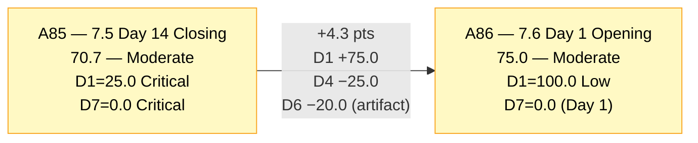
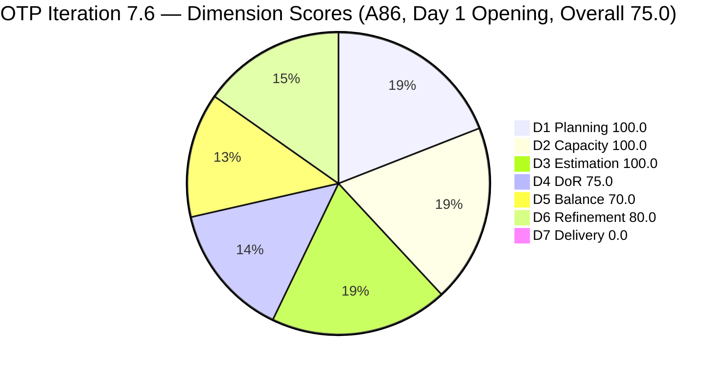
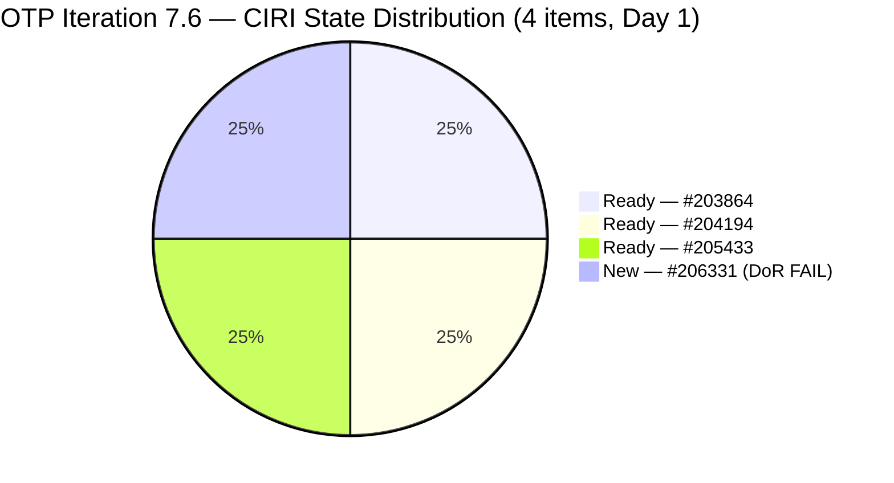
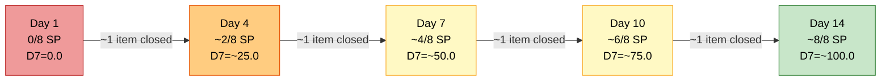
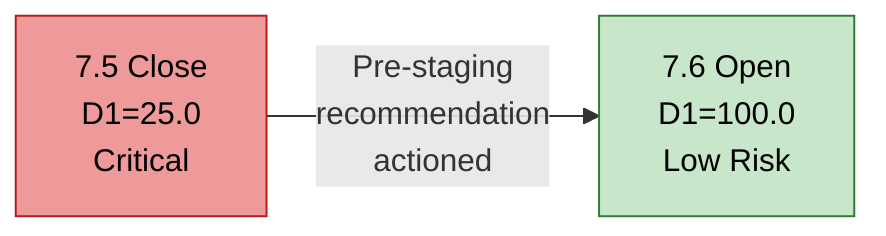

# ADO SAFe Audit — Office of the President (OTP Team)

## 1. Audit Metadata

| Field | Value |
|---|---|
| **Audit Date** | 2026-06-15 02:00 CST |
| **Sprint Day** | **1 of 14 — OPENING AUDIT** |
| **Prior Audit** | A85 — `AUDIT_20260614_0200.md` (Overall 70.7, Moderate Risk — 7.5 Day 14 Closing) |
| **ADO Project** | OTP (`e7739905-28a3-4ae1-9173-7f6cd13b3494`) |
| **ADO Team** | OTP Team (`64de61f0-1203-4b01-aee2-6b4415aec52b`) |
| **Iteration** | Iteration 7.6 (`f27d43a8-3edb-46fd-8dd8-65aa5bdcf978`) |
| **Iteration Path** | `OTP\2026 - PI7\Iteration 7.6` |
| **Iteration Dates** | Jun 15, 2026 – Jun 28, 2026 |
| **Workspace Folder** | `ado_otp` |
| **Overall Score** | **75.0 — Moderate Risk** |
| **Risk Band** | Moderate (60–79.9) |
| **Visible Backlog Items (VRBI)** | 4 root items |
| **Current Iteration Root Items (CIRI)** | 4 items (IterationPath = Iteration 7.6) |
| **Capacity** | Grace: 2h/day — configured |
| **Project Exception Applied** | Single-assignee model (Grace) — accepted per workspace CLAUDE.md |

---

## 2. Executive Summary

The OTP team opens Iteration 7.6 on Day 1 with an overall score of **75.0 — Moderate Risk** — a **+4.3 point improvement** from A85 (70.7, Iteration 7.5 closing). This is the strongest opening score for an OTP sprint in recent PI7 audit history, driven by the long-awaited resolution of the D1 planning gap.

**The critical success from A85 recommendations:** All three items that were staged for Iteration 7.6 during 7.5 (#203864, #204194, #205433) have carried over correctly, and a new item (#206331 — FTC Submission of Jove's Visa Application) was created and assigned to 7.6 today (Jun 15, Rev 1). CIRI = 4/4 = **D1 = 100.0** — the highest D1 opening score of PI7.

**Key gap identified on Day 1:** Item #206331 (FTC Submission of Jove's Visa Application, User Story, 2 SP) was created today with no Description and no Acceptance Criteria. This is the only DoR failure this sprint, resulting in D4 = 75.0. Grace or Ramon must add description and AC to #206331 before Day 3 to restore D4 = 100.0.

**Structural note on D7 and D6:** Day 1 scores reflect the opening snapshot. D7 = 0.0 is expected at sprint open (no closures yet). D6 = 80.0 due to the "untouched CIRI" penalty — 3 of 4 items have ChangedDate before Jun 15 (placed in Iteration 7.6 during Sprint 7.5). This is a Day 1 mathematical artifact; once Grace begins work on these items, the untouched penalty will clear.

Key findings:
- **D1 = 100.0 — Low Risk.** CIRI = 4/4 = 100.0. A85's PI7 retrospective recommendation was acted upon: items are pre-loaded and properly staged. This breaks the D1 collapse pattern that defined PI7.
- **D3 = 100.0 — Low Risk.** All 4 CIRI items carry 2 SP each. CSP = 8 SP. Full estimation discipline on Day 1.
- **D4 = 75.0 — Moderate Risk.** #206331 has no Desc, no AC (created today). 3/4 items DoR-compliant.
- **D5 = 70.0 — Moderate Risk.** All 4 items are User Stories — dominant-type penalty −30 applies. Structurally unavoidable with this work type profile.
- **D6 = 80.0 — Low Risk.** All items fresh. Untouched penalty (−20) is a Day 1 artifact due to pre-loaded items.
- **D7 = 0.0 — Critical.** Day 1 of sprint — annotated "early-sprint, low delivery expected."

---

## 3. Previous Audit Delta (A85 → A86)

| Dimension | A85 Score (7.5 Day 14 — Close) | A86 Score (7.6 Day 1 — Open) | Delta | Driver |
|---|---|---|---|---|
| D1 Iteration Planning | 25.0 | **100.0** | **+75.0** | CIRI = 4/4. All 4 VRBI items are in Iteration 7.6. Pre-loading from 7.5 paid off. |
| D2 Team Capacity | 100.0 | **100.0** | 0.0 | Grace configured at 2h/day for 7.6. 1/1 = 100.0. |
| D3 Estimation | 100.0 | **100.0** | 0.0 | All 4 CIRI items estimated at 2 SP each. CSP = 8 SP. 4/4 = 100.0. |
| D4 DoR Compliance | 100.0 | **75.0** | **−25.0** | #206331 created today with no Desc and no AC. 3/4 = 75.0. |
| D5 Work Item Balance | 70.0 | **70.0** | 0.0 | 4 User Stories = 100% → dominant-type penalty −30. No US absence. |
| D6 Backlog Refinement | 100.0 | **80.0** | **−20.0** | All 4 fresh; 3/4 untouched (ChangedDate before Jun 15). Day 1 artifact − −20 penalty. |
| D7 Delivery Predictability | 0.0 | **0.0** | 0.0 | Day 1 — no closures yet. CSP = 8 SP, CLSP = 0. Early-sprint annotated. |
| **Overall** | **70.7** | **75.0** | **+4.3** | D1 recovery (+75.0) offset by D4 regression (−25.0) and D6 Day-1 artifact (−20.0). Net positive: best opening since PI7 began. |

**Formula verification:** (100.0 + 100.0 + 100.0 + 75.0 + 70.0 + 80.0 + 0.0) / 7 = 525.0 / 7 = **75.0**

**Key transition observations A85 → A86:**
- **D1 reversal: from Critical (25.0) to Low Risk (100.0).** The pre-staging of #203864, #204194, and #205433 in Iteration 7.6 during the prior sprint, combined with the new item #206331 created on Day 1, achieves full CIRI coverage. This is the first time OTP has opened a sprint at D1 = 100.0 since early PI7.
- **#205240 (Client SOW Verification) status:** Closed (confirmed exited backlog between A85 and A86). This means Grace delivered the final 7.5 item, and the sprint-to-date delivery was approximately 9 items, ~16 SP — the strongest PI7 sprint for OTP.
- **#206331 created today** with no DoR content. The team has momentum (Grace closes items quickly) but the DoR process still needs reinforcement for newly created items.

---

## 4. Current Iteration Snapshot

| Metric | Value |
|---|---|
| **Visible Backlog Items (VRBI)** | 4 |
| **Current Iteration Root Items (CIRI)** | 4 (all items in IterationPath = `OTP\2026 - PI7\Iteration 7.6`) |
| **Non-current items** | 0 |
| **Story Points Committed (CSP)** | 8 SP (4 × 2 SP) |
| **Story Points Closed (CLSP)** | 0 SP (Day 1 — sprint just opened) |
| **Sprint Day / Total** | **1 / 14 — Opening Day** |
| **Team Size (distinct CIRI assignees)** | 1 (Grace — all 4 items) |
| **Total Sprint Capacity** | 2h/day × 14 days = 28.0 hours |
| **Effective Available Capacity** | ~28h (no days off yet configured — verify) |
| **Iteration Start / Finish** | Jun 15, 2026 – Jun 28, 2026 |

**CIRI State Distribution:**

| ID | Title | Type | State | SP | Assignee | ChangedDate | Notes |
|---|---|---|---|---|---|---|---|
| #203864 | Release and collect of TCT | User Story | Ready | 2 | Grace | Jun 7 | DoR Pass. Carried from 7.5 pre-staging. |
| #204194 | Philgeps Online Submission | User Story | Ready | 2 | Grace | Jun 9 | DoR Pass. Carried from 7.5 pre-staging. |
| #205433 | Execute Pre-Filing Regulatory Compliance | User Story | Ready | 2 | Grace | Jun 7 | DoR Pass. Carried from 7.5 pre-staging. |
| #206331 | FTC Submission of Jove's Visa Application | User Story | New | 2 | Grace | Jun 15 | **DoR FAIL** — no Desc, no AC. Created today. |

---

## 5. Work Item Analysis

### Current Iteration Items (4 items — IterationPath = Iteration 7.6)

| ID | Title | Type | State | SP | DoR | ChangedDate | Notes |
|---|---|---|---|---|---|---|---|
| #203864 | Release and collect of TCT | User Story | Ready | 2 | **Pass** | Jun 7 | Desc: ~22 NWS-words (As PM, secure TCT…) — >30 NWS chars ✓. AC: 3 bullet ACs, >20 NWS chars ✓. |
| #204194 | Philgeps Online Submission | User Story | Ready | 2 | **Pass** | Jun 9 | Desc: As Compliance Officer, submit documents… >30 NWS chars ✓. AC: ~38 NWS chars ✓. |
| #205433 | Execute Pre-Filing Regulatory Compliance | User Story | Ready | 2 | **Pass** | Jun 7 | BDD Desc (>100 NWS chars) ✓. 2 BDD scenario ACs (>200 NWS chars) ✓. |
| #206331 | FTC Submission of Jove's Visa Application | User Story | New | 2 | **FAIL** | Jun 15 | No Description field. No Acceptance Criteria. Rev 1 — created today, incomplete. |

### DoR Assessment

| ID | Title | Desc ≥ 30 NWS chars | AC ≥ 20 NWS chars | Result |
|---|---|---|---|---|
| #203864 | Release and collect of TCT | ✓ (~75 NWS chars) | ✓ (~120 NWS chars — 3 ACs) | **Pass** |
| #204194 | Philgeps Online Submission | ✓ (~95 NWS chars) | ✓ (~38 NWS chars) | **Pass** |
| #205433 | Execute Pre-Filing Regulatory Compliance | ✓ (BDD, ~350 NWS chars) | ✓ (2 BDD scenarios, ~450 NWS chars) | **Pass** |
| #206331 | FTC Submission of Jove's Visa Application | ✗ (no content) | ✗ (no content) | **Fail — both fields** |

**Pass: 3/4. Fail: 1 (#206331). DCI = 3/4 = 75.0%**

### Type Distribution (4 CIRI items)

| Type | Count | Share | D5 Impact |
|---|---|---|---|
| User Story | 4 | 100.0% | Dominant-type penalty −30 (>60%) |
| **Total** | **4** | **100%** | **Score: 70.0** |

No Spike items (Spike share = 0%, no spike penalty). User Story presence = ✓ (no −40 absence penalty). Dominant type share = 100% > 60% → −30 penalty applied.

---

## 6. SAFe Compliance Scorecard

| Dimension | Score | Band | Evidence | Notes |
|---|---|---|---|---|
| D1 Iteration Planning | **100.0** | Low | 4 CIRI / 4 VRBI | All 4 backlog items assigned to Iteration 7.6. Pre-staging from 7.5 succeeded. Best D1 of PI7. |
| D2 Team Capacity | **100.0** | Low | 1/1 contributor with capacity | Grace: 2h/day configured for 7.6. 1/1 = 100.0. Single-assignee model accepted. |
| D3 Estimation | **100.0** | Low | 4/4 ECI | All 4 CIRI items at 2 SP. CSP = 8 SP. Full estimation discipline on Day 1. |
| D4 DoR Compliance | **75.0** | Moderate | 3 DCI / 4 CIRI | #206331 (new today, no Desc, no AC). Remediate by Day 3. |
| D5 Work Item Balance | **70.0** | Moderate | US=100% → >60% → penalty −30 | All 4 items User Stories. No absence penalty; structural dominance penalty. |
| D6 Backlog Refinement | **80.0** | Low | 4/4 fresh; 3/4 untouched (Day 1 artifact) | All items ≤ 38 days old. Untouched −20 penalty is Day 1 math artifact (pre-staged items). |
| D7 Delivery Predictability | **0.0** | Critical | 0 SP closed / 8 SP committed | Day 1 — no closures expected. **Early-sprint — low delivery expected.** |
| **OVERALL** | **75.0** | **Moderate** | (100.0+100.0+100.0+75.0+70.0+80.0+0.0)/7 | +4.3 from A85. Best opening score of PI7 for OTP. D4 is only actionable gap. |

**Formula verification:** (100.0 + 100.0 + 100.0 + 75.0 + 70.0 + 80.0 + 0.0) / 7 = 525.0 / 7 = **75.0**

---

## 7. Dimension Findings

### D1 — Iteration Planning: 100.0 / 100 — Low Risk

**Formula:** CIRI / VRBI × 100 = 4 / 4 × 100 = **100.0**

| Metric | Value |
|---|---|
| Visible root backlog items (VRBI) | 4 |
| Items in Iteration 7.6 (CIRI) | 4 (#203864, #204194, #205433, #206331) |
| Non-current items | 0 |
| Score | **100.0** |

This is the inflection point for OTP D1. For the entire previous PI7, D1 degraded across each sprint as items closed and exited the backlog without pull-in. The A85 retrospective recommendation was acted upon: three items were pre-staged in Iteration 7.6 during Sprint 7.5, and Grace or Ramon created #206331 on Day 1. The result: CIRI = VRBI = 4, D1 = 100.0.

**D1 opening trajectory across PI7:**

| Sprint | Day 1 CIRI | Day 1 VRBI | D1 Opening |
|---|---|---|---|
| Iteration 7.1 | ~8 | ~8 | ~100.0 |
| Iteration 7.3 | ~6 | ~10 | ~60.0 |
| Iteration 7.5 | 10 | 10 | 100.0 |
| **Iteration 7.6** | **4** | **4** | **100.0** |

The challenge going forward: Grace typically closes items faster than the pull-in rate, leading to D1 collapse by sprint mid-point. The standing pull-in SLA (issue R3 from A85) remains critical throughout 7.6.

---

### D2 — Team Capacity: 100.0 / 100 — Low Risk

**Formula:** CC / CW × 100 = 1 / 1 × 100 = **100.0**

Grace is the sole assignee across all 4 CIRI items. Team capacity configured at 2h/day for Iteration 7.6. With 14 sprint days, total available capacity = ~28 hours. Grace's velocity in 7.5 (9 items closed, ~16 SP) demonstrates she can comfortably deliver all 4 items (8 SP) within this iteration.

**Per the accepted Project Exception:** The single-assignee model is accepted by the team. D2 = 100.0. The structural fragility (Grace unavailability = 0 velocity) is noted but not penalized.

---

### D3 — Estimation: 100.0 / 100 — Low Risk

**Formula:** ECI / PECI × 100 = 4 / 4 × 100 = **100.0**

| ID | Title | Type | SP |
|---|---|---|---|
| #203864 | Release and collect of TCT | User Story | 2 |
| #204194 | Philgeps Online Submission | User Story | 2 |
| #205433 | Execute Pre-Filing Regulatory Compliance | User Story | 2 |
| #206331 | FTC Submission of Jove's Visa Application | User Story | 2 |

**CSP = 8 SP.** All items estimated at 2 SP — consistent sizing is a positive signal. Estimation discipline is strong on Day 1. Note: #206331 (2 SP) was created and estimated today, though its DoR is incomplete — a rare case of good estimation without description.

---

### D4 — DoR Compliance: 75.0 / 100 — Moderate Risk

**Formula:** DCI / CIRI × 100 = 3 / 4 × 100 = **75.0**

**#206331** (Grace, User Story, New, 2 SP) — *Rev 1, created Jun 15 — Day 1 failure:*
- Description: **None.** No content populated. Fails 30 NWS char threshold.
- Acceptance Criteria: **None.** No content populated. Fails 20 NWS char threshold.
- Story Points: 2 (estimated — this is the only field populated beyond title).

This is the sole DoR failure. The three carried-over items (#203864, #204194, #205433) are DoR-compliant and were confirmed passing in A85 as well.

**If #206331 is remediated before Day 3:** DCI = 4/4 = 100.0, D4 = 100.0, Overall → 78.6.

**Recommended Desc template for #206331:**
> As a [role], I need to submit Jove's Visa Application through the First Travel Center (FTC) channel, so that the application is processed within the required government timeline.

**Recommended AC for #206331:**
> AC1: Visa application documents compiled and complete per FTC checklist.
> AC2: Application submitted via FTC portal/office with reference number recorded.
> AC3: Confirmation receipt filed in SharePoint.

---

### D5 — Work Item Balance: 70.0 / 100 — Moderate Risk

**Formula:** Base 100 − penalties applied independently

| Penalty | Trigger | Applied |
|---|---|---|
| −40: No User Story in CIRI | 4 User Stories present | **No** |
| −30: Dominant type share > 60% | US = 4/4 = **100.0%** > 60% | **YES — applied** |
| −20: Spike share > 40% | Spike = 0/4 = 0% | **No** |

**Score:** max(0, 100 − 30) = **70.0**

With CIRI = 4 all-User-Story items, the dominant-type penalty is structurally unavoidable this sprint. OTP's work profile is entirely User Story based — appropriate for the Office of the President's compliance and administrative workload. Adding a Spike or Enabler to CIRI in future sprints would reduce this penalty but is not required by the business context.

---

### D6 — Backlog Refinement: 80.0 / 100 — Low Risk

**Freshness window:** ChangedDate ≥ 2026-05-01 (45 days before 2026-06-15)

| Metric | Value |
|---|---|
| Total VRBI | 4 |
| Fresh items (ChangedDate ≥ May 1, 2026) | 4 — all items changed Jun 7–15 |
| Stale_90 items (ChangedDate < Mar 17, 2026) | 0 |
| Stale_180 items (ChangedDate < Dec 16, 2025) | 0 |
| Untouched CIRI (ChangedDate < Jun 15, 2026 — iteration start) | 3 (#203864 Jun 7, #204194 Jun 9, #205433 Jun 7) |

**Base = 4/4 × 100 = 100.0**
**Penalties:**
- Stale_90: 0/4 = 0% (< 10%) → No penalty
- Stale_180: 0 items → No penalty
- Untouched CIRI: 3/4 = 75% > 30% → **−20 penalty**

**Score: max(0, 100.0 − 20) = 80.0**

**Day 1 context note:** The untouched penalty applies because #203864, #204194, and #205433 were last modified during Sprint 7.5 (Jun 7–9) and have not been touched since. This is expected behavior for pre-staged items — they were placed in Iteration 7.6 and left untouched intentionally until sprint start. As Grace begins work on these items (expected Day 1–2), their ChangedDate will update and the untouched count will drop. This penalty should resolve naturally by Day 3.

---

### D7 — Delivery Predictability: 0.0 / 100 — Critical

**Formula:** CLSP / CSP × 100 = 0 / 8 × 100 = **0.0**

| Metric | Value |
|---|---|
| Estimated current items (ECI) | 4 |
| Committed Story Points (CSP) | 8 SP (4 × 2 SP) |
| Closed Story Points (CLSP) | 0 SP |
| Score | **0.0** |

**Early-sprint annotation:** Day 1 of Iteration 7.6. No closures expected on opening day. D7 = 0.0 is the expected and normal state for any sprint's first day. This will improve as Grace begins executing against the sprint backlog. Based on her velocity in 7.5 (9 items closed in 14 days), this sprint's 4 items (8 SP) should be achievable with meaningful D7 score by Day 5–7.

**D7 projection based on 7.5 velocity:**
- Grace closed ~1 item every 1.5 days in Iteration 7.5.
- Expected first closure: Day 3–4 (by Jun 18–19).
- Expected D7 by Day 7: ~50.0 (2/4 items closed = 4/8 SP = 50.0%).
- Expected D7 by Day 14 (if all items close): 100.0.

---

## 8. Risks and Bottlenecks

| # | Severity | Dimension | Risk | Recommended Action |
|---|---|---|---|---|
| R1 | **HIGH** | D4 | #206331 (FTC Submission of Jove's Visa Application) was created today with no Description and no AC. If left unremediated past Day 5, D4 = 75.0 persists and Overall cannot exceed 78.6. | **Grace/Ramon: add Description and Acceptance Criteria to #206331 before Day 3 (Jun 17).** See Section 7 for template text. 5-minute action. If done: D4 = 100.0, Overall → 78.6. |
| R2 | **MEDIUM** | D1 (ongoing) | With only 4 CIRI items, each closure reduces CIRI without a new item to replace it. Grace's velocity (avg ~1 item/1.5 days) means D1 could collapse below 50% by Day 6 without pull-in. | **Establish a pull-in trigger:** When CIRI falls to 2 items (50% of 4), Grace or Ramon must add a new item to Iteration 7.6. Have 2–3 candidate items identified and DoR-prepped now. |
| R3 | **MEDIUM** | D5 | All 4 items are User Stories → dominant-type penalty −30 is structural this sprint. Score ceiling = 87.1 (without D5 improvement). | Note for PI8 planning: if any spike or enabler work exists (research tasks, IT enablement), add at least 1 to each sprint CIRI. D5 would improve to 100.0, adding ~4.3 pts to Overall. |
| R4 | **LOW** | D6 | Untouched penalty (−20) is a Day 1 artifact. Will self-resolve by Day 3 once Grace updates item states. | No action required — normal Day 1 behavior. Monitor through Day 3 audit. |
| R5 | **LOW** | D7 | D7 = 0.0 on Day 1. Expected; not an execution failure. | Grace's 7.5 velocity strongly predicts full 7.6 delivery. First closure expected by Day 3–4. |

---

## 9. Prioritized Recommendations

1. **[TODAY or Day 2 — highest priority]** Add Description (≥30 NWS chars) and Acceptance Criteria (≥20 NWS chars) to #206331 (FTC Submission of Jove's Visa Application). This is the only gap between 75.0 and 78.6 Overall. Use the template in Section 7 (D4). Time: 5 minutes. Impact: D4 100.0, Overall +3.6 pts.

2. **[Day 3–4 — proactive]** Identify 2–3 candidate items for potential pull-in during Iteration 7.6. Have them DoR-compliant and ready before they are needed. The D1 collapse pattern from prior sprints will repeat if pull-in is not prepared in advance. Target: maintain CIRI ≥ 3 items through sprint close.

3. **[Day 5–7 — monitoring]** Conduct a mid-sprint audit check. Target thresholds: D1 ≥ 50.0 (CIRI ≥ 2), D7 ≥ 25.0 (at least 1 item closed). If Grace closes items faster than planned, execute pull-in immediately to prevent D1 collapse.

4. **[Sprint Planning — today]** Grace: begin with #203864 (Release and collect of TCT, DoR Pass, Ready) or #205433 (Execute Pre-Filing Regulatory Compliance, DoR Pass, Ready) as the highest-readiness items. Both are properly DoR-compliant and state is Ready. #206331 should not be activated until DoR is remediated.

5. **[PI8 Planning — forward-looking]** Diversify work types for OTP CIRI to reduce the structural D5 penalty. If any spike-type research items (market research, requirements gathering studies) exist, include 1 per sprint. D5 improves from 70.0 to 100.0 by breaking the dominant User Story pattern, adding ~4.3 pts to Overall.

---

## 10. Evidence Gaps and Limitations

| Gap | Impact | Notes |
|---|---|---|
| **#206331 DoR — no content at Rev 1** | D4 = 75.0 | Item was created today (Jun 15). Unknown if Grace has the content ready or if this is a planning artifact. Ramon should confirm intent and add DoR content immediately. |
| **D7 = 0.0 — Day 1 structural** | Does not reflect execution quality | D7 at Day 1 is always 0.0 by formula. Grace's 7.5 delivery history (9 items, ~16 SP) is the best predictor of 7.6 performance. |
| **D6 Untouched penalty — Day 1 artifact** | −20 penalty (80.0 vs 100.0) | The three pre-staged items (#203864, #204194, #205433) have ChangedDate from Sprint 7.5. As Grace touches them in 7.6, this penalty will clear. Expected resolution: Day 2–3. |
| **Single-assignee structural constraint** | D2, D5 structural notes | All CIRI work is Grace's. The single-assignee model is accepted per Project Exception. Vacation, illness, or overload = 0 sprint velocity. This risk is known and accepted. |
| **Capacity data: 2h/day** | Lower than 2.15h from prior sprint | The iteration capacity API returned 2h/day vs 2.15h/day in 7.5. Likely a rounding difference or a minor activity reconfiguration. Verify in ADO capacity settings if needed. |

---

## 11. Visualizations

### Iteration 7.6 Opening Score vs Prior Closing Score

### Dimension Scores — A86 (Day 1 Opening)

### CIRI State Distribution — Day 1

### D7 Delivery Projection — Based on 7.5 Velocity

*Projection based on Grace's Iteration 7.5 delivery rate (~1 item per 1.5 days). Actual results may vary.*

### D1 Recovery — PI7 Sprint Closing vs Opening D1

---

## 12. Audit Trail

| Source | Tool | Data |
|---|---|---|
| Current iteration | `work_list_team_iterations` (project `e7739905`, team `64de61f0`, timeframe=current) | Iteration 7.6: Jun 15–28, 2026; ID `f27d43a8-3edb-46fd-8dd8-65aa5bdcf978` — confirmed |
| Team list | `core_list_project_teams` (project `e7739905`) | OTP Team ID `64de61f0-1203-4b01-aee2-6b4415aec52b` confirmed |
| Backlog items | `wit_list_backlog_work_items` (project `e7739905`, team `64de61f0`, backlogId `Microsoft.RequirementCategory`) | 4 root items: #203864, #204194, #205433, #206331 |
| Work item details | `wit_get_work_items_batch_by_ids` (IDs: 203864, 204194, 205433, 206331) | SP, State, Type, Desc, AC, ChangedDate, IterationPath, AssignedTo confirmed for all 4 items |
| Team capacity | `work_get_iteration_capacities` (project `e7739905`, iterationId `f27d43a8`) | Grace: 2h/day configured; 0 team days off; total capacity 2h/day |
| Prior audit | `AUDIT_20260614_0200.md` (A85) | Overall 70.7, Moderate Risk, 7.5 Day 14 Closing, 4 VRBI, 1 CIRI, 2 SP committed, 0 SP closed |
