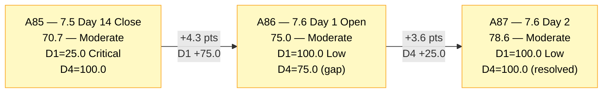
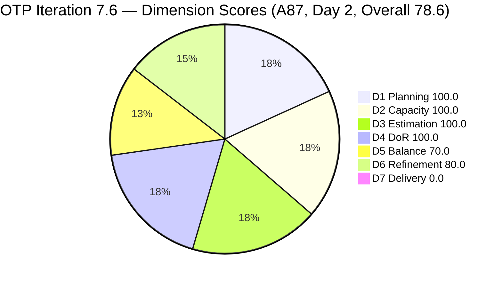
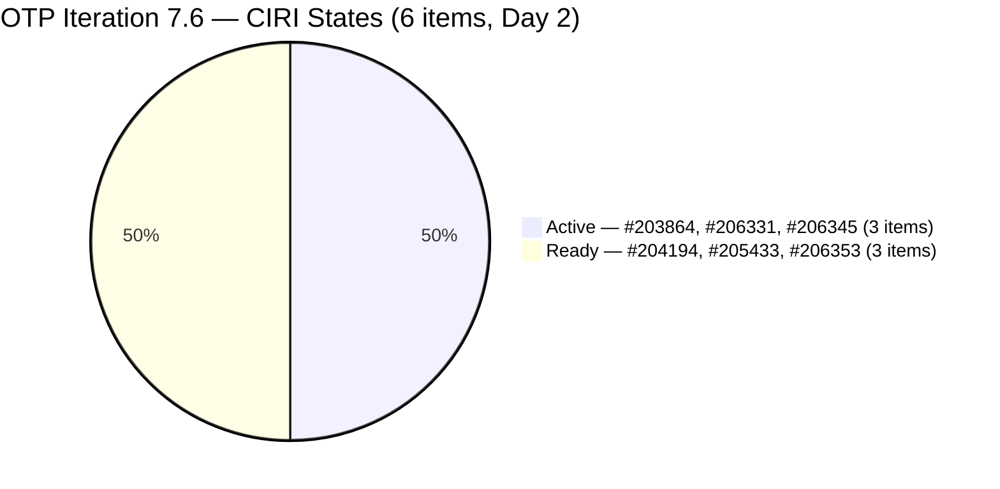
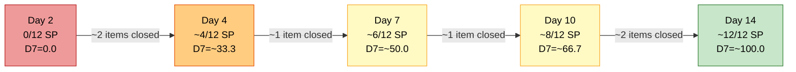
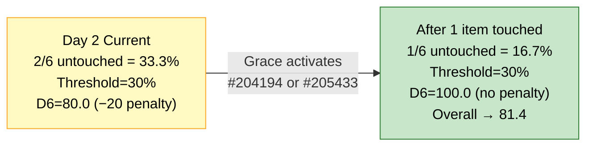

# ADO SAFe Audit — Office of the President (OTP Team)

## 1. Audit Metadata

| Field | Value |
|---|---|
| **Audit Date** | 2026-06-16 02:06 CST |
| **Sprint Day** | **2 of 14** |
| **Prior Audit** | A86 — `AUDIT_20260615_0200.md` (Overall 75.0, Moderate Risk — 7.6 Day 1 Opening) |
| **ADO Project** | OTP (`e7739905-28a3-4ae1-9173-7f6cd13b3494`) |
| **ADO Team** | OTP Team (`64de61f0-1203-4b01-aee2-6b4415aec52b`) |
| **Iteration** | Iteration 7.6 (`f27d43a8-3edb-46fd-8dd8-65aa5bdcf978`) |
| **Iteration Path** | `OTP\2026 - PI7\Iteration 7.6` |
| **Iteration Dates** | Jun 15, 2026 – Jun 28, 2026 |
| **Workspace Folder** | `ado_otp` |
| **Overall Score** | **78.6 — Moderate Risk** |
| **Risk Band** | Moderate (60–79.9) |
| **Visible Backlog Items (VRBI)** | 6 root items |
| **Current Iteration Root Items (CIRI)** | 6 items (IterationPath = Iteration 7.6) |
| **Capacity** | Grace: 2h/day — configured |
| **Project Exception Applied** | Single-assignee model (Grace) — accepted per workspace CLAUDE.md |

---

## 2. Executive Summary

The OTP team closes Day 2 of Iteration 7.6 with an overall score of **78.6 — Moderate Risk**, a **+3.6 point improvement** from the Day 1 opening audit A86 (75.0). This is the highest daily score recorded in recent PI7 audit history for OTP, driven by two major improvements: the DoR gap on #206331 has been fully remediated (D4 now 100.0), and two new items (#206345 — TESDA Exploration Spike; #206353 — Meeting with Chippens-Charles User Story) have been added to Iteration 7.6, expanding CIRI from 4 to 6 while keeping D1 at 100.0.

**Key wins on Day 2:** Grace is already active on the sprint — #203864 (Release and collect of TCT) and #206331 (FTC Submission) both show State=Active and ChangedDate=Jun 16, confirming work has begun. #206331's description and acceptance criteria are now fully populated in BDD format, resolving the D4 regression from A86. #206353 (User Story, BDD format) was created yesterday with full DoR content.

**Key gap persisting:** D5 = 70.0 remains a structural ceiling due to the dominant User Story profile. With 5 User Stories and 1 Spike across 6 CIRI items, the >60% dominant-type penalty (−30) applies. D7 = 0.0 is expected on Day 2 with no closures yet. The untouched penalty on D6 has dropped: only 2 of 6 CIRI items have ChangedDate before Jun 15 (33.3% — just above the 30% threshold), yielding −20 penalty. As Grace continues, this will clear.

**Score ceiling this sprint:** With D7 = 0.0 on Day 2 (expected), the maximum achievable today is (100+100+100+100+70+80+0)/7 = 78.6. When Grace closes first items (expected Day 3–5), D7 will climb and the overall can reach into the low 80s — first Low Risk territory for OTP in PI7.

---

## 3. Previous Audit Delta (A86 → A87)

| Dimension | A86 Score (7.6 Day 1 — Open) | A87 Score (7.6 Day 2) | Delta | Driver |
|---|---|---|---|---|
| D1 Iteration Planning | 100.0 | **100.0** | 0.0 | CIRI = 6/6. Two new items (#206345, #206353) added to Iteration 7.6, keeping pace with backlog growth. |
| D2 Team Capacity | 100.0 | **100.0** | 0.0 | Grace configured at 2h/day. 1/1 contributor. No change. |
| D3 Estimation | 100.0 | **100.0** | 0.0 | All 6 CIRI items at 2 SP each. CSP = 12 SP. 6/6 = 100.0. |
| D4 DoR Compliance | 75.0 | **100.0** | **+25.0** | #206331 fully remediated with BDD Desc + 2 BDD ACs. #206345 and #206353 both created with complete DoR. 6/6 = 100.0. |
| D5 Work Item Balance | 70.0 | **70.0** | 0.0 | US = 5/6 = 83.3% > 60% → −30. Spike added (#206345) but US still dominant. No absence, no spike penalty. |
| D6 Backlog Refinement | 80.0 | **80.0** | 0.0 | 6/6 fresh. Untouched 2/6 = 33.3% > 30% → −20. Two new Day 1–2 items replaced the three pre-staged items; penalty nearly cleared. |
| D7 Delivery Predictability | 0.0 | **0.0** | 0.0 | Day 2 — no closures yet. CSP = 12 SP, CLSP = 0. Early-sprint annotated. |
| **Overall** | **75.0** | **78.6** | **+3.6** | D4 remediation (+25.0 contribution) is the primary driver. Best Day 2 score of PI7 for OTP. |

**Formula verification:** (100.0 + 100.0 + 100.0 + 100.0 + 70.0 + 80.0 + 0.0) / 7 = 550.0 / 7 = **78.6**

**Key transition observations A86 → A87:**
- **#206331 DoR resolved.** A86's highest-priority recommendation (add Desc + AC to #206331 before Day 3) was acted upon before Day 2. The item now carries a full BDD user story narrative and 2 BDD acceptance criteria scenarios. D4 = 100.0 is fully restored.
- **Two new items added to Iteration 7.6:** #206345 (TESDA Exploration, Spike, 2 SP) and #206353 (Meeting with Chippens-Charles, User Story, 2 SP) were added on Jun 15–16 with full DoR content. VRBI and CIRI both grew from 4 to 6.
- **Grace is actively executing.** #203864 and #206331 show ChangedDate = Jun 16, confirming Grace has picked up work on Day 2 — a positive execution signal compared to prior sprints where Day 1–2 showed no state transitions.
- **D6 untouched ratio improved:** Only 2/6 items (#204194 Jun 9, #205433 Jun 7) are untouched. The ratio is 33.3% — marginally above the 30% threshold. If either item is touched by Grace today, the penalty clears and D6 → 100.0, which would push Overall to 81.4.

---

## 4. Current Iteration Snapshot

| Metric | Value |
|---|---|
| **Visible Backlog Items (VRBI)** | 6 |
| **Current Iteration Root Items (CIRI)** | 6 (all items in IterationPath = `OTP\2026 - PI7\Iteration 7.6`) |
| **Non-current items** | 0 |
| **Story Points Committed (CSP)** | 12 SP (6 × 2 SP) |
| **Story Points Closed (CLSP)** | 0 SP (Day 2 — no closures yet) |
| **Sprint Day / Total** | **2 / 14** |
| **Team Size (distinct CIRI assignees)** | 1 (Grace — all 6 items) |
| **Total Sprint Capacity** | 2h/day × 14 days = 28.0 hours |
| **Iteration Start / Finish** | Jun 15, 2026 – Jun 28, 2026 |

**CIRI State Distribution:**

| ID | Title | Type | State | SP | Assignee | ChangedDate | DoR |
|---|---|---|---|---|---|---|---|
| #203864 | Release and collect of TCT | User Story | **Active** | 2 | Grace | Jun 16 | Pass |
| #204194 | Philgeps Online Submission | User Story | Ready | 2 | Grace | Jun 9 | Pass |
| #205433 | Execute Pre-Filing Regulatory Compliance | User Story | Ready | 2 | Grace | Jun 7 | Pass |
| #206331 | FTC Submission of Jove's Visa Application | User Story | **Active** | 2 | Grace | Jun 16 | **Pass (remediated)** |
| #206345 | TESDA Exploration | Spike | **Active** | 2 | Grace | Jun 16 | Pass |
| #206353 | Meeting with Chippens-Charles | User Story | Ready | 2 | Grace | Jun 15 | Pass |

---

## 5. Work Item Analysis

### Current Iteration Items (6 items — IterationPath = Iteration 7.6)

| ID | Title | Type | State | SP | DoR | ChangedDate | Notes |
|---|---|---|---|---|---|---|---|
| #203864 | Release and collect of TCT | User Story | Active | 2 | **Pass** | Jun 16 | Desc: "As the Program Manager, I need to secure the new TCT..." ≥30 NWS ✓. AC: 3 items (Original TCT, scanned copy, SharePoint filing) ✓. In progress — Grace active. |
| #204194 | Philgeps Online Submission | User Story | Ready | 2 | **Pass** | Jun 9 | Desc: "As Compliance Officer, I need to submit..." ✓. AC: "Submitted online application for renewal" (~36 NWS chars) ✓. Pre-staged; not yet touched in 7.6. |
| #205433 | Execute Pre-Filing Regulatory Compliance | User Story | Ready | 2 | **Pass** | Jun 7 | Full BDD Desc + 2 BDD scenarios ✓. Pre-staged from 7.5. Not yet touched in 7.6. |
| #206331 | FTC Submission of Jove's Visa Application | User Story | Active | 2 | **Pass** | Jun 16 | DoR remediated since A86. BDD Desc ✓ (~180 NWS chars). 2 BDD ACs ✓. Grace active on this item. |
| #206345 | TESDA Exploration | Spike | Active | 2 | **Pass** | Jun 16 | New item (created Jun 15–16). BDD Desc ✓. 2 BDD ACs ✓. Grace active on this. |
| #206353 | Meeting with Chippens-Charles | User Story | Ready | 2 | **Pass** | Jun 15 | New item created Jun 15. BDD Desc ✓. 2 BDD scenarios ✓. Ready to activate. |

### DoR Assessment

| ID | Title | Desc ≥ 30 NWS chars | AC ≥ 20 NWS chars | Result |
|---|---|---|---|---|
| #203864 | Release and collect of TCT | ✓ (~75 NWS chars) | ✓ (3 ACs, ~120 NWS chars) | **Pass** |
| #204194 | Philgeps Online Submission | ✓ (~95 NWS chars) | ✓ (~36 NWS chars) | **Pass** |
| #205433 | Execute Pre-Filing Regulatory Compliance | ✓ (~350 NWS chars, BDD) | ✓ (~450 NWS chars, 2 BDD scenarios) | **Pass** |
| #206331 | FTC Submission of Jove's Visa Application | ✓ (~180 NWS chars, BDD) | ✓ (2 BDD scenarios, ~250 NWS chars) | **Pass** |
| #206345 | TESDA Exploration | ✓ (~200 NWS chars, BDD) | ✓ (2 BDD scenarios, ~280 NWS chars) | **Pass** |
| #206353 | Meeting with Chippens-Charles | ✓ (~200 NWS chars, BDD) | ✓ (2 BDD scenarios, ~280 NWS chars) | **Pass** |

**Pass: 6/6. DCI = 6/6 = 100.0%**

### Type Distribution (6 CIRI items)

| Type | Count | Share | D5 Impact |
|---|---|---|---|
| User Story | 5 | 83.3% | Dominant-type penalty −30 (>60%) |
| Spike | 1 | 16.7% | Spike share 16.7% < 40% — no spike penalty |
| **Total** | **6** | **100%** | **Score: 70.0** |

User Story present → no −40 absence penalty. Spike share below 40% → no −20 spike penalty. US dominance at 83.3% → −30 penalty.

---

## 6. SAFe Compliance Scorecard

| Dimension | Score | Band | Evidence | Notes |
|---|---|---|---|---|
| D1 Iteration Planning | **100.0** | Low | 6 CIRI / 6 VRBI | All 6 backlog items assigned to Iteration 7.6. 2 new items added since Day 1 with full DoR. |
| D2 Team Capacity | **100.0** | Low | 1/1 contributor with capacity | Grace: 2h/day configured for 7.6. Single-assignee model accepted. |
| D3 Estimation | **100.0** | Low | 6/6 ECI | All 6 CIRI items at 2 SP. CSP = 12 SP. Consistent sizing across all items. |
| D4 DoR Compliance | **100.0** | Low | 6 DCI / 6 CIRI | #206331 remediated since A86. All 6 items pass Desc + AC thresholds. Best D4 of PI7. |
| D5 Work Item Balance | **70.0** | Moderate | US=5/6=83.3% → >60% → −30 | US presence ✓ (no absence penalty). Spike added but US still dominant. Structural. |
| D6 Backlog Refinement | **80.0** | Low | 6/6 fresh; 2/6 untouched (33.3% > 30%) | All items fresh. Two pre-staged items (#204194, #205433) still untouched in 7.6. −20 penalty. |
| D7 Delivery Predictability | **0.0** | Critical | 0 SP closed / 12 SP committed | Day 2 — no closures yet. **Early-sprint — low delivery expected.** CSP = 12 SP. |
| **OVERALL** | **78.6** | **Moderate** | (100+100+100+100+70+80+0)/7 | +3.6 from A86. Highest Day 2 score of PI7 for OTP. Only actionable gaps: D5 (structural) and D7 (time-dependent). |

**Formula verification:** (100.0 + 100.0 + 100.0 + 100.0 + 70.0 + 80.0 + 0.0) / 7 = 550.0 / 7 = **78.6**

---

## 7. Dimension Findings

### D1 — Iteration Planning: 100.0 / 100 — Low Risk

**Formula:** CIRI / VRBI × 100 = 6 / 6 × 100 = **100.0**

| Metric | Value |
|---|---|
| Visible root backlog items (VRBI) | 6 |
| Items in Iteration 7.6 (CIRI) | 6 (#203864, #204194, #205433, #206331, #206345, #206353) |
| Non-current items | 0 |
| Score | **100.0** |

The D1 improvement from A85 → A86 (+75.0) has been maintained through Day 2 and actually strengthened: two new items (#206345, #206353) were added to Iteration 7.6 while keeping CIRI = VRBI. This demonstrates that the pull-in discipline recommended in A86 (R2) is being executed proactively.

**Risk watch:** With 6 CIRI items and Grace's velocity (~1 item per 1.5 days based on 7.5 history), the first item could close as early as Day 3–4. If closures outpace pull-in, CIRI will drop below VRBI. The standing pull-in SLA from A86 remains the key risk mitigation: when CIRI ≤ 3, add new items immediately.

---

### D2 — Team Capacity: 100.0 / 100 — Low Risk

**Formula:** CC / CW × 100 = 1 / 1 × 100 = **100.0**

Grace is the sole assignee across all 6 CIRI items. Capacity = 2h/day for Iteration 7.6. Total available = 28 hours (14 days). With 12 SP committed (6 × 2 SP) and Grace's 7.5 velocity (9+ items, ~16 SP), this sprint is well within capacity limits.

The single-assignee model is accepted per Project Exception. The structural risk (Grace unavailability = 0 velocity) is noted but not penalized.

---

### D3 — Estimation: 100.0 / 100 — Low Risk

**Formula:** ECI / PECI × 100 = 6 / 6 × 100 = **100.0**

| ID | Title | Type | SP |
|---|---|---|---|
| #203864 | Release and collect of TCT | User Story | 2 |
| #204194 | Philgeps Online Submission | User Story | 2 |
| #205433 | Execute Pre-Filing Regulatory Compliance | User Story | 2 |
| #206331 | FTC Submission of Jove's Visa Application | User Story | 2 |
| #206345 | TESDA Exploration | Spike | 2 |
| #206353 | Meeting with Chippens-Charles | User Story | 2 |

**CSP = 12 SP.** All 6 items uniformly estimated at 2 SP — consistent sizing is a strong discipline signal. Both new items (#206345, #206353) were created with SP already assigned. Estimation discipline is fully established on Day 2.

---

### D4 — DoR Compliance: 100.0 / 100 — Low Risk

**Formula:** DCI / CIRI × 100 = 6 / 6 × 100 = **100.0**

A86's highest-priority recommendation (add Desc + AC to #206331 before Day 3) was resolved before Day 2:

**#206331 remediation confirmed:**
- Description: Full BDD user story narrative — "As a Program Manager, I want to actively track and follow through on our submitted Japan job visa applications... So that we can secure final stamping, mitigate processing bottlenecks..." (~180 NWS chars) ✓
- Acceptance Criteria: 2 BDD scenarios covering (1) Agency Tracking and Real-Time Status Resolution, (2) Visa Grant Verification and Passport Extraction ✓

**New items on Day 1–2 were DoR-compliant from creation:**
- #206345 (TESDA Exploration): Full BDD narrative + 2 BDD ACs covering partnership pathway identification and competency matrix gap assessment ✓
- #206353 (Meeting with Chippens-Charles): Full BDD narrative + 2 BDD scenarios covering requirements review and feedback capture ✓

D4 = 100.0 is the first 100.0 DoR score since A85 and marks a sustained improvement in the team's DoR discipline.

---

### D5 — Work Item Balance: 70.0 / 100 — Moderate Risk

**Formula:** Base 100 − penalties applied independently

| Penalty | Trigger | Applied |
|---|---|---|
| −40: No User Story in CIRI | 5 User Stories present | **No** |
| −30: Dominant type share > 60% | US = 5/6 = **83.3%** > 60% | **YES** |
| −20: Spike share > 40% | Spike = 1/6 = 16.7% | **No** |

**Score:** max(0, 100 − 30) = **70.0**

The addition of #206345 (Spike) improved the type diversity compared to A86 (4 US / 0 Spike), but with US = 5/6 = 83.3%, the dominant-type penalty still applies. D5 = 70.0 remains the structural ceiling for this sprint given OTP's administrative and compliance work profile.

**Structural note:** OTP's mandate (Office of the President) naturally generates User Story-type work items (compliance tasks, filings, meetings). Adding 1 Spike per sprint (as done with #206345) is the practical improvement lever. To fully eliminate the −30 penalty, User Story share would need to fall below 60%, requiring at least 3 non-US items out of 6 — which would require significant restructuring of OTP's work type profile.

---

### D6 — Backlog Refinement: 80.0 / 100 — Low Risk

**Freshness window:** ChangedDate ≥ 2026-05-02 (45 days before 2026-06-16)

| Metric | Value |
|---|---|
| Total VRBI | 6 |
| Fresh items (ChangedDate ≥ May 2, 2026) | 6 — all items changed Jun 7–16 |
| Stale_90 items (ChangedDate < Mar 18, 2026) | 0 |
| Stale_180 items (ChangedDate < Dec 19, 2025) | 0 |
| Untouched CIRI (ChangedDate < Jun 15, 2026) | 2 (#204194 Jun 9, #205433 Jun 7) |

**Base = 6/6 × 100 = 100.0**
**Penalties:**
- Stale_90: 0/6 = 0% (< 10%) → No penalty
- Stale_180: 0 items → No penalty
- Untouched CIRI: 2/6 = 33.3% > 30% → **−20 penalty**

**Score: max(0, 100.0 − 20) = 80.0**

**Near-threshold note:** The untouched ratio is 33.3% — just above the 30% threshold. If Grace transitions either #204194 (Philgeps, Ready) or #205433 (Pre-Filing, Ready) to Active today, the untouched count drops to 1/6 = 16.7% — below 30%, no penalty, D6 → 100.0, Overall → 81.4 (Low Risk).

This is not an action item per se — Grace will naturally work these items — but it's worth noting that D6 = 100.0 and Overall = 81.4 is achievable as early as today if she picks up either of those two pre-staged items.

---

### D7 — Delivery Predictability: 0.0 / 100 — Critical

**Formula:** CLSP / CSP × 100 = 0 / 12 × 100 = **0.0**

| Metric | Value |
|---|---|
| Estimated current items (ECI) | 6 |
| Committed Story Points (CSP) | 12 SP (6 × 2 SP) |
| Closed Story Points (CLSP) | 0 SP |
| Score | **0.0** |

**Early-sprint annotation:** Day 2 of Iteration 7.6. Grace began work on at least 3 items (Active state: #203864, #206331, #206345) but no closures yet. This is expected behavior — Day 2 is too early to credit closures under normal execution cadence.

**D7 projection based on 7.5 velocity:**
- Grace closed ~1 item every 1.5 days in 7.5.
- With 6 items this sprint, estimated first closure: Day 3–4 (Jun 18–19).
- D7 by Day 7: ~50.0 (3/6 items = 6/12 SP closed = 50.0%).
- D7 by Day 14: ~100.0 if all items close.
- CSP increase (12 SP vs 8 SP in A86) extends the path to 100.0 but Grace's velocity easily accommodates this.

---

## 8. Risks and Bottlenecks

| # | Severity | Dimension | Risk | Recommended Action |
|---|---|---|---|---|
| R1 | **MEDIUM** | D1 (ongoing) | 6 CIRI items at Day 2. Grace's velocity (~1 item/1.5 days) means 4 items could close by Day 8. If pull-in doesn't keep pace, D1 will collapse by mid-sprint. | **Identify 2–3 candidate items for Iteration 7.6 pull-in now.** When CIRI ≤ 3 (any item closes), immediately add a DoR-ready item to maintain coverage. A standing pull-in queue is the proven mitigation from PI7. |
| R2 | **MEDIUM** | D5 (structural) | US = 83.3% — dominant-type penalty −30 is structural for this sprint. Score ceiling this sprint is 78.6 (or 81.4 if D6 clears). | This is a sprint-level constraint. For PI8, note: if spike or enabler items exist, add at least 1 per sprint CIRI to hold US < 60% → D5 improves to 100.0. |
| R3 | **LOW** | D6 | Untouched ratio = 33.3% — barely above 30% threshold. Two pre-staged items (#204194, #205433) have not been touched in 7.6 yet. | No immediate action required. Will self-resolve once Grace activates either item. Monitor: if Day 3 audit shows either #204194 or #205433 as Active, D6 = 100.0 and Overall → 81.4. |
| R4 | **LOW** | D7 | D7 = 0.0 on Day 2. Expected and normal. | Grace's 7.5 velocity (~9 items closed in 14 days) strongly predicts full 7.6 delivery. First closure expected by Day 3–4. |

---

## 9. Prioritized Recommendations

1. **[TODAY — OPTIONAL, HIGH IMPACT]** Grace: if picking up the next item, consider #204194 (Philgeps, Ready) or #205433 (Pre-Filing, Ready). Either transition to Active will drop the D6 untouched ratio from 33.3% to 16.7%, clearing the −20 penalty and pushing D6 to 100.0 and Overall to 81.4 (Low Risk) — the first Low Risk score for OTP in PI7.

2. **[TODAY or Day 3 — PROACTIVE]** Identify 2–3 candidate items for potential Iteration 7.6 pull-in. The D1 collapse pattern from prior PI7 sprints occurs when Grace closes items faster than pull-in. Have items DoR-prepped (Desc ≥ 30 NWS, AC ≥ 20 NWS) and ready before they are needed. Target: maintain CIRI ≥ 4 items through Day 10.

3. **[Day 3–5 — MONITORING]** First closure watch: if #203864 (Active, Ready Desc) or #206345 (Active, Spike) closes by Day 4, D7 = 2/12 SP = 16.7. By Day 5 if two close, D7 = 4/12 = 33.3. These thresholds signal healthy execution velocity.

4. **[PI8 PLANNING]** For D5 improvement: if any enabler or research task exists in the OTP backlog, add at least 1 to each sprint. To fully break the dominant-US pattern (US < 60% with 6 CIRI), would require 3 non-US items — which may conflict with OTP's administrative mandate. A PI8 conversation on this tradeoff is recommended.

5. **[SUSTAINED]** Continue the DoR discipline that resolved #206331 on Day 2. The A86 recommendation was acted upon within 24 hours — this speed of remediation should be the standard for all future new items. Pre-populating Desc and AC at item creation (as done with #206345 and #206353) is the preferred approach.

---

## 10. Evidence Gaps and Limitations

| Gap | Impact | Notes |
|---|---|---|
| **D7 = 0.0 — Day 2 structural** | Does not reflect execution quality | 3 items are already in Active state (#203864, #206331, #206345). Grace has begun executing. D7 will improve as first closures occur. |
| **D6 Untouched penalty — near-threshold** | −20 penalty (80.0 vs 100.0) | 2/6 untouched = 33.3% — barely above 30%. This will self-resolve within 1–2 days of Grace activating the pre-staged items. |
| **SP uniformity (all 2 SP)** | Minor sizing concern | All 6 items are identically sized at 2 SP. While consistent, it may indicate SP is used as a default rather than reflecting true relative effort. For PI8, consider relative sizing exercises to differentiate effort levels. Not a scoring impact for this audit. |
| **Single-assignee structural constraint** | D2 structural note | All CIRI work is Grace's. The single-assignee model is accepted per Project Exception. Any Grace unavailability = 0 sprint velocity. |
| **#204194 AC brevity** | Minor DoR note | "Submitted online application for renewal" = ~36 NWS chars — passes the 20 NWS char threshold but is sparse. For future DoR quality, the AC should include specific evidence of submission (reference number, confirmation screen). Not a scoring failure for this audit. |

---

## 11. Visualizations

### OTP Score Trajectory — A85 → A86 → A87

### Dimension Scores — A87 (Day 2)

### CIRI State Distribution — Day 2

### D7 Delivery Projection — Based on 7.5 Velocity

*Projection based on Grace's Iteration 7.5 delivery rate (~1 item per 1.5 days). Actual results may vary.*

### D6 Untouched Ratio vs Penalty Threshold

---

## 12. Audit Trail

| Source | Tool | Data |
|---|---|---|
| Team list | `core_list_project_teams` (project `e7739905`) | OTP Team ID `64de61f0-1203-4b01-aee2-6b4415aec52b` confirmed |
| Current iteration | `work_list_team_iterations` (project `e7739905`, team `64de61f0`, timeframe=current) | Iteration 7.6: Jun 15–28, 2026; ID `f27d43a8-3edb-46fd-8dd8-65aa5bdcf978` — confirmed |
| Backlog items | `wit_list_backlog_work_items` (project `e7739905`, team `64de61f0`, backlogId `Microsoft.RequirementCategory`) | 6 root items: #203864, #204194, #205433, #206331, #206345, #206353 |
| Work item details | `wit_get_work_items_batch_by_ids` (IDs: 203864, 204194, 205433, 206331, 206345, 206353) | SP, State, Type, Desc, AC, ChangedDate, IterationPath, AssignedTo confirmed for all 6 items |
| Team capacity | `work_get_iteration_capacities` (project `e7739905`, iterationId `f27d43a8`) | Grace: 2h/day configured; 0 team days off |
| Prior audit | `AUDIT_20260615_0200.md` (A86) | Overall 75.0, Moderate Risk, 7.6 Day 1 Opening, 4 VRBI, 4 CIRI, 8 SP committed, 0 SP closed |
