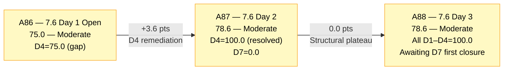
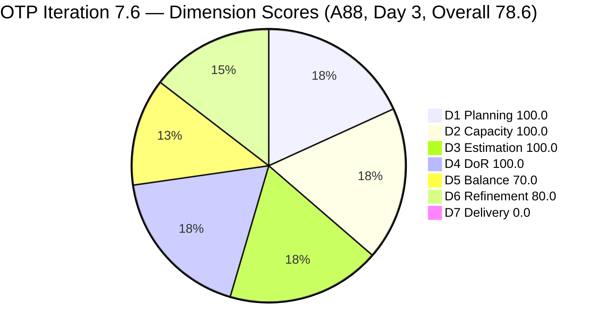
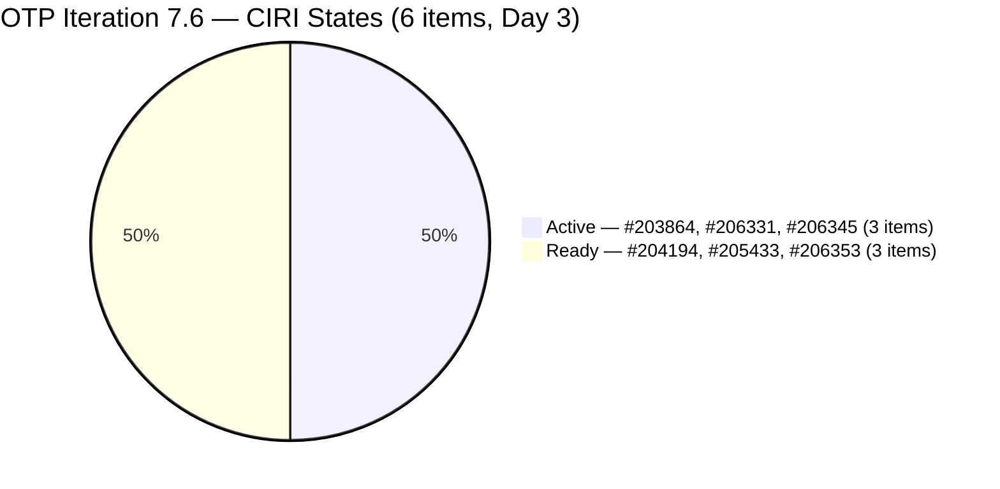
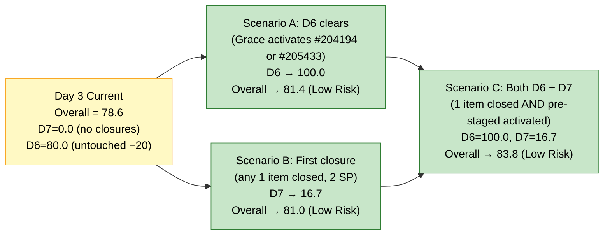
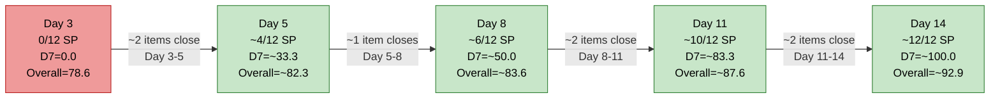

# ADO SAFe Audit — Office of the President (OTP Team)

## 1. Audit Metadata

| Field | Value |
|---|---|
| **Audit Date** | 2026-06-17 09:03 UTC |
| **Sprint Day** | **3 of 14** |
| **Prior Audit** | A87 — `AUDIT_20260616_0206.md` (Overall 78.6, Moderate Risk — 7.6 Day 2) |
| **ADO Project** | OTP (`e7739905-28a3-4ae1-9173-7f6cd13b3494`) |
| **ADO Team** | OTP Team |
| **Iteration** | Iteration 7.6 (`f27d43a8-3edb-46fd-8dd8-65aa5bdcf978`) |
| **Iteration Path** | `OTP\2026 - PI7\Iteration 7.6` |
| **Iteration Dates** | Jun 15, 2026 – Jun 28, 2026 |
| **Workspace Folder** | `ado_otp` |
| **Overall Score** | **78.6 — Moderate Risk** |
| **Risk Band** | Moderate (60–79.9) |
| **Visible Backlog Items (VRBI)** | 6 root items |
| **Current Iteration Root Items (CIRI)** | 6 items (IterationPath = Iteration 7.6) |
| **Capacity** | Grace: 2h/day (Documentation 1h + Requirements 1h) — configured |
| **Project Exception Applied** | Single-assignee model (Grace) — accepted per workspace CLAUDE.md |

---

## 2. Executive Summary

The OTP team enters Day 3 of Iteration 7.6 with an overall score of **78.6 — Moderate Risk**, holding steady from A87 (Day 2 = 78.6). The score is unchanged because no new items were closed and no structural dimension transitions occurred overnight. However, one significant signal has emerged: **#206331 (FTC Submission of Jove's Visa Application) received a ChangedDate update on Jun 17** — confirming Grace is actively working this item on Day 3.

**What held constant:** D1 = 100.0 (CIRI = VRBI = 6), D2 = 100.0 (Grace configured), D3 = 100.0 (6/6 estimated at 2 SP), D4 = 100.0 (6/6 DoR-compliant). All four performance dimensions remain at maximum.

**What has not yet changed:** D5 = 70.0 (structural — User Story dominance at 83.3% — will not change this sprint without adding a new type). D6 = 80.0 — the two pre-staged items (#204194, #205433) still have ChangedDate before Jun 15, keeping the untouched ratio at 33.3% (above the 30% threshold). D7 = 0.0 — no closures yet on Day 3, which is still within normal execution cadence.

**Day 3 outlook:** Grace's Iteration 7.5 velocity (~1 item closed per 1.5 days) projects the first closure by Day 3–4 (today or tomorrow, Jun 17–18). If #203864 or #206345 closes today, D7 will credit 2/12 SP = 16.7. The score ceiling breaks into Low Risk territory when D6 clears (Grace activates either pre-staged item) or D7 reaches 8/12 SP.

---

## 3. Previous Audit Delta (A87 → A88)

| Dimension | A87 Score (7.6 Day 2) | A88 Score (7.6 Day 3) | Delta | Driver |
|---|---|---|---|---|
| D1 Iteration Planning | 100.0 | **100.0** | 0.0 | CIRI = 6 / VRBI = 6. No new items added, no closures. Stable. |
| D2 Team Capacity | 100.0 | **100.0** | 0.0 | Grace: 2h/day configured. 1/1 contributor. No change. |
| D3 Estimation | 100.0 | **100.0** | 0.0 | All 6 CIRI items at 2 SP. CSP = 12 SP. No change. |
| D4 DoR Compliance | 100.0 | **100.0** | 0.0 | 6/6 items pass Desc + AC thresholds. No regressions. |
| D5 Work Item Balance | 70.0 | **70.0** | 0.0 | US = 5/6 = 83.3% > 60% → −30. Structural. No change this sprint. |
| D6 Backlog Refinement | 80.0 | **80.0** | 0.0 | 2/6 untouched (#204194 Jun 9, #205433 Jun 7) = 33.3% > 30% → −20 persists. |
| D7 Delivery Predictability | 0.0 | **0.0** | 0.0 | Day 3 — no closures yet. CSP = 12 SP. Early-sprint annotated. |
| **Overall** | **78.6** | **78.6** | **0.0** | Score held. All structural maxima maintained. Execution progressing but no closures to credit yet. |

**Formula verification:** (100.0 + 100.0 + 100.0 + 100.0 + 70.0 + 80.0 + 0.0) / 7 = 550.0 / 7 = **78.6**

**Key observations A87 → A88:**
- **#206331 updated Jun 17.** The FTC Submission of Jove's Visa Application now carries a ChangedDate of Jun 17, confirming Grace is actively engaging with this item on Day 3. A comment was added (commentVersionRef present).
- **No new items added.** VRBI and CIRI remain at 6. The pull-in queue has not been tapped yet, which is normal at Day 3 — Grace's velocity will determine when next pull-in is needed.
- **Two pre-staged items remain untouched.** #204194 (Philgeps, Jun 9) and #205433 (Pre-Filing, Jun 7) have not been activated in 7.6. The untouched penalty persists but is one state-change away from clearing.
- **Score is at its structural plateau.** With D5 fixed at 70.0 and D7 = 0.0, the only movements possible today are: D6 → 100.0 (Grace activates a pre-staged item) or D7 > 0.0 (first closure). Either event would push Overall above 78.6.

---

## 4. Current Iteration Snapshot

| Metric | Value |
|---|---|
| **Visible Backlog Items (VRBI)** | 6 |
| **Current Iteration Root Items (CIRI)** | 6 (all in IterationPath = `OTP\2026 - PI7\Iteration 7.6`) |
| **Non-current items** | 0 |
| **Story Points Committed (CSP)** | 12 SP (6 × 2 SP) |
| **Story Points Closed (CLSP)** | 0 SP (no items in Closed/Done state) |
| **Sprint Day / Total** | **3 / 14** |
| **Team Size (distinct CIRI assignees)** | 1 (Grace — all 6 items) |
| **Total Sprint Capacity** | 2h/day × 14 days = 28.0 hours |
| **Iteration Start / Finish** | Jun 15, 2026 – Jun 28, 2026 |

**CIRI State Distribution (Day 3):**

| ID | Title | Type | State | SP | Assignee | ChangedDate | DoR |
|---|---|---|---|---|---|---|---|
| #203864 | Release and collect of TCT | User Story | Active | 2 | Grace | Jun 16 | Pass |
| #204194 | Philgeps Online Submission | User Story | Ready | 2 | Grace | Jun 9 | Pass |
| #205433 | Execute Pre-Filing Regulatory Compliance | User Story | Ready | 2 | Grace | Jun 7 | Pass |
| #206331 | FTC Submission of Jove's Visa Application | User Story | Active | 2 | Grace | **Jun 17** | Pass |
| #206345 | TESDA Exploration | Spike | Active | 2 | Grace | Jun 16 | Pass |
| #206353 | Meeting with Chippens-Charles | User Story | Ready | 2 | Grace | Jun 15 | Pass |

---

## 5. Work Item Analysis

### DoR Assessment (6 CIRI items)

| ID | Title | Desc ≥ 30 NWS chars | AC ≥ 20 NWS chars | Result |
|---|---|---|---|---|
| #203864 | Release and collect of TCT | ✓ (~75 NWS chars) | ✓ (3 ACs, ~120 NWS chars) | **Pass** |
| #204194 | Philgeps Online Submission | ✓ (~95 NWS chars) | ✓ (~36 NWS chars) | **Pass** |
| #205433 | Execute Pre-Filing Regulatory Compliance | ✓ (~350 NWS chars, BDD) | ✓ (~450 NWS chars, 2 BDD scenarios) | **Pass** |
| #206331 | FTC Submission of Jove's Visa Application | ✓ (~180 NWS chars, BDD) | ✓ (2 BDD scenarios, ~250 NWS chars) | **Pass** |
| #206345 | TESDA Exploration | ✓ (~200 NWS chars, BDD) | ✓ (2 BDD scenarios, ~280 NWS chars) | **Pass** |
| #206353 | Meeting with Chippens-Charles | ✓ (~200 NWS chars, BDD) | ✓ (2 BDD scenarios, ~280 NWS chars) | **Pass** |

**Pass: 6/6. D4 = 100.0**

### Type Distribution (6 CIRI items)

| Type | Count | Share | D5 Impact |
|---|---|---|---|
| User Story | 5 | 83.3% | Dominant type — >60% → −30 penalty |
| Spike | 1 | 16.7% | Spike share < 40% — no spike penalty |
| **Total** | **6** | **100%** | D5 = max(0, 100 − 30) = **70.0** |

User Stories present (no −40 absence penalty). Spike below 40% (no −20 spike penalty). US dominance at 83.3% triggers −30.

### Story Points Analysis

| ID | Title | Type | SP | State |
|---|---|---|---|---|
| #203864 | Release and collect of TCT | User Story | 2 | Active |
| #204194 | Philgeps Online Submission | User Story | 2 | Ready |
| #205433 | Execute Pre-Filing Regulatory Compliance | User Story | 2 | Ready |
| #206331 | FTC Submission of Jove's Visa Application | User Story | 2 | Active |
| #206345 | TESDA Exploration | Spike | 2 | Active |
| #206353 | Meeting with Chippens-Charles | User Story | 2 | Ready |

**CSP = 12 SP. CLSP = 0 SP.** All items uniformly estimated at 2 SP. No Closed or Done state items yet.

---

## 6. SAFe Compliance Scorecard

| Dimension | Score | Band | Evidence | Notes |
|---|---|---|---|---|
| D1 Iteration Planning | **100.0** | Low | 6 CIRI / 6 VRBI | All 6 backlog items assigned to Iteration 7.6. CIRI = VRBI. Pull-in buffer not yet needed. |
| D2 Team Capacity | **100.0** | Low | 1/1 contributor with capacity | Grace: 2h/day (Doc 1h + Req 1h) configured for 7.6. Single-assignee model accepted. |
| D3 Estimation | **100.0** | Low | 6/6 ECI with SP > 0 | All 6 CIRI items at 2 SP. CSP = 12 SP. Consistent sizing discipline maintained. |
| D4 DoR Compliance | **100.0** | Low | 6 DCI / 6 CIRI | All 6 items pass Desc + AC thresholds. BDD format prevalent. No regressions. |
| D5 Work Item Balance | **70.0** | Moderate | US=5/6=83.3% → −30 | US presence ✓. Spike present but US dominance persists at 83.3%. Structural sprint constraint. |
| D6 Backlog Refinement | **80.0** | Low | 6/6 fresh; 2/6 untouched (33.3% > 30%) | Zero stale debt. Pre-staged items #204194, #205433 not yet touched in 7.6. −20 penalty. |
| D7 Delivery Predictability | **0.0** | Critical | 0 SP closed / 12 SP committed | Day 3 — no closures yet. **Early-sprint — low delivery expected.** CSP = 12 SP. |
| **OVERALL** | **78.6** | **Moderate** | (100+100+100+100+70+80+0)/7 | Score held flat from A87. Structural maxima maintained. First closure will move D7. |

**Formula verification:** (100.0 + 100.0 + 100.0 + 100.0 + 70.0 + 80.0 + 0.0) / 7 = 550.0 / 7 = **78.6**

---

## 7. Dimension Findings

### D1 — Iteration Planning: 100.0 / 100 — Low Risk

**Formula:** CIRI / VRBI × 100 = 6 / 6 × 100 = **100.0**

| Metric | Value |
|---|---|
| Visible root backlog items (VRBI) | 6 |
| Items in Iteration 7.6 (CIRI) | 6 |
| Non-current items | 0 |
| Score | **100.0** |

All 6 items remain assigned to Iteration 7.6 at Day 3. No items have been closed yet. The D1 = 100.0 discipline set on Day 1 is holding. However, with 3 items in Active state, first closures are imminent — the pull-in queue must be ready to replenish CIRI when closures occur.

**Pull-in readiness check:** No candidate items were explicitly added to the pull-in queue in A87. The A87 recommendation was to identify 2–3 candidates now. With Day 3 underway and closures projected by Day 3–4, this action should occur today.

---

### D2 — Team Capacity: 100.0 / 100 — Low Risk

**Formula:** CC / CW × 100 = 1 / 1 × 100 = **100.0**

Grace is the sole assignee across all 6 CIRI items. Capacity = 2h/day (1h Documentation + 1h Requirements) for Iteration 7.6. Total available capacity = 28 hours. With 12 SP committed and Grace's PI7 velocity establishing the pattern of full sprint delivery, capacity is well within bounds.

Single-assignee model accepted per Project Exception. Structural risk (Grace unavailability = zero velocity) is noted but not scored.

---

### D3 — Estimation: 100.0 / 100 — Low Risk

**Formula:** ECI / PECI × 100 = 6 / 6 × 100 = **100.0**

All 6 CIRI items carry 2 SP each. CSP = 12 SP. The uniform 2 SP sizing has been a consistent discipline across all OTP PI7 iterations. Estimation is fully established.

---

### D4 — DoR Compliance: 100.0 / 100 — Low Risk

**Formula:** DCI / CIRI × 100 = 6 / 6 × 100 = **100.0**

All 6 CIRI items maintain DoR compliance established in A87. No regressions on Day 3. The DoR remediation discipline executed on Day 2 (A87) — where #206331 was fixed within 24 hours of the first flag — represents a strong team process. All new items created in this sprint were DoR-compliant from creation.

---

### D5 — Work Item Balance: 70.0 / 100 — Moderate Risk

**Formula:** Base 100 − penalties

| Penalty | Trigger | Applied |
|---|---|---|
| −40: No User Story in CIRI | 5 User Stories present | **No** |
| −30: Dominant type share > 60% | US = 5/6 = **83.3%** > 60% | **YES** |
| −20: Spike share > 40% | Spike = 1/6 = 16.7% | **No** |

**Score:** max(0, 100 − 30) = **70.0**

D5 = 70.0 is the structural ceiling for this sprint's CIRI composition. OTP's mandate (compliance tasks, filings, meetings, executive actions) naturally generates User Story-type items. The addition of #206345 (TESDA Spike) on Day 1 was the practical diversity lever — adding a second non-US item would require a specific enabler or research task in the backlog.

**No change expected this sprint unless a new non-US type item is added to CIRI.** For PI8 planning: maintaining US < 60% of CIRI (i.e., max 3 US items in a 6-item sprint) would eliminate the −30 penalty.

---

### D6 — Backlog Refinement: 80.0 / 100 — Low Risk

**Freshness window:** ChangedDate ≥ 2026-05-03 (45 days before 2026-06-17)

| Metric | Value |
|---|---|
| Total VRBI | 6 |
| Fresh items (ChangedDate ≥ May 3, 2026) | 6 — all items changed Jun 7–17 |
| Stale_90 items (ChangedDate < Mar 19, 2026) | 0 |
| Stale_180 items (ChangedDate < Dec 20, 2025) | 0 |
| Untouched CIRI (ChangedDate < Jun 15, 2026) | 2 (#204194 Jun 9, #205433 Jun 7) |

**Base = 6/6 × 100 = 100.0**
**Penalties:**
- Stale_90: 0/6 = 0% → No penalty
- Stale_180: 0 items → No penalty
- Untouched CIRI: 2/6 = 33.3% > 30% → **−20 penalty**

**Score: max(0, 100.0 − 20) = 80.0**

The untouched ratio remains 33.3% — marginally above the 30% threshold. #204194 (Ready since Jun 9) and #205433 (Ready since Jun 7) have not been touched in 7.6. If Grace transitions either to Active today, the untouched count drops to 1/6 = 16.7% (below 30%), eliminating the −20 penalty. D6 would then reach 100.0 and Overall would advance to 81.4 — the first Low Risk score for OTP in PI7.

---

### D7 — Delivery Predictability: 0.0 / 100 — Critical

**Formula:** CLSP / CSP × 100 = 0 / 12 × 100 = **0.0**

| Metric | Value |
|---|---|
| Estimated current items (ECI) | 6 (all 2 SP) |
| Committed Story Points (CSP) | 12 SP |
| Closed Story Points (CLSP) | 0 SP |
| Score | **0.0** |

**Early-sprint annotation:** Day 3 of Iteration 7.6. Three items are in Active state (#203864, #206331, #206345). Grace has been actively working since Day 2. D7 = 0.0 is at the edge of early-sprint tolerance — first closure is expected today or Day 4.

**D7 trajectory watch:**
- First closure (any 1 item, 2 SP): D7 = 2/12 = 16.7, Overall → (550 + 16.7) / 7 = 81.0 — **Low Risk threshold crossed**
- 3 closures (6 SP): D7 = 6/12 = 50.0, Overall → 83.3
- Full delivery (12 SP): D7 = 100.0, Overall → 92.9

The first item closure will simultaneously push D7 > 0.0 AND push Overall above 80.0 into Low Risk territory — given D1/D2/D3/D4 are all 100.0 and D6 = 80.0.

---

## 8. Risks and Bottlenecks

| # | Severity | Dimension | Risk | Recommended Action |
|---|---|---|---|---|
| R1 | **MEDIUM** | D7 | Day 3 with 0 closures. Three items Active (#203864, #206331, #206345). Normal cadence, but closure is expected today or Day 4. Any delay signals execution drift. | Monitor: if no closure by Day 4 end, investigate. Grace's PI7 velocity supports a Day 3–4 first closure. |
| R2 | **MEDIUM** | D1 | With 3 items Active and closures imminent, CIRI will begin to shrink unless pull-in items are ready. The pull-in buffer has not yet been populated. | **Identify 2–3 DoR-ready candidate items for pull-in before Day 5.** When CIRI drops to ≤ 3 items, immediately add new items to maintain D1 = 100.0. |
| R3 | **LOW** | D6 | Untouched ratio = 33.3% — marginally above 30% threshold. One item activation eliminates the −20 penalty. | No immediate action needed — Grace will naturally activate #204194 or #205433 as she works through the sprint. Monitor. |
| R4 | **LOW** | D5 (structural) | US = 83.3%. D5 ceiling = 70.0. Structural to this sprint. | No in-sprint remedy. PI8 recommendation: plan for ≥ 2 non-US items in CIRI at planning time. |

---

## 9. Prioritized Recommendations

1. **[TODAY — HIGH IMPACT]** Grace: if next item pick-up is flexible, choose #204194 (Philgeps Online Submission, Ready) or #205433 (Pre-Filing Regulatory, Ready). Either transition to Active drops the D6 untouched ratio from 33.3% to 16.7%, eliminating the −20 penalty. D6 → 100.0, Overall → 81.4 (Low Risk). This is the highest-leverage in-sprint action remaining.

2. **[TODAY — PROACTIVE]** Identify 2–3 candidate items for Iteration 7.6 pull-in before first closure occurs. Items should be DoR-ready (Desc ≥ 30 NWS chars, AC ≥ 20 NWS chars, SP assigned). The pull-in queue failure pattern from PI7 earlier sprints was: Grace closes items faster than new items are pulled in, collapsing D1. Prevent this now.

3. **[DAY 3–4 — MONITOR]** First closure watch: Active items (#203864 — TCT release, #206331 — Visa submission, #206345 — TESDA Spike) are the most likely candidates. First closure by Day 4 keeps the sprint on track with Grace's established velocity. Closing any 1 item pushes Overall from 78.6 to 81.0 (Low Risk).

4. **[PI8 PLANNING]** D5 structural improvement: OTP's mandate will continue to generate User Story-type work. For PI8, if any enabler, research, or infrastructure items exist, add at least 2 non-US items per sprint to hold US < 60% of CIRI. This eliminates the −30 penalty and lifts the D5 ceiling from 70.0 to 100.0.

5. **[SUSTAINED]** Continue the "DoR at creation" discipline that has produced 6/6 DoR-compliant items through Day 3. New pull-in items should have Desc and AC populated before they are assigned to the iteration.

---

## 10. Evidence Gaps and Limitations

| Gap | Impact | Notes |
|---|---|---|
| **D7 = 0.0 — Day 3 structural** | Does not reflect execution quality | Three items are in Active state. Grace is executing. First closure expected Day 3–4. D7 will improve when first item transitions to Closed/Done. |
| **D6 Untouched penalty — near-threshold** | −20 penalty (80.0 vs 100.0) | 2/6 = 33.3% — marginally above the 30% threshold. Self-resolves when Grace activates #204194 or #205433. |
| **SP uniformity (all 2 SP)** | Minor sizing concern | Uniform 2 SP across all items may indicate default sizing rather than relative effort assessment. Not a scoring failure. Consider relative sizing for PI8 planning. |
| **Single-assignee structural constraint** | D2 structural note | Grace is the only contributor. Model accepted per Project Exception. Any unavailability = zero sprint velocity. |
| **Pull-in buffer not yet populated** | D1 risk if closures occur | No candidate items have been identified for pull-in. With 3 Active items and closures imminent, this gap should be addressed today. |

---

## 11. Visualizations

### Score Trajectory — A86 → A87 → A88

### Dimension Scores — A88 (Day 3, Overall 78.6)

### CIRI State Distribution — Day 3

### Score Ceiling Scenarios

### D7 Delivery Projection — Based on PI7 Velocity

*Projection based on Grace's PI7 iteration velocity (~9 items closed in 14-day sprint). Actual results may vary.*

---

## 12. Audit Trail

| Source | Tool | Data |
|---|---|---|
| Current iteration | `work_list_team_iterations` (project `e7739905`, team `OTP Team`, timeframe=current) | Iteration 7.6: Jun 15–28, 2026; ID `f27d43a8-3edb-46fd-8dd8-65aa5bdcf978` |
| Backlog items | `wit_list_backlog_work_items` (project `e7739905`, team `OTP Team`, backlogId `Microsoft.RequirementCategory`) | 6 root items: #203864, #204194, #205433, #206331, #206345, #206353 |
| Work item details | `wit_get_work_item` (individual fetches for all 6 IDs) | SP, State, Type, Desc, AC, ChangedDate, IterationPath, AssignedTo confirmed for all 6 items |
| Team capacity | `work_get_team_capacity` (project `e7739905`, iterationId `f27d43a8`) | Grace: 2h/day (Doc 1h + Req 1h); 0 days off |
| Prior audit | `AUDIT_20260616_0206.md` (A87) | Overall 78.6, Moderate Risk, 7.6 Day 2, 6 VRBI, 6 CIRI, 12 SP committed, 0 SP closed |
