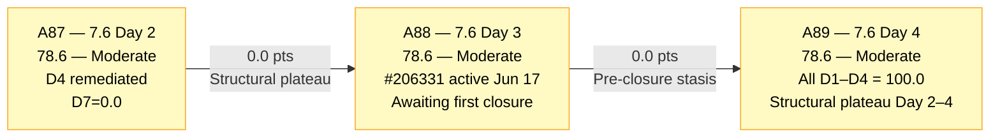
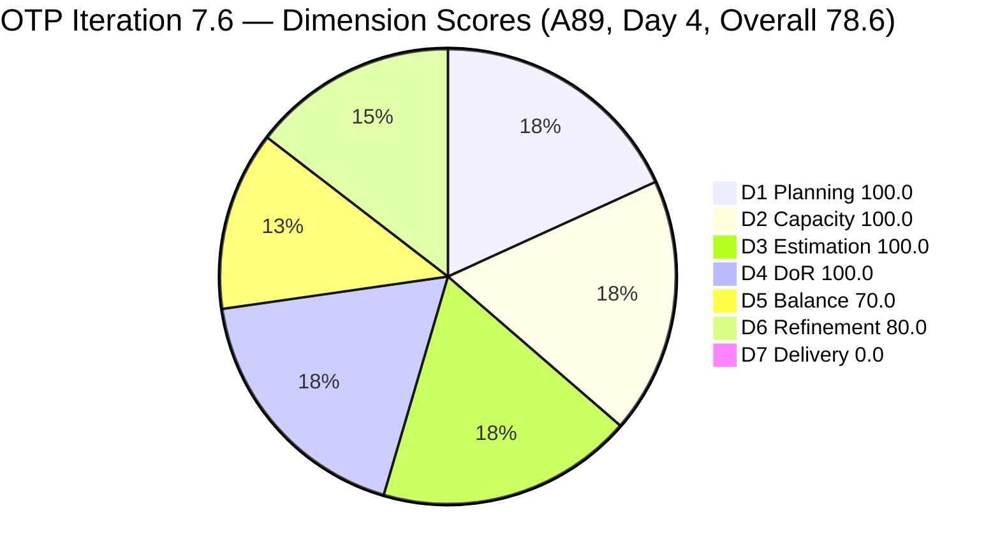
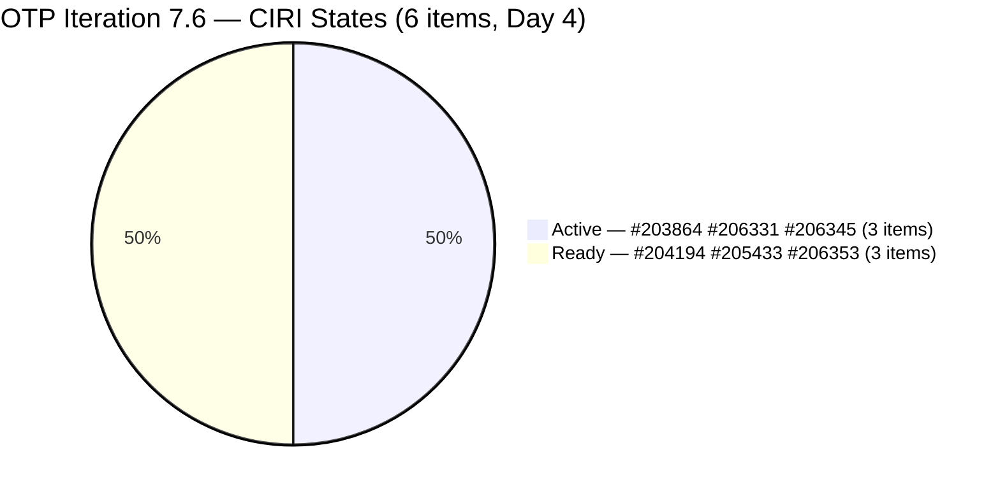
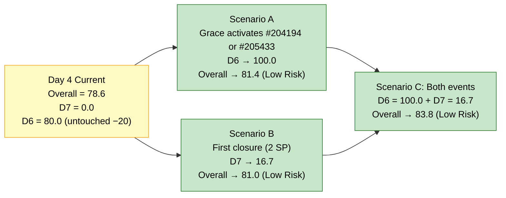
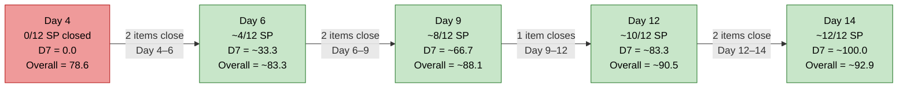

# ADO SAFe Audit — Office of the President (OTP Team)

## 1. Audit Metadata

| Field | Value |
|---|---|
| **Audit Date** | 2026-06-18 09:02 UTC |
| **Sprint Day** | **4 of 14** |
| **Prior Audit** | A88 — `AUDIT_20260617_0903.md` (Overall 78.6, Moderate Risk — 7.6 Day 3) |
| **ADO Project** | OTP (`e7739905-28a3-4ae1-9173-7f6cd13b3494`) |
| **ADO Team** | OTP Team |
| **Iteration** | Iteration 7.6 (`f27d43a8-3edb-46fd-8dd8-65aa5bdcf978`) |
| **Iteration Path** | `OTP\2026 - PI7\Iteration 7.6` |
| **Iteration Dates** | Jun 15, 2026 – Jun 28, 2026 |
| **Workspace Folder** | `ado_otp` |
| **Overall Score** | **78.6 — Moderate Risk** |
| **Risk Band** | Moderate (60–79.9) |
| **Visible Backlog Items (VRBI)** | 6 root items |
| **Current Iteration Root Items (CIRI)** | 6 items (IterationPath = Iteration 7.6) |
| **Capacity** | Grace: 2h/day (Documentation 1h + Requirements 1h) — configured |
| **Project Exception Applied** | Single-assignee model (Grace) — accepted per workspace CLAUDE.md |

---

## 2. Executive Summary

The OTP team enters Day 4 of Iteration 7.6 with an overall score of **78.6 — Moderate Risk**, unchanged from A88 (Day 3 = 78.6). No new closures have been recorded overnight. The score remains at its structural plateau: D1–D4 are all at maximum, D5 is fixed at 70.0 due to User Story dominance, D6 holds at 80.0 due to two pre-staged items still untouched in 7.6, and D7 = 0.0 awaiting the first closure.

**What has not changed:** The six CIRI items remain in their same states — Active (#203864, #206331, #206345) and Ready (#204194, #205433, #206353). No ChangedDate updates were detected beyond what was recorded in A88. Grace was active on #206331 as recently as Jun 17; #203864 was last touched Jun 16; and #206345 Jun 16.

**Day 4 signal:** With three items in Active state and Grace's established PI7 velocity of approximately one item per 1.5 days, Day 4 is the primary closure threshold. A88 projected first closure by Day 3–4. Absence of a closure through Day 4 end would be a mild drift signal worth monitoring.

**Score path:** The first closure of any 2 SP item will push D7 to 16.7 and Overall from 78.6 to 81.0 — crossing the Low Risk threshold. Simultaneously activating either #204194 or #205433 (both Ready, ChangedDate before iteration start) would eliminate the D6 −20 untouched penalty, pushing Overall independently to 81.4. Both events together would yield 83.8.

---

## 3. Previous Audit Delta (A88 → A89)

| Dimension | A88 Score (7.6 Day 3) | A89 Score (7.6 Day 4) | Delta | Driver |
|---|---|---|---|---|
| D1 Iteration Planning | 100.0 | **100.0** | 0.0 | CIRI = 6 / VRBI = 6. No new items, no closures. Stable. |
| D2 Team Capacity | 100.0 | **100.0** | 0.0 | Grace: 2h/day configured. 1/1 contributor. No change. |
| D3 Estimation | 100.0 | **100.0** | 0.0 | All 6 CIRI items at 2 SP. CSP = 12 SP. No change. |
| D4 DoR Compliance | 100.0 | **100.0** | 0.0 | 6/6 items pass Desc + AC thresholds. No regressions. |
| D5 Work Item Balance | 70.0 | **70.0** | 0.0 | US = 5/6 = 83.3% > 60% → −30. Structural ceiling for this sprint. |
| D6 Backlog Refinement | 80.0 | **80.0** | 0.0 | 2/6 untouched (#204194 Jun 9, #205433 Jun 7) = 33.3% > 30% → −20 persists. |
| D7 Delivery Predictability | 0.0 | **0.0** | 0.0 | Day 4 — no closures yet. CSP = 12 SP. **Early-sprint (Day ≤ 5)**. |
| **Overall** | **78.6** | **78.6** | **0.0** | Second consecutive day at structural plateau. All maxima maintained. First closure will break the stasis. |

**Formula verification:** (100.0 + 100.0 + 100.0 + 100.0 + 70.0 + 80.0 + 0.0) / 7 = 550.0 / 7 = **78.6**

**Key observations A88 → A89:**
- **No new ChangedDate updates detected.** All six items carry the same ChangedDates as A88 — Jun 7 (#205433), Jun 9 (#204194), Jun 15 (#206353), Jun 16 (#203864, #206345), Jun 17 (#206331).
- **No closures.** Zero items transitioned to Closed or Done state between Jun 17 and Jun 18 audit window.
- **D6 untouched penalty persists.** #204194 (Philgeps, Ready, Jun 9) and #205433 (Pre-Filing, Ready, Jun 7) have not been activated in 7.6 for four consecutive days. The untouched ratio remains at 33.3%.
- **Score structurally stable.** The score of 78.6 has held across A87, A88, and now A89. This is the sprint's pre-closure plateau — all dimensions are at their fixed values pending execution events (a closure or a pre-staged item activation).

---

## 4. Current Iteration Snapshot

| Metric | Value |
|---|---|
| **Visible Backlog Items (VRBI)** | 6 |
| **Current Iteration Root Items (CIRI)** | 6 (all in IterationPath = `OTP\2026 - PI7\Iteration 7.6`) |
| **Non-current items** | 0 |
| **Story Points Committed (CSP)** | 12 SP (6 × 2 SP) |
| **Story Points Closed (CLSP)** | 0 SP (no items in Closed or Done state) |
| **Sprint Day / Total** | **4 / 14** |
| **Team Size (distinct CIRI assignees)** | 1 (Grace — all 6 items) |
| **Total Sprint Capacity** | 2h/day × 14 days = 28.0 hours |
| **Iteration Start / Finish** | Jun 15, 2026 – Jun 28, 2026 |

**CIRI State Distribution (Day 4):**

| ID | Title | Type | State | SP | Assignee | ChangedDate | DoR |
|---|---|---|---|---|---|---|---|
| #203864 | Release and collect of TCT | User Story | Active | 2 | Grace | Jun 16 | Pass |
| #204194 | Philgeps Online Submission | User Story | Ready | 2 | Grace | Jun 9 | Pass |
| #205433 | Execute Pre-Filing Regulatory Compliance | User Story | Ready | 2 | Grace | Jun 7 | Pass |
| #206331 | FTC Submission of Jove's Visa Application | User Story | Active | 2 | Grace | Jun 17 | Pass |
| #206345 | TESDA Exploration | Spike | Active | 2 | Grace | Jun 16 | Pass |
| #206353 | Meeting with Chippens-Charles | User Story | Ready | 2 | Grace | Jun 15 | Pass |

---

## 5. Work Item Analysis

### DoR Assessment (6 CIRI items)

| ID | Title | Desc ≥ 30 NWS chars | AC ≥ 20 NWS chars | Result |
|---|---|---|---|---|
| #203864 | Release and collect of TCT | ✓ (~75 NWS chars) | ✓ (3 ACs, ~120 NWS chars) | **Pass** |
| #204194 | Philgeps Online Submission | ✓ (~95 NWS chars) | ✓ (~36 NWS chars) | **Pass** |
| #205433 | Execute Pre-Filing Regulatory Compliance | ✓ (~350 NWS chars, BDD) | ✓ (~450 NWS chars, 2 BDD scenarios) | **Pass** |
| #206331 | FTC Submission of Jove's Visa Application | ✓ (~180 NWS chars, BDD) | ✓ (2 BDD scenarios, ~250 NWS chars) | **Pass** |
| #206345 | TESDA Exploration | ✓ (~200 NWS chars, BDD) | ✓ (2 BDD scenarios, ~280 NWS chars) | **Pass** |
| #206353 | Meeting with Chippens-Charles | ✓ (~200 NWS chars, BDD) | ✓ (2 BDD scenarios, ~280 NWS chars) | **Pass** |

**Pass: 6/6. D4 = 100.0. No regressions on Day 4.**

### Type Distribution (6 CIRI items)

| Type | Count | Share | D5 Impact |
|---|---|---|---|
| User Story | 5 | 83.3% | Dominant type — >60% → −30 penalty applied |
| Spike | 1 | 16.7% | Spike share < 40% — no spike penalty |
| **Total** | **6** | **100%** | D5 = max(0, 100 − 30) = **70.0** |

User Stories present (no −40 absence penalty). Spike below 40% (no −20 spike penalty). US dominance at 83.3% triggers −30. D5 = 70.0 is the structural ceiling for this sprint's composition.

### Story Points Analysis

| ID | Title | Type | SP | State |
|---|---|---|---|---|
| #203864 | Release and collect of TCT | User Story | 2 | Active |
| #204194 | Philgeps Online Submission | User Story | 2 | Ready |
| #205433 | Execute Pre-Filing Regulatory Compliance | User Story | 2 | Ready |
| #206331 | FTC Submission of Jove's Visa Application | User Story | 2 | Active |
| #206345 | TESDA Exploration | Spike | 2 | Active |
| #206353 | Meeting with Chippens-Charles | User Story | 2 | Ready |

**CSP = 12 SP. CLSP = 0 SP.** All items uniformly estimated at 2 SP. No Closed or Done state items on Day 4.

---

## 6. SAFe Compliance Scorecard

| Dimension | Score | Band | Evidence | Notes |
|---|---|---|---|---|
| D1 Iteration Planning | **100.0** | Low | 6 CIRI / 6 VRBI | All 6 backlog items assigned to Iteration 7.6. CIRI = VRBI. Stable. |
| D2 Team Capacity | **100.0** | Low | 1/1 contributor with capacity | Grace: 2h/day (Doc 1h + Req 1h) configured. Single-assignee model accepted. |
| D3 Estimation | **100.0** | Low | 6/6 ECI with SP > 0 | All 6 CIRI items at 2 SP. CSP = 12 SP. Consistent sizing. |
| D4 DoR Compliance | **100.0** | Low | 6 DCI / 6 CIRI | All 6 items pass Desc + AC thresholds. BDD format prevalent. No regressions. |
| D5 Work Item Balance | **70.0** | Moderate | US=5/6=83.3% → −30 | US presence ✓. Spike present. US dominance 83.3% structural for this sprint. |
| D6 Backlog Refinement | **80.0** | Low | 6/6 fresh; 2/6 untouched (33.3% > 30%) | Zero stale debt. #204194 (Jun 9), #205433 (Jun 7) not activated in 7.6. −20 penalty. |
| D7 Delivery Predictability | **0.0** | Critical | 0 SP closed / 12 SP committed | Day 4 — no closures yet. **Early-sprint (Day ≤ 5).** Closure imminent. |
| **OVERALL** | **78.6** | **Moderate** | (100+100+100+100+70+80+0)/7 | Third consecutive day at 78.6. Structural plateau. Awaiting first closure or D6 activation event. |

**Formula verification:** (100.0 + 100.0 + 100.0 + 100.0 + 70.0 + 80.0 + 0.0) / 7 = 550.0 / 7 = **78.6**

---

## 7. Dimension Findings

### D1 — Iteration Planning: 100.0 / 100 — Low Risk

**Formula:** CIRI / VRBI × 100 = 6 / 6 × 100 = **100.0**

| Metric | Value |
|---|---|
| Visible root backlog items (VRBI) | 6 |
| Items in Iteration 7.6 (CIRI) | 6 |
| Non-current items | 0 |
| Score | **100.0** |

All 6 items remain in Iteration 7.6. D1 = 100.0 discipline is holding. With three items in Active state and closures imminent, the pull-in buffer should be populated now — before CIRI begins to shrink. The A88 recommendation to identify 2–3 pull-in candidates by Day 4 remains open.

---

### D2 — Team Capacity: 100.0 / 100 — Low Risk

**Formula:** CC / CW × 100 = 1 / 1 × 100 = **100.0**

Grace is the sole assignee across all 6 CIRI items. Capacity = 2h/day (Documentation 1h + Requirements 1h). Total available remaining capacity = approximately 20 hours (Day 4 of 14). With 12 SP committed and Grace's demonstrated PI7 velocity, capacity is adequate for full sprint delivery.

Single-assignee model accepted per Project Exception. Any Grace unavailability equals zero sprint velocity — structural risk noted but not scored.

---

### D3 — Estimation: 100.0 / 100 — Low Risk

**Formula:** ECI / PECI × 100 = 6 / 6 × 100 = **100.0**

All 6 CIRI items carry 2 SP. CSP = 12 SP. Uniform 2 SP sizing has been consistent across all OTP PI7 iterations. No unestimated items.

---

### D4 — DoR Compliance: 100.0 / 100 — Low Risk

**Formula:** DCI / CIRI × 100 = 6 / 6 × 100 = **100.0**

All 6 CIRI items maintain DoR compliance through Day 4. No regressions. The "DoR at creation" discipline established in PI7 earlier sprints continues to hold. All six items carry substantive Descriptions and Acceptance Criteria meeting the minimum thresholds.

---

### D5 — Work Item Balance: 70.0 / 100 — Moderate Risk

**Formula:** Base 100 − penalties

| Penalty | Trigger | Applied |
|---|---|---|
| −40: No User Story in CIRI | 5 User Stories present | **No** |
| −30: Dominant type share > 60% | US = 5/6 = **83.3%** > 60% | **YES** |
| −20: Spike share > 40% | Spike = 1/6 = 16.7% | **No** |

**Score:** max(0, 100 − 30) = **70.0**

D5 = 70.0 is the structural ceiling for this sprint. No change is possible without adding a new non-US type item to CIRI. OTP's mandate (compliance, filings, executive actions) naturally generates User Story work — this is an understood constraint. Actionable improvement is a PI8 planning lever.

---

### D6 — Backlog Refinement: 80.0 / 100 — Low Risk

**Freshness window:** ChangedDate ≥ 2026-05-04 (45 days before 2026-06-18)

| Metric | Value |
|---|---|
| Total VRBI | 6 |
| Fresh items (ChangedDate ≥ May 4, 2026) | 6 — all items changed Jun 7–17 |
| Stale_90 items (ChangedDate < Mar 20, 2026) | 0 |
| Stale_180 items (ChangedDate < Dec 20, 2025) | 0 |
| Untouched CIRI (ChangedDate < Jun 15, 2026 — iteration start) | 2 (#204194 Jun 9, #205433 Jun 7) |

**Base = 6/6 × 100 = 100.0**
**Penalties:**
- Stale_90: 0/6 = 0% → No penalty
- Stale_180: 0 items → No penalty
- Untouched CIRI: 2/6 = 33.3% > 30% → **−20 penalty**

**Score: max(0, 100.0 − 20) = 80.0**

The untouched penalty has persisted across Days 1–4. #204194 (Ready, Philgeps) was last changed Jun 9 — six days before the iteration opened, and now nine days ago. #205433 (Ready, Pre-Filing) was last changed Jun 7 — eleven days ago. Both are in Ready state, meaning they are theoretically queued but not yet engaged by Grace. Activating either one (any state change) eliminates the −20 penalty and moves D6 to 100.0.

---

### D7 — Delivery Predictability: 0.0 / 100 — Critical

**Formula:** CLSP / CSP × 100 = 0 / 12 × 100 = **0.0**

| Metric | Value |
|---|---|
| Estimated current items (ECI) | 6 (all 2 SP) |
| Committed Story Points (CSP) | 12 SP |
| Closed Story Points (CLSP) | 0 SP |
| Score | **0.0** |

**Early-sprint annotation:** Day 4 of Iteration 7.6. Still within the 5-day early-sprint window. Three items remain in Active state (#203864, #206331, #206345). Grace's last recorded activity was on #206331 on Jun 17.

**Day 4 interpretation:** The A88 projection placed the first closure at Day 3–4. Day 3 passed without a closure. Day 4 is now the primary watch point. Based on Grace's PI7 velocity pattern (approximately one item every 1.5 days), not closing in Day 4 would be the first departure from her established cadence. No action is needed yet — D7 = 0.0 at Day 4 is still within early-sprint tolerance — but the urgency increases with each passing day.

**D7 trajectory watch:**
- First closure (any 1 item, 2 SP): D7 = 2/12 = 16.7, Overall → (550 + 16.7) / 7 = 81.0 — **Low Risk threshold crossed**
- 3 closures (6 SP): D7 = 6/12 = 50.0, Overall → 83.3
- Full delivery (12 SP, 6 items): D7 = 100.0, Overall → 92.9

---

## 8. Risks and Bottlenecks

| # | Severity | Dimension | Risk | Recommended Action |
|---|---|---|---|---|
| R1 | **MEDIUM** | D7 | Day 4 with 0 closures. A88 projected first closure by Day 3–4. Normal cadence still holds, but each day without closure increases execution drift probability. Active items: #203864 (TCT), #206331 (Visa), #206345 (TESDA Spike). | **Monitor today.** If no closure by Day 5 morning, investigate with Grace. Three items in Active state — one should cross the line today. |
| R2 | **MEDIUM** | D1 | Pull-in buffer not yet populated. With closures imminent, CIRI will begin to shrink. Recommended in A87, re-raised in A88, still not actioned. | **Identify 2–3 DoR-ready pull-in candidates today.** When first CIRI item closes, immediately replace it to maintain D1 = 100.0. |
| R3 | **LOW** | D6 | Untouched ratio = 33.3%. #204194 and #205433 have been in Ready state across the entire sprint so far (Days 1–4). One activation eliminates the −20 penalty. | Grace's natural workflow will pick these up. If not activated by Day 6, consider a targeted nudge to sequence them earlier. |
| R4 | **LOW** | D5 (structural) | US = 83.3% dominant. D5 ceiling = 70.0. Sprint-locked structural constraint. | No in-sprint action. PI8 recommendation: plan ≥ 2 non-US items in CIRI at planning time to hold US share < 60%. |

---

## 9. Prioritized Recommendations

1. **[TODAY — HIGHEST IMPACT]** Grace: if work sequencing is flexible, pick up #204194 (Philgeps Online Submission, Ready) or #205433 (Pre-Filing Regulatory, Ready) as the next Active item. Any state transition (Ready → In Progress / Active) on either eliminates the D6 untouched penalty. D6 → 100.0, Overall → 81.4 (Low Risk). This remains the single highest-leverage action not requiring a new closure.

2. **[TODAY — PROACTIVE]** Grace/Ramon: identify 2–3 DoR-ready candidate items for Iteration 7.6 pull-in. Target items should have: Description ≥ 30 NWS chars, Acceptance Criteria ≥ 20 NWS chars, and Story Points assigned before being added to the iteration. Populate the pull-in buffer before the first CIRI closure occurs to prevent D1 degradation.

3. **[DAY 4–5 — MONITOR]** First closure watch: Active items (#203864 TCT release, #206331 Visa submission, #206345 TESDA Spike) are the most likely candidates. First closure of any item pushes Overall from 78.6 to 81.0 (Low Risk). This is the sprint-defining event — all other dimensions are maximized, and D7 is the only lever left below 70.

4. **[PI8 PLANNING]** To structurally improve D5 beyond 70.0: at PI8 iteration planning, ensure CIRI includes at least 2 non-User-Story items (Enablers, Spikes, or other). With ≤ 3 User Stories in a 6-item sprint (50% share), the −30 dominant-type penalty is eliminated and D5 reaches 100.0, adding 4.3 points to Overall.

5. **[SUSTAINED]** Maintain "DoR at creation" discipline for any pull-in items. Current 6/6 DoR compliance is an OTP strength that should not be compromised by rushed pull-ins. New items need Desc + AC + SP populated before being assigned to the iteration.

---

## 10. Evidence Gaps and Limitations

| Gap | Impact | Notes |
|---|---|---|
| **D7 = 0.0 — Day 4, still early-sprint** | Does not reflect execution quality | Three items Active. Grace last recorded active Jun 17. First closure projected imminently. Early-sprint annotation valid through Day 5. |
| **D6 Untouched penalty — persisting 4 days** | −20 penalty (80.0 vs 100.0) | #204194 (9 days unchanged) and #205433 (11 days unchanged) have not been touched since before iteration start. Still self-resolvable. No action required but increasingly worth monitoring. |
| **SP uniformity (all 2 SP)** | Minor sizing concern | Uniform 2 SP across all 6 items may indicate default sizing. Not a DoR failure. Relative sizing (Fibonacci) would improve estimation accuracy for PI8. |
| **Single-assignee model** | D2 structural risk | Grace is the only contributor. Project Exception applies. Zero velocity if Grace is unavailable. |
| **Pull-in buffer not populated** | D1 risk if closures occur | No pull-in candidates identified as of Day 4 morning. This gap should be addressed today before closures begin. |

---

## 11. Visualizations

### Score Trajectory — A87 → A88 → A89

### Dimension Scores — A89 (Day 4, Overall 78.6)

### CIRI State Distribution — Day 4

### Score Ceiling Scenarios from Day 4

### D7 Delivery Projection — Remaining Sprint Days

*Projection based on Grace's PI7 velocity pattern. Actual results may vary.*

---

## 12. Audit Trail

| Source | Tool | Data |
|---|---|---|
| Current iteration | `work_list_team_iterations` (project `e7739905`, team `OTP Team`, timeframe=current) | Iteration 7.6: Jun 15–28, 2026; ID `f27d43a8-3edb-46fd-8dd8-65aa5bdcf978` |
| Backlog items | `wit_list_backlog_work_items` (project `e7739905`, team `OTP Team`, backlogId `Microsoft.RequirementCategory`) | 6 root items: #203864, #204194, #205433, #206331, #206345, #206353 |
| Work item details | `wit_get_work_items_batch_by_ids` (all 6 IDs) | SP, State, Type, Desc, AC, ChangedDate, IterationPath, AssignedTo confirmed for all 6 items |
| Team capacity | `work_get_iteration_capacities` (project `e7739905`, iterationId `f27d43a8`) | Grace: 2h/day; team total 2h/day; 0 days off |
| Prior audit | `AUDIT_20260617_0903.md` (A88) | Overall 78.6, Moderate Risk, 7.6 Day 3, 6 VRBI, 6 CIRI, 12 SP committed, 0 SP closed |
