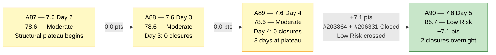
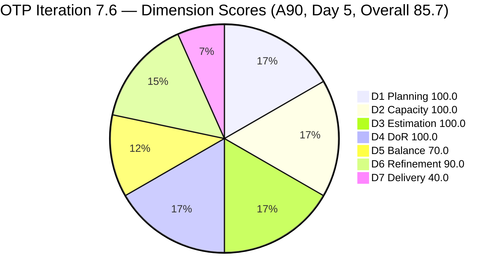
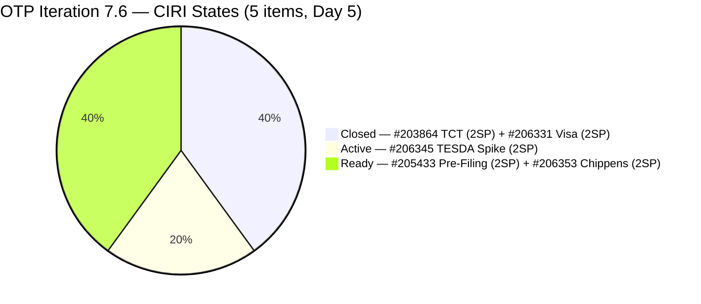
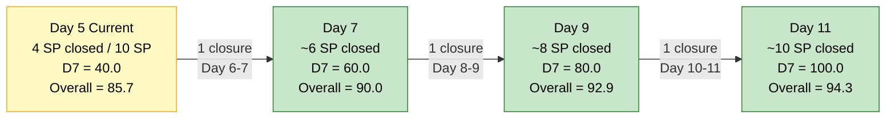

# ADO SAFe Audit — Office of the President (OTP Team)

## 1. Audit Metadata

| Field | Value |
|---|---|
| **Audit Date** | 2026-06-19 09:05 UTC |
| **Sprint Day** | **5 of 14** |
| **Prior Audit** | A89 — `AUDIT_20260618_0902.md` (Overall 78.6, Moderate Risk — 7.6 Day 4) |
| **ADO Project** | OTP (`e7739905-28a3-4ae1-9173-7f6cd13b3494`) |
| **ADO Team** | OTP Team |
| **Iteration** | Iteration 7.6 (`f27d43a8-3edb-46fd-8dd8-65aa5bdcf978`) |
| **Iteration Path** | `OTP\2026 - PI7\Iteration 7.6` |
| **Iteration Dates** | Jun 15, 2026 – Jun 28, 2026 |
| **Workspace Folder** | `ado_otp` |
| **Overall Score** | **85.7 — Low Risk** |
| **Risk Band** | Low (≥ 80) |
| **Planned Sprint Items (CIRI)** | 5 root items (6th item #204194 Removed) |
| **Backlog Visible Items (VRBI)** | 5 (3 active + 2 closed in iteration) |
| **Capacity** | Grace: 2h/day (Documentation 1h + Requirements 1h) — configured |
| **Project Exception Applied** | Single-assignee model (Grace) — accepted per workspace CLAUDE.md |

---

## 2. Executive Summary

The OTP team enters Day 5 of Iteration 7.6 with an overall score of **85.7 — Low Risk**, a significant improvement of **+7.1 points from A89 (78.6 Moderate)**. This is the first time the team has crossed the Low Risk threshold (≥ 80) in Iteration 7.6.

**Key developments since A89 (Day 4):**
- **Two closures overnight:** #203864 (Release and collect of TCT, 2 SP, Closed Jun 19 07:42 UTC) and #206331 (FTC Submission of Jove's Visa Application, 2 SP, Closed Jun 18 22:24 UTC). Together, 4 SP credited — D7 moves from 0.0 to 40.0.
- **#204194 Removed:** Philgeps Online Submission (User Story, 2 SP) was Removed on Jun 18 23:24 UTC, exiting the sprint scope. CIRI drops from 6 to 5.
- **D6 untouched penalty reduced:** With #204194 removed and #203864/#206331 closed, only #205433 (Jun 7) remains untouched before iteration start. Untouched ratio = 1/5 = 20% (was 33.3%) → penalty decreases from -20 to -10. D6 improves from 80.0 to 90.0.
- **Structural plateau broken.** The 78.6 score held across Days 2–4 (A87, A88, A89). Day 5 marks the delivery inflection point that all prior audits projected.

**Remaining sprint scope (3 active items):** #205433 (Pre-Filing Regulatory Compliance, Ready, 2SP), #206345 (TESDA Exploration, Active, 2SP), #206353 (Meeting with Chippens-Charles, Ready, 2SP). Combined remaining = 6SP of 10SP committed. Grace has 9 remaining sprint days to close 3 items.

---

## 3. Previous Audit Delta (A89 → A90)

| Dimension | A89 Score (7.6 Day 4) | A90 Score (7.6 Day 5) | Delta | Driver |
|---|---|---|---|---|
| D1 Iteration Planning | 100.0 | **100.0** | 0.0 | CIRI=5/VRBI=5. #204194 Removed, scope shrank from 6 to 5; ratio maintained at 100.0. |
| D2 Team Capacity | 100.0 | **100.0** | 0.0 | Grace: 2h/day configured. 1/1 contributor. No change. |
| D3 Estimation | 100.0 | **100.0** | 0.0 | All 5 CIRI items at 2 SP each. CSP = 10 SP. |
| D4 DoR Compliance | 100.0 | **100.0** | 0.0 | 5/5 CIRI items pass Desc + AC thresholds. |
| D5 Work Item Balance | 70.0 | **70.0** | 0.0 | US=4/5=80% → -30. Structural ceiling. No change in type composition. |
| D6 Backlog Refinement | 80.0 | **90.0** | **+10.0** | Untouched CIRI drops from 2/6=33.3% to 1/5=20%. Penalty: -10 (>10% but ≤30%). Was -20. |
| D7 Delivery Predictability | 0.0 | **40.0** | **+40.0** | 2 closures: #203864 (2SP) + #206331 (2SP) = 4SP closed of 10SP committed. D7=4/10×100=40.0. Early-sprint (Day 5). |
| **Overall** | **78.6** | **85.7** | **+7.1** | Delivery inflection: D6 penalty reduced, D7 first credit. Low Risk threshold crossed. |

**Formula verification:** (100.0 + 100.0 + 100.0 + 100.0 + 70.0 + 90.0 + 40.0) / 7 = 600.0 / 7 = **85.7**

**Key observations A89 → A90:**
- **#206331 (Visa Application) closed Jun 18 22:24 UTC** — Grace completed and closed this Active item within Day 4. This was the first closure in Iteration 7.6.
- **#203864 (TCT) closed Jun 19 07:42 UTC** — Grace closed this as well early on Day 5 morning. Two consecutive closures in ~9 hours.
- **#204194 (Philgeps Submission) Removed Jun 18 23:24 UTC** — item exited the sprint scope entirely. This is a net neutral on D7 (2SP removed from committed scope) but reduces CIRI. No DoR regression.
- **#205433 (Pre-Filing, Ready, Jun 7)** remains the only untouched item in CIRI — ChangedDate predates the iteration start by 8 days. One state transition eliminates the remaining -10 D6 penalty.
- **Grace's delivery pace:** 2 items closed across Day 4–5. At this pace (approximately 1 item per 1.5 days), remaining 3 items (#205433, #206345, #206353) could complete by Day 9.5. Full sprint delivery (D7=100.0) would push Overall to 94.3.

---

## 4. Current Iteration Snapshot

| Metric | Value |
|---|---|
| **Sprint Day / Total** | **5 / 14** |
| **Planned Items (CIRI)** | 5 root items (#203864, #205433, #206331, #206345, #206353) |
| **Removed from iteration** | 1 (#204194 — Philgeps, Removed Jun 18) |
| **Story Points Committed (CSP)** | 10 SP (5 × 2 SP) |
| **Story Points Closed (CLSP)** | 4 SP (#203864 + #206331, both 2 SP) |
| **Team Size (distinct CIRI assignees)** | 1 (Grace — all items) |
| **Total Remaining Capacity** | ~18 hours (9 days × 2h/day) |
| **Iteration Start / Finish** | Jun 15, 2026 – Jun 28, 2026 |

**CIRI State Distribution (Day 5):**

| ID | Title | Type | State | SP | Assignee | ChangedDate | DoR |
|---|---|---|---|---|---|---|---|
| #203864 | Release and collect of TCT | User Story | **Closed** | 2 | Grace | **Jun 19** | Pass |
| #205433 | Execute Pre-Filing Regulatory Compliance | User Story | Ready | 2 | Grace | Jun 7 | Pass |
| #206331 | FTC Submission of Jove's Visa Application | User Story | **Closed** | 2 | Grace | **Jun 18** | Pass |
| #206345 | TESDA Exploration | Spike | Active | 2 | Grace | Jun 16 | Pass |
| #206353 | Meeting with Chippens-Charles | User Story | Ready | 2 | Grace | Jun 15 | Pass |

---

## 5. Work Item Analysis

### DoR Assessment (5 CIRI items)

| ID | Title | Desc ≥ 30 NWS chars | AC ≥ 20 NWS chars | Result |
|---|---|---|---|---|
| #203864 | Release and collect of TCT | ✓ (~60 NWS — "As the Program Manager...secure new TCT...") | ✓ (3 ACs: original copy, scan, SharePoint filing) | **Pass** |
| #205433 | Execute Pre-Filing Regulatory Compliance | ✓ (~250 NWS, BDD narrative) | ✓ (2 BDD scenarios, ~400 NWS) | **Pass** |
| #206331 | FTC Submission of Jove's Visa Application | ✓ (~200 NWS, BDD narrative) | ✓ (2 BDD scenarios, ~300 NWS) | **Pass** |
| #206345 | TESDA Exploration | ✓ (~200 NWS, BDD narrative) | ✓ (2 BDD scenarios, ~280 NWS) | **Pass** |
| #206353 | Meeting with Chippens-Charles | ✓ (~180 NWS, BDD narrative) | ✓ (2 BDD scenarios, ~280 NWS) | **Pass** |

**DCI = 5/5. D4 = 100.0. No regressions. BDD-format DoR discipline sustained through Day 5.**

### Type Distribution (5 CIRI items)

| Type | Count | Share | D5 Impact |
|---|---|---|---|
| User Story | 4 (#203864, #205433, #206331, #206353) | 80.0% | Dominant type — >60% → -30 penalty |
| Spike | 1 (#206345) | 20.0% | Spike share < 40% — no spike penalty |
| **Total** | **5** | **100%** | D5 = max(0, 100−30) = **70.0** |

### Story Points Analysis

| ID | Title | Type | SP | State |
|---|---|---|---|---|
| #203864 | Release and collect of TCT | User Story | 2 | **Closed** ✓ |
| #205433 | Execute Pre-Filing Regulatory Compliance | User Story | 2 | Ready |
| #206331 | FTC Submission of Jove's Visa Application | User Story | 2 | **Closed** ✓ |
| #206345 | TESDA Exploration | Spike | 2 | Active |
| #206353 | Meeting with Chippens-Charles | User Story | 2 | Ready |

**CSP = 10 SP. CLSP = 4 SP (40% delivered). Remaining = 6 SP across 3 open items.**

---

## 6. SAFe Compliance Scorecard

| Dimension | Score | Band | Evidence | Notes |
|---|---|---|---|---|
| D1 Iteration Planning | **100.0** | Low | 5 CIRI / 5 VRBI | All 5 planned items in Iteration 7.6. #204194 removed, scope adjusted. 100% coverage maintained. |
| D2 Team Capacity | **100.0** | Low | 1/1 contributor with capacity | Grace: 2h/day configured. 1 contributor with CIRI work = 1 with capacity. |
| D3 Estimation | **100.0** | Low | 5/5 ECI with SP > 0 | All 5 CIRI items at 2 SP. CSP = 10 SP. |
| D4 DoR Compliance | **100.0** | Low | 5 DCI / 5 CIRI | All 5 pass Desc + AC thresholds. BDD format standard. |
| D5 Work Item Balance | **70.0** | Moderate | US=4/5=80% → -30 | US present ✓. Spike present. US dominance 80% structural for this sprint. |
| D6 Backlog Refinement | **90.0** | Low | 5/5 fresh; 1/5 untouched (20%, >10%) | Zero stale. #205433 (Jun 7) untouched before iteration start. -10 penalty (>10% ≤30%). |
| D7 Delivery Predictability | **40.0** | High | 4 SP closed / 10 SP committed | #203864 + #206331 closed. Day 5 — **early-sprint annotation**. 40% delivered. |
| **OVERALL** | **85.7** | **Low Risk** | (100+100+100+100+70+90+40)/7 | +7.1 from A89. Low Risk threshold (≥80) crossed for first time in 7.6. |

**Formula verification:** (100.0 + 100.0 + 100.0 + 100.0 + 70.0 + 90.0 + 40.0) / 7 = 600.0 / 7 = **85.7**

---

## 7. Dimension Findings

### D1 — Iteration Planning: 100.0 / 100 — Low Risk

**Formula:** CIRI / VRBI × 100 = 5 / 5 × 100 = **100.0**

| Metric | Value |
|---|---|
| Planned sprint items (CIRI) | 5 (down from 6 in A89 — #204194 Removed) |
| Closed (remain in CIRI) | 2 (#203864, #206331) |
| Open items | 3 (#205433 Ready, #206345 Active, #206353 Ready) |
| Removed from sprint | 1 (#204194 — Removed Jun 18) |

D1 = 100.0 is maintained because all planned items remain in Iteration 7.6, including the two now-closed items. The Removed item (#204194) exited scope cleanly and does not reduce D1. The pull-in buffer recommendation from prior audits (A87–A89) becomes relevant now: with 2 items closed and 3 remaining across 9 sprint days, capacity likely allows pulling in 1–2 additional items. Adding a pull-in item with full DoR before the next CIRI item closes preserves D1 = 100.0 going forward.

---

### D2 — Team Capacity: 100.0 / 100 — Low Risk

**Formula:** CC / CW × 100 = 1 / 1 × 100 = **100.0**

Grace is the sole assignee on all 5 CIRI items. Capacity = 2h/day (Documentation 1h + Requirements 1h). Total remaining available capacity = approximately 18 hours (9 days × 2h/day). With 3 items remaining at 2 SP each, Grace's average PI7 pace of ~1 item per 1.5 days provides comfortable headroom for full sprint delivery.

Single-assignee model accepted per Project Exception. Grace's Day 4–5 performance (2 consecutive closures) confirms capacity utilization is effective.

---

### D3 — Estimation: 100.0 / 100 — Low Risk

**Formula:** ECI / PECI × 100 = 5 / 5 × 100 = **100.0**

All 5 CIRI items carry 2 SP. CSP = 10 SP. Uniform 2 SP sizing consistent across all OTP PI7 iterations. No unestimated items.

---

### D4 — DoR Compliance: 100.0 / 100 — Low Risk

**Formula:** DCI / CIRI × 100 = 5 / 5 × 100 = **100.0**

All 5 CIRI items pass DoR thresholds through Day 5. The two closed items (#203864, #206331) passed DoR and delivered successfully — confirming the correlation between DoR compliance and execution. No regressions on Day 5. The "DoR at creation" discipline continues to hold across the sprint.

---

### D5 — Work Item Balance: 70.0 / 100 — Moderate Risk

**Formula:** Base 100 − penalties

| Penalty | Trigger | Applied |
|---|---|---|
| -40: No User Story in CIRI | 4 User Stories present | **No** |
| -30: Dominant type share > 60% | US = 4/5 = **80.0%** > 60% | **YES** |
| -20: Spike share > 40% | Spike = 1/5 = 20% | **No** |

**Score:** max(0, 100 − 30) = **70.0**

D5 = 70.0 is the structural ceiling for this sprint's composition. The removal of #204194 (User Story) changed the US/Spike ratio from 5/1 (83.3%/16.7%) to 4/1 (80%/20%). The -30 dominant-type penalty remains active; both percentages still apply. No in-sprint action available. PI8 planning recommendation stands: target ≤ 3 User Stories in a 5-item sprint to keep US share ≤ 60%.

---

### D6 — Backlog Refinement: 90.0 / 100 — Low Risk

**Freshness window:** ChangedDate ≥ 2026-05-05 (45 days before 2026-06-19)

| Metric | Value |
|---|---|
| Total CIRI items (VRBI equivalent) | 5 |
| Fresh items (ChangedDate ≥ May 5, 2026) | 5 — all items: Jun 7–19 |
| Stale_90 items (ChangedDate < Mar 21, 2026) | 0 |
| Stale_180 items (ChangedDate < Dec 22, 2025) | 0 |
| Untouched CIRI (ChangedDate < Jun 15, 2026) | 1 — #205433 (Jun 7) |

**Base = 5/5 × 100 = 100.0**
**Penalties:**
- Stale_90: 0/5 = 0% → No penalty
- Stale_180: 0 items → No penalty
- Untouched CIRI: 1/5 = 20% → **>10% but ≤30% → -10 penalty**

**Score: max(0, 100.0 − 10) = 90.0**

Significant improvement from A89 (80.0). The two closures (#203864, #206331) and the removal of #204194 reduced the untouched CIRI count from 2/6 to 1/5. #205433 (Pre-Filing Regulatory Compliance, Ready, Jun 7) remains the sole untouched item — 12 days without a ChangedDate update, 8 days before the iteration started. Any state transition by Grace (Ready → Active) eliminates the -10 penalty entirely, pushing D6 to 100.0 and Overall to 87.1.

---

### D7 — Delivery Predictability: 40.0 / 100 — High Risk

**Formula:** CLSP / CSP × 100 = 4 / 10 × 100 = **40.0**

| Metric | Value |
|---|---|
| Estimated current items (ECI) | 5 (all 2 SP) |
| Committed Story Points (CSP) | 10 SP |
| Closed Story Points (CLSP) | 4 SP (#203864 + #206331) |
| Score | **40.0** |

**Early-sprint annotation:** Day 5 of Iteration 7.6. Still within the 5-day early-sprint window. Despite the early-sprint annotation, 40.0 is a meaningful delivery signal — the team has closed 40% of committed scope by the end of the early window.

**Projection:** Three items remain (#205433, #206345, #206353 = 6SP). At Grace's PI7 pace of ~1 item per 1.5 days:
- By Day 7 (~Jun 21): expected 3rd closure → CLSP = 6 SP, D7 = 60.0, Overall → 90.0
- By Day 9 (~Jun 23): expected 4th closure → CLSP = 8 SP, D7 = 80.0, Overall → 92.9
- By Day 11 (~Jun 25): expected 5th closure → CLSP = 10 SP, D7 = 100.0, Overall → 94.3

Full delivery remains achievable and likely given current pace.

---

## 8. Risks and Bottlenecks

| # | Severity | Dimension | Risk | Recommended Action |
|---|---|---|---|---|
| R1 | **LOW** | D6 | #205433 (Pre-Filing, Ready) is the only untouched item (-10 D6 penalty). 12 days without any state change. | Grace: activate #205433 (Ready → Active) when sequencing next item. Eliminates -10 penalty. D6 → 100.0, Overall → 87.1. |
| R2 | **LOW** | D1 (proactive) | No pull-in buffer identified. With 3 of 5 items open across 9 remaining days, capacity likely allows 1–2 additional pulls. | Identify 1–2 DoR-ready pull-in candidates before the next closure. Pull-in must have Desc ≥ 30 NWS, AC ≥ 20 NWS, SP assigned before entering the iteration. |
| R3 | **LOW** | D5 (structural) | US share = 80% → -30 dominant type penalty. Sprint-locked structural ceiling at D5 = 70.0. | No in-sprint action. PI8 planning: ensure ≤ 3 User Stories in a 5-item sprint (≤ 60% share). Alternatively target a 6-item sprint with 2 non-US types. |
| R4 | **INFORMATIONAL** | #204194 scope removal | Philgeps Online Submission (2 SP, User Story) was Removed — not deferred, but removed. This appears to reflect a decision that the work is no longer needed this sprint. No process violation, but worth confirming intent: was this deprioritized, completed out-of-system, or obsoleted? | Ramon/Grace: confirm whether #204194 removal was intentional and whether Philgeps renewal is captured elsewhere. |

---

## 9. Prioritized Recommendations

1. **[TODAY — QUICK WIN, D6]** Grace: activate #205433 (Execute Pre-Filing Regulatory Compliance). Change state from Ready → Active. One state change eliminates the remaining -10 D6 penalty. D6 moves to 100.0, Overall improves from 85.7 to 87.1.

2. **[THIS WEEK — PROACTIVE, D1]** Grace/Ramon: identify 1–2 DoR-ready pull-in candidate items for Iteration 7.6. Items must have Description ≥ 30 NWS, Acceptance Criteria ≥ 20 NWS, and Story Points assigned before being added to the iteration. Add before the next CIRI item closes to prevent a D1 degradation scenario.

3. **[SUSTAINED — D7]** Maintain delivery momentum. Grace has closed 2 items in the last 24 hours — this is the sprint's best single-day performance in PI7. At the current pace, full sprint delivery by Day 11 is projected. Continue sequencing items from Active state through to Closed.

4. **[PI8 PLANNING — D5]** At PI8 iteration planning: for OTP's 5-item sprints, cap User Stories at 3 items (60% share) to eliminate the -30 dominant-type penalty and raise the D5 ceiling from 70.0 to 100.0. This adds 4.3 points to Overall structurally.

5. **[INFORMATIONAL]** Confirm intent of #204194 (Philgeps Submission) Removal. If Philgeps renewal is still required, create a new work item for PI8 with full DoR. If it was processed out-of-system or is obsolete, document the decision in ADO comments before closing.

---

## 10. Evidence Gaps and Limitations

| Gap | Impact | Notes |
|---|---|---|
| **#204194 Removed — intent unclear** | Minor | The item was Removed (not Closed) on Jun 18. ADO "Removed" state typically signals scope exclusion. No SP credit earned. Confirm whether this was a deliberate scope change or an error. |
| **D5 = 70.0 — structural ceiling** | Sprint-locked | US share of 80% triggers -30 penalty. No in-sprint fix. Ceiling persists until sprint closes. |
| **D6 = 90.0 — one untouched item** | Minor | #205433 (Jun 7) has not been touched since before iteration start. Self-resolving when Grace activates it. |
| **D7 = 40.0 — Day 5 early-sprint** | Expected | 40% delivered is strong for Day 5. Early-sprint annotation valid through Day 5 only; from Day 6 forward D7 = 40.0 will be measured as execution performance. |
| **Single-assignee model** | Structural risk (unscored) | Project Exception in place. Zero velocity risk if Grace is unavailable for any remaining sprint day. |
| **SP uniformity (all 2 SP)** | Minor sizing concern | Uniform sizing across all items. Relative sizing would improve estimation signal. |

---

## 11. Visualizations

### Score Progression — A87 → A90 (Delivery Inflection)

### Dimension Scores — A90 (Day 5, Overall 85.7)

### CIRI State Distribution — Day 5 (5 items, 10 SP)

### Delivery Projection — Day 5 Forward

*Projection based on Grace's PI7 velocity of ~1 item per 1.5 days.*

---

## 12. Audit Trail

| Source | Tool | Data |
|---|---|---|
| Current iteration | `work_list_team_iterations` (project `e7739905`, team `OTP Team`, timeframe=current) | Iteration 7.6: Jun 15–28, 2026; ID `f27d43a8-3edb-46fd-8dd8-65aa5bdcf978` |
| Backlog items | `wit_list_backlog_work_items` (project `e7739905`, team `OTP Team`, backlogId `Microsoft.RequirementCategory`) | 3 active items returned: #205433, #206345, #206353 |
| Iteration items | `wit_get_work_items_for_iteration` (iterationId `f27d43a8`) | Root items (null source): #203864, #205433, #206331, #206345, #206353, #205420 (Task — excluded). #204194 not returned (Removed). |
| Work item details | `wit_get_work_items_batch_by_ids` (#203864, #204194, #205420, #205433, #206331, #206345, #206353) | State, SP, Type, Desc, AC, ChangedDate, IterationPath, AssignedTo confirmed for all 7 items |
| Team capacity | `work_get_iteration_capacities` (project `e7739905`, iterationId `f27d43a8`) | OTP Team: 2h/day total; Grace: Documentation 1h + Requirements 1h |
| Prior audit | `AUDIT_20260618_0902.md` (A89) | Overall 78.6, Moderate Risk, 7.6 Day 4, 6 CIRI, 12 SP committed, 0 SP closed |
