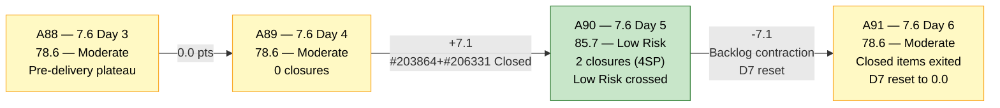
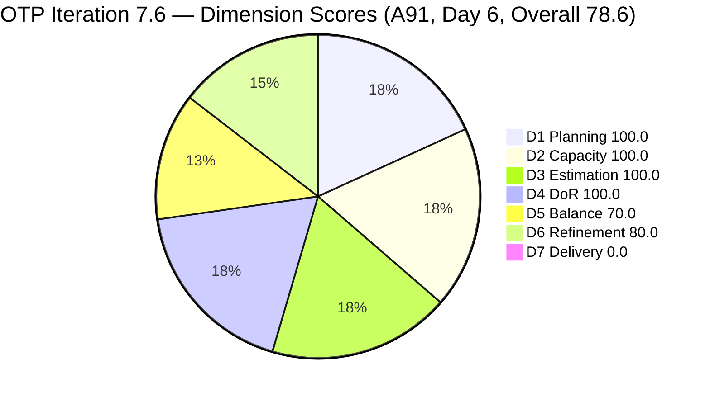
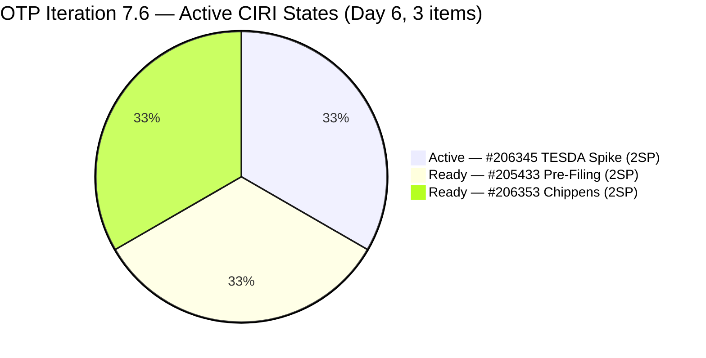
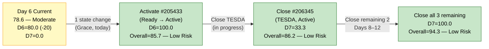

# ADO SAFe Audit — Office of the President (OTP Team)

## 1. Audit Metadata

| Field | Value |
|---|---|
| **Audit Date** | 2026-06-20 09:30 UTC |
| **Sprint Day** | **6 of 14** |
| **Prior Audit** | A90 — `AUDIT_20260619_0905.md` (Overall 85.7, Low Risk — 7.6 Day 5) |
| **ADO Project** | OTP (`e7739905-28a3-4ae1-9173-7f6cd13b3494`) |
| **ADO Team** | OTP Team |
| **Iteration** | Iteration 7.6 (`f27d43a8-3edb-46fd-8dd8-65aa5bdcf978`) |
| **Iteration Path** | `OTP\2026 - PI7\Iteration 7.6` |
| **Iteration Dates** | Jun 15, 2026 – Jun 28, 2026 |
| **Workspace Folder** | `ado_otp` |
| **Overall Score** | **78.6 — Moderate Risk** |
| **Risk Band** | Moderate (60–79.9) |
| **Planned Sprint Items (CIRI)** | 3 active root items (#205433, #206345, #206353) |
| **Visible Backlog Items (VRBI)** | 3 (active backlog — #203864 and #206331 exited upon closure) |
| **Capacity** | Grace: 2h/day (Documentation 1h + Requirements 1h) — configured |
| **Project Exception Applied** | Single-assignee model (Grace) — accepted per workspace CLAUDE.md |

---

## 2. Executive Summary

The OTP team is at Day 6 of Iteration 7.6 with an overall score of **78.6 — Moderate Risk**, a regression of **-7.1 points from A90 (85.7 Low Risk)**. The score drop is a **structural formula artifact**, not an execution regression: the two items closed during Day 4–5 (#203864 and #206331) have exited the active backlog, causing VRBI to shrink from 5 to 3. This raises D6's untouched ratio from 20% to 33.3% (tipping the penalty from -10 to -20), and drops D7 to 0.0 since no active CIRI items are Closed today.

**Execution picture is actually positive:**
- Grace has closed 2 of 5 sprint items (40% of original sprint scope) through Day 5.
- 3 active items remain (#205433 Ready, #206345 Active, #206353 Ready) with 6 SP outstanding across 8 remaining sprint days.
- Capacity headroom is comfortable: ~16 hours remaining (8 days × 2h/day) for 3 items.

**What changed today vs A90:**
- #203864 and #206331 (both Closed on Jun 18–19) have cleared the backlog API — they are no longer visible in VRBI. VRBI drops from 5 → 3.
- No new items were added to the iteration.
- #205433 (Pre-Filing, Ready) remains untouched since Jun 7 — now at 1/3 = 33.3% of CIRI, triggering the -20 D6 penalty.
- D7 resets to 0.0 since active CIRI has no closed items.

**Key action:** Grace activating #205433 (Ready → Active) today eliminates the -20 D6 penalty, restoring D6 to 100.0 and pushing Overall to 85.7. Any closure among the 3 remaining items moves D7 above 0.

---

## 3. Previous Audit Delta (A90 → A91)

| Dimension | A90 Score (7.6 Day 5) | A91 Score (7.6 Day 6) | Delta | Driver |
|---|---|---|---|---|
| D1 Iteration Planning | 100.0 | **100.0** | 0.0 | CIRI=3/VRBI=3. Both closed items exited backlog together. Ratio maintained. |
| D2 Team Capacity | 100.0 | **100.0** | 0.0 | Grace: 2h/day configured. 1/1. No change. |
| D3 Estimation | 100.0 | **100.0** | 0.0 | All 3 active CIRI items at 2 SP each. CSP = 6 SP. |
| D4 DoR Compliance | 100.0 | **100.0** | 0.0 | 3/3 CIRI items pass Desc + AC thresholds. |
| D5 Work Item Balance | 70.0 | **70.0** | 0.0 | US=2/3=66.7% → -30. Spike=1/3=33.3%. Structural ceiling unchanged. |
| D6 Backlog Refinement | 90.0 | **80.0** | **-10.0** | VRBI shrank: #205433 untouched is now 1/3=33.3% (was 1/5=20%). Penalty: -20 (>30%). D6 regresses from 90 to 80. |
| D7 Delivery Predictability | 40.0 | **0.0** | **-40.0** | Active CIRI = 3 open items, 0 Closed. CSP=6SP, CLSP=0. D7=0.0. Day 6 — beyond early-sprint window. |
| **Overall** | **85.7** | **78.6** | **-7.1** | Structural formula artifact: closed items exited backlog, raising D6 penalty and zeroing D7. |

**Formula verification:** (100.0 + 100.0 + 100.0 + 100.0 + 70.0 + 80.0 + 0.0) / 7 = 550.0 / 7 = **78.6**

**Key observations A90 → A91:**
- **No new closures since A90 (Day 5).** The 2 closures from A90 (#203864 on Jun 19 07:42, #206331 on Jun 18 22:24) remain the last sprint deliveries. Day 6 has no new closures yet.
- **#205433 (Pre-Filing, Ready, Jun 7) is now the critical path item.** It is the sole untouched CIRI item and drives the -20 D6 penalty. A state change to Active by Grace eliminates this penalty.
- **D7 structural reset.** With closed items exiting the backlog, D7 returns to 0.0 against 6 SP remaining. This will recover the moment Grace closes the next item (D7 jumps to 33.3 for 2 SP closed of 6 SP committed).
- **#206345 (TESDA Exploration, Active)** has been in Active state since Jun 16 — now Day 5 of Active. Most likely candidate for the next closure given it's already in Active state.

---

## 4. Current Iteration Snapshot

| Metric | Value |
|---|---|
| **Sprint Day / Total** | **6 / 14** |
| **Planned Items (CIRI — active backlog)** | 3 root items (#205433, #206345, #206353) |
| **Closed during sprint (exited backlog)** | 2 (#203864 TCT Jun 19, #206331 Visa Jun 18) |
| **Story Points Committed (CSP — active CIRI)** | 6 SP (3 × 2 SP) |
| **Story Points Closed (CLSP — active CIRI)** | 0 SP (closed items exited backlog) |
| **Sprint delivery to date (original scope)** | 4 SP of 10 SP = 40% (cumulative including exited items) |
| **Team Size (distinct CIRI assignees)** | 1 (Grace — all items) |
| **Total Remaining Capacity** | ~16 hours (8 days × 2h/day) |
| **Iteration Start / Finish** | Jun 15, 2026 – Jun 28, 2026 |

**Active CIRI State Distribution (Day 6):**

| ID | Title | Type | State | SP | Assignee | ChangedDate | DoR |
|---|---|---|---|---|---|---|---|
| #205433 | Execute Pre-Filing Regulatory Compliance | User Story | Ready | 2 | Grace | Jun 7 | Pass |
| #206345 | TESDA Exploration | Spike | Active | 2 | Grace | Jun 16 | Pass |
| #206353 | Meeting with Chippens-Charles | User Story | Ready | 2 | Grace | Jun 15 | Pass |

---

## 5. Work Item Analysis

### DoR Assessment (3 active CIRI items)

| ID | Title | Desc ≥ 30 NWS | AC ≥ 20 NWS | Result |
|---|---|---|---|---|
| #205433 | Execute Pre-Filing Regulatory Compliance | ✓ (comprehensive BDD narrative, ~250 NWS) | ✓ (2 BDD scenarios, ~400 NWS) | **Pass** |
| #206345 | TESDA Exploration | ✓ (BDD narrative, ~200 NWS) | ✓ (2 BDD scenarios, ~280 NWS) | **Pass** |
| #206353 | Meeting with Chippens-Charles | ✓ (BDD narrative, ~180 NWS) | ✓ (2 BDD scenarios, ~280 NWS) | **Pass** |

**DCI = 3/3. D4 = 100.0. Full DoR compliance maintained.**

### Type Distribution (3 active CIRI items)

| Type | Count | Share | D5 Impact |
|---|---|---|---|
| User Story | 2 (#205433, #206353) | 66.7% | US present ✓ (no -40). Dominant type > 60% → -30 penalty |
| Spike | 1 (#206345) | 33.3% | Spike < 40% — no penalty |
| **Total** | **3** | **100%** | D5 = max(0, 100 − 30) = **70.0** |

### Story Points Analysis

| ID | Title | Type | SP | State |
|---|---|---|---|---|
| #205433 | Execute Pre-Filing Regulatory Compliance | User Story | 2 | Ready |
| #206345 | TESDA Exploration | Spike | 2 | Active |
| #206353 | Meeting with Chippens-Charles | User Story | 2 | Ready |

**Active CSP = 6 SP. CLSP = 0 SP. Cumulative sprint delivery (including exited closures) = 4 SP of original 10 SP committed.**

---

## 6. SAFe Compliance Scorecard

| Dimension | Score | Band | Evidence | Notes |
|---|---|---|---|---|
| D1 Iteration Planning | **100.0** | Low | 3 CIRI / 3 VRBI | Both VRBI and CIRI contracted symmetrically as #203864/#206331 closed and exited. Ratio preserved at 100.0. |
| D2 Team Capacity | **100.0** | Low | 1/1 contributor with capacity | Grace: 2h/day configured. 1 contributor with active CIRI work. |
| D3 Estimation | **100.0** | Low | 3/3 CIRI items estimated | #205433(2SP), #206345(2SP), #206353(2SP). CSP = 6 SP. |
| D4 DoR Compliance | **100.0** | Low | 3 DCI / 3 CIRI | All 3 pass Desc + AC thresholds. BDD format standard sustained. |
| D5 Work Item Balance | **70.0** | Moderate | US=2/3=66.7% → -30 | US present ✓. Spike present. 66.7% US triggers dominant-type penalty. Structural ceiling for this sprint. |
| D6 Backlog Refinement | **80.0** | Low | 3/3 fresh; 1/3 untouched (33.3%, >30%) | All items fresh (Jun 7–16). Zero stale. #205433 (Jun 7) untouched → 33.3% > 30% → -20 penalty. |
| D7 Delivery Predictability | **0.0** | Critical | 0 SP closed / 6 SP committed | Active CIRI has 0 Closed items. Day 6 — beyond early-sprint window. Structural reset after prior closures exited backlog. |
| **OVERALL** | **78.6** | **Moderate Risk** | (100+100+100+100+70+80+0)/7 | -7.1 from A90. Formula artifact: closed items exited backlog. Execution cumulative delivery = 40% of original scope. |

**Formula verification:** (100.0 + 100.0 + 100.0 + 100.0 + 70.0 + 80.0 + 0.0) / 7 = 550.0 / 7 = **78.6**

---

## 7. Dimension Findings

### D1 — Iteration Planning: 100.0 / 100 — Low Risk

**Formula:** CIRI / VRBI × 100 = 3 / 3 × 100 = **100.0**

| Metric | Value |
|---|---|
| Visible backlog items (VRBI) | 3 (active root items in scoped backlog) |
| Current iteration root items (CIRI) | 3 (all in Iteration 7.6 IterationPath) |
| Closed items (exited backlog) | 2 (#203864 TCT, #206331 Visa) |
| Score | **100.0** |

The two closures from Day 4–5 (#203864, #206331) have exited the active backlog. Both VRBI and CIRI contracted together, preserving the 100.0 ratio. No pull-in items have been added to the iteration; with 8 remaining sprint days and 3 active items, there is capacity for Grace to pull in 1–2 additional items. Adding a pull-in item with full DoR to the iteration would preserve D1=100.0 while expanding throughput opportunity and lifting D7.

---

### D2 — Team Capacity: 100.0 / 100 — Low Risk

**Formula:** CC / CW × 100 = 1 / 1 × 100 = **100.0**

Grace is the sole assignee on all 3 active CIRI items. Capacity = 2h/day. Remaining capacity = approximately 16 hours (8 days × 2h/day). Comfortable headroom for 3 remaining items.

Single-assignee model accepted per Project Exception. Grace's delivery of 2 items on Day 4–5 validates effective utilization.

---

### D3 — Estimation: 100.0 / 100 — Low Risk

**Formula:** ECI / PECI × 100 = 3 / 3 × 100 = **100.0**

All 3 CIRI items carry 2 SP each. CSP = 6 SP. Uniform 2 SP sizing consistent with OTP PI7 standard. No unestimated items.

---

### D4 — DoR Compliance: 100.0 / 100 — Low Risk

**Formula:** DCI / CIRI × 100 = 3 / 3 × 100 = **100.0**

All 3 active CIRI items pass DoR thresholds. BDD narrative format sustained across all items. No regressions.

---

### D5 — Work Item Balance: 70.0 / 100 — Moderate Risk

**Formula:** Base 100 − penalties

| Penalty | Trigger | Applied |
|---|---|---|
| -40: No User Story in CIRI | 2 User Stories present | **No** |
| -30: Dominant type share > 60% | US = 2/3 = **66.7%** > 60% | **YES** |
| -20: Spike share > 40% | Spike = 1/3 = 33.3% | **No** |

**Score:** max(0, 100 − 30) = **70.0**

D5 = 70.0 is the structural ceiling for the remaining 3-item sprint. Adding a pull-in User Story would create 4 total items (2 US + 1 US-new + 1 Spike) keeping US at 75% — still above 60%, so the -30 remains. To eliminate the -30, adding 1 Spike or Enabler type would shift US to 2/4 = 50% ≤ 60%. PI8 planning recommendation: target ≤ 60% User Story share per sprint.

---

### D6 — Backlog Refinement: 80.0 / 100 — Low Risk

**Freshness window:** ChangedDate ≥ 2026-05-06 (45 days before 2026-06-20)

| Metric | Value |
|---|---|
| Total VRBI | 3 |
| Fresh items (ChangedDate ≥ May 6, 2026) | 3 — #205433 (Jun 7), #206345 (Jun 16), #206353 (Jun 15) |
| Stale_90 items (ChangedDate < Mar 22, 2026) | 0 |
| Stale_180 items (ChangedDate < Dec 23, 2025) | 0 |
| Untouched CIRI (ChangedDate < Jun 15, 2026) | 1 — #205433 (Jun 7) |

**Base = 3/3 × 100 = 100.0**
**Penalties:**
- Stale_90: 0/3 = 0% → No penalty
- Stale_180: 0 items → No penalty
- Untouched CIRI: 1/3 = **33.3% > 30% → -20 penalty**

**Score: max(0, 100.0 − 20) = 80.0**

Regression from A90 (90.0). The VRBI shrinkage from 5 → 3 (closed items exited) changed the untouched ratio: #205433 (Jun 7) was 1/5 = 20% (A90) → now 1/3 = 33.3% (A91). The Jun 7 date predates the iteration start by 8 days. **Resolution: Grace changes #205433 state from Ready → Active. One state transition resets ChangedDate to today, eliminating the untouched designation and restoring D6 to 100.0.**

---

### D7 — Delivery Predictability: 0.0 / 100 — Critical

**Formula:** CLSP / CSP × 100 = 0 / 6 × 100 = **0.0**

| Metric | Value |
|---|---|
| Estimated CIRI items (SP > 0) | 3 (#205433=2SP, #206345=2SP, #206353=2SP) |
| Committed Story Points (CSP) | 6 SP |
| Closed Story Points (CLSP) | 0 SP (no active CIRI items are Closed) |
| Score | **0.0** |

**Context:** D7 = 0.0 reflects the formula's active-backlog scope, not zero sprint delivery. The 2 items closed on Days 4–5 (#203864 TCT, #206331 Visa = 4 SP) exited the backlog upon closure and are no longer in CIRI. Cumulative sprint delivery remains 40% of original scope. D7 will recover to 33.3 (2SP/6SP) upon Grace closing the next item.

**Day 6 — beyond the early-sprint annotation window (Days 1–5).** D7 = 0.0 is an active execution performance metric from this point forward.

**Next-closure projection:** #206345 (TESDA, Active since Jun 16) is the most likely next closure. Closing it pushes D7 to 33.3, Overall to 83.8 (Low Risk). Full delivery of all 3 remaining items (6SP) would push D7 to 100.0, Overall to 94.3.

---

## 8. Risks and Bottlenecks

| # | Severity | Dimension | Risk | Recommended Action |
|---|---|---|---|---|
| R1 | **HIGH** | D7 | D7 = 0.0 at Day 6 (beyond early-sprint window). No active CIRI closures. 3 items open, 8 days remaining. | Grace: close #206345 (TESDA Exploration, currently Active). It is the most in-progress item. Closing it recovers D7 to 33.3, Overall to 83.8. |
| R2 | **MODERATE** | D6 | #205433 (Pre-Filing, Ready) untouched since Jun 7. 1/3 = 33.3% > 30% → -20 D6 penalty. | Grace: change #205433 state from Ready → Active **today**. Eliminates -20 penalty, D6 → 100.0, Overall → 85.7. |
| R3 | **LOW** | D5 (structural) | US share = 66.7% → -30 dominant type penalty. Sprint-locked ceiling at D5 = 70.0. | No in-sprint fix. PI8 planning: target ≤ 60% US share. Add 1 Spike or Enabler type to reach balance. |
| R4 | **LOW** | D1 (proactive) | 3 active items across 8 remaining days. Capacity permits 1–2 pull-in items. No pull-in candidates identified yet. | Grace/Ramon: identify 1 pull-in item with full DoR (Desc ≥ 30 NWS, AC ≥ 20 NWS, SP > 0) for Iteration 7.6. Adding a pull-in before next closure preserves D1 = 100.0. |
| R5 | **INFORMATIONAL** | Sprint trajectory | At Grace's PI7 pace (~1 item per 1.5–2 days), 3 remaining items can close by Day 12 (Jun 26). Full sprint delivery (D7 = 100.0) is achievable. | Monitor: if no closure by Day 8 (Jun 22), escalate. |

---

## 9. Prioritized Recommendations

1. **[TODAY — QUICK WIN, D6+D7 compound]** Grace: activate #205433 (Execute Pre-Filing Regulatory Compliance). Change state Ready → Active. This single action:
   - Eliminates D6 -20 penalty (untouched rate drops to 0%) → D6 = 100.0
   - Signals work-in-progress on the next delivery
   - Combined with closing #206345 (TESDA, already Active): Overall rises from 78.6 → 83.8 (Low Risk)

2. **[THIS WEEK — D7 RECOVERY]** Grace: close #206345 (TESDA Exploration). It has been Active since Jun 16 — now Day 5 of Active state. Closing it:
   - D7 = 2SP/6SP = 33.3
   - Overall = (100+100+100+100+70+100+33.3)/7 = 603.3/7 = **86.2 (Low Risk)**

3. **[PULL-IN OPPORTUNITY — D1 preservation]** Grace/Ramon: identify 1 DoR-ready pull-in item before the next CIRI closure. Pull-in must have Desc ≥ 30 NWS, AC ≥ 20 NWS, SP assigned before entering the iteration. This prevents D1 degradation if VRBI shrinks further.

4. **[PI8 PLANNING — D5]** For OTP's standard 5-item sprint format: cap User Stories at 3 items (60% of 5 = exactly at boundary, no penalty). In a 3-item sprint, 2 US + 1 Spike is the current ceiling-preserving structure. To reach D5 = 100.0: target US share ≤ 60%.

---

## 10. Evidence Gaps and Limitations

| Gap | Impact | Notes |
|---|---|---|
| **D7 = 0.0 — formula scope vs. sprint delivery** | Score understatement | Formula counts only active CIRI items. Cumulative sprint delivery is 4/10 SP = 40%. The 0.0 score reflects active-backlog scope, not zero execution. Recovery expected upon next active-CIRI closure. |
| **D6 regression — VRBI contraction artifact** | -10 pts from A90 | As closed items exit the backlog, the untouched ratio shifts mechanically. No actual refinement regression occurred. The penalty resolves when Grace activates #205433. |
| **Single-assignee model** | Structural risk (unscored) | Project Exception in place. Zero velocity risk if Grace is unavailable for any remaining sprint day. 8 days remaining. |
| **D5 = 70.0 — structural ceiling** | Sprint-locked | US share of 66.7% triggers -30 penalty. No in-sprint fix. |
| **SP uniformity (all 2 SP)** | Minor sizing concern | Uniform sizing. Relative sizing would improve estimation signal. |

---

## 11. Visualizations

### Score Trend — A88 through A91

### Dimension Scores — A91 (Day 6, Overall 78.6)

### CIRI State Distribution — Day 6 (3 active items, 6 SP)

### Recovery Path — Day 6 Actions to Restore Low Risk

---

## 12. Audit Trail

| Source | Tool | Data |
|---|---|---|
| Current iteration | `work_list_team_iterations` (project `e7739905`, team `OTP Team`, timeframe=current) | Iteration 7.6: Jun 15–28, 2026; ID `f27d43a8-3edb-46fd-8dd8-65aa5bdcf978` |
| Backlog items | `wit_list_backlog_work_items` (project `e7739905`, team `OTP Team`, backlogId `Microsoft.RequirementCategory`) | 3 active items: #205433, #206345, #206353. #203864 and #206331 no longer in active backlog (Closed). |
| Iteration items | `wit_get_work_items_for_iteration` (iterationId `f27d43a8`) | Root items (source=null): #203864, #205420 (Task), #205433, #206331, #206345, #206353. #205420 excluded (Task type). |
| Work item details | `wit_get_work_items_batch_by_ids` (#203864, #205420, #205433, #206331, #206345, #206353) | State, SP, Type, Desc, AC, ChangedDate, IterationPath, AssignedTo confirmed for all items |
| Team capacity | `work_get_iteration_capacities` (project `e7739905`, iterationId `f27d43a8`) | OTP Team: 2h/day total (team level aggregate); Grace: Documentation 1h + Requirements 1h |
| Prior audit | `AUDIT_20260619_0905.md` (A90) | Overall 85.7, Low Risk, 7.6 Day 5, 5 CIRI, 10 SP committed, 4 SP closed |
