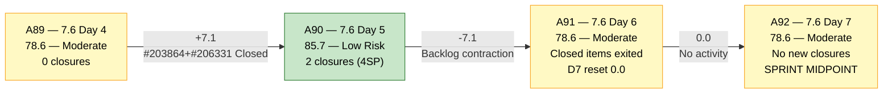
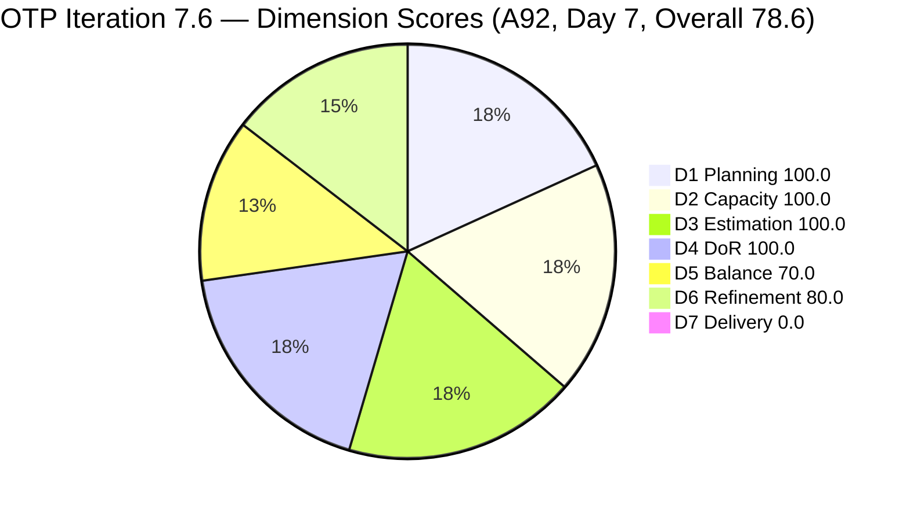
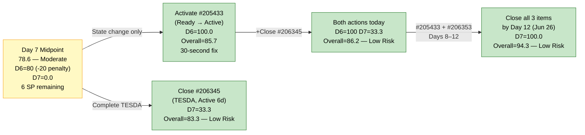
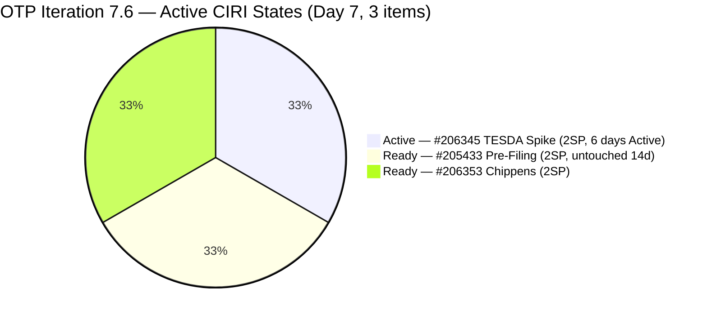

# ADO SAFe Audit — Office of the President (OTP Team)

## 1. Audit Metadata

| Field | Value |
|---|---|
| **Audit Date** | 2026-06-21 09:30 UTC |
| **Sprint Day** | **7 of 14** |
| **Prior Audit** | A91 — `AUDIT_20260620_0930.md` (Overall 78.6, Moderate Risk — 7.6 Day 6) |
| **ADO Project** | OTP (`e7739905-28a3-4ae1-9173-7f6cd13b3494`) |
| **ADO Team** | OTP Team |
| **Iteration** | Iteration 7.6 (`f27d43a8-3edb-46fd-8dd8-65aa5bdcf978`) |
| **Iteration Path** | `OTP\2026 - PI7\Iteration 7.6` |
| **Iteration Dates** | Jun 15, 2026 – Jun 28, 2026 |
| **Workspace Folder** | `ado_otp` |
| **Overall Score** | **78.6 — Moderate Risk** |
| **Risk Band** | Moderate (60–79.9) |
| **Planned Sprint Items (CIRI)** | 3 active root items (#205433, #206345, #206353) |
| **Visible Backlog Items (VRBI)** | 3 |
| **Capacity** | Grace: 2h/day (Documentation 1h + Requirements 1h) — configured |
| **Project Exception Applied** | Single-assignee model (Grace) — accepted per workspace CLAUDE.md |

---

## 2. Executive Summary

The OTP team is at **Day 7 of 14** in Iteration 7.6 with an overall score of **78.6 — Moderate Risk**, unchanged from A91 (Day 6). No new closures have occurred. No new items were added to the iteration. All 3 active CIRI items remain in the same states as yesterday.

**Critical execution gap:** Day 7 marks the midpoint of the sprint. D7 = 0.0 is now 7 days without a closure against active CIRI. The sprint has 7 remaining days. While cumulative delivery (4 SP from items that exited the backlog) demonstrates Grace's productivity, the active formula shows zero closed SP against 6 committed.

**What is unchanged from A91:**
- #205433 (Pre-Filing, Ready) remains untouched since Jun 7 — now 14 days without a state change. This continues to trigger the D6 -20 penalty.
- #206345 (TESDA Exploration, Active since Jun 16) is now Day 6 of Active state — the most immediate delivery candidate.
- #206353 (Meeting with Chippens-Charles, Ready) unchanged since Jun 15.

**Midpoint risk assessment:** With 7 days remaining and 6 SP committed, Grace needs to average 0.86 SP/day to reach full delivery. At Grace's PI7 historical pace (~1 item per 1.5–2 days), full closure of 3 items by Day 12 (Jun 26) is feasible — but requires activating #205433 and closing #206345 today or tomorrow.

---

## 3. Previous Audit Delta (A91 → A92)

| Dimension | A91 Score (7.6 Day 6) | A92 Score (7.6 Day 7) | Delta | Driver |
|---|---|---|---|---|
| D1 Iteration Planning | 100.0 | **100.0** | 0.0 | CIRI=3/VRBI=3. No changes to iteration membership. |
| D2 Team Capacity | 100.0 | **100.0** | 0.0 | Grace: 2h/day configured. 1/1. Unchanged. |
| D3 Estimation | 100.0 | **100.0** | 0.0 | All 3 CIRI items at 2 SP each. CSP = 6 SP. |
| D4 DoR Compliance | 100.0 | **100.0** | 0.0 | 3/3 CIRI items pass Desc + AC thresholds. |
| D5 Work Item Balance | 70.0 | **70.0** | 0.0 | US=2/3=66.7% → -30. Structural ceiling. |
| D6 Backlog Refinement | 80.0 | **80.0** | 0.0 | #205433 untouched 14 days (Jun 7). 1/3=33.3% > 30% → -20. |
| D7 Delivery Predictability | 0.0 | **0.0** | 0.0 | No new closures. Active CIRI: 0 Closed. Day 7 — 7th consecutive day at 0.0. |
| **Overall** | **78.6** | **78.6** | **0.0** | No changes. Score plateau. Midpoint of sprint. |

**Formula verification:** (100.0 + 100.0 + 100.0 + 100.0 + 70.0 + 80.0 + 0.0) / 7 = 550.0 / 7 = **78.6**

**Key observations A91 → A92:**
- **Zero activity on Day 7.** No state changes, no closures, no new items. A92 is an exact mirror of A91 on all 7 dimensions.
- **D7 = 0.0 for the 2nd consecutive audit.** The first post-closure plateau. With 7 days remaining, recovery is still fully achievable (D7 = 100.0 possible by Day 12).
- **#205433 now at 14 days untouched.** The item was last changed Jun 7 — 8 days before the sprint started. One state change eliminates the D6 -20 penalty.
- **Score plateau risk:** If no action occurs by Day 8 (tomorrow), the midpoint will pass with D7=0.0 and D6 penalized. The window for full-sprint delivery (D7=100.0, Overall=94.3) narrows each day.

---

## 4. Current Iteration Snapshot

| Metric | Value |
|---|---|
| **Sprint Day / Total** | **7 / 14 — SPRINT MIDPOINT** |
| **Planned Items (CIRI — active backlog)** | 3 root items (#205433, #206345, #206353) |
| **Closed during sprint (exited backlog)** | 2 (#203864 TCT Jun 19, #206331 Visa Jun 18) |
| **Story Points Committed (CSP — active CIRI)** | 6 SP (3 × 2 SP) |
| **Story Points Closed (CLSP — active CIRI)** | 0 SP |
| **Sprint delivery to date (original scope)** | 4 SP of 10 SP = 40% (cumulative including exited items) |
| **Team Size (distinct CIRI assignees)** | 1 (Grace — all items) |
| **Total Remaining Capacity** | ~14 hours (7 days × 2h/day) |
| **Iteration Start / Finish** | Jun 15, 2026 – Jun 28, 2026 |

**Active CIRI State Distribution (Day 7):**

| ID | Title | Type | State | SP | Assignee | ChangedDate | Days Since Change | DoR |
|---|---|---|---|---|---|---|---|---|
| #205433 | Execute Pre-Filing Regulatory Compliance | User Story | Ready | 2 | Grace | Jun 7 | **14 days** | Pass |
| #206345 | TESDA Exploration | Spike | Active | 2 | Grace | Jun 16 | 5 days | Pass |
| #206353 | Meeting with Chippens-Charles | User Story | Ready | 2 | Grace | Jun 15 | 6 days | Pass |

---

## 5. Work Item Analysis

### DoR Assessment (3 active CIRI items)

| ID | Title | Desc ≥ 30 NWS | AC ≥ 20 NWS | Result |
|---|---|---|---|---|
| #205433 | Execute Pre-Filing Regulatory Compliance | ✓ (BDD narrative, ~200+ NWS: "As a Corporate Compliance Officer...") | ✓ (2 BDD scenarios, ~400+ NWS: Form/Signature Audit + Notarial Compliance) | **Pass** |
| #206345 | TESDA Exploration | ✓ (BDD narrative, ~180+ NWS: "As a Program Manager...") | ✓ (2 BDD scenarios, ~280+ NWS: Partnership Pathway + Competency Matrix) | **Pass** |
| #206353 | Meeting with Chippens-Charles | ✓ (BDD narrative, ~150+ NWS: "As a Marketing for Jairosoft's technical roadmap...") | ✓ (2 BDD scenarios, ~280+ NWS: Requirements Review + Feedback Capture) | **Pass** |

**DCI = 3/3. D4 = 100.0. Full DoR compliance sustained for 4 consecutive audits.**

### Type Distribution (3 active CIRI items)

| Type | Count | Share | D5 Impact |
|---|---|---|---|
| User Story | 2 (#205433, #206353) | 66.7% | US present ✓ (no -40). Dominant type > 60% → -30 penalty |
| Spike | 1 (#206345) | 33.3% | Spike < 40% — no penalty |
| **Total** | **3** | **100%** | D5 = max(0, 100 − 30) = **70.0** |

### Story Points Analysis

| ID | Title | Type | SP | State | Days Active |
|---|---|---|---|---|---|
| #205433 | Execute Pre-Filing Regulatory Compliance | User Story | 2 | Ready | — (untouched 14 days) |
| #206345 | TESDA Exploration | Spike | 2 | Active | 5 days Active |
| #206353 | Meeting with Chippens-Charles | User Story | 2 | Ready | — |

**Active CSP = 6 SP. CLSP = 0 SP. Cumulative sprint delivery (including exited closures) = 4 SP of original 10 SP committed.**

---

## 6. SAFe Compliance Scorecard

| Dimension | Score | Band | Evidence | Notes |
|---|---|---|---|---|
| D1 Iteration Planning | **100.0** | Low | 3 CIRI / 3 VRBI | All 3 active backlog items assigned to Iteration 7.6. Ratio = 100.0. |
| D2 Team Capacity | **100.0** | Low | 1/1 contributor with capacity | Grace: 2h/day configured. Sole assignee on all 3 CIRI items. Project Exception applied. |
| D3 Estimation | **100.0** | Low | 3/3 CIRI items estimated | #205433(2SP), #206345(2SP), #206353(2SP). CSP = 6 SP. |
| D4 DoR Compliance | **100.0** | Low | 3 DCI / 3 CIRI | All 3 pass Desc ≥ 30 NWS + AC ≥ 20 NWS. BDD format standard sustained. |
| D5 Work Item Balance | **70.0** | Moderate | US=2/3=66.7% → -30 | US present (no -40). Dominant US share > 60% → -30. Spike < 40% (no -20). Sprint-locked ceiling. |
| D6 Backlog Refinement | **80.0** | Low | 3/3 fresh; 1/3 untouched (33.3% > 30%) | Fresh: #205433(Jun7), #206345(Jun16), #206353(Jun15) — all ≥ 2026-05-07. Zero stale_90, zero stale_180. Untouched: #205433 (Jun7 < Jun15 start) → 1/3=33.3% > 30% → -20 penalty. |
| D7 Delivery Predictability | **0.0** | Critical | 0 SP closed / 6 SP committed | Active CIRI: 0 Closed items. Day 7 — 2nd consecutive audit at D7=0.0. Beyond early-sprint window. |
| **OVERALL** | **78.6** | **Moderate Risk** | (100+100+100+100+70+80+0)/7 | Unchanged from A91. Score plateau at midpoint. Action required today to avoid further D7 deterioration. |

**Formula verification:** (100.0 + 100.0 + 100.0 + 100.0 + 70.0 + 80.0 + 0.0) / 7 = 550.0 / 7 = **78.6**

---

## 7. Dimension Findings

### D1 — Iteration Planning: 100.0 / 100 — Low Risk

**Formula:** CIRI / VRBI × 100 = 3 / 3 × 100 = **100.0**

| Metric | Value |
|---|---|
| Visible backlog items (VRBI) | 3 (active root items in scoped backlog) |
| Current iteration root items (CIRI) | 3 (all assigned to `OTP\2026 - PI7\Iteration 7.6`) |
| Closed items (exited backlog during sprint) | 2 (#203864 TCT, #206331 Visa — exited on Days 4–5) |
| Score | **100.0** |

D1 = 100.0 is maintained as both VRBI and CIRI contracted symmetrically when the two Day 4–5 closures exited the backlog. With 7 remaining sprint days and 3 active items, Grace has capacity for 1–2 pull-in items if they can be identified with full DoR. Any pull-in from outside the current iteration would maintain D1 ≥ 100.0 only if the new item is also assigned to Iteration 7.6.

---

### D2 — Team Capacity: 100.0 / 100 — Low Risk

**Formula:** CC / CW × 100 = 1 / 1 × 100 = **100.0**

Grace is the sole assignee on all 3 active CIRI items. Capacity = 2h/day (Documentation 1h + Requirements 1h). Remaining capacity = approximately 14 hours (7 days × 2h/day). The single-assignee model is accepted per workspace Project Exception. Grace's Day 4–5 closures (2 items, 4 SP) validate effective utilization within the capacity model.

---

### D3 — Estimation: 100.0 / 100 — Low Risk

**Formula:** ECI / PECI × 100 = 3 / 3 × 100 = **100.0**

All 3 CIRI items carry 2 SP each. CSP = 6 SP. Uniform 2 SP sizing is consistent with OTP PI7 standards. No unestimated items. If a pull-in item is added, it must carry SP > 0 before entering the iteration to preserve D3.

---

### D4 — DoR Compliance: 100.0 / 100 — Low Risk

**Formula:** DCI / CIRI × 100 = 3 / 3 × 100 = **100.0**

All 3 active CIRI items pass DoR thresholds: Description ≥ 30 non-whitespace characters AND Acceptance Criteria ≥ 20 non-whitespace characters. BDD narrative format (As a / I want / So that + Given/When/Then) sustained across all items. No regressions for 4 consecutive audits (A89–A92).

---

### D5 — Work Item Balance: 70.0 / 100 — Moderate Risk

**Formula:** Base 100 − penalties

| Penalty | Trigger | Applied |
|---|---|---|
| -40: No User Story in CIRI | 2 User Stories present (#205433, #206353) | **No** |
| -30: Dominant type share > 60% | US = 2/3 = **66.7%** > 60% | **YES** |
| -20: Spike share > 40% | Spike = 1/3 = 33.3% | **No** |

**Score:** max(0, 100 − 30) = **70.0**

D5 = 70.0 is the structural ceiling for the remaining 3-item sprint. No in-sprint fix is available. PI8 planning action: for a 3-item sprint, the target composition is 1 User Story + 1 Spike/Enabler + 1 other, keeping US ≤ 60% (2/4 = 50% if 4 items, or 1/3 = 33% if 3 items). A 5-item sprint with 3 US = exactly 60%, which eliminates the penalty while preserving product focus.

---

### D6 — Backlog Refinement: 80.0 / 100 — Low Risk

**Freshness window:** ChangedDate ≥ 2026-05-07 (45 days before 2026-06-21)

| Metric | Value |
|---|---|
| Total VRBI | 3 |
| Fresh items (ChangedDate ≥ May 7, 2026) | 3 — #205433 (Jun 7), #206345 (Jun 16), #206353 (Jun 15) |
| Stale_90 items (ChangedDate < Mar 23, 2026) | 0 |
| Stale_180 items (ChangedDate < Dec 23, 2025) | 0 |
| Untouched CIRI (ChangedDate < Jun 15 — iteration start) | 1 — #205433 (Jun 7) |

**Base = 3/3 × 100 = 100.0**
**Penalties:**
- Stale_90: 0/3 = 0% → No penalty
- Stale_180: 0 items → No penalty
- Untouched CIRI: 1/3 = **33.3% > 30% → -20 penalty**

**Score: max(0, 100.0 − 20) = 80.0**

D6 = 80.0 unchanged from A91. The sole driver is #205433 (Execute Pre-Filing Regulatory Compliance, Ready, Jun 7) — untouched for 14 days, including 7 days of the active sprint. One state change from Ready → Active resets ChangedDate to today, eliminates the untouched designation, drops the untouched ratio to 0/3 = 0%, removes the -20 penalty, and restores D6 = 100.0.

**Stale analysis:** No items older than 45 days. No items crossing the 90-day or 180-day stale thresholds. Backlog health remains strong on staleness metrics; the only active risk is the untouched CIRI item.

---

### D7 — Delivery Predictability: 0.0 / 100 — Critical

**Formula:** CLSP / CSP × 100 = 0 / 6 × 100 = **0.0**

| Metric | Value |
|---|---|
| Estimated CIRI items (SP > 0) | 3 (#205433=2SP, #206345=2SP, #206353=2SP) |
| Committed Story Points (CSP) | 6 SP |
| Closed Story Points (CLSP) | 0 SP (no active CIRI items are Closed) |
| Score | **0.0** |
| Days at D7=0.0 (consecutive) | 2 (A91 + A92) |

**Sprint context:** D7 = 0.0 reflects the formula's active-backlog scope, not zero sprint delivery. Cumulative delivery = 4 SP (2 items closed on Days 4–5 and exited the backlog). The formula cannot credit exited items — D7 will recover the moment Grace closes the next active CIRI item.

**Day 7 — beyond the early-sprint annotation window (Days 1–5).** D7 = 0.0 is an active performance metric requiring intervention.

**Recovery projections from Day 7:**

| Scenario | CLSP/CSP | D7 | Overall |
|---|---|---|---|
| Close #206345 (TESDA, 2SP) | 2/6 | 33.3 | 83.8 — Low Risk |
| Close #206345 + #205433 (4SP) | 4/6 | 66.7 | 88.1 — Low Risk |
| Close all 3 remaining (6SP) | 6/6 | 100.0 | 94.3 — Low Risk |
| Full sprint close by Day 12 | Full | 100.0 | **94.3 — Low Risk** |

---

## 8. Risks and Bottlenecks

| # | Severity | Dimension | Risk | Recommended Action |
|---|---|---|---|---|
| R1 | **CRITICAL** | D7 | D7 = 0.0 at Day 7 (SPRINT MIDPOINT). 2nd consecutive audit with zero active CIRI closures. 7 days remaining. Active state: #206345 (TESDA, Active since Jun 16). | **TODAY:** Grace closes #206345 (TESDA Exploration). It has been Active for 6 days — it must be completing. Closing it: D7 = 33.3, Overall = 83.8 (Low Risk). Any further delay past Day 8 risks sprint failure. |
| R2 | **HIGH** | D6 | #205433 (Pre-Filing, Ready) untouched for 14 days. Last changed Jun 7 — 8 days before sprint started. 1/3 = 33.3% > 30% → -20 D6 penalty. Entering Day 8 without action moves this to 15 days. | **TODAY:** Grace changes #205433 state from Ready → Active. Single state transition resets ChangedDate, eliminates -20 penalty, D6 → 100.0, Overall → 85.7 (if D7 still 0.0). |
| R3 | **HIGH** | Sprint trajectory | Day 7 is the sprint midpoint. With 7 remaining days, 6 SP must be delivered against active CIRI to reach D7=100.0. At Grace's pace of ~1.5 days/item, this is achievable but requires starting the queue today. | Monitor: if no closure by end of Day 8 (Jun 22), escalate to Ramon. Grace's historical pace shows she can close 3 items in 5-6 days when in active delivery mode. |
| R4 | **MODERATE** | D5 (structural) | US share = 66.7% → -30 dominant type penalty. Sprint-locked ceiling at D5 = 70.0. | No in-sprint fix. PI8 planning: diversify item types. Target US ≤ 60% (2/4 = 50% in a 4-item sprint). |
| R5 | **LOW** | D1 (opportunity) | 3 active items, 7 remaining days. Capacity permits pull-in of 1–2 additional items if Grace delivers quickly. | Ramon: identify 1 DoR-ready pull-in item (Desc ≥ 30 NWS, AC ≥ 20 NWS, SP > 0) for potential pull-in after #206345 closes. |

---

## 9. Prioritized Recommendations

1. **[TODAY — CRITICAL, D7 recovery]** Grace: close #206345 (TESDA Exploration, Active, 2 SP). This item has been Active for 6 days. Completing it today:
   - D7 = 2/6 × 100 = 33.3
   - Overall = (100+100+100+100+70+80+33.3)/7 = 583.3/7 = **83.3 → Low Risk**
   - Closes the 2-audit D7=0.0 plateau.

2. **[TODAY — QUICK WIN, D6 recovery]** Grace: activate #205433 (Execute Pre-Filing Regulatory Compliance). Change state Ready → Active:
   - Eliminates D6 -20 penalty → D6 = 100.0
   - Combined with closing #206345: Overall = (100+100+100+100+70+100+33.3)/7 = **86.2 → Low Risk**
   - Fix time: under 30 seconds in ADO.

3. **[THIS WEEK, D7 continuation]** After #206345 closes: Grace activates #206353 (Meeting with Chippens-Charles, Ready, 2SP) and schedules the meeting. At 2h/day remaining capacity, the meeting + MoM documentation fits within 1–2 sprint days.

4. **[MIDPOINT CHECKPOINT — Ramon]** Review sprint trajectory against Day 8 (Jun 22). If no closure occurs by end of Day 8, convene a brief 15-minute sync with Grace to identify blockers. The sprint can still recover to D7 = 100.0 (94.3 Overall) if all 3 items close by Day 12 (Jun 26).

5. **[PI8 PLANNING — D5]** For 3-item sprints: target US ≤ 1 of 3 items (33%) or use 4-item sprints with 2 US + 2 Spikes/Enablers. The current 2 US + 1 Spike = 66.7% US is the structural D5 ceiling for this sprint format.

---

## 10. Evidence Gaps and Limitations

| Gap | Impact | Notes |
|---|---|---|
| **D7 = 0.0 — formula scope vs. sprint delivery** | Score understatement | Active-backlog formula excludes 4 SP delivered (Days 4–5). Cumulative sprint delivery = 40% of original scope. D7 recovers upon next active-CIRI closure. |
| **D6 penalty — #205433 untouched 14 days** | -20 pts (D6 = 80.0 vs potential 100.0) | Resolves with a single Ready → Active state change. No content update required. |
| **Single-assignee model** | Structural concentration risk | Project Exception in place. Grace is the sole delivery channel. 7 days remaining. No identified backup. |
| **D5 = 70.0 — sprint-locked ceiling** | -30 pts (D5 structural) | US share 66.7% exceeds 60% threshold. No in-sprint fix. PI8 planning action required. |
| **SP uniformity (all 2 SP)** | Minor sizing signal loss | Uniform 2 SP across all items limits relative sizing signal. Acceptable for OTP's small-sprint format. |
| **#206345 Active duration** | Staleness risk if not closed | Item has been Active for 6 days (Jun 16). Standard expectation for a Spike at 2 SP is 1–2 days of Active. If still not closed by Day 9 (Jun 23), flag as stalled. |

---

## 11. Visualizations

### Score Trend — A89 through A92

### Dimension Scores — A92 (Day 7, Overall 78.6)

### Sprint Recovery Path — Day 7 Midpoint

### CIRI State Distribution — Day 7 (3 active items, 6 SP)

---

## 12. Audit Trail

| Source | Tool | Data |
|---|---|---|
| Current iteration | `work_list_team_iterations` (project `e7739905`, team `OTP Team`, timeframe=current) | Iteration 7.6: Jun 15–28, 2026; ID `f27d43a8-3edb-46fd-8dd8-65aa5bdcf978` |
| Backlog items | `wit_list_backlog_work_items` (project `e7739905`, team `OTP Team`, backlogId `Microsoft.RequirementCategory`) | 3 active items: #205433, #206345, #206353 |
| Work item details | `wit_get_work_items_batch_by_ids` (#205433, #206345, #206353) | State, SP, Type, Desc, AC, ChangedDate, IterationPath, AssignedTo confirmed for all items |
| Team capacity | `work_get_iteration_capacities` (project `e7739905`, iterationId `f27d43a8`) | OTP Team: 2h/day total; Grace: Documentation 1h + Requirements 1h |
| Prior audit | `AUDIT_20260620_0930.md` (A91) | Overall 78.6, Moderate Risk, 7.6 Day 6, 3 CIRI, 6 SP committed, 0 SP closed (active CIRI) |
| ADO project list | `core_list_projects` | OTP Project ID confirmed: `e7739905-28a3-4ae1-9173-7f6cd13b3494` |
