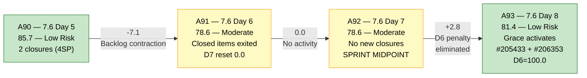
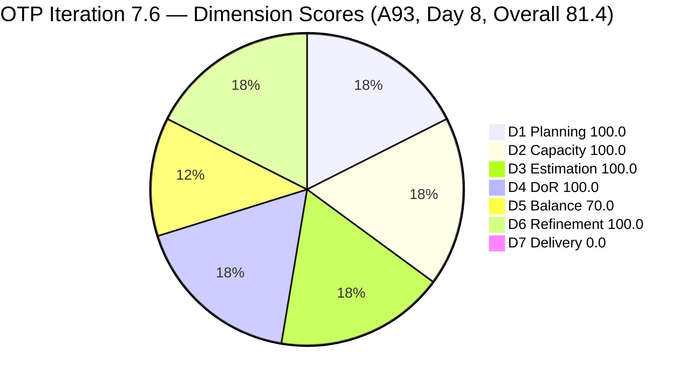
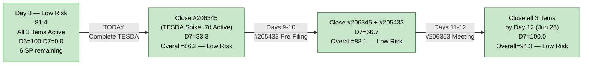
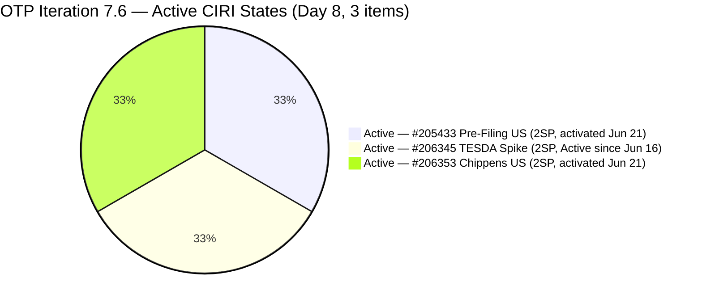

# ADO SAFe Audit — Office of the President (OTP Team)

## 1. Audit Metadata

| Field | Value |
|---|---|
| **Audit Date** | 2026-06-22 09:03 UTC |
| **Sprint Day** | **8 of 14** |
| **Prior Audit** | A92 — `AUDIT_20260621_0930.md` (Overall 78.6, Moderate Risk — 7.6 Day 7) |
| **ADO Project** | OTP (`e7739905-28a3-4ae1-9173-7f6cd13b3494`) |
| **ADO Team** | OTP Team |
| **Iteration** | Iteration 7.6 (`f27d43a8-3edb-46fd-8dd8-65aa5bdcf978`) |
| **Iteration Path** | `OTP\2026 - PI7\Iteration 7.6` |
| **Iteration Dates** | Jun 15, 2026 – Jun 28, 2026 |
| **Workspace Folder** | `ado_otp` |
| **Overall Score** | **81.4 — Low Risk** |
| **Risk Band** | Low (≥ 80) |
| **Planned Sprint Items (CIRI)** | 3 active root items (#205433, #206345, #206353) |
| **Visible Backlog Items (VRBI)** | 3 |
| **Capacity** | Grace: 2h/day (Documentation 1h + Requirements 1h) — configured |
| **Project Exception Applied** | Single-assignee model (Grace) — accepted per workspace CLAUDE.md |

---

## 2. Executive Summary

The OTP team has crossed into **Low Risk territory for the first time this sprint**, reaching **81.4** on Day 8 of 14. The score improvement of +2.8 points from A92 (78.6 → 81.4) is driven entirely by a decisive action Grace took on the evening of Jun 21: she activated both #205433 (Execute Pre-Filing Regulatory Compliance) and #206353 (Meeting with Chippens-Charles) — both of which had been in "Ready" state and were penalizing D6 with an untouched-CIRI flag. With all 3 CIRI items now in Active state, the D6 penalty is eliminated and the score crosses the Low Risk threshold.

The critical outstanding issue is D7 = 0.0 — no active CIRI items have been closed yet. With 6 days remaining (Days 8–13 before the Jun 28 finish), Grace must deliver at least one closure to register sprint delivery. The sprint is still recoverable to 94.3 (full closure of all 3 items), but execution must begin today.

---

## 3. Previous Audit Delta (A92 → A93)

| Dimension | A92 Score (7.6 Day 7) | A93 Score (7.6 Day 8) | Delta | Driver |
|---|---|---|---|---|
| D1 Iteration Planning | 100.0 | **100.0** | 0.0 | CIRI=3/VRBI=3. No changes to iteration membership. |
| D2 Team Capacity | 100.0 | **100.0** | 0.0 | Grace: 2h/day configured. 1/1. Unchanged. |
| D3 Estimation | 100.0 | **100.0** | 0.0 | All 3 CIRI items at 2 SP each. CSP = 6 SP. |
| D4 DoR Compliance | 100.0 | **100.0** | 0.0 | 3/3 CIRI items pass Desc + AC thresholds. |
| D5 Work Item Balance | 70.0 | **70.0** | 0.0 | US=2/3=66.7% → -30. Structural ceiling. |
| D6 Backlog Refinement | 80.0 | **100.0** | **+20.0** | #205433 activated Jun 21 (Ready→Active). #206353 activated Jun 21 (Ready→Active). All 3 CIRI items now have ChangedDate ≥ Jun 15 (iteration start). Untouched CIRI = 0/3 = 0% → -20 penalty eliminated. |
| D7 Delivery Predictability | 0.0 | **0.0** | 0.0 | No new closures. Active CIRI: 0 Closed. Day 8 — 3rd consecutive day at D7=0.0 (Days 6–8). |
| **Overall** | **78.6** | **81.4** | **+2.8** | D6 improvement from Grace activating both Ready items on Jun 21. Crossed Low Risk threshold. |

**Formula verification:** (100.0 + 100.0 + 100.0 + 100.0 + 70.0 + 100.0 + 0.0) / 7 = 570.0 / 7 = **81.4**

**Key observations A92 → A93:**
- **Grace acted on Recommendation #2 from A92.** Both #205433 and #206353 were changed from Ready → Active on Jun 21 at 22:22–22:23 UTC. This is the single biggest in-sprint quality improvement this audit cycle — it eliminated the D6 -20 penalty and moved the overall score from Moderate to Low Risk.
- **D6 fully restored to 100.0.** With all 3 CIRI items now having ChangedDate ≥ Jun 15, the untouched-CIRI ratio is 0/3 = 0%, zero stale items, zero stale_90, zero stale_180.
- **D7 = 0.0 for the 3rd consecutive audit.** Day 8 is now beyond the sprint midpoint. The active items are all in "Active" state — the conditions for closure are met. Closing #206345 (TESDA Exploration, Active since Jun 16) is the highest-priority action today.
- **#206345 has been Active for 7 sprint days (since Jun 16).** This is the most urgent delivery candidate.

---

## 4. Current Iteration Snapshot

| Metric | Value |
|---|---|
| **Sprint Day / Total** | **8 / 14 — Day after midpoint** |
| **Planned Items (CIRI — active backlog)** | 3 root items (#205433, #206345, #206353) |
| **Closed during sprint (exited backlog)** | 2 (#203864 TCT Jun 19, #206331 Visa Jun 18) — carried from prior sprint days |
| **Story Points Committed (CSP — active CIRI)** | 6 SP (3 × 2 SP) |
| **Story Points Closed (CLSP — active CIRI)** | 0 SP |
| **Sprint delivery to date (original scope)** | 4 SP of 10 SP = 40% (cumulative including exited items) |
| **Team Size (distinct CIRI assignees)** | 1 (Grace — all items) |
| **Total Remaining Capacity** | ~12 hours (6 days × 2h/day) |
| **Iteration Start / Finish** | Jun 15, 2026 – Jun 28, 2026 |

**Active CIRI State Distribution (Day 8):**

| ID | Title | Type | State | SP | Assignee | ChangedDate | Days Since Change | DoR |
|---|---|---|---|---|---|---|---|---|
| #205433 | Execute Pre-Filing Regulatory Compliance | User Story | Active | 2 | Grace | Jun 21 | **1 day** | Pass |
| #206345 | TESDA Exploration | Spike | Active | 2 | Grace | Jun 16 | **6 days** | Pass |
| #206353 | Meeting with Chippens-Charles | User Story | Active | 2 | Grace | Jun 21 | **1 day** | Pass |

**All 3 CIRI items are now Active.** #206345 has been Active for the longest duration (7 sprint days) and is the lead delivery candidate.

---

## 5. Work Item Analysis

### DoR Assessment (3 active CIRI items)

| ID | Title | Desc ≥ 30 NWS | AC ≥ 20 NWS | Result |
|---|---|---|---|---|
| #205433 | Execute Pre-Filing Regulatory Compliance | ✓ (BDD narrative: "As a Corporate Compliance Officer..." ~200+ NWS) | ✓ (2 BDD scenarios ~400+ NWS: Form/Signature Audit + Notarial Compliance) | **Pass** |
| #206345 | TESDA Exploration | ✓ (BDD narrative: "As a Program Manager at JIT..." ~180+ NWS) | ✓ (2 AC items ~280+ NWS: Partnership Pathway + Competency Matrix) | **Pass** |
| #206353 | Meeting with Chippens-Charles | ✓ (BDD narrative: "As a Marketing for Jairosoft..." ~150+ NWS) | ✓ (2 scenarios ~280+ NWS: Requirements Review + Feedback Capture) | **Pass** |

**DCI = 3/3. D4 = 100.0. Full DoR compliance sustained for 5 consecutive audits (A89–A93).**

### Type Distribution (3 active CIRI items)

| Type | Count | Share | D5 Impact |
|---|---|---|---|
| User Story | 2 (#205433, #206353) | 66.7% | US present ✓ (no -40). Dominant type > 60% → -30 penalty |
| Spike | 1 (#206345) | 33.3% | Spike < 40% — no penalty |
| **Total** | **3** | **100%** | D5 = max(0, 100 − 30) = **70.0** |

### Story Points Analysis

| ID | Title | Type | SP | State | Days Active in Sprint |
|---|---|---|---|---|---|
| #205433 | Execute Pre-Filing Regulatory Compliance | User Story | 2 | Active | 1 day (activated Jun 21) |
| #206345 | TESDA Exploration | Spike | 2 | Active | 7 days (Active since Jun 16) |
| #206353 | Meeting with Chippens-Charles | User Story | 2 | Active | 1 day (activated Jun 21) |

**Active CSP = 6 SP. CLSP = 0 SP. All 3 items are now in Active state — delivery-ready queue. Cumulative sprint delivery (including exited closures) = 4 SP of original 10 SP committed.**

---

## 6. SAFe Compliance Scorecard

| Dimension | Score | Band | Evidence | Notes |
|---|---|---|---|---|
| D1 Iteration Planning | **100.0** | Low | 3 CIRI / 3 VRBI | All 3 active backlog items assigned to Iteration 7.6. Ratio = 100.0. |
| D2 Team Capacity | **100.0** | Low | 1/1 contributor with capacity | Grace: 2h/day configured. Sole assignee on all 3 CIRI items. Project Exception applied. |
| D3 Estimation | **100.0** | Low | 3/3 CIRI items estimated | #205433(2SP), #206345(2SP), #206353(2SP). CSP = 6 SP. |
| D4 DoR Compliance | **100.0** | Low | 3 DCI / 3 CIRI | All 3 pass Desc ≥ 30 NWS + AC ≥ 20 NWS. BDD format standard sustained. |
| D5 Work Item Balance | **70.0** | Moderate | US=2/3=66.7% → -30 | US present (no -40). Dominant US share > 60% → -30. Spike < 40% (no -20). Sprint-locked ceiling. |
| D6 Backlog Refinement | **100.0** | Low | 3/3 fresh; 0/3 untouched | All 3 CIRI items have ChangedDate ≥ Jun 15 (iteration start). Zero stale_90, zero stale_180. Zero untouched penalty. **+20.0 improvement from A92.** |
| D7 Delivery Predictability | **0.0** | Critical | 0 SP closed / 6 SP committed | Active CIRI: 0 Closed items. Day 8 — 3rd consecutive audit at D7=0.0. All items now Active. |
| **OVERALL** | **81.4** | **Low Risk** | (100+100+100+100+70+100+0)/7 | +2.8 from A92. First Low Risk score this sprint. Grace's Jun 21 activations were decisive. |

**Formula verification:** (100.0 + 100.0 + 100.0 + 100.0 + 70.0 + 100.0 + 0.0) / 7 = 570.0 / 7 = **81.4**

---

## 7. Dimension Findings

### D1 — Iteration Planning: 100.0 / 100 — Low Risk

**Formula:** CIRI / VRBI × 100 = 3 / 3 × 100 = **100.0**

| Metric | Value |
|---|---|
| Visible backlog items (VRBI) | 3 (active root items in scoped backlog) |
| Current iteration root items (CIRI) | 3 (all assigned to `OTP\2026 - PI7\Iteration 7.6`) |
| Closed items (exited backlog during sprint) | 2 (#203864 TCT Jun 19, #206331 Visa Jun 18 — exited on Days 4–5) |
| Score | **100.0** |

D1 = 100.0 maintained. VRBI and CIRI remain symmetrically contracted at 3 each. With 6 remaining sprint days and all items now Active, a pull-in remains possible if Grace delivers ahead of schedule. Any pull-in must also be assigned to Iteration 7.6 to preserve D1 ≥ 100.0.

---

### D2 — Team Capacity: 100.0 / 100 — Low Risk

**Formula:** CC / CW × 100 = 1 / 1 × 100 = **100.0**

Grace is the sole assignee on all 3 active CIRI items. Capacity = 2h/day (Documentation 1h + Requirements 1h). Remaining capacity = approximately 12 hours (6 days × 2h/day). The single-assignee model is accepted per workspace Project Exception. Grace's Jun 21 activations (two state transitions within 1 minute) demonstrate continued engagement.

---

### D3 — Estimation: 100.0 / 100 — Low Risk

**Formula:** ECI / PECI × 100 = 3 / 3 × 100 = **100.0**

All 3 CIRI items carry 2 SP each. CSP = 6 SP. Uniform 2 SP sizing is consistent with OTP PI7 standards. No unestimated items. If a pull-in item is added, it must carry SP > 0 to preserve D3.

---

### D4 — DoR Compliance: 100.0 / 100 — Low Risk

**Formula:** DCI / CIRI × 100 = 3 / 3 × 100 = **100.0**

All 3 active CIRI items pass DoR thresholds: Description ≥ 30 non-whitespace characters AND Acceptance Criteria ≥ 20 non-whitespace characters. BDD narrative format sustained across all items. No regressions for 5 consecutive audits (A89–A93).

---

### D5 — Work Item Balance: 70.0 / 100 — Moderate Risk

**Formula:** Base 100 − penalties

| Penalty | Trigger | Applied |
|---|---|---|
| -40: No User Story in CIRI | 2 User Stories present (#205433, #206353) | **No** |
| -30: Dominant type share > 60% | US = 2/3 = **66.7%** > 60% | **YES** |
| -20: Spike share > 40% | Spike = 1/3 = 33.3% | **No** |

**Score:** max(0, 100 − 30) = **70.0**

D5 = 70.0 is the structural ceiling for this 3-item sprint. No in-sprint fix is available. PI8 planning action: target US ≤ 60% (2/4 = 50% in a 4-item sprint, or 1/3 = 33% in a 3-item sprint with a different mix).

---

### D6 — Backlog Refinement: 100.0 / 100 — Low Risk

**Freshness window:** ChangedDate ≥ 2026-05-08 (45 days before 2026-06-22)

| Metric | Value |
|---|---|
| Total VRBI | 3 |
| Fresh items (ChangedDate ≥ May 8, 2026) | 3 — #205433 (Jun 21), #206345 (Jun 16), #206353 (Jun 21) |
| Stale_90 items (ChangedDate < Mar 24, 2026) | 0 |
| Stale_180 items (ChangedDate < Dec 24, 2025) | 0 |
| Untouched CIRI (ChangedDate < Jun 15 — iteration start) | 0 — all items activated/changed on or after Jun 15 |

**Base = 3/3 × 100 = 100.0**
**Penalties:**
- Stale_90: 0/3 = 0% → No penalty
- Stale_180: 0 items → No penalty
- Untouched CIRI: 0/3 = 0% → No penalty

**Score: 100.0** (+20.0 from A92's 80.0)

Grace's Jun 21 state changes (#205433 Ready→Active at 22:22 UTC, #206353 Ready→Active at 22:23 UTC) reset both items' ChangedDate to Jun 21 — fully eliminating the untouched-CIRI penalty that had been active for 7 consecutive audits (#205433 untouched since Jun 7). The -20 penalty has been resolved.

---

### D7 — Delivery Predictability: 0.0 / 100 — Critical

**Formula:** CLSP / CSP × 100 = 0 / 6 × 100 = **0.0**

| Metric | Value |
|---|---|
| Estimated CIRI items (SP > 0) | 3 (#205433=2SP, #206345=2SP, #206353=2SP) |
| Committed Story Points (CSP) | 6 SP |
| Closed Story Points (CLSP) | 0 SP (no active CIRI items are Closed or Done) |
| Score | **0.0** |
| Days at D7=0.0 (consecutive active sprint audits) | 3 (A91 + A92 + A93) |

**Sprint context:** D7 = 0.0 reflects the active-backlog formula. Cumulative sprint delivery = 4 SP (2 items closed on Days 4–5 and exited the backlog). The formula cannot credit exited items — D7 recovers the moment Grace closes the next active CIRI item.

**Day 8 — beyond the early-sprint annotation window.** All 3 items are now in Active state. The conditions for closing #206345 (TESDA Exploration, Active for 7 sprint days) are fully met. This is the highest-priority action.

**Recovery projections from Day 8:**

| Scenario | CLSP/CSP | D7 | Overall |
|---|---|---|---|
| Close #206345 (TESDA, 2SP) | 2/6 | 33.3 | 83.8 — Low Risk |
| Close #206345 + #205433 (4SP) | 4/6 | 66.7 | 88.1 — Low Risk |
| Close all 3 remaining (6SP) | 6/6 | 100.0 | 94.3 — Low Risk |
| Best-case by Day 12 (Jun 26) | 6/6 | 100.0 | **94.3 — Low Risk** |

---

## 8. Risks and Bottlenecks

| # | Severity | Dimension | Risk | Recommended Action |
|---|---|---|---|---|
| R1 | **CRITICAL** | D7 | D7 = 0.0 at Day 8. 3rd consecutive audit with zero active CIRI closures. 6 sprint days remaining (Days 8–13). #206345 (TESDA Exploration) has been Active for 7 sprint days at 2 SP. | **TODAY:** Grace closes #206345 (TESDA Exploration, Active since Jun 16). Research spike at 2 SP — this item has been in Active state for 7 days. Standard 2 SP Spike cadence is 2–3 days Active. Closing it: D7 = 33.3, Overall = 83.8. |
| R2 | **HIGH** | Sprint trajectory | Day 8 with 6 remaining days and 6 SP committed in Active CIRI. At 2h/day remaining, Grace has ~12 hours for all 3 items. Full delivery (3 items, 6 SP) requires ~1 closure every 2 days. Historically achievable at Grace's pace. | Monitor: if no closure by end of Day 9 (Jun 23), escalate to Ramon for a blocker check. |
| R3 | **MODERATE** | D5 (structural) | US share = 66.7% → -30 dominant type penalty. Sprint-locked ceiling at D5 = 70.0. Score ceiling without D7 = 87.1; with D7 = 100.0 ceiling is 94.3. | No in-sprint fix. PI8 planning: target sprint composition with ≤ 60% single type. |
| R4 | **LOW** | D1 (opportunity) | 3 active items, 6 remaining days. Capacity permits 1 pull-in if Grace delivers early. | Ramon: identify 1 DoR-ready pull-in item (Desc ≥ 30 NWS, AC ≥ 20 NWS, SP > 0) for potential pull-in after #206345 closes. |

---

## 9. Prioritized Recommendations

1. **[TODAY — CRITICAL, D7 recovery]** Grace: close #206345 (TESDA Exploration, Active since Jun 16, 2 SP). This research Spike has been Active for 7 sprint days. The AC is fully written (TESDA Partnership Pathway + Competency Matrix scenarios). Closing it today:
   - D7 = 2/6 × 100 = 33.3
   - Overall = (100+100+100+100+70+100+33.3)/7 = 603.3/7 = **86.2 → Low Risk**
   - Breaks the 3-audit D7=0.0 streak.

2. **[THIS WEEK, D7 continuation]** After #206345 closes: Grace activates and executes #205433 (Execute Pre-Filing Regulatory Compliance). The item is newly Active as of Jun 21 — it is ready for work. At 2h/day, this regulatory compliance audit fits within 2 sprint days.

3. **[THIS WEEK, D7 completion]** Grace schedules the meeting for #206353 (Meeting with Chippens-Charles, Active as of Jun 21, 2SP). Meeting + MoM documentation is a 1-day closure event at 2h capacity.

4. **[SPRINT COMPLETION PROJECTION]** Full closure of all 3 items by Day 12 (Jun 26) yields:
   - D7 = 100.0, D6 = 100.0, D5 = 70.0
   - Overall = **94.3 — Low Risk** (best possible score for this sprint)

5. **[PI8 PLANNING — D5]** For future sprints: a 4-item sprint with 2 User Stories + 1 Spike + 1 Enabler gives US = 50% → no dominant-type penalty → D5 = 100.0. Current 3-item sprint format with 2 US + 1 Spike = 66.7% US is the structural D5 ceiling.

---

## 10. Evidence Gaps and Limitations

| Gap | Impact | Notes |
|---|---|---|
| **D7 = 0.0 — formula scope vs. sprint delivery** | Score understatement | Active-backlog formula excludes 4 SP delivered (Days 4–5). Cumulative sprint delivery = 40% of original scope. D7 recovers upon next active-CIRI closure. |
| **Single-assignee model** | Structural concentration risk | Project Exception in place. Grace is the sole delivery channel. 6 days remaining. No identified backup. |
| **D5 = 70.0 — sprint-locked ceiling** | -30 pts structural | US share 66.7% exceeds 60% threshold. No in-sprint fix. PI8 planning action required. |
| **SP uniformity (all 2 SP)** | Minor sizing signal loss | Uniform 2 SP across all items limits relative sizing signal. Acceptable for OTP's small-sprint format. |
| **#206345 Active duration** | Stale spike risk | Item has been Active for 7 sprint days (Jun 16). At 2 SP, standard expected Active duration is 2–3 days. Must close today to prevent further staleness. |

---

## 11. Visualizations

### Score Trend — A90 through A93

### Dimension Scores — A93 (Day 8, Overall 81.4)

### Sprint Recovery Path — Day 8 (Post-Midpoint)

### CIRI State Distribution — Day 8 (3 items, all Active)

---

## 12. Audit Trail

| Source | Tool | Data |
|---|---|---|
| Current iteration | `work_list_team_iterations` (project `e7739905`, team `OTP Team`, timeframe=current) | Iteration 7.6: Jun 15–28, 2026; ID `f27d43a8-3edb-46fd-8dd8-65aa5bdcf978` |
| Backlog items | `wit_list_backlog_work_items` (project `e7739905`, team `OTP Team`, backlogId `Microsoft.RequirementCategory`) | 3 active items: #205433, #206345, #206353 |
| Work item details | `wit_get_work_items_batch_by_ids` (#205433, #206345, #206353) | State, SP, Type, Desc, AC, ChangedDate, IterationPath, AssignedTo confirmed for all items |
| Team capacity | `work_get_iteration_capacities` (project `e7739905`, iterationId `f27d43a8`) | OTP Team: 2h/day total; Grace: Documentation 1h + Requirements 1h |
| Prior audit | `AUDIT_20260621_0930.md` (A92) | Overall 78.6, Moderate Risk, 7.6 Day 7, 3 CIRI, 6 SP committed, 0 SP closed |
| ADO org | `jairo` (dev.azure.com/jairo) | OTP Project ID confirmed: `e7739905-28a3-4ae1-9173-7f6cd13b3494` |
