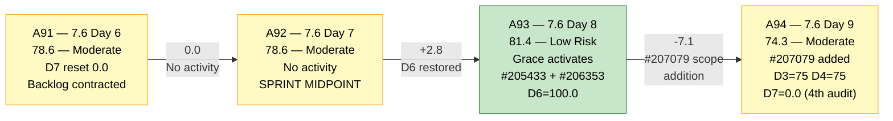
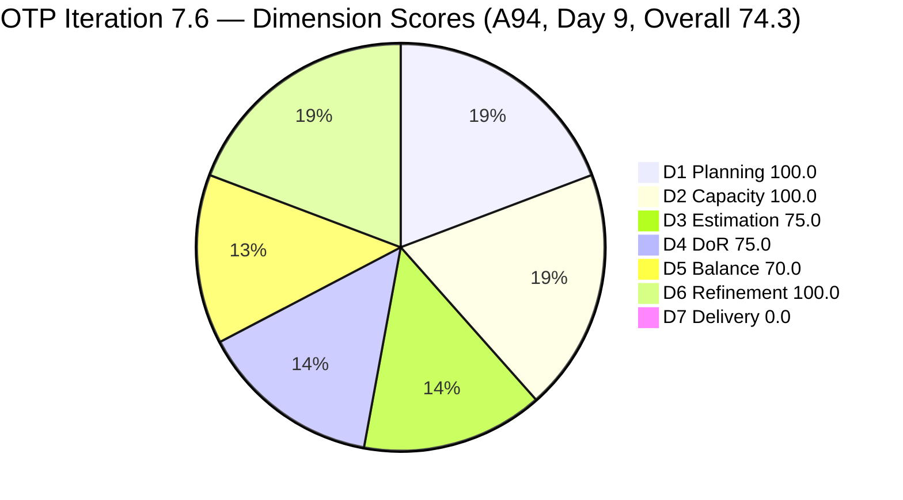
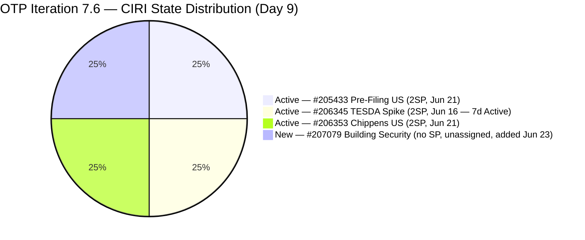
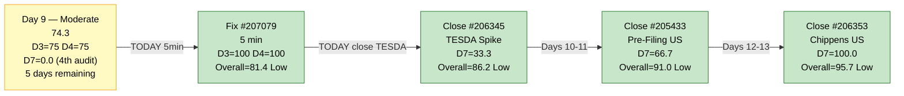

# ADO SAFe Audit — Office of the President (OTP Team)

## 1. Audit Metadata

| Field | Value |
|---|---|
| **Audit Date** | 2026-06-23 09:03 UTC |
| **Sprint Day** | **9 of 14** |
| **Prior Audit** | A93 — `AUDIT_20260622_0903.md` (Overall 81.4, Low Risk — 7.6 Day 8) |
| **ADO Project** | OTP (`e7739905-28a3-4ae1-9173-7f6cd13b3494`) |
| **ADO Team** | OTP Team |
| **Iteration** | Iteration 7.6 (`f27d43a8-3edb-46fd-8dd8-65aa5bdcf978`) |
| **Iteration Path** | `OTP\2026 - PI7\Iteration 7.6` |
| **Iteration Dates** | Jun 15, 2026 – Jun 28, 2026 |
| **Workspace Folder** | `ado_otp` |
| **Overall Score** | **74.3 — Moderate Risk** |
| **Risk Band** | Moderate (60–79.9) |
| **Visible Backlog Items (VRBI)** | 4 (new item #207079 added today) |
| **Current Iteration Root Items (CIRI)** | 4 (all in Iteration 7.6) |
| **Capacity** | Grace: 2h/day (Documentation 1h + Requirements 1h) — configured |
| **Project Exception Applied** | Single-assignee model (Grace) — accepted per workspace CLAUDE.md |

---

## 2. Executive Summary

The OTP team has **regressed from Low Risk to Moderate Risk** on Day 9 of 14, dropping from 81.4 to **74.3** (-7.1 points). The score drop is driven entirely by the addition of a new work item, **#207079 (Building Security)**, which entered the active backlog today (Jun 23 at 03:39 UTC) assigned to Iteration 7.6 but is **completely unprepared**: no assignee, no Story Points, no Description, and no Acceptance Criteria. This single unready item has simultaneously degraded D3 (Estimation) from 100.0 to 75.0 and D4 (DoR Compliance) from 100.0 to 75.0 — erasing the last two perfect-score dimensions that had been holding the sprint in Low Risk territory.

A second critical issue persists: **D7 = 0.0 for the 4th consecutive audit** (A91–A94). No active CIRI items have been closed. With 5 sprint days remaining (Days 9–13), grace must close at least one item today to register delivery. The highest-priority action remains #206345 (TESDA Exploration, Active since Jun 16 — 7 sprint days).

The sprint can recover to Low Risk if: (1) #207079 is immediately remediated (assignee, SP, Desc, AC) or deferred out of this iteration, and (2) at least one active CIRI item is closed today.

---

## 3. Previous Audit Delta (A93 → A94)

| Dimension | A93 Score (7.6 Day 8) | A94 Score (7.6 Day 9) | Delta | Driver |
|---|---|---|---|---|
| D1 Iteration Planning | 100.0 | **100.0** | 0.0 | CIRI=4/VRBI=4. New item #207079 added to both backlog and Iteration 7.6 — ratio unchanged at 100.0. |
| D2 Team Capacity | 100.0 | **100.0** | 0.0 | Grace: 2h/day configured. 1/1 contributors with work have capacity. #207079 unassigned — not counted in D2 contributors_with_current_work. |
| D3 Estimation | 100.0 | **75.0** | **-25.0** | #207079 (User Story, New) added with no Story Points. point_eligible = 4, estimated = 3. Score = 3/4 × 100 = 75.0. |
| D4 DoR Compliance | 100.0 | **75.0** | **-25.0** | #207079 has no Description and no Acceptance Criteria — DoR Fail. DCI = 3/4. Score = 3/4 × 100 = 75.0. |
| D5 Work Item Balance | 70.0 | **70.0** | 0.0 | US = 3/4 = 75% > 60% → -30 dominant penalty. US present (no -40). Spike = 1/4 = 25% < 40%. Structural ceiling unchanged. |
| D6 Backlog Refinement | 100.0 | **100.0** | 0.0 | 4/4 VRBI fresh (all ≥ May 9). #207079 ChangedDate = Jun 23. 0 stale_90, 0 stale_180. 0/4 untouched (all ≥ Jun 15). No penalties. |
| D7 Delivery Predictability | 0.0 | **0.0** | 0.0 | No closures. Active CIRI: 0 Closed. Day 9 — **4th consecutive audit at D7=0.0 (A91–A94)**. |
| **Overall** | **81.4** | **74.3** | **-7.1** | #207079 scope addition without preparation degraded D3 and D4. Regressed from Low Risk to Moderate Risk. |

**Formula verification:** (100.0 + 100.0 + 75.0 + 75.0 + 70.0 + 100.0 + 0.0) / 7 = 520.0 / 7 = **74.3**

**Key observations A93 → A94:**
- **#207079 (Building Security) was added to Iteration 7.6 at 03:39 UTC today.** It is a User Story with no assignee, no SP, no Description, no Acceptance Criteria. It is the sole driver of the -7.1 point regression. The item breaches the core SAFe DoR principle of "no item enters a sprint unready."
- **D3 and D4 are no longer perfect.** Both sat at 100.0 for 5 consecutive audits (A89–A93). The single unready item has degraded both to 75.0.
- **D7 = 0.0 for the 4th consecutive audit.** The window is narrowing: only 5 sprint days remain. #206345 (TESDA Exploration) has been Active for 7 sprint days (since Jun 16) with completed AC. Continued non-closure is the single largest scoring risk in the sprint.
- **D1 = 100.0 is preserved.** Because #207079 was also assigned to Iteration 7.6, the CIRI/VRBI ratio remains 4/4 = 100.0. If #207079 were deferred to a future iteration, D1 would drop to 3/3 = 100.0 (backlog would contract to 3).

---

## 4. Current Iteration Snapshot

| Metric | Value |
|---|---|
| **Sprint Day / Total** | **9 / 14** |
| **Visible Backlog Items (VRBI)** | 4 (was 3 — #207079 added Jun 23) |
| **Planned Items (CIRI — active backlog)** | 4 root items (#205433, #206345, #206353, #207079) |
| **Closed during sprint (exited backlog)** | 2 (#203864 TCT Jun 19, #206331 Visa Jun 18) |
| **Story Points Committed (CSP — estimated CIRI)** | 6 SP (3 × 2 SP; #207079 unestimated) |
| **Story Points Closed (CLSP — estimated CIRI)** | 0 SP |
| **Sprint delivery to date (original scope)** | 4 SP of 10 SP = 40% (cumulative including exited items) |
| **Team Size (distinct CIRI assignees with items)** | 1 (Grace on 3 items; #207079 unassigned) |
| **Total Remaining Capacity** | ~10 hours (5 days × 2h/day) |
| **Iteration Start / Finish** | Jun 15, 2026 – Jun 28, 2026 |

**Active CIRI State Distribution (Day 9):**

| ID | Title | Type | State | SP | Assignee | ChangedDate | Days Since Change | DoR |
|---|---|---|---|---|---|---|---|---|
| #205433 | Execute Pre-Filing Regulatory Compliance | User Story | Active | 2 | Grace | Jun 21 | 2 days | Pass |
| #206345 | TESDA Exploration | Spike | Active | 2 | Grace | Jun 16 | 7 days | Pass |
| #206353 | Meeting with Chippens-Charles | User Story | Active | 2 | Grace | Jun 21 | 2 days | Pass |
| #207079 | Building Security | User Story | New | — | **Unassigned** | Jun 23 | **0 days (added today)** | **Fail — no Desc, no AC** |

**#207079 is a sprint-integrity risk.** An unassigned, unestimated, undocumented User Story in the active sprint is a scope-control breach. It must be remediated (assignee + SP + Desc + AC) or deferred today.

---

## 5. Work Item Analysis

### DoR Assessment (4 active CIRI items)

| ID | Title | Desc ≥ 30 NWS | AC ≥ 20 NWS | Result |
|---|---|---|---|---|
| #205433 | Execute Pre-Filing Regulatory Compliance | ✓ (BDD narrative ~200+ NWS) | ✓ (2 BDD scenarios ~400+ NWS) | **Pass** |
| #206345 | TESDA Exploration | ✓ (BDD narrative ~180+ NWS) | ✓ (2 AC items ~280+ NWS) | **Pass** |
| #206353 | Meeting with Chippens-Charles | ✓ (BDD narrative ~150+ NWS) | ✓ (2 scenarios ~280+ NWS) | **Pass** |
| #207079 | Building Security | ✗ (no Description field) | ✗ (no AC field) | **Fail — both missing** |

**DCI = 3/4. D4 = 75.0. First DoR regression in 5 audits (was 100.0 at A89–A93).**

**Minimum remediation for #207079 to pass DoR:**
- **Description (30+ NWS):** *"Research and define security requirements for Jairosoft building access and physical security infrastructure, including access control systems, CCTV coverage, entry/exit logging, and emergency response procedures."*
- **Acceptance Criteria (20+ NWS):** *"Building security requirements documented. Access control system options evaluated with cost estimate. Recommendations approved by Ramon. Implementation timeline defined."*
- **Assignee:** Assign to Grace (consistent with OTP single-assignee model).
- **Story Points:** Assign SP (suggested: 2 SP, consistent with OTP PI7 sizing standard).

### Type Distribution (4 active CIRI items)

| Type | Count | Share | D5 Impact |
|---|---|---|---|
| User Story | 3 (#205433, #206353, #207079) | 75.0% | US present ✓ (no -40). Dominant type > 60% → **-30 penalty** |
| Spike | 1 (#206345) | 25.0% | Spike < 40% — no -20 penalty |
| **Total** | **4** | **100%** | D5 = max(0, 100 − 30) = **70.0** |

D5 ceiling remains at 70.0 due to US dominance. The addition of #207079 (another User Story) deepens the imbalance from 66.7% to 75.0% — but the penalty band does not change (both > 60%, both trigger -30).

### Story Points Analysis

| ID | Title | Type | SP | State | Notes |
|---|---|---|---|---|---|
| #205433 | Execute Pre-Filing Regulatory Compliance | User Story | 2 | Active | Active since Jun 21 — 2 days |
| #206345 | TESDA Exploration | Spike | 2 | Active | **Active since Jun 16 — 7 sprint days. Lead closure candidate.** |
| #206353 | Meeting with Chippens-Charles | User Story | 2 | Active | Active since Jun 21 — 2 days |
| #207079 | Building Security | User Story | **—** | New | **Unestimated. Must add SP before any work begins.** |

**CSP = 6 SP (estimated items only). CLSP = 0 SP. #207079 contributes 0 SP until estimated.**

---

## 6. SAFe Compliance Scorecard

| Dimension | Score | Band | Evidence | Notes |
|---|---|---|---|---|
| D1 Iteration Planning | **100.0** | Low | 4 CIRI / 4 VRBI | All 4 backlog items assigned to Iteration 7.6. Ratio = 100.0. #207079 added to 7.6 today. |
| D2 Team Capacity | **100.0** | Low | 1/1 contributors with capacity | Grace: 2h/day configured. Sole assignee on 3 CIRI items. #207079 unassigned — not a D2 contributor. Project Exception applied. |
| D3 Estimation | **75.0** | Moderate | 3/4 estimated | #205433(2SP), #206345(2SP), #206353(2SP). **#207079 unestimated — sole regression driver.** |
| D4 DoR Compliance | **75.0** | Moderate | 3 DCI / 4 CIRI | Pass: #205433, #206345, #206353. **Fail: #207079 (no Desc, no AC). First regression in 5 audits.** |
| D5 Work Item Balance | **70.0** | Moderate | US=3/4=75% → -30 | US present (no -40). Dominant US share > 60% → -30. Spike 25% < 40% (no -20). Sprint-locked ceiling. |
| D6 Backlog Refinement | **100.0** | Low | 4/4 fresh; 0/4 untouched | All 4 VRBI changed ≥ Jun 15. 0 stale_90, 0 stale_180. 0 untouched. No penalties. |
| D7 Delivery Predictability | **0.0** | Critical | 0 SP closed / 6 SP committed | Active CIRI: 0 Closed items. Day 9 — **4th consecutive audit at D7=0.0**. #207079 unestimated — not in CSP. |
| **OVERALL** | **74.3** | **Moderate Risk** | (100+100+75+75+70+100+0)/7 | **-7.1 from A93 (Low Risk).** Single unready item (#207079) caused regression from Low to Moderate Risk. |

**Formula verification:** (100.0 + 100.0 + 75.0 + 75.0 + 70.0 + 100.0 + 0.0) / 7 = 520.0 / 7 = **74.3**

---

## 7. Dimension Findings

### D1 — Iteration Planning: 100.0 / 100 — Low Risk

**Formula:** CIRI / VRBI × 100 = 4 / 4 × 100 = **100.0**

| Metric | Value |
|---|---|
| Visible backlog items (VRBI) | 4 (active root items in scoped backlog) |
| Current iteration root items (CIRI) | 4 (all assigned to `OTP\2026 - PI7\Iteration 7.6`) |
| Score | **100.0** |

D1 = 100.0 is preserved because #207079 was assigned to Iteration 7.6 at creation. VRBI expanded from 3 to 4 and CIRI from 3 to 4 simultaneously — the ratio remains perfect. If #207079 is deferred to PI8 or a future iteration, VRBI drops to 3 and CIRI to 3, preserving D1 = 100.0 (alternative formula applies to the contracted backlog).

---

### D2 — Team Capacity: 100.0 / 100 — Low Risk

**Formula:** CC / CW × 100 = 1 / 1 × 100 = **100.0**

Grace is the sole assignee on the 3 established CIRI items (#205433, #206345, #206353). #207079 has no assignee — it does not count as a CIRI contributor. Capacity = 2h/day (Documentation 1h + Requirements 1h). Remaining capacity = approximately 10 hours (5 days × 2h/day). The single-assignee model is accepted per workspace Project Exception.

**D2 risk signal:** If #207079 is assigned to Grace (the expected action given the OTP single-assignee model), she now carries 4 CIRI items with 5 sprint days remaining. At 2h/day, throughput is limited — prioritization is critical.

---

### D3 — Estimation: 75.0 / 100 — Moderate Risk

**Formula:** ECI / PECI × 100 = 3 / 4 × 100 = **75.0**

| ID | Title | Type | SP | Point-Eligible |
|---|---|---|---|---|
| #205433 | Execute Pre-Filing Regulatory Compliance | User Story | 2 | ✓ Estimated |
| #206345 | TESDA Exploration | Spike | 2 | ✓ Estimated |
| #206353 | Meeting with Chippens-Charles | User Story | 2 | ✓ Estimated |
| #207079 | Building Security | User Story | **—** | ✓ Point-eligible — **Unestimated** |

**Score regressed from 100.0 to 75.0 due solely to #207079.** Fix: assign 2 SP to #207079 (consistent with OTP PI7 sizing). D3 returns to 100.0 immediately.

---

### D4 — DoR Compliance: 75.0 / 100 — Moderate Risk

**Formula:** DCI / CIRI × 100 = 3 / 4 × 100 = **75.0**

#207079 (Building Security) entered the sprint with no Description and no Acceptance Criteria. This is the first DoR failure after 5 consecutive 100.0 audits (A89–A93). The remediation text is provided in Section 5. Combined with SP assignment, the fix takes approximately 5 minutes in ADO.

**If #207079 is remediated today:** D4 returns to 100.0. Overall score recovers to (100+100+100+100+70+100+0)/7 = 570/7 = **81.4 — Low Risk** (matching A93 before the regression).

---

### D5 — Work Item Balance: 70.0 / 100 — Moderate Risk

**Formula:** Base 100 − penalties

| Penalty | Trigger | Applied |
|---|---|---|
| -40: No User Story in CIRI | 3 User Stories present | **No** |
| -30: Dominant type share > 60% | US = 3/4 = **75.0%** > 60% | **YES** |
| -20: Spike share > 40% | Spike = 1/4 = 25.0% | **No** |

**Score:** max(0, 100 − 30) = **70.0**

D5 = 70.0 is the structural ceiling for this 4-item sprint. The US dominance deepened from 66.7% (3 items) to 75.0% (4 items) with the addition of #207079, but the penalty tier is unchanged (> 60% → -30 in both cases). No in-sprint fix available.

---

### D6 — Backlog Refinement: 100.0 / 100 — Low Risk

**Freshness window:** ChangedDate ≥ 2026-05-09 (45 days before 2026-06-23)

| Metric | Value |
|---|---|
| Total VRBI | 4 |
| Fresh items (ChangedDate ≥ May 9, 2026) | 4 — #205433 (Jun 21), #206345 (Jun 16), #206353 (Jun 21), #207079 (Jun 23) |
| Stale_90 items (ChangedDate < Mar 25, 2026) | 0 |
| Stale_180 items (ChangedDate < Dec 25, 2025) | 0 |
| Untouched CIRI (ChangedDate < Jun 15, 2026) | 0 — all items changed on or after Jun 15 (or Jun 23 for #207079) |

**Base = 4/4 × 100 = 100.0**
**Penalties:** None.

**Score: 100.0** (unchanged from A93)

#207079's Jun 23 ChangedDate ensures it is fresh and not untouched. D6 is fully insulated from the #207079 addition.

---

### D7 — Delivery Predictability: 0.0 / 100 — Critical

**Formula:** CLSP / CSP × 100 = 0 / 6 × 100 = **0.0**

| Metric | Value |
|---|---|
| Estimated CIRI items (SP > 0) | 3 (#205433=2SP, #206345=2SP, #206353=2SP) |
| Committed Story Points (CSP) | 6 SP (#207079 excluded — unestimated) |
| Closed Story Points (CLSP) | 0 SP |
| Score | **0.0** |
| Consecutive audits at D7=0.0 | **4 (A91, A92, A93, A94)** |

**Day 9 — well past the early-sprint annotation window.** Five days remain (Days 9–13 before Jun 28 finish). The 4-audit D7=0.0 streak is the sprint's most critical performance gap. #206345 (TESDA Exploration) has been Active for 7 sprint days (Jun 16). At 2 SP and with full AC in place, this item is ready to close and is the immediate priority.

**Recovery projections from Day 9:**

| Scenario | CLSP/CSP | D7 | Overall |
|---|---|---|---|
| Close #206345 (TESDA, 2SP) | 2/6 | 33.3 | 76.9 — Moderate Risk |
| Fix #207079 (SP + DoR) + Close #206345 | 2/6 | 33.3 | **81.4 — Low Risk** |
| Fix #207079 + Close all 3 original items (6SP) | 6/6 | 100.0 | **91.4 — Low Risk** |
| Full remediation + Close all 3 items (best case Day 13) | 6/6 | 100.0 | **91.4 — Low Risk** |

Note: If #207079 is also estimated (2 SP) and then closed, CSP becomes 8 SP and full closure = 100.0, pushing overall to (100+100+100+100+70+100+100)/7 = 95.7.

---

## 8. Risks and Bottlenecks

| # | Severity | Dimension | Risk | Recommended Action |
|---|---|---|---|---|
| R1 | **CRITICAL** | D3 + D4 | #207079 (Building Security) entered Iteration 7.6 today with no assignee, no SP, no Desc, no AC. It is a sprint-integrity breach. It degraded D3 and D4 from 100.0 to 75.0 each, causing a -7.1 regression from Low Risk to Moderate Risk. | **TODAY (5 min):** Assign to Grace. Add SP (2). Add Description (see Section 5 template). Add Acceptance Criteria (see Section 5 template). D3 and D4 return to 100.0. Overall → 81.4 — Low Risk. |
| R2 | **CRITICAL** | D7 | D7 = 0.0 for 4th consecutive audit (Days 6–9). 5 sprint days remain. #206345 (TESDA Exploration) has been Active for 7 sprint days. The research Spike is fully written — AC in place, BDD format complete. Continued non-closure is unacceptable at Day 9. | **TODAY:** Grace closes #206345 (TESDA Exploration, Active since Jun 16, 2 SP). D7 = 33.3. Combined with R1 fix: Overall = 81.4 — Low Risk. Without R1 fix: Overall = 76.9 — Moderate Risk. |
| R3 | **HIGH** | Sprint trajectory | Day 9. 5 days remain. Currently 4 CIRI items (3 Active, 1 New-unready). Grace must deliver minimum 2 closures before Day 13 to avoid a below-50 D7 ending. If only 1 closure: D7 = 33.3 or 16.7 depending on whether #207079 is estimated. | Monitor: if no closure by EOD Jun 23, escalate to Ramon. |
| R4 | **MODERATE** | D5 (structural) | US share = 75% → -30 dominant type penalty. Sprint-locked ceiling at D5 = 70.0. | No in-sprint fix. PI8 planning: target sprint composition with ≤ 60% single type. |
| R5 | **LOW** | Scope management | #207079 arrived in the sprint at Day 9 without preparation or planning. This is late-sprint scope addition. If accepted, it reduces Grace's throughput window for the 3 existing Active items. Ramon must decide: remediate and keep, or defer to PI8. | Ramon decides today: keep with full remediation, or move #207079 out of Iteration 7.6 (D1 remains 100.0 under either path if VRBI and CIRI contract together). |

---

## 9. Prioritized Recommendations

1. **[TODAY — CRITICAL — R1, D3+D4 recovery]** Remediate #207079 (Building Security) — 5 minutes in ADO:
   - Assign to: Grace
   - Story Points: 2 SP
   - Description: *"Research and define security requirements for Jairosoft building access and physical security infrastructure, including access control systems, CCTV coverage, entry/exit logging, and emergency response procedures."*
   - Acceptance Criteria: *"Building security requirements documented. Access control system options evaluated with cost estimate. Recommendations approved by Ramon. Implementation timeline defined."*
   - **Result:** D3 = 100.0, D4 = 100.0. Overall = 81.4 — Low Risk (recovers to A93 baseline).

2. **[TODAY — CRITICAL — R2, D7 recovery]** Grace closes #206345 (TESDA Exploration, Active since Jun 16, 2 SP). The research spike AC is complete. Two BDD scenarios are fully documented. Day 7 Active is beyond any reasonable 2 SP research spike cadence:
   - D7 = 2/6 × 100 = 33.3
   - Combined with Rec #1: Overall = (100+100+100+100+70+100+33.3)/7 = 603.3/7 = **86.2 — Low Risk**

3. **[SPRINT WEEK — Days 10–12, D7 progression]** After #206345 closes, Grace executes and closes #205433 (Execute Pre-Filing Regulatory Compliance, Active Jun 21):
   - D7 = 4/6 × 100 = 66.7
   - Combined with Rec #1: Overall = (100+100+100+100+70+100+66.7)/7 = **91.0 — Low Risk**

4. **[SPRINT END — Day 13, D7 completion]** Grace schedules and completes #206353 (Meeting with Chippens-Charles, Active Jun 21). Meeting + MoM documentation within remaining capacity:
   - D7 = 6/6 × 100 = 100.0
   - Combined with Recs #1–3: Overall = (100+100+100+100+70+100+100)/7 = **95.7 — Low Risk** (best possible score)

5. **[PI8 PLANNING — D5 structural fix]** Design PI8 sprint composition to avoid US-dominant loading: target 1 User Story + 1 Enabler + 1 Spike = US = 33.3% (no dominant penalty) → D5 = 100.0. Or 2 US + 2 non-US items = US = 50% → D5 = 100.0.

6. **[PROCESS — SCOPE CONTROL]** Establish a lightweight "sprint gate" rule for OTP: any new item added mid-sprint (after Day 5) must have Description + AC + SP + Assignee completed before the iteration path is assigned. This prevents future regressions like today's #207079 incident.

---

## 10. Evidence Gaps and Limitations

| Gap | Impact | Notes |
|---|---|---|
| **#207079 content** | D3 and D4 degradation | Item created at 03:39 UTC today. No Description, no AC, no SP, no assignee. The sprint-integrity breach is confirmed from API evidence. |
| **D7 = 0.0 — formula scope vs. sprint delivery** | Score understatement | Active-backlog formula excludes 4 SP delivered (Days 4–5, items exited backlog). Cumulative sprint delivery = 40% of original scope. D7 recovers upon next active-CIRI closure. |
| **Single-assignee model** | Structural concentration risk | Project Exception in place. Grace is the sole delivery channel. 4 active CIRI items, 5 days remaining, 10 hours capacity. No backup identified. |
| **D5 = 70.0 — sprint-locked ceiling** | -30 pts structural | US share 75% exceeds 60% threshold. No in-sprint fix. PI8 planning action required. |
| **#207079 scope origin** | Scope management gap | It is unclear whether #207079 was planned for this sprint or added ad hoc. Ramon should confirm: was this deliberately assigned to 7.6 or a data-entry error? |

---

## 11. Visualizations

### Score Trend — A91 through A94

### Dimension Scores — A94 (Day 9, Overall 74.3)

### CIRI State Distribution — Day 9 (4 items)

### Sprint Recovery Path — Day 9

---

## 12. Audit Trail

| Source | Tool | Data |
|---|---|---|
| Current iteration | `work_list_team_iterations` (project `e7739905`, team `OTP Team`, timeframe=current) | Iteration 7.6: Jun 15–28, 2026; ID `f27d43a8-3edb-46fd-8dd8-65aa5bdcf978` |
| Backlog items | `wit_list_backlog_work_items` (project `e7739905`, team `OTP Team`, backlogId `Microsoft.RequirementCategory`) | 4 active items: #207079 (new), #205433, #206345, #206353 |
| Work item details | `wit_get_work_items_batch_by_ids` (#207079, #205433, #206345, #206353) | State, SP, Type, Desc, AC, ChangedDate, IterationPath, AssignedTo confirmed for all items |
| Team capacity | `work_get_iteration_capacities` (project `e7739905`, iterationId `f27d43a8`) | OTP Team: 2h/day total; Grace: Documentation 1h + Requirements 1h |
| Prior audit | `AUDIT_20260622_0903.md` (A93) | Overall 81.4, Low Risk, 7.6 Day 8, 3 CIRI, 6 SP committed, 0 SP closed |
| ADO org | `jairo` (dev.azure.com/jairo) | OTP Project ID: `e7739905-28a3-4ae1-9173-7f6cd13b3494` |
