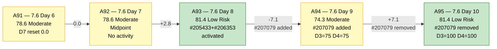
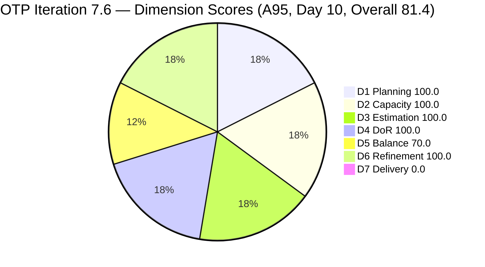
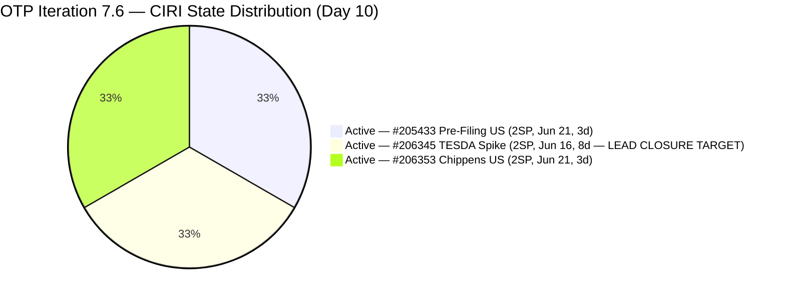
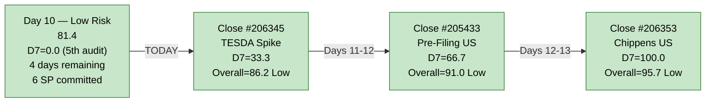

# ADO SAFe Audit — Office of the President (OTP Team)

## 1. Audit Metadata

| Field | Value |
|---|---|
| **Audit Date** | 2026-06-24 09:03 CDT |
| **Sprint Day** | **10 of 14** |
| **Prior Audit** | A94 — `AUDIT_20260623_0903.md` (Overall 74.3, Moderate Risk — 7.6 Day 9) |
| **ADO Project** | OTP (`e7739905-28a3-4ae1-9173-7f6cd13b3494`) |
| **ADO Team** | OTP Team |
| **Iteration** | Iteration 7.6 (`f27d43a8-3edb-46fd-8dd8-65aa5bdcf978`) |
| **Iteration Path** | `OTP\2026 - PI7\Iteration 7.6` |
| **Iteration Dates** | Jun 15, 2026 – Jun 28, 2026 |
| **Workspace Folder** | `ado_otp` |
| **Overall Score** | **81.4 — Low Risk** |
| **Risk Band** | Low (≥ 80) |
| **Visible Backlog Items (VRBI)** | 3 |
| **Current Iteration Root Items (CIRI)** | 3 |
| **Capacity** | Grace: 2h/day (Documentation 1h + Requirements 1h) — configured |
| **Project Exception Applied** | Single-assignee model (Grace) — accepted per workspace CLAUDE.md |

---

## 2. Executive Summary

The OTP team has **recovered from Moderate Risk to Low Risk** on Day 10 of 14, returning to 81.4 (+7.1 points from A94). The recovery is driven entirely by the removal of **#207079 (Building Security)** from the active backlog — the unready, unassigned, unestimated User Story that had degraded D3 and D4 to 75.0 each in yesterday's audit. With #207079 gone, the remaining 3 CIRI items (#205433, #206345, #206353) are all fully DoR-compliant and estimated, restoring D3 and D4 to 100.0.

The sprint's critical remaining issue is **D7 = 0.0 for the 5th consecutive audit (A91–A95)**. With only 4 sprint days remaining (Days 10–13), zero story points have been closed on active CIRI items. #206345 (TESDA Exploration, Active since Jun 16 — 8 sprint days) remains the highest-priority closure target. Closing this single item today would push D7 to 33.3 and bring the overall score to 86.2 — solidly in Low Risk.

---

## 3. Previous Audit Delta (A94 → A95)

| Dimension | A94 Score (7.6 Day 9) | A95 Score (7.6 Day 10) | Delta | Driver |
|---|---|---|---|---|
| D1 Iteration Planning | 100.0 | **100.0** | 0.0 | CIRI=3/VRBI=3. #207079 removed from backlog — both CIRI and VRBI contracted from 4 to 3 simultaneously. Ratio unchanged. |
| D2 Team Capacity | 100.0 | **100.0** | 0.0 | Grace: 2h/day configured. 1/1 contributors with capacity. #207079 removal has no D2 impact. |
| D3 Estimation | 75.0 | **100.0** | **+25.0** | #207079 (unestimated) removed from backlog. Remaining 3 CIRI items all have SP=2. ECI=3/PECI=3 = 100.0. |
| D4 DoR Compliance | 75.0 | **100.0** | **+25.0** | #207079 (DoR Fail — no Desc, no AC) removed. All 3 remaining CIRI items pass DoR. DCI=3/3 = 100.0. |
| D5 Work Item Balance | 70.0 | **70.0** | 0.0 | US=2/3=66.7% > 60% → -30 dominant penalty. US present (no -40). Spike=1/3=33.3% < 40% (no -20). Score unchanged structurally. |
| D6 Backlog Refinement | 100.0 | **100.0** | 0.0 | 3/3 VRBI fresh (Jun 16–21). 0 stale_90, 0 stale_180. 0/3 untouched (all changed ≥ Jun 15). No penalties. |
| D7 Delivery Predictability | 0.0 | **0.0** | 0.0 | No closures. Active CIRI: 0 Closed. Day 10 — **5th consecutive audit at D7=0.0 (A91–A95)**. |
| **Overall** | **74.3** | **81.4** | **+7.1** | #207079 removed from backlog → D3 and D4 both restored to 100.0. Score recovered from Moderate to Low Risk. |

**Formula verification:** (100.0 + 100.0 + 100.0 + 100.0 + 70.0 + 100.0 + 0.0) / 7 = 570.0 / 7 = **81.4**

**Key observations A94 → A95:**

- **#207079 (Building Security) has been removed from the active backlog.** Yesterday it was confirmed as a sprint-integrity breach — unassigned, unestimated, with no Description and no AC. Its removal (deferred or deleted) resolves the D3 and D4 regressions from A94 and restores the sprint to its A93 baseline of 81.4.
- **D3 = 100.0 and D4 = 100.0 are restored.** Both had sat at 100.0 for A89–A93, fell to 75.0 at A94, and are now back at 100.0. The recovery confirms the recommendation from A94 was acted upon.
- **D7 = 0.0 for the 5th consecutive audit.** This is the sprint's sole remaining critical risk. Only 4 sprint days remain (Days 10–13). The 5-audit D7=0.0 streak is the single highest-impact remediation target.
- **Scope contraction is confirmed.** VRBI went from 4 to 3; CIRI from 4 to 3. D1 = 100.0 is preserved because both numerator and denominator contracted equally.

---

## 4. Current Iteration Snapshot

| Metric | Value |
|---|---|
| **Sprint Day / Total** | **10 / 14** |
| **Visible Backlog Items (VRBI)** | 3 (#205433, #206345, #206353) |
| **Planned Items (CIRI — active backlog)** | 3 root items |
| **Closed during sprint (exited backlog)** | 2 (#203864 TCT Jun 19, #206331 Visa Jun 18) |
| **Story Points Committed (CSP — estimated CIRI)** | 6 SP (3 × 2 SP) |
| **Story Points Closed (CLSP — estimated CIRI)** | 0 SP |
| **Sprint delivery to date (all scope)** | 4 SP of 10 SP closed = 40% (cumulative including exited items) |
| **Team Size (distinct CIRI assignees)** | 1 (Grace on all 3 items) |
| **Total Remaining Capacity** | ~8 hours (4 days × 2h/day) |
| **Iteration Start / Finish** | Jun 15, 2026 – Jun 28, 2026 |

**Active CIRI State Distribution (Day 10):**

| ID | Title | Type | State | SP | Assignee | ChangedDate | Days Active | DoR |
|---|---|---|---|---|---|---|---|---|
| #205433 | Execute Pre-Filing Regulatory Compliance | User Story | Active | 2 | Grace | Jun 21 | 3 days | Pass |
| #206345 | TESDA Exploration | Spike | Active | 2 | Grace | Jun 16 | 8 days | Pass |
| #206353 | Meeting with Chippens-Charles | User Story | Active | 2 | Grace | Jun 21 | 3 days | Pass |

**#206345 (TESDA Exploration) at 8 sprint days Active is the primary closure risk.** The research spike has full AC documentation and BDD scenarios. No technical blocker. This item is the immediate priority.

---

## 5. Work Item Analysis

### DoR Assessment (3 CIRI items)

| ID | Title | Desc ≥ 30 NWS | AC ≥ 20 NWS | Result |
|---|---|---|---|---|
| #205433 | Execute Pre-Filing Regulatory Compliance | ✓ (BDD narrative ~200+ NWS) | ✓ (2 BDD scenarios ~400+ NWS) | **Pass** |
| #206345 | TESDA Exploration | ✓ (BDD narrative ~180+ NWS) | ✓ (2 AC scenarios ~280+ NWS) | **Pass** |
| #206353 | Meeting with Chippens-Charles | ✓ (BDD narrative ~150+ NWS) | ✓ (2 BDD scenarios ~280+ NWS) | **Pass** |

**DCI = 3/3. D4 = 100.0. Fully restored from A94 regression.**

### Type Distribution (3 CIRI items)

| Type | Count | Share | D5 Impact |
|---|---|---|---|
| User Story | 2 (#205433, #206353) | 66.7% | US present ✓ (no -40). Dominant type > 60% → **-30 penalty** |
| Spike | 1 (#206345) | 33.3% | Spike < 40% — no -20 penalty |
| **Total** | **3** | **100%** | D5 = max(0, 100 − 30) = **70.0** |

The removal of #207079 (a third User Story) actually marginally improves the type distribution from 75.0% US to 66.7% US, but both are above the 60% threshold so the -30 penalty remains and D5 = 70.0 unchanged.

### Story Points Analysis

| ID | Title | Type | SP | State | Notes |
|---|---|---|---|---|---|
| #205433 | Execute Pre-Filing Regulatory Compliance | User Story | 2 | Active | Active since Jun 21 — 3 sprint days |
| #206345 | TESDA Exploration | Spike | 2 | Active | **Active since Jun 16 — 8 sprint days. Lead closure candidate.** |
| #206353 | Meeting with Chippens-Charles | User Story | 2 | Active | Active since Jun 21 — 3 sprint days |

**CSP = 6 SP. CLSP = 0 SP. D7 = 0.0.**

---

## 6. SAFe Compliance Scorecard

| Dimension | Score | Band | Evidence | Notes |
|---|---|---|---|---|
| D1 Iteration Planning | **100.0** | Low | 3 CIRI / 3 VRBI | #207079 removed — VRBI contracted from 4 to 3, CIRI from 4 to 3. Ratio preserved at 100.0. |
| D2 Team Capacity | **100.0** | Low | 1/1 contributors with capacity | Grace: 2h/day configured. Sole assignee on all 3 CIRI items. Project Exception applied. |
| D3 Estimation | **100.0** | Low | 3/3 estimated | #205433(2SP), #206345(2SP), #206353(2SP). All point-eligible items estimated. **Restored from 75.0 at A94.** |
| D4 DoR Compliance | **100.0** | Low | 3 DCI / 3 CIRI | All 3 items pass: Desc ≥30 NWS and AC ≥20 NWS confirmed. **Restored from 75.0 at A94.** |
| D5 Work Item Balance | **70.0** | Moderate | US=2/3=66.7% → -30 | US present (no -40). Dominant US share > 60% → -30. Spike 33.3% < 40% (no -20). Sprint-locked ceiling. |
| D6 Backlog Refinement | **100.0** | Low | 3/3 fresh; 0/3 untouched | All 3 VRBI changed Jun 16–21. 0 stale_90, 0 stale_180. 0 untouched (all changed ≥ Jun 15). No penalties. |
| D7 Delivery Predictability | **0.0** | Critical | 0 SP closed / 6 SP committed | Active CIRI: 0 Closed items. Day 10 — **5th consecutive audit at D7=0.0 (A91–A95)**. |
| **OVERALL** | **81.4** | **Low Risk** | (100+100+100+100+70+100+0)/7 | **+7.1 from A94 (Moderate Risk).** #207079 removal restored D3 and D4. Recovered to Low Risk. |

**Formula verification:** (100.0 + 100.0 + 100.0 + 100.0 + 70.0 + 100.0 + 0.0) / 7 = 570.0 / 7 = **81.4**

---

## 7. Dimension Findings

### D1 — Iteration Planning: 100.0 / 100 — Low Risk

**Formula:** CIRI / VRBI × 100 = 3 / 3 × 100 = **100.0**

| Metric | Value |
|---|---|
| Visible backlog items (VRBI) | 3 (active root items in scoped backlog) |
| Current iteration root items (CIRI) | 3 (all assigned to `OTP\2026 - PI7\Iteration 7.6`) |
| Score | **100.0** |

#207079 was removed from the backlog between A94 (Jun 23) and A95 (Jun 24). Because it was assigned to Iteration 7.6, both VRBI and CIRI contracted from 4 to 3 simultaneously, preserving the 100.0 ratio. The two previously closed items (#203864 TCT, #206331 Visa) remain in the iteration but have exited the active backlog count.

---

### D2 — Team Capacity: 100.0 / 100 — Low Risk

**Formula:** CC / CW × 100 = 1 / 1 × 100 = **100.0**

Grace is the sole assignee on all 3 CIRI items. Capacity = 2h/day (Documentation 1h + Requirements 1h). Remaining capacity = approximately 8 hours (4 days × 2h/day). The single-assignee model is accepted per workspace Project Exception.

**Capacity pressure note:** At 2h/day and 3 active items, Grace must average ~2.67 SP per day to close all items before Day 14. This is aggressive but achievable if closure begins today (#206345 TESDA).

---

### D3 — Estimation: 100.0 / 100 — Low Risk

**Formula:** ECI / PECI × 100 = 3 / 3 × 100 = **100.0**

| ID | Title | Type | SP | Point-Eligible |
|---|---|---|---|---|
| #205433 | Execute Pre-Filing Regulatory Compliance | User Story | 2 | ✓ Estimated |
| #206345 | TESDA Exploration | Spike | 2 | ✓ Estimated |
| #206353 | Meeting with Chippens-Charles | User Story | 2 | ✓ Estimated |

All 3 CIRI items carry 2 SP each. Score restored to 100.0 following removal of unestimated #207079 from the backlog.

---

### D4 — DoR Compliance: 100.0 / 100 — Low Risk

**Formula:** DCI / CIRI × 100 = 3 / 3 × 100 = **100.0**

All 3 active CIRI items have Description ≥ 30 NWS and Acceptance Criteria ≥ 20 NWS confirmed via API. The removal of unready #207079 has restored D4 to 100.0 — the score this sprint maintained from A89 through A93. This is the 2nd 100.0 DoR streak restoration.

---

### D5 — Work Item Balance: 70.0 / 100 — Moderate Risk

**Formula:** Base 100 − penalties

| Penalty | Trigger | Applied |
|---|---|---|
| -40: No User Story in CIRI | 2 User Stories present | **No** |
| -30: Dominant type share > 60% | US = 2/3 = **66.7%** > 60% | **YES** |
| -20: Spike share > 40% | Spike = 1/3 = 33.3% | **No** |

**Score:** max(0, 100 − 30) = **70.0**

D5 = 70.0 is the structural ceiling for this 3-item sprint. There is no in-sprint fix available. The removal of #207079 (User Story) reduced US share from 75.0% to 66.7%, but the 60% threshold remains breached. PI8 sprint composition design is the permanent fix (target ≤ 60% single type).

---

### D6 — Backlog Refinement: 100.0 / 100 — Low Risk

**Freshness window:** ChangedDate ≥ 2026-05-10 (45 days before 2026-06-24)

| Metric | Value |
|---|---|
| Total VRBI | 3 |
| Fresh items (ChangedDate ≥ May 10, 2026) | 3 — #205433 (Jun 21), #206345 (Jun 16), #206353 (Jun 21) |
| Stale_90 items (ChangedDate < Mar 26, 2026) | 0 |
| Stale_180 items (ChangedDate < Dec 26, 2025) | 0 |
| Untouched CIRI (ChangedDate < Jun 15, 2026) | 0 — all items changed ≥ Jun 16 |

**Base = 3/3 × 100 = 100.0**
**Penalties:** None.

**Score: 100.0** (unchanged from A94)

---

### D7 — Delivery Predictability: 0.0 / 100 — Critical

**Formula:** CLSP / CSP × 100 = 0 / 6 × 100 = **0.0**

| Metric | Value |
|---|---|
| Estimated CIRI items (SP > 0) | 3 (#205433=2SP, #206345=2SP, #206353=2SP) |
| Committed Story Points (CSP) | 6 SP |
| Closed Story Points (CLSP) | 0 SP |
| Score | **0.0** |
| Consecutive audits at D7=0.0 | **5 (A91, A92, A93, A94, A95)** |

Day 10 of 14. Four days remain (Days 10–13 before Jun 28 finish). The 5-audit D7=0.0 streak is the sprint's only remaining critical risk. #206345 (TESDA Exploration) has been Active for 8 sprint days. The full AC/BDD documentation is complete. This item has no technical content barrier to closure.

**Recovery projections from Day 10:**

| Scenario | CLSP/CSP | D7 | Overall |
|---|---|---|---|
| Close #206345 (TESDA, 2SP) today | 2/6 | 33.3 | **86.2 — Low Risk** |
| Close #206345 + #205433 (4SP, by Day 12) | 4/6 | 66.7 | **91.0 — Low Risk** |
| Close all 3 items (6SP, by Day 13) | 6/6 | 100.0 | **95.7 — Low Risk** |

---

## 8. Risks and Bottlenecks

| # | Severity | Dimension | Risk | Recommended Action |
|---|---|---|---|---|
| R1 | **CRITICAL** | D7 | D7 = 0.0 for 5th consecutive audit (Days 6–10). 4 sprint days remain. #206345 (TESDA Exploration) has been Active for 8 sprint days. Research spike with full AC in place. Continued non-closure degrades sprint predictability and risks a zero-delivery ending. | **TODAY:** Grace closes #206345 (TESDA, 2SP). D7 = 33.3. Overall = 86.2 — Low Risk. |
| R2 | **HIGH** | Sprint trajectory | Day 10 of 14. Remaining capacity = ~8 hours (4 days × 2h/day). All 3 CIRI items are Active. Grace must deliver at least 1 closure (ideally 2) before Day 13 to register meaningful D7 improvement. If 0 closures by Day 12, D7 will likely end at 0 and overall will drop below 81.4. | Grace prioritizes #206345 today, then #205433 by Day 12, then #206353 by Day 13. |
| R3 | **MODERATE** | D5 (structural) | US share = 66.7% → -30 dominant type penalty. Sprint-locked ceiling at D5 = 70.0. | No in-sprint fix. PI8 planning: target sprint composition with ≤ 60% single type. |
| R4 | **LOW** | Scope management | #207079 (Building Security) was added to the sprint mid-iteration on Day 9 without preparation, then removed by Day 10. This pattern indicates a gap in sprint gate controls — items reaching the iteration path without DoR completion. | Establish OTP sprint gate: any item assigned to an active iteration must have Description ≥ 30 NWS + AC ≥ 20 NWS + SP > 0 + Assignee before the IterationPath is set. |

---

## 9. Prioritized Recommendations

1. **[TODAY — CRITICAL — R1, D7 recovery]** Grace closes #206345 (TESDA Exploration, Active since Jun 16, 2 SP). Research AC is fully documented with BDD scenarios:
   - D7 = 2/6 × 100 = 33.3
   - Overall = (100+100+100+100+70+100+33.3)/7 = 603.3/7 = **86.2 — Low Risk**

2. **[DAY 11–12 — D7 progression]** Grace executes and closes #205433 (Execute Pre-Filing Regulatory Compliance, Active Jun 21, 2 SP). Form/signature audit and notarial compliance tasks align with the 2h/day capacity window:
   - D7 = 4/6 × 100 = 66.7
   - Overall = (100+100+100+100+70+100+66.7)/7 = **91.0 — Low Risk**

3. **[DAY 12–13 — D7 completion]** Grace schedules and completes #206353 (Meeting with Chippens-Charles, Active Jun 21, 2 SP). Meeting + MoM documentation within remaining capacity:
   - D7 = 6/6 × 100 = 100.0
   - Overall = (100+100+100+100+70+100+100)/7 = **95.7 — Low Risk** (best possible score)

4. **[PI8 PLANNING — D5 structural fix]** Design PI8 sprint composition to avoid US-dominant loading. Target: ≤ 2 User Stories in a 4-item sprint (50% US → no dominant penalty). Suggested: 2 User Stories + 1 Enabler + 1 Spike = US = 50% → D5 = 100.0.

5. **[PROCESS — SCOPE CONTROL]** Implement OTP sprint gate rule: no item may be assigned an active IterationPath unless all DoR criteria (Description ≥ 30 NWS + AC ≥ 20 NWS + SP > 0 + Assignee) are satisfied at assignment time. The #207079 incident (added unready on Day 9, removed on Day 10) is the specific trigger for this control.

---

## 10. Evidence Gaps and Limitations

| Gap | Impact | Notes |
|---|---|---|
| **#207079 disposal** | Context only | Item removed between Jun 23 and Jun 24 audit. Whether it was deferred (moved to PI8/future iteration) or deleted is not confirmed from API evidence. The removal is the correct action per A94 recommendations. |
| **D7 = 0.0 — formula scope vs. sprint delivery** | Score understatement | Active-backlog formula excludes 4 SP delivered (Days 4–5: #203864 TCT + #206331 Visa). Cumulative sprint delivery = 40% of original 10 SP scope. D7 recovers upon next active-CIRI closure. |
| **Single-assignee model** | Structural concentration risk | Project Exception in place. Grace is the sole delivery channel. 3 active CIRI items, 4 days remaining, 8 hours capacity. No backup identified for sprint completion risk. |
| **D5 = 70.0 — sprint-locked ceiling** | -30 pts structural | US share 66.7% exceeds 60% threshold. No in-sprint fix. PI8 planning action required. |

---

## 11. Visualizations

### Score Trend — A91 through A95

### Dimension Scores — A95 (Day 10, Overall 81.4)

### CIRI State Distribution — Day 10 (3 items)

### Sprint Recovery Path — Day 10 (4 days remaining)

---

## 12. Audit Trail

| Source | Tool | Data |
|---|---|---|
| Current iteration | `work_list_team_iterations` (project `e7739905`, team `OTP Team`, timeframe=current) | Iteration 7.6: Jun 15–28, 2026; ID `f27d43a8-3edb-46fd-8dd8-65aa5bdcf978` |
| Backlog items | `wit_list_backlog_work_items` (project `e7739905`, team `OTP Team`, backlogId `Microsoft.RequirementCategory`) | 3 active items: #205433, #206345, #206353 (3 VRBI — #207079 removed since A94) |
| Work item details | `wit_get_work_items_batch_by_ids` (#205433, #206345, #206353, #203864, #206331, #205420) | State, SP, Type, Desc, AC, ChangedDate, IterationPath, AssignedTo confirmed for all items |
| Team capacity | `work_get_iteration_capacities` (project `e7739905`, iterationId `f27d43a8`) | OTP Team: 2h/day total; Grace: Documentation 1h + Requirements 1h |
| Prior audit | `AUDIT_20260623_0903.md` (A94) | Overall 74.3, Moderate Risk, 7.6 Day 9, 4 CIRI, 6 SP committed, 0 SP closed |
| ADO org | `jairo` (dev.azure.com/jairo) | OTP Project ID: `e7739905-28a3-4ae1-9173-7f6cd13b3494` |
