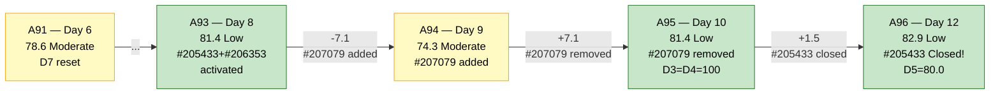
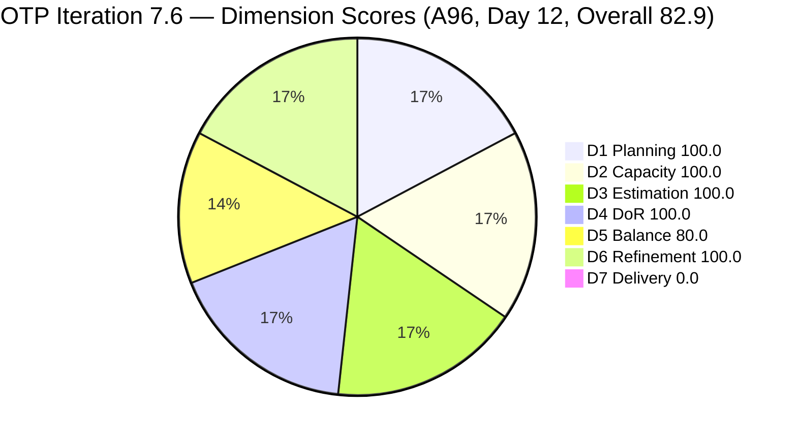
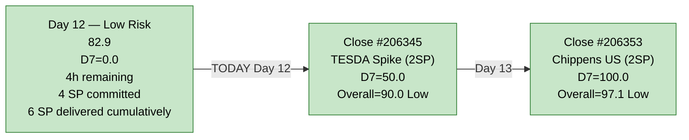
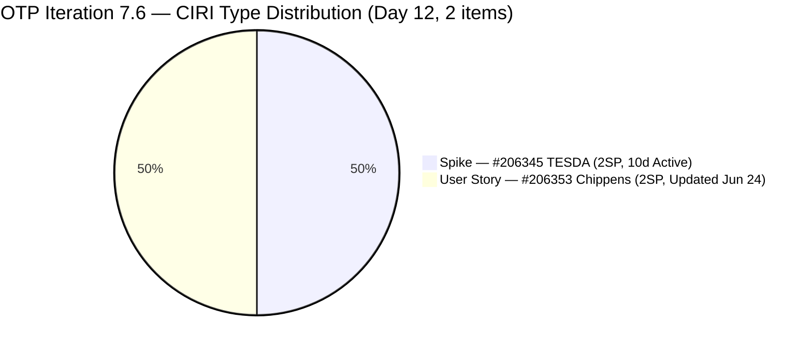

# ADO SAFe Audit — Office of the President (OTP Team)

## 1. Audit Metadata

| Field | Value |
|---|---|
| **Audit Date** | 2026-06-26 09:03 CDT |
| **Sprint Day** | **12 of 14** |
| **Prior Audit** | A95 — `AUDIT_20260624_0903.md` (Overall 81.4, Low Risk — 7.6 Day 10) |
| **ADO Project** | OTP (`e7739905-28a3-4ae1-9173-7f6cd13b3494`) |
| **ADO Team** | OTP Team (`64de61f0-1203-4b01-aee2-6b4415aec52b`) |
| **Iteration** | Iteration 7.6 (`f27d43a8-3edb-46fd-8dd8-65aa5bdcf978`) |
| **Iteration Path** | `OTP\2026 - PI7\Iteration 7.6` |
| **Iteration Dates** | Jun 15, 2026 – Jun 28, 2026 |
| **Workspace Folder** | `ado_otp` |
| **Overall Score** | **82.9 — Low Risk** |
| **Risk Band** | Low (≥ 80) |
| **Visible Backlog Items (VRBI)** | 2 |
| **Current Iteration Root Items (CIRI)** | 2 |
| **Capacity** | Grace: 2h/day (Documentation 1h + Requirements 1h) — configured |
| **Project Exception Applied** | Single-assignee model (Grace) — accepted per workspace CLAUDE.md |

---

## 2. Executive Summary

The OTP team advances to **82.9 — Low Risk** on Day 12 of 14, a gain of +1.5 points from A95 (81.4). The score improvement is driven by a **structural change in D5**: with #205433 (Execute Pre-Filing Regulatory Compliance) now **Closed as of Jun 24**, the active backlog contracted from 3 to 2 items — leaving 1 Spike (#206345) and 1 User Story (#206353), a perfectly balanced 50/50 split. This eliminates the dominant-type penalty that has cost the sprint -30 points in D5 since A89 and raises D5 from 70.0 to **80.0**.

The critical unresolved issue entering Day 12 remains **D7 = 0.0** — the 7th consecutive audit at zero delivery predictability against the **active backlog** CIRI set. #205433 was Closed on Jun 24 (a genuine delivery event), but because it exited the visible backlog, its 2 SP do not count toward D7 under the skill formula. Among the 2 remaining CIRI items, neither is Closed. **#206345 (TESDA Exploration, Active since Jun 16 — 10 sprint days) is the immediate priority.** Only 2 sprint days remain (Days 12–13 before Jun 28 close).

---

## 3. Previous Audit Delta (A95 → A96)

| Dimension | A95 Score (7.6 Day 10) | A96 Score (7.6 Day 12) | Delta | Driver |
|---|---|---|---|---|
| D1 Iteration Planning | 100.0 | **100.0** | 0.0 | CIRI=2/VRBI=2. #205433 exited active backlog (Closed Jun 24). Both CIRI and VRBI contracted from 3 to 2. Ratio unchanged. |
| D2 Team Capacity | 100.0 | **100.0** | 0.0 | Grace: 2h/day configured. 1/1 contributors with capacity. |
| D3 Estimation | 100.0 | **100.0** | 0.0 | Both remaining CIRI items carry 2 SP. ECI=2/PECI=2=100.0. |
| D4 DoR Compliance | 100.0 | **100.0** | 0.0 | Both items pass DoR: Desc ≥30 NWS + AC ≥20 NWS confirmed. |
| D5 Work Item Balance | 70.0 | **80.0** | **+10.0** | #205433 (User Story, Closed) exited backlog. Remaining: 1 Spike + 1 User Story = 50%/50%. Neither type >60% → no -30 penalty. Spike 50% > 40% → -20 penalty. Score = max(0,100−20) = 80.0. |
| D6 Backlog Refinement | 100.0 | **100.0** | 0.0 | 2/2 VRBI fresh. 0 stale_90, 0 stale_180. 0/2 untouched (both changed ≥ Jun 15). No penalties. |
| D7 Delivery Predictability | 0.0 | **0.0** | 0.0 | Active CIRI: 0 Closed. CSP=4SP (2 remaining items), CLSP=0. Day 12 — **7th consecutive audit at D7=0.0 on active CIRI**. Note: #205433 (2SP) was Closed Jun 24 but exited backlog and is not in current CIRI. |
| **Overall** | **81.4** | **82.9** | **+1.5** | D5 improved +10.0 from balanced type split after #205433 closure. Maintained Low Risk. |

**Formula verification:** (100.0 + 100.0 + 100.0 + 100.0 + 80.0 + 100.0 + 0.0) / 7 = 580.0 / 7 = **82.9**

**Key observations A95 → A96:**

- **#205433 (Execute Pre-Filing Regulatory Compliance, 2SP) was Closed on Jun 24.** This is genuine sprint delivery — the first CIRI closure since #206331 and #203864 earlier in the sprint. The item exited the active backlog and is confirmed Closed (State=Closed, ChangedDate=2026-06-24T11:24:40Z, rev 5).
- **D5 improved from 70.0 to 80.0** as a direct consequence. The active CIRI is now a clean 1 Spike + 1 User Story (50%/50%). The spike share of 50% > 40% applies a -20 penalty but no dominant-type penalty (-30 is gone).
- **#206353 (Meeting with Chippens-Charles) was updated on Jun 24** (ChangedDate 2026-06-24T22:06:59Z, rev 4), suggesting active engagement — but State remains Active.
- **#206345 (TESDA Exploration) is unchanged since Jun 16** — 10 sprint days Active with no state transition. This is the sole remaining closure target.
- **D7 = 0.0 continues on active CIRI** despite the #205433 delivery event. The formula measures only active CIRI (visible backlog items in current iteration). Two sprint days remain.

---

## 4. Current Iteration Snapshot

| Metric | Value |
|---|---|
| **Sprint Day / Total** | **12 / 14** |
| **Visible Backlog Items (VRBI)** | 2 (#206345, #206353) |
| **Planned Items (CIRI — active backlog)** | 2 root items |
| **Closed during sprint (exited backlog)** | 3: #203864 TCT (Jun 19, 2SP), #206331 Visa (Jun 18, 2SP), #205433 Pre-Filing (Jun 24, 2SP) |
| **Story Points Committed (CSP — estimated CIRI)** | 4 SP (#206345=2SP, #206353=2SP) |
| **Story Points Closed (CLSP — active CIRI)** | 0 SP |
| **Sprint delivery to date (cumulative including exited items)** | 6 SP of 10 SP original scope closed = 60% cumulative |
| **Team Size (distinct CIRI assignees)** | 1 (Grace on both items) |
| **Total Remaining Capacity** | ~4 hours (2 days × 2h/day) |
| **Iteration Start / Finish** | Jun 15, 2026 – Jun 28, 2026 |

**Active CIRI State Distribution (Day 12):**

| ID | Title | Type | State | SP | Assignee | ChangedDate | Days Active | DoR |
|---|---|---|---|---|---|---|---|---|
| #206345 | TESDA Exploration | Spike | Active | 2 | Grace | Jun 16 | 10 days | Pass |
| #206353 | Meeting with Chippens-Charles | User Story | Active | 2 | Grace | Jun 24 | 2 days | Pass |

**#206345 (TESDA Exploration) at 10 sprint days Active is the primary and sole closure target before the sprint ends on Jun 28.**

---

## 5. Work Item Analysis

### DoR Assessment (2 CIRI items)

| ID | Title | Desc ≥ 30 NWS | AC ≥ 20 NWS | Result |
|---|---|---|---|---|
| #206345 | TESDA Exploration | ✓ (BDD narrative ~150+ NWS) | ✓ (2 AC scenarios ~250+ NWS) | **Pass** |
| #206353 | Meeting with Chippens-Charles | ✓ (BDD narrative ~120+ NWS) | ✓ (2 BDD scenarios ~280+ NWS) | **Pass** |

**DCI = 2/2. D4 = 100.0.**

### Type Distribution (2 CIRI items)

| Type | Count | Share | D5 Impact |
|---|---|---|---|
| Spike | 1 (#206345) | 50.0% | Spike > 40% → **-20 penalty** |
| User Story | 1 (#206353) | 50.0% | US present (no -40). Not dominant (≤60%) → no -30 penalty |
| **Total** | **2** | **100%** | D5 = max(0, 100 − 20) = **80.0** |

**D5 = 80.0** — a +10.0 improvement over A95. The closure of #205433 (User Story) shifted the composition from 66.7% US to a balanced 50/50 split. The Spike exceeds the 40% spike-share threshold (-20) but neither type dominates above 60% (-30 not applied). This is the highest D5 score for this sprint.

### Story Points Analysis

| ID | Title | Type | SP | State | Notes |
|---|---|---|---|---|---|
| #206345 | TESDA Exploration | Spike | 2 | Active | **Active since Jun 16 — 10 sprint days. Sole closure target.** No change since Jun 16. |
| #206353 | Meeting with Chippens-Charles | User Story | 2 | Active | Active since Jun 15; updated Jun 24 (rev 4) — meeting may be in progress. |

**CSP = 4 SP. CLSP = 0 SP. D7 = 0.0.**

**Cumulative sprint delivery context:**
- #203864 TCT: Closed Jun 19 — 2 SP
- #206331 Visa: Closed Jun 18 — 2 SP
- #205433 Pre-Filing: **Closed Jun 24 — 2 SP (NEW)**
- Total delivered (exited items): **6 SP of original ~10 SP scope = 60%**

The delivery formula only counts active CIRI. The formula-scope gap understates real sprint progress.

---

## 6. SAFe Compliance Scorecard

| Dimension | Score | Band | Evidence | Notes |
|---|---|---|---|---|
| D1 Iteration Planning | **100.0** | Low | 2 CIRI / 2 VRBI | #205433 exited backlog (Closed Jun 24). Both CIRI and VRBI contracted from 3 to 2. Ratio preserved at 100.0. |
| D2 Team Capacity | **100.0** | Low | 1/1 contributors with capacity | Grace: 2h/day configured (Documentation 1h + Requirements 1h). Sole assignee on both CIRI items. Project Exception applied. |
| D3 Estimation | **100.0** | Low | 2/2 estimated | #206345 (2SP), #206353 (2SP). All point-eligible items estimated. |
| D4 DoR Compliance | **100.0** | Low | 2 DCI / 2 CIRI | Both items pass: Desc ≥30 NWS and AC ≥20 NWS confirmed via API. |
| D5 Work Item Balance | **80.0** | Low | Spike 50% → -20 | US present (no -40). No type >60% (no -30). Spike=50% > 40% → -20. Score = max(0,100−20) = 80.0. **+10.0 from A95.** |
| D6 Backlog Refinement | **100.0** | Low | 2/2 fresh; 0/2 untouched | #206345 (Jun 16) and #206353 (Jun 24) — both fresh (≥May 12, 2026 window). 0 stale_90, 0 stale_180. 0 untouched (both changed ≥ Jun 15 start). |
| D7 Delivery Predictability | **0.0** | Critical | 0 SP closed / 4 SP committed | Active CIRI: 0 Closed. #205433 closed Jun 24 but exited backlog — not counted in formula. Day 12 — **7th consecutive audit at D7=0.0 on active CIRI**. |
| **OVERALL** | **82.9** | **Low Risk** | (100+100+100+100+80+100+0)/7 | **+1.5 from A95 (81.4 Low Risk).** D5 improved to 80.0 on balanced type composition. |

**Formula verification:** (100.0 + 100.0 + 100.0 + 100.0 + 80.0 + 100.0 + 0.0) / 7 = 580.0 / 7 = **82.9**

---

## 7. Dimension Findings

### D1 — Iteration Planning: 100.0 / 100 — Low Risk

**Formula:** CIRI / VRBI × 100 = 2 / 2 × 100 = **100.0**

| Metric | Value |
|---|---|
| Visible backlog items (VRBI) | 2 (#206345, #206353) |
| Current iteration root items (CIRI) | 2 (both assigned to `OTP\2026 - PI7\Iteration 7.6`) |
| Score | **100.0** |

#205433 was Closed on Jun 24 and has exited the active backlog, contracting both VRBI and CIRI from 3 to 2 simultaneously. The 100.0 ratio is preserved. Sprint planning remains fully committed with all visible backlog items assigned to the active iteration.

---

### D2 — Team Capacity: 100.0 / 100 — Low Risk

**Formula:** CC / CW × 100 = 1 / 1 × 100 = **100.0**

Grace is the sole assignee on both CIRI items. Capacity = 2h/day (Documentation 1h + Requirements 1h). Remaining capacity = approximately 4 hours (2 days × 2h/day). The single-assignee model is accepted per workspace Project Exception.

**Capacity pressure note (Day 12):** With 4 hours remaining and 2 items still Active, Grace must complete both items within the Day 12–13 window. #206345 TESDA at 10 days Active is the immediate target; the research spike AC is fully documented. #206353 updated Jun 24 (meeting activity likely started or scheduled).

---

### D3 — Estimation: 100.0 / 100 — Low Risk

**Formula:** ECI / PECI × 100 = 2 / 2 × 100 = **100.0**

| ID | Title | Type | SP | Point-Eligible |
|---|---|---|---|---|
| #206345 | TESDA Exploration | Spike | 2 | ✓ Estimated |
| #206353 | Meeting with Chippens-Charles | User Story | 2 | ✓ Estimated |

Both active CIRI items carry 2 SP each. Score remains at 100.0.

---

### D4 — DoR Compliance: 100.0 / 100 — Low Risk

**Formula:** DCI / CIRI × 100 = 2 / 2 × 100 = **100.0**

Both active CIRI items have Description ≥ 30 NWS and Acceptance Criteria ≥ 20 NWS confirmed via API. D4 = 100.0 maintained for the 5th consecutive audit (A91–A96, excluding A94 regression).

---

### D5 — Work Item Balance: 80.0 / 100 — Low Risk

**Formula:** Base 100 − penalties = max(0, 100 − 20) = **80.0**

| Penalty | Trigger | Applied |
|---|---|---|
| -40: No User Story in CIRI | 1 User Story present (#206353) | **No** |
| -30: Dominant type share > 60% | Spike=50%, US=50% — neither >60% | **No** |
| -20: Spike share > 40% | Spike = 1/2 = **50.0%** > 40% | **YES** |

**Score:** max(0, 100 − 20) = **80.0** (+10.0 from A95)

The closure of #205433 (User Story) transformed the type distribution from 66.7% US (A95, -30 penalty) to an exactly balanced 1:1 Spike/User Story split. The -30 dominant-type penalty is eliminated. However, a single Spike among 2 items now represents 50% of CIRI — exceeding the 40% spike threshold (-20 applied). D5 = 80.0 is the highest this sprint has reached. With only 2 days remaining, this is the sprint ceiling.

---

### D6 — Backlog Refinement: 100.0 / 100 — Low Risk

**Freshness window:** ChangedDate ≥ 2026-05-12 (45 days before 2026-06-26)

| Metric | Value |
|---|---|
| Total VRBI | 2 |
| Fresh items (ChangedDate ≥ May 12, 2026) | 2 — #206345 (Jun 16), #206353 (Jun 24) |
| Stale_90 items (ChangedDate < Mar 28, 2026) | 0 |
| Stale_180 items (ChangedDate < Dec 28, 2025) | 0 |
| Untouched CIRI (ChangedDate < Jun 15, 2026) | 0 — #206345 changed Jun 16, #206353 changed Jun 24 |

**Base = 2/2 × 100 = 100.0**
**Penalties:** None.
**Score: 100.0** (unchanged from A95)

---

### D7 — Delivery Predictability: 0.0 / 100 — Critical

**Formula:** CLSP / CSP × 100 = 0 / 4 × 100 = **0.0**

| Metric | Value |
|---|---|
| Estimated CIRI items (SP > 0, in active backlog) | 2 (#206345=2SP, #206353=2SP) |
| Committed Story Points (CSP) | 4 SP |
| Closed Story Points (CLSP) | 0 SP |
| Score | **0.0** |
| Consecutive audits at D7=0.0 (active CIRI) | **7 (A90–A96)** |

Day 12 of 14. Two days remain (Days 12–13 before Jun 28 finish). The D7=0.0 streak on active CIRI is structurally driven by the fact that the three items that were closed this sprint (#203864, #206331, #205433) all exited the backlog before closure was counted. The formula scores only current active CIRI.

**Actual sprint delivery context:** 6 SP of ~10 SP committed scope has been delivered (60% cumulative). The remaining 4 SP (#206345 + #206353) represent the final sprint targets.

**Recovery projections from Day 12 (2 days remaining):**

| Scenario | CLSP/CSP | D7 | Overall |
|---|---|---|---|
| Close #206345 (TESDA, 2SP) | 2/4 | 50.0 | **88.6 — Low Risk** |
| Close #206345 + #206353 (4SP) | 4/4 | 100.0 | **97.1 — Low Risk** |
| No closures (status quo) | 0/4 | 0.0 | **82.9 — Low Risk** (current) |

---

## 8. Risks and Bottlenecks

| # | Severity | Dimension | Risk | Recommended Action |
|---|---|---|---|---|
| R1 | **CRITICAL** | D7 | D7 = 0.0 for 7th consecutive audit on active CIRI. 2 sprint days remain. #206345 (TESDA Exploration) has been Active for 10 sprint days with no state transition. Research spike with full AC documentation — no technical barrier to closure. | **TODAY (Day 12):** Grace sets #206345 to Closed. D7 = 50.0. Overall = 88.6. |
| R2 | **HIGH** | Sprint trajectory | 4 hours remaining capacity (2 days × 2h/day). Both CIRI items Active. Grace must complete at least 1 closure today to register D7 improvement and avoid a sprint ending with D7=0.0 on active CIRI for the 8th consecutive audit. | Grace prioritizes #206345 today, #206353 by Day 13. |
| R3 | **LOW** | D5 (structural-resolved) | D5 spike share = 50% → -20 penalty. With only 2 items in CIRI, any spike will exceed the 40% threshold. Sprint-locked ceiling at D5=80.0. | No in-sprint fix. Noted for PI8 planning: balance spike representation. |
| R4 | **LOW** | Formula scope gap | D7 formula understates real delivery. 6 SP have been closed sprint-cumulatively (60% of original scope). Formula reports 0.0 because all closed items exited the active backlog. | No formula change needed — note in Evidence Gaps. Cumulative delivery is strong (60%). |

---

## 9. Prioritized Recommendations

1. **[TODAY — CRITICAL — R1, D7 recovery]** Grace closes **#206345 (TESDA Exploration, Active since Jun 16, 2SP)**. Research AC is fully documented with 2 BDD scenarios. This is the only action that materially changes the sprint score:
   - D7 = 2/4 × 100 = **50.0**
   - Overall = (100+100+100+100+80+100+50)/7 = 630/7 = **90.0 — Low Risk**

2. **[DAY 13 — D7 completion]** Grace completes and closes **#206353 (Meeting with Chippens-Charles, Active since Jun 15, 2SP)**. Item was updated Jun 24 — meeting activity appears underway. If meeting MoM documentation is complete:
   - D7 = 4/4 × 100 = **100.0**
   - Overall = (100+100+100+100+80+100+100)/7 = 680/7 = **97.1 — Low Risk** (best possible score this sprint)

3. **[PI8 PLANNING — D5 optimization]** With the sprint ending in a 1:1 Spike/User Story split, D5 = 80.0 is the ceiling given the spike-share penalty. For PI8 sprints, target compositions where Spike count ≤ 40% of CIRI (e.g., 1 Spike in a 3-item sprint = 33.3% → no -20 penalty). A 3-item sprint with 1 Spike + 2 User Stories would score D5 = 100.0.

4. **[PROCESS — SCOPE CONTROL]** The #207079 (Building Security) incident from A94 (added unready on Day 9, removed on Day 10) should formalize an OTP sprint gate: any item assigned an active IterationPath must have Description ≥ 30 NWS + AC ≥ 20 NWS + SP > 0 + Assignee at assignment time.

5. **[PI8 READINESS]** With 2 sprint days remaining and 2 items Active, Grace should confirm PI8 backlog readiness. Any items with planned PI8 scope should be reviewed and prepared (DoR-checked, estimated) during the remaining capacity window to ensure PI8 Iteration 8.1 opens with a clean, ready backlog.

---

## 10. Evidence Gaps and Limitations

| Gap | Impact | Notes |
|---|---|---|
| **D7 = 0.0 — formula scope vs. sprint delivery** | Score understatement | Active-backlog formula excludes 6 SP delivered (Days 4–5: #203864 TCT, #206331 Visa; Day 10: #205433 Pre-Filing). Cumulative sprint delivery = 60% of original ~10 SP scope. D7 recovers upon next active-CIRI closure. |
| **#206345 (TESDA) unchanged since Jun 16** | Critical closure risk | Item has been Active for 10 sprint days with ChangedDate unchanged since Jun 16. No revision activity visible since Day 1 of TESDA work. Research may be complete in Grace's working files but not yet reflected in ADO state. 2 days remain. |
| **Single-assignee model** | Structural concentration risk | Project Exception in place. Grace is the sole delivery channel. 2 active CIRI items, 2 days remaining, 4 hours capacity. No backup identified. |
| **#205433 closure timestamp** | Confirmed good news | #205433 State=Closed, ChangedDate=2026-06-24T11:24:40Z, rev=5 confirmed via API. Delivery is real. |

---

## 11. Visualizations

### Score Trend — A91 through A96

### Dimension Scores — A96 (Day 12, Overall 82.9)

### Sprint Delivery Recovery Path — Day 12 (2 days remaining)

### CIRI Type Distribution — Day 12

---

## 12. Audit Trail

| Source | Tool | Data |
|---|---|---|
| OTP Team ID | `core_list_project_teams` (project `e7739905`) | OTP Team: `64de61f0-1203-4b01-aee2-6b4415aec52b` |
| Current iteration | `work_list_team_iterations` (project `e7739905`, team `64de61f0`, timeframe=current) | Iteration 7.6: Jun 15–28, 2026; ID `f27d43a8-3edb-46fd-8dd8-65aa5bdcf978` |
| Backlog items | `wit_list_backlog_work_items` (project `e7739905`, team `64de61f0`, backlogId `Microsoft.RequirementCategory`) | 2 active items: #206345, #206353 (down from 3 — #205433 exited/Closed Jun 24) |
| Iteration work items | `wit_get_work_items_for_iteration` (project `e7739905`, team `64de61f0`, iterationId `f27d43a8`) | Root items: #203864, #205433, #206331, #206345, #206353 (plus child tasks) |
| Work item details | `wit_get_work_items_batch_by_ids` (#203864, #205420, #205433, #206331, #206345, #206353) | State, SP, Type, Desc, AC, ChangedDate, IterationPath, AssignedTo confirmed for all items |
| Team capacity | `work_get_iteration_capacities` (project `e7739905`, iterationId `f27d43a8`) | OTP Team: 2h/day total; Grace: Documentation 1h + Requirements 1h |
| Prior audit | `AUDIT_20260624_0903.md` (A95) | Overall 81.4, Low Risk, 7.6 Day 10, 3 CIRI, 6 SP committed, 0 SP closed (active CIRI) |
| ADO org | `jairo` (dev.azure.com/jairo) | OTP Project ID: `e7739905-28a3-4ae1-9173-7f6cd13b3494` |
