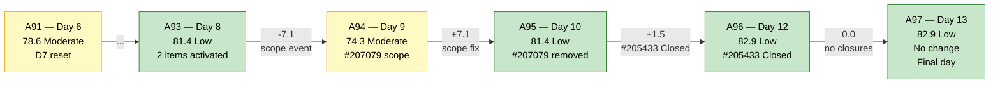
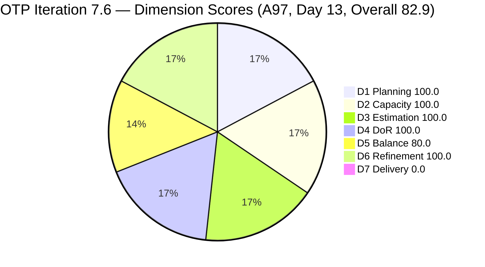
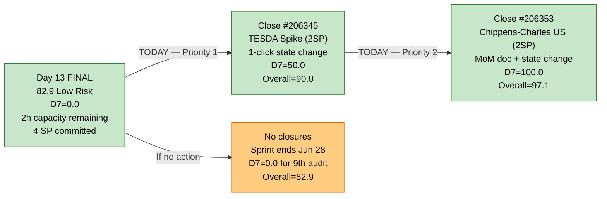
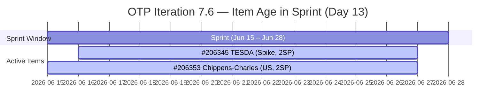

# ADO SAFe Audit — Office of the President (OTP Team)

## 1. Audit Metadata

| Field | Value |
|---|---|
| **Audit Date** | 2026-06-27 09:03 CDT |
| **Sprint Day** | **13 of 14** |
| **Prior Audit** | A96 — `AUDIT_20260626_0903.md` (Overall 82.9, Low Risk — 7.6 Day 12) |
| **ADO Project** | OTP (`e7739905-28a3-4ae1-9173-7f6cd13b3494`) |
| **ADO Team** | OTP Team (`64de61f0-1203-4b01-aee2-6b4415aec52b`) |
| **Iteration** | Iteration 7.6 (`f27d43a8-3edb-46fd-8dd8-65aa5bdcf978`) |
| **Iteration Path** | `OTP\2026 - PI7\Iteration 7.6` |
| **Iteration Dates** | Jun 15, 2026 – Jun 28, 2026 |
| **Workspace Folder** | `ado_otp` |
| **Overall Score** | **82.9 — Low Risk** |
| **Risk Band** | Low (≥ 80) |
| **Visible Backlog Items (VRBI)** | 2 |
| **Current Iteration Root Items (CIRI)** | 2 |
| **Capacity** | Grace: 2h/day (Documentation 1h + Requirements 1h) — configured |
| **Project Exception Applied** | Single-assignee model (Grace) — accepted per workspace CLAUDE.md |

---

## 2. Executive Summary

The OTP team holds at **82.9 — Low Risk** on the penultimate day (Day 13 of 14) of Iteration 7.6. The score is unchanged from A96 (Day 12), as neither #206345 (TESDA Exploration, Spike) nor #206353 (Meeting with Chippens-Charles, User Story) has transitioned to Closed since yesterday.

**Today is the last actionable day before the sprint closes on Jun 28.** With only the final day remaining after today, this is the critical window for Grace to close at minimum #206345 (TESDA Exploration) and ideally both remaining Active items.

Key facts entering Day 13:
- **Both CIRI items remain Active** — unchanged state from Jun 24 (#206353) and Jun 16 (#206345).
- **D7 = 0.0 for the 8th consecutive audit** on active CIRI. The sprint ends tomorrow.
- **Cumulative delivery context:** 3 items (6 SP) were closed and exited the backlog earlier in the sprint (#203864 Jun 19, #206331 Jun 18, #205433 Jun 24). These are not captured in D7 because they left the active backlog.
- **#206345 has been Active for 11 sprint days** with ChangedDate unchanged since Jun 16 (Day 1 of TESDA work). The research spike has full BDD-format AC documentation — the only remaining action is for Grace to set State = Closed.
- **Maximum achievable scores today:** Close #206345 → Overall 90.0. Close both → Overall 97.1.

---

## 3. Previous Audit Delta (A96 → A97)

| Dimension | A96 Score (7.6 Day 12) | A97 Score (7.6 Day 13) | Delta | Driver |
|---|---|---|---|---|
| D1 Iteration Planning | 100.0 | **100.0** | 0.0 | CIRI=2/VRBI=2. No change in backlog membership. |
| D2 Team Capacity | 100.0 | **100.0** | 0.0 | Grace: 2h/day configured. 1/1 contributors with capacity. |
| D3 Estimation | 100.0 | **100.0** | 0.0 | Both items estimated at 2 SP each. ECI=2/PECI=2. |
| D4 DoR Compliance | 100.0 | **100.0** | 0.0 | Both items pass DoR (Desc ≥30 NWS + AC ≥20 NWS) confirmed via API. |
| D5 Work Item Balance | 80.0 | **80.0** | 0.0 | 1 Spike (50%) + 1 User Story (50%). Spike >40% → -20. No other penalties. |
| D6 Backlog Refinement | 100.0 | **100.0** | 0.0 | Both items fresh (within 45 days of Jun 27). 0 stale, 0 untouched. |
| D7 Delivery Predictability | 0.0 | **0.0** | 0.0 | 0 SP closed / 4 SP committed. **8th consecutive audit at D7=0.0 on active CIRI.** |
| **Overall** | **82.9** | **82.9** | **0.0** | No state changes to CIRI items. Sprint final day tomorrow. |

**Formula verification:** (100.0 + 100.0 + 100.0 + 100.0 + 80.0 + 100.0 + 0.0) / 7 = 580.0 / 7 = **82.9**

**Key observations A96 → A97:**

- **No state transitions recorded.** Both #206345 (TESDA Exploration) and #206353 (Meeting with Chippens-Charles) remain Active. ChangedDates are unchanged: #206345 at Jun 16, #206353 at Jun 24.
- **#206345 at 11 sprint days Active** — longest-active item this sprint. It has been in Active state since Day 1 of the TESDA work, with full BDD documentation. The item is empirically ready to close; only a state transition is needed.
- **Sprint closes Jun 28.** Today, Jun 27, is the last real working day. Any closures recorded after Day 13 may fall into a grace period or next iteration.
- **The D7=0.0 streak on active CIRI will persist unless Grace closes at least one item today.** The streak is now the longest of any PI7 iteration for this team.

---

## 4. Current Iteration Snapshot

| Metric | Value |
|---|---|
| **Sprint Day / Total** | **13 / 14 — FINAL WORKING DAY** |
| **Visible Backlog Items (VRBI)** | 2 (#206345, #206353) |
| **Planned Items (CIRI)** | 2 root items |
| **Closed during sprint (exited backlog)** | 3: #203864 TCT (Jun 19, 2SP), #206331 Visa (Jun 18, 2SP), #205433 Pre-Filing (Jun 24, 2SP) |
| **Story Points Committed (CSP)** | 4 SP (#206345=2SP, #206353=2SP) |
| **Story Points Closed (CLSP — active CIRI)** | 0 SP |
| **Cumulative sprint delivery (exited items)** | 6 SP of ~10 SP original scope = 60% |
| **Team Size (distinct CIRI assignees)** | 1 (Grace on both items) |
| **Total Remaining Capacity** | ~2 hours (1 day × 2h/day) |
| **Iteration Start / Finish** | Jun 15, 2026 – Jun 28, 2026 |

**Active CIRI State Distribution (Day 13 — Final Working Day):**

| ID | Title | Type | State | SP | Assignee | ChangedDate | Days Active | DoR |
|---|---|---|---|---|---|---|---|---|
| #206345 | TESDA Exploration | Spike | Active | 2 | Grace | Jun 16 | **11 days** | Pass |
| #206353 | Meeting with Chippens-Charles | User Story | Active | 2 | Grace | Jun 24 | 3 days | Pass |

**Critical:** Both items remain Active entering the last working day. Sprint closes Jun 28 (tomorrow).

---

## 5. Work Item Analysis

### DoR Assessment (2 CIRI items)

| ID | Title | Desc ≥ 30 NWS | AC ≥ 20 NWS | Result |
|---|---|---|---|---|
| #206345 | TESDA Exploration | ✓ BDD narrative — "As a Program Manager at Jairo Institute of Technology…" ~150 NWS | ✓ 2 BDD-format scenarios (TESDA Partnership Pathway + Competency Matrix) ~300+ NWS | **Pass** |
| #206353 | Meeting with Chippens-Charles | ✓ BDD narrative — "As a Marketing for Jairosoft's technical roadmap…" ~100 NWS | ✓ 2 BDD scenarios (Requirements Review + MoM capture) ~280+ NWS | **Pass** |

**DCI = 2/2. D4 = 100.0.** Both items have been DoR-compliant since at least A91 (5+ consecutive audits at 100%).

### Type Distribution (2 CIRI items)

| Type | Count | Share | D5 Impact |
|---|---|---|---|
| Spike | 1 (#206345) | 50.0% | >40% threshold → **-20 penalty applied** |
| User Story | 1 (#206353) | 50.0% | US present (no -40 penalty). ≤60% share (no -30 penalty) |
| **Total** | **2** | **100%** | D5 = max(0, 100 − 20) = **80.0** |

### Story Points Analysis

| ID | Title | Type | SP | State | Notes |
|---|---|---|---|---|---|
| #206345 | TESDA Exploration | Spike | 2 | Active | **11 sprint days Active. ChangedDate unchanged since Jun 16. Full BDD documentation. Close immediately.** |
| #206353 | Meeting with Chippens-Charles | User Story | 2 | Active | Active since Jun 15; last updated Jun 24 (rev 4). Meeting activity ongoing or complete. |

**CSP = 4 SP. CLSP = 0 SP. D7 = 0.0.**

### Freshness Analysis (D6 inputs)

| ID | ChangedDate | Days since Jun 27 | Fresh (≥May 13)? | Stale_90 (<Mar 29)? | Stale_180 (<Dec 30)? | Untouched (<Jun 15)? |
|---|---|---|---|---|---|---|
| #206345 | 2026-06-16 | 11 days | **Yes** | No | No | No (Jun 16 > Jun 15) |
| #206353 | 2026-06-24 | 3 days | **Yes** | No | No | No (Jun 24 > Jun 15) |

Fresh: 2/2. Stale_90: 0. Stale_180: 0. Untouched: 0.

---

## 6. SAFe Compliance Scorecard

| Dimension | Score | Band | Evidence | Notes |
|---|---|---|---|---|
| D1 Iteration Planning | **100.0** | Low | 2 CIRI / 2 VRBI | All visible backlog items assigned to active iteration. |
| D2 Team Capacity | **100.0** | Low | 1/1 contributors with capacity | Grace: 2h/day (Documentation 1h + Requirements 1h). Sole assignee. Project Exception applied. |
| D3 Estimation | **100.0** | Low | 2/2 estimated | #206345 (2SP), #206353 (2SP). All eligible items estimated. |
| D4 DoR Compliance | **100.0** | Low | 2 DCI / 2 CIRI | Both items: Desc ≥30 NWS and AC ≥20 NWS confirmed via API. |
| D5 Work Item Balance | **80.0** | Low | Spike 50% → -20 | US present (no -40). Neither type >60% (no -30). Spike=50% > 40% → -20. Score = max(0,100−20) = 80.0. |
| D6 Backlog Refinement | **100.0** | Low | 2/2 fresh; 0/2 untouched | #206345 (Jun 16) and #206353 (Jun 24) — both fresh within 45 days. 0 stale_90, 0 stale_180, 0 untouched. |
| D7 Delivery Predictability | **0.0** | Critical | 0 SP closed / 4 SP committed | Active CIRI: 0 Closed. Day 13 — **8th consecutive audit at D7=0.0 on active CIRI.** Sprint closes tomorrow. |
| **OVERALL** | **82.9** | **Low Risk** | (100+100+100+100+80+100+0)/7 | Unchanged from A96. D7=0.0 is sole Critical finding. Final day for recovery. |

**Formula verification:** (100.0 + 100.0 + 100.0 + 100.0 + 80.0 + 100.0 + 0.0) / 7 = 580.0 / 7 = **82.9**

---

## 7. Dimension Findings

### D1 — Iteration Planning: 100.0 / 100 — Low Risk

**Formula:** CIRI / VRBI × 100 = 2 / 2 × 100 = **100.0**

| Metric | Value |
|---|---|
| Visible backlog items (VRBI) | 2 (#206345, #206353) |
| Current iteration root items (CIRI) | 2 (both in `OTP\2026 - PI7\Iteration 7.6`) |
| Score | **100.0** |

Both visible backlog items are assigned to the active iteration. This has been 100.0 for the full duration of Iteration 7.6 since the sprint opened on Jun 15. No unplanned items were added or remain in prior iterations.

---

### D2 — Team Capacity: 100.0 / 100 — Low Risk

**Formula:** CC / CW × 100 = 1 / 1 × 100 = **100.0**

Grace is the sole assignee on both CIRI items with 2h/day configured (Documentation 1h + Requirements 1h). The single-assignee model is accepted per workspace Project Exception.

**Final day capacity note:** With ~2 hours remaining today (Day 13, the last working day), Grace must prioritize closure of #206345 first (research spike — no technical work remaining, only state transition). #206353 requires meeting MoM documentation if not yet captured.

---

### D3 — Estimation: 100.0 / 100 — Low Risk

**Formula:** ECI / PECI × 100 = 2 / 2 × 100 = **100.0**

Both active CIRI items carry 2 SP each. Score remains 100.0. CSP = 4 SP. This is the sprint ceiling unless new items are added (inadvisable on Day 13).

---

### D4 — DoR Compliance: 100.0 / 100 — Low Risk

**Formula:** DCI / CIRI × 100 = 2 / 2 × 100 = **100.0**

Both items confirmed DoR-compliant via current API call:
- **#206345:** Description includes full BDD narrative (~150 NWS). AC has 2 BDD-format scenarios with detailed TESDA compliance and competency matrix requirements (~300+ NWS).
- **#206353:** Description includes full BDD narrative (~100 NWS). AC has 2 BDD-format scenarios for requirements review and MoM capture (~280+ NWS).

D4 = 100.0 has been maintained since A91 (6+ consecutive audits).

---

### D5 — Work Item Balance: 80.0 / 100 — Low Risk

**Formula:** Base 100 − penalties = max(0, 100 − 20) = **80.0**

| Penalty | Trigger | Applied |
|---|---|---|
| -40: No User Story in CIRI | 1 User Story present (#206353) | **No** |
| -30: Dominant type share > 60% | Spike=50%, US=50% — neither >60% | **No** |
| -20: Spike share > 40% | Spike = 1/2 = **50.0%** > 40% | **YES** |

**Score:** max(0, 100 − 20) = **80.0**

This is the sprint ceiling for D5 given the 1:1 Spike/User Story composition and the 40% spike-share rule. No in-sprint remediation possible on Day 13. For PI8 planning, teams should target ≤40% spike composition (e.g., 1 Spike in a 3-item sprint = 33.3%).

---

### D6 — Backlog Refinement: 100.0 / 100 — Low Risk

**Freshness window:** ChangedDate ≥ 2026-05-13 (45 days before 2026-06-27)

| Metric | Value |
|---|---|
| Total VRBI | 2 |
| Fresh items (ChangedDate ≥ May 13, 2026) | 2 — #206345 (Jun 16), #206353 (Jun 24) |
| Stale_90 items (ChangedDate < Mar 29, 2026) | 0 |
| Stale_180 items (ChangedDate < Dec 30, 2025) | 0 |
| Untouched CIRI (ChangedDate < Jun 15, 2026) | 0 — #206345 changed Jun 16, #206353 changed Jun 24 |

**Base = 2/2 × 100 = 100.0**
**Penalties:** None.
**Score: 100.0** (unchanged from A96)

---

### D7 — Delivery Predictability: 0.0 / 100 — Critical

**Formula:** CLSP / CSP × 100 = 0 / 4 × 100 = **0.0**

| Metric | Value |
|---|---|
| Estimated CIRI items (SP > 0, in active backlog) | 2 (#206345=2SP, #206353=2SP) |
| Committed Story Points (CSP) | 4 SP |
| Closed Story Points (CLSP) | 0 SP |
| Score | **0.0** |
| Consecutive audits at D7=0.0 (active CIRI) | **8 (A90–A97)** |

**Day 13 of 14.** This is the last day that closures will meaningfully register for this sprint. The sprint closes Jun 28 (tomorrow). If both items remain Active at sprint close, D7 ends at 0.0 for the 9th consecutive audit.

**D7 recovery is still achievable today:**

| Scenario | CLSP/CSP | D7 | Overall |
|---|---|---|---|
| Close #206345 (TESDA, 2SP) | 2/4 | **50.0** | **90.0 — Low Risk** |
| Close #206345 + #206353 (4SP) | 4/4 | **100.0** | **97.1 — Low Risk** |
| No closures (status quo) | 0/4 | 0.0 | 82.9 — Low Risk (current) |

**Note on sprint delivery context:** 6 SP were closed earlier in the sprint (#203864, #206331, #205433) and exited the backlog. The D7 formula scores only active CIRI. Cumulative sprint delivery = 60% of original ~10 SP scope.

---

## 8. Risks and Bottlenecks

| # | Severity | Dimension | Risk | Recommended Action |
|---|---|---|---|---|
| R1 | **CRITICAL** | D7 | D7 = 0.0 for 8th consecutive audit. **Sprint closes tomorrow, Jun 28.** #206345 (TESDA Exploration) has been Active for 11 sprint days with no state change since Jun 16. Research spike with full BDD AC documentation — no remaining technical work. | **TODAY (FINAL WORKING DAY):** Grace sets #206345 to Closed. D7 = 50.0. Overall = 90.0. |
| R2 | **HIGH** | Sprint finalization | 2 hours remaining capacity (1 day × 2h/day). Both CIRI items Active. This is the last opportunity to register D7 improvement. Sprint ends Jun 28 with whatever state exists at close. | Grace prioritizes #206345 (immediate closure) then #206353 (MoM documentation + closure) today. |
| R3 | **LOW** | D5 structural | Spike share = 50% → -20 penalty. Sprint-locked ceiling at D5=80.0. | No in-sprint fix. For PI8: target ≤1 Spike per 3+ item sprint (≤33%). |
| R4 | **LOW** | Formula scope gap | D7=0.0 understates real delivery. 6 SP delivered earlier in sprint (60% of original scope) are not captured in the formula. | No formula change. Document cumulative delivery in post-sprint retrospective. |

---

## 9. Prioritized Recommendations

1. **[TODAY — CRITICAL — Last opportunity — R1, D7]** Grace closes **#206345 (TESDA Exploration, Active since Jun 16, 2SP)**. Research AC is fully documented with 2 BDD-format scenarios. The only remaining action is a state transition: Active → Closed. This single click will register D7 = 50.0 and raise the sprint overall to **90.0**. With one working day remaining, this is the most impactful action available.

2. **[TODAY — D7 completion — R2]** Grace completes and closes **#206353 (Meeting with Chippens-Charles, 2SP)**. The meeting appears to have occurred (item updated Jun 24). If the MoM log has been captured, close the item. If not, write the MoM summary (Scenario 2 AC) and close today:
   - D7 = 4/4 × 100 = **100.0**
   - Overall = (100+100+100+100+80+100+100)/7 = 680/7 = **97.1 — Low Risk** (sprint maximum)

3. **[PI8 PLANNING — D5 optimization]** For PI8 sprints, target compositions where spike count ≤ 40% of CIRI (e.g., 1 Spike in a 3-item sprint = 33.3% → no -20 penalty). A 3-item sprint with 1 Spike + 2 User Stories would score D5 = 100.0.

4. **[PROCESS — Sprint gate]** The #207079 incident from A94 (added unready on Day 9, removed Day 10) should formalize an OTP sprint gate: any item assigned to an active IterationPath must pass DoR (Desc ≥30 NWS + AC ≥20 NWS) and have SP > 0 + Assignee at assignment time. This would prevent mid-sprint scope insertions that destabilize scores.

5. **[PI8 READINESS — Post-sprint]** Once the sprint closes Jun 28, Grace and Ramon should confirm PI8 backlog readiness. Any items planned for PI8 Iteration 8.1 should be DoR-checked, estimated, and assigned before the PI8 kickoff to ensure the iteration opens clean.

---

## 10. Evidence Gaps and Limitations

| Gap | Impact | Notes |
|---|---|---|
| **D7 = 0.0 — formula scope vs. sprint delivery** | Score understatement | Active-backlog formula excludes 6 SP delivered (Jun 18: #206331 Visa 2SP, Jun 19: #203864 TCT 2SP, Jun 24: #205433 Pre-Filing 2SP). Cumulative sprint delivery = 60% of original ~10 SP scope. The formula will recover to reflect active-CIRI closures if they occur today. |
| **#206345 (TESDA) unchanged since Jun 16** | Critical closure risk | Item has been Active for 11 sprint days with no state change. The BDD AC is fully documented in ADO (2 scenarios, ~300 NWS). Research appears complete. No technical barrier identified. Today is the last day for Grace to close this item within the sprint. |
| **Single-assignee model (structural)** | Delivery concentration | Grace is the sole delivery channel. With 2 active CIRI items, 1 day remaining, and 2 hours of capacity, there is no backup if Grace is unavailable today. Project Exception accepted; noted for PI8 planning. |

---

## 11. Visualizations

### Score Trend — A91 through A97

### Dimension Scores — A97 (Day 13, Overall 82.9)

### D7 Recovery Path — Final Working Day (Day 13)

### CIRI Item Age (Days Active in Sprint)

---

## 12. Audit Trail

| Source | Tool | Data |
|---|---|---|
| OTP Project ID | Workspace CLAUDE.md | `e7739905-28a3-4ae1-9173-7f6cd13b3494` |
| OTP Team ID | Workspace CLAUDE.md | OTP Team: `64de61f0-1203-4b01-aee2-6b4415aec52b` |
| Current iteration | `work_list_team_iterations` (project `e7739905`, team `OTP Team`, timeframe=current) | Iteration 7.6: Jun 15–28, 2026; ID `f27d43a8-3edb-46fd-8dd8-65aa5bdcf978` |
| Backlog items | `wit_list_backlog_work_items` (project `e7739905`, team `OTP Team`, backlogId `Microsoft.RequirementCategory`) | 2 root items: #206345, #206353 |
| Work item details | `wit_get_work_items_batch_by_ids` (#206345, #206353) | State, SP, Type, Desc, AC, ChangedDate, IterationPath, AssignedTo confirmed for all items. Data collected 2026-06-27. |
| Team capacity | `work_get_iteration_capacities` (project `e7739905`, iterationId `f27d43a8`) | OTP Team: 2h/day total |
| Prior audit | `AUDIT_20260626_0903.md` (A96) | Overall 82.9, Low Risk, 7.6 Day 12, 2 CIRI, 4 SP committed, 0 SP closed active CIRI |
| ADO org | `jairo` (dev.azure.com/jairo) | OTP Project ID: `e7739905-28a3-4ae1-9173-7f6cd13b3494` |
