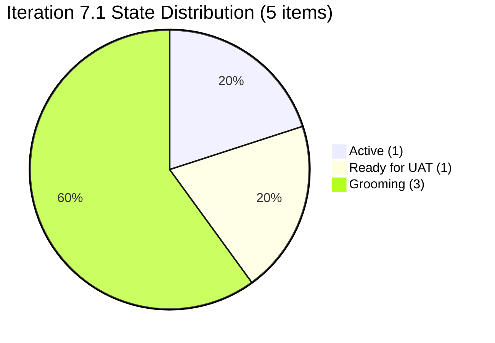
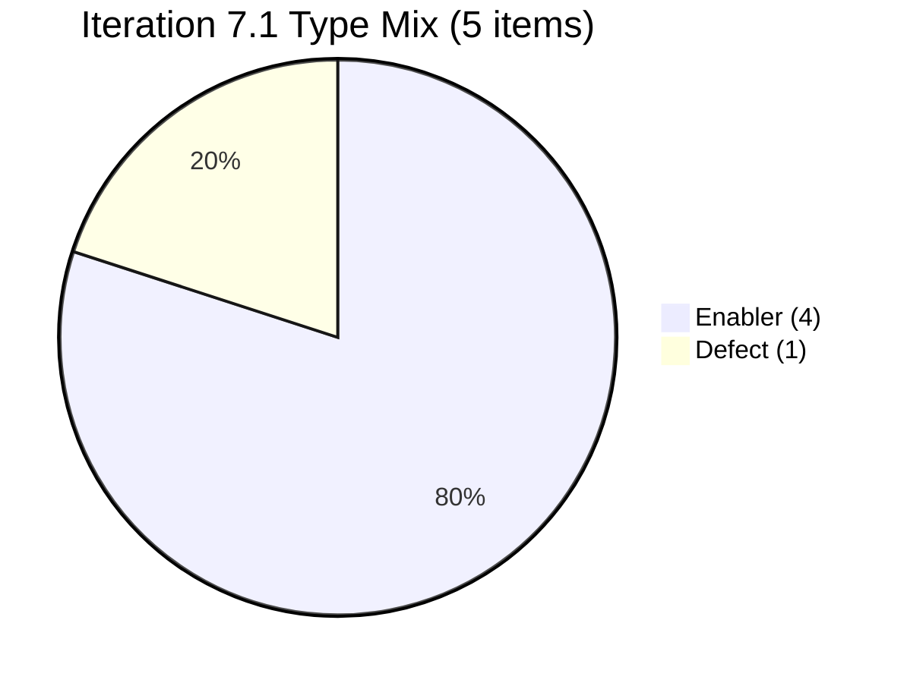
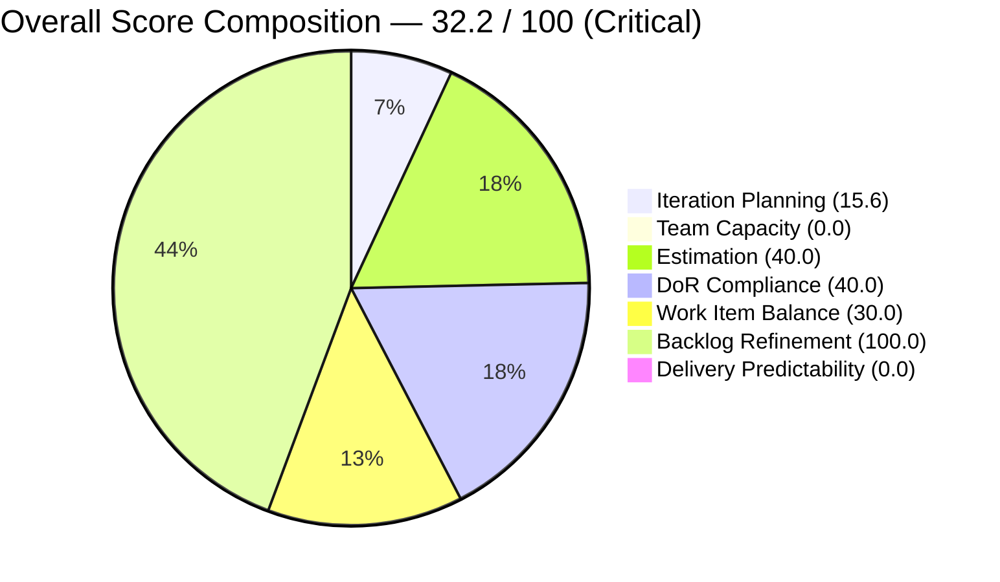
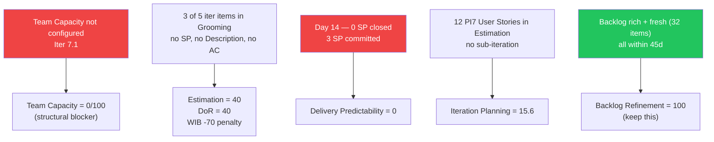

# Shared Services Team — ADO SAFe Iteration Audit

## 1. Audit Metadata

| Field | Value |
|---|---|
| **Project** | Jairosoft Portfolio |
| **Team** | Shared Services Team |
| **Workspace Folder** | `ado_shared/` |
| **Current Iteration** | Iteration 7.1 (`Jairosoft Portfolio\2026-PI7\Iteration 7.1`) |
| **Iteration ID** | `6079f2b6-2f7c-4b10-adfd-93071eb965f7` |
| **Iteration Start** | April 6, 2026 |
| **Iteration Finish** | April 19, 2026 |
| **Day in Sprint** | Day 14 of 14 — Sprint Close (today) |
| **Audit Date** | April 19, 2026 19:47 PDT |
| **Auditor** | Claude Code — `ado-safe-audit` skill |
| **ADO Org** | `jairo` (`dev.azure.com/jairo`) |
| **ADO Project ID** | `666bb99a-6acd-4999-bb34-efd0e4ea90dc` |
| **ADO Team ID** | `bd9578fd-5773-48fc-bd80-988dfe5de806` |
| **Scoped Backlog** | `Microsoft.RequirementCategory` (board focus: `Stories`) |
| **Previous Audit** | None — this is the **baseline audit** for `ado_shared` |
| **Overall Score** | **32.2 / 100** |
| **Risk Band** | **Critical** (< 40) |

---

## 2. Executive Summary

This is the **baseline audit** for the Shared Services Team. The team sits inside the `Jairosoft Portfolio` ADO project alongside other SAFe ART teams (Lean Portfolio Management, AI Enabler, DevOps IT System, Product Teams, etc.) and operates as a cross-cutting services function covering UIUX, IT, and DevOps. The audit therefore frames delivery signals with that context in mind — Shared Services work routinely flows through other product teams' boards and may not surface entirely on this team's own backlog.

Even with that contextual framing, the Day 14 snapshot is weak:

- **5 items** on the current iteration out of **32 visible root backlog items** — Iteration Planning score 15.6, the lowest driver of the overall score aside from zero-valued dimensions.
- **3 of the 5 iteration items are in `Grooming` state with no Story Points, no Description, and no Acceptance Criteria.** These items are effectively placeholders that were added to the sprint backlog but never ready for execution.
- **0 SP closed** out of **3 SP committed** on Day 14 — Delivery Predictability = 0.0.
- **No team capacity was configured** for Iteration 7.1 — the Team Capacity dimension scores 0 deterministically.
- **No `User Story` items** on the current iteration (only `Defect` and `Enabler`), combined with an 80% Enabler share, drives a **−70 penalty** on Work Item Balance.
- **Positive signal:** the backlog itself is freshly maintained — all 32 visible root items have `ChangedDate` within 45 days (Backlog Refinement = 100).

The overall **32.2 / 100 (Critical)** score reflects both real discipline gaps (capacity not configured, items committed without DoR, 0 SP closed) and rubric artifacts for a service-model team (User Story scarcity, low Iteration Planning share). The prioritized recommendations separate the two so the real fixes get the attention.

---

## 3. Previous Audit Delta

**No prior audit** in `ado_shared/audit/`. This audit establishes the baseline. All subsequent audits should compute deltas against `AUDIT_20260419_1947.md`.

---

## 4. Current Iteration Snapshot

### Iteration

| Field | Value |
|---|---|
| Name | Iteration 7.1 |
| Path | `Jairosoft Portfolio\2026-PI7\Iteration 7.1` |
| Dates | April 6 – April 19, 2026 (14 days) |
| Day | 14 of 14 (sprint closes today) |

### Contributors on iteration work

| Contributor | Role (from team) | Items Assigned | Configured Capacity |
|---|---|---|---|
| Vicsante Aseniero | <vaseniero@jairosoft.com> | 1 (#202731 Defect) | **Not configured** |
| Teofilo Limpag | <tfllmpg@jairosoft.com> | 4 (#202732, #202928, #202929, #202932) | **Not configured** |

> `mcp__azure-devops__work_get_team_capacity` returned `No team capacity assigned to the team` for this iteration. See §10 Evidence Gaps.

### Iteration root items

| ID | Type | State | SP | Title | Assignee | DoR |
|---|---|---|---|---|---|---|
| 202731 | Defect | Active | 2 | Jodex Workspace Github Issues | Vicsante | ✓ |
| 202732 | Enabler | Ready for UAT | 1 | Add to Flawless ADO as Stakeholder — QA Intern | Teofilo | ✓ |
| 202928 | Enabler | Grooming | — | Cost Resource AA Comparison for This month and last month | Teofilo | ✗ |
| 202929 | Enabler | Grooming | — | Create Backup DB for Autoallies | Teofilo | ✗ |
| 202932 | Enabler | Grooming | — | Send Reimbursement for the Cebu Expense | Teofilo | ✗ |

---

## 5. Work Item Analysis

### Visible root backlog (all iterations)

| Cohort | Count | Notes |
|---|---|---|
| **Total visible root items** | **32** | From `Microsoft.RequirementCategory` backlog |
| Current iteration (7.1) | 5 | This audit's scope |
| Iteration 7.2 | 6 | Forward-planned (5 Enablers + 1 Design, all Blocked) |
| Iteration 7.3 | 1 | Spike (#202807) |
| PI7 parent (no sub-iter) | 12 | Estimation-state User Stories #202059–#202071 |
| PI6 parent or sub-iter | 5 | Carry items #186848, #196007, #201161, #200807–09, #201170 |
| No iteration path | 2 | #186848, #201919 — unplanned |

### State distribution — current iteration

### Type distribution — current iteration

No `User Story` items — this triggers the `-40` Work Item Balance penalty. Enabler share of 80% also triggers the `-30` dominant-type penalty.

### Freshness

All 32 visible root items have `ChangedDate` within 45 days. **0 stale (>90d)**, **0 stale (>180d)**, **0 untouched current-iter items**. This is the single cleanest freshness signal in today's portfolio audit batch.

### Story Points

| Item | Type | SP | State |
|---|---|---|---|
| 202731 | Defect | 2 | Active |
| 202732 | Enabler | 1 | Ready for UAT |
| **Committed SP (iteration 7.1)** | | **3** | |
| **Closed SP** | | **0** | |

3 items in `Grooming` are `Enabler` with no SP — they are not point-eligible in execution-readiness terms but are counted as point-eligible by type (Enabler exposes the field), hence they enter the Estimation denominator.

---

## 6. SAFe Compliance Scorecard

| Dimension | Score | Evidence | Notes |
|---|---|---|---|
| **Iteration Planning** | **15.6** | 5 current-iter items / 32 visible root items × 100 | Low by formula; see §7 for context on cross-cutting Shared Services work routing. |
| **Team Capacity** | **0.0** | 0 of 2 contributors have configured capacity or activity for Iter 7.1 | Team capacity API returned `No team capacity assigned`. Evidence gap; zero-denom per skill rule. |
| **Estimation** | **40.0** | 2 of 5 point-eligible current items have Story Points > 0 | 3 Grooming enablers lack SP; likely placeholders. |
| **DoR Compliance** | **40.0** | 2 of 5 current items meet Description ≥ 30 chars AND AC ≥ 20 chars | #202731 and #202732 pass cleanly; 3 Grooming items have empty Description and AC. |
| **Work Item Balance** | **30.0** | 100 − 40 (no User Story) − 30 (Enabler dominant at 80%) − 0 (spike_share 0%) | Structural: Shared Services team writes Enablers by nature. See recommendations. |
| **Backlog Refinement** | **100.0** | 32 / 32 fresh (≤ 45d); stale_90 = 0; stale_180 = 0; untouched_current = 0 | Strongest signal in this audit. |
| **Delivery Predictability** | **0.0** | 0 closed SP / 3 committed SP × 100 | Day 14 (not early-sprint). Sprint ends today with nothing closed. |
| **Overall Score** | **32.2 / 100** | (15.6 + 0.0 + 40.0 + 40.0 + 30.0 + 100.0 + 0.0) / 7 = 225.6 / 7 | **Critical Risk** (< 40) |

---

## 7. Dimension Findings

### Iteration Planning (15.6) — Moderate-effort fix with big upside

Only 5 of 32 visible root items are on Iteration 7.1. The rest live on: Iteration 7.2 (6), PI7 parent path (12 Estimation-state User Stories awaiting refinement), PI6 paths (5 carry items), no iteration (2), Iteration 7.3 (1 Spike). The 12 PI7-parent Estimation-state items are the clearest planning gap — they are committed to the PI but not assigned to a sub-iteration. Assigning them to 7.2/7.3/7.4 would mechanically raise Iteration Planning.

> **Contextual caveat:** Shared Services work frequently flows through product teams' iterations. Some of this team's real delivery may not appear on their own board, which would structurally cap this dimension. Confirm with PO/PDM before over-indexing on this score alone.

### Team Capacity (0.0) — Structural blocker

`mcp__azure-devops__work_get_team_capacity` returned `No team capacity assigned to the team` for Iteration 7.1. Per skill rule, `contributors_with_capacity = 0`, so `Team Capacity = 0/2 × 100 = 0.0`. This is the single highest-leverage fix: configuring any capacity for Vicsante or Teofilo takes the dimension from 0 to ≥ 50, raising the overall by **~7–14 points** on its own.

### Estimation (40.0) — Linked to Grooming items

Two items have SP (#202731 = 2, #202732 = 1). Three Grooming enablers have `SP = null`. Either (a) size them before sprint close, (b) push them to 7.2, or (c) keep them on the iteration as acknowledged placeholders. Any of the three clears the dimension one way or another.

### DoR Compliance (40.0) — Same 3 Grooming items

Items with DoR = OK are #202731 (desc=150 chars, AC=601 chars) and #202732 (desc=72, AC=37). The three Grooming items have Description = 0 and AC = 0 — they were added to the sprint backlog without description/AC content. Writing them up is a 10–15 minute task each.

### Work Item Balance (30.0) — Largely structural for a Shared Services team

The two penalties that apply (no User Story, Enabler dominance) are natural for a cross-cutting services team. Product delivery teams write User Stories; platform/infra teams write Enablers. Consider either (a) documenting this as a Project Exception (the skill explicitly allows it) or (b) including at least one small User Story per iteration that captures the team's own delivery (e.g., "As an AA team, I can run cost comparisons monthly" — which would cover #202928).

### Backlog Refinement (100.0) — Preserve this

The only dimension at ceiling. Every visible root item has `ChangedDate` within 45 days. Keep the refinement cadence that produced this.

### Delivery Predictability (0.0) — Day 14, sprint closing

0 SP closed vs 3 SP committed. #202732 (1 SP, Ready for UAT) is the closest to closure — a single UAT sign-off flips that item and lifts Delivery Predictability from 0 to 33.3 (+4.8 overall). #202731 (2 SP Defect, Active) may extend into 7.2.

---

## 8. Risks and Bottlenecks

| # | Risk | Severity | Why it matters |
|---|---|---|---|
| 1 | Team Capacity not configured for Iter 7.1 | **Critical** | Deterministic 0 on a weighted dimension; every audit will show 0 until corrected. |
| 2 | 3 Grooming items committed to iteration without SP/Desc/AC | **Critical** | Item-level quality failure; drives 3 dimensions down simultaneously (Est, DoR, WIB). |
| 3 | 0 SP closed at sprint close (Day 14) | **Critical** | #202732 Ready for UAT is the only near-term lever; UAT sign-off today would lift DP from 0 to 33.3. |
| 4 | 12 PI7-parent User Stories without sub-iteration assignment | **High** | Artificially depresses Iteration Planning; they're committed to the PI but orphaned at the iteration level. |
| 5 | No User Story in iteration; Enabler-dominant type mix | **Medium** (structural) | Shared Services nature; consider Project Exception documentation or "team User Story" ceremonial fix. |
| 6 | #202731 Defect Active at Day 14 | **Medium** | 2 SP in-flight, likely carry to 7.2; adjust 7.2 commitment accordingly. |

---

## 9. Prioritized Recommendations

### P0 — Do today (before sprint close)

1. **Close #202732 if UAT is complete.** (Teofilo, 15 min.) Pushes Delivery Predictability from 0.0 → 33.3 (+4.8 overall, still Critical but meaningful directional signal).
2. **Resolve the three Grooming items.** (Teofilo, 30–45 min total.) Either (a) add Description + AC + Story Points and move to a real execution state, (b) roll to 7.2, or (c) delete/close as never-started. Any of the three fixes Estimation and DoR for the next audit.

### P1 — Before Iteration 7.2 kickoff (Apr 21–22)

1. **Configure team capacity for Iteration 7.2.** (Ramon/PDM or team lead, 20 min.) Assign per-day capacity to Vicsante and Teofilo. This one-time config raises Team Capacity from 0 to ≥ 50 in every future audit until off-cycles — the single highest-leverage rubric fix.
2. **Assign sub-iteration to the 12 PI7-parent User Stories.** (PO, 30 min.) Distribute #202059–#202071 across 7.2/7.3/7.4 so they count toward Iteration Planning on the right sprint.
3. **Document the Shared Services Project Exception.** Add a bullet under `Project Exceptions` in `ado_shared/CLAUDE.md` stating that Enabler dominance + absence of User Stories on this team's board is structural (cross-cutting services). This lets future audits annotate WIB findings accordingly.

### P2 — PI7.2 and beyond

1. **Adopt "no Grooming items in iteration" rule.** Grooming-state items belong on the backlog, not the iteration. Easy policy win.
2. **Consider one synthetic "team User Story" per iteration** that captures a Shared Services deliverable (e.g., "Monthly AA cost-comparison report produced"). This partially mitigates the -40 "no User Story" WIB penalty without changing the team's actual work model.
3. **Track Shared Services work that lands on product teams' boards.** Add a section to the team's retrospective covering Enablers delivered through AA, CH, LS, etc. — gives a truer delivery view than this team's board alone can show.

---

## 10. Evidence Gaps and Limitations

| Gap | Impact | Mitigation |
|---|---|---|
| **No team capacity configured** for Iter 7.1 | Team Capacity = 0.0 deterministically | Recommendation P1 #3 above |
| **3 Grooming items with empty Description + AC** | Cannot judge whether they were true commitments or queue placeholders | Recommendation P0 #2 above |
| **ChangedDate values of 2026-04-20** on 3 items | Forward-dated by 1 day vs audit timestamp | Likely timezone offset (UTC+8 server); treated as fresh within 45d window |
| **Shared Services work routing** | This team's real output may land on product teams' boards (AA, Colina Health, Flawless, etc.), not here | Recommendation P2 #8 above; not fixable by audit scope |
| **First audit for this workspace** | No delta baseline | Subsequent audits use `AUDIT_20260419_1947.md` as the anchor |
| **`Stories` vs `Stories and Deliverables` backlog naming** | Team board URL uses `/Stories`; backlog category `Microsoft.RequirementCategory` returned 32 items successfully — no scoping issue, just a naming note | No action |

---

*Audit complete. Next audit: run `/ado-safe-audit ado_shared` or include in the `/ado-safe-audit all-projects` batch starting Iteration 7.2.*
