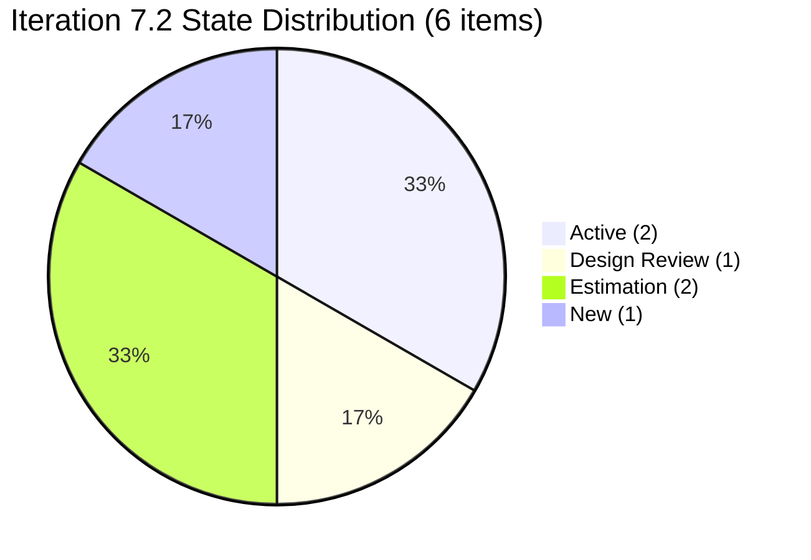
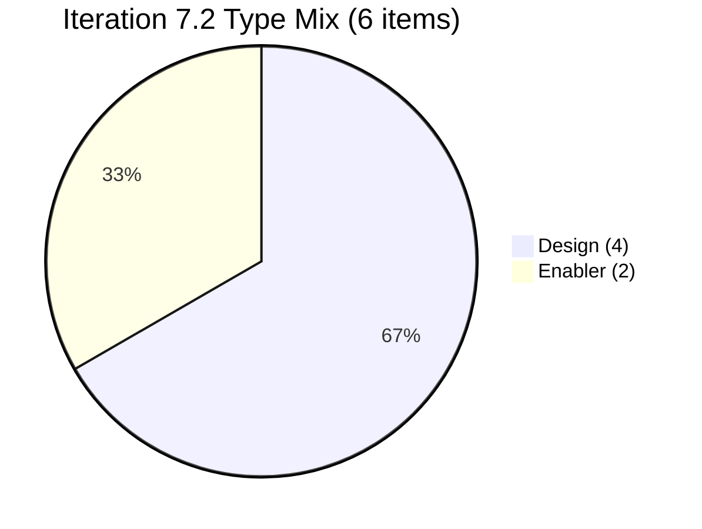
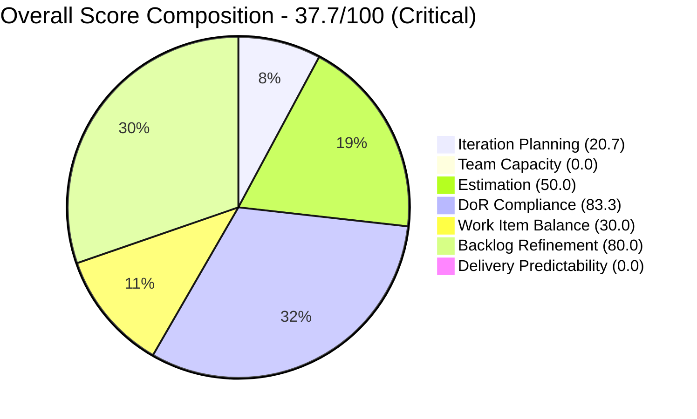
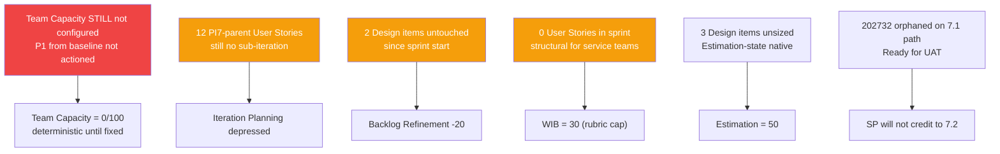

# Shared Services Team — ADO SAFe Iteration Audit

## 1. Audit Metadata

| Field | Value |
|---|---|
| **Project** | Jairosoft Portfolio |
| **Team** | Shared Services Team |
| **Workspace Folder** | `ado_shared/` |
| **Current Iteration** | Iteration 7.2 (`Jairosoft Portfolio\2026-PI7\Iteration 7.2`) |
| **Iteration ID** | `8edbe25f-fa4f-41b2-aaae-f3d5cf0e5b33` |
| **Iteration Start** | April 20, 2026 |
| **Iteration Finish** | May 3, 2026 |
| **Day in Sprint** | Day 2 of 14 — early sprint |
| **Audit Date** | April 21, 2026 09:30 PDT |
| **Auditor** | Claude Code — `ado-safe-audit` skill (batch team, all-projects) |
| **ADO Org** | `jairo` (`dev.azure.com/jairo`) |
| **ADO Project ID** | `666bb99a-6acd-4999-bb34-efd0e4ea90dc` |
| **ADO Team ID** | `bd9578fd-5773-48fc-bd80-988dfe5de806` |
| **Scoped Backlog** | `Microsoft.RequirementCategory` (board focus: `Stories`) |
| **Previous Audit** | `AUDIT_20260419_1947.md` — baseline Critical 32.2 at 7.1 close |
| **Overall Score** | **37.7 / 100** |
| **Risk Band** | **Critical** (< 40) |

---

## 2. Executive Summary

This is the **second audit** for Shared Services Team and the first 7.2 audit against the baseline Critical 32.2 from 7.1 close. The overall score moves to **37.7 / 100 — still Critical** — a +5.5 improvement driven entirely by **removal of the 3 unrefined Grooming items** (one of the three baseline findings). However, the two other baseline findings are **not fixed**:

- **Team Capacity configuration is still missing for Iteration 7.2.** `mcp__azure-devops__work_get_team_capacity` returned the same `No team capacity assigned to the team` error as at baseline. This is a deterministic 0 on the dimension and will recur in every future audit until corrected. **This was the explicit baseline P1 #3 recommendation and has not been actioned.**
- **Work mix is still Enabler/Design-dominant with zero User Stories on the current iteration.** The baseline flagged 80% Enabler share; 7.2 is 33% Enabler + 67% Design (no User Story), triggering both the no-User-Story -40 penalty and the dominant-type -30 penalty. The composition changed but the rubric outcome is identical (-70 → WIB = 30).

What did improve since baseline:

- **The 3 Grooming-state items are gone.** #202928 (AA cost comparison), #202929 (Backup DB for Autoallies), #202932 (Cebu reimbursement) are no longer on the backlog query result. They were either closed, removed, or state-migrated — ADO change history wasn't pulled in this audit to confirm which, but the outcome is a cleaner 7.2 commit.
- **DoR Compliance is up to 83.3** (from 40 at baseline) — 5 of 6 current items have Desc + AC, versus 2 of 5 at baseline.
- **Backlog Refinement stayed strong at 80.0** (was 100 at baseline). The 20-point drop is a single penalty for 2/6 current items untouched since sprint start — not a freshness issue across the full backlog.

Wiki reference: `wiki/synthesis/service-model-scoring` proposes a tier-aware rubric adjustment for service teams on the no-User-Story penalty. Per skill authority, this audit does **not** apply that adjustment — it is noted as an Open Question in §10.

---

## 3. Previous Audit Delta

| Dimension | Baseline — 7.1 Day 14 (Apr 19) | A2 — 7.2 Day 2 (Apr 21) | Delta |
|---|---|---|---|
| Iteration Planning | 15.6 | 20.7 | +5.1 |
| Team Capacity | 0.0 | 0.0 | **0.0 (unfixed)** |
| Estimation | 40.0 | 50.0 | +10.0 |
| DoR Compliance | 40.0 | 83.3 | **+43.3** |
| Work Item Balance | 30.0 | 30.0 | 0.0 |
| Backlog Refinement | 100.0 | 80.0 | **-20.0** |
| Delivery Predictability | 0.0 | 0.0 (early-sprint) | 0.0 |
| **Overall** | **32.2** | **37.7** | **+5.5** |

### Key changes since baseline

- **3 Grooming items removed.** #202928, #202929, #202932 are no longer in the backlog query. Baseline's primary item-quality risk is cleared.
- **#202732 (Enabler, Ready for UAT, SP=1) — still on Iter 7.1 path.** It did NOT close by sprint end and was not moved to 7.2 or 7.6 (IP). It remains the only "closest to closure" item on the board but is sitting on the closed iteration's path.
- **12 PI7-parent User Stories (#202059–#202071) — unchanged.** Still in Estimation state, no sub-iteration. Baseline P1 #2 not actioned.
- **Team capacity configuration — unchanged.** Still returns `No team capacity assigned to the team`. Baseline P1 #1 not actioned.
- **5 new items on 7.2 iteration:** 
  - #202393 (Enabler, Active, SP=2) — Branch Protection AutoAllies
  - #202551 (Design, Design Review, SP=3) — Bride Account Management
  - #202553 (Design, Estimation, no SP) — Vendor Exploration & Search
  - #202687 (Design, New, no SP) — Onboarding & Subscription Management
  - #202724 (Design, Estimation, no SP) — Vendor Profile & Details
  - #203115 (Enabler, Active, SP=2) — Add New Network/Footage Monitoring Cebu (created Apr 21 01:19 PHT — Day 2)
- **#202947 (Spike) added to Iter 7.6 (IP).** End-of-PI feedback survey, no SP, no assignee.
- **New contributor on board:** Jaszmeine Abigaille Villanueva (Design items). The team is now working in 3-contributor mode: Vicsante (PI6 carry items), Teofilo (enablers), Jaszmeine (designs).

### Three baseline questions — answered

1. **Has Team Capacity been configured for Iteration 7.2?** **NO.** Deterministic 0 persists.
2. **Are the 3 Grooming items from 7.1 still present?** **NO — they are gone.** Mode of removal not captured without pulling revision history; outcome is positive.
3. **Does the work mix still skew Enabler-dominant with 0 User Stories?** **Partially.** Enabler is no longer dominant (2 Enabler + 4 Design in 7.2), but **zero User Stories remain**, so the -40 penalty is unchanged. Design is now the dominant type (67%), triggering the same -30 penalty. Net WIB = 30.0 (identical to baseline).

---

## 4. Current Iteration Snapshot

### Iteration

| Field | Value |
|---|---|
| Name | Iteration 7.2 |
| Path | `Jairosoft Portfolio\2026-PI7\Iteration 7.2` |
| Dates | April 20 – May 3, 2026 (14 days) |
| Day | 2 of 14 — early sprint |

### Contributors on iteration work

| Contributor | Role | Items Assigned | Configured Capacity |
|---|---|---|---|
| Teofilo Limpag | `tfllmpg@jairosoft.com` | 2 (#202393, #203115) | **Not configured** |
| Jaszmeine Abigaille Villanueva | `jvillanueva@jairosoft.com` | 4 (#202551, #202553, #202687, #202724) | **Not configured** |

> `mcp__azure-devops__work_get_team_capacity` returned `No team capacity assigned to the team` — same as baseline.

### Iteration root items

| ID | Type | State | SP | Title | Assignee | DoR |
|---|---|---|---|---|---|---|
| 202393 | Enabler | Active | 2 | Branch Protection & Enforcement AutoAllies in Github | Teofilo | PASS |
| 202551 | Design | Design Review | 3 | Bride Account Management | Jaszmeine | PASS (borderline) |
| 202553 | Design | Estimation | — | Vendor Exploration & Search | Jaszmeine | PASS |
| 202687 | Design | New | — | Onboarding & Subscription Management | Jaszmeine | **FAIL** |
| 202724 | Design | Estimation | — | Vendor Profile & Details | Jaszmeine | PASS |
| 203115 | Enabler | Active | 2 | Add New Network and Footage Monitoring Setup for Cebu Office | Teofilo | PASS |

---

## 5. Work Item Analysis

### Visible root backlog (all iterations)

| Cohort | Count | Notes |
|---|---|---|
| **Total visible root items** | **29** | From `Microsoft.RequirementCategory` backlog |
| Current iteration (7.2) | 6 | This audit's scope |
| Iteration 7.1 (carry) | 1 | #202732 (Enabler, Ready for UAT, SP=1) — did not close at 7.1 end |
| Iteration 7.3 | 1 | #202807 (Spike) |
| Iteration 7.6 (IP) | 1 | #202947 (Spike, new Apr 20) |
| PI7 parent (no sub-iter) | 12 | Estimation-state User Stories #202059–#202071 — unchanged since baseline |
| PI6 paths | 6 | #196007, #200807–#200809, #201161, #201170 |
| Jairosoft Portfolio root | 2 | #186848, #201919 — unplanned |

### State distribution — current iteration



### Type distribution — current iteration



**No `User Story` items** — same as baseline, triggers the -40 penalty. Design share of 67% (> 60%) triggers the dominant-type -30 penalty. The composition changed (Design replaced Enabler as dominant) but the rubric outcome is identical to baseline (WIB = 30).

### Freshness

Today = 2026-04-21. 45-day threshold = 2026-03-07.

| Bucket | Threshold | Count |
|---|---|---|
| Fresh | ChangedDate ≥ 2026-03-07 | 29 / 29 |
| Stale ≥ 90 days | Before 2026-01-21 | 0 |
| Stale ≥ 180 days | Before 2025-10-24 | 0 |
| **Untouched current-sprint items** (ChangedDate < 2026-04-20) | | **2** |

The 2 untouched-current items are **#202551** (last changed 2026-04-17) and **#202687** (last changed 2026-04-17). Both Design items were committed to 7.2 on April 17 and have had no update on sprint Days 1 or 2. At 2/6 = 33.3% > 30%, this triggers a -20 penalty (not the -10 threshold).

### Story Points

| Item | Type | SP | State |
|---|---|---|---|
| 202393 | Enabler | 2 | Active |
| 202551 | Design | 3 | Design Review |
| 202553 | Design | — | Estimation |
| 202687 | Design | — | New |
| 202724 | Design | — | Estimation |
| 203115 | Enabler | 2 | Active |
| **Committed SP (iteration 7.2)** | | **7** | |
| **Closed SP** | | **0** | |

3 items lack SP; all in the Design type. Estimation is the native state for Design items, so their null SP is operationally normal — they are still counted as point-eligible by type (Design exposes Story Points). Three Design items unsized → Estimation 3/6 = 50.0.

---

## 6. SAFe Compliance Scorecard

| Dimension | Score | Evidence | Notes |
|---|---|---|---|
| **Iteration Planning** | **20.7** | 6 current-iter items / 29 visible root items × 100 = 20.689…→20.7 | +5.1 vs baseline; 12 PI7-parent Estimation stories still orphaned. |
| **Team Capacity** | **0.0** | 0 of 2 contributors have configured capacity for Iter 7.2 | **Unchanged from baseline — still not configured.** |
| **Estimation** | **50.0** | 3 of 6 point-eligible current items have Story Points > 0 | 3 Design items unsized in Estimation-state (native behavior). |
| **DoR Compliance** | **83.3** | 5 of 6 current items meet Desc ≥ 30 AND AC ≥ 20 | Only #202687 fails (title only, no Desc/AC). |
| **Work Item Balance** | **30.0** | 100 − 40 (no User Story) − 30 (Design dominant at 67%) − 0 (no Spike) | Structural; Shared Services doesn't write User Stories on its own board. |
| **Backlog Refinement** | **80.0** | base 100 (29/29 fresh) − 20 (untouched_current 2/6 = 33.3% > 30%) | -20 vs baseline — 2 Design items not touched since sprint start. |
| **Delivery Predictability** | **0.0** | 0 closed SP / 7 committed SP × 100; **early-sprint — low delivery expected (Day 2 of 14)** | Not a scoring adjustment; annotation only. |
| **Overall Score** | **37.7 / 100** | (20.7 + 0.0 + 50.0 + 83.3 + 30.0 + 80.0 + 0.0) / 7 = 264.0 / 7 = 37.714… → 37.7 | **Critical Risk** (< 40) |

### Score computation detail

```
1. Iteration Planning
   visible_root_backlog_items           = 29
   current_iteration_root_items (7.2)   = 6
   Score = round(6 / 29 * 100, 1)       = 20.7

2. Team Capacity
   contributors_with_current_work       = 2 (Teofilo, Jaszmeine)
   contributors_with_capacity           = 0 (capacity API: no assignment)
   Score = round(0 / 2 * 100, 1)        = 0.0

3. Estimation
   point_eligible_current_items         = 6 (2 Enabler + 4 Design)
   estimated_current_items              = 3 (202393=2, 202551=3, 203115=2)
   Score = round(3 / 6 * 100, 1)        = 50.0

4. DoR Compliance
   current_iteration_root_items         = 6
   dor_compliant_current_items          = 5 (202393, 202551, 202553, 202724, 203115)
   Score = round(5 / 6 * 100, 1)        = 83.3

5. Work Item Balance
   User Story present                   = False (-40)
   dominant_type_share                  = 4/6 = 66.7% > 60% (-30)
   spike_share                          = 0% (no penalty)
   Score = max(0, 100 - 40 - 30)        = 30.0

6. Backlog Refinement
   fresh_visible_root_items             = 29
   base = round(29 / 29 * 100, 1)       = 100.0
   stale_90                             = 0  no penalty
   stale_180                            = 0  no penalty
   untouched_current_items / 6          = 2/6 = 33.3% > 30% (-20)
   Score = max(0, 100 - 20)             = 80.0

7. Delivery Predictability
   committed_story_points               = 7 SP (2+3+2)
   closed_story_points                  = 0
   Score = round(0 / 7 * 100, 1)        = 0.0
   Annotation: early-sprint (Day 2 of 14) — low delivery expected

Overall = round((20.7 + 0.0 + 50.0 + 83.3 + 30.0 + 80.0 + 0.0) / 7, 1)
        = round(264.0 / 7, 1)
        = round(37.714, 1)
        = 37.7   ->  CRITICAL (< 40)
```



---

## 7. Dimension Findings

### Iteration Planning (20.7) — Mechanical drag from 12 orphan PI7-parent stories

Only 6 of 29 visible root items are on Iteration 7.2. The dominant drag is the **unchanged 12 PI7-parent User Stories** (#202059–#202071) that sit in Estimation state with no sub-iteration assignment — these were flagged in baseline P1 #2 and have not been touched. Assigning them to 7.2/7.3/7.4 (as originally recommended) would mechanically raise the dimension.

### Team Capacity (0.0) — Baseline finding NOT fixed

`mcp__azure-devops__work_get_team_capacity` returned `No team capacity assigned to the team` for Iteration 7.2 — **identical error to the baseline audit**. Per skill rule, `contributors_with_capacity = 0`, so the dimension scores 0 deterministically. The baseline P1 #1 recommendation ("Configure team capacity for Iteration 7.2") was not actioned between Apr 19 and Apr 21.

**This is the single highest-leverage fix in the audit.** Configuring any activity for either Teofilo or Jaszmeine — even 1 hour/day — raises the dimension from 0 to ≥ 50, shifting Overall by ~7 points and closing half the gap to Moderate.

### Estimation (50.0) — Driven by 3 unsized Design items

Design items are commonly in Estimation-state without Story Points (sizing happens during Design Review). This is operationally normal but rubrically drags the dimension. Two paths:

- Size the 3 Design items (#202553, #202687, #202724) before Day 5 — even rough sizing lifts Estimation to 100.
- Or accept that Design-heavy sprints will show Estimation in the 50–67 range and offset elsewhere.

### DoR Compliance (83.3) — Largest single improvement (+43.3 vs baseline)

5 of 6 current items have adequate Description + Acceptance Criteria. The only failure is **#202687 "Onboarding & Subscription Management"** — title only, no Desc, no AC. This is a 15-minute fix.

### Work Item Balance (30.0) — Structural; unchanged math with different composition

Still 0 User Stories; dominant type is now Design (67%) instead of Enabler (80% at baseline). Both the no-User-Story (-40) and dominant-type (-30) penalties apply. The team's work model legitimately doesn't produce User Stories on its own board — the wiki synthesis reference proposes a tier-aware adjustment for service teams that would remove the -40 penalty.

Per skill authority, **this audit does NOT apply the proposed synthesis adjustment.** The rubric is deterministic and uniform across all `ado_*` teams. The proposal is noted in Open Questions (§10) for portfolio-level review.

### Backlog Refinement (80.0) — Penalty for 2 untouched current-sprint items

Base is perfect (29/29 fresh, no staleness) but the -20 penalty kicks in for 2 Design items (#202551, #202687) last touched April 17 — before the sprint started on Apr 20. At 33.3% of current items untouched, the penalty is -20 (not -10). Touching either item today would flip the dimension back to 100.

### Delivery Predictability (0.0) — Early-sprint, expected

Day 2 of 14. 0 closed / 7 committed. Annotated as early-sprint per skill; no adjustment. The closest-to-closure item is #202551 (Design, Design Review state, 3 SP) — if design review signs off in Days 3–5, DP flips to 42.9.

**External delivery item to note:** #202732 (SP=1, Ready for UAT) is still sitting on the Iter 7.1 path. If UAT signs off during 7.2, that SP will credit to 7.1's retrospective, not to 7.2's current window.

---

## 8. Risks and Bottlenecks



| # | Risk | Severity | Why it matters |
|---|---|---|---|
| 1 | **Team Capacity not configured for Iter 7.2** — baseline P1 #1 not actioned | **Critical** | Deterministic 0 on weighted dimension; every future audit shows 0 until fixed. |
| 2 | **12 PI7-parent User Stories still orphan** — baseline P1 #2 not actioned | **High** | Artificially caps Iteration Planning at 20.7 until they get sub-iterations. |
| 3 | **#202687 missing Desc + AC** — the only DoR failure | **Medium** | 15-minute fix brings DoR from 83.3 to 100. |
| 4 | **#202551 + #202687 untouched since Apr 17** — triggers BR -20 | **Medium** | Touch either item today (status update, owner comment) and the penalty lifts. |
| 5 | **#202732 (Ready for UAT, 1 SP) sitting on closed 7.1 path** | **Medium** | UAT sign-off will credit to 7.1, not 7.2. Move to 7.2 or 7.6 (IP) if it's now 7.2 work. |
| 6 | **Work mix 0 User Story / 67% Design** — same structural pattern as baseline | **Medium (structural)** | See Open Questions in §10 re: tier-aware scoring proposal. |
| 7 | **Day 2 with 2 items already untouched** — early signal of slow ramp | **Low** | Touch the Design items in the next 48h to clear the signal. |

---

## 9. Prioritized Recommendations

### P0 — Today (Apr 21, Day 2) or first thing Apr 22 (Day 3)

1. **Configure team capacity for Iteration 7.2.** (Ramon/PDM/Carol, 20 min.) This is the most-repeated recommendation in ado_shared history — still the single highest-leverage fix. Assigning per-day capacity to Vicsante, Teofilo, and Jaszmeine takes Team Capacity from 0 to ≥ 50 deterministically.
2. **Write Description + Acceptance Criteria for #202687** "Onboarding & Subscription Management". (Jaszmeine, 15 min.) Lifts DoR to 100, Overall to ~40.
3. **Touch #202551 and #202687 on ADO today** (status comment, progress update, or owner confirmation). Clears the Backlog Refinement -20 penalty, lifts dimension to 100 and Overall to ~40.6.

### P1 — Before Day 5 (Apr 24)

1. **Size the 3 unsized Design items** (#202553, #202687, #202724) with rough estimates. Lifts Estimation from 50 to 100.
2. **Assign sub-iterations to #202059–#202071** (12 PI7-parent User Stories). Distribute across 7.2/7.3/7.4/7.5/7.6 based on Vicsante's ordering. Raises Iteration Planning significantly.
3. **Move #202732 off the 7.1 path** — either to 7.2 (if UAT is happening now) or to 7.6 (IP) / close it if UAT completed during 7.1 retrospective but state wasn't flipped.

### P2 — Before Iteration 7.3 (May 4) and for Portfolio review

1. **Document the Shared Services Project Exception.** (Ramon/Carol, 10 min.) Add to `ado_shared/CLAUDE.md` under `Project Exceptions` that Design/Enabler dominance + absence of User Stories on this team's board is structural (cross-cutting services). This enables future audits to annotate WIB findings accordingly even if the rubric penalty still applies.
2. **Adopt "no placeholder items in iteration" rule.** #202687 (title-only Design) should not have been committed to 7.2 without Desc/AC. Similar to baseline's "no Grooming in iteration" observation.
3. **Review the wiki synthesis proposal for service-team tier-aware scoring.** (Ramon + Karl, during portfolio review.) If adopted, the ado_shared baseline moves from Critical to Moderate without any process change — but adoption is a portfolio-level decision, not an audit decision.

---

## 10. Evidence Gaps and Limitations

| Gap | Impact | Notes |
|---|---|---|
| **Team capacity not configured for Iter 7.2 — SAME AS BASELINE** | Team Capacity = 0.0 deterministically | Recommendation P0 #1 — unfixed since baseline |
| **Mode of removal for 3 Grooming items (#202928, #202929, #202932)** | Cannot confirm whether they were closed, deleted, or state-migrated | Would require `wit_list_work_item_revisions`; outcome is positive either way |
| **#202687 title-only** | Cannot assess whether this is genuine scope or queue placeholder | Recommendation P0 #2 |
| **3 Design items unsized** | Estimation-state with null SP is native for Design type | Rubric doesn't distinguish; treated as unestimated |
| **12 PI7-parent User Stories orphaned — SAME AS BASELINE** | Iteration Planning depressed | Recommendation P1 #2 — unfixed since baseline |
| **#202732 (1 SP, Ready for UAT) on Iter 7.1 path** | UAT sign-off won't credit to current 7.2 iteration | Recommendation P1 #3 |

### Open Questions (not applied; noted for portfolio review)

- **Wiki synthesis [[wiki/synthesis/service-model-scoring]]** proposes a tier-aware rubric adjustment that would remove the -40 "no User Story" penalty for service teams like Shared Services. **This audit does NOT apply the proposed adjustment** — the shared skill rubric is authoritative and uniform across all `ado_*` workspaces. Whether to adopt the proposal is a portfolio-level decision (Ramon + Karl).
- **Is Shared Services genuinely "structurally cannot deliver User Stories on its own board"?** The wiki entity page [[wiki/entities/team-ado-shared]] asserts yes. Worth validating at the next retro: could the team legitimately author one "team User Story" per sprint that captures a Shared Services deliverable (e.g., "Monthly AA cost-comparison report produced")? This would partially mitigate the -40 WIB penalty without changing the team's real work model, per baseline P2 #2.

---

*Audit complete. Next audit: run `/ado-safe-audit ado_shared` or include in the `/ado-safe-audit all-projects` batch.*
