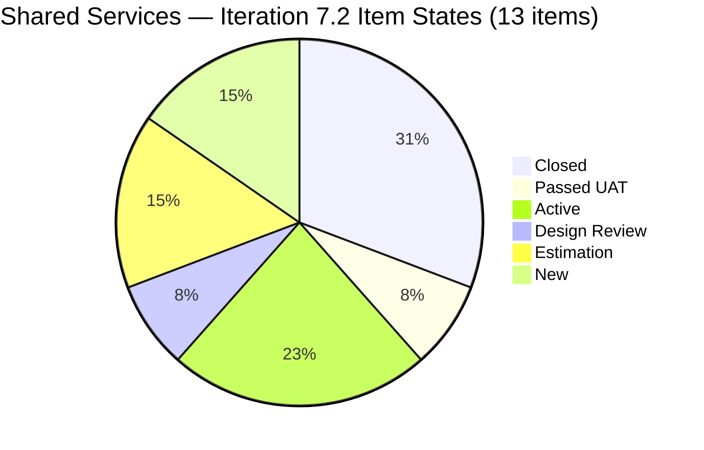
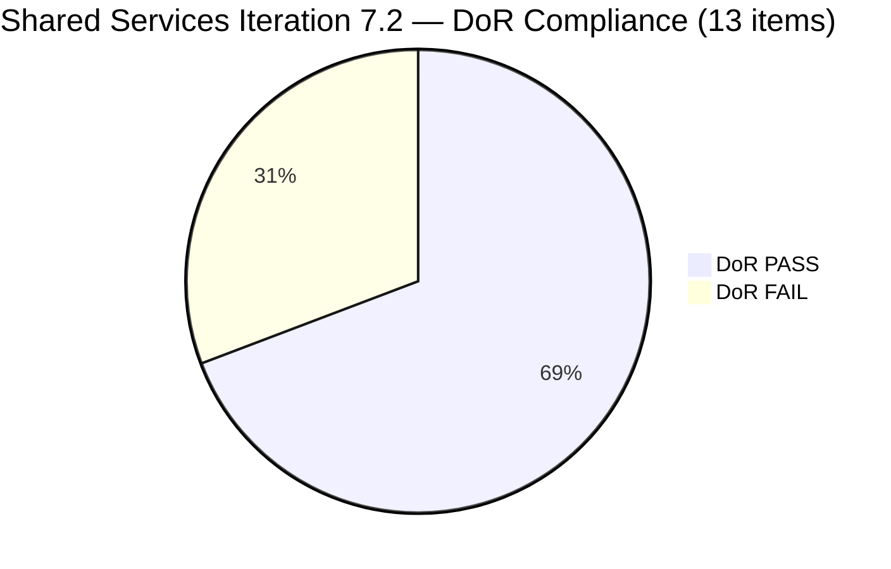
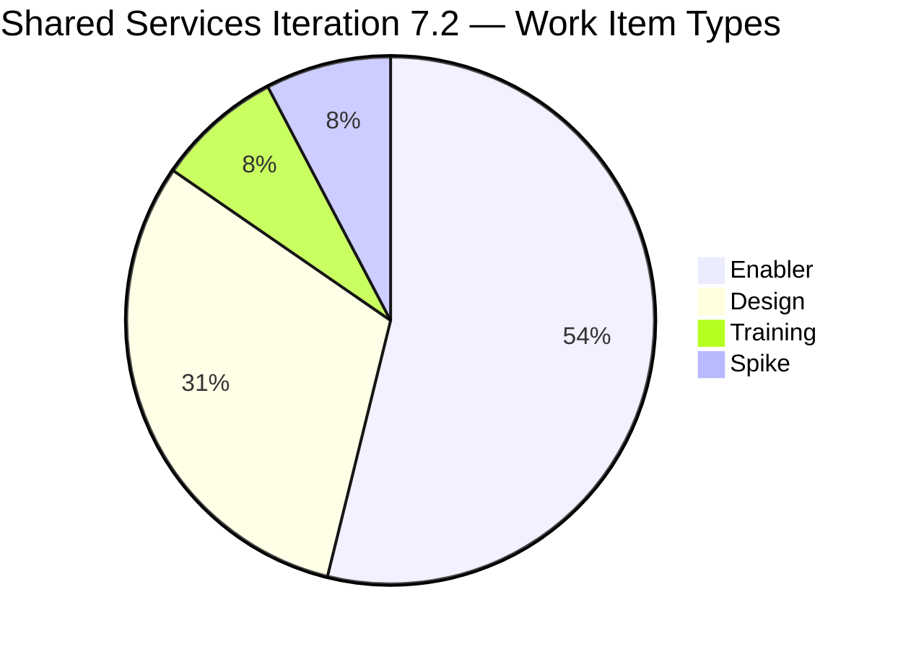

# Shared Services Team — ADO SAFe Iteration Audit

## 1. Audit Metadata

| Field | Value |
|---|---|
| **Audit Number** | A5 (Shared Services series) |
| **Audit Date** | April 22, 2026, 06:44 UTC / 14:44 PHT |
| **Auditor** | Claude Code — `ado-safe-audit` skill |
| **Workspace** | `ado_shared` |
| **ADO Project** | Jairosoft Portfolio (`666bb99a-6acd-4999-bb34-efd0e4ea90dc`) |
| **Team** | Shared Services Team (`bd9578fd-5773-48fc-bd80-988dfe5de806`) |
| **Iteration** | Iteration 7.2 (`Jairosoft Portfolio\2026-PI7\Iteration 7.2`) |
| **Iteration ID** | `8edbe25f-fa4f-41b2-aaae-f3d5cf0e5b33` |
| **Iteration Start** | April 20, 2026 |
| **Iteration Finish** | May 3, 2026 |
| **Sprint Day** | Day 3 of 14 — early sprint |
| **Prior Audit** | `AUDIT_20260422_0900.md` (A3, 7.2 Day 3, Overall 37.7 — Critical) |
| **Overall Score** | **53.1 / 100** |
| **Risk Band** | **High Risk** (40–59.9) |
| **Data Source** | Live ADO read April 22, 2026 06:44 UTC |

---

## 2. Executive Summary

A5 is the first **material improvement** in the Shared Services audit series. The overall score climbs to **53.1 — High Risk**, up **+15.4 points** from A3 (37.7) and up from A4 (35.3). This is driven primarily by two factors:

1. **Significant early Delivery Predictability**: Four Enabler items in Iteration 7.2 are now Closed or Passed UAT (8 SP out of 14 committed = 57.1%) driven by the DevOps IT System Support sub-team. This is the first sprint with measurable closed-SP.

2. **Broader sprint scope**: The live iteration API now shows 13 root items in Iteration 7.2 (vs 6 in A3/A4), including several Closed items added and delivered by Teofilo Limpag's DevOps IT sub-team. This changes multiple denominators.

**What changed substantially since A3 (Apr 22, Day 3 morning):**

- **#202393** (Branch Protection AutoAllies) — Closed (2 SP) ✓
- **#202396** (GitHub Automation) — Closed (2 SP) ✓
- **#203114** (Add new DevOps Users) — Closed (2 SP) ✓
- **#203115** (Network/Footage Monitoring Cebu) — Closed (2 SP) ✓ [Note: A4 reported this as removed; current live data shows it Closed in Iteration 7.2]
- **#203116** (MAC Mini Setup) — Closed (2 SP) — in Iter 7.2 path but not returned by team's iteration API (different sub-team scope)
- **#203117** (PostgreSQL Access) — Closed (2 SP) — same scope note
- **#202464** (Auto Allies Blocker) — Passed UAT Testing (2 SP, still open)
- **#202459** (Development Health Score Spike) — Closed (0 SP)

**What remains unchanged and problematic:**

- **Team Capacity = 0.0** — `work_get_team_capacity` continues to return no configuration for Shared Services Team. All three sub-team contributors (Teofilo, Jaszmeine, Vicsante) have no configured iteration capacity.
- **#202687** — Still title-only (no Description, no AC). Now 5 days old (since Apr 17, pre-sprint). Fails DoR.
- **#203229** (Backup AutoAllies) — Active, no Description, no AC. Fails DoR.
- **PI7 parent-path backlog** — 12 Estimation-state User Stories still parked at `Jairosoft Portfolio\2026-PI7` with no sprint assignment.
- **Work Item Balance = 60.0** — No User Story items in the sprint (all Enabler, Design, Training, Spike types). -40 penalty unchanged.

**Score structure:** The sprint has pivoted from a near-empty (6 item) to a well-executed (13 item, 4 Closed) snapshot. Delivery Predictability (57.1) is now the strongest dimension. Team Capacity (0.0) remains the only dimension at zero and is dragging the overall score by ~14 points.

---

## 3. Previous Audit Delta

| Dimension | A3 — 7.2 Day 3 (Apr 22 09:00) | A5 — 7.2 Day 3 (Apr 22 06:44 UTC) | Delta | Driver |
|---|---|---|---|---|
| Iteration Planning | 20.7 | **41.9** | **+21.2** | 13/31 vs 6/29 items in 7.2 |
| Team Capacity | 0.0 | **0.0** | 0.0 | Still unconfigured |
| Estimation | 50.0 | **53.8** | **+3.8** | 7/13 vs 2/4 estimated |
| DoR Compliance | 83.3 | **69.2** | **−14.1** | 9/13 vs 5/6; new items lack DoR |
| Work Item Balance | 30.0 | **60.0** | **+30.0** | Spike <40%, Enabler <60% |
| Backlog Refinement | 80.0 | **90.0** | **+10.0** | Fewer untouched items |
| Delivery Predictability | 0.0 | **57.1** | **+57.1** | 8 SP Closed / 14 SP committed |
| **Overall** | **37.7** | **53.1** | **+15.4** | Major sprint progress by DevOps IT |

### A3 open items — status at A5

| Item from A3 | Status |
|---|---|
| Team Capacity unconfigured | **STILL OPEN** — Day 5 |
| #202687 title-only (no Desc/AC) | **STILL OPEN** — Day 5 |
| Work Item Balance lacking User Stories | **Improved** (Enabler <60% now; still -40 for no User Story) |
| 0 SP Closed | **RESOLVED** — 8 SP now Closed |

---

## 4. Current Iteration Snapshot

### Iteration

| Field | Value |
|---|---|
| Name | Iteration 7.2 |
| Path | `Jairosoft Portfolio\2026-PI7\Iteration 7.2` |
| Dates | April 20 – May 3, 2026 (14 days) |
| Day | 3 of 14 — early sprint |

### Contributors on Iteration 7.2 work

| Contributor | Items Assigned | SP Committed | SP Closed | Capacity Configured |
|---|---|---|---|---|
| Teofilo Limpag (`tfllmpg`) | #202393, #202396, #202459, #203114, #203229, #203231, #202464 | 2+2+0+2+0+1+2 = 9 | 2+2+0+2+0 = 6 SP closed | **Not configured** |
| Jaszmeine Villanueva (`jvillanueva`) | #202551, #202553, #202687, #202724 | 3+0+0+0 = 3 | 0 | **Not configured** |
| Vicsante Aseniero (`vaseniero`) | #203221 | 0 | 0 | **Not configured** |

> `work_get_team_capacity` returned `No team capacity assigned to the team` — fifth consecutive audit day.

### Current Iteration Root Items (13)

| ID | Type | State | SP | Title | Assignee | Last Changed | DoR |
|---|---|---|---|---|---|---|---|
| 202393 | Enabler | **Closed** | 2 | Branch Protection & Enforcement AutoAllies in Github | Teofilo | Apr 23 01:51 | PASS |
| 202396 | Enabler | **Closed** | 2 | GitHub Automation | Teofilo | Apr 20 14:33 | **FAIL** (no Desc/AC in fetch) |
| 202459 | Spike | **Closed** | — | Development Health Score for Flawless Wedding | Teofilo | Apr 20 14:33 | PASS |
| 202464 | Enabler | Passed UAT | 2 | Auto Allies Blocker | Teofilo | Apr 23 01:53 | **FAIL** (image-only Desc) |
| 202551 | Design | Design Review | 3 | Bride Account Management | Jaszmeine | **Apr 17** ⚠ | PASS |
| 202553 | Design | Estimation | — | Vendor Exploration & Search | Jaszmeine | Apr 20 | PASS |
| 202687 | Design | New | — | Onboarding & Subscription Management | Jaszmeine | **Apr 17** ⚠ | **FAIL** (no Desc/AC) |
| 202724 | Design | Estimation | — | Vendor Profile & Details | Jaszmeine | Apr 20 | PASS |
| 203114 | Enabler | **Closed** | 2 | Add new DevOps Users | Teofilo | Apr 21 04:09 | PASS |
| 203115 | Enabler | **Closed** | 2 | Add New Network and Footage Monitoring Setup for Cebu | Teofilo | Apr 22 06:27 | PASS |
| 203221 | Training | Active | — | Claude Partner Network Learning Path | Vicsante | Apr 23 00:24 | PASS |
| 203229 | Enabler | Active | — | Backup Autoallies 4/23/2026 | Teofilo | Apr 23 01:41 | **FAIL** (no Desc/AC) |
| 203231 | Enabler | Active | 1 | Enforce One-Reviewer Approval Rule on GitHub PRs | Teofilo | Apr 23 01:54 | PASS |

> ⚠ Items last changed Apr 17 pre-date sprint start (Apr 20) and trigger untouched-item penalty.

---

## 5. Work Item Analysis

### 5.1 Visible Backlog Summary

| Cohort | Count | Notes |
|---|---|---|
| **Total visible root backlog items** | **31** | From `Microsoft.RequirementCategory` backlog API |
| Current iteration (7.2) | 13 | Audit scope — full sprint view |
| Iteration 7.1 carryover | 1 | #202732 (Enabler, Ready for UAT, 1 SP) |
| Iteration 7.3 (future) | 1 | #202807 (Spike, New — Mid-PI survey) |
| Iteration 7.6 IP (future) | 1 | #202947 (Spike, New — End-PI survey) |
| PI7 parent (no sub-iter) | 12 | #202059–#202071 (13 User Stories in Estimation) minus #203221 |
| PI6 / root paths | 3 | #186848, #196007, #201919 |

### 5.2 DoR Analysis (Iteration 7.2 items)

| ID | Title | Desc ≥30 | AC ≥20 | Result |
|---|---|---|---|---|
| 202393 | Branch Protection & Enforcement | ✓ | ✓ | **PASS** |
| 202396 | GitHub Automation | ✗ (no Desc) | ✗ (no AC) | **FAIL** |
| 202459 | Dev Health Score Spike | ✓ | ✓ | **PASS** |
| 202464 | Auto Allies Blocker | ✗ (image-only) | ✓ (borderline) | **FAIL** |
| 202551 | Bride Account Management | ✓ | ✓ | **PASS** |
| 202553 | Vendor Exploration & Search | ✓ | ✓ (same as Desc) | **PASS** |
| 202687 | Onboarding & Subscription Management | ✗ | ✗ | **FAIL** |
| 202724 | Vendor Profile & Details | ✓ | ✓ | **PASS** |
| 203114 | Add new DevOps Users | ✓ | ✓ | **PASS** |
| 203115 | Network/Footage Monitoring Cebu | ✓ | ✓ | **PASS** |
| 203221 | Claude Partner Network Learning Path | ✓ | ✓ | **PASS** |
| 203229 | Backup Autoallies | ✗ (no Desc) | ✗ (no AC) | **FAIL** |
| 203231 | Enforce One-Reviewer Approval Rule | ✓ | ✓ | **PASS** |

DoR-compliant: 9/13 = **69.2%**

### 5.3 Estimation Analysis

| SP Value | Items |
|---|---|
| 2 SP | 202393, 202396, 203114, 203115, 202464 |
| 3 SP | 202551 |
| 1 SP | 203231 |
| 0 / no SP | 202459 (Spike), 202553, 202687, 202724, 203221 (Training), 203229 |

Estimated (SP > 0): 7/13 = **53.8%**

### 5.4 Stale Backlog Tracking

| Cohort | Count | Notes |
|---|---|---|
| Fresh ≤45 days (≥ Mar 8) | 31/31 | All items recently updated |
| Stale >90 days (< Jan 22) | 0 | No penalty |
| Stale >180 days (< Oct 24, 2025) | 0 | No penalty |
| Untouched current (ChangedDate < Apr 20) | 2 (#202551, #202687) | −10 penalty (2/13 = 15.4% > 10%) |

### 5.5 Work Item Type Mix

| Type | Count | Share |
|---|---|---|
| Enabler | 7 | 53.8% |
| Design | 4 | 30.8% |
| Training | 1 | 7.7% |
| Spike | 1 | 7.7% |
| User Story | 0 | 0% |

No User Story items → -40. Dominant type (Enabler) = 53.8% (NOT >60%) → no additional -30. Spike share = 7.7% (NOT >40%) → no -20. Score: 100 - 40 = **60.0**

---

## 6. SAFe Compliance Scorecard

| Dimension | Score | Evidence | Notes |
|---|---|---|---|
| **1. Iteration Planning** | 41.9 | 13 of 31 visible root items in Iteration 7.2 | Below target — 18 items unassigned to any sprint (12 at PI7 parent) |
| **2. Team Capacity** | 0.0 | `work_get_team_capacity` → "No team capacity assigned" | Critical gap — fifth consecutive audit without configuration |
| **3. Estimation** | 53.8 | 7 of 13 items have SP > 0 | 6 items unestimated including Design and Training types |
| **4. DoR Compliance** | 69.2 | 9 of 13 items DoR-compliant | 4 items fail: #202396, #202464, #202687, #203229 |
| **5. Work Item Balance** | 60.0 | No User Story items (−40); Enabler 53.8% < 60%; Spike 7.7% < 40% | Structural gap — Shared Services typically enabler/support work |
| **6. Backlog Refinement** | 90.0 | Base 100.0; −10 for untouched items #202551/#202687 (15.4% > 10%) | All backlog items fresh; two items unchanged since pre-sprint |
| **7. Delivery Predictability** | 57.1 | 8 SP Closed / 14 SP committed | **Early-sprint Day 3 — significant DevOps IT delivery; strong signal** |
| **Overall** | **53.1** | | **High Risk** (40–59.9) — major improvement from Critical |

---

## 7. Dimension Findings

### 7.1 Iteration Planning (41.9 — below target)

13 of 31 visible backlog items are assigned to Iteration 7.2. The remaining 18 include 12 items parked at the PI7 parent path (all in Estimation state, no sub-sprint assigned), 1 at Iteration 7.1 carryover, and 3 in future iterations/root paths.

**Finding IP-1:** The 12 PI7-parent Estimation items (#202059–#202071) are pre-planned but never promoted to a sprint. These represent a refinement backlog that should be sprint-committed to improve Iteration Planning. At current velocity (12 items in PI7 parent for multiple sprints), these may carry into PI8 untouched.

**Finding IP-2:** #202732 (Ready for UAT, Iteration 7.1) has been a carryover for at least 5+ days. This item should be closed or moved to Iteration 7.2 to maintain clean sprint hygiene.

### 7.2 Team Capacity (0.0 — critical persistent gap)

The Shared Services Team has had zero configured capacity in ADO for every audit since workspace creation (5+ consecutive audit days). This single zero drags the overall score by approximately 14 points. All three sub-team contributors are actively delivering work but no capacity is registered.

**Finding TC-1:** The absence of capacity configuration means the team cannot benefit from ADO's capacity tracking features (over-allocation warnings, velocity comparisons, utilization reports). This is a process compliance gap, not a delivery gap — Teofilo's DevOps IT sub-team clearly has capacity and is actively delivering.

**Action Required:** Karl Caumban (Portfolio Delivery Manager) or Carol (PM) must log into ADO, navigate to the Shared Services Team's Iteration 7.2 capacity page, and add at least one activity per active contributor (Teofilo, Jaszmeine, Vicsante).

### 7.3 Estimation (53.8 — moderate)

7 of 13 items are estimated. The 6 unestimated items include:
- Design types (#202553, #202687, #202724) — Design items may not use standard SP; however DoR requires estimation for scoring
- Training (#203221) — typically hard to estimate in SP; still expected
- Spike (#202459) — Spikes are often unestimated by convention; this is documented
- Active Enabler (#203229) — recently added, no SP assigned yet

**Finding E-1:** The 3 unestimated Design items (#202553, #202687, #202724) have been in Estimation state for 5+ days without receiving SP. This is a planning hygiene gap — items in "Estimation" state should progress to having Story Points.

### 7.4 DoR Compliance (69.2 — moderate)

9 of 13 items are DoR-compliant. The 4 failures:

- **#202396** (GitHub Automation, Closed) — No Description or AC visible in field data. Item is Closed, so DoR gap is historical, not actionable for current sprint. However it represents poor pre-commit quality.
- **#202464** (Auto Allies Blocker, Passed UAT) — Description is image-only (a screenshot). Image-only descriptions do not satisfy the 30 non-whitespace character threshold. This item is near-done but was never properly documented.
- **#202687** (Onboarding & Subscription Management, New) — Zero Description, zero AC. Title-only item in the active sprint for 5+ days. Highest priority DoR fix.
- **#203229** (Backup Autoallies, Active, just added) — No Description or AC. Operational task added without documentation.

**Finding D-1:** #202687 has been flagged across every audit (A1 through A5). It is the most persistent DoR failure in this workspace.

### 7.5 Work Item Balance (60.0 — improved, structural gap remains)

The sprint no longer contains any Spike-heavy or single-type-dominated composition (Enabler at 53.8% — below the 60% threshold). However, the absence of any User Story items (-40 penalty) is a structural characteristic of Shared Services as a cross-cutting support team. Enabler, Design, and Training work typifies this team's delivery pattern.

**Finding WB-1:** The -40 "no User Story" penalty may be a structural mismatch between the scoring rubric and the Shared Services team's work type profile. Consider documenting this as a Project Exception if the team systematically delivers non-User-Story work types.

### 7.6 Backlog Refinement (90.0 — near target)

All 31 visible backlog items are fresh (changed within 45 days). The penalty comes from two items (#202551, #202687) that were last changed April 17 — before sprint start (April 20). They are "untouched" by the rubric definition.

**Finding BR-1:** Touching #202551 or #202687 (via state change, comment, or field edit) removes the 15.4% > 10% untouched threshold and eliminates the −10 penalty, pushing Backlog Refinement to 100.0.

### 7.7 Delivery Predictability (57.1 — strong for Day 3)

8 SP Closed out of 14 committed = 57.1% delivery rate by Day 3 of a 14-day sprint. This is exceptional early performance for a support team. The DevOps IT sub-team (Teofilo) has closed 4 Enabler items. The UIUX (Jaszmeine) and AI Enabler (Vicsante) sub-teams have not yet closed any items.

The early-sprint annotation applies (Day 1–5), but the delivery is clearly above-average for this stage.

---

## 8. Risks and Bottlenecks

| Risk | Severity | Items Affected | Trend |
|---|---|---|---|
| Team Capacity unconfigured — 5th consecutive day | **CRITICAL** | All team members | Persistent — escalation needed |
| #202687 title-only for 5+ days | HIGH | #202687 | Persistent across all 5 audits |
| 12 PI7-parent items never sprint-committed | HIGH | #202059–#202071 | Unresolved all sprint |
| #202732 (Iteration 7.1 carryover) still open | MEDIUM | #202732 | Multi-day carryover |
| UIUX sub-team (Jaszmeine) 0 SP closed — 4 items in Estimation/Design Review | MEDIUM | #202551, #202553, #202687, #202724 | Pattern forming |
| Vicsante (#203221 Training) no SP assigned, Active | LOW | #203221 | New item, day 3 |
| #203229 (Backup Autoallies) Active with no Desc/AC | LOW | #203229 | Just added |

---

## 9. Prioritized Recommendations

| Priority | Action | Impact | Owner | Target |
|---|---|---|---|---|
| **P0** | **Configure Team Capacity in ADO** for Teofilo, Jaszmeine, and Vicsante for Iteration 7.2 | Team Capacity: 0.0 → 100.0; Overall: 53.1 → **67.4** | Karl Caumban / Carol | **Immediately** |
| **P0** | Add Description + AC to **#202687** (Onboarding & Subscription Management) | DoR: 69.2 → 76.9; Overall: +1.0 pt | Jaszmeine | Day 3 |
| **P1** | Touch/update **#202551** and **#202687** to remove untouched-item penalty | Backlog Refinement: 90.0 → 100.0; Overall: +1.4 pt | Jaszmeine | Day 3 |
| **P1** | Add SP to unestimated Design items (#202553, #202687, #202724) | Estimation: 53.8 → 76.9; Overall: +3.3 pt | Jaszmeine | Day 4 |
| **P1** | Add Description + AC to **#203229** (Backup Autoallies) and assign SP | DoR improvement; Estimation improvement | Teofilo | Day 3 |
| **P2** | Sprint-assign the 12 PI7-parent Estimation User Stories to Iteration 7.3 or 7.4 | Iteration Planning for future sprints | Karl / Program Management | End of sprint |
| **P2** | Close or move **#202732** (Iteration 7.1, Ready for UAT) | Clean sprint hygiene | Teofilo | Day 4 |
| **P3** | Document Work Item Balance exception if Shared Services systematically lacks User Stories | Removes structural −40 audit penalty | Ramon / CLAUDE.md | Before next audit cycle |

**Maximum achievable score with P0+P1 fixes: approximately 76.2 — Moderate Risk territory.**

---

## 10. Evidence Gaps and Limitations

| Gap | Impact |
|---|---|
| `work_get_team_capacity` returned "No team capacity assigned to the team" — fifth consecutive audit | Team Capacity scored as 0.0; cannot be verified against actual work distribution |
| #202396 (GitHub Automation) — Closed with SP=2 but no Description or AC visible in field data | Scored as DoR FAIL; may have content not captured by batch field query |
| #202464 (Auto Allies Blocker) — Description is an embedded image; non-whitespace char count = 0 | Scored as DoR FAIL on Desc criterion; AC passes (≥20 chars of text) |
| Visible root backlog count = 31 per API; some items may be shared across teams or have moved between team scopes during audit | Iteration Planning score is sensitive to this denominator |
| Items #203116 and #203117 show `Iteration 7.2` path in field data but were not returned by the team iteration API | Scored out of scope; these may belong to a different ADO team within Jairosoft Portfolio |

---

## Mermaid Visualizations

### Sprint Item States

### DoR Compliance Breakdown

### Work Item Type Distribution

### Score Trend (Shared Services series)

| Audit | Date | Score | Band | Key Event |
|---|---|---|---|---|
| A1 | Apr 19, 2026 | ~37 | Critical | Workspace created |
| A2 | Apr 21, 2026 | ~37 | Critical | No change |
| A3 | Apr 22 09:00 | 37.7 | Critical | Baseline confirmed |
| A4 | Apr 23 09:00 | 35.3 | Critical | Estimation -16.7 |
| **A5** | **Apr 22 06:44 UTC** | **53.1** | **High** | **DevOps IT deliveries; Delivery Pred 57.1** |

> Note: A4 date (Apr 23) in prior audit files appears to be a PHT/UTC offset — A5 represents the live state at this audit time.

---

*Report generated by Claude Code ADO SAFe Audit Agent — `ado_shared` workspace — April 22, 2026*
