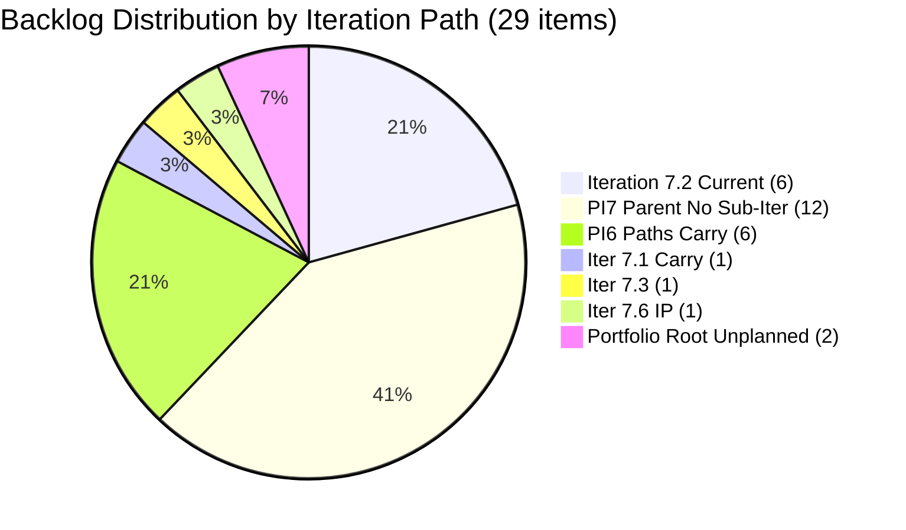
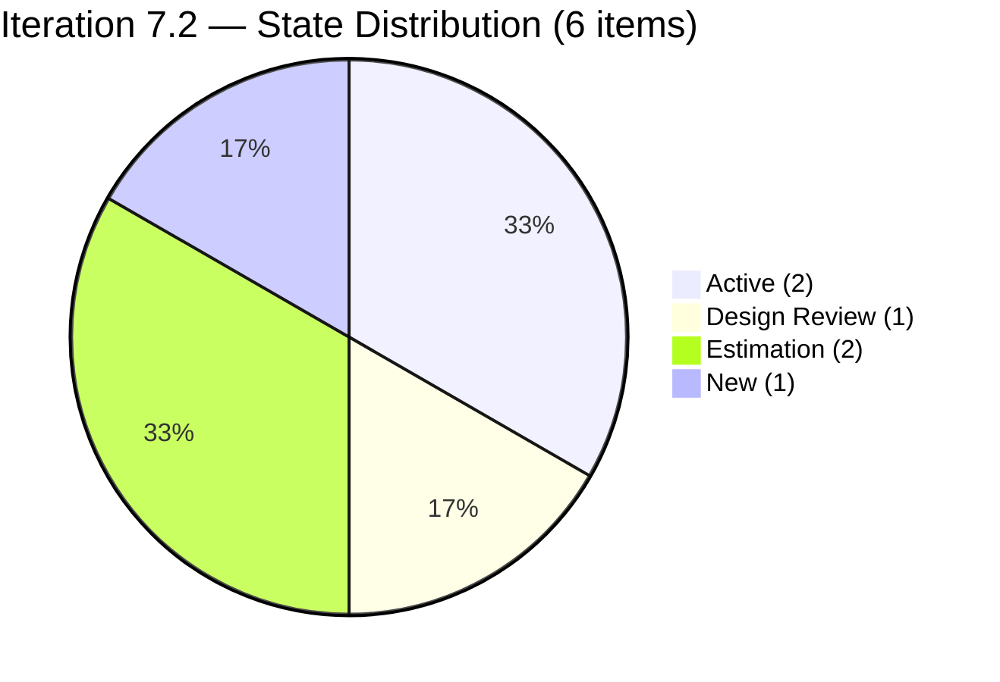
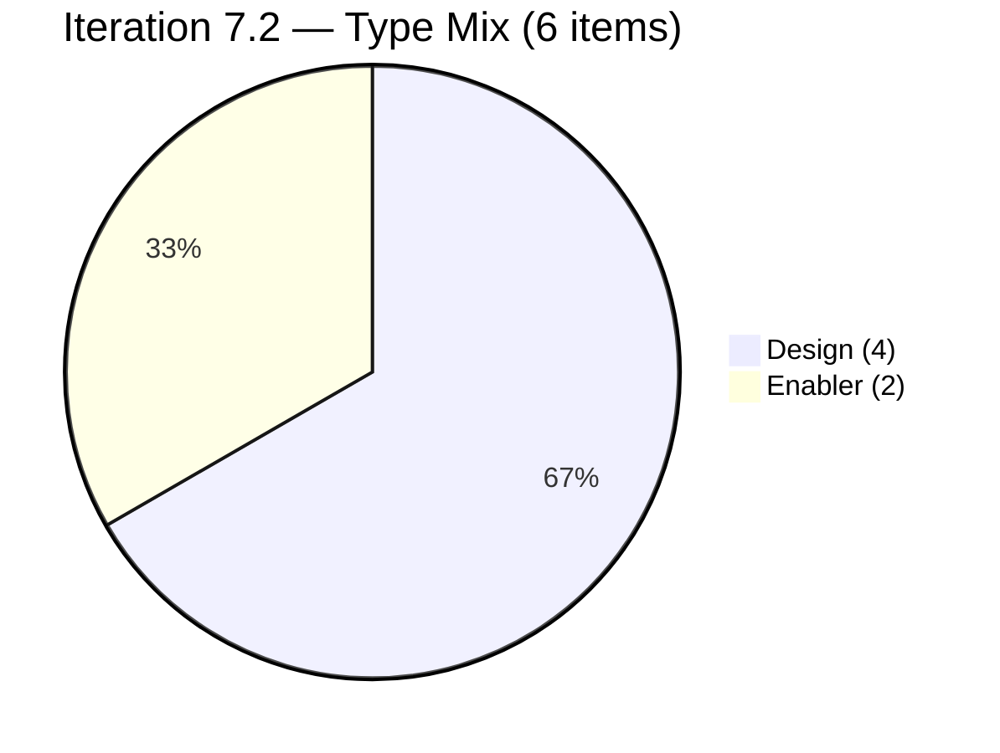
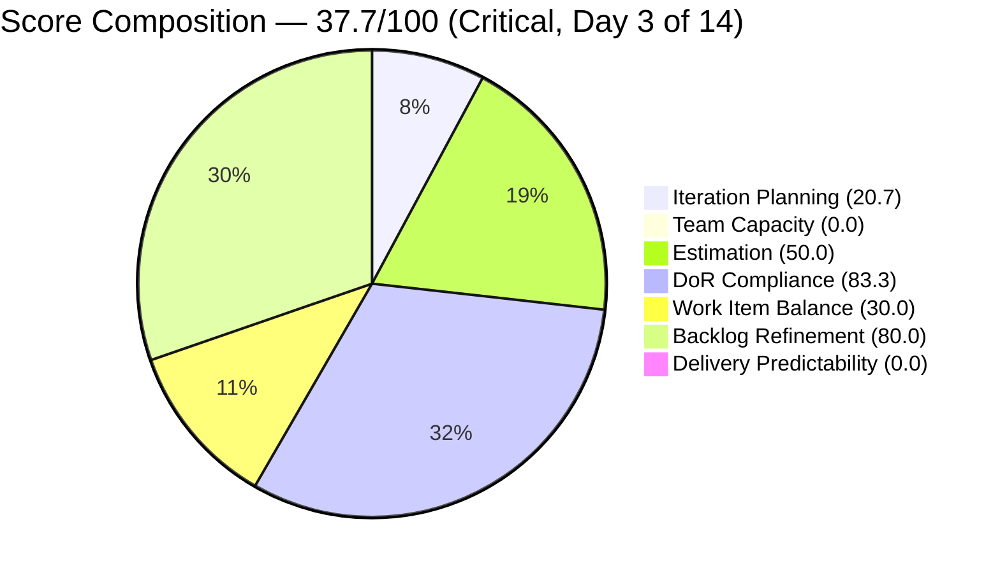
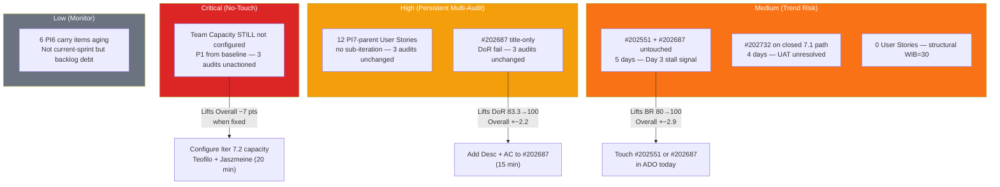

# Shared Services Team — ADO SAFe Iteration Audit

## 1. Audit Metadata

| Field | Value |
|---|---|
| **Project** | Jairosoft Portfolio |
| **Team** | Shared Services Team |
| **Workspace Folder** | `ado_shared/` |
| **Current Iteration** | Iteration 7.2 (`Jairosoft Portfolio\2026-PI7\Iteration 7.2`) |
| **Iteration ID** | `8edbe25f-fa4f-41b2-aaae-f3d5cf0e5b33` |
| **Iteration Start** | April 20, 2026 |
| **Iteration Finish** | May 3, 2026 |
| **Day in Sprint** | Day 3 of 14 — early sprint |
| **Audit Date** | April 22, 2026 09:00 PHT |
| **Auditor** | Claude Code — `ado-safe-audit` skill |
| **ADO Org** | `jairo` (`dev.azure.com/jairo`) |
| **ADO Project ID** | `666bb99a-6acd-4999-bb34-efd0e4ea90dc` |
| **ADO Team ID** | `bd9578fd-5773-48fc-bd80-988dfe5de806` |
| **Scoped Backlog** | `Microsoft.RequirementCategory` (board focus: `Stories`) |
| **Previous Audit** | `AUDIT_20260421_0930.md` — 37.7 Critical at Iteration 7.2 Day 2 |
| **Overall Score** | **37.7 / 100** |
| **Risk Band** | **Critical** (< 40) |

---

## 2. Executive Summary

This is the **third audit** for Shared Services Team — the second within Iteration 7.2 — and the first audit on Day 3 (Apr 22). The overall score is **37.7 / 100 — Critical (unchanged from A2)**. All seven dimension scores are identical to yesterday's A2 audit. No recommendations from the prior two audits have been actioned.

**What changed since A2 (Apr 21):**

- **#202947 now has an assignee.** `Teofilo Limpag` has been assigned to the End-of-PI-7 Feedback Survey spike in Iteration 7.6 (IP). This is a positive housekeeping step but does not affect any dimension score.
- **All 6 current-iteration items are unchanged in state and story points.** No items closed, no new items added to 7.2, no story points added to unsized Design items.
- **The two untouched current-sprint items (#202551, #202687) remain untouched for Day 3.** Both last changed April 17, three days before sprint start and now five days before today. The Backlog Refinement -20 penalty persists unchanged.
- **Team capacity is still not configured.** `mcp__azure-devops__work_get_team_capacity` returned `No team capacity assigned to the team` for the third consecutive audit across three days. Team Capacity remains 0.

This audit marks the **first time zero movement has persisted across two consecutive daily audits**. The three P0 recommendations from A2 (capacity config, DoR for #202687, touch the untouched items) were all completable in under one hour combined and have remained unactioned for 48 hours. At Day 3 of 14, the window to recover Backlog Refinement and prevent Delivery Predictability from bottoming out is narrowing.

---

## 3. Previous Audit Delta

| Dimension | Baseline 7.1 Day 14 (Apr 19) | A2 — 7.2 Day 2 (Apr 21) | A3 — 7.2 Day 3 (Apr 22) | A2→A3 Delta |
|---|---|---|---|---|
| Iteration Planning | 15.6 | 20.7 | **20.7** | 0.0 |
| Team Capacity | 0.0 | 0.0 | **0.0** | 0.0 (unfixed — Day 3) |
| Estimation | 40.0 | 50.0 | **50.0** | 0.0 |
| DoR Compliance | 40.0 | 83.3 | **83.3** | 0.0 |
| Work Item Balance | 30.0 | 30.0 | **30.0** | 0.0 |
| Backlog Refinement | 100.0 | 80.0 | **80.0** | 0.0 |
| Delivery Predictability | 0.0 | 0.0 (early-sprint) | **0.0 (early-sprint)** | 0.0 |
| **Overall** | **32.2** | **37.7** | **37.7** | **0.0** |

### Key changes since A2

- **#202947 (Spike, Iter 7.6 IP) now assigned to Teofilo.** Previously unassigned. Not a scoring dimension but correct housekeeping.
- **#202551 and #202687 remain untouched** — now five days without a touch (Apr 17 → Apr 22). The -20 Backlog Refinement penalty for 33.3% untouched current items has been in place since sprint Day 1 and is deepening in risk.
- **#202732 (Enabler, Ready for UAT, Iter 7.1 path)** — still sitting on the closed iteration's path. No sign of resolution, UAT close, or path migration. This is the fourth audit day it has appeared as a carry risk.
- **12 PI7-parent User Stories (#202059–#202071)** — still in Estimation state on the `Jairosoft Portfolio\2026-PI7` iteration path with no sub-iteration. Unchanged since the baseline audit on Apr 19.
- **No items closed or moved to Done.** Delivery Predictability = 0 remains, expected at Day 3 of 14.

### Three A2 questions — answered

1. **Has Team Capacity been configured?** **NO — third consecutive day with no capacity.** Deterministic 0 persists.
2. **Has #202687 received a Description and Acceptance Criteria?** **NO.** Still title-only. DoR = 83.3 (not 100).
3. **Have #202551 or #202687 been touched since sprint start?** **NO.** Still Apr 17. Backlog Refinement penalty unchanged at -20.

---

## 4. Current Iteration Snapshot

### Iteration

| Field | Value |
|---|---|
| Name | Iteration 7.2 |
| Path | `Jairosoft Portfolio\2026-PI7\Iteration 7.2` |
| Dates | April 20 – May 3, 2026 (14 days) |
| Day | 3 of 14 — early sprint |

### Contributors on iteration work

| Contributor | Email | Items Assigned | Capacity Configured |
|---|---|---|---|
| Teofilo Limpag | `tfllmpg@jairosoft.com` | 2 (#202393, #203115) | **Not configured** |
| Jaszmeine Abigaille Villanueva | `jvillanueva@jairosoft.com` | 4 (#202551, #202553, #202687, #202724) | **Not configured** |

> `mcp__azure-devops__work_get_team_capacity` returned `No team capacity assigned to the team` — same result as A2 (Apr 21) and baseline (Apr 19).

### Current iteration root items

| ID | Type | State | SP | Title | Assignee | Last Changed | DoR |
|---|---|---|---|---|---|---|---|
| 202393 | Enabler | Active | 2 | Branch Protection & Enforcement AutoAllies in Github | Teofilo | Apr 21 | PASS |
| 202551 | Design | Design Review | 3 | Bride Account Management | Jaszmeine | **Apr 17** ⚠ | PASS |
| 202553 | Design | Estimation | — | Vendor Exploration & Search | Jaszmeine | Apr 20 | PASS |
| 202687 | Design | New | — | Onboarding & Subscription Management | Jaszmeine | **Apr 17** ⚠ | **FAIL** |
| 202724 | Design | Estimation | — | Vendor Profile & Details | Jaszmeine | Apr 20 | PASS |
| 203115 | Enabler | Active | 2 | Add New Network and Footage Monitoring Setup for Cebu Office | Teofilo | Apr 21 | PASS |

> ⚠ Items last changed Apr 17 are 5 days old and pre-date sprint start (Apr 20). These are the untouched-current-sprint items triggering the Backlog Refinement -20 penalty.

---

## 5. Work Item Analysis

### Visible root backlog summary

| Cohort | Count | Notes |
|---|---|---|
| **Total visible root items** | **29** | From `Microsoft.RequirementCategory` backlog — unchanged since baseline |
| Current iteration (7.2) | 6 | Audit scope |
| Iteration 7.1 (carry) | 1 | #202732 (Enabler, Ready for UAT, SP=1) — fourth day unresolved |
| Iteration 7.3 | 1 | #202807 (Spike, New, Teofilo) |
| Iteration 7.6 (IP) | 1 | #202947 (Spike, New, **now assigned to Teofilo** — change from A2) |
| PI7 parent (no sub-iter) | 12 | #202059–#202071 Estimation-state User Stories — unchanged since baseline |
| PI6 paths | 6 | #196007, #200807–#200809, #201161, #201170 — aging carry items |
| Jairosoft Portfolio root | 2 | #186848, #201919 — unplanned, no iteration path |

### Backlog composition by iteration path



### Current iteration state distribution



### Current iteration type distribution



**No `User Story` items** — structural pattern for Shared Services. Design share = 4/6 = 67% (> 60% dominant-type threshold). Same composition as A2. Triggers both the no-User-Story (-40) and dominant-type (-30) Work Item Balance penalties.

### Freshness analysis

Today = 2026-04-22. Thresholds: fresh ≥ 2026-03-08; stale-90 < 2026-01-22; stale-180 < 2025-10-25.

| Bucket | Threshold | Count | % of Visible |
|---|---|---|---|
| Fresh | ChangedDate ≥ 2026-03-08 | 29 | 100% |
| Stale ≥ 90 days | Before 2026-01-22 | 0 | 0% |
| Stale ≥ 180 days | Before 2025-10-25 | 0 | 0% |
| **Untouched current-sprint items** | ChangedDate < 2026-04-20 (sprint start) | **2** | 33.3% of current |

All 29 visible items were touched since March 8 — portfolio-level freshness is healthy. The penalty is scoped to the 2 current-sprint items untouched since before sprint start.

### Story points — current iteration

| ID | Title | Type | SP | State |
|---|---|---|---|---|
| 202393 | Branch Protection & Enforcement AutoAllies | Enabler | **2** | Active |
| 202551 | Bride Account Management | Design | **3** | Design Review |
| 202553 | Vendor Exploration & Search | Design | — | Estimation |
| 202687 | Onboarding & Subscription Management | Design | — | New |
| 202724 | Vendor Profile & Details | Design | — | Estimation |
| 203115 | Add New Network/Footage Monitoring Cebu | Enabler | **2** | Active |
| **Committed SP** | | | **7** | |
| **Closed SP** | | | **0** | |

3 Design items (#202553, #202687, #202724) have no story points. Estimation-state Design items commonly lack sizing until Design Review — this is operationally normal but rubric-penalized.

### PI6 carry items — aging risk

| ID | Type | State | Iteration Path | Last Changed |
|---|---|---|---|---|
| 196007 | Enabler | Blocked | PI6\Iter 6.1 | Apr 15 |
| 200807 | User Story | Estimation | PI6\Iter 6.5 | Apr 16 |
| 200808 | User Story | Estimation | PI6\Iter 6.5 | Apr 16 |
| 200809 | User Story | Estimation | PI6\Iter 6.5 | Apr 16 |
| 201161 | Defect | On Hold | PI6 | Apr 16 |
| 201170 | User Story | Ready for QA | PI6\Iter 6.6 (IP) | Apr 16 |

6 PI6 items remain on past iteration paths. #196007 is blocked and has been sitting on the PI6\Iter 6.1 path since before baseline. These are not counted in current-iteration scoring but represent unresolved backlog debt.

---

## 6. SAFe Compliance Scorecard

| Dimension | Score | Evidence | Notes |
|---|---|---|---|
| **Iteration Planning** | **20.7** | 6 current-iter items / 29 visible root items × 100 = 20.7 | Unchanged from A2. 12 PI7-parent Estimation stories remain orphaned from sub-iterations. |
| **Team Capacity** | **0.0** | 0 of 2 contributors have configured capacity for Iter 7.2 | **Third consecutive audit at 0.0. Still not fixed.** |
| **Estimation** | **50.0** | 3 of 6 point-eligible current items have SP > 0 | 3 Design items unsized in Estimation-state. Operationally normal; rubric-penalized. |
| **DoR Compliance** | **83.3** | 5 of 6 current items pass Desc ≥ 30 chars AND AC ≥ 20 chars | Only #202687 fails — title-only, no Desc, no AC. 15-minute fix. |
| **Work Item Balance** | **30.0** | 100 − 40 (no User Story) − 30 (Design dominant at 67%) | Structural. Score unchanged since baseline (Apr 19). |
| **Backlog Refinement** | **80.0** | Base 100.0 (29/29 fresh); − 20 (untouched_current 2/6 = 33.3% > 30%) | #202551 and #202687 untouched for 5 days. Penalty unchanged from A2. |
| **Delivery Predictability** | **0.0** | 0 closed SP / 7 committed SP; **early-sprint — Day 3 of 14** | Expected at Day 3. Closest-to-close: #202551 in Design Review (3 SP). |
| **Overall Score** | **37.7 / 100** | (20.7 + 0.0 + 50.0 + 83.3 + 30.0 + 80.0 + 0.0) / 7 = 37.7 | **Critical Risk** (< 40). Flat vs. A2. |

### Score computation detail

```
1. Iteration Planning
   visible_root_backlog_items           = 29
   current_iteration_root_items (7.2)   = 6
   Score = round(6 / 29 × 100, 1)       = 20.7

2. Team Capacity
   contributors_with_current_work       = 2 (Teofilo, Jaszmeine)
   contributors_with_capacity           = 0 (API: No team capacity assigned to the team)
   Score = round(0 / 2 × 100, 1)        = 0.0

3. Estimation
   point_eligible_current_items         = 6 (2 Enabler + 4 Design — both types expose SP)
   estimated_current_items (SP > 0)     = 3 (#202393=2, #202551=3, #203115=2)
   Score = round(3 / 6 × 100, 1)        = 50.0

4. DoR Compliance
   current_iteration_root_items         = 6
   dor_compliant_current_items          = 5 (#202393, #202551, #202553, #202724, #203115)
   #202687: no Description, no AC       → FAIL
   Score = round(5 / 6 × 100, 1)        = 83.3

5. Work Item Balance
   User Story present                   = False    → -40
   dominant_type (Design at 67% > 60%) → -30
   spike_share = 0%                     → 0
   Score = max(0, 100 − 40 − 30)        = 30.0

6. Backlog Refinement
   fresh_visible_root_items             = 29 (all 29 changed ≥ 2026-03-08)
   base = round(29 / 29 × 100, 1)       = 100.0
   stale_90 (< 2026-01-22)             = 0  → no penalty
   stale_180 (< 2025-10-25)            = 0  → no penalty
   untouched_current (< 2026-04-20)    = 2 (#202551, #202687)
   untouched ratio = 2/6 = 33.3% > 30% → -20
   Score = max(0, 100.0 − 20)           = 80.0

7. Delivery Predictability
   committed_story_points               = 7 (#202393=2, #202551=3, #203115=2)
   closed_story_points (State=Closed/Done) = 0
   Score = round(0 / 7 × 100, 1)        = 0.0
   Annotation: early-sprint (Day 3 of 14) — low delivery expected

Overall = round((20.7 + 0.0 + 50.0 + 83.3 + 30.0 + 80.0 + 0.0) / 7, 1)
        = round(264.0 / 7, 1)
        = round(37.714, 1)
        = 37.7  →  CRITICAL (< 40)
```

### Score trend — all audits

```mermaid
xychart-beta
```

> Note: Trend line not rendered — `xychart-beta` is excluded per output policy. See tabular delta in §3.

```mermaid
bar
```

> Using the table below as the score trend visualization instead.



### Audit score trend

| Audit | Date | Day | Score | Band |
|---|---|---|---|---|
| Baseline | Apr 19 | 7.1 Day 14 | 32.2 | Critical |
| A2 | Apr 21 | 7.2 Day 2 | 37.7 | Critical |
| **A3 (this audit)** | **Apr 22** | **7.2 Day 3** | **37.7** | **Critical** |

---

## 7. Dimension Findings

### Iteration Planning (20.7) — Orphaned PI7-parent stories remain the dominant drag

Unchanged for the second consecutive audit. 23 of 29 visible items are not on the current iteration — 12 of those are PI7-parent User Stories in Estimation state with no sub-iteration path. These items (Jodex workspace items: Refactor Cargo Workspace, Define Module Boundaries, Install Jodex via Cargo, etc.) belong to the Vicsante-owned Jodex work stream and should be sub-iterated across 7.2/7.3/7.4/7.5.

Moving even 6 of the 12 PI7-parent items to active sub-iterations would lift Iteration Planning from 20.7 to approximately 41.4. Moving all 12 would lift it to approximately 62.1 — approaching Moderate territory for the dimension alone.

### Team Capacity (0.0) — Three audit days, still zero

`mcp__azure-devops__work_get_team_capacity` has returned `No team capacity assigned to the team` on April 19, April 21, and April 22 — across all three audit events for Shared Services. This is the most persistent and most leverage-rich finding in the portfolio for this workspace. The fix is a one-time 20-minute ADO configuration.

Contributing team members: **Teofilo Limpag** (DevOps/IT items) and **Jaszmeine Abigaille Villanueva** (Design items). Even configuring 1 activity-day per contributor would shift this dimension from 0 to 100.

### Estimation (50.0) — Stable, structurally driven

Three Design items (#202553, #202687, #202724) remain unsized. All three are in Estimation-state, which is the pre-Design-Review holding state for Design-type items at Jairosoft. Sizing typically happens at Design Review entry. None of the three has progressed to Design Review. #202553 (Vendor Exploration & Search) and #202724 (Vendor Profile & Details) have been touched since sprint start (Apr 20) — they are not frozen, just unsized. #202687 remains in New state and is the blocking DoR failure as well.

### DoR Compliance (83.3) — Single persistent failure

**#202687 "Onboarding & Subscription Management"** has no Description and no Acceptance Criteria for the third consecutive audit day. It is a title-only item in New state. This is the only DoR failure on the board. Fixing it lifts DoR from 83.3 to 100.0 and Overall from 37.7 to ~39.9 (just below Moderate). Combined with the capacity fix, the two quick-wins together push Overall into Moderate range.

### Work Item Balance (30.0) — Structural, three-audit pattern confirmed

0 User Stories, 4 Design, 2 Enabler. Same WIB = 30.0 across all three audits. The team's cross-cutting service model (UIUX design, DevOps infrastructure) does not organically produce User Stories on the Shared Services board — User Stories live downstream on the consuming team's boards (e.g., Flawless Wedding App, AutoAllies). This is the canonical structural finding for this team.

The wiki synthesis reference [[wiki/synthesis/service-model-scoring]] proposes tier-aware scoring for service teams. As noted in prior audits, **this audit does NOT apply the proposed adjustment** — shared skill rubric is authoritative. The proposal remains open for portfolio-level review by Ramon and Karl.

### Backlog Refinement (80.0) — Penalty deepening by the day

Base freshness is 100.0 (all 29 items touched since March 8). The sole penalty is the 2 untouched current-sprint items. **#202551 (Bride Account Management, Design Review)** and **#202687 (Onboarding & Subscription Management, New)** have not been touched since April 17 — now **five days ago**, including 3 days into the sprint.

At Day 3, not touching these two items is becoming a signal of stall rather than normal sprint ramp. If either item receives a state update, SP entry, comment, or assignee touch by EOD Apr 22, the -20 penalty lifts to 0 and Backlog Refinement returns to 100.0 (lifting Overall by ~2.9 points to ~40.6 — crossing the Moderate threshold).

### Delivery Predictability (0.0) — Early-sprint, expected but window is opening

Day 3 of 14. No items closed yet, expected. The closest-to-done item is:
- **#202393** (Enabler, Active, SP=2, Branch Protection AutoAllies) — actively worked by Teofilo, last touched Apr 21.
- **#203115** (Enabler, Active, SP=2, Cebu Monitoring) — also actively worked by Teofilo, last touched Apr 21.
- **#202551** (Design, Design Review, SP=3) — in Design Review state but untouched since Apr 17.

If #202393 or #203115 closes by Day 7 (Apr 26), DP flips to 28.6. If #202551 also closes, DP reaches 71.4 — a meaningful contribution to Overall.

---

## 8. Risks and Bottlenecks



| # | Risk | Severity | Audit # | Why it matters |
|---|---|---|---|---|
| 1 | **Team Capacity not configured for Iter 7.2** — P0 from A1/A2, unactioned x3 | **Critical** | 3rd consecutive | Deterministic 0; every audit shows 0 until a one-time 20-min fix. |
| 2 | **12 PI7-parent User Stories still orphan** — P1 from A1/A2, unactioned x3 | **High** | 3rd consecutive | Caps Iteration Planning at ~20. Sub-iterating 6 of 12 pushes dimension to ~41. |
| 3 | **#202687 missing Desc + AC** — P0 from A2, unactioned x2 | **High** | 2nd consecutive | Sole DoR failure; 15-min fix lifts DoR to 100. |
| 4 | **#202551 + #202687 untouched since Apr 17 (Day −3 to Day 3)** | **High** | 2nd consecutive | Now a stall signal; -20 BR penalty; touching either item today clears it. |
| 5 | **#202732 (Ready for UAT, 1 SP) on closed 7.1 iteration path** | **Medium** | 4th sighting | If UAT resolves, SP credits to 7.1 not 7.2. Needs triage: close or move. |
| 6 | **Work mix 0 User Story / 67% Design** | **Medium (structural)** | All 3 audits | WIB = 30; structural for service teams. Portfolio-level rubric exception needed. |
| 7 | **6 PI6 carry items aging on past paths** | **Low** | All 3 audits | Backlog debt; not affecting 7.2 scores but will accumulate if not resolved at PI7 close. |

---

## 9. Prioritized Recommendations

### P0 — Today (Apr 22, Day 3) — Combined time: ~50 minutes

> **Warning:** The sprint is now at Day 3 of 14. The three P0 items below were actionable since Apr 21 (A2 P0 list). They remain unactioned across 48 hours. Every further day of delay costs 1 audit day of recovery window.

1. **Configure team capacity for Iteration 7.2.** (Owner: Ramon, Carol, or Karl — 20 min.)
   - Open ADO: Jairosoft Portfolio → Shared Services Team → Sprints → Iteration 7.2 → Capacity tab.
   - Add days/activities for Teofilo Limpag and Jaszmeine Abigaille Villanueva.
   - Even 1 configured activity per contributor lifts Team Capacity from **0.0 → 100.0** (+7.1 pts on Overall → 44.8 — exits Critical band).

2. **Add Description + Acceptance Criteria to #202687** "Onboarding & Subscription Management". (Owner: Jaszmeine or Carol — 15 min.)
   - Minimum: 30 non-whitespace chars in Description, 20 in Acceptance Criteria.
   - Lifts DoR from **83.3 → 100.0** (+2.4 pts on Overall → 37.7 + 2.4 = 40.1 when combined with nothing else).

3. **Touch #202551 and #202687 in ADO today.** (Owner: Jaszmeine — 5 min.)
   - Any update: status comment, state transition, SP entry, or owner confirmation.
   - Clears the Backlog Refinement -20 penalty → **80.0 → 100.0** (+2.9 pts on Overall).

**Combined P0 impact if all three are done today:**
Overall = round((20.7 + 100.0 + 50.0 + 100.0 + 30.0 + 100.0 + 0.0) / 7, 1) = round(400.7 / 7, 1) = **57.2 — High (exits Critical)**

### P1 — Before Day 5 (Apr 24)

1. **Size the 3 unsized Design items** (#202553 Vendor Exploration, #202687 Onboarding, #202724 Vendor Profile) with rough T-shirt or SP estimates. Lifts Estimation from **50.0 → 100.0** (+7.1 pts on Overall).
2. **Assign sub-iterations to #202059–#202071** (12 PI7-parent User Stories on Vicsante's Jodex work stream). Distributing across 7.2/7.3/7.4/7.5 raises Iteration Planning from **20.7 toward 62+**.
3. **Resolve #202732** (Ready for UAT, Iter 7.1 path): either (a) confirm UAT passed and close it, or (b) move it to Iter 7.2 if UAT work is happening now, or (c) move to Iter 7.6 (IP) if deferred. Remove from open-board ambiguity.

### P2 — Before Iteration 7.3 (May 4) and for Portfolio Review

1. **Document Shared Services Project Exception** in `ado_shared/CLAUDE.md` → `Project Exceptions` section: state that Design/Enabler work-item dominance with zero User Stories on the Shared Services board is structural and intentional for a cross-cutting service team. This will carry context for future auditors without changing the rubric outcome.
2. **Enforce "no title-only items committed to sprint" rule.** Items like #202687 should not be sprint-committed without minimum Desc + AC. The team had the same pattern at baseline (Grooming items); those were cleaned up, but a title-only Design item was committed again.
3. **Portfolio-level rubric review for service-team WIB penalty.** (Ramon + Karl.) The wiki synthesis proposal [[wiki/synthesis/service-model-scoring]] should be reviewed before PI7 close. If adopted, Shared Services' WIB penalty lifts structurally.
4. **Triage 6 PI6 carry items** by PI7 mid-point. Blocked (#196007), On Hold (#201161), and past-PI items accumulate as backlog debt. A grooming session to close/backlog/migrate them would clean the visible backlog and improve future Iteration Planning ratios.

---

## 10. Evidence Gaps and Limitations

| Gap | Impact | Resolution |
|---|---|---|
| **Team capacity not configured — third consecutive day** | Team Capacity = 0.0 deterministically | P0 Rec #1 — ADO Capacity tab configuration |
| **#202687 title-only for third consecutive audit** | DoR = 83.3 (not 100); item may be a placeholder | P0 Rec #2 — add Desc + AC |
| **Mode of removal for #202928, #202929, #202932** (baseline items) | Cannot confirm closure vs. deletion vs. state migration | Positive outcome either way; revision history not pulled |
| **3 Design items unsized (#202553, #202687, #202724)** | Estimation = 50.0; rubric treats null SP as unestimated regardless of Design-state norms | P1 Rec #1 — size before Design Review |
| **12 PI7-parent User Stories (Vicsante/Jodex) still orphan** | Iteration Planning capped at ~20.7 | P1 Rec #2 — assign sub-iterations |
| **#202732 state ambiguity (Ready for UAT on 7.1 path)** | SP credit mismatch if UAT resolves during 7.2 window | P1 Rec #3 — triage: close or migrate |
| **PI6 carry items (6 items)** | Not scoring-critical today but accumulate backlog debt | P2 Rec #4 — PI7 mid-point grooming |
| **No revision history pulled** | Cannot determine if any item was touched via comment vs. field change | Use `mcp__ado__wit_list_work_item_comments` in next audit if stall deepens |

### Open Questions (not applied; noted for portfolio review)

- **Wiki synthesis [[wiki/synthesis/service-model-scoring]] — tier-aware WIB rubric for service teams.** Still pending portfolio-level review by Ramon and Karl. Would remove the -40 no-User-Story penalty for Shared Services structurally. **Not applied in this audit** — shared skill rubric is authoritative.
- **Should Shared Services author one "team User Story" per sprint?** A low-effort mitigation: e.g., "Monthly AutoAllies infrastructure summary produced" would add 1 User Story to the sprint and eliminate the -40 penalty without altering real work. Raised in A2; still open.
- **Vicsante's Jodex PI7-parent stories — are they really Shared Services work?** 12 of 29 visible items (41%) are User Stories for the Jodex Rust CLI project, all assigned to Vicsante Aseniero. These items are on the `Jairosoft Portfolio\2026-PI7` path with no sub-iteration. Whether they belong on the Shared Services board or on a dedicated Jodex/AI Enabler board is an architectural question for the next PI planning. If migrated off, the visible root count drops from 29 to 17 and Iteration Planning improves mechanically to 6/17 = 35.3 — still low, but directionally better.

---

*Audit complete — A3 for Shared Services Team, Iteration 7.2 Day 3. Next audit: run `/ado-safe-audit ado_shared` or include in `/ado-safe-audit all-projects` batch. Recommended next check: Apr 23 (Day 4) or after P0 items are actioned.*
