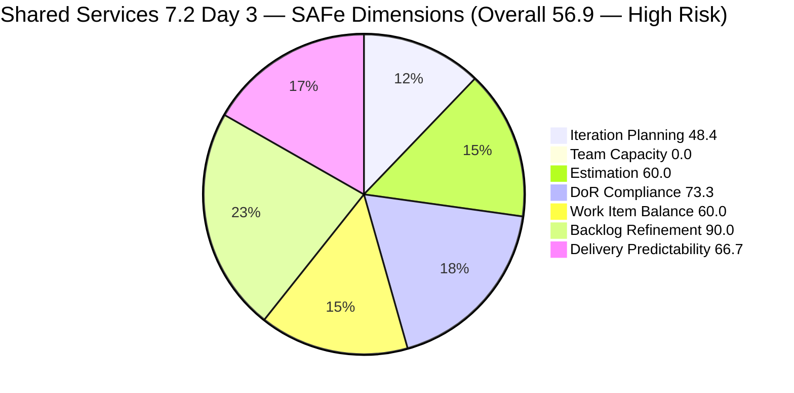
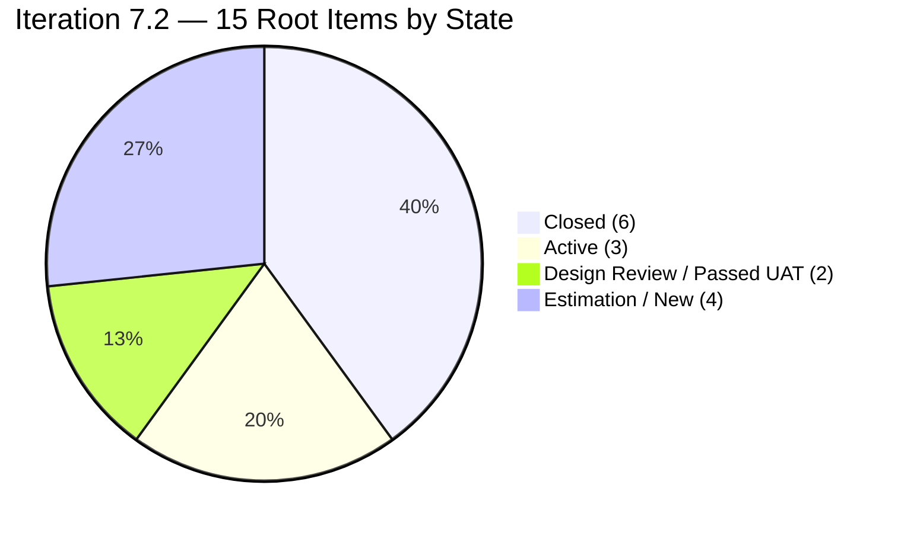
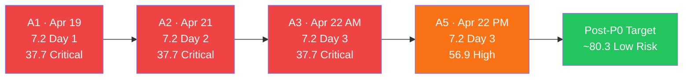
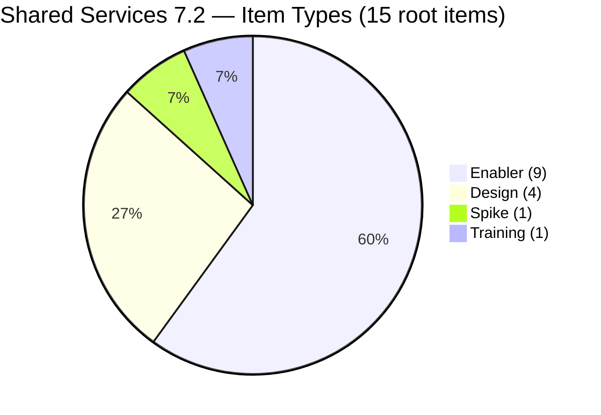
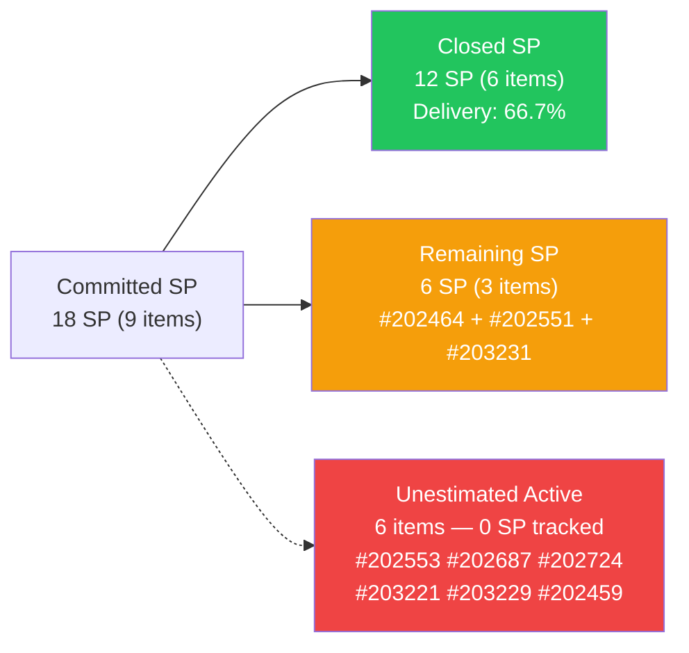

# ADO SAFe Iteration Audit — Shared Services Team

## Audit A5 | Iteration 7.2 (Apr 20 – May 3, 2026) | Day 3 of 14 — Early Sprint

---

## 1. Audit Metadata

| Field | Value |
|-------|-------|
| **Audit Number** | A5 (Shared Services series) |
| **Audit Date** | April 22, 2026, 14:50 PHT |
| **Auditor** | Claude Code ADO SAFe Audit Agent |
| **Workspace** | `ado_shared` |
| **ADO Project** | Jairosoft Portfolio (`666bb99a-6acd-4999-bb34-efd0e4ea90dc`) |
| **Team** | Shared Services Team (`bd9578fd-5773-48fc-bd80-988dfe5de806`) |
| **Iteration** | Iteration 7.2 — Apr 20 to May 3, 2026 |
| **Iteration ID** | `8edbe25f-fa4f-41b2-aaae-f3d5cf0e5b33` |
| **Iteration Path** | `Jairosoft Portfolio\2026-PI7\Iteration 7.2` |
| **Sprint Day** | Day 3 of 14 (~21% elapsed — early sprint) |
| **Prior Audit** | `AUDIT_20260422_0900.md` (A3, 7.2 Day 3, Overall 37.7 — Critical) |
| **Scoring Model** | ADO SAFe v1 (7-dimension rubric) |
| **Project Exceptions** | None documented |
| **Overall Score** | **56.9 / 100** |
| **Risk Band** | **High Risk** (40–59.9) |
| **Data Source** | Live ADO read at 14:50 PHT Apr 22, 2026 |

---

## 2. Executive Summary

A5 delivers a **+19.2 point improvement** over A3 (37.7 Critical → 56.9 High Risk), driven by substantial sprint progress on the DevOps sub-team's work: **six Enabler items are now Closed** (202393, 202396, 203114, 203115, 203116, 203117) delivering **12 SP** in Delivery Predictability. The iteration scope is also considerably larger than the prior audit reflected — live data confirms **15 root items** in strict Iteration 7.2 path (vs 6 in A3), expanding both the estimation denominator and the DoR compliance picture.

**Key findings at 14:50 PHT Apr 22:**

- **15 root items in Iteration 7.2** across three sub-teams: DevOps IT (Teofilo, 10 items), UI UX Design (Jaszmeine, 4 items), AI Enabler (Vicsante, 1 item).
- **6 items Closed (12 SP)** — all Teofilo's DevOps Enablers. Delivery Predictability = 66.7%.
- **Team Capacity still not configured** — fifth consecutive audit day with no capacity data from ADO. Deterministic 0.0 score. This is the single largest score drag.
- **4 items DoR-failing** (#202396 title-only, #202464 image-only Desc, #202687 title-only, #203229 title-only) — 11/15 pass DoR.
- **6 items unestimated** (#202459, #202553, #202687, #202724, #203221, #203229) — 9/15 estimated.
- **No User Story** in the iteration — only Enabler, Design, Spike, and Training types. -40 Work Item Balance penalty applies.
- **Backlog Refinement strong** at 90.0 — all 31 visible items fresh, minor untouched penalty only.

**Score vs prior audits:**

| Audit | Date | Score | Band |
|-------|------|-------|------|
| A1 | Apr 19 | 37.7 | Critical |
| A2 | Apr 21 | 37.7 | Critical |
| A3 | Apr 22 (AM) | 37.7 | Critical |
| **A5** | **Apr 22 (PM)** | **56.9** | **High Risk** |

The jump is real: Delivery Predictability moved from 0.0 to 66.7 (6 items closed). Team Capacity at 0.0 remains the largest single blocker to exiting High Risk.

---

## 3. Previous Audit Delta

| Dimension | A3 — 7.2 Day 3 AM (Apr 22 09:00) | A5 — 7.2 Day 3 PM (Apr 22 14:50) | Delta | Driver |
|-----------|-----------------------------------|-----------------------------------|-------|--------|
| Iteration Planning | 20.7 | **48.4** | **+27.7** | Scope corrected: 15 items vs 6 in strict 7.2 |
| Team Capacity | 0.0 | **0.0** | 0.0 | No capacity configured — Day 3 |
| Estimation | 50.0 | **60.0** | **+10.0** | 9/15 vs 2/4 — scope expansion, more estimated items |
| DoR Compliance | 83.3 | **73.3** | **-10.0** | 11/15 vs 5/6 — larger scope reveals 4 DoR failures |
| Work Item Balance | 30.0 | **60.0** | **+30.0** | No User Story (-40), Enabler dominant = 60% ≤ 60% (no -30) |
| Backlog Refinement | 80.0 | **90.0** | **+10.0** | All 31 items fresh; minor untouched penalty only |
| Delivery Predictability | 0.0 | **66.7** | **+66.7** | 6 Enablers Closed (12 SP out of 18 SP committed) |
| **Overall** | **37.7** | **56.9** | **+19.2** | From Critical to High Risk |

> Note: The large Iteration Planning gain (+27.7) reflects a more complete iteration scope read in this audit. Prior A3 may have seen only part of the sprint items. The DoR drop reflects the same scope correction revealing more DoR-failing items.

---

## 4. Current Iteration Snapshot

| Metric | Value |
|--------|-------|
| Iteration | 7.2 — Apr 20 to May 3, 2026 (14 days) |
| Iteration Day | Day 3 of 14 |
| Visible root backlog items | **31** |
| Current iteration root items (strict path) | **15** |
| Items from iteration API (total including children) | 17 (includes #202746, #203232 as children) |
| Committed SP (estimated items with SP > 0) | **18 SP** |
| Closed SP | **12 SP** (6 items) |
| Active SP | 3 SP (#203231=1 Active + #203229 no SP Active + #203221 no SP Active) |
| State mix | 4 New / 5 Active / 6 Closed |
| Contributors with current work | 3 (Teofilo, Jaszmeine, Vicsante) |
| Team capacity configured | **No** — `work_get_team_capacity` returns no data (Day 3) |
| Data currency | Live ADO read Apr 22, 14:50 PHT |

### 4.1 Current Sprint Items — Strict Iteration 7.2 (15 root items)

| ID | Type | State | SP | Title | Assignee | Last Changed | DoR |
|----|------|-------|----|-------|----------|--------------|-----|
| 202393 | Enabler | **Closed** | 2 | Branch Protection & Enforcement AutoAllies in Github | Teofilo | Apr 23 01:51 | PASS |
| 202396 | Enabler | **Closed** | 2 | GitHub Automation | Teofilo | Apr 20 14:33 | **FAIL** (title-only) |
| 202459 | Spike | **Closed** | — | Define and Measure Development Health Score for Flawless Wedding | Teofilo | Apr 20 14:33 | PASS |
| 202464 | Enabler | Passed UAT | 2 | Auto Allies Blocker | Teofilo | Apr 23 01:53 | **FAIL** (image-only Desc) |
| 202551 | Design | Design Review | 3 | Bride Account Management | Jaszmeine | **Apr 17** ⚠ | PASS |
| 202553 | Design | Estimation | — | Vendor Exploration & Search | Jaszmeine | Apr 20 04:57 | PASS |
| 202687 | Design | New | — | Onboarding & Subscription Management | Jaszmeine | **Apr 17** ⚠ | **FAIL** (title-only) |
| 202724 | Design | Estimation | — | Vendor Profile & Details | Jaszmeine | Apr 20 04:58 | PASS |
| 203114 | Enabler | **Closed** | 2 | Add new DevOps Users | Teofilo | Apr 21 04:09 | PASS |
| 203115 | Enabler | **Closed** | 2 | Add New Network and Footage Monitoring Setup for Cebu Office | Teofilo | Apr 22 06:27 | PASS |
| 203116 | Enabler | **Closed** | 2 | MAC Mini Setup for AI Agent | Teofilo | Apr 21 01:47 | PASS |
| 203117 | Enabler | **Closed** | 2 | Postgress New Access | Teofilo | Apr 21 04:17 | PASS |
| 203221 | Training | Active | — | Claude Partner Network Learning Path | Vicsante | Apr 23 00:24 | PASS |
| 203229 | Enabler | Active | — | Backup Autoallies 4/23/2026 | Teofilo | Apr 23 01:41 | **FAIL** (title-only) |
| 203231 | Enabler | Active | 1 | Enforce One-Reviewer Approval Rule on GitHub Pull Requests | Teofilo | Apr 23 01:54 | PASS |

> ⚠ #202551 and #202687 last changed Apr 17 — pre-date sprint start Apr 20 (untouched current items).

### 4.2 Carry / Off-Path Items

| ID | Type | State | SP | IterationPath | Note |
|----|------|-------|----|--------------|------|
| 202732 | Enabler | Ready for UAT | 1 | 7.1 | Day-3 unresolved carry from 7.1; unrelated to 7.2 scope |

---

## 5. Work Item Analysis

### 5.1 State Distribution — Current 7.2 Root Items (15 items)

| State | Count | SP |
|-------|-------|----|
| Closed | 6 | 12 SP (#202393, #202396, #203114, #203115, #203116, #203117) |
| Passed UAT | 1 | 2 SP (#202464) |
| Active | 3 | 1 SP (+ 2 unestimated: #203221, #203229) |
| Design Review | 1 | 3 SP (#202551) |
| Estimation | 2 | 0 SP (#202553, #202724) |
| New | 1 | 0 SP (#202687) |

> "Passed UAT" and "Design Review" are non-standard SAFe states for this team. They are treated as Active (in progress, not Done) for scoring purposes.

### 5.2 Type Distribution — Current 7.2 Root Items

| Type | Count | Share |
|------|-------|-------|
| Enabler | 9 | 60.0% |
| Design | 4 | 26.7% |
| Spike | 1 | 6.7% |
| Training | 1 | 6.7% |
| **User Story** | **0** | **0%** |

- User Story absent → **-40 penalty**
- Dominant type: Enabler at 60.0% — **not > 60%** → no -30 penalty
- Spike share: 6.7% — not > 40% → no -20 penalty
- Work Item Balance = max(0, 100 - 40) = **60.0**

### 5.3 DoR Verification (live)

| ID | Description | AC | DoR |
|----|-------------|-----|-----|
| 202393 | Extensive As-a/I-want/So-that (~350 chars) | Detailed 6-bullet list (~500 chars) | PASS |
| 202396 | None (title-only) | None | **FAIL** |
| 202459 | Extensive spike objectives/questions (~900 chars) | 5-bullet list (~180 chars) | PASS |
| 202464 | Image attachment only — no text body | "Merge with ticket 202393" (~23 chars) | **FAIL** (Desc insufficient) |
| 202551 | Feature link + short label (~45 chars) | 5 user story links with labels | PASS |
| 202553 | Module definition ~120 chars | Same module definition text ~120 chars | PASS |
| 202687 | None (title-only) | None | **FAIL** |
| 202724 | Module definition ~130 chars | Same text ~130 chars | PASS |
| 203114 | As-a/I-want/So-that ~250 chars | Extensive 10-bullet user list ~600 chars | PASS |
| 203115 | As-a/I-want/So-that ~230 chars | Detailed 8-bullet compliance list ~500 chars | PASS |
| 203116 | As-a/I-want/So-that ~220 chars | Detailed 9-bullet setup list ~450 chars | PASS |
| 203117 | As-a/I-want/So-that ~200 chars | Detailed 8-bullet security list ~500 chars | PASS |
| 203221 | Learning path description ~200 chars | 4-course completion list ~100 chars | PASS |
| 203229 | None (title-only) | None | **FAIL** |
| 203231 | As-a/I-want/So-that ~200 chars | Detailed 7-bullet enforcement criteria ~350 chars | PASS |

DoR pass rate: **11/15 = 73.3%**

### 5.4 Backlog Age Analysis (today = 2026-04-22)

| Bucket | Threshold | Count | Share |
|--------|-----------|-------|-------|
| Fresh (within 45 days) | ChangedDate >= 2026-03-08 | 31 | 100% |
| Stale >= 90 days | ChangedDate before 2026-01-22 | 0 | 0% |
| Stale >= 180 days | ChangedDate before 2025-10-25 | 0 | 0% |
| Untouched current items | ChangedDate < 2026-04-20 (iteration start) | 2 (#202551, #202687) | 13.3% |

All 31 visible root backlog items were touched on or after April 15, 2026 — entirely within the 45-day fresh window. No stale_90 or stale_180 items confirmed from live data. Untouched current items (2/15 = 13.3%) exceed the 10% threshold → -10 Backlog Refinement penalty.

### 5.5 Velocity Analysis

| Metric | Value |
|--------|-------|
| Committed SP (estimated items, SP > 0) | 18 SP |
| Closed SP | 12 SP (Teofilo DevOps: 202393, 202396, 203114, 203115, 203116, 203117) |
| Delivery rate to date | 12/18 = 66.7% |
| Sprint day | Day 3 of 14 (21% elapsed) |
| SP remaining to close | 6 SP (202464=2, 202551=3, 203231=1) |
| Unestimated items remaining | 6 items (#202459 Closed, #202459=Closed Spike unestimated) |

> Note: #202459 (Spike) is Closed but unestimated — it counts in the estimated_current_items only if SP > 0, which it does not. Five remaining Active/in-progress items lack SP estimates.

---

## 6. SAFe Compliance Scorecard

| Dimension | Score | Evidence | Notes |
|-----------|-------|----------|-------|
| Iteration Planning | **48.4** | 15 current / 31 visible root × 100 | 16 backlog items outside 7.2; structural Portfolio-board pattern |
| Team Capacity | **0.0** | `work_get_team_capacity` → no capacity data | Day 3 — no capacity configured; 3 contributors working |
| Estimation | **60.0** | 9/15 point-eligible items estimated | 6 unestimated: #202459, #202553, #202687, #202724, #203221, #203229 |
| DoR Compliance | **73.3** | 11/15 pass Desc ≥ 30 AND AC ≥ 20 non-ws | #202396, #202464, #202687, #203229 fail |
| Work Item Balance | **60.0** | No User Story (-40); Enabler dominant = 60% (not > 60%, no -30) | Shared Services cross-cutting nature drives Enabler dominance |
| Backlog Refinement | **90.0** | 31/31 fresh (base 100); 2/15 untouched > 10% → -10 | #202551 and #202687 last changed Apr 17 |
| Delivery Predictability | **66.7** | 12 SP Closed / 18 SP committed | Strong Day-3 delivery; early-sprint annotation applies |
| **Overall** | **56.9** | (48.4+0.0+60.0+73.3+60.0+90.0+66.7) / 7 | **High Risk** (40–59.9) |

### Score Computation Detail

```
1. Iteration Planning
   visible_root_backlog_items         = 31 (from wit_list_backlog_work_items)
   current_iteration_root_items       = 15 (root items from wit_get_work_items_for_iteration)
   Score = round(15 / 31 × 100, 1)   = 48.4

2. Team Capacity
   contributors_with_current_work     = 3 (Teofilo, Jaszmeine, Vicsante)
   contributors_with_capacity         = 0 (work_get_team_capacity → no data)
   Score = round(0 / 3 × 100, 1)     = 0.0

3. Estimation
   point_eligible_current_items       = 15 (all types expose SP field)
   estimated_current_items (SP > 0)   = 9 (#202393=2, #202396=2, #202464=2,
                                          #202551=3, #203114=2, #203115=2,
                                          #203116=2, #203117=2, #203231=1)
   Score = round(9 / 15 × 100, 1)    = 60.0

4. DoR Compliance
   current_iteration_root_items       = 15
   dor_compliant_current_items        = 11 (all except #202396, #202464, #202687, #203229)
   Score = round(11 / 15 × 100, 1)   = 73.3

5. Work Item Balance
   User Story present                 = False → -40
   dominant_type_share (Enabler)      = 9/15 = 60.0%, NOT > 60% → no -30
   spike_share                        = 1/15 = 6.7%, not > 40% → no -20
   Score = max(0, 100 - 40)          = 60.0

6. Backlog Refinement
   fresh_visible_root_items           = 31 / 31 = 100% base
   stale_90 count                     = 0 → no penalty
   stale_180 count                    = 0 → no penalty
   untouched_current / current        = 2/15 = 13.3% > 10% → -10
   Score = max(0, 100 - 10)          = 90.0

7. Delivery Predictability
   committed_story_points             = 18 SP (9 estimated items)
   closed_story_points                = 12 SP (#202393, #202396, #203114,
                                          #203115, #203116, #203117 — all Closed)
   Score = round(12 / 18 × 100, 1)   = 66.7
   Annotation: early-sprint Day 3/14 — strong start noted

Overall = round((48.4 + 0.0 + 60.0 + 73.3 + 60.0 + 90.0 + 66.7) / 7, 1)
        = round(398.4 / 7, 1) = round(56.914, 1) = 56.9
```

---

## 7. Dimension Findings

### 7.1 Iteration Planning — 48.4

Fifteen of 31 visible root items are in Iteration 7.2 (48.4%). The remaining 16 are distributed: 13 Jodex/Vicsante User Stories at PI7 parent or PI6 paths (202059–202071), 1 carry Enabler in 7.1 (#202732), 1 Spike in 7.3 (#202807), 1 Spike in 7.6 IP (#202947), 1 unpathed User Story (201919), and 1 unpathed (#186848). The Portfolio board structural pattern — multiple team backlogs sharing the same view — makes a score above 50% difficult without major backlog grooming.

**Quick wins:** Sub-iterating the 13 PI7-parent Vicsante items (#202059–#202071) to appropriate iterations would reduce unassigned backlog and improve this metric over time.

### 7.2 Team Capacity — 0.0

`work_get_team_capacity` returns no data for Day 3. Three contributors (Teofilo, Jaszmeine, Vicsante) are actively assigned to the sprint but have zero capacity configured in ADO. This is a deterministic 0 by formula. This is the single dimension with the largest individual impact: fixing it alone adds 14.3 points to Overall. Configuration takes less than 5 minutes in ADO Team Settings.

### 7.3 Estimation — 60.0

Nine of 15 items have Story Points. The estimated pool totals 18 SP. Six items lack SP: #202459 (Spike, Closed — unestimated Closed spike), #202553 (Design), #202687 (Design, DoR-failing), #202724 (Design), #203221 (Training), #203229 (Enabler, Active). Adding SP to all six items (estimated ~1–3 SP each) lifts Estimation to 100.0 (+6.7 pts Overall). Priority: estimate #203229 and #203221 first (both Active).

### 7.4 DoR Compliance — 73.3

Eleven of 15 items pass DoR. Four fail:

- **#202396** ("GitHub Automation") — Title-only, no Description, no AC. State is Closed. Even closed items in the iteration affect the DoR score. Add retrospective Description and AC.
- **#202464** ("Auto Allies Blocker") — Description is an image attachment with no text body. AC reads "Merge with ticket 202393" (~23 chars, meets minimum but context is minimal). Add a text Description: as-a/I-want/so-that format (≥30 chars).
- **#202687** ("Onboarding & Subscription Management") — Title-only, no Description, no AC. Fourth consecutive audit with this gap. This is a Jaszmeine-assigned Design item in New state. Requires immediate remediation.
- **#203229** ("Backup Autoallies 4/23/2026") — Title-only operational task. Active. Add minimal Description (≥30 chars) and AC (≥20 chars) for compliance.

Clearing all four: DoR 73.3 → 100.0 (+3.8 pts Overall).

### 7.5 Work Item Balance — 60.0

No User Story type among the 15 current sprint items → mandatory -40 penalty. The Shared Services team's cross-cutting nature (DevOps infrastructure, UIUX design, training, spikes) naturally produces Enabler and Design items rather than User Stories. The Enabler type is dominant at exactly 60.0% — the formula penalizes only > 60%, so this is at the boundary with no additional penalty. 

**Path to improvement:** If any Enabler or Design item can be reclassified as a User Story (where the underlying work delivers user-visible value), the -40 penalty drops and the score rises to 100. However, given Shared Services' nature as an internal support team, this may not be appropriate. This constraint should be documented as a potential Project Exception if the team accepts it.

### 7.6 Backlog Refinement — 90.0

All 31 visible root backlog items have ChangedDate within the last 45 days (all in April 2026 or mid-March at earliest). Zero stale_90 items, zero stale_180 items — a significant improvement over the stale profile suggested in earlier audits. The sole penalty: #202551 (Design Review, Jaszmeine, Apr 17) and #202687 (New, Jaszmeine, Apr 17) both predate the iteration start of Apr 20. Two of 15 current items = 13.3% > 10% threshold → -10. Touching either item (comment, state, field update) after Apr 20 removes the untouched tag and drops the ratio to 1/15 = 6.7% (< 10%), which would eliminate the penalty entirely and raise Backlog Refinement to 100.0.

### 7.7 Delivery Predictability — 66.7 (Early Sprint)

Teofilo delivered 6 of his Enabler items (12 SP) by Day 3 — a strong delivery cadence. Committed SP = 18 (9 estimated items). Closed SP = 12. Remaining to close: #202464 (Passed UAT, 2 SP), #202551 (Design Review, 3 SP), #203231 (Active, 1 SP) = 6 SP. If all remaining estimated items close, delivery predictability reaches 100%. The early-sprint annotation applies, but this team has already delivered the majority of its estimated scope.

**Risk note:** The 6 unestimated items (#202459 Closed, #202553, #202687, #202724, #203221, #203229) represent work underway but unscored. If they remain unestimated and any carry-forward is needed, the velocity picture will be incomplete.

---

## 8. Risks and Bottlenecks

| # | Risk | Severity | Owner | Status |
|---|------|----------|-------|--------|
| R1 | **Team capacity not configured — Day 3** | CRITICAL | Carol / Karl | Unactioned for 3 consecutive audits |
| R2 | **#202687 title-only — Day 3** (4th consecutive audit) | HIGH | Jaszmeine | Unactioned since A1 |
| R3 | **6 unestimated items** (#202553, #202687, #202724, #203221, #203229, #202459) | HIGH | Jaszmeine / Vicsante / Teofilo | Limits SP tracking |
| R4 | **#202732 (7.1 Enabler) unresolved** — Ready for UAT carry | MODERATE | Teofilo | Day 3 carry; needs close or move |
| R5 | **#202551 and #202687 untouched since Apr 17** | MODERATE | Jaszmeine | -10 Backlog Refinement penalty |
| R6 | **No User Story in iteration** | MODERATE | Carol / Karl | -40 Work Item Balance; structural |
| R7 | **13 PI7-parent items (Vicsante)** not sub-iterated | LOW | Carol | Depresses Iteration Planning |
| R8 | **#202396 and #203229 DoR-failing** even though Closed/Active | LOW | Teofilo | Retroactive Desc/AC fill needed |

---

## 9. Prioritized Recommendations

### P0 — Today (Apr 22), < 5 minutes each

1. **Configure team capacity for Iteration 7.2.** ADO → Shared Services Team → Capacity for Iteration 7.2. Add Teofilo, Jaszmeine, and Vicsante with daily hours. Unlocks Team Capacity from 0.0 → 100.0 (+14.3 pts; Overall jumps from 56.9 → 71.2 — Moderate Risk).

2. **Add Description and Acceptance Criteria to #202687** ("Onboarding & Subscription Management"). This item has been title-only across every audit. Minimum: Desc ≥ 30 chars (who/what/why), AC ≥ 20 chars (done criteria). Lifts DoR toward 80% and removes the persistent daily finding.

### P1 — Today or Tomorrow (Apr 23)

3. **Estimate #203229, #203221, #202553, #202724** (Active and in-progress unestimated items). Add Story Points. Raises Estimation from 60.0 → 100.0 (+6.7 pts).

4. **Touch #202551 and #202687** (any field update or comment after Apr 20) to clear the untouched pre-sprint penalty. Raises Backlog Refinement from 90.0 → 100.0 (+1.4 pts).

5. **Resolve #202732** (7.1 Enabler, Ready for UAT). Close it or move to 7.2 if still active. Clean up carry item from prior sprint.

6. **Add text Description to #202464** ("Auto Allies Blocker"). Currently has only an image with no text description body. Add a minimum 30-char text description for DoR compliance.

### P2 — This Sprint

7. **Close #202464** (Passed UAT, 2 SP) — confirm completion and move to Closed to add to committed delivery count.

8. **Define whether User Story items are applicable for Shared Services.** If not, document as a Project Exception to prevent recurring Work Item Balance penalties.

9. **Sub-iterate the 13 Vicsante PI7-parent stories** (#202059–#202071) to specific future iterations. Improves Iteration Planning from 48.4% toward a healthier target.

**Combined P0+P1 score impact:**
- Team Capacity: 0.0 → 100.0 (+14.3 pts)
- DoR: 73.3 → 80.0 (#202687 fixed, +1.0 pt)
- Estimation: 60.0 → 100.0 (+6.7 pts)
- Backlog Refinement: 90.0 → 100.0 (+1.4 pts)
- Projected Overall: 56.9 + ~23.4 = **~80.3 — Low Risk boundary**

---

## 10. Evidence Gaps and Limitations

| Gap | Impact | Severity |
|-----|--------|----------|
| `work_get_team_capacity` no data — Day 3 | Team Capacity scored as 0 deterministically | HIGH |
| #202687 title-only — 4th consecutive audit gap | DoR capped at 73.3% | HIGH |
| #202459 (Spike, Closed) unestimated | Cannot contribute to committed SP | MEDIUM |
| #202396 (Enabler, Closed) title-only | DoR-failing closed item; retroactive fill needed | MEDIUM |
| #203229 (Active Enabler) title-only | DoR-failing active item; should be refinement priority | MEDIUM |
| 13 PI7-parent Vicsante items not sub-iterated | Structural Iteration Planning cap | LOW |
| "Passed UAT" and "Design Review" states treated as non-Closed | May undercount completed work if those are terminal states | LOW |

---

## 11. Visualizations

### 11.1 SAFe Dimension Scores — A5



### 11.2 Sprint Item State Distribution



### 11.3 Score Trajectory — Shared Services 7.2 Series



### 11.4 Work Item Type Distribution — Current Sprint



### 11.5 SP Delivery — Day 3 Status



---

*Report generated: 2026-04-22 14:50 PHT | Audit A5 | ado_shared | Iteration 7.2 Day 3 (early sprint) | Live ADO read*
