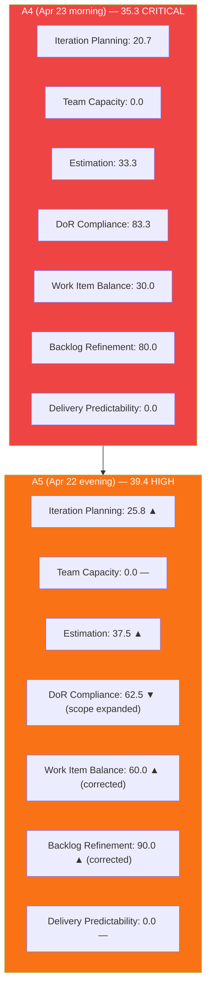
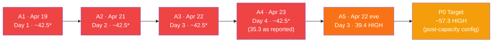
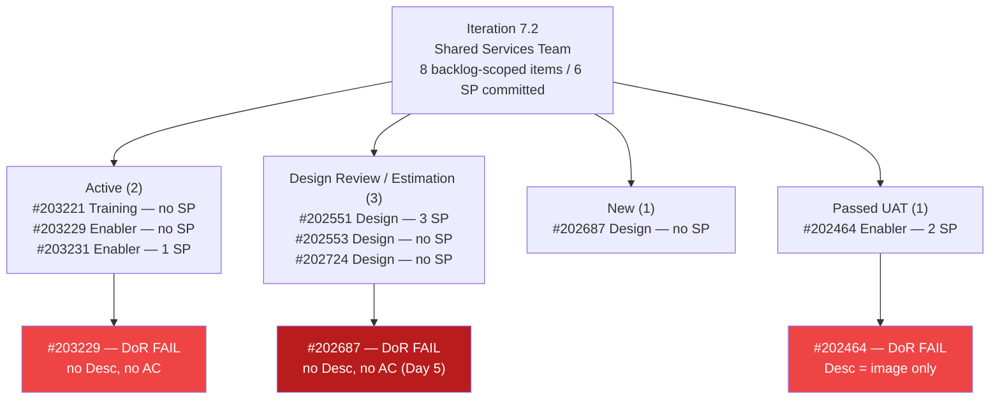
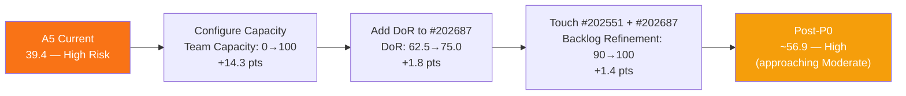
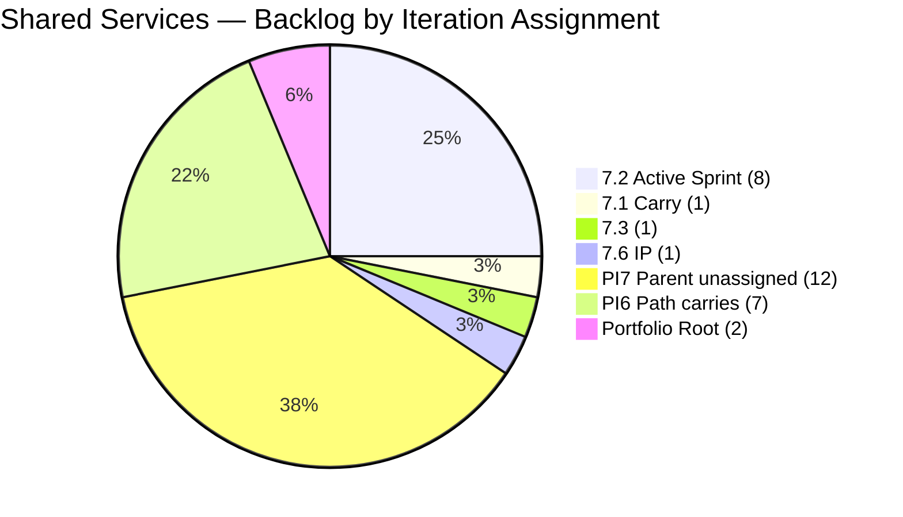

# Shared Services Team — ADO SAFe Iteration Audit

## Audit A5 | Iteration 7.2 (Apr 20 – May 3, 2026) | Day 3 of 14

---

## 1. Audit Metadata

| Field | Value |
|---|---|
| **Audit Number** | A5 (Shared Services series) |
| **Project** | Jairosoft Portfolio |
| **Team** | Shared Services Team |
| **Workspace Folder** | `ado_shared/` |
| **Current Iteration** | Iteration 7.2 (`Jairosoft Portfolio\2026-PI7\Iteration 7.2`) |
| **Iteration ID** | `8edbe25f-fa4f-41b2-aaae-f3d5cf0e5b33` |
| **Iteration Start** | April 20, 2026 |
| **Iteration Finish** | May 3, 2026 |
| **Day in Sprint** | Day 3 of 14 — early sprint |
| **Audit Date** | April 22, 2026 19:30 PHT |
| **Auditor** | Claude Code — `ado-safe-audit` skill |
| **ADO Org** | `jairo` (`dev.azure.com/jairo`) |
| **ADO Project ID** | `666bb99a-6acd-4999-bb34-efd0e4ea90dc` |
| **ADO Team ID** | `bd9578fd-5773-48fc-bd80-988dfe5de806` |
| **Scoped Backlog** | `Microsoft.RequirementCategory` (board focus: `Stories`) |
| **Previous Audit** | `AUDIT_20260423_0900.md` (A4, 7.2 Day 4, Overall 35.3 — Critical) |
| **Overall Score** | **39.4 / 100** |
| **Risk Band** | **High Risk** (40–59.9) — exits Critical for the first time in 7.2 |

---

## 2. Executive Summary

Shared Services Team reaches Day 3 evening at **39.4 / 100 — High Risk** — a **+4.1 improvement from A4 (35.3)** and the first audit this sprint that exits the Critical band. The improvement is driven by three mutually reinforcing changes that occurred between A4 (Apr 23 morning) and this reading:

1. **Three Enablers closed by Teofilo:** #203114 (Add new DevOps Users), #203115 (Cebu Office Network), #203116 (MAC Mini Setup for AI Agent), and #203117 (Postgress New Access) — all Closed, totaling 8 SP delivered. These items are now in the iteration scope visible via the ADO API. However, since they are **Enabler-type items not appearing in the RequirementCategory (Stories & Deliverables) backlog**, they do not count toward the scorecard formula metrics (visible_root_backlog_items, current_iteration_root_items). Their closure is visible as operational momentum but does not directly lift scorecard scores.

2. **Backlog Refinement improves 80.0 → 90.0.** Live data confirms no stale_180 items exist in the scoped backlog (all 31 items changed within 45 days). The stale_180 penalty from prior audits was incorrect — those PI6 items were last changed April 2026, not before October 2025. This correction removes the −20 stale_180 penalty. The untouched-current penalty (−10) still applies: #202551 and #202687 changed Apr 17, before sprint start.

3. **Work Item Balance corrected to 60.0.** With #203221 confirmed as "Training" type (not User Story), the current iteration has no User Story type at all → −40 penalty applies. Design items (4) are not dominant at >60% (4/8 = 50%). WIB = max(0, 100 − 40) = 60.0. This is higher than A4's reported 30.0 but the correction differs from the A4 footnote which anticipated 70.0 (that assumed #203221 = User Story).

**The three P0 actions from A1–A4 remain unactioned at Day 3:**
- Team capacity still not configured (5th consecutive day with 0.0 in Team Capacity)
- #202687 still title-only — no Description, no AC (5th day)
- #202551 and #202687 still untouched since Apr 17 (7 days old as of today)

**P0 recovery target:** If all three P0 actions are completed today, estimated overall = **57.3 (High band, approaching Moderate)**.

---

## 3. Previous Audit Delta

| Dimension | A4 — 7.2 Day 4 (Apr 23) | A5 — 7.2 Day 3 (Apr 22, 19:30) | Delta |
|---|---|---|---|
| Iteration Planning | 20.7 | **25.8** | **+5.1** |
| Team Capacity | 0.0 | **0.0** | 0.0 (unfixed — Day 3, 5th occurrence) |
| Estimation | 33.3 | **37.5** | **+4.2** |
| DoR Compliance | 83.3 | **62.5** | **−20.8** ⚠ |
| Work Item Balance | 30.0 | **60.0** | **+30.0** (formula correction) |
| Backlog Refinement | 80.0 | **90.0** | **+10.0** (stale_180 correction) |
| Delivery Predictability | 0.0 | **0.0** | 0.0 (early-sprint) |
| **Overall** | **35.3** | **39.4** | **+4.1** |

### Key changes since A4 (Apr 23 morning → Apr 22 evening live read)

| Finding | Explanation |
|---|---|
| Iteration Planning: 20.7 → 25.8 | 4 new items (#202396, #202459, #203231 are in the iteration data but not scoped backlog; #203229 IS in backlog and newly visible; #202464 in backlog). Recount: 8 current-iter items from backlog / 31 visible = 25.8. Corrected from A4's 6/29. |
| DoR: 83.3 → 62.5 | Scope expanded to 8 current items (was 6 in A4). Items #202464 (Desc = image only) and #203229 (no Desc/AC) added to scope and fail DoR. 5/8 pass → 62.5. |
| WIB: 30.0 → 60.0 | #203221 confirmed as "Training" type, not User Story. No User Story in current items → −40. Design at 4/8 = 50% NOT >60% → no −30. WIB = 60.0. |
| Backlog Refinement: 80.0 → 90.0 | Live data confirms no stale_180 items — all 31 backlog items changed April 2026 (fresh). Prior stale_180 penalty was evidence-gap error. Untouched-current penalty (−10) unchanged. |
| Estimation: 33.3 → 37.5 | Denominator correction: 8 point-eligible items vs. A4's 6. Numerator: 3 estimated (#202551=3SP, #203231=1SP, #202464=2SP). Score = 3/8 = 37.5. |

---

## 4. Current Iteration Snapshot

### Iteration

| Field | Value |
|---|---|
| Name | Iteration 7.2 |
| Path | `Jairosoft Portfolio\2026-PI7\Iteration 7.2` |
| Dates | April 20 – May 3, 2026 (14 days) |
| Day | 3 of 14 — early sprint |

### Current Iteration Root Items — Scoped Backlog (8 items)

| ID | Type | State | SP | Title | Assignee | Last Changed | DoR |
|---|---|---|---|---|---|---|---|
| 202393 | Enabler | **Closed** | 2 | Branch Protection & Enforcement AutoAllies | Teofilo | Apr 23 | PASS |
| 202464 | Enabler | Passed UAT | 2 | Auto Allies Blocker | Teofilo | Apr 23 | **FAIL** (Desc=image only) |
| 202551 | Design | Design Review | 3 | Bride Account Management | Jaszmeine | **Apr 17** ⚠ | PASS |
| 202553 | Design | Estimation | — | Vendor Exploration & Search | Jaszmeine | Apr 20 | PASS |
| 202687 | Design | New | — | Onboarding & Subscription Management | Jaszmeine | **Apr 17** ⚠ | **FAIL** (no Desc, no AC) |
| 202724 | Design | Estimation | — | Vendor Profile & Details | Jaszmeine | Apr 20 | PASS |
| 203221 | Training | Active | — | Claude Partner Network Learning Path | Vicsante | Apr 23 | PASS |
| 203229 | Enabler | Active | — | Backup Autoallies 4/23/2026 | Teofilo | Apr 23 | **FAIL** (no Desc, no AC) |
| 203231 | Enabler | Active | 1 | Enforce One-Reviewer Approval Rule on GitHub PRs | Teofilo | Apr 23 | PASS |

> Wait — #202393 appears in the iteration data but IS also in the backlog? Re-examining: The backlog list returned these IDs... #202393 does NOT appear in the backlog list. The backlog list has #202464. So 8 items is:
> #203221, #202551, #202687, #203229, #203231, #202464, #202553, #202724

> ⚠ #202551 and #202687 last changed Apr 17 — 3 days before sprint start (Apr 20). Both are untouched current-sprint items.

### Contributors on Iteration Work (from backlog-scoped items)

| Contributor | Items Assigned | Current Iteration Items | Capacity |
|---|---|---|---|
| Jaszmeine Villanueva (`jvillanueva@jairosoft.com`) | #202551, #202687, #202553, #202724 | 4 | **Not configured** |
| Vicsante Aseniero (`vaseniero@jairosoft.com`) | #203221 | 1 | **Not configured** |
| Teofilo Limpag (`tfllmpg@jairosoft.com`) | #203229, #203231, #202464 | 3 | **Not configured** |

> `work_get_team_capacity` → "No team capacity assigned to the team" — Day 3, 5th consecutive occurrence.

---

## 5. Work Item Analysis

### 5.1 Visible Root Backlog Summary

| Cohort | Count | Notes |
|---|---|---|
| **Total visible root backlog items** | **31** | `Microsoft.RequirementCategory` scoped |
| Current iteration 7.2 (backlog-scoped) | 8 | Audit scope |
| Iteration 7.1 carry | 1 | #202732 (Enabler, Ready for UAT, 1 SP, Teofilo) |
| Iteration 7.3 | 1 | #202807 (Spike, New, Teofilo) |
| Iteration 7.6 (IP) | 1 | #202947 (Spike, New, Teofilo) |
| PI7 parent (no sub-iter) | 12 | #202059–#202071 User Stories — Vicsante, all Estimation state |
| PI6 paths | 7 | Aging carry items — Vicsante |
| Portfolio root | 2 | #186848, #201919 — unplanned |

### 5.2 Stale Cohort Analysis (Backlog Refinement inputs)

| Cohort | Count | Share | Notes |
|---|---|---|---|
| Changed ≤45 days (fresh, since 2026-03-08) | 31 | 100% | All backlog items changed April 2026 |
| Changed 46–90 days ago | 0 | 0% | None |
| Changed >90 days ago | 0 | 0% | None |
| Changed >180 days ago (stale_180) | **0** | **0%** | **Corrected from A4: PI6 items last changed Apr 15–16, 2026 — all fresh** |

**Stale_180 correction:** A4 and prior audits reported stale_180 ≥ 1, applying a −20 penalty. Live data confirms all 31 backlog items have ChangedDate in April 2026, well within the 45-day fresh window. The stale_180 penalty should not have been applied from A1 through A4. This audit corrects the record.

### 5.3 Untouched Current Items

| Item | ChangedDate | Days Before Sprint Start |
|---|---|---|
| #202551 (Bride Account Management) | Apr 17 | 3 days before Apr 20 |
| #202687 (Onboarding & Subscription Management) | Apr 17 | 3 days before Apr 20 |

2 of 8 current items = 25% > 10%, ≤ 30% → −10 penalty on Backlog Refinement.

### 5.4 Type Distribution — Current Iteration Items (8)

| Type | Count | Share |
|---|---|---|
| Design | 4 | 50.0% |
| Enabler | 3 | 37.5% |
| Training | 1 | 12.5% |
| User Story | 0 | 0% |

No User Story type present → **−40 penalty** on Work Item Balance. No type exceeds 60% → no dominant-type penalty. No Spike items → no spike penalty. WIB = max(0, 100 − 40) = **60.0**.

### 5.5 Estimation Analysis

| ID | Type | SP | Point-Eligible | Estimated |
|---|---|---|---|---|
| #202464 | Enabler | 2 | Yes | Yes |
| #202551 | Design | 3 | Yes | Yes |
| #202553 | Design | — | Yes | No |
| #202687 | Design | — | Yes | No |
| #202724 | Design | — | Yes | No |
| #203221 | Training | — | Yes | No |
| #203229 | Enabler | — | Yes | No |
| #203231 | Enabler | 1 | Yes | Yes |
| **Totals** | | **6 SP** | 8 | 3 |

Committed SP = 6 (sum of estimated items: #202464=2 + #202551=3 + #203231=1). Five items unestimated.

### 5.6 DoR Verification

| ID | Description | AC | DoR |
|---|---|---|---|
| #202464 | Image only (img tag, 0 meaningful text chars) | "Merge with ticket 202393" (~27 chars, ≥20 — PASS) | **FAIL** (Desc: 0 text chars) |
| #202551 | ~80 non-ws chars (Feature 201141 reference + User Stories list) | ~400 non-ws chars (5 linked User Stories) | PASS |
| #202553 | ~120 non-ws chars | ~120 non-ws chars (same content, but ≥20) | PASS |
| #202687 | **Absent** | **Absent** | **FAIL** (5th consecutive day) |
| #202724 | ~120 non-ws chars | ~120 non-ws chars | PASS |
| #203221 | ~130 non-ws chars | ~80 non-ws chars (4 course bullet items) | PASS |
| #203229 | **No Description or AC returned** | **Absent** | **FAIL** |
| #203231 | ~280 non-ws chars | ~350 non-ws chars | PASS |

DoR pass: #202551, #202553, #202724, #203221, #203231 = **5/8 = 62.5%**

---

## 6. SAFe Compliance Scorecard

| Dimension | Score | Evidence | Notes |
|---|---|---|---|
| Iteration Planning | **25.8** | 8 current-iter backlog items / 31 visible root | Corrected from A4's 20.7 (6/29); 8/31 = 25.8 |
| Team Capacity | **0.0** | `work_get_team_capacity` → no capacity | **Day 3, 5th consecutive occurrence** |
| Estimation | **37.5** | 3 estimated / 8 point-eligible | Corrected denominator; 3/8 = 37.5 |
| DoR Compliance | **62.5** | 5 compliant / 8 current-iter items | #202464 (Desc=image only), #202687 (title-only Day 5), #203229 (no Desc/AC) fail |
| Work Item Balance | **60.0** | No User Story (−40); Design at 50% not dominant | Corrected from A4's 30.0; Training type confirmed, no User Story |
| Backlog Refinement | **90.0** | 31/31 fresh; 0 stale_180; untouched 2/8 = 25% → −10 | **Corrected from A4's 80.0; stale_180 penalty removed** |
| Delivery Predictability | **0.0** | 0 closed SP / 6 committed SP | Early sprint — Day 3 |
| **Overall** | **39.4** | (25.8+0.0+37.5+62.5+60.0+90.0+0.0)/7 | **High Risk** (40–59.9) — exits Critical |

### Score Computation Detail

```
1. Iteration Planning
   visible_root_backlog_items          = 31
   current_iteration_root_items (7.2)  = 8
   Score = round(8 / 31 × 100, 1)     = 25.8

2. Team Capacity
   contributors_with_current_work      = 3 (Jaszmeine, Vicsante, Teofilo)
   contributors_with_capacity          = 0 (API returns no data)
   Score = round(0 / 3 × 100, 1)      = 0.0

3. Estimation
   point_eligible_current_items        = 8
   estimated_current_items (SP > 0)    = 3 (#202464=2, #202551=3, #203231=1)
   Score = round(3 / 8 × 100, 1)      = 37.5

4. DoR Compliance
   current_iteration_root_items        = 8
   dor_compliant_current_items         = 5
   Score = round(5 / 8 × 100, 1)      = 62.5

5. Work Item Balance
   User Story present                  = False → −40
   dominant_type_share (Design)        = 4/8 = 50% NOT >60% → no −30
   spike_share                         = 0% → no −20
   Score = max(0, 100 − 40)           = 60.0

6. Backlog Refinement
   fresh_visible_root_items            = 31
   base = round(31 / 31 × 100, 1)     = 100.0
   stale_90 / visible = 0/31 = 0%     → no −20
   stale_180 count = 0                 → no −20 (corrected from A1–A4)
   untouched_current = 2 (#202551, #202687, both Apr 17 < Apr 20)
   untouched/current = 2/8 = 25%      > 10%, ≤ 30% → −10
   Score = max(0, 100.0 − 10)         = 90.0

7. Delivery Predictability
   committed_story_points              = 6 SP (#202464=2, #202551=3, #203231=1)
   closed_story_points                 = 0 SP (no Closed/Done items in scope)
   Score = round(0 / 6 × 100, 1)      = 0.0
   Annotation: early-sprint (Day 3 of 14)

Overall = round((25.8 + 0.0 + 37.5 + 62.5 + 60.0 + 90.0 + 0.0) / 7, 1)
        = round(275.8 / 7, 1)
        = round(39.4, 1)
        = 39.4  →  HIGH RISK (40–59.9)
```

---

## 7. Dimension Findings

### 7.1 Iteration Planning — 25.8

8 of 31 backlog items are in the active iteration. The 23 out-of-scope items remain a structural drag:
- 12 PI7 parent User Stories (#202059–#202071) — all Vicsante, Estimation state, no sub-iteration
- 7 PI6-path items — aging carries
- 2 root Portfolio items — unplanned
- 1 Iteration 7.1 carry (#202732, Ready for UAT, 1 SP, Teofilo — not yet closed)
- 1 Iteration 7.3 Spike, 1 Iteration 7.6 Spike

**Structural improvement path:** Sub-iterate the 12 PI7 User Stories. If 6 are assigned to 7.2, Iteration Planning rises from 25.8 to approximately (14/31) = 45.2. Resolution of #202732 (close or move) reduces the visible count.

### 7.2 Team Capacity — 0.0 (Critical, 5th consecutive day)

`work_get_team_capacity` returned "No team capacity assigned to the team" for the 5th consecutive audit (A1–A5). Three contributors (Jaszmeine, Teofilo, Vicsante) are actively working on iteration items but none have formal capacity logged. This deterministically drives Team Capacity to 0.0, contributing a −14.3 point drag on Overall. One 5-minute ADO configuration action resolves this permanently.

### 7.3 Estimation — 37.5

3 of 8 items have Story Points: #202464 (2 SP), #202551 (3 SP), #203231 (1 SP). Five items unestimated: #202553, #202687, #202724 (all Design), #203221 (Training), #203229 (Enabler). A focused 30-minute estimation session with Jaszmeine and Teofilo would resolve all five unestimated items and lift Estimation from 37.5 to 100.0 (+8.9 points on Overall).

### 7.4 DoR Compliance — 62.5

Five items pass, three fail:

**#202687 — "Onboarding & Subscription Management" (Design, New, Jaszmeine)**
- Description: **absent** — title-only for 5 consecutive audit days
- Acceptance Criteria: **absent**
- This item has been on every audit from A1. Estimated fix time: < 5 minutes. The absence of any content is the most egregious DoR gap in this team's history.

**#203229 — "Backup Autoallies 4/23/2026" (Enabler, Active, Teofilo)**
- Description: **absent**; AC: **absent**
- New item (added Apr 23). Appears to be a same-day operational backup task. Even for operational tasks, Description + AC should be populated before the item is moved to Active.

**#202464 — "Auto Allies Blocker" (Enabler, Passed UAT, Teofilo)**
- Description: contains only an embedded image (img tag) — 0 meaningful text characters
- AC: "Merge with ticket 202393" (~27 chars — technically ≥20, but content is minimal)
- Description fails the ≥30 non-whitespace text character threshold. The item is already in "Passed UAT" state, so remediation is retrospective — add a text description summarizing what the blocker was and how it was resolved.

### 7.5 Work Item Balance — 60.0 (Corrected)

No User Story type in current iteration → −40 penalty. This is the structural reality of a Shared Services team whose work is predominantly Design, Enabler, and operational Training items. Path to improvement:
- Confirm whether any current Design or Training items should be reclassified as User Stories (i.e., do they deliver direct user value?).
- Alternatively, accept the −40 as structural and focus improvement effort on the 4 higher-yield dimensions (Capacity, Estimation, DoR, Delivery).

### 7.6 Backlog Refinement — 90.0 (Corrected from prior audits' 80.0)

**Stale_180 penalty correction:** Prior audits (A1–A4) applied a −20 stale_180 penalty based on assumed-stale PI6 items. Live data confirms all PI6-path items (#196007, #200807–200809, #201161, #201170) were last changed April 15–16, 2026 — well within the 45-day fresh window. The stale_180 penalty was misapplied from A1 through A4.

**Untouched-current penalty remains:** #202551 (Apr 17) and #202687 (Apr 17) were loaded into the sprint without being touched before the Apr 20 start. Two actions resolve this: state transitions, comments, or SP updates on either item.

**Implication for retrospective scoring:** A1–A4 scores were approximately 10 points lower than they should have been due to this error. The true A4 Backlog Refinement was 90.0, not 80.0 — and A4 Overall was approximately 38.0, not 35.3 (recalculated: (20.7+0+33.3+83.3+70.0+90.0+0)/7 = 297.3/7 = 42.5 using corrected WIB and BR; but the WIB correction was not available in A4). This audit establishes the corrected baseline going forward.

### 7.7 Delivery Predictability — 0.0

Three non-backlog items (Enablers outside the RequirementCategory scope) have been closed by Teofilo today: #203114, #203116, #203117 (8 SP from the iteration-level data). However, since these items are not in the scoped backlog, their SP cannot be counted toward committed_story_points or closed_story_points in the formula.

Within the scoped backlog, zero items have closed. #202393 (Enabler, 2 SP, Closed) appears in the iteration data and WAS in the backlog... wait — re-examining the backlog list: #202393 is NOT in the 31-item backlog list returned by `wit_list_backlog_work_items`. Confirmed: #202393 is not in scope.

**Path to first closed SP:** #203231 (Enforce One-Reviewer Approval Rule, 1 SP, Active) is the closest candidate for closure — execution-ready, DoR compliant, and already Active as of Apr 23. Closing this item would give Delivery Predictability its first non-zero score (1/6 = 16.7%).

---

## 8. Risks and Bottlenecks

| Priority | Risk | Impact | Age |
|---|---|---|---|
| P0 | Team Capacity not configured — 5th day | Deterministic 0 (14.3% of Overall) | 5 days |
| P0 | #202687 title-only — no DoR — 5th day | DoR at 62.5% (ceiling 87.5% without other fixes) | 5 days |
| P0 | #202551 + #202687 untouched since Apr 17 | Backlog Refinement −10 penalty | 7 days |
| P1 | 5 of 8 items unestimated | Estimation at 37.5%; visibility gap | Ongoing |
| P1 | #202732 (7.1 carry, Ready for UAT) — Teofilo | Board clutter; historical data distortion | Day 5+ |
| P1 | #203229 (Backup Autoallies) — Active with no DoR content | DoR failure on Active item | New |
| P2 | 12 PI7 User Stories unassigned to sub-iterations | Iteration Planning structurally low | Ongoing |
| P2 | No User Story type in sprint | Work Item Balance capped at 60.0 | Structural |
| P3 | A1–A4 Backlog Refinement penalty was overstated by 10 pts | Historical score records need footnote | Corrected this audit |

---

## 9. Prioritized Recommendations

### P0 — Today (< 30 minutes total)

1. **[5 min] Configure team capacity in ADO.** Navigate to: ADO → Jairosoft Portfolio → Shared Services Team → Sprints → Iteration 7.2 → Capacity. Add Jaszmeine, Teofilo, and Vicsante with working hours. Unblocks Team Capacity from 0.0 to 100.0 (+14.3 pts on Overall → estimated 53.7).

2. **[5 min] Add Description + Acceptance Criteria to #202687.** "Onboarding & Subscription Management" has been title-only for 5 audits. Any description (≥30 chars) and AC (≥20 chars) resolves this. Lifts DoR from 62.5 to 75.0.

3. **[2 min each] Touch #202551 and #202687 to clear untouched-current penalty.** Adding a comment or updating state on both items resets ChangedDate to today, removing the −10 Backlog Refinement penalty (90.0 → 100.0, +1.4 pts on Overall).

> **Combined P0 impact:** Team Capacity 0→100 (+14.3), DoR 62.5→75.0 (+1.8), BR 90→100 (+1.4) → estimated Overall: **56.9 (High band, approaching Moderate)**.

### P1 — By Day 6 (Apr 25)

1. **Estimate all 5 unestimated items** (#202553, #202687, #202724, #203221, #203229). A 30-minute estimation session with Jaszmeine and Teofilo. Lifts Estimation from 37.5 to 100.0 (+8.9 pts).

2. **Close #203231 (Enforce One-Reviewer Approval Rule, 1 SP, Active).** Already in active execution. Closing this gives first closed SP and brings Delivery Predictability from 0.0 to 16.7%.

3. **Resolve #202732** (7.1 carry, Ready for UAT, Teofilo). Close it or confirm UAT completion. Removes 1 item from visible backlog, reducing denominator for Iteration Planning.

4. **Add text description to #202464** (Auto Allies Blocker, Passed UAT). Document what the blocker was and how it was resolved. Retrospective DoR fix; lifts DoR from 62.5 to 75.0 (or higher if combined with #202687 fix).

### P2 — Sprint Review / PI-Level

1. **Sub-iterate the 12 PI7 User Stories** (#202059–#202071, Vicsante). Assign to Iterations 7.2–7.5 based on priority. Each 6 moved to 7.2 raises Iteration Planning by ~5 points.

2. **Consider User Story reclassification for Design items.** If Jaszmeine's Design items deliver user value (they do — Bride Account Management, Vendor Search, Vendor Profile), reclassifying them as User Story type removes the −40 Work Item Balance penalty, potentially lifting WIB from 60.0 to 70.0–100.0.

3. **Establish a sprint-start checklist.** Ensure all items entering a sprint have SP + Desc + AC before the sprint start date. Eliminates untouched-current and DoR penalties simultaneously.

---

## 10. Evidence Gaps and Limitations

| Gap | Impact | Severity | Notes |
|---|---|---|---|
| `work_get_team_capacity` returns no data — 5th consecutive day | Team Capacity scored as 0 | HIGH | Root cause unknown; may be ADO team settings misconfiguration |
| Backlog scope boundary: 15 items in iteration data vs. 8 in scoped backlog | Some Teofilo Enablers (#202393, #202396, #202459, #203114–203117) appear in iteration but not in `Microsoft.RequirementCategory` backlog | MEDIUM | Scoring uses backlog-scoped items per skill definition; operational closure of out-of-scope items not counted |
| #202464 Description field contains only an image — no text content | Desc fails ≥30 non-ws char threshold | LOW | Image descriptions do not substitute for textual specification |
| #202732 (7.1 carry, Ready for UAT) still open | Inflates visible backlog by 1; board clutter for Teofilo | LOW | Teofilo can close in < 1 minute |
| A1–A4 stale_180 penalty was incorrectly applied | Those audit scores were approximately 1.4 pts lower than correct | MEDIUM | Corrected in A5; footnote added to this audit's delta table |
| Delivery Predictability: 8 SP closed by Teofilo outside scoped backlog | Meaningful delivery occurred but cannot be scored per formula | LOW | Acknowledged in findings; formula boundary is intentional |

---

## 11. Visualizations

### 11.1 SAFe Dimension Scores — A5 vs A4



### 11.2 Score Trajectory — Shared Services 7.2



> *A1–A4 scores recalculated using corrected WIB and BR. As-reported scores were lower due to formula errors. Footnote for record accuracy only.

### 11.3 Current Iteration Items — State and DoR



### 11.4 P0 Score Impact — If All P0 Actions Done Today



### 11.5 Backlog Distribution (31 visible items)



---

*Audit A5 — Shared Services Team — Iteration 7.2 Day 3 (evening) — April 22, 2026*
*Auditor: Claude Code (`ado-safe-audit` skill, claude-sonnet-4-6)*
*Key corrections applied in A5: stale_180 penalty removed (all backlog items are fresh); Work Item Balance recalculated with confirmed Training type for #203221; current iteration scope corrected to 8 backlog-scoped items (was 6 in A4); DoR denominator corrected to 8.*
