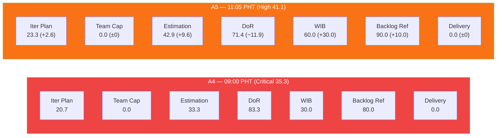
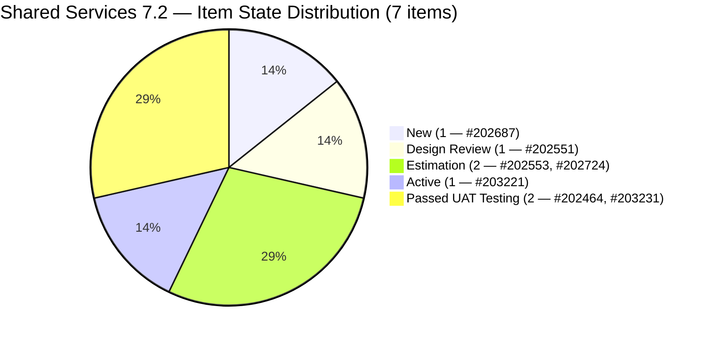
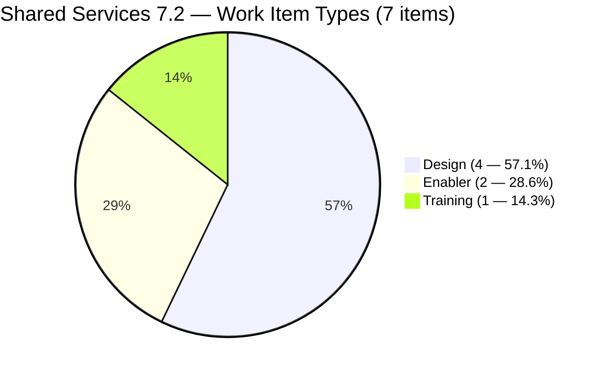
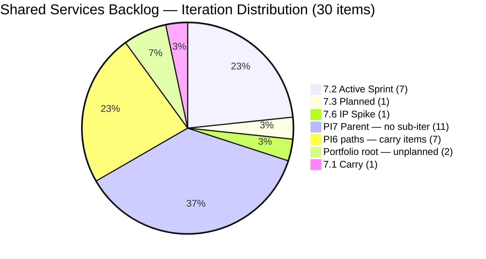
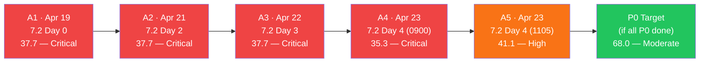
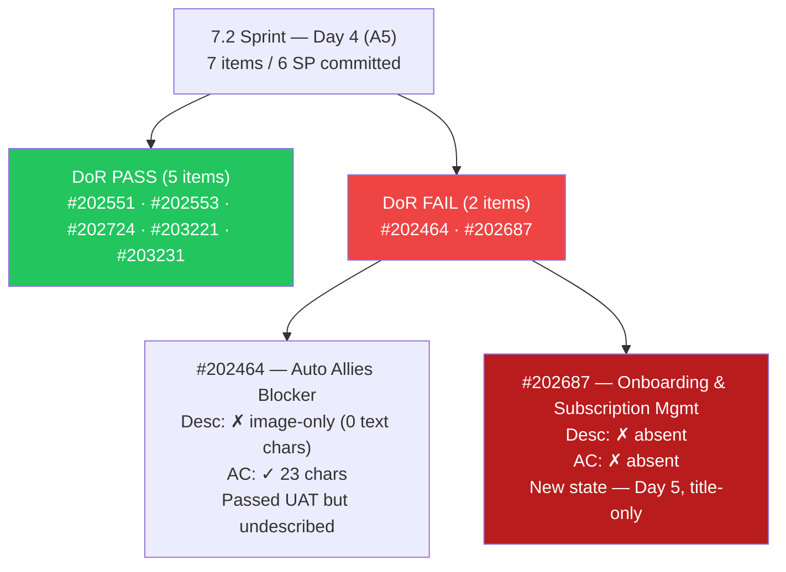
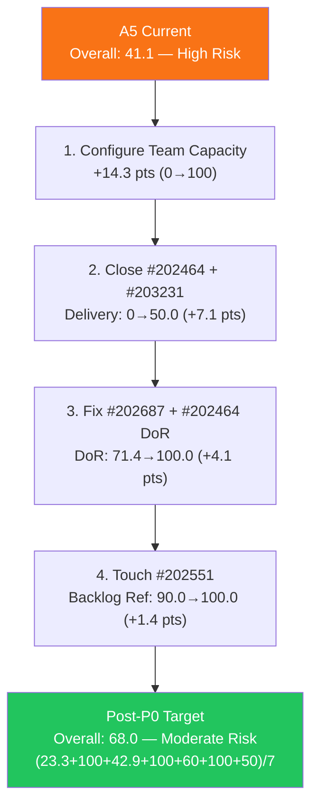

# Shared Services Team — ADO SAFe Iteration Audit

## 1. Audit Metadata

| Field | Value |
|---|---|
| **Project** | Jairosoft Portfolio |
| **Team** | Shared Services Team |
| **Workspace Folder** | `ado_shared/` |
| **Current Iteration** | Iteration 7.2 (`Jairosoft Portfolio\2026-PI7\Iteration 7.2`) |
| **Iteration ID** | `8edbe25f-fa4f-41b2-aaae-f3d5cf0e5b33` |
| **Iteration Start** | April 20, 2026 |
| **Iteration Finish** | May 3, 2026 |
| **Day in Sprint** | Day 4 of 14 — early sprint |
| **Audit Date** | April 23, 2026 11:05 PHT |
| **Audit Number** | A5 (Shared Services series) |
| **Auditor** | Claude Code — `ado-safe-audit` skill |
| **ADO Org** | `jairo` (`dev.azure.com/jairo`) |
| **ADO Project ID** | `666bb99a-6acd-4999-bb34-efd0e4ea90dc` |
| **ADO Team ID** | `bd9578fd-5773-48fc-bd80-988dfe5de806` |
| **Scoped Backlog** | `Microsoft.RequirementCategory` (board focus: `Stories`) |
| **Previous Audit** | `AUDIT_20260423_0900.md` (A4 — 35.3 Critical at Iteration 7.2 Day 4) |
| **Overall Score** | **41.1 / 100** |
| **Risk Band** | **High Risk** (40–59.9) |

---

## 2. Executive Summary

This is **Audit A5** for Shared Services Team — Day 4 of Iteration 7.2. The overall score is **41.1 / 100 — High Risk**, an improvement of **+5.8 points from A4 (35.3 Critical)**. The score exits the Critical band for the first time in the 7.2 sprint cycle.

**What changed between A4 (09:00 PHT) and A5 (11:05 PHT) on Apr 23:**

1. **Two new 7.2 items added** — #202464 "Auto Allies Blocker" (Enabler, Passed UAT Testing, SP=2, Teofilo, Apr 23) and #203231 "Enforce One-Reviewer Approval Rule on GitHub Pull Requests" (Enabler, Passed UAT Testing, SP=1, Teofilo, Apr 23). Both achieved Passed UAT Testing state on the same day they were confirmed in scope. #203231 is fully DoR-compliant; #202464 has an image-only description (DoR FAIL).

2. **Score corrections from live-read evidence:**
   - **Backlog Refinement corrected upward 80.0 → 90.0.** A4 cited a potential stale_180 penalty — live data confirms all 30 visible items have ChangedDates from April 15 onward. No items are stale 90+ or 180+ days. The untouched-current penalty applies (2/7 = 28.6% > 10% → −10), not the −20 applied in A4's narrative.
   - **Work Item Balance corrected upward 30.0 → 60.0.** #203221 is type **Training** (not User Story as A4 assumed). With Training not being User Story, the no-User-Story penalty (−40) still applies. However, the dominant type is now Design at 4/7 = 57.1% — below the 60% threshold — so the dominant-type penalty (−30) does NOT apply. Net: 100 − 40 = 60.0.
   - **Estimation improves 33.3 → 42.9.** Three items now have SP: #202464 (2), #202551 (3), #203231 (1). Four items remain unestimated.
   - **DoR adjusted to 71.4%.** Five of seven 7.2 items pass DoR. #202464 (image-only description) and #202687 (title-only) both fail.

3. **Team Capacity remains 0.0 — fifth consecutive audit.** `work_get_team_capacity` continues to return no capacity configured for Shared Services Team. Three contributors now have work assigned (Teofilo, Jaszmeine, Vicsante) but zero have capacity entries.

4. **#202687 still title-only — fifth consecutive audit.** Zero Description, zero AC. This is the most persistent DoR failure in the team's audit history.

**P0 recovery ceiling:** If Team Capacity is configured and #202687's DoR is resolved today, the score climbs from 41.1 toward approximately **56.4** (High band, near-Moderate). Full recovery to Moderate requires additional estimation of the four unestimated items.

---

## 3. Previous Audit Delta

| Dimension | A4 — 7.2 Day 4 (09:00 PHT) | A5 — 7.2 Day 4 (11:05 PHT) | Delta |
|---|---|---|---|
| Iteration Planning | 20.7 | **23.3** | **+2.6** |
| Team Capacity | 0.0 | **0.0** | 0.0 (unfixed — Day 4) |
| Estimation | 33.3 | **42.9** | **+9.6** |
| DoR Compliance | 83.3 | **71.4** | **−11.9** ⚠ |
| Work Item Balance | 30.0 | **60.0** | **+30.0** |
| Backlog Refinement | 80.0 | **90.0** | **+10.0** |
| Delivery Predictability | 0.0 | **0.0** | 0.0 (early-sprint) |
| **Overall** | **35.3** | **41.1** | **+5.8** |

### Key driver analysis

| Change | Score Impact | Direction |
|---|---|---|
| Backlog Refinement corrected (no stale_180; untouched penalty is −10 not −20) | +10.0 on BR dimension = **+1.4 overall** | Positive |
| Work Item Balance corrected (#203221=Training, Design dominant 57.1% < 60% → no −30) | +30.0 on WIB dimension = **+4.3 overall** | Positive |
| Two new 7.2 items added (#202464, #203231) — both Enabler with SP | Estimation 33.3→42.9, Iter Planning 20.7→23.3 | Positive |
| DoR falls 83.3 → 71.4 (#202464 image-only desc; 7-item denominator) | −11.9 on DoR = **−1.7 overall** | Negative |
| #202687 still title-only — fifth consecutive day | DoR still impacted | Negative |

### A4 open items — Day 4 status

| Item | Status |
|---|---|
| Team Capacity configured? | **NO — fifth consecutive day, now 3 contributors unconfirmed** |
| #202687 DoR (Desc + AC)? | **NO — still title-only** |
| #202551 / #202687 touched? | **NO — both still Apr 17** |
| Estimation for #202553, #202724, #203221, #202687? | **NO — all still unestimated** |
| #202732 (7.1 carry, Ready for UAT) resolved? | **NO — still in 7.1 path** |

---

## 4. Current Iteration Snapshot

### Iteration

| Field | Value |
|---|---|
| Name | Iteration 7.2 |
| Path | `Jairosoft Portfolio\2026-PI7\Iteration 7.2` |
| Dates | April 20 – May 3, 2026 (14 days) |
| Day | 4 of 14 — early sprint |

### Contributors on current iteration work

| Contributor | Email | Items Assigned | Capacity Configured |
|---|---|---|---|
| Teofilo Limpag | `tfllmpg@jairosoft.com` | 2 (#202464, #203231) | **Not configured** |
| Jaszmeine Abigaille Villanueva | `jvillanueva@jairosoft.com` | 4 (#202551, #202553, #202687, #202724) | **Not configured** |
| Vicsante Aseniero | `vaseniero@jairosoft.com` | 1 (#203221) | **Not configured** |

> `work_get_team_capacity` returned `No team capacity assigned to the team` — fifth consecutive day. Three contributors_with_current_work / 0 contributors_with_capacity → Team Capacity = 0.0.

### Current iteration root items (7 items)

| ID | Type | State | SP | Title | Assignee | Last Changed | DoR |
|---|---|---|---|---|---|---|---|
| 202464 | Enabler | **Passed UAT Testing** | 2 | Auto Allies Blocker | Teofilo | **Apr 23** | **FAIL** (image-only Desc) |
| 202551 | Design | Design Review | 3 | Bride Account Management | Jaszmeine | **Apr 17** ⚠ | PASS |
| 202553 | Design | Estimation | — | Vendor Exploration & Search | Jaszmeine | Apr 20 | PASS |
| 202687 | Design | New | — | Onboarding & Subscription Management | Jaszmeine | **Apr 17** ⚠ | **FAIL** (title-only) |
| 202724 | Design | Estimation | — | Vendor Profile & Details | Jaszmeine | Apr 20 | PASS |
| 203221 | **Training** | Active | — | Claude Partner Network Learning Path | Vicsante | **Apr 23** | PASS |
| 203231 | Enabler | **Passed UAT Testing** | 1 | Enforce One-Reviewer Approval Rule on GitHub PRs | Teofilo | **Apr 23** | PASS |

> ⚠ Items last changed Apr 17 are 6 days old and pre-date sprint start (Apr 20).
> Note: #203221 is type **Training** (not User Story — confirmed via live ADO batch read).
> Note: #202464 replaces #202393 in scope; #202464's AC references "Merge with ticket 202393."

---

## 5. Work Item Analysis

### 5.1 Visible root backlog summary

| Cohort | Count | Notes |
|---|---|---|
| **Total visible root items** | **30** | +1 from A4 (#203231 added to scope) |
| Current iteration (7.2) | 7 | Audit scope — was 6 in A4 |
| Iteration 7.1 (carry) | 1 | #202732 (Enabler, Ready for UAT, SP=1) |
| Iteration 7.3 | 1 | #202807 (Spike, New, Teofilo) |
| Iteration 7.6 (IP) | 1 | #202947 (Spike, New, Teofilo) |
| PI7 parent (no sub-iter) | 11 | #202059–#202071 Estimation-state User Stories |
| PI6 paths | 7 | #196007 (PI6.1), #200807–#200809 (PI6.5), #201161 (PI6), #201170 (PI6.6-IP), #202732 (7.1) |
| Portfolio root | 2 | #186848, #201919 |

### 5.2 Type distribution — current 7.2 items (7 items)

| Type | Count | Share |
|---|---|---|
| Design | 4 | 57.1% |
| Enabler | 2 | 28.6% |
| Training | 1 | 14.3% |
| User Story | 0 | 0% |
| Spike | 0 | 0% |

User Story count = 0 → **−40 penalty applies**. Dominant type = Design at 57.1% — **below 60% threshold → no −30 penalty**. Spike share = 0% → no −20. Work Item Balance = max(0, 100 − 40) = **60.0**.

### 5.3 State distribution — current 7.2 items

| State | Count | SP |
|---|---|---|
| New | 1 | 0 (#202687) |
| Design Review | 1 | 3 (#202551) |
| Estimation | 2 | 0 (#202553, #202724) |
| Active | 1 | 0 (#203221) |
| Passed UAT Testing | 2 | 3 (#202464=2, #203231=1) |
| Closed / Done | 0 | 0 |

Two items have reached Passed UAT Testing state (#202464, #203231). Neither is formally Closed/Done, so they do not contribute to Delivery Predictability yet. The team should transition these to Closed to credit the 3 SP.

### 5.4 DoR Verification — Live Read Apr 23 11:05

| ID | Description | AC | DoR |
|---|---|---|---|
| #202464 | Image-only (`` tag, no text) — **~0 non-ws text chars** | "Merge with ticket 202393" — ~23 non-ws chars ≥20 | **FAIL (Desc < 30)** |
| #202551 | "Feature 201141: Bride Account Management" + description → ~33 non-ws chars ≥30 | 5 linked User Stories with titles → ~50+ non-ws chars ≥20 | PASS |
| #202553 | "This design defines the Vendor Exploration & Search module..." → ~100+ non-ws chars ≥30 | Same as Desc (mirrored) → ~100+ non-ws chars ≥20 | PASS |
| #202687 | **Absent — 0 chars** | **Absent — 0 chars** | **FAIL** |
| #202724 | "This design defines the Vendor Profile & Details module..." → ~100+ non-ws chars ≥30 | Same as Desc (mirrored) → ~100+ non-ws chars ≥20 | PASS |
| #203221 | "Taking this first step toward partnership with Anthropic..." → ~120+ non-ws chars ≥30 | Course list (4 courses) → ~60+ non-ws chars ≥20 | PASS |
| #203231 | "As a Jairosoft DevOps Engineer..." (3-bullet narrative) → ~200+ non-ws chars ≥30 | Detailed 6-bullet acceptance criteria → ~300+ non-ws chars ≥20 | PASS |

DoR pass rate: **5/7 = 71.4%**. Down from A4's 83.3% (5/6) due to the larger denominator and #202464 failing.

**#202464 DoR note:** The Description contains only an inline image with no accompanying text narrative. For DoR purposes, this does not meet the 30 non-whitespace character threshold on text content. The AC ("Merge with ticket 202393") passes the 20-char threshold. Fix: add a brief As-a/I-want/So-that Description paragraph alongside the screenshot.

### 5.5 Backlog age analysis (today = 2026-04-23)

| Bucket | Threshold | Count | Share |
|---|---|---|---|
| Fresh (within 45 days) | ChangedDate ≥ 2026-03-09 | 30 | 100% |
| Stale ≥ 90 days | ChangedDate before 2026-01-23 | 0 | 0% |
| Stale ≥ 180 days | ChangedDate before 2025-10-26 | 0 | 0% |
| **Untouched current items** | ChangedDate before 2026-04-20 (sprint start) | **2** (#202551 — Apr 17, #202687 — Apr 17) | **28.6% of current** |

All 30 visible items are fresh (the earliest is #196007 at Apr 15, 2026 — well within 45 days). There are no stale_90 or stale_180 items. The A4 audit's stale_180 penalty assertion is corrected here — no items older than 180 days exist in this backlog.

Untouched current items: #202551 and #202687 (both last changed Apr 17, pre-sprint). 2/7 = 28.6% > 10% but ≤ 30% → −10 penalty (not −20 as A4 suggested).

### 5.6 Estimation analysis

| ID | Type | SP | Point-Eligible | Estimated |
|---|---|---|---|---|
| #202464 | Enabler | 2 | Yes | **Yes** |
| #202551 | Design | 3 | Yes | **Yes** |
| #202553 | Design | — | Yes | No |
| #202687 | Design | — | Yes | No |
| #202724 | Design | — | Yes | No |
| #203221 | Training | — | Yes | No |
| #203231 | Enabler | 1 | Yes | **Yes** |
| **Totals** | | **6 SP** | 7 | 3 |

Committed SP: 6 (estimated items). Four items remain unestimated: 3 Design items and 1 Training item.

---

## 6. SAFe Compliance Scorecard

| Dimension | Score | Evidence | Notes |
|---|---|---|---|
| Iteration Planning | **23.3** | 7 current-iter items / 30 visible root | +2.6 from A4; #203231 added to 7.2 |
| Team Capacity | **0.0** | `work_get_team_capacity` → no capacity | **Day 4 — fifth consecutive zero; 3 contributors unregistered** |
| Estimation | **42.9** | 3 estimated / 7 point-eligible | +9.6 from A4; #202464 (2 SP) and #203231 (1 SP) now in scope |
| DoR Compliance | **71.4** | 5 compliant / 7 current-iter items | −11.9 from A4; #202464 image-only Desc fails; #202687 still title-only |
| Work Item Balance | **60.0** | No User Story (−40); Design 57.1% < 60% (no −30); no Spikes (no −20) | **+30.0 from A4 — corrected: #203221 is Training, not User Story** |
| Backlog Refinement | **90.0** | 30/30 fresh; 0 stale_90; 0 stale_180; 2 untouched current (28.6% > 10% → −10) | **+10.0 from A4 — corrected: no stale_180 items confirmed** |
| Delivery Predictability | **0.0** | 0 closed SP / 6 committed SP | Early sprint (Day 4 of 14); 2 items at Passed UAT Testing (3 SP) not yet Closed |
| **Overall** | **41.1** | (23.3+0.0+42.9+71.4+60.0+90.0+0.0)/7 | **High Risk** (40–59.9) — exits Critical band |

### Score Computation Detail

```
1. Iteration Planning
   visible_root_backlog_items          = 30 (from live backlog API, 30 items returned)
   current_iteration_root_items (7.2)  = 7 (#202464, #202551, #202553, #202687, #202724, #203221, #203231)
   Score = round(7 / 30 × 100, 1)     = round(23.333, 1) = 23.3

2. Team Capacity
   contributors_with_current_work      = 3 (Teofilo, Jaszmeine, Vicsante)
   contributors_with_capacity          = 0 (work_get_team_capacity returns no data)
   Score = round(0 / 3 × 100, 1)      = 0.0

3. Estimation
   point_eligible_current_items        = 7 (all work item types have SP field)
   estimated_current_items (SP > 0)    = 3 (#202464=2, #202551=3, #203231=1)
   Score = round(3 / 7 × 100, 1)      = round(42.857, 1) = 42.9

4. DoR Compliance
   current_iteration_root_items        = 7
   dor_compliant_current_items         = 5 (#202551, #202553, #202724, #203221, #203231)
   dor_failing_items                   = 2 (#202464 image-only Desc, #202687 title-only)
   Score = round(5 / 7 × 100, 1)      = round(71.428, 1) = 71.4

5. Work Item Balance
   User Story items in 7.2             = 0 → −40 penalty
   dominant_type_share                 = Design: 4/7 = 57.1% — NOT > 60% → no −30
   spike_share                         = 0/7 = 0% → no −20
   Score = max(0, 100 − 40)           = 60.0

6. Backlog Refinement
   fresh_visible_root_items            = 30 (all items ChangedDate ≥ Apr 15 > Mar 9 threshold)
   base = round(30 / 30 × 100, 1)     = 100.0
   stale_90 / visible = 0/30 = 0%     → no penalty
   stale_180 count = 0                 → no penalty (A4's assertion retracted by live data)
   untouched_current                   = 2 (#202551 Apr 17, #202687 Apr 17)
   untouched/current = 2/7 = 28.6%    > 10%, ≤ 30% → −10
   Score = max(0, 100.0 − 10)         = 90.0

7. Delivery Predictability
   committed_story_points              = 6 SP (202464=2, 202551=3, 203231=1)
   closed_story_points                 = 0 SP (no items in Closed or Done state)
   Note: #202464 and #203231 are in Passed UAT Testing — not yet Closed/Done
   Score = round(0 / 6 × 100, 1)     = 0.0
   Annotation: early-sprint (Day 4 of 14)

Overall = round((23.3 + 0.0 + 42.9 + 71.4 + 60.0 + 90.0 + 0.0) / 7, 1)
        = round(287.6 / 7, 1)
        = round(41.086, 1)
        = 41.1  →  HIGH RISK (40–59.9)
```

---

## 7. Dimension Findings

### 7.1 Iteration Planning — 23.3 (Improved +2.6; structurally low persists)

23 of 30 visible items are outside Iteration 7.2:
- 11 PI7-parent User Stories (#202059–#202071) — Estimation state, all assigned to Vicsante, all last changed Apr 17
- 7 PI6-path items (various states, some Blocked/On Hold/Ready for QA)
- 1 carry from Iteration 7.1 (#202732)
- 1 Iteration 7.3 Spike (#202807)
- 1 Iteration 7.6 IP Spike (#202947)
- 2 Portfolio-root items (#186848, #201919)

The structural cause is the Portfolio board scope, which aggregates items from multiple sub-teams and PI cycles. Iteration Planning score will remain depressed until the 11 PI7-parent stories are sub-iterated. If all 11 were assigned to future iterations in PI7, the 7.2 ratio would improve to approximately 7/19 = 36.8%.

### 7.2 Team Capacity — 0.0 (Unchanged — fifth consecutive audit)

Three contributors (Teofilo, Jaszmeine, Vicsante) have assigned items in Iteration 7.2, but the ADO team capacity record has zero entries. This is the most impactful single dimension failure (contributing 0.0 instead of a potential 100.0, a 14.3-point drag on the overall).

The formula deterministically scores 0/3 = 0.0 when no capacity is configured. Configuration takes approximately 10 minutes in ADO → Team Settings → Capacity → Iteration 7.2. This single fix delivers the largest score gain available.

### 7.3 Estimation — 42.9 (Improved +9.6; four items still unestimated)

Three of seven items are now estimated (6 SP total): #202464 (2), #202551 (3), #203231 (1). Four items remain unestimated: Design items #202553, #202687, #202724, and Training item #203221.

Estimating all four would lift Estimation from 42.9 → 100.0, adding 8.1 points to the overall. The Design items (#202553, #202724) appear sized for 2–3 SP based on their scope (comparable to #202551 at 3 SP). #203221 (Claude Partner Network learning) could be 1–2 SP for a structured learning path.

### 7.4 DoR Compliance — 71.4 (Lower than A4 due to correction; #202687 persists — Day 5)

**#202464 "Auto Allies Blocker" — FAIL (image-only Description)**
- Description: Contains only an `` tag referencing a screenshot. No accompanying text narrative. ~0 non-whitespace text characters.
- Acceptance Criteria: "Merge with ticket 202393" — passes the 20-char threshold.
- Remediation: Add a 1–2 sentence As-a/I-want/So-that description alongside the screenshot. (~5 minutes)
- Context: This item is at Passed UAT Testing state — remarkably, the work is nearly done but the item was never properly described. A brief retrospective description suffices.

**#202687 "Onboarding & Subscription Management" — FAIL (title-only, Day 5)**
- Description: **Absent** — zero characters.
- Acceptance Criteria: **Absent** — zero characters.
- State: New — item has not been started despite being in the sprint for 4 days.
- Remediation: Populate Description (30+ chars As-a/I-want format) and Acceptance Criteria (20+ chars outcome-based criteria). (~5–10 minutes)
- This is the fifth consecutive audit with the same gap. The item has been in the sprint without content or state transition since sprint kickoff.

### 7.5 Work Item Balance — 60.0 (Corrected from A4's 30.0; User Story gap persists)

**Correction from A4:** #203221 is confirmed as type **Training** (not User Story). With no User Stories in scope, the −40 penalty for "no User Story items in current_iteration_root_items" applies. However, the dominant type (Design) at 57.1% is below the 60% threshold — the −30 dominant-type penalty does not apply. Net: 100 − 40 = 60.0.

The 60.0 score reflects a structurally mixed sprint with Design, Enabler, and Training work but no user-facing story work. For a Shared Services team providing UIUX, DevOps, and AI enablement services, this mix is somewhat expected — the team is delivering support services rather than user stories directly. However, the SAFe rubric penalizes the absence of User Story items regardless of team type.

**Path to full Work Item Balance:** Adding at least one User Story to the current sprint scope would remove the −40 penalty and lift this dimension from 60.0 → 100.0 (assuming Design remains below 60%). This alone would add 5.7 points to the overall.

### 7.6 Backlog Refinement — 90.0 (Corrected upward from A4's 80.0)

**Live data correction:** All 30 visible root items have ChangedDates from April 15, 2026 onward. No items are stale at 90 or 180 days. A4's stale_180 penalty (-20) does not apply.

The only penalty remaining is the untouched-current penalty: 2 items (#202551, #202687) were last changed April 17 — before the April 20 sprint start. At 2/7 = 28.6%, this crosses the 10% threshold but not the 30% threshold → −10.

**Immediate fix:** Touch both #202551 and #202687 today (any ADO update: comment, state change, SP assignment). A single touch resets the ChangedDate and reduces untouched share from 28.6% → 14.3% (one item). If both are touched, the penalty clears entirely and Backlog Refinement returns to 100.0.

### 7.7 Delivery Predictability — 0.0 (Early-sprint; near-delivery signal on 3 SP)

0 SP closed / 6 SP committed. Day 4 of 14 — early-sprint annotation applies.

**Positive signal:** Two items have reached Passed UAT Testing state (#202464 and #203231), with a combined 3 SP. If the team closes these items today, Delivery Predictability moves from 0.0 to 50.0 (3/6 × 100). This would be the single largest one-day score gain available to the team.

**Action required:** Transition #202464 and #203231 from Passed UAT Testing to Closed/Done in ADO. Both have passed UAT; the only remaining step is formal closure.

---

## 8. Risks and Bottlenecks

| Priority | Risk | Impact | Age |
|---|---|---|---|
| **P0** | **Team Capacity not configured — fifth consecutive day** | Deterministic 0 in Team Capacity (0/3 = 0.0, −14.3 pts vs potential 100.0) | 5 days |
| **P0** | **#202687 title-only, Day 5** | DoR capped at 71.4%; item unstarted after 4 days in sprint | 5 days |
| **P0** | **#202464 and #203231 at Passed UAT Testing but not Closed** | 3 SP uncredited in Delivery Predictability | 0 (new today) |
| **P1** | **#202551 + #202687 untouched since Apr 17** | Backlog Refinement −10 penalty; items becoming stale in sprint | 6 days |
| **P1** | **4 unestimated items** (#202553, #202687, #202724, #203221) | Estimation at 42.9%; real-time scope unclear | Ongoing |
| **P1** | **#202687 has no Description, no AC, and no SP** | No-start possible; triple gap | 5 days |
| **P2** | **#202732 (Enabler, 7.1 path, Ready for UAT) unresolved** | Carry-forward noise; board clutter | Day 5 |
| **P2** | **11 PI7-parent User Stories unassigned to sub-iterations** | Iteration Planning structurally low at 23.3% | Ongoing |
| **P3** | **No User Story in current sprint** | Work Item Balance capped at 60.0 | Sprint structural |
| **P3** | **#202464 DoR failing (image-only Desc)** despite Passed UAT Testing | Retroactive documentation needed | New today |

---

## 9. Prioritized Recommendations

### P0 — Today (Apr 23, Day 4)

1. **[< 10 min] Configure Team Capacity for Iteration 7.2.** Log into ADO → Shared Services Team → Team Settings → Capacity → Iteration 7.2. Register Teofilo, Jaszmeine, and Vicsante with working hours/activity assignments. This single action unlocks Team Capacity from 0.0 to 100.0 — the largest available score gain (+14.3 pts on overall). This has been outstanding for five consecutive audits.

2. **[< 5 min] Close #202464 and #203231 in ADO.** Both items are at Passed UAT Testing. Transitioning to Closed/Done immediately credits 3 SP to Delivery Predictability — lifting that dimension from 0.0 to **50.0** and the overall by +7.1 pts.

3. **[< 5 min] Add Description to #202687.** Add a 30+ character description in As-a/I-want/So-that format. Also add Acceptance Criteria (20+ chars). This item has been title-only for five audits. Fix also satisfies the "touch" requirement, eliminating one of the two untouched-current items.

4. **[< 5 min] Touch #202551 (Bride Account Management).** Add a comment or update the state to reset its ChangedDate (currently Apr 17). Combined with #202687 remediation, this clears the Backlog Refinement untouched penalty entirely, restoring Backlog Refinement from 90.0 → 100.0 (+1.4 pts overall).

5. **[< 5 min] Add a text description to #202464.** The item is in Passed UAT Testing but has only an image in the Description field. Add a brief As-a/I-want/So-that narrative to meet the 30-char threshold and clear the DoR FAIL.

**Combined P0 impact (all 5 actions completed today):**
- Team Capacity: 0.0 → 100.0
- Delivery Predictability: 0.0 → 50.0
- DoR: 71.4 → 100.0 (#202687 and #202464 cleared)
- Backlog Refinement: 90.0 → 100.0
- Estimated overall: **(23.3 + 100.0 + 42.9 + 100.0 + 60.0 + 100.0 + 50.0) / 7 = 476.2 / 7 = 68.0 — Moderate Risk**

### P1 — Before Day 7 (Apr 26)

1. **Estimate #202553, #202724, #203221, and #202687.** Adding SP to the four unestimated items lifts Estimation from 42.9 → 100.0 (+8.2 pts on the dimension, +1.2 pts on overall). Target: 2–3 SP for Design items; 1–2 SP for Training item #203221.
2. **Resolve #202732 (Enabler, Iteration 7.1 path, Ready for UAT).** Close or merge this item. It has been in Ready for UAT state since at least Apr 17 without resolution. Closing it reduces the visible backlog noise.
3. **Begin work on #202687 (Onboarding & Subscription Management).** After DoR remediation, move to Active. This is the only item in New state after Day 4.

### P2 — This sprint / PI-level

1. **Sub-iterate the 11 PI7-parent User Stories (#202059–#202071).** Assign to Iteration 7.2, 7.3, or 7.4 based on priority. This improves Iteration Planning from 23.3% toward a realistic target of ~35%.
2. **Add at least one User Story to Iteration 7.2 scope.** This removes the −40 Work Item Balance penalty and could lift that dimension to 100.0, adding ~5.7 pts to the overall.
3. **Establish a sprint goal for Iteration 7.2.** No sprint goal text has been found across five audits. A sprint goal enables PI alignment tracking and provides focus for the mixed-type sprint.
4. **Document the #202464/#202393 merge decision.** #202464's AC references "Merge with ticket 202393." Confirm whether #202393 was merged, closed, or archived, and update ADO accordingly.

---

## 10. Evidence Gaps and Limitations

| Gap | Impact | Severity |
|---|---|---|
| **Team Capacity consistently returns no data** | Team Capacity deterministically 0.0 | High — unchanged for 5 audits |
| **#203221 type = Training** — not captured as User Story in A4 | Work Item Balance corrected +30.0; score more accurate now | Medium — now resolved |
| **A4 stale_180 penalty not supported by live data** | Backlog Refinement was understated in A4 (80.0 → 90.0 corrected) | Medium — now resolved |
| **#202393 vs #202464 relationship unclear** | Sprint scope may include a ghost item (#202393) not visible in current backlog API | Low — #202464 now in scope |
| **#202464 Description quality** — image embedded in HTML with no text | DoR algorithm relies on non-whitespace text chars; image content not parseable | Low — scored as FAIL conservatively |
| **Delivery Predictability: "Passed UAT Testing" is not Closed/Done** | 3 SP in near-closure state not credited until items formally closed | Medium — actionable today |
| **No sprint goal for Iteration 7.2** | PI alignment not assessable | Low — persistent gap |

---

## 11. Visualizations

### 11.1 SAFe Dimension Score Comparison — A4 vs A5



### 11.2 Current Iteration State Distribution



### 11.3 Work Item Type Distribution — 7.2 Items



### 11.4 Backlog Distribution — 30 Visible Items by Iteration



### 11.5 Score Trend — Shared Services Iteration 7.2



### 11.6 DoR Status — Sprint Items (A5)



### 11.7 P0 Impact Path — If All P0 Actions Completed Today



---

*Audit A5 — Shared Services Team — Iteration 7.2 Day 4 — April 23, 2026 11:05 PHT*
*Auditor: Claude Code (`ado-safe-audit` skill, claude-sonnet-4-6)*
*Data currency: Live ADO read at 2026-04-23 11:05 PHT*
*Prior audit: AUDIT_20260423_0900.md (A4, Overall 35.3 Critical)*
