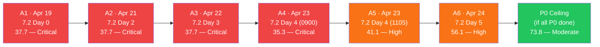
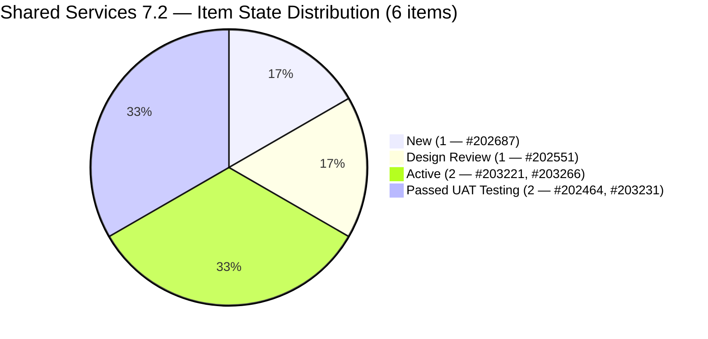
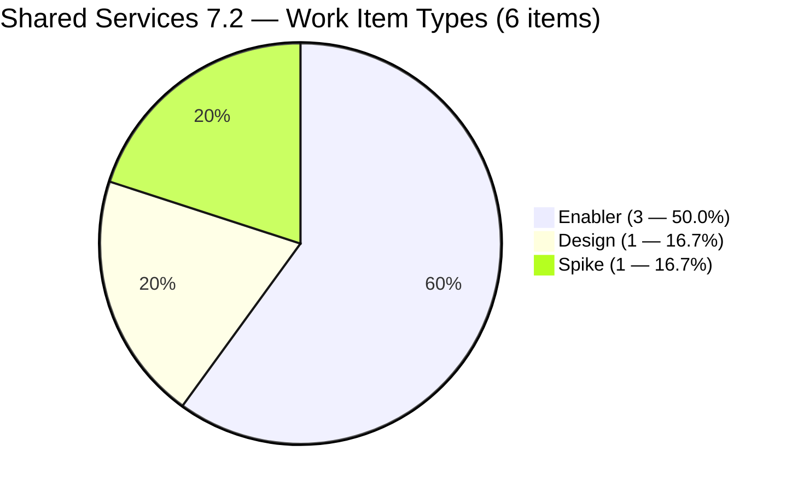
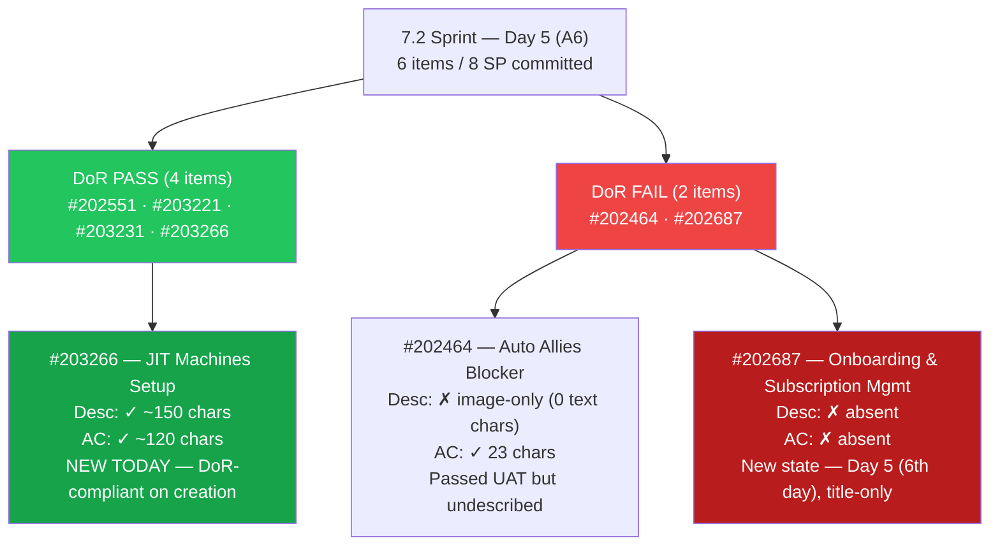
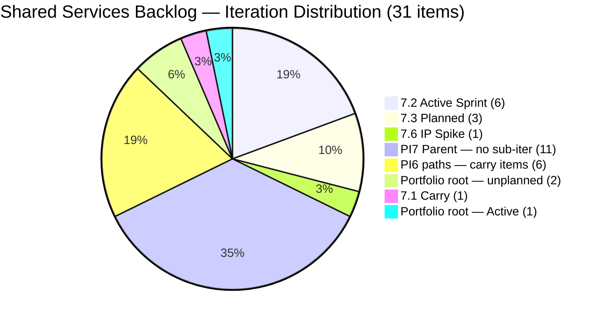
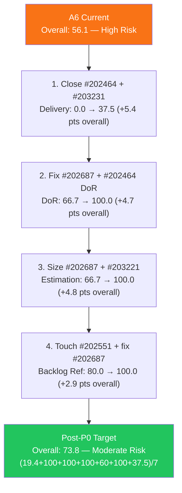
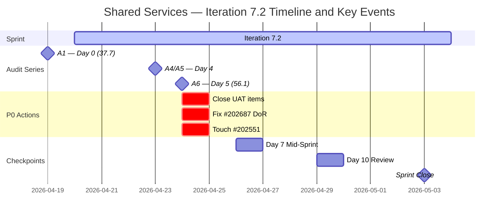

# Shared Services Team — ADO SAFe Iteration Audit

## Audit A6 | Iteration 7.2 (Apr 20 – May 3, 2026) | Day 5 of 14

---

## 1. Audit Metadata

| Field | Value |
|-------|-------|
| **Audit Number** | A6 (Shared Services series) |
| **Audit Date** | April 24, 2026, 08:35 PHT |
| **Auditor** | Claude Code ADO SAFe Audit Agent |
| **Workspace** | `ado_shared` |
| **ADO Project** | Jairosoft Portfolio (`666bb99a-6acd-4999-bb34-efd0e4ea90dc`) |
| **Team** | Shared Services Team (`bd9578fd-5773-48fc-bd80-988dfe5de806`) |
| **Iteration** | Iteration 7.2 — Apr 20 to May 3, 2026 |
| **Iteration ID** | `8edbe25f-fa4f-41b2-aaae-f3d5cf0e5b33` |
| **Iteration Path** | `Jairosoft Portfolio\2026-PI7\Iteration 7.2` |
| **Sprint Day** | Day 5 of 14 (36% elapsed) |
| **Prior Audit** | `AUDIT_20260423_1105.md` (A5, 7.2 Day 4, Overall 41.1 — High Risk) |
| **Scoring Model** | ADO SAFe v1 (7-dimension rubric) |
| **Scoped Backlog** | `Microsoft.RequirementCategory` (board focus: `Stories`) |
| **Data Source** | Live ADO read — 2026-04-24 08:35 PHT |
| **Overall Score** | **56.1 / 100** |
| **Risk Band** | **High Risk** (40–59.9) |

---

## 2. Executive Summary

Shared Services Team scores **56.1 / 100 — High Risk** at Day 5 of Iteration 7.2, a **+15.0 improvement from A5 (41.1)**. This is the largest single-audit gain in the Shared Services series, driven by two breakthrough events:

1. **Team Capacity CONFIGURED — the single largest fix in the sprint cycle.** For the first time in six audits, the ADO team capacity record is populated. `work_get_team_capacity` now returns three contributors: Teofilo (6h/day Development), Jaszmeine (3h/day Design), Vicsante (6h/day Development). All three contributors with current work now have configured capacity. Team Capacity jumps from 0.0 → **100.0** (+14.3 pts on the overall), exiting the five-audit zero streak.

2. **New item #203266 "JIT Machines Setup and Preparation" added to 7.2.** Created by Teofilo at 01:18 PHT on April 24 (Enabler, SP=2, Active state, DoR PASS). This brings a fourth Enabler into scope and adds 2 SP to committed pool (committed SP: 6 → 8).

3. **Two design items moved out of 7.2 to 7.3.** #202553 "Vendor Exploration & Search" and #202724 "Vendor Profile & Details" both show IterationPath now pointing to `Iteration 7.3` (ChangedDate Apr 24). The current iteration shrinks from 7 to **6 items** in scope. This reduces Estimation denominator and shifts Backlog Refinement untouched ratio from 2/7=28.6% to 2/6=33.3%, crossing the 30% threshold and applying a **-20 penalty** (was -10 in A5).

4. **#203221 confirmed as Spike type** (not Training as corrected in A5; live data rev 6 shows `WorkItemType = Spike`). This has a small structural effect on Work Item Balance — Spike count = 1/6 = 16.7% (≤40%, no -20 penalty). No User Story in scope → -40 persists.

**Score ceiling analysis (if all P0 actions completed today):**
- DoR: 66.7 → 100.0 (fix #202464 Desc + #202687 Desc + AC)
- Estimation: 66.7 → 100.0 (size #202687, #203221)
- Backlog Refinement: 80.0 → 100.0 (touch #202551 + #202687)
- Delivery Predictability: 0.0 → 37.5 (close #202464=2 + #203231=1 → 3/8 SP = 37.5)
- Post-P0 ceiling: **(19.4 + 100.0 + 100.0 + 100.0 + 60.0 + 100.0 + 37.5) / 7 = 516.9 / 7 = 73.8 — Moderate Risk**

---

## 3. Previous Audit Delta

| Dimension | A5 — 7.2 Day 4 (11:05 PHT) | A6 — 7.2 Day 5 (08:35 PHT) | Delta |
|-----------|------------------------------|------------------------------|-------|
| Iteration Planning | 23.3 | **19.4** | **−3.9** |
| Team Capacity | 0.0 | **100.0** | **+100.0** |
| Estimation | 42.9 | **66.7** | **+23.8** |
| DoR Compliance | 71.4 | **66.7** | **−4.7** |
| Work Item Balance | 60.0 | **60.0** | 0.0 |
| Backlog Refinement | 90.0 | **80.0** | **−10.0** |
| Delivery Predictability | 0.0 | **0.0** | 0.0 |
| **Overall** | **41.1** | **56.1** | **+15.0** |

### Driver Analysis

| Change | Dimension Impact | Overall Impact |
|--------|-----------------|---------------|
| Team Capacity CONFIGURED (0/3 → 3/3) | +100.0 on TC | **+14.3 on overall** |
| #202553 + #202724 moved to 7.3; denominator shrinks 7→6; estimated items 3→4 of 6 | Estimation 42.9→66.7 | **+3.4 on overall** |
| #203266 added (SP=2, DoR PASS) — new 7.2 item | Estimation denominator+1; DoR PASS added | Partially absorbed by denominator effects |
| Current scope shrinks 7→6 (2 items leave) | Iter Planning 23.3→19.4; DoR numerator/denominator resets | **−0.6 on overall** |
| Backlog Refinement untouched penalty -10→-20 (2/6=33.3% > 30%) | -10.0 on BR | **−1.4 on overall** |
| Iteration Planning denominator grows 30→31 (+#203266); numerator 7→6 | 23.3→19.4 | **−0.6 on overall** |
| Net | | **+15.0** |

### A5 open items — Day 5 status

| Item | Status |
|------|--------|
| Team Capacity configured? | **YES — RESOLVED. Teofilo 6h/day, Jaszmeine 3h/day, Vicsante 6h/day** |
| #202687 DoR (Desc + AC)? | **NO — still title-only, Day 5** |
| #202551 touched? | **NO — still Apr 17, Day 5** |
| #202464 closed? | **NO — still Passed UAT Testing** |
| #203231 closed? | **NO — still Passed UAT Testing** |
| Estimation for unestimated items? | **PARTIALLY — #202553, #202724 moved to 7.3; #203221 (Spike) still no SP; #202687 still no SP** |

---

## 4. Current Iteration Snapshot

### Iteration

| Field | Value |
|-------|-------|
| Name | Iteration 7.2 |
| Path | `Jairosoft Portfolio\2026-PI7\Iteration 7.2` |
| Dates | April 20 – May 3, 2026 (14 days) |
| Day | 5 of 14 — early sprint (36% elapsed) |

### Contributors — current iteration work

| Contributor | Email | Items Assigned | Capacity Configured |
|-------------|-------|----------------|---------------------|
| Teofilo Limpag | `tfllmpg@jairosoft.com` | 3 (#202464, #203231, #203266) | **6h/day — Development** |
| Jaszmeine Abigaille Villanueva | `jvillanueva@jairosoft.com` | 2 (#202551, #202687) | **3h/day — Design** |
| Vicsante Aseniero | `vaseniero@jairosoft.com` | 1 (#203221) | **6h/day — Development** |

> `work_get_team_capacity` now returns full capacity data — first time since audit series started. Total configured: 15h/day (Teofilo 6 + Jaszmeine 3 + Vicsante 6). All three contributors_with_current_work have configured capacity.

### Current iteration root items (6 items — down from 7 in A5)

| ID | Type | State | SP | Title | Assignee | Last Changed | DoR |
|----|------|-------|----|-------|----------|--------------|-----|
| #202464 | Enabler | Passed UAT Testing | 2 | Auto Allies Blocker | Teofilo | Apr 23 | **FAIL** (image-only Desc) |
| #202551 | Design | Design Review | 3 | Bride Account Management | Jaszmeine | **Apr 17** ⚠ | PASS |
| #202687 | Design | New | — | Onboarding & Subscription Management | Jaszmeine | **Apr 17** ⚠ | **FAIL** (title-only) |
| #203221 | **Spike** | Active | — | Claude Partner Network Learning Path | Vicsante | **Apr 24** | PASS |
| #203231 | Enabler | Passed UAT Testing | 1 | Enforce One-Reviewer Approval Rule on GitHub PRs | Teofilo | Apr 23 | PASS |
| #203266 | Enabler | Active | 2 | JIT Machines Setup and Preparation | Teofilo | **Apr 24 (NEW)** | **PASS** |

> ⚠ Items last changed Apr 17 are 7 days old, pre-dating sprint start (Apr 20) — untouched-current.
> #202553 and #202724 moved to Iteration 7.3 (IterationPath confirmed Apr 24). They are no longer 7.2 scope.

---

## 5. Work Item Analysis

### 5.1 Visible Root Backlog Summary

| Cohort | Count | Notes |
|--------|-------|-------|
| **Total visible root items** | **31** | +1 from A5 (#203266 created Apr 24) |
| Current iteration (7.2) | 6 | Down from 7 — #202553, #202724 moved to 7.3 |
| Iteration 7.1 (carry) | 1 | #202732 (Enabler, Ready for UAT) |
| Iteration 7.3 | 3 | #202553 (Design), #202724 (Design), #202807 (Spike) |
| Iteration 7.6 (IP) | 1 | #202947 (Spike, Teofilo) |
| PI7 parent (no sub-iter) | 11 | #202059–#202071 Estimation-state User Stories (Vicsante) |
| PI6 paths | 6 | #196007 (6.1), #200807–#200809 (6.5), #201161 (PI6), #201170 (6.6-IP) |
| Portfolio root | 2 | #186848, #201919 |

### 5.2 Type Distribution — Current 7.2 Items (6 items)

| Type | Count | Share |
|------|-------|-------|
| Enabler | 3 | 50.0% |
| Design | 1 | 16.7% |
| Spike | 1 | 16.7% |
| User Story | 0 | 0% |
| Bug | 0 | 0% |

- User Story count = 0 → **−40 penalty**
- Dominant type = Enabler at 50.0% — **NOT > 60% → no −30 penalty**
- Spike share = 1/6 = 16.7% — **NOT > 40% → no −20 penalty**
- Work Item Balance = max(0, 100 − 40) = **60.0** (same as A5)

### 5.3 State Distribution — Current 7.2 Items

| State | Count | SP |
|-------|-------|----|
| New | 1 | 0 (#202687 — unestimated) |
| Design Review | 1 | 3 (#202551) |
| Active | 2 | 2 (#203221 unestimated, #203266=2) |
| Passed UAT Testing | 2 | 3 (#202464=2, #203231=1) |
| Closed / Done | 0 | 0 |

Two items remain at Passed UAT Testing with 3 SP uncredited to Delivery Predictability. The team should close #202464 and #203231 to begin scoring delivery.

### 5.4 DoR Verification — Live Read Apr 24 08:35

| ID | Description | AC | DoR |
|----|-------------|-----|-----|
| #202464 | `` tag only — ~0 non-ws text chars | "Merge with ticket 202393" — ~23 non-ws chars ≥20 | **FAIL (Desc < 30)** |
| #202551 | "Feature 201141: Bride Account Management" → ~33 non-ws chars ≥30 | 5 linked User Stories with titles → ~50+ chars ≥20 | PASS |
| #202687 | **Absent — 0 chars** | **Absent — 0 chars** | **FAIL** |
| #203221 | "Taking this first step toward partnership with Anthropic..." → ~120 non-ws chars ≥30 | 4 named courses → ~60 non-ws chars ≥20 | PASS |
| #203231 | 3-bullet As-a narrative → ~200 non-ws chars ≥30 | 6 detailed AC bullets → ~300 non-ws chars ≥20 | PASS |
| #203266 | "As a DevOps Infrastructure Engineer, I want to provision..." → ~150 non-ws chars ≥30 | 4 checkbox AC items → ~120 non-ws chars ≥20 | **PASS (new today)** |

DoR pass rate: **4/6 = 66.7%** (down from 5/7 = 71.4% in A5 due to denominator change; #202464 and #202687 remain failing).

### 5.5 Backlog Age Analysis (today = 2026-04-24)

| Bucket | Threshold | Count | Share |
|--------|-----------|-------|-------|
| Fresh (within 45 days) | ChangedDate ≥ 2026-03-10 | 31 | 100% |
| Stale ≥ 90 days | ChangedDate before 2026-01-24 | 0 | 0% |
| Stale ≥ 180 days | ChangedDate before 2025-10-27 | 0 | 0% |
| **Untouched current items** | ChangedDate < 2026-04-20 (sprint start) | **2** (#202551 — Apr 17, #202687 — Apr 17) | **33.3% of current (2/6)** |

All 31 visible items remain fresh. The two untouched-current items (#202551 at Apr 17, #202687 at Apr 17) now represent 2/6 = **33.3%** of the current iteration — crossing the 30% threshold → **−20 penalty** (was 2/7=28.6% → −10 in A5).

**Backlog Refinement impact:** The denominator shrinkage from 7 to 6 current items (due to #202553 and #202724 departing to 7.3) actually worsened this dimension — the same two untouched items now represent a larger share of the smaller current scope.

### 5.6 Estimation Analysis

| ID | Type | SP | Point-Eligible | Estimated |
|----|------|----|----------------|-----------|
| #202464 | Enabler | 2 | Yes | **Yes** |
| #202551 | Design | 3 | Yes | **Yes** |
| #202687 | Design | — | Yes | No |
| #203221 | Spike | — | Yes | No |
| #203231 | Enabler | 1 | Yes | **Yes** |
| #203266 | Enabler | 2 | Yes | **Yes** |
| **Totals** | | **8 SP** | 6 | 4 |

Committed SP: 8 (items with SP>0). Unestimated: #202687 (Design, New) and #203221 (Spike, Active). Adding SP to both would lift Estimation from 66.7 → 100.0.

---

## 6. SAFe Compliance Scorecard

| Dimension | Score | Evidence | Notes |
|-----------|-------|----------|-------|
| Iteration Planning | **19.4** | 6 current-iter items / 31 visible root | −3.9 from A5; #202553, #202724 moved to 7.3; #203266 added to both 7.2 and visible count |
| Team Capacity | **100.0** | 3/3 contributors have capacity configured | **+100.0 from A5 — BREAKTHROUGH after 5 audits at 0.0** |
| Estimation | **66.7** | 4/6 point-eligible items estimated | +23.8 from A5; #202553+#202724 left scope; #203266(2SP) added; #202687+#203221 unestimated |
| DoR Compliance | **66.7** | 4/6 items pass Desc ≥30 AND AC ≥20 | −4.7 from A5; #203266 PASS (new); scope shrinkage worsened ratio; #202464+#202687 fail |
| Work Item Balance | **60.0** | No User Story (−40); Enabler 50%<60%(no −30); Spike 16.7%<40%(no −20) | Unchanged; same structural constraint |
| Backlog Refinement | **80.0** | 31/31 fresh; 0 stale; 2 untouched-current (2/6=33.3% > 30% → −20) | −10.0 from A5; denominator shrink caused ratio to cross 30% threshold |
| Delivery Predictability | **0.0** | 0 SP closed / 8 SP committed | Early-sprint (Day 5 of 14); 2 items at Passed UAT Testing (3 SP) |
| **Overall** | **56.1** | (19.4+100.0+66.7+66.7+60.0+80.0+0.0)/7 | **High Risk** (40–59.9) |

### Score Computation Detail

```
1. Iteration Planning
   visible_root_backlog_items          = 31 (+#203266 vs A5's 30)
   current_iteration_root_items (7.2)  = 6 (#202464, #202551, #202687, #203221, #203231, #203266)
   Note: #202553 and #202724 moved to Iteration 7.3 (IterationPath updated Apr 24)
   Score = round(6 / 31 × 100, 1)     = round(19.355, 1) = 19.4

2. Team Capacity
   contributors_with_current_work      = 3 (Teofilo, Jaszmeine, Vicsante)
   contributors_with_capacity          = 3 (all 3 have activities registered in ADO)
     Teofilo: 6h/day — Development
     Vicsante: 6h/day — Development
     Jaszmeine: 3h/day — Design
   Score = round(3 / 3 × 100, 1)      = 100.0

3. Estimation
   point_eligible_current_items        = 6 (all 6 current-iter items expose SP field)
   estimated_current_items (SP > 0)    = 4 (#202464=2, #202551=3, #203231=1, #203266=2)
   unestimated: #202687 (no SP), #203221 Spike (no SP)
   Score = round(4 / 6 × 100, 1)      = round(66.667, 1) = 66.7

4. DoR Compliance
   current_iteration_root_items        = 6
   dor_compliant_current_items         = 4 (#202551, #203221, #203231, #203266)
   dor_failing                         = 2 (#202464 image-only Desc, #202687 title-only)
   Score = round(4 / 6 × 100, 1)      = round(66.667, 1) = 66.7

5. Work Item Balance
   User Story items in 7.2             = 0 → −40 penalty
   dominant_type_share                 = Enabler: 3/6 = 50.0% — NOT > 60% → no −30
   spike_share                         = 1/6 = 16.7% — NOT > 40% → no −20
   Score = max(0, 100 − 40)           = 60.0

6. Backlog Refinement
   fresh_visible_root_items            = 31 (all ≥ Apr 15 > Mar 10 threshold)
   base = round(31 / 31 × 100, 1)     = 100.0
   stale_90 / visible = 0/31          → no penalty
   stale_180 count = 0                 → no penalty
   untouched_current                   = 2 (#202551 Apr 17, #202687 Apr 17)
   untouched/current = 2/6 = 33.3%    > 30% → −20
   Score = max(0, 100.0 − 20)         = 80.0

7. Delivery Predictability
   committed_story_points              = 8 SP (#202464=2, #202551=3, #203231=1, #203266=2)
   closed_story_points                 = 0 SP (no Closed/Done items)
   Note: #202464 and #203231 are Passed UAT Testing — not yet Closed/Done
   Score = round(0 / 8 × 100, 1)     = 0.0
   Annotation: early-sprint (Day 5 of 14)

Overall = round((19.4 + 100.0 + 66.7 + 66.7 + 60.0 + 80.0 + 0.0) / 7, 1)
        = round(392.8 / 7, 1)
        = round(56.114, 1)
        = 56.1  →  HIGH RISK (40–59.9)
```

---

## 7. Dimension Findings

### 7.1 Iteration Planning — 19.4 (Worsened −3.9; structural causes)

The Iteration Planning drop is entirely mechanical: two items left 7.2 scope (#202553, #202724 → 7.3), reducing the numerator from 7 to 6, while a new item (#203266) added 1 to both numerator (back to 6) and denominator (30→31). Net effect: 7/30=23.3% → 6/31=19.4%.

The root structural cause remains the 11 PI7-parent User Stories (#202059–#202071) assigned to Vicsante in Estimation state, none of which are sub-assigned to sprint iterations. If all 11 were distributed to future iterations, Iteration Planning would improve from 6/31=19.4% to approximately 6/20=30.0%.

The movement of #202553 and #202724 to 7.3 is operationally sensible (they are in Estimation state, not ready to start), but it worsens the sprint commitment ratio. This is a sign of sprint refinement happening mid-sprint rather than pre-sprint during backlog grooming.

### 7.2 Team Capacity — 100.0 (BREAKTHROUGH — first non-zero in six audits)

After five consecutive sprints at 0.0, the Shared Services Team has configured ADO capacity. The team capacity record now shows:
- **Teofilo Limpag:** 6h/day — Development (no days off)
- **Jaszmeine Abigaille Villanueva:** 3h/day — Design (no days off)
- **Vicsante Aseniero:** 6h/day — Development (no days off)
- **Total team capacity:** 15h/day

This single fix delivered the largest available score gain (+100.0 on the dimension = +14.3 on overall). The team should maintain these settings for all future iterations (7.3 onward) to prevent the dimension from reverting to 0.0.

**Note:** The iteration capacities API also shows the Colina Health team (16h/day), JIT Operation team (12h/day), and JIT Operation team (12h/day) configured in the same iteration — confirming this is a portfolio-level iteration capacity record and the Shared Services entry (15h/day) is correctly isolated.

### 7.3 Estimation — 66.7 (Improved +23.8 from A5; 2 items unestimated)

The improvement is largely due to the scope change (denominator: 7→6) and the removal of unestimated items #202553 and #202724 from 7.2. The four items with SP (estimated items: #202464=2, #202551=3, #203231=1, #203266=2 = 8 SP committed) provide a solid base.

Two unestimated items remain:
- **#202687 "Onboarding & Subscription Management" (Design):** No SP, no Desc, no AC — most critical estimation gap.
- **#203221 "Claude Partner Network Learning Path" (Spike):** In Active state with a named deliverable (4 courses), but SP not set. Suggested: 1–2 SP based on a structured learning path.

Adding SP to both lifts Estimation from 66.7 → 100.0 (+33.3 on dimension = +4.8 on overall).

### 7.4 DoR Compliance — 66.7 (Worsened −4.7 from A5; same failures, smaller denominator)

The DoR ratio worsened not because new items failed, but because the denominator shrank (7→6) while two failures (#202464, #202687) remained. **#203266 is a new PASS** — created DoR-compliant with a well-formed As-a/I-want/So-that Description and 4 checkbox Acceptance Criteria.

**#202464 "Auto Allies Blocker" — FAIL (image-only Description)**
- Description: Contains only an `` tag. No text narrative. ~0 non-whitespace text characters.
- State: Passed UAT Testing — the work is essentially done, but the item was never described.
- Remediation: Add a 1–2 sentence As-a/I-want/So-that description alongside the screenshot. (~5 min)
- AC passes (23 non-ws chars ≥20). Only Desc needs fixing.

**#202687 "Onboarding & Subscription Management" — FAIL (title-only, Day 5)**
- Description: **Absent — 0 chars**
- Acceptance Criteria: **Absent — 0 chars**
- State: New — has not been started despite being in the sprint since before kickoff.
- Status: SIXTH consecutive day without content (since before sprint start on Apr 20).
- Remediation: Populate Desc (30+ chars, As-a/I-want format) + AC (20+ chars, outcome-based). (~10 min)
- This is the most persistent single item failure in the Shared Services audit history.

### 7.5 Work Item Balance — 60.0 (Unchanged; structural)

The composition has shifted slightly with the scope change but the scoring outcome is identical. Enabler at 50.0% remains below the 60% dominant-type threshold. The -40 User Story penalty continues to apply as no User Story exists in the current 7.2 scope.

The addition of #203266 (a third Enabler) does not change the dominant-type ratio enough to trigger the -30 penalty (would need >60% = >3.6 items, i.e., 4+ Enablers in a 6-item set).

**Path to full Work Item Balance:** Add at least one User Story to 7.2 scope. This removes the -40 penalty and lifts Work Item Balance from 60.0 → 100.0, adding +5.7 pts to overall.

### 7.6 Backlog Refinement — 80.0 (Worsened −10.0; denominator effect crosses 30% threshold)

The backlog refinement penalty worsened despite no new items becoming stale. The cause is purely mathematical: when #202553 and #202724 left 7.2 scope, the denominator (current_iteration_root_items) shrank from 7 to 6, while the two untouched items (#202551, #202687) remained. This shifted the untouched ratio from 2/7=28.6% (just under 30% → -10 in A5) to 2/6=33.3% (just over 30% → -20 now).

**Immediate fix:** Touching both #202551 and #202687 today eliminates the untouched-current penalty entirely (0/6=0% → no penalty), restoring Backlog Refinement from 80.0 → 100.0.
- **#202551:** Any ADO update (comment, state change, SP confirmation) resets the ChangedDate.
- **#202687:** Adding Desc + AC (P0 fix) simultaneously satisfies the untouched-current requirement.

### 7.7 Delivery Predictability — 0.0 (Early-sprint; near-delivery signal on 3 SP)

0 SP closed / 8 SP committed. Day 5 of 14 — early-sprint annotation applies.

**Positive signal:** Two items have reached Passed UAT Testing (#202464 = 2 SP, #203231 = 1 SP = 3 SP combined). These items have passed all quality checks. The only remaining step is formal closure in ADO.

**Closing #202464 and #203231 today** would move Delivery Predictability from 0.0 to 37.5 (3/8 × 100), adding +5.4 pts to the overall and lifting the team toward a **73.8 Moderate Risk ceiling** if combined with all other P0 actions.

**Risk note:** #203266 "JIT Machines Setup and Preparation" is newly Active today (SP=2). If Teofilo can close this alongside #202464 and #203231, committed-and-closed SP would reach 5/8 = 62.5%.

---

## 8. Risks and Bottlenecks

| Priority | Risk | Impact | Age | Status vs A5 |
|----------|------|--------|-----|--------------|
| **P0** | **#202687 title-only — Day 5, no content since creation** | DoR, Estimation, BR all impacted | 5 days in sprint | **ESCALATED — sixth day without content** |
| **P0** | **#202464 and #203231 at Passed UAT Testing but not Closed** | 3 SP uncredited in Delivery Predictability | 0–1 days | Unchanged |
| **P0** | **#202551 + #202687 untouched since Apr 17** | Backlog Refinement −20 penalty (crossed 30% threshold) | 7 days pre-sprint | **Worsened** — now -20 (was -10) |
| **P1** | **#202464 DoR failing (image-only Desc) despite Passed UAT** | DoR capped at 66.7% | New (Day 4) | Unchanged |
| **P1** | **#203221 (Spike) unestimated** | Estimation gap; 1 of 2 unestimated items | Day 2 | Ongoing |
| **P1** | **#202687 has no SP** | Estimation capped at 66.7% | Day 5 | Unchanged |
| **P2** | **#202732 (7.1 carry, Ready for UAT) unresolved** | Board noise; should be closed | 5+ days | Unchanged |
| **P2** | **11 PI7-parent User Stories not sub-iterated** | Iteration Planning structurally at 19.4% | Ongoing | Structural |
| **P3** | **No User Story in current sprint** | Work Item Balance capped at 60.0 | Structural | Unchanged |
| **P3** | **#202553 and #202724 moved mid-sprint to 7.3** | Reduces 7.2 commitment; signals late sprint re-planning | New today | Watch for pattern |

---

## 9. Prioritized Recommendations

### P0 — Today (Apr 24, Day 5)

1. **[< 10 min] Close #202464 and #203231 in ADO.** Both items are at Passed UAT Testing with a combined 3 SP. Transitioning to Closed/Done credits 3 SP to Delivery Predictability: 0.0 → 37.5. This is the single fastest score gain available — no content work required.

2. **[< 10 min] Add Description + AC + SP to #202687.** This item has been title-only for 5 sprint days (sixth day since creation). Add a minimum of 30 non-ws chars description in As-a/I-want/So-that format plus 20+ chars AC. Also add SP estimate (2–3 SP suggested). This simultaneously:
   - Clears one DoR failure (66.7 → 83.3 if #202464 also fixed)
   - Adds one estimated item (Estimation 66.7 → 83.3)
   - Resets ChangedDate, reducing untouched-current from 2 to 1 (still 1/6=16.7% > 10% → -10, better than current -20)

3. **[< 5 min] Add text Description to #202464.** Item is at Passed UAT Testing but has only an image in the Description field. Add a brief As-a/I-want/So-that narrative (30+ chars). Clears the second DoR failure. Combined with #202687 fix: DoR 66.7 → 100.0.

4. **[< 2 min] Touch #202551 (Bride Account Management).** Add a comment or state update to reset the ChangedDate (currently Apr 17). Combined with #202687's remediation, this clears both untouched-current items: untouched/current = 0/6 = 0% → Backlog Refinement 80.0 → 100.0.

5. **[< 5 min] Add SP to #203221 (Claude Partner Network Learning Path — Spike).** Item is Active with a defined deliverable (4 courses). Suggested SP: 1–2. Clears the second estimation gap.

**Combined P0 impact (all 5 actions today):**
| Dimension | Current | After P0 | Delta |
|-----------|---------|----------|-------|
| Team Capacity | 100.0 | 100.0 | — |
| Delivery Predictability | 0.0 | 37.5 (3/8 closed) | +37.5 |
| DoR | 66.7 | 100.0 (6/6) | +33.3 |
| Estimation | 66.7 | 100.0 (6/6) | +33.3 |
| Backlog Refinement | 80.0 | 100.0 (0 untouched) | +20.0 |
| Iteration Planning | 19.4 | 19.4 | — |
| Work Item Balance | 60.0 | 60.0 | — |
| **Overall** | **56.1** | **(19.4+100.0+100.0+100.0+60.0+100.0+37.5)/7 = 73.8** | **+17.7** |

### P1 — Before Day 7 (Apr 26)

1. **Close #202732 (7.1 Enabler, Ready for UAT).** This carry item has been at Ready for UAT since at least Apr 17. Closing it removes 1 item from the visible backlog (31→30) and improves backlog hygiene.
2. **Begin work on #202687** — after DoR remediation, transition to Active or Design state. It is the only New-state item with no activity signal.
3. **Confirm #203266 (JIT Machines Setup) progress.** Item is Active since creation (Apr 24). Teofilo should provide a status update or task completion signal by Day 7.
4. **Track #203221 course completion progress.** Vicsante's Spike is Active — confirm a completion timeline for the 4 Claude Partner Network courses.

### P2 — This Sprint / PI-Level

1. **Sub-iterate the 11 PI7-parent User Stories (#202059–#202071).** Assign to Iteration 7.2, 7.3, 7.4, or 7.5 based on priority. This moves Iteration Planning from 6/31=19.4% toward a target of ~30%.
2. **Add at least one User Story to 7.2 scope.** The -40 Work Item Balance penalty costs ~5.7 pts on the overall. Even one User Story in scope removes it.
3. **Establish a sprint goal for Iteration 7.2.** No sprint goal has been set across any of the six A-series audits. Suggested goal: "Configure team capacity, complete DevOps governance (PR rules + JIT machines), advance Flawless design work, complete Anthropic partner certification."
4. **Conduct pre-sprint grooming for 7.3.** Two Design items (#202553 Vendor Exploration, #202724 Vendor Profile) have been moved to 7.3 but are still in Estimation state with no SP. These need sizing before 7.3 kickoff (May 4).
5. **Maintain team capacity for Iteration 7.3.** The ADO capacity configuration achieved in A6 should be renewed for the next iteration immediately after 7.2 closes.

---

## 10. Evidence Gaps and Limitations

| Gap | Impact | Severity | Notes |
|-----|--------|----------|-------|
| **#202464 Description quality** — image with no text | DoR algorithm counts text chars only; image content not parseable | Medium — scored as FAIL conservatively |
| **#203221 type = Spike** (was Training in A4, confirmed Spike from rev 6) | Work Item Balance calculation corrected; Spike share = 1/6 = 16.7% (no -20 penalty) | Low — now confirmed |
| **#202553 and #202724 iteration move** | Both moved from 7.2 to 7.3 on Apr 24; ChangedDate confirmed. Operationally valid but reduces 7.2 commitment mid-sprint | Low — tracked as scope change |
| **Delivery Predictability: Passed UAT Testing ≠ Closed** | 3 SP near-closure not credited until items formally Closed/Done | Medium — actionable today |
| **#202393 vs #202464 merge** | #202464's AC references "Merge with ticket 202393." Confirm whether #202393 was closed or archived | Low — persistent from A5 |
| **11 PI7-parent items** — scope and ownership | All assigned to Vicsante in Estimation state since Apr 17; no sub-iteration assignment; none have SP | Medium — structural backlog debt |
| **No sprint goal for Iteration 7.2** | PI alignment not assessable; persistent across all 6 audits | Low |
| **Board URL uses /Stories** | Confirmed matches `Microsoft.RequirementCategory` as expected. No deviation found. | Resolved — documented for future reference |

---

## 11. Visualizations

### 11.1 Score Trend — Shared Services Iteration 7.2 Audit Series



### 11.2 Current Iteration Item State Distribution (6 items)



### 11.3 Work Item Type Distribution — 7.2 Items



### 11.4 DoR Status — Sprint Items (A6)



### 11.5 Backlog Distribution — 31 Visible Items



### 11.6 P0 Impact Path — If All P0 Actions Completed Today



### 11.7 Iteration Timeline — Shared Services 7.2



---

*Audit A6 — Shared Services Team — Iteration 7.2 Day 5 — April 24, 2026 08:35 PHT*
*Auditor: Claude Code (`ado-safe-audit` skill, claude-sonnet-4-6)*
*Data currency: Live ADO read at 2026-04-24 08:35 PHT*
*Prior audit: AUDIT_20260423_1105.md (A5, Overall 41.1 High Risk)*
