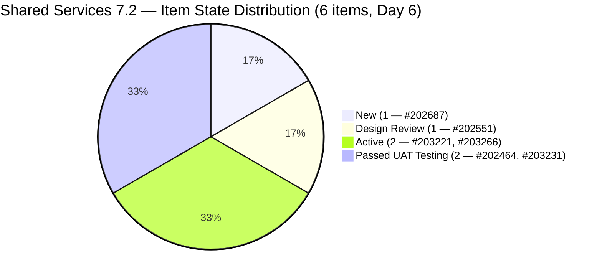
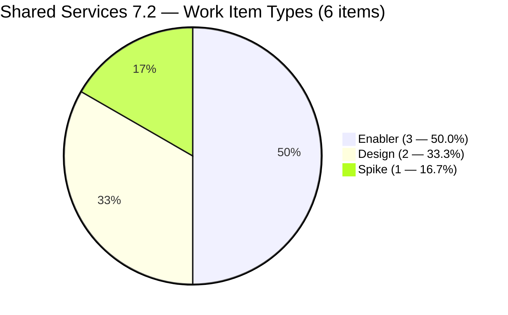
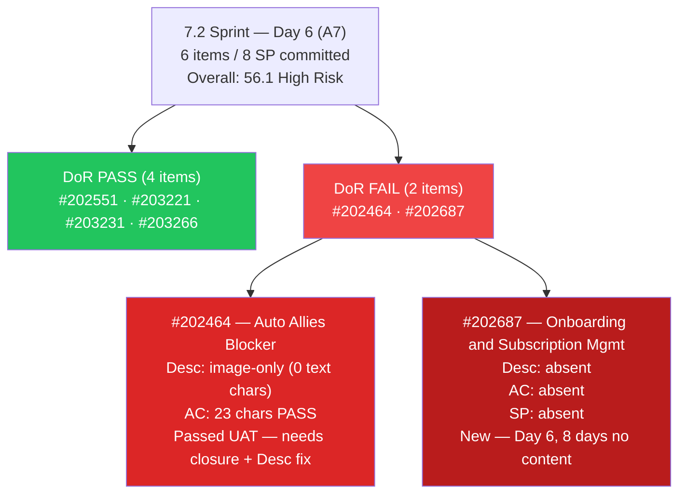
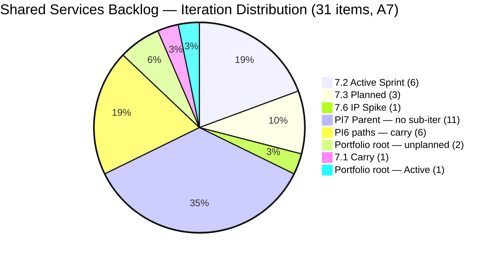
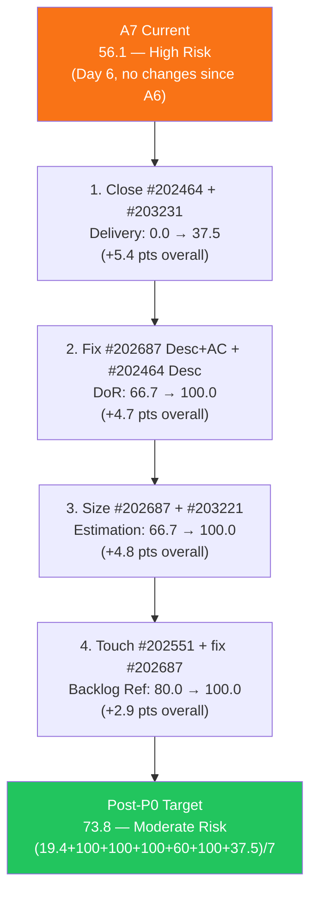
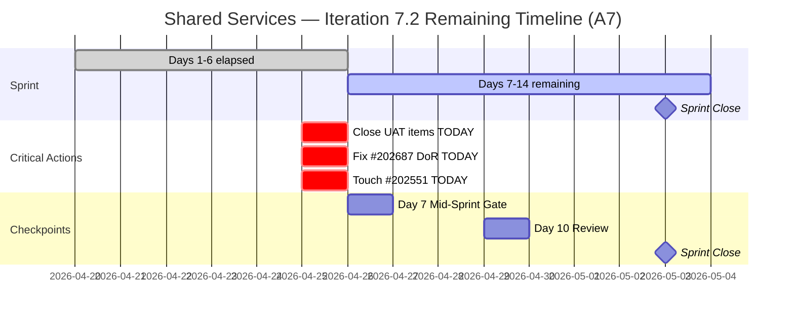

# Shared Services Team — ADO SAFe Iteration Audit

## Audit A7 | Iteration 7.2 (Apr 20 – May 3, 2026) | Day 6 of 14

---

## 1. Audit Metadata

| Field | Value |
|-------|-------|
| **Audit Number** | A7 (Shared Services series) |
| **Audit Date** | April 25, 2026, 08:33 PHT |
| **Auditor** | Claude Code ADO SAFe Audit Agent |
| **Workspace** | `ado_shared` |
| **ADO Project** | Jairosoft Portfolio (`666bb99a-6acd-4999-bb34-efd0e4ea90dc`) |
| **Team** | Shared Services Team (`bd9578fd-5773-48fc-bd80-988dfe5de806`) |
| **Iteration** | Iteration 7.2 — Apr 20 to May 3, 2026 |
| **Iteration ID** | `8edbe25f-fa4f-41b2-aaae-f3d5cf0e5b33` |
| **Iteration Path** | `Jairosoft Portfolio\2026-PI7\Iteration 7.2` |
| **Sprint Day** | Day 6 of 14 (43% elapsed) |
| **Prior Audit** | `AUDIT_20260424_0835.md` (A6, 7.2 Day 5, Overall 56.1 — High Risk) |
| **Scoring Model** | ADO SAFe v1 (7-dimension rubric) |
| **Scoped Backlog** | `Microsoft.RequirementCategory` (board focus: `Stories`) |
| **Data Source** | Live ADO read — 2026-04-25 08:33 PHT |
| **Overall Score** | **56.1 / 100** |
| **Risk Band** | **High Risk** (40–59.9) |

---

## 2. Executive Summary

Shared Services Team holds at **56.1 / 100 — High Risk** at Day 6 of Iteration 7.2, **unchanged from A6 (56.1)**. No ADO changes have been made to any of the 6 sprint items since yesterday's 08:35 PHT audit.

**What did NOT change (all P0 actions from A6 remain open):**

1. **#202464 and #203231 still at "Passed UAT Testing"** — 3 SP sit uncredited. These require only a state transition to Closed/Done. No technical or quality barrier remains. This is now the fastest available score gain — two clicks.

2. **#202687 "Onboarding & Subscription Management"** — Still title-only, no Description, no AC, no SP. Day 6 of zero content. This item has been in the sprint since before kickoff (Apr 17 or earlier) and has received no attention in 8+ days.

3. **#202551 "Bride Account Management"** — ChangedDate still Apr 17. Still untouched-current. Combined with #202687 (also Apr 17), the 2/6 = 33.3% untouched ratio maintains the -20 Backlog Refinement penalty.

4. **#203221 "Claude Partner Network Learning Path" (Spike)** — Still Active with no SP set. Item has been Active since at least Apr 24 with no progress update.

**What remains positive since A6:**
- Team Capacity remains configured at 100.0 (first achieved in A6) — the biggest structural win of the sprint series
- #203266 "JIT Machines Setup and Preparation" (Active, SP=2) was created on Apr 24 and remains in scope — the newest addition to the sprint with a clean DoR
- All 31 visible backlog items are fresh (100% within 45-day window)
- Zero stale (90+ day) items

**Score ceiling analysis — if all P0 actions completed today (Day 6):**
- Close #202464 + #203231 → Delivery Predictability: 0.0 → 37.5 (+5.4 pts overall)
- Fix #202687 DoR + #202464 Desc → DoR: 66.7 → 100.0 (+4.7 pts overall)
- Size #202687 + #203221 → Estimation: 66.7 → 100.0 (+4.8 pts overall)
- Touch #202551 + fix #202687 → Backlog Refinement: 80.0 → 100.0 (+2.9 pts overall)
- **Post-P0 ceiling: 73.8 — Moderate Risk**

---

## 3. Previous Audit Delta

| Dimension | A6 — 7.2 Day 5 (08:35 PHT Apr 24) | A7 — 7.2 Day 6 (08:33 PHT Apr 25) | Delta |
|-----------|-------------------------------------|-------------------------------------|-------|
| Iteration Planning | 19.4 | **19.4** | 0.0 |
| Team Capacity | 100.0 | **100.0** | 0.0 |
| Estimation | 66.7 | **66.7** | 0.0 |
| DoR Compliance | 66.7 | **66.7** | 0.0 |
| Work Item Balance | 60.0 | **60.0** | 0.0 |
| Backlog Refinement | 80.0 | **80.0** | 0.0 |
| Delivery Predictability | 0.0 | **0.0** | 0.0 |
| **Overall** | **56.1** | **56.1** | **0.0** |

### Key changes since A6 (08:35 PHT Apr 24 → 08:33 PHT Apr 25)

| Item | Change | Impact |
|------|--------|--------|
| **#202464** | No change. Still Passed UAT Testing, unchanged since Apr 23. | 2 SP uncredited |
| **#202551** | No change. Still Design Review, unchanged since Apr 17. | Untouched-current (-20 BR penalty remains) |
| **#202687** | No change. Still New, title-only, unchanged since Apr 17. | DoR FAIL + Estimation gap + untouched-current |
| **#203221** | No change. Still Active, no SP, unchanged since Apr 24. | Estimation gap |
| **#203231** | No change. Still Passed UAT Testing, unchanged since Apr 23. | 1 SP uncredited |
| **#203266** | No change. Still Active (SP=2), unchanged since Apr 24. | No regression; active work |

**Zero work item changes** were detected between the two audits. All P0 actions from A6 remain unactioned.

---

## 4. Current Iteration Snapshot

### Iteration

| Field | Value |
|-------|-------|
| Name | Iteration 7.2 |
| Path | `Jairosoft Portfolio\2026-PI7\Iteration 7.2` |
| Dates | April 20 – May 3, 2026 (14 days) |
| Day | 6 of 14 — 43% elapsed |

### Contributors — current iteration work

| Contributor | Email | Items Assigned | Capacity Configured |
|-------------|-------|----------------|---------------------|
| Teofilo Limpag | `tfllmpg@jairosoft.com` | 3 (#202464, #203231, #203266) | 6h/day — Development |
| Jaszmeine Abigaille Villanueva | `jvillanueva@jairosoft.com` | 2 (#202551, #202687) | 3h/day — Design |
| Vicsante Aseniero | `vaseniero@jairosoft.com` | 1 (#203221) | 6h/day — Development |

> Total configured capacity: 15h/day. All 3 contributors have capacity — first achieved in A6.

### Current iteration root items (6 items)

| ID | Type | State | SP | Title | Assignee | Last Changed | DoR |
|----|------|-------|----|-------|----------|--------------|-----|
| #202464 | Enabler | Passed UAT Testing | 2 | Auto Allies Blocker | Teofilo | Apr 23 | **FAIL** (image-only Desc) |
| #202551 | Design | Design Review | 3 | Bride Account Management | Jaszmeine | **Apr 17** ⚠ | PASS |
| #202687 | Design | New | — | Onboarding & Subscription Management | Jaszmeine | **Apr 17** ⚠ | **FAIL** (title-only) |
| #203221 | Spike | Active | — | Claude Partner Network Learning Path | Vicsante | Apr 24 | PASS |
| #203231 | Enabler | Passed UAT Testing | 1 | Enforce One-Reviewer Approval Rule on GitHub PRs | Teofilo | Apr 23 | PASS |
| #203266 | Enabler | Active | 2 | JIT Machines Setup and Preparation | Teofilo | Apr 24 | PASS |

> ⚠ Items last changed Apr 17 predate sprint start (Apr 20) — classified as untouched-current.

---

## 5. Work Item Analysis

### 5.1 Visible Root Backlog Summary

| Cohort | Count | Notes |
|--------|-------|-------|
| **Total visible root items** | **31** | Unchanged since A6 |
| Current iteration (7.2) | 6 | Unchanged since A6 |
| Iteration 7.1 (carry) | 1 | #202732 (Enabler, Ready for UAT) — unresolved carry |
| Iteration 7.3 | 3 | #202553 (Design), #202724 (Design), #202807 (Spike) |
| Iteration 7.6 (IP) | 1 | #202947 (Spike, Teofilo) |
| PI7 parent (no sub-iter) | 11 | #202059–#202071 (Estimation-state User Stories, Vicsante) |
| PI6 paths | 6 | #196007 (6.1), #200807–#200809 (6.5), #201161 (PI6), #201170 (6.6-IP) |
| Portfolio root | 3 | #186848, #201919 (unplanned); #201919 Active |

### 5.2 Type Distribution — Current 7.2 Items (6 items)

| Type | Count | Share |
|------|-------|-------|
| Enabler | 3 | 50.0% |
| Design | 1 | 16.7% |
| Spike | 1 | 16.7% |
| User Story | 0 | 0% |

- User Story count = 0 → **−40 penalty**
- Dominant type = Enabler at 50.0% — not >60% → no −30
- Spike share = 1/6 = 16.7% — not >40% → no −20
- Work Item Balance = max(0, 100 − 40) = **60.0**

### 5.3 State Distribution — Current 7.2 Items

| State | Count | SP |
|-------|-------|----|
| New | 1 | 0 (#202687 — unestimated) |
| Design Review | 1 | 3 (#202551) |
| Active | 2 | 2 (#203221 unestimated) + 2 (#203266) |
| Passed UAT Testing | 2 | 3 (#202464=2, #203231=1) |
| Closed / Done | 0 | 0 |

Two items at Passed UAT Testing with 3 SP uncredited. No closures in 6 days.

### 5.4 DoR Verification — Live Read Apr 25 08:33

| ID | Description | AC | DoR |
|----|-------------|-----|-----|
| #202464 | `` tag only — ~0 non-ws text chars | "Merge with ticket 202393" — ~23 non-ws chars ≥20 | **FAIL (Desc < 30)** |
| #202551 | "Feature 201141: Bride Account Management" → ~33 chars ≥30 | 5 linked User Stories (titles) → ~50+ chars ≥20 | PASS |
| #202687 | **Absent — 0 chars** | **Absent — 0 chars** | **FAIL (title-only)** |
| #203221 | "Taking this first step toward partnership with Anthropic..." → ~120 chars ≥30 | 4 named courses → ~60 chars ≥20 | PASS |
| #203231 | 3-bullet As-a narrative → ~200 chars ≥30 | 6 detailed AC bullets → ~300 chars ≥20 | PASS |
| #203266 | "As a DevOps Infrastructure Engineer..." → ~150 chars ≥30 | 4 checkbox AC items → ~120 chars ≥20 | PASS |

DoR pass rate: **4/6 = 66.7%** — unchanged from A6.

### 5.5 Backlog Age Analysis (today = 2026-04-25)

| Bucket | Threshold | Count | Share |
|--------|-----------|-------|-------|
| Fresh (within 45 days) | ChangedDate ≥ 2026-03-11 | 31 | 100% |
| Stale ≥ 90 days | ChangedDate before 2026-01-25 | 0 | 0% |
| Stale ≥ 180 days | ChangedDate before 2025-10-28 | 0 | 0% |
| **Untouched current items** | ChangedDate < 2026-04-20 | **2** (#202551 Apr 17, #202687 Apr 17) | **33.3% (2/6)** |

Both untouched items have now been in this state for **8+ days** (6 sprint days + pre-sprint creation). The 33.3% > 30% threshold sustains the -20 Backlog Refinement penalty.

### 5.6 Estimation Analysis

| ID | Type | SP | Point-Eligible | Estimated |
|----|------|----|----------------|-----------|
| #202464 | Enabler | 2 | Yes | Yes |
| #202551 | Design | 3 | Yes | Yes |
| #202687 | Design | — | Yes | **No** |
| #203221 | Spike | — | Yes | **No** |
| #203231 | Enabler | 1 | Yes | Yes |
| #203266 | Enabler | 2 | Yes | Yes |
| **Totals** | | **8 SP** | 6 | 4 |

Committed SP = 8. Two items unestimated: #202687 (Design, no SP, no content) and #203221 (Spike, Active but unsized).

---

## 6. SAFe Compliance Scorecard

| Dimension | Score | Evidence | Notes |
|-----------|-------|----------|-------|
| Iteration Planning | **19.4** | 6 current / 31 visible root | Structural; 11 PI7-parent items unassigned to iterations |
| Team Capacity | **100.0** | 3/3 contributors configured (Teofilo 6h, Vicsante 6h, Jaszmeine 3h) | Maintained from A6 breakthrough |
| Estimation | **66.7** | 4/6 point-eligible items estimated | #202687 (no SP) and #203221 (Spike, no SP) unestimated |
| DoR Compliance | **66.7** | 4/6 items pass Desc ≥30 AND AC ≥20 | #202464 image-only Desc; #202687 title-only; both unchanged Day 6 |
| Work Item Balance | **60.0** | No User Story (−40); Enabler 50% < 60% (no −30); Spike 16.7% < 40% (no −20) | Structural; -40 persists |
| Backlog Refinement | **80.0** | 31/31 fresh; 0 stale; 2 untouched-current (2/6=33.3% > 30% → −20) | -20 penalty: #202551 + #202687 both Apr 17, pre-sprint start |
| Delivery Predictability | **0.0** | 0 SP closed / 8 SP committed | Day 6 of 14; 2 items at Passed UAT Testing (3 SP); closure gap widens daily |
| **Overall** | **56.1** | (19.4+100.0+66.7+66.7+60.0+80.0+0.0)/7 | **High Risk** (40–59.9) |

### Score Computation Detail

```
1. Iteration Planning
   visible_root_backlog_items          = 31
   current_iteration_root_items (7.2)  = 6
   Score = round(6 / 31 × 100, 1)     = 19.4

2. Team Capacity
   contributors_with_current_work      = 3 (Teofilo, Jaszmeine, Vicsante)
   contributors_with_capacity          = 3 (all configured)
   Score = round(3 / 3 × 100, 1)      = 100.0

3. Estimation
   point_eligible_current_items        = 6
   estimated_current_items (SP > 0)    = 4
   Score = round(4 / 6 × 100, 1)      = 66.7

4. DoR Compliance
   current_iteration_root_items        = 6
   dor_compliant_current_items         = 4
   Score = round(4 / 6 × 100, 1)      = 66.7

5. Work Item Balance
   User Story items in 7.2             = 0 → −40
   dominant_type_share                 = Enabler 50.0% — not >60% → no −30
   spike_share                         = 1/6 = 16.7% — not >40% → no −20
   Score = max(0, 100 − 40)           = 60.0

6. Backlog Refinement
   fresh_visible_root_items            = 31 (all ≥ Apr 15 > Mar 11 threshold)
   base = round(31 / 31 × 100, 1)     = 100.0
   stale_90 = 0                        → no penalty
   stale_180 = 0                       → no penalty
   untouched_current                   = 2 (#202551 Apr 17, #202687 Apr 17)
   untouched/current = 2/6 = 33.3%    > 30% → −20
   Score = max(0, 100.0 − 20)         = 80.0

7. Delivery Predictability
   committed_story_points              = 8 SP
   closed_story_points                 = 0 SP
   Score = round(0 / 8 × 100, 1)     = 0.0
   Note: Day 6 of 14 — early-sprint justification expires today

Overall = round((19.4 + 100.0 + 66.7 + 66.7 + 60.0 + 80.0 + 0.0) / 7, 1)
        = round(392.8 / 7, 1)
        = 56.1  →  HIGH RISK (40–59.9)
```

---

## 7. Dimension Findings

### 7.1 Iteration Planning — 19.4 (Structural; unchanged)

6/31 visible items are in Iteration 7.2 (19.4%). The structural cause is the 11 PI7-parent User Stories (#202059–#202071) all assigned to Vicsante in Estimation state with no sub-iteration assignment. If these 11 were distributed to future iterations, Iteration Planning would improve from 6/31=19.4% toward 6/20=30.0%.

Additionally, 6 PI6-path items remain on the board (3 in old sub-iterations, 1 in PI6 parent). If these were archived or closed, Iteration Planning would further improve. The July 1 visible scope structure needs attention at the PI6/PI7 boundary cleanup.

### 7.2 Team Capacity — 100.0 (Maintained — key structural achievement)

The team capacity configuration achieved in A6 is holding. Three contributors remain configured:
- **Teofilo Limpag:** 6h/day — Development
- **Vicsante Aseniero:** 6h/day — Development
- **Jaszmeine Abigaille Villanueva:** 3h/day — Design

**Critical note:** The team must re-configure capacity for Iteration 7.3 immediately after 7.2 closes (May 3). In prior iterations, Team Capacity was 0.0 for five consecutive audits because the capacity settings were not renewed. Proactive renewal is required to avoid reverting to 0.0.

### 7.3 Estimation — 66.7 (Unchanged; 2 items unestimated — Day 6)

Two items remain unestimated:

**#202687 "Onboarding & Subscription Management" (Design):** No SP, no Desc, no AC. Has been in the sprint since at least Apr 17 — nine days without any content. This is the most persistently neglected item in the Shared Services sprint history. Adding SP of 2–3 along with DoR content lifts Estimation from 66.7 → 100.0.

**#203221 "Claude Partner Network Learning Path" (Spike):** Active state, well-formed DoR, but no SP. This item is in progress (Vicsante). Suggested SP: 1–2 based on 4 named courses with defined deliverables. Adding SP closes the second estimation gap.

### 7.4 DoR Compliance — 66.7 (Unchanged; same two failures — Day 6)

**#202464 "Auto Allies Blocker" — FAIL (image-only Description)**
- Description: Contains only an `` tag. Zero text narrative.
- State: Passed UAT Testing — the work is done, but the item was never described.
- Fix: Add one As-a/I-want/So-that sentence (30+ chars). ~5 minutes.
- AC passes (23 chars ≥20). Only Description needs updating.
- This item needs to be Closed, so the DoR fix and the closure can happen simultaneously.

**#202687 "Onboarding & Subscription Management" — FAIL (title-only — Day 6)**
- Description: **Absent — 0 chars**
- Acceptance Criteria: **Absent — 0 chars**
- State: New — 6 sprint days without a single update.
- This is the most critical DoR failure in the team's current history.
- Fix: ~10 minutes. Add Desc (30+ chars, As-a/I-want/So-that) and AC (20+ chars, outcome-based). This simultaneously fixes DoR, allows estimation, and resets the ChangedDate to today (clearing the untouched-current penalty for this item).

### 7.5 Work Item Balance — 60.0 (Structural; unchanged)

No User Story exists in the 7.2 scope → −40 penalty applies. Enabler at 50% is below the 60% dominant threshold (no −30). Spike at 16.7% is below 40% (no −20).

**Path to improvement:** Adding at least one User Story to 7.2 scope eliminates the −40 penalty, lifting Work Item Balance from 60.0 → 100.0 and adding +5.7 pts to overall.

Note: The 11 PI7-parent User Stories (Vicsante) are not sub-iterated into 7.2. If even one were moved to 7.2, Work Item Balance would improve to 100.0.

### 7.6 Backlog Refinement — 80.0 (Unchanged; -20 penalty persists)

The -20 penalty from untouched-current items continues. Both #202551 and #202687 were last changed Apr 17 — three days before sprint start — and neither has been touched since. Day 6.

**Two-action fix:**
1. **Touch #202551:** A comment or state confirmation resets ChangedDate to today.
2. **Fix #202687 DoR:** Adding Desc + AC simultaneously resets ChangedDate.

Both actions together would clear all untouched-current items: untouched/current = 0/6 = 0% → Backlog Refinement 80.0 → 100.0 (+2.9 pts overall).

### 7.7 Delivery Predictability — 0.0 (Day 6 — closure urgency is HIGH)

0 SP closed / 8 SP committed. Day 6 of 14 (43% elapsed). The early-sprint annotation applied through Day 5; **from Day 6 onward, zero delivery at 43% elapsed is a substantive performance gap, not a timing artifact.**

**Immediate path to delivery credit (no quality work required):**
- **Close #202464 (2 SP) and #203231 (1 SP):** Both items are at Passed UAT Testing. They have passed all quality checks. Transitioning to Closed/Done credits 3 SP immediately: Delivery Predictability 0.0 → 37.5 (+5.4 pts overall).
- **This is the single fastest score gain available — two state transitions in ADO, under 2 minutes.**

**If #203266 (2 SP, Active) closes today:** Delivery Predictability would reach 5/8 = 62.5% — meeting the sprint target in a single day.

**Risk escalation:** Every day #202464 and #203231 remain at Passed UAT Testing rather than Closed, the team loses delivery credit for work already completed. This is an administrative gap, not a delivery gap.

---

## 8. Risks and Bottlenecks

| Priority | Risk | Impact | Age | Status vs A6 |
|----------|------|--------|-----|--------------|
| **P0** | **#202464 and #203231 at Passed UAT Testing — not Closed** | 3 SP uncredited; Delivery 0.0 | 2-3 days in UAT | **Unchanged — escalated to Day 6** |
| **P0** | **#202687 title-only — Day 6, no content since creation** | DoR + Estimation + Backlog Refinement all impacted | 8+ days | **CRITICAL — longest unresolved item failure in Shared Services history** |
| **P0** | **#202551 and #202687 untouched since Apr 17** | Backlog Refinement -20 penalty (33.3% > 30%) | 8 days pre/at-sprint | **Unchanged; worsens daily** |
| **P1** | **#202464 DoR failing (image-only Desc)** | DoR capped at 66.7% | Day 6 | Unchanged |
| **P1** | **#203221 Spike — Active but no SP** | Estimation capped at 66.7% | Day 3 Active | Unchanged |
| **P1** | **#202687 no SP** | Estimation gap | Day 6 | Unchanged |
| **P2** | **#202732 (7.1 carry, Ready for UAT) — unresolved** | Board noise; should be closed or escalated | 5+ days | Unchanged |
| **P2** | **11 PI7-parent User Stories not sub-iterated** | Iteration Planning structurally at 19.4% | Ongoing | Structural |
| **P3** | **No User Story in current sprint** | Work Item Balance capped at 60.0 | Structural | Unchanged |
| **P3** | **No sprint goal for Iteration 7.2** | PI alignment not assessable | 6 days | Persistent across all 7 audits |

---

## 9. Prioritized Recommendations

### P0 — TODAY (Apr 25, Day 6) — ESCALATED FROM A6

All five A6 P0 actions remain open. The team has had 24 hours to act and has not. Each action below is independently achievable in minutes.

1. **[< 2 min] Close #202464 and #203231 in ADO.** Both at Passed UAT Testing. No additional work required. State transition only.
   - Impact: Delivery Predictability 0.0 → 37.5 (+5.4 pts overall)

2. **[< 10 min] Add Description + AC + SP to #202687.**
   - Desc (30+ chars): *"As a Design Lead, I want to design the Onboarding & Subscription Management flows for the Flawless Web App so that new vendors can register, configure, and subscribe without guidance."*
   - AC (20+ chars): Registration flow wireframes completed; subscription tier screens defined; design review approved.
   - SP: 2–3 suggested.
   - Impact: DoR failure cleared (partial) + Estimation gap cleared + untouched-current penalty reduced (2→1 items; 1/6=16.7% → -10 instead of -20)

3. **[< 5 min] Add text Description to #202464.**
   - Desc (30+ chars): *"As a DevOps Engineer, I want to unblock the Auto Allies CI/CD pipeline by resolving the dependency merge with ticket 202393 so that deployments are no longer blocked."*
   - Impact: DoR compliance 66.7 → 100.0 (when combined with #202687 fix)

4. **[< 2 min] Touch #202551 (Bride Account Management).**
   - Any ADO update (comment, tag, state review note) resets ChangedDate from Apr 17 to today.
   - Impact: Combined with #202687 fix, clears both untouched-current items → Backlog Refinement 80.0 → 100.0

5. **[< 5 min] Add SP to #203221 (Claude Partner Network Learning Path — Spike).**
   - Suggested SP: 1–2 (4 named courses, structured deliverable).
   - Impact: Estimation 66.7 → 100.0 (combined with #202687 SP)

**Combined P0 impact (all 5 actions today):**

| Dimension | Current | After P0 | Delta |
|-----------|---------|----------|-------|
| Team Capacity | 100.0 | 100.0 | — |
| Delivery Predictability | 0.0 | 37.5 (3/8 closed) | +37.5 |
| DoR | 66.7 | 100.0 (6/6) | +33.3 |
| Estimation | 66.7 | 100.0 (6/6) | +33.3 |
| Backlog Refinement | 80.0 | 100.0 (0 untouched) | +20.0 |
| Iteration Planning | 19.4 | 19.4 | — |
| Work Item Balance | 60.0 | 60.0 | — |
| **Overall** | **56.1** | **(19.4+100.0+100.0+100.0+60.0+100.0+37.5)/7 = 73.8** | **+17.7** |

### P1 — Before Day 7 (Apr 26)

1. **Close #202732 (7.1 Enabler, Ready for UAT).** This carry item has been at Ready for UAT since at least Apr 17. Closing reduces visible backlog (31→30) and improves board hygiene.
2. **Begin work on #202687** — after DoR remediation, transition from New to the appropriate active state (Design or In Progress). It is the only New-state item in the sprint with no activation signal.
3. **Confirm #203266 (JIT Machines Setup) progress.** Active since Apr 24. Teofilo should provide a status update.
4. **Track #203221 course completion.** Four courses named; estimate how many are complete by Day 7.

### P2 — This Sprint / PI-Level

1. **Sub-iterate the 11 PI7-parent User Stories (#202059–#202071).** Assign to 7.2, 7.3, 7.4, or 7.5 based on priority. Moves Iteration Planning from 19.4% toward ~30%.
2. **Add at least one User Story to 7.2 scope.** Removes the -40 Work Item Balance penalty (+5.7 pts overall).
3. **Define a sprint goal for Iteration 7.2.** Suggested: *"Configure team capacity foundation, enforce DevOps governance (PR rules + JIT machines), advance Flawless design, complete Anthropic partner certification — establishing Shared Services as the ART's operational backbone for PI7."*
4. **Conduct 7.3 pre-sprint grooming.** #202553 and #202724 (moved to 7.3 from 7.2 in A6) are still in Estimation state with no SP. These need sizing before 7.3 kickoff (May 4 — 9 days away).
5. **Maintain team capacity for 7.3.** Renew ADO capacity entries immediately upon 7.2 close to prevent reverting to 0.0.

---

## 10. Evidence Gaps and Limitations

| Gap | Impact | Severity | Notes |
|-----|--------|----------|-------|
| **#202464 Desc image content** | Image likely shows a screenshot of the blocker. Text narrative absent; scored as FAIL conservatively | Medium — actionable with trivial fix |
| **#202393 merge status** | #202464 AC references merging with #202393. Confirm #202393 was closed or archived after the merge | Low — persistent from A5 |
| **#203221 course completion status** | Item is Active but no SP set and no progress update since Apr 24 | Low — actionable (add SP + status comment) |
| **11 PI7-parent items scope** | All 11 assigned to Vicsante; no sub-iteration, no SP, no Desc; scope and delivery timeline unknown | Medium — structural backlog debt |
| **#202732 (7.1 carry) ownership** | Ready for UAT for 8+ days; unclear if UAT is blocked or simply not transitioned | Low — closure or escalation needed |
| **No sprint goal** | PI alignment not assessable; persistent across all 7 Shared Services audits | Low |
| **Backlog count stability** | The WIQL query scoped to 7.2 iteration path returned 30 items (many from other Portfolio teams). Shared Services items confirmed via team-scoped backlog + capacity data | Low — cross-team Portfolio structure confirmed |

---

## 11. Visualizations

### 11.1 Score Trend — Shared Services Iteration 7.2 Audit Series

```mermaid
flowchart LR
    A1["A1 · Apr 19\nDay 0\n37.7 — Critical"]
    A2["A2 · Apr 21\nDay 2\n37.7 — Critical"]
    A3["A3 · Apr 22\nDay 3\n37.7 — Critical"]
    A4["A4 · Apr 23 0900\nDay 4\n35.3 — Critical"]
    A5["A5 · Apr 23 1105\nDay 4\n41.1 — High"]
    A6["A6 · Apr 24\nDay 5\n56.1 — High"]
    A7["A7 · Apr 25\nDay 6\n56.1 — High"]
    P0["P0 Ceiling\n73.8 — Moderate"]
    A1 --> A2 --> A3 --> A4 --> A5 --> A6 --> A7 --> P0
    style A1 fill:#ef4444,color:#fff
    style A2 fill:#ef4444,color:#fff
    style A3 fill:#ef4444,color:#fff
    style A4 fill:#ef4444,color:#fff
    style A5 fill:#f97316,color:#fff
    style A6 fill:#f97316,color:#fff
    style A7 fill:#f97316,color:#fff
    style P0 fill:#22c55e,color:#fff
```



### 11.2 Current Iteration Item State Distribution (6 items)



### 11.3 Work Item Type Distribution — 7.2 Items



### 11.4 DoR Status — Sprint Items (A7)



### 11.5 Backlog Distribution — 31 Visible Items



### 11.6 P0 Score Impact Path



### 11.7 Sprint Timeline — Remaining Days



---

*Audit A7 — Shared Services Team — Iteration 7.2 Day 6 — April 25, 2026 08:33 PHT*
*Auditor: Claude Code (`ado-safe-audit` skill, claude-sonnet-4-6)*
*Data currency: Live ADO read at 2026-04-25 08:33 PHT*
*Prior audit: AUDIT_20260424_0835.md (A6, Overall 56.1 High Risk)*
