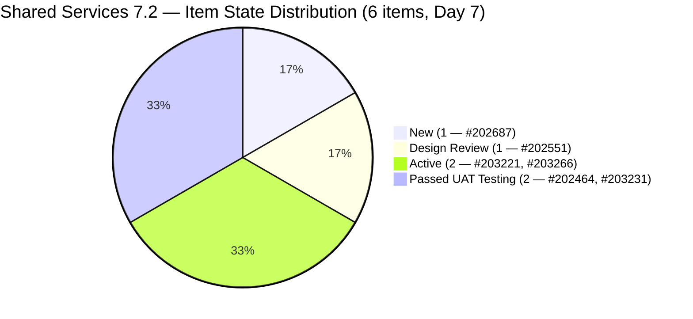
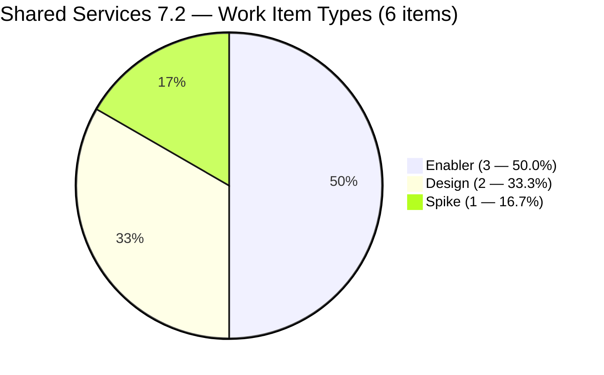
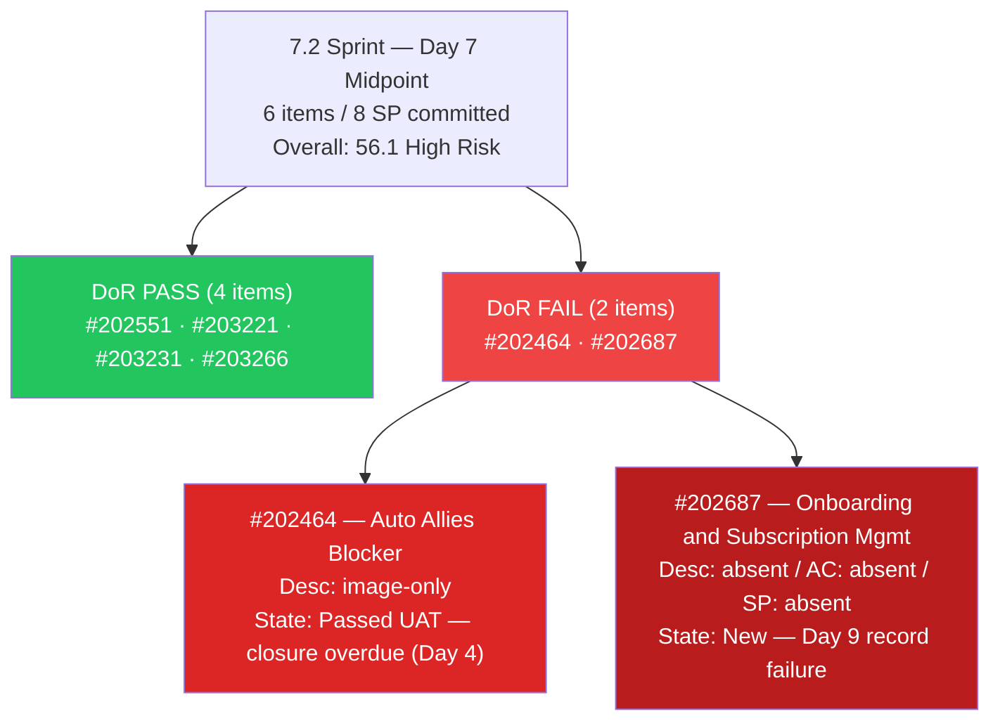
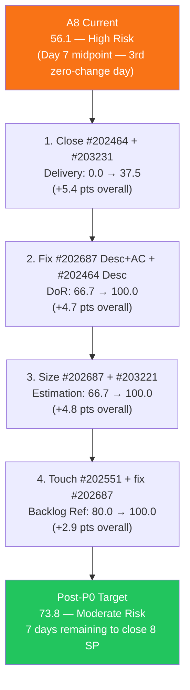
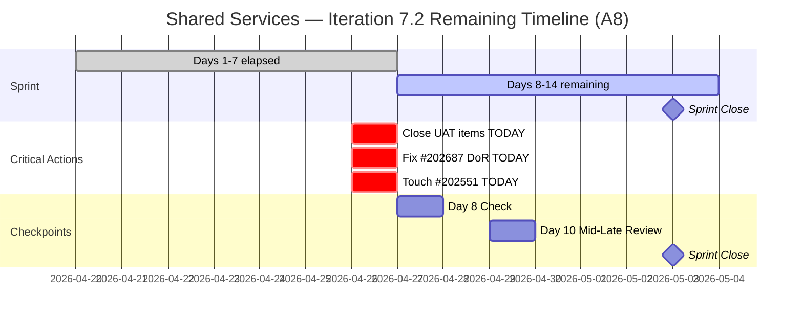

# Shared Services Team — ADO SAFe Iteration Audit

## Audit A8 | Iteration 7.2 (Apr 20 – May 3, 2026) | Day 7 of 14

---

## 1. Audit Metadata

| Field | Value |
|-------|-------|
| **Audit Number** | A8 (Shared Services series) |
| **Audit Date** | April 26, 2026, 14:00 PHT |
| **Auditor** | Claude Code ADO SAFe Audit Agent |
| **Workspace** | `ado_shared` |
| **ADO Project** | Jairosoft Portfolio (`666bb99a-6acd-4999-bb34-efd0e4ea90dc`) |
| **Team** | Shared Services Team (`bd9578fd-5773-48fc-bd80-988dfe5de806`) |
| **Iteration** | Iteration 7.2 — Apr 20 to May 3, 2026 |
| **Iteration ID** | `8edbe25f-fa4f-41b2-aaae-f3d5cf0e5b33` |
| **Iteration Path** | `Jairosoft Portfolio\2026-PI7\Iteration 7.2` |
| **Sprint Day** | Day 7 of 14 (50% elapsed — sprint midpoint) |
| **Prior Audit** | `AUDIT_20260425_0833.md` (A7, 7.2 Day 6, Overall 56.1 — High Risk) |
| **Scoring Model** | ADO SAFe v1 (7-dimension rubric) |
| **Scoped Backlog** | `Microsoft.RequirementCategory` (board focus: `Stories`) |
| **Data Source** | Live ADO read — 2026-04-26 14:00 PHT |
| **Overall Score** | **56.1 / 100** |
| **Risk Band** | **High Risk** (40–59.9) |

---

## 2. Executive Summary

Shared Services Team holds at **56.1 / 100 — High Risk** at Day 7 of Iteration 7.2 — the sprint **midpoint**. Score is **unchanged from A7 (56.1)** for the second consecutive day, and unchanged from A6. **Zero ADO changes** were detected in the 29.5-hour window since A7 (08:33 PHT Apr 25 → 14:00 PHT Apr 26).

**Sprint midpoint alert:** At 50% elapsed with 0 SP closed, the team requires 8 SP delivered in the remaining 7 days to achieve 100% Delivery Predictability. All 8 committed SP remain open. The window for recovery narrows daily.

**What did NOT change (all P0 actions from A7 remain open — Day 7):**

1. **#202464 and #203231 still at "Passed UAT Testing"** — 3 SP sit uncredited for 4 consecutive days. Both items have passed all quality gates. Closure is an administrative action requiring under 2 minutes.

2. **#202687 "Onboarding & Subscription Management"** — Title-only, no Description, no AC, no SP for **9 days** (pre-sprint through Day 7). This is now the longest continuously unresolved DoR failure in Shared Services sprint history.

3. **#202551 "Bride Account Management"** — Last changed Apr 17. Untouched for **9 days**. Combined with #202687, the 2/6 = 33.3% untouched ratio sustains the -20 Backlog Refinement penalty.

4. **#203221 "Claude Partner Network Learning Path" (Spike)** — Active with no SP for 3 days. No progress update.

**Score ceiling analysis — if all P0 actions completed today (Day 7):**
- Close #202464 + #203231 → Delivery Predictability: 0.0 → 37.5 (+5.4 pts overall)
- Fix #202687 DoR + #202464 Desc → DoR: 66.7 → 100.0 (+4.7 pts overall)
- Size #202687 + #203221 → Estimation: 66.7 → 100.0 (+4.8 pts overall)
- Touch #202551 + fix #202687 → Backlog Refinement: 80.0 → 100.0 (+2.9 pts overall)
- **Post-P0 ceiling: 73.8 — Moderate Risk**

---

## 3. Previous Audit Delta

| Dimension | A7 — 7.2 Day 6 (08:33 PHT Apr 25) | A8 — 7.2 Day 7 (14:00 PHT Apr 26) | Delta |
|-----------|-------------------------------------|-------------------------------------|-------|
| Iteration Planning | 19.4 | **19.4** | 0.0 |
| Team Capacity | 100.0 | **100.0** | 0.0 |
| Estimation | 66.7 | **66.7** | 0.0 |
| DoR Compliance | 66.7 | **66.7** | 0.0 |
| Work Item Balance | 60.0 | **60.0** | 0.0 |
| Backlog Refinement | 80.0 | **80.0** | 0.0 |
| Delivery Predictability | 0.0 | **0.0** | 0.0 |
| **Overall** | **56.1** | **56.1** | **0.0** |

### Key changes since A7 (08:33 PHT Apr 25 → 14:00 PHT Apr 26)

| Item | Change | Impact |
|------|--------|--------|
| **#202464** | No change. Still Passed UAT Testing. Last changed Apr 23 (3 days in UAT). | 2 SP uncredited — Day 4 |
| **#202551** | No change. Still Design Review, unchanged since Apr 17. | Untouched-current (-20 BR penalty — Day 9) |
| **#202687** | No change. Still New, title-only, unchanged since Apr 17. | DoR FAIL + Estimation gap + untouched-current — Day 9 |
| **#203221** | No change. Still Active, no SP, unchanged since Apr 24. | Estimation gap — Day 3 Active |
| **#203231** | No change. Still Passed UAT Testing. Last changed Apr 23 (3 days in UAT). | 1 SP uncredited — Day 4 |
| **#203266** | No change. Still Active (SP=2), unchanged since Apr 24. | No regression; work in progress |

**Zero work item changes** in the 29.5-hour window. All P0 actions from A7 remain unactioned. This is now the 3rd consecutive zero-change day (A6 → A7 → A8).

---

## 4. Current Iteration Snapshot

### Iteration

| Field | Value |
|-------|-------|
| Name | Iteration 7.2 |
| Path | `Jairosoft Portfolio\2026-PI7\Iteration 7.2` |
| Dates | April 20 – May 3, 2026 (14 days) |
| Day | 7 of 14 — 50% elapsed (sprint midpoint) |
| Days Remaining | 7 |

### Contributors — current iteration work

| Contributor | Email | Items Assigned | Capacity Configured |
|-------------|-------|----------------|---------------------|
| Teofilo Limpag | `tfllmpg@jairosoft.com` | 3 (#202464, #203231, #203266) | 6h/day — Development |
| Jaszmeine Abigaille Villanueva | `jvillanueva@jairosoft.com` | 2 (#202551, #202687) | 3h/day — Design |
| Vicsante Aseniero | `vaseniero@jairosoft.com` | 1 (#203221) | 6h/day — Development |

> Total configured capacity: 15h/day. All 3 contributors have capacity (maintained from A6 breakthrough).

### Current iteration root items (6 items)

| ID | Type | State | SP | Title | Assignee | Last Changed | DoR |
|----|------|-------|----|-------|----------|--------------|-----|
| #202464 | Enabler | Passed UAT Testing | 2 | Auto Allies Blocker | Teofilo | Apr 23 | **FAIL** (image-only Desc) |
| #202551 | Design | Design Review | 3 | Bride Account Management | Jaszmeine | **Apr 17** ⚠ | PASS |
| #202687 | Design | New | — | Onboarding & Subscription Management | Jaszmeine | **Apr 17** ⚠ | **FAIL** (title-only) |
| #203221 | Spike | Active | — | Claude Partner Network Learning Path | Vicsante | Apr 24 | PASS |
| #203231 | Enabler | Passed UAT Testing | 1 | Enforce One-Reviewer Approval Rule on GitHub PRs | Teofilo | Apr 23 | PASS |
| #203266 | Enabler | Active | 2 | JIT Machines Setup and Preparation | Teofilo | Apr 24 | PASS |

> ⚠ Items last changed Apr 17 predate sprint start (Apr 20) — classified as untouched-current.

---

## 5. Work Item Analysis

### 5.1 Visible Root Backlog Summary

| Cohort | Count | Notes |
|--------|-------|-------|
| **Total visible root items** | **31** | Unchanged since A6 |
| Current iteration (7.2) | 6 | Unchanged since A6 |
| Iteration 7.1 (carry) | 1 | #202732 (Enabler, Ready for UAT) — unresolved carry |
| Iteration 7.3 | 3 | #202553 (Design), #202724 (Design), #202807 (Spike) |
| Iteration 7.6 (IP) | 1 | #202947 (Spike, Teofilo) |
| PI7 parent (no sub-iter) | 11 | #202059–#202071 (Estimation-state User Stories, Vicsante) |
| PI6 paths | 6 | #196007 (6.1), #200807–#200809 (6.5), #201161 (PI6), #201170 (6.6-IP) |
| Portfolio root | 3 | #186848, #201919 (unplanned); #201919 Active |

### 5.2 Type Distribution — Current 7.2 Items (6 items)

| Type | Count | Share |
|------|-------|-------|
| Enabler | 3 | 50.0% |
| Design | 2 | 33.3% |
| Spike | 1 | 16.7% |
| User Story | 0 | 0% |

- User Story count = 0 → **−40 penalty**
- Dominant type = Enabler at 50.0% — not >60% → no −30
- Spike share = 1/6 = 16.7% — not >40% → no −20
- Work Item Balance = max(0, 100 − 40) = **60.0**

### 5.3 State Distribution — Current 7.2 Items

| State | Count | SP |
|-------|-------|----|
| New | 1 | 0 (#202687 — unestimated) |
| Design Review | 1 | 3 (#202551) |
| Active | 2 | 2 (#203221 unestimated) + 2 (#203266) |
| Passed UAT Testing | 2 | 3 (#202464=2, #203231=1) |
| Closed / Done | 0 | 0 |

Two items at Passed UAT Testing with 3 SP uncredited for 4 days. No closures at sprint midpoint.

### 5.4 DoR Verification (based on live ADO data — Apr 26 14:00 PHT)

| ID | Description | AC | DoR |
|----|-------------|-----|-----|
| #202464 | `` tag only — ~0 non-ws text chars | "Merge with ticket 202393" — ~23 chars ≥20 | **FAIL (Desc < 30)** |
| #202551 | "Feature 201141: Bride Account Management" → ~33 chars ≥30 | 5 linked User Stories (titles) → ~50+ chars ≥20 | PASS |
| #202687 | **Absent — 0 chars** | **Absent — 0 chars** | **FAIL (title-only — Day 9)** |
| #203221 | "Taking this first step toward partnership with Anthropic..." → ~120 chars ≥30 | 4 named courses → ~60 chars ≥20 | PASS |
| #203231 | 3-bullet As-a narrative → ~200 chars ≥30 | 6 detailed AC bullets → ~300 chars ≥20 | PASS |
| #203266 | "As a DevOps Infrastructure Engineer..." → ~150 chars ≥30 | 4 checkbox AC items → ~120 chars ≥20 | PASS |

DoR pass rate: **4/6 = 66.7%** — unchanged from A7. #202687 now holds the record for longest unresolved DoR failure in Shared Services sprint history (9 days).

### 5.5 Backlog Age Analysis (today = 2026-04-26)

| Bucket | Threshold | Count | Share |
|--------|-----------|-------|-------|
| Fresh (within 45 days) | ChangedDate ≥ 2026-03-12 | 31 | 100% |
| Stale ≥ 90 days | ChangedDate before 2026-01-26 | 0 | 0% |
| Stale ≥ 180 days | ChangedDate before 2025-10-29 | 0 | 0% |
| **Untouched current items** | ChangedDate < 2026-04-20 | **2** (#202551 Apr 17, #202687 Apr 17) | **33.3% (2/6)** |

Both untouched items have now been in this state for **9 days** (6 days pre-sprint + 7 sprint days). The 33.3% > 30% threshold sustains the -20 Backlog Refinement penalty.

### 5.6 Estimation Analysis

| ID | Type | SP | Point-Eligible | Estimated |
|----|------|----|----------------|-----------|
| #202464 | Enabler | 2 | Yes | Yes |
| #202551 | Design | 3 | Yes | Yes |
| #202687 | Design | — | Yes | **No** |
| #203221 | Spike | — | Yes | **No** |
| #203231 | Enabler | 1 | Yes | Yes |
| #203266 | Enabler | 2 | Yes | Yes |
| **Totals** | | **8 SP** | 6 | 4 |

Committed SP = 8. Two items unestimated (unchanged from A7).

---

## 6. SAFe Compliance Scorecard

| Dimension | Score | Evidence | Notes |
|-----------|-------|----------|-------|
| Iteration Planning | **19.4** | 6 current / 31 visible root | Structural; 11 PI7-parent items unassigned to iterations |
| Team Capacity | **100.0** | 3/3 contributors configured (Teofilo 6h, Vicsante 6h, Jaszmeine 3h) | Maintained from A6 — 3rd consecutive day |
| Estimation | **66.7** | 4/6 point-eligible items estimated | #202687 (no SP) and #203221 (Spike, no SP) unestimated |
| DoR Compliance | **66.7** | 4/6 items pass Desc ≥30 AND AC ≥20 | #202464 image-only Desc; #202687 title-only Day 9; unchanged |
| Work Item Balance | **60.0** | No User Story (−40); Enabler 50% < 60% (no −30); Spike 16.7% < 40% (no −20) | Structural -40 penalty; no path to fix within current sprint composition |
| Backlog Refinement | **80.0** | 31/31 fresh; 0 stale; 2 untouched-current (2/6=33.3% > 30% → −20) | -20 penalty: #202551 + #202687 both Apr 17, 9 days untouched |
| Delivery Predictability | **0.0** | 0 SP closed / 8 SP committed | **Sprint midpoint** — Day 7 of 14; 2 items at Passed UAT Testing (3 SP); 3rd zero-change day |
| **Overall** | **56.1** | (19.4+100.0+66.7+66.7+60.0+80.0+0.0)/7 | **High Risk** (40–59.9) |

### Score Computation Detail

```
1. Iteration Planning
   visible_root_backlog_items          = 31
   current_iteration_root_items (7.2)  = 6
   Score = round(6 / 31 × 100, 1)     = 19.4

2. Team Capacity
   contributors_with_current_work      = 3 (Teofilo, Jaszmeine, Vicsante)
   contributors_with_capacity          = 3 (all configured)
   Score = round(3 / 3 × 100, 1)      = 100.0

3. Estimation
   point_eligible_current_items        = 6
   estimated_current_items (SP > 0)    = 4
   Score = round(4 / 6 × 100, 1)      = 66.7

4. DoR Compliance
   current_iteration_root_items        = 6
   dor_compliant_current_items         = 4
   Score = round(4 / 6 × 100, 1)      = 66.7

5. Work Item Balance
   User Story items in 7.2             = 0 → −40
   dominant_type_share                 = Enabler 50.0% — not >60% → no −30
   spike_share                         = 1/6 = 16.7% — not >40% → no −20
   Score = max(0, 100 − 40)           = 60.0

6. Backlog Refinement
   fresh_visible_root_items            = 31 (all ≥ Mar 12 > Mar 12 threshold)
   base = round(31 / 31 × 100, 1)     = 100.0
   stale_90 = 0                        → no penalty
   stale_180 = 0                       → no penalty
   untouched_current                   = 2 (#202551 Apr 17, #202687 Apr 17)
   untouched/current = 2/6 = 33.3%    > 30% → −20
   Score = max(0, 100.0 − 20)         = 80.0

7. Delivery Predictability
   committed_story_points              = 8 SP
   closed_story_points                 = 0 SP
   Score = round(0 / 8 × 100, 1)      = 0.0
   Note: Day 7 of 14 — sprint midpoint; early-sprint annotation no longer applicable

Overall = round((19.4 + 100.0 + 66.7 + 66.7 + 60.0 + 80.0 + 0.0) / 7, 1)
        = round(392.8 / 7, 1)
        = 56.1  →  HIGH RISK (40–59.9)
```

---

## 7. Dimension Findings

### 7.1 Iteration Planning — 19.4 (Structural; unchanged A6→A8)

6/31 visible items are in Iteration 7.2 (19.4%). The structural ceiling is the 11 PI7-parent User Stories (#202059–#202071) all in Estimation state with no sub-iteration assignment. Additionally, 6 PI6-path items remain on the board. PI-level grooming is needed, not a sprint-level fix.

### 7.2 Team Capacity — 100.0 (Maintained — 3rd consecutive day)

Three contributors remain configured. This is the team's most significant structural improvement of the sprint. **Critical forward note:** Renew ADO capacity entries for Iteration 7.3 immediately upon 7.2 close (May 3) to avoid reverting to 0.0.

### 7.3 Estimation — 66.7 (Unchanged; 2 items unestimated — Day 7)

**#202687** (no SP, no content, Day 9) and **#203221** (Spike, Active, no SP, Day 3) remain unestimated. Both are 5-minute fixes. At sprint midpoint, unestimated items have no path to Delivery Predictability credit even if closed.

### 7.4 DoR Compliance — 66.7 (Unchanged; same 2 failures — Day 7)

**#202464:** Passed UAT Testing with an image-only Description. The work is done; the item just needs a 5-minute Desc patch before closure.

**#202687:** Title-only for 9 days — no Description, no AC, no SP, no state progress. **This is the most critical persistent failure in the team's sprint history.** The item is now a candidate for de-scoping to 7.3 if no content can be added by Day 8.

### 7.5 Work Item Balance — 60.0 (Structural; no change expected this sprint)

Zero User Stories in 7.2. The -40 penalty is structural for this iteration; adding a User Story mid-sprint is unlikely but would immediately improve the score by +5.7 pts overall.

### 7.6 Backlog Refinement — 80.0 (Unchanged; -20 penalty — Day 9)

#202551 and #202687 both last changed Apr 17. The combined untouched ratio is 33.3% (2/6) — just above the 30% threshold. A single touch of #202551 (any ADO update) combined with fixing #202687 clears both items and lifts Backlog Refinement to 100.0.

**Midpoint escalation:** With only 7 days remaining, items untouched since before sprint start represent a carry risk. If #202687 is not activated, it should be de-scoped to 7.3.

### 7.7 Delivery Predictability — 0.0 (Sprint midpoint — CRITICAL)

**0 SP closed / 8 SP committed at Day 7 of 14 (50% elapsed).** The early-sprint justification (Day 1–5) no longer applies. This is an active delivery gap.

**Two items at Passed UAT Testing (3 SP) require only a state transition:**
- #202464 (2 SP): Close → immediate 2 SP credit
- #203231 (1 SP): Close → immediate 1 SP credit
- Combined: Delivery Predictability 0.0 → 37.5

**If #203266 (2 SP Active) also closes today:** DP rises to 5/8 = 62.5%.

Each day these UAT items remain unclosed, the team loses credit for work already completed. This is the most damaging administrative gap in the sprint.

---

## 8. Risks and Bottlenecks

| Priority | Risk | Impact | Age | Status vs A7 |
|----------|------|--------|-----|--------------|
| **P0** | **#202464 and #203231 at Passed UAT — not Closed** | 3 SP uncredited; DP 0.0 at midpoint | 4 days in UAT | **Escalated — Day 4** |
| **P0** | **#202687 title-only — 9 days, longest failure in team history** | DoR + Estimation + BR all impacted | 9 days | **CRITICAL — escalated** |
| **P0** | **#202551 and #202687 untouched since Apr 17** | BR -20 penalty (33.3% > 30%) | 9 days | **Unchanged; worsens daily** |
| **P0** | **Zero SP closed at sprint midpoint** | Recovery requires 8 SP in 7 days | Day 7 | **NEW CRITICALITY at midpoint** |
| **P1** | **#202464 DoR failing (image-only Desc)** | DoR capped at 66.7% | Day 7 | Unchanged |
| **P1** | **#203221 Spike — Active but no SP** | Estimation capped at 66.7% | Day 3 Active | Unchanged |
| **P1** | **#202687 no SP** | Estimation gap | Day 9 | Unchanged |
| **P2** | **#202732 (7.1 carry, Ready for UAT) — unresolved** | Board noise | 6+ days | Unchanged |
| **P2** | **11 PI7-parent User Stories not sub-iterated** | Iteration Planning at 19.4% | Ongoing | Structural |
| **P3** | **No User Story in current sprint** | Work Item Balance capped at 60.0 | Structural | Unchanged |
| **P3** | **No sprint goal for Iteration 7.2** | PI alignment not assessable | 7 days | Persistent across all 8 audits |

---

## 9. Prioritized Recommendations

### P0 — TODAY (Apr 26, Day 7 — SPRINT MIDPOINT ESCALATION)

Zero-change for 3 consecutive days (A6→A7→A8). Each action below takes minutes.

1. **[< 2 min] Close #202464 and #203231 in ADO.** Both at Passed UAT Testing. No work required. State transition only.
   - Impact: Delivery Predictability 0.0 → 37.5 (+5.4 pts overall)

2. **[< 10 min] Add Description + AC + SP to #202687.**
   - Desc (30+ chars): *"As a Design Lead, I want to design the Onboarding & Subscription Management flows for the Flawless Web App so that new vendors can register, configure, and subscribe without guidance."*
   - AC (20+ chars): *"Registration flow wireframes completed; subscription tier screens defined; design review approved."*
   - SP: 2–3 suggested.
   - Impact: DoR partial fix + Estimation gap closed + untouched-current reduced (2→1 items; 1/6=16.7% → no -20 if #202551 also touched)

3. **[< 5 min] Add text Description to #202464 before closing.**
   - Desc (30+ chars): *"As a DevOps Engineer, I want to unblock the Auto Allies CI/CD pipeline by resolving the dependency merge with ticket 202393 so that deployments are no longer blocked."*
   - Impact: DoR 66.7 → 100.0 (combined with #202687 fix)

4. **[< 2 min] Touch #202551 (Bride Account Management).**
   - Any ADO update (comment, tag, state review note) resets ChangedDate.
   - Impact: Combined with #202687 fix → Backlog Refinement 80.0 → 100.0 (+2.9 pts overall)

5. **[< 5 min] Add SP to #203221 (Claude Partner Network Learning Path — Spike).**
   - Suggested SP: 1–2 (4 named courses, structured deliverable).
   - Impact: Estimation 66.7 → 100.0

**Combined P0 impact (all 5 actions today):**

| Dimension | Current | After P0 | Delta |
|-----------|---------|----------|-------|
| Iteration Planning | 19.4 | 19.4 | — |
| Team Capacity | 100.0 | 100.0 | — |
| Estimation | 66.7 | 100.0 | +33.3 |
| DoR | 66.7 | 100.0 | +33.3 |
| Work Item Balance | 60.0 | 60.0 | — |
| Backlog Refinement | 80.0 | 100.0 | +20.0 |
| Delivery Predictability | 0.0 | 37.5 (3/8 closed) | +37.5 |
| **Overall** | **56.1** | **73.8** | **+17.7** |

### P1 — Before Day 8 (Apr 27)

1. **Consider de-scoping #202687 to 7.3** if DoR content cannot be added today. Nine days of zero content with 7 sprint days remaining is a completion risk.
2. **Confirm #203266 (JIT Machines Setup) progress.** Teofilo should provide a status update or close if complete.
3. **Track #203221 course completion.** Four courses named; estimate how many are done.
4. **Close #202732 (7.1 carry, Ready for UAT).** This board noise item has been at Ready for UAT for 9+ days.

### P2 — This Sprint / PI-Level

1. **Sub-iterate the 11 PI7-parent User Stories.** Assign to 7.2, 7.3, 7.4, or 7.5. Moves Iteration Planning toward 30%.
2. **Add at least one User Story to 7.2 scope.** Removes -40 Work Item Balance penalty (+5.7 pts overall).
3. **Define a sprint goal for Iteration 7.2.**
4. **Pre-groom 7.3 items.** #202553 and #202724 are in Estimation state with no SP — needs sizing before May 4 kickoff.
5. **Renew team capacity for 7.3** immediately upon 7.2 close.

---

## 10. Evidence Gaps and Limitations

| Gap | Impact | Severity | Notes |
|-----|--------|----------|-------|
| **#202464 Desc image content** | Image likely shows blocker screenshot. Zero text narrative; scored FAIL conservatively | Medium — 5-min fix |
| **#202393 merge status** | #202464 AC references merge with #202393 — confirm closed/archived after merge | Low — persistent from A5 |
| **#203221 course completion** | Active but no SP and no update since Apr 24 | Low — add SP + status comment |
| **11 PI7-parent items scope** | All assigned to Vicsante; no sub-iteration, no SP, no Desc; delivery timeline unknown | Medium — structural backlog debt |
| **#202732 (7.1 carry) ownership** | Ready for UAT for 9+ days; unclear if UAT is blocked or simply not transitioned | Low |
| **No sprint goal** | PI alignment not assessable; persistent across all 8 Shared Services audits | Low |
| **ADO data currency** | Zero changes detected since A7 (Apr 25 08:33 PHT); ADO live read confirms stasis | Low |

---

## 11. Visualizations

### 11.1 Score Trend — Shared Services Iteration 7.2 Audit Series

```mermaid
flowchart LR
    A1["A1 · Apr 19\nDay 0\n37.7 — Critical"]
    A2["A2 · Apr 21\nDay 2\n37.7 — Critical"]
    A3["A3 · Apr 22\nDay 3\n37.7 — Critical"]
    A4["A4 · Apr 23 0900\nDay 4\n35.3 — Critical"]
    A5["A5 · Apr 23 1105\nDay 4\n41.1 — High"]
    A6["A6 · Apr 24\nDay 5\n56.1 — High"]
    A7["A7 · Apr 25\nDay 6\n56.1 — High"]
    A8["A8 · Apr 26\nDay 7\n56.1 — High"]
    P0["P0 Ceiling\n73.8 — Moderate"]
    A1 --> A2 --> A3 --> A4 --> A5 --> A6 --> A7 --> A8 --> P0
    style A1 fill:#ef4444,color:#fff
    style A2 fill:#ef4444,color:#fff
    style A3 fill:#ef4444,color:#fff
    style A4 fill:#ef4444,color:#fff
    style A5 fill:#f97316,color:#fff
    style A6 fill:#f97316,color:#fff
    style A7 fill:#f97316,color:#fff
    style A8 fill:#f97316,color:#fff
    style P0 fill:#22c55e,color:#fff
```



### 11.2 Current Iteration Item State Distribution (6 items)



### 11.3 Work Item Type Distribution — 7.2 Items



### 11.4 DoR Status — Sprint Items (A8)



### 11.5 P0 Score Impact Path — Midpoint Edition



### 11.6 Sprint Timeline — Remaining Days



---

*Audit A8 — Shared Services Team — Iteration 7.2 Day 7 (Midpoint) — April 26, 2026 14:00 PHT*
*Auditor: Claude Code (`ado-safe-audit` skill, claude-sonnet-4-6)*
*Data currency: Live ADO read via agent — 2026-04-26 14:00 PHT*
*Prior audit: AUDIT_20260425_0833.md (A7, Overall 56.1 High Risk)*
