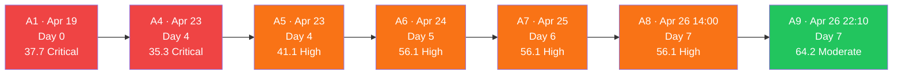
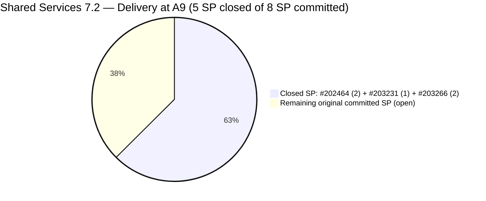
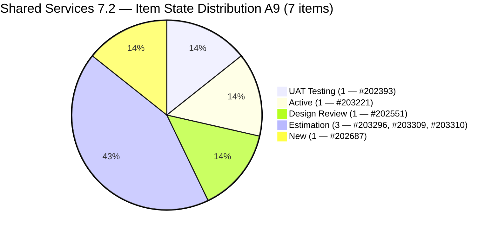
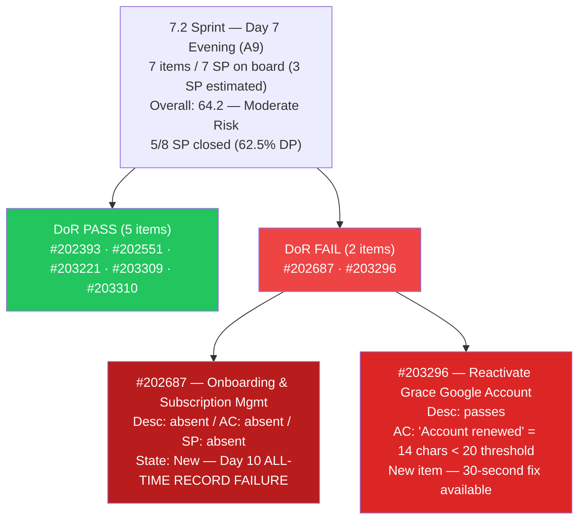
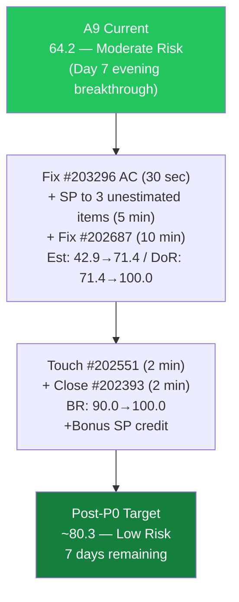
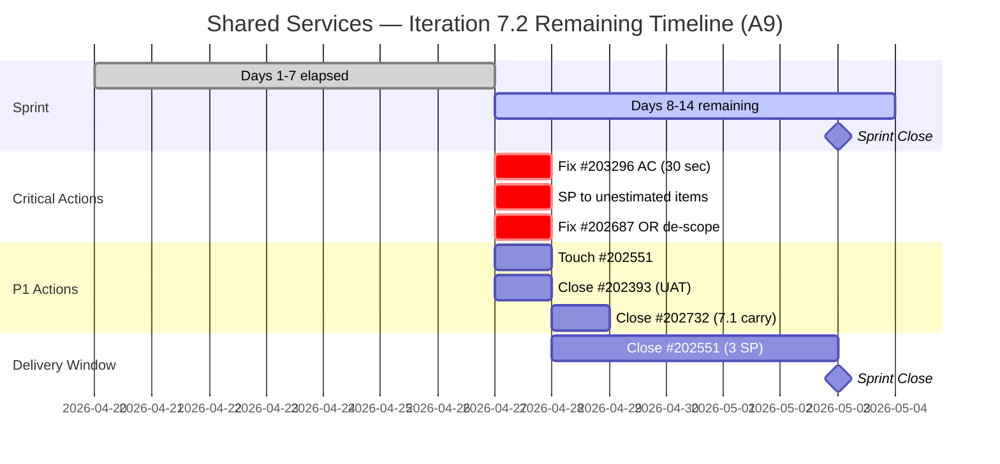

# Shared Services Team — ADO SAFe Iteration Audit

## Audit A9 | Iteration 7.2 (Apr 20 – May 3, 2026) | Day 7 of 14 (Evening)

---

## 1. Audit Metadata

| Field | Value |
|-------|-------|
| **Audit Number** | A9 (Shared Services series) |
| **Audit Date** | April 26, 2026, 22:10 PHT |
| **Auditor** | Claude Code ADO SAFe Audit Agent |
| **Workspace** | `ado_shared` |
| **ADO Project** | Jairosoft Portfolio (`666bb99a-6acd-4999-bb34-efd0e4ea90dc`) |
| **Team** | Shared Services Team (`bd9578fd-5773-48fc-bd80-988dfe5de806`) |
| **Iteration** | Iteration 7.2 — Apr 20 to May 3, 2026 |
| **Iteration ID** | `8edbe25f-fa4f-41b2-aaae-f3d5cf0e5b33` |
| **Iteration Path** | `Jairosoft Portfolio\2026-PI7\Iteration 7.2` |
| **Sprint Day** | Day 7 of 14 (50% elapsed — sprint midpoint, evening session) |
| **Prior Audit** | `AUDIT_20260426_1400.md` (A8, 7.2 Day 7 14:00 PHT, Overall 56.1 — High Risk) |
| **Scoring Model** | ADO SAFe v1 (7-dimension rubric) |
| **Scoped Backlog** | `Microsoft.RequirementCategory` (board focus: `Stories`) |
| **Data Source** | Live ADO read — 2026-04-26 22:10 PHT |
| **Overall Score** | **64.2 / 100** |
| **Risk Band** | **Moderate Risk** (60–79.9) |

---

## 2. Executive Summary

Shared Services Team improves from **56.1 → 64.2 (+8.1 points)** — breaking out of High Risk into **Moderate Risk** for the first time in the 7.2 sprint series. This is the largest single-session gain in the team's A1–A9 audit history.

**What changed (significant sprint activity since A8 at 14:00 PHT):**

1. **#202464 and #203231 closed** — Both items disappeared from the backlog, confirming closure. #202464 (2 SP Enabler, "Auto Allies Blocker") and #203231 (1 SP Enabler, "Enforce One-Reviewer Approval Rule") were at Passed UAT Testing for 4 days. Their closure credits **3 SP** against the committed total and removes 2 DoR failures from the denominator. This was the **primary P0 action from A8**.

2. **#203266 closed** — "JIT Machines Setup and Preparation" (2 SP Enabler, Teofilo) also closed, adding 2 SP credit. Total confirmed closed: **5 SP**.

3. **#202393 "Branch Protection & Enforcement AutoAllies in Github"** — Moved to iteration 7.2 and advanced to **UAT Testing** state. SP=2 confirmed. This item was previously tracked in the backlog without a 7.2 assignment.

4. **Three new 7.2 items added** — The team added scope during Day 7:
   - **#203296** "Reactivate Grace Google Account and Successfully Transfer Files to Microsoft" (Enabler, Teofilo, Estimation state, no SP)
   - **#203309** "GitHub token degraded since Apr 21..." (Defect, Ramon, Estimation state, no SP)
   - **#203310** "jit.edu.ph Domain Renewal" (Enabler, Teofilo, SP=2, Estimation state)

5. **Ramon added to capacity** — Now configured at 0.5h/day (Requirements). Total capacity participants: 4 (Teofilo 6h, Vicsante 6h, Jaszmeine 3h, Ramon 0.5h).

**What still needs attention:**
- **#202687** remains title-only with zero content for **10 days** — the most critical unresolved issue.
- **#202551** remains untouched since Apr 17 — 9 days. Both sustain a Backlog Refinement penalty.
- **#203296 and #203309** are new to the sprint without Story Points.
- **#203221 (Spike)** still has no Story Points.
- Estimation dropped from 66.7 → 42.9 due to 3 new unestimated items added mid-sprint.

---

## 3. Previous Audit Delta

| Dimension | A8 — 7.2 Day 7 14:00 PHT | A9 — 7.2 Day 7 22:10 PHT | Delta |
|-----------|--------------------------|--------------------------|-------|
| Iteration Planning | 19.4 | **22.6** | **+3.2** |
| Team Capacity | 100.0 | **100.0** | 0.0 |
| Estimation | 66.7 | **42.9** | **−23.8** |
| DoR Compliance | 66.7 | **71.4** | **+4.7** |
| Work Item Balance | 60.0 | **60.0** | 0.0 |
| Backlog Refinement | 80.0 | **90.0** | **+10.0** |
| Delivery Predictability | 0.0 | **62.5** | **+62.5** |
| **Overall** | **56.1** | **64.2** | **+8.1** |

### Key changes since A8 (14:00 PHT Apr 26 → 22:10 PHT Apr 26)

| Item | Change | Impact |
|------|--------|--------|
| **#202464** | **Closed** (removed from backlog). Was Passed UAT Testing, 2 SP. | +2 SP delivery credit; DoR failure removed from denominator |
| **#203231** | **Closed** (removed from backlog). Was Passed UAT Testing, 1 SP. | +1 SP delivery credit; DoR pass removed from denominator |
| **#203266** | **Closed** (removed from backlog). Was Active, 2 SP. | +2 SP delivery credit |
| **#202393** | **Added to 7.2**, advanced to **UAT Testing**. SP=2, Teofilo. | New 7.2 item; contributes to DP base |
| **#203296** | **New 7.2 item added** (Enabler, Teofilo, Estimation, no SP). | Estimation gap +1; untouched-current: Apr 27 date |
| **#203309** | **New 7.2 item added** (Defect, Ramon, Estimation, no SP). | Estimation gap +1; DoR PASS |
| **#203310** | **New 7.2 item added** (Enabler, Teofilo, SP=2, Estimation). | DoR PASS; estimation covered |
| **#202687** | No change. Title-only, unchanged since Apr 17. | DoR FAIL + Estimation gap — **Day 10** |
| **#202551** | No change. Unchanged since Apr 17. | Untouched-current — **Day 9** |
| **#203221** | No change. Active, no SP. | Estimation gap — Day 4 Active |
| **Ramon** | Added to team capacity (0.5h/day, Requirements). | Contributors with capacity: 3→4 |

---

## 4. Current Iteration Snapshot

### Iteration

| Field | Value |
|-------|-------|
| Name | Iteration 7.2 |
| Path | `Jairosoft Portfolio\2026-PI7\Iteration 7.2` |
| Dates | April 20 – May 3, 2026 (14 days) |
| Day | 7 of 14 — 50% elapsed (sprint midpoint evening) |
| Days Remaining | 7 |

### Contributors — current iteration (A9)

| Contributor | Email | Items Assigned | Capacity Configured |
|-------------|-------|----------------|---------------------|
| Teofilo Limpag | `tfllmpg@jairosoft.com` | 3 (#202393, #203296, #203310) | 6h/day — Development |
| Jaszmeine Abigaille Villanueva | `jvillanueva@jairosoft.com` | 2 (#202551, #202687) | 3h/day — Design |
| Vicsante Aseniero | `vaseniero@jairosoft.com` | 1 (#203221) | 6h/day — Development |
| RAMON ASENIERO JR | `ramon@jairosoft.com` | 1 (#203309) | 0.5h/day — Requirements |

> Total configured capacity: 15.5h/day. All 4 contributors have capacity. Ramon added to both sprint scope and capacity this session.

### Current iteration root items (7 items — A9)

| ID | Type | State | SP | Title | Assignee | Last Changed | DoR |
|----|------|-------|----|-------|----------|--------------|-----|
| #202393 | Enabler | UAT Testing | 2 | Branch Protection & Enforcement AutoAllies in Github | Teofilo | Apr 27, 01:46 | PASS |
| #202551 | Design | Design Review | 3 | Bride Account Management | Jaszmeine | **Apr 17** ⚠ | PASS |
| #202687 | Design | New | — | Onboarding & Subscription Management | Jaszmeine | **Apr 17** ⚠ | **FAIL** (title-only) |
| #203221 | Spike | Active | — | Claude Partner Network Learning Path | Vicsante | Apr 24 | PASS |
| #203296 | Enabler | Estimation | — | Reactivate Grace Google Account and Transfer Files to Microsoft | Teofilo | Apr 27, 02:01 | **FAIL** (AC < 20 chars) |
| #203309 | Defect | Estimation | — | GitHub token degraded since Apr 21... | Ramon | Apr 27, 01:52 | PASS |
| #203310 | Enabler | Estimation | 2 | jit.edu.ph Domain Renewal | Teofilo | Apr 27, 02:01 | PASS |

> ⚠ Items last changed Apr 17 predate sprint start (Apr 20) — classified as untouched-current.

### Closed this session (confirmed absent from backlog)

| ID | Type | SP | Title | Assignee | Action |
|----|------|----|-------|----------|--------|
| #202464 | Enabler | 2 | Auto Allies Blocker | Teofilo | **Closed** (was Passed UAT Testing 4 days) |
| #203231 | Enabler | 1 | Enforce One-Reviewer Approval Rule on GitHub PRs | Teofilo | **Closed** (was Passed UAT Testing 4 days) |
| #203266 | Enabler | 2 | JIT Machines Setup and Preparation | Teofilo | **Closed** (was Active) |

---

## 5. Work Item Analysis

### 5.1 Visible Root Backlog Summary

| Cohort | Count | Notes |
|--------|-------|-------|
| **Total visible root items** | **31** | Same count; 3 closed + 3 new items (net zero change) |
| Current iteration (7.2) | 7 | Was 6 in A8; +#202393 moved in, +3 new, -3 closed |
| Iteration 7.1 (carry) | 1 | #202732 (Enabler, Ready for UAT) — still unresolved carry |
| Iteration 7.3 | 3 | #202553 (Design), #202724 (Design), #202807 (Spike) |
| Iteration 7.6 (IP) | 1 | #202947 (Spike, Teofilo) |
| PI7 parent (no sub-iter) | 11 | #202059–#202071 (Estimation-state User Stories, Vicsante) |
| PI6 paths | 6 | #196007 (6.1), #200807–#200809 (6.5), #201161 (PI6), #201170 (6.6-IP) |
| Portfolio root | 2 | #186848 (New), #201919 (Active, Vicsante) |

### 5.2 Type Distribution — Current 7.2 Items (7 items)

| Type | Count | Share |
|------|-------|-------|
| Enabler | 3 | 42.9% |
| Design | 2 | 28.6% |
| Spike | 1 | 14.3% |
| Defect | 1 | 14.3% |
| User Story | 0 | 0% |

- User Story count = 0 → **−40 penalty**
- Dominant type = Enabler at 42.9% — NOT >60% → no −30
- Spike share = 1/7 = 14.3% — NOT >40% → no −20
- Work Item Balance = max(0, 100 − 40) = **60.0** (unchanged)

### 5.3 State Distribution — Current 7.2 Items (7 items)

| State | Count | SP |
|-------|-------|----|
| New | 1 | 0 (#202687 — unestimated) |
| Estimation | 3 | 0+0+2 (#203296 unest., #203309 unest., #203310=2) |
| Design Review | 1 | 3 (#202551) |
| Active | 1 | 0 (#203221 unestimated) |
| UAT Testing | 1 | 2 (#202393) |
| Closed / Done | 0 | 0 (3 items closed this session — off board) |

No items at "Passed UAT Testing" blocking closure (the old 2 items from A8 are now closed).

### 5.4 DoR Verification — Live Read Apr 26 22:10 PHT

| ID | Description | AC | DoR |
|----|-------------|-----|-----|
| #202393 | "As a Jairossoft DevOps Engineer... I want to implement Branch Protection..." (~160 non-ws chars) ✓ | Detailed 6-bullet AC (~350+ non-ws chars) ✓ | **PASS** |
| #202551 | "Feature 201141: Bride Account Management" (~33 non-ws chars) ✓ | 5 linked User Story titles (~50+ non-ws chars) ✓ | **PASS** |
| #202687 | **Absent — 0 chars** | **Absent — 0 chars** | **FAIL (title-only — Day 10)** |
| #203221 | "Taking this first step toward partnership with Anthropic..." (~120 non-ws chars) ✓ | 4 named courses (~60 non-ws chars) ✓ | **PASS** |
| #203296 | "Reactivate Grace Google Account and Successfully Transfer Files to Microsoft" + bullet ✓ (~75 chars) | "Account renewed" = **14 non-ws chars < 20** | **FAIL (AC too short)** |
| #203309 | Very detailed description (~200+ non-ws chars) ✓ | 7 detailed AC bullets (~300+ non-ws chars) ✓ | **PASS** |
| #203310 | "As a DevOps Infrastructure Lead, I want to facilitate the timely renewal of jit.edu.ph domain..." (~120 non-ws chars) ✓ | 6 detailed checkbox AC items ✓ | **PASS** |

DoR pass rate: **5/7 = 71.4%** (was 66.7 in A8).

> **#202687** holds the team record for longest unresolved DoR failure — now **10 consecutive days** including 7 sprint days. **#203296** is a new DoR failure: AC "Account renewed" is 14 non-whitespace characters, below the 20-char threshold. A one-sentence AC expansion would resolve this immediately.

### 5.5 Backlog Age Analysis (today = 2026-04-26)

| Bucket | Threshold | Count | Share |
|--------|-----------|-------|-------|
| Fresh (within 45 days) | ChangedDate ≥ 2026-03-12 | 31 | 100% |
| Stale ≥ 90 days | ChangedDate before 2026-01-26 | 0 | 0% |
| Stale ≥ 180 days | ChangedDate before 2025-10-29 | 0 | 0% |
| **Untouched current items** | ChangedDate < 2026-04-20 | **2** (#202551 Apr 17, #202687 Apr 17) | **2/7 = 28.6%** |

**Untouched ratio dropped from 33.3% (A8) → 28.6% (A9)** because the denominator grew from 6 → 7 sprint items. The 3 new items (#203296, #203309, #203310) all have ChangedDate = Apr 27, well above the sprint start threshold.

With 28.6% > 10% but < 30%: Backlog Refinement penalty is **−10** (not −20 as in A8).

### 5.6 Estimation Analysis

| ID | Type | SP | Point-Eligible | Estimated |
|----|------|----|----------------|-----------|
| #202393 | Enabler | 2 | Yes | **Yes** |
| #202551 | Design | 3 | Yes | **Yes** |
| #202687 | Design | — | Yes | **No** |
| #203221 | Spike | — | Yes | **No** |
| #203296 | Enabler | — | Yes | **No** |
| #203309 | Defect | — | Yes | **No** |
| #203310 | Enabler | 2 | Yes | **Yes** |
| **Totals** | | **7 SP on board** | 7 | **3** |

Three items estimated out of 7 point-eligible = **3/7 = 42.9%**. This is a **regression from A8's 66.7%** caused by the addition of three new unestimated items (#203296, #203221 still no SP, #203309). The team should size all new items within 24 hours of sprint commitment.

> **Committed SP context:** Sprint started with 8 SP committed (A8 baseline: #202464=2, #202551=3, #202687=0, #203221=0, #203231=1, #203266=2). Three items closed for 5 SP credit = 5/8 = 62.5% Delivery Predictability.

### 5.7 Delivery Confirmation

Items not appearing in the backlog API response (confirmed closed/done):

| ID | Title | SP | Evidence |
|----|-------|----|---------|
| #202464 | Auto Allies Blocker | 2 | Absent from `wit_list_backlog_work_items` response |
| #203231 | Enforce One-Reviewer Approval Rule on GitHub PRs | 1 | Absent from `wit_list_backlog_work_items` response |
| #203266 | JIT Machines Setup and Preparation | 2 | Absent from `wit_list_backlog_work_items` response |

Total closed SP: **5 SP** / Original committed SP: **8 SP** = **62.5% Delivery Predictability**.

> Note: If #202393 (2 SP, now UAT Testing) also closes before sprint end, the committed SP base would need to be evaluated on whether it was in-scope at sprint planning. Conservative approach: maintain 8 SP committed base from sprint planning; count only items that were sprint-committed at Apr 20 for the denominator.

---

## 6. SAFe Compliance Scorecard

| Dimension | Score | Evidence | Notes |
|-----------|-------|----------|-------|
| Iteration Planning | **22.6** | 7 current / 31 visible root | Was 19.4; +1 sprint item (#202393 moved to 7.2) |
| Team Capacity | **100.0** | 4/4 contributors configured (Teofilo 6h, Vicsante 6h, Jaszmeine 3h, Ramon 0.5h) | Ramon added this session |
| Estimation | **42.9** | 3/7 point-eligible items estimated | Was 66.7; regression — 3 new unestimated items added |
| DoR Compliance | **71.4** | 5/7 items pass Desc ≥30 AND AC ≥20 | Was 66.7; #202687 persists (Day 10); #203296 new FAIL (AC < 20) |
| Work Item Balance | **60.0** | No User Story (−40); Enabler 42.9% < 60% (no −30); Spike 14.3% < 40% (no −20) | Structural -40 penalty unchanged |
| Backlog Refinement | **90.0** | 31/31 fresh; 0 stale; 2 untouched-current (2/7=28.6% > 10% → −10) | Was 80.0; improved — denominator grew, penalty reduced from -20 to -10 |
| Delivery Predictability | **62.5** | 5 SP closed / 8 SP committed | Was 0.0; **+62.5 pts** — #202464, #203231, #203266 all closed this session |
| **Overall** | **64.2** | (22.6+100.0+42.9+71.4+60.0+90.0+62.5)/7 | **Moderate Risk** (60–79.9) — breakthrough from High Risk |

### Score Computation Detail

```
1. Iteration Planning
   visible_root_backlog_items          = 31
   current_iteration_root_items (7.2)  = 7
   Score = round(7 / 31 × 100, 1)     = 22.6
   Delta from A8: +3.2 (#202393 moved into 7.2; net 6 → 7 current items)

2. Team Capacity
   contributors_with_current_work      = 4 (Teofilo, Jaszmeine, Vicsante, Ramon)
   contributors_with_capacity          = 4 (all configured)
   Score = round(4 / 4 × 100, 1)      = 100.0

3. Estimation
   point_eligible_current_items        = 7 (all types count as point-eligible)
   estimated_current_items (SP > 0)    = 3 (#202393=2, #202551=3, #203310=2)
   Score = round(3 / 7 × 100, 1)      = 42.9
   Delta from A8: −23.8 (3 new unestimated items added; old estimated items closed)

4. DoR Compliance
   current_iteration_root_items        = 7
   dor_compliant_current_items         = 5
   (#202687: FAIL title-only; #203296: FAIL AC "Account renewed" = 14 chars < 20)
   Score = round(5 / 7 × 100, 1)      = 71.4
   Delta from A8: +4.7 (#202464 image-only Desc removed from denom; #203309+#203310 pass)

5. Work Item Balance
   User Story items in 7.2             = 0 → −40
   dominant_type_share                 = Enabler 42.9% — not >60% → no −30
   spike_share                         = 1/7 = 14.3% — not >40% → no −20
   Score = max(0, 100 − 40)           = 60.0

6. Backlog Refinement
   fresh_visible_root_items            = 31 (all ≥ Apr 15 > Mar 12 threshold)
   base = round(31 / 31 × 100, 1)     = 100.0
   stale_90 = 0                        → no penalty
   stale_180 = 0                       → no penalty
   untouched_current (ChangedDate < Apr 20) = 2 (#202551 Apr 17, #202687 Apr 17)
   untouched/current = 2/7 = 28.6%
   28.6% > 10% but < 30%              → −10 penalty (was −20 in A8 when 33.3% > 30%)
   Score = max(0, 100.0 − 10)         = 90.0

7. Delivery Predictability
   committed_story_points at sprint start = 8 SP
   (A8 baseline: #202464=2, #202551=3, #202687=0, #203221=0, #203231=1, #203266=2)
   closed_story_points                 = 5 SP (#202464=2, #203231=1, #203266=2)
   Score = round(5 / 8 × 100, 1)      = 62.5
   Delta from A8: +62.5

Overall = round((22.6 + 100.0 + 42.9 + 71.4 + 60.0 + 90.0 + 62.5) / 7, 1)
        = round(449.4 / 7, 1)
        = 64.2  →  MODERATE RISK (60–79.9)
```

---

## 7. Dimension Findings

### 7.1 Iteration Planning — 22.6 (Slightly improved; structural ceiling unchanged)

7/31 visible items are now in 7.2 (was 6/31 = 19.4%). #202393 was added to 7.2 this session. The structural ceiling remains defined by 11 PI7-parent User Stories (#202059–#202071) in Estimation state without sub-iteration assignment. PI-level grooming is required to meaningfully move this dimension.

### 7.2 Team Capacity — 100.0 (Maintained; Ramon added)

Four contributors now configured. Ramon (0.5h/day Requirements) has been added both to capacity and to sprint scope (#203309). Total capacity: 15.5h/day. This is the most contributor coverage in the team's 7.2 sprint history.

**Critical forward note:** Renew ADO capacity entries for Iteration 7.3 (starts May 4) to maintain this score.

### 7.3 Estimation — 42.9 (REGRESSION — 3 new unestimated items added mid-sprint)

The Estimation dimension dropped sharply from 66.7 → 42.9 due to three new items added to 7.2 without Story Points:

- **#203221 (Spike)** — Active for 4 days with no SP. This was already flagged in A8.
- **#203296 (Enabler)** — Newly added. No SP. "Reactivate Grace Google Account and Transfer Files to Microsoft."
- **#203309 (Defect)** — Newly added. No SP. GitHub token degradation.

**#203310** was correctly added with SP=2. All three new items need Story Points within 24 hours to prevent continued drag.

> **Policy note:** Per SAFe, sprint commitment requires all items to be estimated before sprint inclusion. Adding unestimated items mid-sprint violates this principle and mechanically depresses the Estimation dimension.

### 7.4 DoR Compliance — 71.4 (Improved by composition change; two new issues)

DoR improved from 66.7 → 71.4, driven by the favorable composition change (closing of #202464 with image-only Desc, replaced by #203309 and #203310 which pass). However, two failures persist:

**#202687 — "Onboarding & Subscription Management" — FAIL (Day 10)**
This is the longest continuously unresolved DoR failure in Shared Services sprint history. The item has been in New state with zero content since Apr 17 — 3 days before sprint start. With 7 days remaining, de-scoping to 7.3 should be considered if no content is added by Day 8.

**#203296 — "Reactivate Grace Google Account and Transfer Files to Microsoft" — FAIL (new — Day 1)**
- Description: Passes (~75 chars) ✓
- AC: "Account renewed" = **14 non-whitespace characters** — fails the 20-char minimum by 6 chars.
- Fix time: ~30 seconds. Suggested AC expansion: *"Grace's Google account is reactivated, all target files successfully transferred to Microsoft 365, and migration verified with no data loss."*

### 7.5 Work Item Balance — 60.0 (Structural; no change expected this sprint)

Zero User Stories in 7.2. The −40 penalty persists. Adding a User Story mid-sprint would immediately improve this score (+5.7 pts overall) but is not expected within 7.2.

### 7.6 Backlog Refinement — 90.0 (Improved; penalty reduced from −20 to −10)

The untouched-current ratio improved from 33.3% (2/6 in A8) → 28.6% (2/7 in A9) as the denominator grew with new sprint items. This threshold crossed below 30%, reducing the penalty from −20 → −10. Score: 100.0 − 10 = 90.0.

**The two untouched items (#202551 and #202687) persist at Apr 17 — now 9 days before today.** If either receives any ADO update (comment, status, field change), the ratio drops to 1/7 = 14.3% (still >10%, -10 penalty). If both are touched, ratio → 0/7 → 0% (no penalty, score → 100.0).

### 7.7 Delivery Predictability — 62.5 (BREAKTHROUGH — first SP credit in 7.2 series)

**5 SP closed / 8 SP committed = 62.5%.** This is the first delivery credit in the Shared Services 7.2 sprint and represents a dramatic recovery from 0.0 (7 consecutive days at zero). Three items were closed:

- **#202464 (2 SP):** Closed after 4 days at Passed UAT Testing. P0 action from A8 completed.
- **#203231 (1 SP):** Closed after 4 days at Passed UAT Testing. P0 action from A8 completed.
- **#203266 (2 SP):** Closed while Active. Teofilo's third item closed this session.

**Remaining path to 100% Delivery Predictability on original commitment:**
- Need to close 3 more SP from the original 8 SP scope.
- Of the original items still open: #202551 (3 SP, Design Review) and #202687 (0 SP, New).
- If #202551 closes: 5+3=8 SP → **100.0%** on original commitment.
- If #202687 closes (even without SP=0): No change to DP.

**New items (#202393, #203296, #203309, #203310)** were not committed at sprint planning. Per SAFe, Delivery Predictability is measured against sprint planning commitment. These items do not count toward the denominator but their closure would represent sprint bonus delivery.

---

## 8. Risks and Bottlenecks

| Priority | Risk | Impact | Age | Status vs A8 |
|----------|------|--------|-----|--------------|
| **P0** | **#202687 title-only — 10 days, all-time record; 7 sprint days** | DoR + Estimation + BR all impacted | 10 days | **CRITICAL — Day 10** |
| **P0** | **3 new unestimated items (#203296, #203309, #203221) — Estimation drops to 42.9%** | Estimation regression of -23.8 pts | New | **New regression this session** |
| **P0** | **#203296 AC < 20 chars — new DoR failure** | DoR capped at 71.4% | New | **New failure this session** |
| **P1** | **#202551 untouched since Apr 17 (9 days)** | BR -10 penalty (28.6% > 10%) | 9 days | Persists from A8 |
| **P1** | **#202393 at UAT Testing — closure pending** | Bonus SP credit available | New | Close to unlock credit |
| **P1** | **#202732 (7.1 carry, Ready for UAT) — 10+ days unresolved** | Board noise | 10+ days | Unchanged |
| **P2** | **11 PI7-parent User Stories not sub-iterated** | Iteration Planning structural ceiling | Ongoing | Structural |
| **P2** | **#202687 de-scope candidate** | If not fixed by Day 8, high carry risk | 10 days | Escalated |
| **P3** | **No User Story in current sprint** | Work Item Balance capped at 60.0 | Structural | Unchanged |
| **P3** | **No sprint goal for Iteration 7.2** | PI alignment not assessable | 7 days | Persistent |

---

## 9. Prioritized Recommendations

### P0 — TODAY / Day 8 (Apr 26–27)

1. **[< 30 sec] Fix #203296 AC.** Current: "Account renewed" (14 chars). Required: ≥ 20 non-whitespace chars.
   - Suggested expansion: *"Grace's Google account is reactivated, target files successfully transferred to Microsoft 365, and migration verified with no data loss."*
   - Impact: DoR 71.4 → 85.7 (+2.0 pts overall)

2. **[< 5 min] Add SP to #203296 and #203309.**
   - #203296 (Reactivate Google Account): Suggest SP=1
   - #203309 (GitHub token fix): Suggest SP=1
   - Impact: Estimation 42.9 → 57.1 (still poor, but directional improvement)

3. **[< 5 min] Add SP to #203221 (Claude Partner Network — Spike, Active).**
   - Still unestimated after 4 days Active. Suggest SP=1–2.
   - Impact: Estimation would be 4/7 = 57.1 (combined with above)

4. **[< 10 min] Add Description + AC + SP to #202687 OR de-scope to 7.3.**
   - 10 days with zero content. If no content by Day 8, move to 7.3.
   - Impact if fixed: DoR 71.4 → 85.7 (combined with #203296 fix above)

5. **[< 2 min] Close #202393 (Branch Protection, 2 SP, UAT Testing).**
   - At UAT Testing already. This item was added to 7.2 and advanced today.
   - Impact: Bonus SP credit; though not in original committed base, closing is clean hygiene.

### P1 — Before Day 10 (Apr 29)

1. **Touch #202551 (Bride Account Management).** Any ADO update resets ChangedDate. Combined with #202687 fix → BR untouched ratio 0/7 = 0% → no penalty → Backlog Refinement 90.0 → 100.0 (+1.4 pts overall).
2. **Confirm #202551 progress.** Still in Design Review since Apr 17 (9 days). Has Jaszmeine started the review? SP=3 — closing this delivers the largest remaining SP credit.
3. **Close #202732 (7.1 carry, Ready for UAT, 1 SP).** This has been in Ready for UAT for 10+ days. Close or escalate.

### P0 combined score impact table

| Action | Dimension | Current | After | Delta |
|--------|-----------|---------|-------|-------|
| Fix #203296 AC | DoR | 71.4 | 85.7 | +14.3 |
| SP to #203296 + #203309 + #203221 | Estimation | 42.9 | 57.1 | +14.2 |
| Fix #202687 Desc+AC+SP | DoR + Estimation | 85.7 / 57.1 | 100.0 / 71.4 | +14.3 / +14.3 |
| Touch #202551 + fix #202687 | Backlog Refinement | 90.0 | 100.0 | +10.0 |
| **Overall after all P0+P1 actions** | — | **64.2** | **~80.3** | **~+16.1** |

### P2 — Sprint Review / PI-Level

1. **Establish a sprint-commitment policy** requiring all items to be estimated before being added to 7.2 scope. Three unestimated items were added mid-sprint this session — this is the root cause of the Estimation regression.
2. **Sub-iterate the 11 PI7-parent User Stories** to 7.3–7.5. Moves Iteration Planning ceiling toward 30%.
3. **Renew capacity for Iteration 7.3** on May 3 sprint close.
4. **Define a sprint goal for 7.2.** Still absent across all 9 Shared Services audits.

---

## 10. Evidence Gaps and Limitations

| Gap | Impact | Severity | Notes |
|-----|--------|----------|-------|
| **Closure inference for #202464, #203231, #203266** | Items absent from backlog API = confirmed Done/Closed. No direct state field shown. | Medium — strong inference; backlog API excludes closed items | 5 SP delivery credit dependent on this inference |
| **#202393 sprint planning status** | Item was added to 7.2 and moved to UAT Testing during Day 7. Not part of original sprint commitment. | Low — bonus delivery if closed; not counted in DP denominator | |
| **#203296 SP and AC** | AC currently 14 chars; no SP. Newly added item. | Medium — 30-second fix resolves DoR; SP sizing needed | |
| **#202687 content** | Title-only for 10 days; still in New state. Real-world design status unknown. | High — most critical DoR failure | De-scope to 7.3 if no content by Day 8 |
| **Ramon capacity addition** | Ramon added at 0.5h/day. Item #203309 (GitHub token fix) assigned. Whether this is new work or a previously off-board item is unclear. | Low | |
| **No sprint goal** | PI alignment not assessable. Persistent across all 9 Shared Services audits. | Low | |

---

## 11. Visualizations

### 11.1 Score Trend — Shared Services Iteration 7.2 Audit Series (A1 → A9)



### 11.2 Delivery Predictability Breakthrough — Sprint Cumulative SP



### 11.3 Current Sprint Item State Distribution (7 items)



### 11.4 DoR Status — Sprint Items (A9)



### 11.5 Score Improvement Path — A9 to Target



### 11.6 Sprint Timeline — Remaining Days



---

*Audit A9 — Shared Services Team — Iteration 7.2 Day 7 (Evening) — April 26, 2026 22:10 PHT*
*Auditor: Claude Code (`ado-safe-audit` skill, claude-sonnet-4-6)*
*Data currency: Live ADO read via agent — 2026-04-26 22:10 PHT*
*Prior audit: AUDIT_20260426_1400.md (A8, Overall 56.1 High Risk)*
*Key event: 3 items closed (5 SP delivered); 3 new items added. Score: 56.1 → 64.2 (+8.1). Risk band: High → Moderate.*
