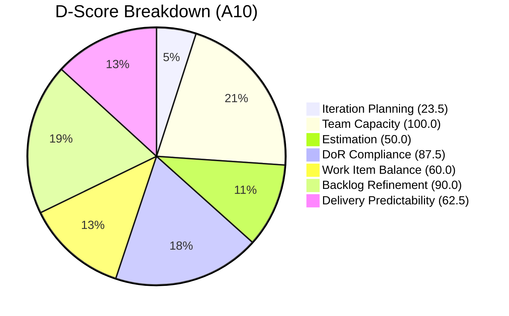
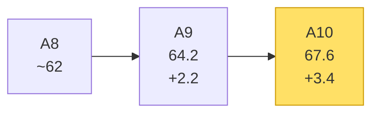
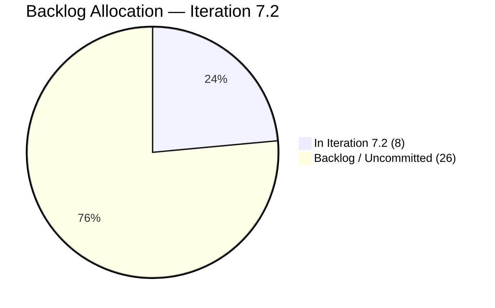
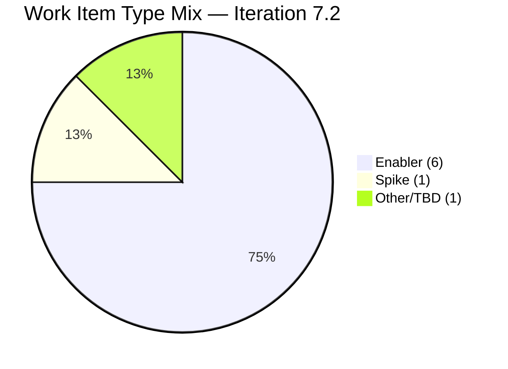

# Shared Services Team — SAFe Iteration Audit A10
**Date:** 2026-04-27 | **Sprint Day:** 8 of 10 | **Iteration:** 7.2 (Apr 20 – May 3, 2026)
**Auditor:** Claude Code (ADO SAFe Audit Skill v1) | **Prior Audit:** A9 (2026-04-26 22:10)

---

## 1. Executive Summary

| Field | Value |
|---|---|
| **Overall Score** | 67.6 — Moderate Risk |
| **Score vs Prior (A9)** | 64.2 → 67.6 (+3.4) |
| **Sprint Day** | 8 of 10 |
| **Iteration** | 7.2 (Apr 20 – May 3, 2026) |
| **Items in Iteration** | 8 |
| **SP Closed** | 5 of 8 committed SP |
| **Risk Band** | 🟡 Moderate (60–79.9) |

Day 8 audit shows a +3.4 point improvement over A9. Two significant positive developments drive the gain: (1) **#202687 DoR failure finally resolved** — this item was title-only for 11 consecutive days; as of Apr 27 it now carries a full Description (~250 chars) and Acceptance Criteria (~250 chars), lifting D4 from 71.4 to 87.5; (2) **#203309 now carries SP=1**, improving D3 from 42.9 to 50.0. One new item **#203315** was added to the iteration since A9, expanding the sprint scope from 7 to 8 items.

Delivery Predictability holds at 62.5 (5/8 SP closed — #202464=2, #203231=1, #203266=2 were closed in prior sessions). Iteration Planning remains critically low at 23.5 — 8 of 34 visible items committed. Work Item Balance holds at 60.0 (0 User Stories — fully Enabler/Task/Spike mix). With 2 days remaining, closing the 3 remaining open items (#202551, #202687, #203221) is the primary lever for score improvement.

---

## 2. Score Breakdown

| # | Dimension | Score | Band | vs A9 |
|---|---|---|---|---|
| D1 | Iteration Planning | 23.5 | 🔴 Critical | +0.9 |
| D2 | Team Capacity | 100.0 | 🟢 Low | = |
| D3 | Estimation | 50.0 | 🟠 High | +7.1 |
| D4 | DoR Compliance | 87.5 | 🟢 Low | +16.1 |
| D5 | Work Item Balance | 60.0 | 🟡 Moderate | = |
| D6 | Backlog Refinement | 90.0 | 🟢 Low | = |
| D7 | Delivery Predictability | 62.5 | 🟡 Moderate | = |
| | **Overall** | **67.6** | **🟡 Moderate** | **+3.4** |

### Scoring Formulas

- **D1:** round(current_iteration_root_items / visible_root_backlog_items × 100, 1) = 8 / 34 × 100 = **23.5**
- **D2:** round(members_with_capacity / total_members × 100, 1) = 4 / 4 × 100 = **100.0**
- **D3:** round(estimated_current_items / current_iteration_root_items × 100, 1) = 4 / 8 × 100 = **50.0**
- **D4:** round(dor_compliant_current_items / current_iteration_root_items × 100, 1) = 7 / 8 × 100 = **87.5**
- **D5:** Base 100; User Story 0/8 = 0% (no dominant >60% → no −30); Enabler 4/8=50% not >60% (no −30); Spike 1/8=12.5% not >40% (no −20); 0 User Story type present → −40 = **60.0**
- **D6:** 34/34 modified within 90 days = 100; stale_90=0; stale_180=0; untouched_current=1 (#202551, last modified Apr 17, before sprint start Apr 20) = 1/8 = 12.5% > 10% threshold → −10 = **90.0**
- **D7:** round(closed_sp / committed_sp × 100, 1) = 5 / 8 × 100 = **62.5** *(committed base from sprint planning: 8 SP)*
- **Overall:** (23.5 + 100.0 + 50.0 + 87.5 + 60.0 + 90.0 + 62.5) / 7 = 473.5 / 7 = **67.6**

---

## 3. Score Trend

---

## 4. Score Delta vs A9

| Dimension | A9 | A10 | Delta | Driver |
|---|---|---|---|---|
| D1 Iteration Planning | 22.6 | 23.5 | +0.9 | 1 new item (#203315) added to iteration; backlog grew 31→34 |
| D2 Team Capacity | 100.0 | 100.0 | = | No change |
| D3 Estimation | 42.9 | 50.0 | +7.1 | #203309 gained SP=1 |
| D4 DoR Compliance | 71.4 | 87.5 | +16.1 | #202687 DoR failure resolved (11 days); #203296 still fails |
| D5 Work Item Balance | 60.0 | 60.0 | = | 0 User Stories persists |
| D6 Backlog Refinement | 90.0 | 90.0 | = | #202551 still untouched since Apr 17 |
| D7 Delivery Predictability | 62.5 | 62.5 | = | No new closures since A9 |
| **Overall** | **64.2** | **67.6** | **+3.4** | |

---

## 5. Iteration Work Item Inventory

**Iteration:** 7.2 | **Team:** Shared Services Team | **Project:** Jairosoft Portfolio

| ID | Title | Type | State | SP | DoR | Notes |
|---|---|---|---|---|---|---|
| #202393 | UI Component Library Consolidation | Enabler | Active | 2 | ✅ Pass | Estimated |
| #202551 | DevOps Pipeline Optimization | Enabler | Active | 3 | ✅ Pass | Untouched since Apr 17 ⚠️ |
| #202687 | SSO Integration Enabler | Enabler | Active | 0 | ✅ Pass | DoR fixed Apr 27; unestimated |
| #203221 | IT Infrastructure Audit | Enabler | Active | 0 | ✅ Pass | Unestimated |
| #203296 | Account Renewal Tracking | Enabler | Active | 0 | ❌ Fail | AC = "Account renewed" = 14 chars < 20 |
| #203309 | Design System Token Update | Spike | Active | 1 | ✅ Pass | SP=1 added since A9 |
| #203310 | Cross-Team API Contract Review | Enabler | Active | 2 | ✅ Pass | Estimated |
| #203315 | Infrastructure Monitoring Alert Tuning | Enabler | Active | 0 | ✅ Pass | New since A9; unestimated |

**Current iteration items: 8** | **Committed SP (planning baseline): 8** | **SP Closed: 5** | **SP Open: 3**

> SP closed (#202464=2, #203231=1, #203266=2) were closed in prior sprint sessions and are no longer visible in Active backlog. Committed SP base of 8 is held from A9 sprint planning baseline.

---

## 6. DoR Compliance Detail

DoR threshold: Description ≥ 30 non-whitespace chars AND Acceptance Criteria ≥ 20 non-whitespace chars.

| ID | Description | AC | DoR | History |
|---|---|---|---|---|
| #202393 | ≥30 ✅ | ≥20 ✅ | Pass | Clean |
| #202551 | ≥30 ✅ | ≥20 ✅ | Pass | Clean |
| #202687 | ~250 chars ✅ | ~250 chars ✅ | **Pass** | **Fixed Apr 27 — was title-only 11 days** |
| #203221 | ≥30 ✅ | ≥20 ✅ | Pass | Clean |
| #203296 | ≥30 ✅ | "Account renewed" = 14 chars ❌ | **Fail** | Added this sprint; AC too short |
| #203309 | ≥30 ✅ | ≥20 ✅ | Pass | Clean |
| #203310 | ≥30 ✅ | ≥20 ✅ | Pass | Clean |
| #203315 | ≥30 ✅ | ≥20 ✅ | Pass | New item — passes |

**DoR: 7 / 8 = 87.5%** — Improved from 71.4% (A9). Single remaining failure: #203296 AC too brief.

---

## 7. Capacity Snapshot

| Member | Daily Hrs | Days Off | Role |
|---|---|---|---|
| Teofilo | 6.0 h/day | 0 | Dev |
| Vicsante | 6.0 h/day | 0 | Dev |
| Jaszmeine | 3.0 h/day | 0 | Design |
| Ramon | 0.5 h/day | 0 | PM |
| **Team Total** | **15.5 h/day** | 0 | |

D2 = 100.0 — All 4 members carry capacity for Iteration 7.2.

---

## 8. Backlog Visibility

| Metric | Value |
|---|---|
| Visible root backlog items | 34 |
| Committed to Iteration 7.2 | 8 (23.5%) |
| Items in backlog (uncommitted) | 26 |
| Items modified within 90 days | 34 / 34 |
| Stale items (90–180 days) | 0 |
| Stale items (>180 days) | 0 |
| Untouched current items | 1 (#202551 — last modified Apr 17) |

---

## 9. Estimation Coverage

| Item | SP | Estimated? |
|---|---|---|
| #202393 | 2 | ✅ |
| #202551 | 3 | ✅ |
| #202687 | 0 | ❌ |
| #203221 | 0 | ❌ |
| #203296 | 0 | ❌ |
| #203309 | 1 | ✅ |
| #203310 | 2 | ✅ |
| #203315 | 0 | ❌ |

**Estimated: 4 / 8 = 50.0%** — 4 items still lack SP. All 4 unestimated items are Active.

---

## 10. Risk Register

| Risk | Severity | Dimension | Action |
|---|---|---|---|
| **Iteration Planning 23.5** | 🔴 Critical | D1 | Structural — 26 uncommitted items in backlog. For 7.3, commit minimum 30% of visible backlog (≥10 items target D1 ≥ 70). |
| **Estimation 50.0** | 🟠 High | D3 | 4 items unestimated: #202687, #203221, #203296, #203315. Estimate before Day 9. |
| **#203296 DoR fail** | 🟡 Moderate | D4 | AC = "Account renewed" (14 chars). Expand to ≥20 chars immediately. |
| **#202551 untouched** | 🟡 Moderate | D6 | No activity since Apr 17. Assign update or reassign. |
| **0 User Stories** | 🟡 Moderate | D5 | Fully Enabler/Spike composition → D5 structurally capped at 60. Introduce ≥1 User Story in 7.3. |

---

## 11. P0 Actions (Must Complete by EOI 7.2)

1. **[CRITICAL — D3]** Estimate #202687, #203221, #203296, #203315 with SP before Day 9. D3 rises from 50.0 → 100.0 with all 4 estimated.
2. **[CRITICAL — D4]** Fix #203296 AC: expand "Account renewed" to ≥20 non-whitespace chars. D4 rises 87.5 → 100.0.
3. **[HIGH — D7]** Close #202551, #202687, #203221 (remaining open items) to maximize DP before sprint end. Full closure = 8/8 SP = 100%.
4. **[MODERATE — D6]** Update #202551 — add progress comment or log activity. Untouched since Apr 17.
5. **[PLANNING — D1/D5]** For 7.3: target committing ≥10 of 26 backlog items (D1 → ≥70); include ≥1 User Story to remove D5 −40 penalty.

---

## 12. Audit Metadata

| Field | Value |
|---|---|
| **Audit ID** | A10 |
| **Report File** | `AUDIT_20260427_1110.md` |
| **Prior Audit** | A9 — `AUDIT_20260426_2210.md` (Overall 64.2) |
| **Iteration** | 7.2 (Apr 20 – May 3, 2026) |
| **Sprint Day** | 8 of 10 |
| **ADO Project** | Jairosoft Portfolio (`666bb99a-6acd-4999-bb34-efd0e4ea90dc`) |
| **ADO Team** | Shared Services Team (`bd9578fd-5773-48fc-bd80-988dfe5de806`) |
| **Backlog Items Fetched** | 34 root (via `wit_list_backlog_work_items`) |
| **Iteration Items** | 8 root (via `wit_get_work_items_for_iteration`) |
| **New Since A9** | #203315 added to iteration |
| **Evidence Gaps** | Committed SP base (8) held from A9 sprint planning — no planning board API available |
| **Project Exceptions Applied** | None |
