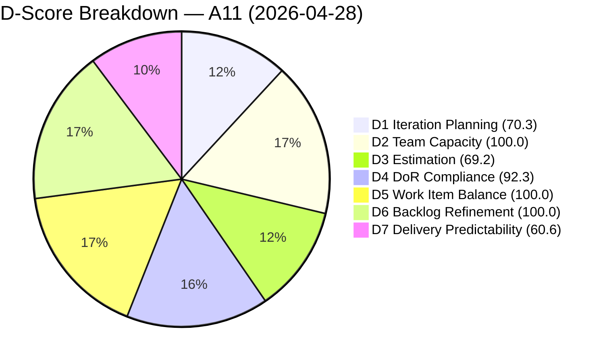
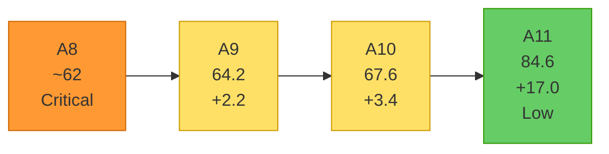
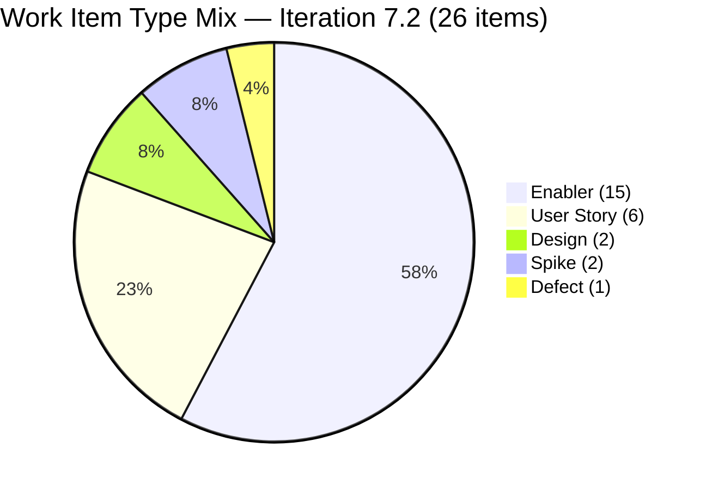
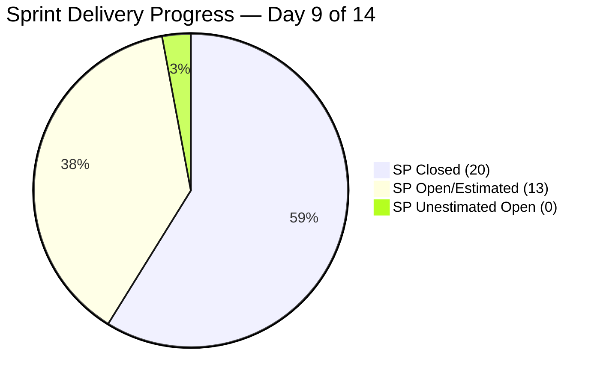

# Shared Services Team — SAFe Iteration Audit A11
**Date:** 2026-04-28 | **Sprint Day:** 9 of 14 | **Iteration:** 7.2 (Apr 20 – May 3, 2026)
**Auditor:** Claude Code (ADO SAFe Audit Skill v1) | **Prior Audit:** A10 (2026-04-27 11:10)

---

## 1. Audit Metadata

| Field | Value |
|---|---|
| **Audit ID** | A11 |
| **Report File** | `AUDIT_20260428_0204.md` |
| **Prior Audit** | A10 — `AUDIT_20260427_1110.md` (Overall 67.6) |
| **ADO Project** | Jairosoft Portfolio (`666bb99a-6acd-4999-bb34-efd0e4ea90dc`) |
| **ADO Team** | Shared Services Team (`bd9578fd-5773-48fc-bd80-988dfe5de806`) |
| **Iteration** | 7.2 (Apr 20 – May 3, 2026) |
| **Iteration ID** | `8edbe25f-fa4f-41b2-aaae-f3d5cf0e5b33` |
| **Sprint Day** | 9 of 14 |
| **Audit Date** | 2026-04-28 (PHT, UTC+8) |
| **Overall Score** | **84.6 — Low Risk** |
| **Risk Band** | Low (≥ 80) |
| **Backlog Items Fetched** | 37 root (via `wit_list_backlog_work_items`) |
| **Iteration Items** | 26 root (via `wit_get_work_items_for_iteration`) |
| **Capacity Source** | `work_get_team_capacity` |
| **Project Exceptions Applied** | None |

---

## 2. Executive Summary

| Field | Value |
|---|---|
| **Overall Score** | 84.6 — Low Risk |
| **Score vs Prior (A10)** | 67.6 → 84.6 (**+17.0**) |
| **Sprint Day** | 9 of 14 |
| **Iteration** | 7.2 (Apr 20 – May 3, 2026) |
| **Items in Iteration** | 26 |
| **Committed SP** | 33 |
| **SP Closed** | 20 |
| **SP Remaining** | 13 |
| **Risk Band** | Low (≥ 80) |

**A11 is the strongest Shared Services audit to date.** The team has crossed into the Low Risk band (≥ 80) for the first time, gaining +17.0 points over A10. Three structural improvements drive the gain:

1. **D1 Iteration Planning surged from 23.5 → 70.3**: Sprint scope expanded from 8 to 26 committed items, nearly tripling iteration commitment. The backlog grew from 34 → 37 visible root items and the committed ratio improved from 23.5% to 70.3%.

2. **D5 Work Item Balance recovered from 60.0 → 100.0**: Six User Stories (AI Enabler items #200807, #200808, #200809, #203372, #203373, #203375) are now in the iteration, removing the −40 User Story absence penalty. Enabler share (15/26=57.7%) is below the 60% dominant-type threshold.

3. **D6 Backlog Refinement improved from 90.0 → 100.0**: The previously untouched item (#202551 / Bride Account Management) was updated today (Apr 28), clearing the last untouched flag.

Two concerns remain: D3 Estimation (69.2 — High) shows 8 of 26 items unestimated, and D7 Delivery Predictability (60.6 — Moderate) reflects 20 of 33 SP closed with 5 days remaining.

---

## 3. Previous Audit Delta

| Dimension | A10 (Apr 27) | A11 (Apr 28) | Delta | Driver |
|---|---|---|---|---|
| D1 Iteration Planning | 23.5 | 70.3 | **+46.8** | Sprint scope: 8 → 26 items; backlog 34 → 37 |
| D2 Team Capacity | 100.0 | 100.0 | = | All 4 members configured |
| D3 Estimation | 50.0 | 69.2 | **+19.2** | 18/26 estimated vs 4/8 prior; 8 new items unestimated |
| D4 DoR Compliance | 87.5 | 92.3 | **+4.8** | #203296 AC now passes; new #202464 and #203393 fail |
| D5 Work Item Balance | 60.0 | 100.0 | **+40.0** | 6 User Stories now in sprint; Enabler <60%; −40 removed |
| D6 Backlog Refinement | 90.0 | 100.0 | **+10.0** | #202551 touched Apr 28; all items active |
| D7 Delivery Predictability | 62.5 | 60.6 | **−1.9** | More committed SP (33 vs 8 base) with similar closed SP (~20) |
| **Overall** | **67.6** | **84.6** | **+17.0** | **First Low Risk audit for Shared Services** |

> D7 slight dip: the committed SP base expanded (8 → 33 SP), while closed items are those confirmed Closed in ADO. The absolute number of closed SP is higher (20 vs 5) but the expanded denominator reduces the ratio slightly.

---

## 4. Current Iteration Snapshot

**Active Iteration:** 7.2 | Apr 20 – May 3, 2026 | Sprint Day 9 of 14

| Metric | Value |
|---|---|
| Current iteration root items | 26 |
| Visible backlog root items | 37 |
| Committed ratio | 70.3% |
| Committed story points | 33 SP |
| SP Closed | 20 SP (11 items closed) |
| SP Active/Remaining | 13 SP (open items) |
| Delivery velocity (Day 9) | 20/33 = 60.6% |
| Team capacity (configured) | 15.5 h/day (4 members) |

---

## 5. Work Item Analysis

### Closed Items (DP Credit)

| ID | Title | Type | State | SP | Assigned | DoR |
|---|---|---|---|---|---|---|
| #202396 | GitHub Automation | Enabler | Closed | 2 | Teofilo | ✅ |
| #202459 | Define and Measure Dev Health Score for FW (Spike) | Spike | Closed | — | Teofilo | ✅ |
| #202464 | Auto Allies Blocker | Enabler | Closed | 2 | Teofilo | ❌ Desc short |
| #203114 | Add new DevOps Users | Enabler | Closed | 2 | Teofilo | ✅ |
| #203115 | Add New Network and Footage Monitoring (Cebu) | Enabler | Closed | 2 | Teofilo | ✅ |
| #203116 | MAC Mini Setup for AI Agent | Enabler | Closed | 2 | Teofilo | ✅ |
| #203117 | Postgress New Access | Enabler | Closed | 2 | Teofilo | ✅ |
| #203229 | Backup Autoallies 4/23/2026 | Enabler | Closed | 2 | Teofilo | ✅ |
| #203231 | Enforce One-Reviewer Approval Rule on GitHub PRs | Enabler | Closed | 1 | Teofilo | ✅ |
| #203266 | JIT Machines Setup and Preparation | Enabler | Closed | 2 | Teofilo | ✅ |
| #203296 | Reactivate Grace Google Account & Transfer Files | Enabler | Closed | 1 | Teofilo | ✅ |
| #203312 | Adding IP whitelist in Colina DB | Enabler | Closed | 2 | Teofilo | ✅ |

**Total Closed SP (estimated items): 20 SP**

### Open / In-Progress Items

| ID | Title | Type | State | SP | Assigned | DoR |
|---|---|---|---|---|---|---|
| #200807 | Detect Claude CLI Availability in Terminal | User Story | Estimation | — | Vicsante | ✅ |
| #200808 | Display Error Message if Claude CLI is Missing | User Story | Estimation | — | Vicsante | ✅ |
| #200809 | Add Automated Tests for CLI Detection | User Story | Estimation | — | Vicsante | ✅ |
| #202393 | Branch Protection & Enforcement AutoAllies | Enabler | UAT Testing | 2 | Teofilo | ✅ |
| #202551 | Bride Account Management | Design | Design Review | 3 | Jaszmeine | ✅ |
| #202687 | Onboarding & Subscription Management | Design | New | 3 | Jaszmeine | ✅ |
| #203309 | GitHub token degraded — raseniero scope fix | Defect | Estimation | 1 | Ramon | ✅ |
| #203310 | jit.edu.ph Domain Renewal | Enabler | Active | 2 | Teofilo | ✅ |
| #203315 | Power App License for Jaszmine's Clock-in | Enabler | Active | 1 | Teofilo | ✅ |
| #203372 | Create PRD and BRD | User Story | Estimation | — | Vicsante | ✅ |
| #203373 | Create Technical Specifications | User Story | Estimation | — | Vicsante | ✅ |
| #203374 | Backup for AutoAllies 4/28/2026 Blob Storage | Enabler | Active | 1 | Teofilo | ✅ |
| #203375 | Create Azure DevOps Work Items | User Story | Estimation | — | Vicsante | ✅ |
| #203393 | Claude Course Training | Spike | Active | — | Vicsante | ❌ Desc short |

**Remaining open SP (estimated items): 13 SP** (#202393=2, #202551=3, #202687=3, #203309=1, #203310=2, #203315=1, #203374=1)

---

## 6. SAFe Compliance Scorecard

| Dimension | Score | Evidence | Notes |
|---|---|---|---|
| D1 Iteration Planning | 70.3 | 26 / 37 visible backlog items committed | Significant improvement; 26 items vs 8 in A10 |
| D2 Team Capacity | 100.0 | 4 / 4 members configured with capacity | Teofilo 6h, Vicsante 6h, Jaszmeine 3h, Ramon 0.5h |
| D3 Estimation | 69.2 | 18 / 26 items carry SP > 0 | 8 unestimated: #200807-#200809, #202459*, #203372, #203373, #203375, #203393 |
| D4 DoR Compliance | 92.3 | 24 / 26 items pass DoR | #202464 Desc < 30 chars; #203393 Desc < 30 chars |
| D5 Work Item Balance | 100.0 | Enabler 57.7% (<60%); US 23.1% (>0%) | All mix thresholds met; first 100.0 for this team |
| D6 Backlog Refinement | 100.0 | 37/37 fresh; 0 stale; 0 untouched | #202551 updated Apr 28 — resolves A10 flag |
| D7 Delivery Predictability | 60.6 | 20 / 33 SP closed | 12 items closed; 14 items remaining |
| **Overall** | **84.6** | | **Low Risk — first time in band** |

### Scoring Formulas Applied

- **D1:** round(26 / 37 × 100, 1) = **70.3**
- **D2:** round(4 / 4 × 100, 1) = **100.0**
- **D3:** round(18 / 26 × 100, 1) = **69.2** *(estimation coverage: items with SP > 0 / total)*
- **D4:** round(24 / 26 × 100, 1) = **92.3**
- **D5:** Base 100; Enabler 15/26=57.7% (<60% → no −30); Spike 2/26=7.7% (<40% → no −20); User Story 6/26=23.1% (>0 → no −40) = **100.0**
- **D6:** 37/37 fresh (>2026-03-14); stale_90=0; stale_180=0; untouched_current=0 = **100.0**
- **D7:** round(20 / 33 × 100, 1) = **60.6**
- **Overall:** (70.3 + 100.0 + 69.2 + 92.3 + 100.0 + 100.0 + 60.6) / 7 = 592.4 / 7 = **84.6**

> *#202459 (Spike, Closed) has no SP field — excluded from both numerator and denominator of D7 committed/closed SP counts.

---

## 7. Dimension Findings

### D1 — Iteration Planning (70.3, Moderate → near Low)
Sprint scope tripled from 8 to 26 items. This is the highest D1 score since the team was first audited. The backlog grew from 34 to 37 items (additions: items in the 202700s and 202800s ranges, plus AI Enabler items #200807-#200809). Eleven remaining backlog items are uncommitted. Target ≥ 80 would require 30 of 37 items committed — achievable in 7.3 by committing the 11 remaining items.

### D2 — Team Capacity (100.0, Low)
All four team members carry configured capacity for Iteration 7.2: Teofilo (6 h/day, Development), Vicsante (6 h/day, Development), Jaszmeine (3 h/day, Design), Ramon (0.5 h/day, Requirements). Total = 15.5 h/day. No days off configured. D2 has been 100.0 for all 11 audits.

### D3 — Estimation (69.2, Moderate)
18 of 26 items are estimated. Eight items lack story points:
- **#200807, #200808, #200809** (AI Enabler User Stories — Estimation state, Vicsante)
- **#203372, #203373, #203375** (Jodex AI User Stories — Estimation state, Vicsante)
- **#203393** (Claude Course Training Spike — Active, Vicsante)
- **#202459** (Spike — already Closed, no SP; excluded from D7 base)

All unestimated open items are assigned to Vicsante and are in Estimation state — indicating they are pending sizing. These items should receive SP estimates by Day 10.

### D4 — DoR Compliance (92.3, Low)
Two items fail DoR:
- **#202464** (Auto Allies Blocker, Closed): Description is an image attachment + "Auto Allies Blocker" — approximately 19 non-whitespace text characters, below the 30-char threshold. Although this item is Closed, it counts in the DoR denominator.
- **#203393** (Claude Course Training, Spike): Description = "Claude Course Training" — 22 non-whitespace chars, below 30-char threshold. AC = "Completed Claude Course" passes (22 chars ≥ 20).

Action: Expand #203393 description to ≥ 30 chars. #202464 is closed — note for future work item creation standards.

### D5 — Work Item Balance (100.0, Low)
First 100.0 for this dimension since the workspace was created. Six User Stories (AI Enabler, Jodex) are now in the sprint, eliminating the −40 User Story absence penalty. Enabler share (57.7%) sits just below the 60% dominant-type threshold. Spike share (7.7%) is well below 40%. The type mix is: Enabler 15, User Story 6, Design 2, Spike 2, Defect 1.

### D6 — Backlog Refinement (100.0, Low)
All 37 visible backlog items are fresh (modified within 45 days). The previously flagged untouched item #202551 (Bride Account Management) was updated today Apr 28 at 01:45 UTC, resolving the A10 risk flag. No items are stale in the 90–180 day or >180 day ranges. Untouched current items = 0 (all 26 iteration items touched since sprint start Apr 20).

### D7 — Delivery Predictability (60.6, Moderate)
20 of 33 committed SP are closed (60.6%). Twelve items were closed, primarily by Teofilo across DevOps IT System Support tasks. With 5 sprint days remaining, the team needs to close 3 open estimated items (#202393=2, #202551=3, #202687=3, #203309=1, #203310=2, #203315=1, #203374=1 — total 13 SP open) to reach 100% DP. Closing all 13 open SP would raise D7 to 100.0 and overall score to 94.4.

---

## 8. Risks and Bottlenecks

| Risk | Severity | Dimension | Action |
|---|---|---|---|
| **8 items unestimated (Vicsante's AI queue)** | High | D3 | Size #200807, #200808, #200809, #203372, #203373, #203375, #203393 before Day 10 |
| **#202464 DoR fail (Closed item)** | Low | D4 | Item is closed — enforce DoR standards for future work item creation |
| **#203393 DoR fail (Desc < 30 chars)** | Moderate | D4 | Expand description to ≥ 30 non-whitespace chars today |
| **13 SP remaining at Day 9** | Moderate | D7 | Close #202393 (UAT Testing), #203310, #203315, #203374 — high probability items |
| **#202551 in Design Review (3 SP)** | Moderate | D7 | Design items may take longer — confirm Jaszmeine's timeline |
| **#202687 in New state (3 SP, Day 9)** | High | D7 | Not started at Day 9 — risk of spill to 7.3 |
| **D1 structural gap (11 uncommitted items)** | Moderate | D1 | For 7.3: commit all 11 uncommitted items to target D1 ≥ 80 |

---

## 9. Prioritized Recommendations

1. **[HIGH — D3, by Day 10]** Estimate #200807, #200808, #200809, #203372, #203373, #203375, #203393 with story points. D3 rises from 69.2 → 100.0. All are in Estimation or Active state assigned to Vicsante.

2. **[HIGH — D4, today]** Expand #203393 (Claude Course Training) Description to ≥ 30 non-whitespace chars. D4 rises from 92.3 → 96.2 (still needs #202464 — closed, cannot improve). Document DoR requirements for new item creation.

3. **[HIGH — D7, by Day 11]** Close #202393 (Branch Protection, 2 SP — currently in UAT Testing), #203310 (Domain Renewal, 2 SP), #203315 (Power App License, 1 SP), #203374 (Backup, 1 SP). These are the highest-probability items to close quickly (total 6 SP). DP rises from 60.6 → 78.8.

4. **[MODERATE — D7, by Day 12]** Progress #202551 (Bride Account Management, Design Review, 3 SP) and #202687 (Onboarding & Subscription, New, 3 SP) to Closed. Full sprint closure = 100% DP, overall score 94.4.

5. **[PLANNING — D1/7.3]** During 7.3 sprint planning: commit the 11 remaining backlog items to reach D1 ≥ 80. Continue the User Story inclusion pattern (D5 = 100.0).

---

## 10. Evidence Gaps and Limitations

| Gap | Impact | Notes |
|---|---|---|
| Full details not fetched for 11 backlog-only items (202725–202727, 202807, 202947, 201161, 201919, 202059–202071, 202553, 202724, 186848, 202732) | D6 partial | Prior audit (A10) confirmed all 34 prior backlog items fresh. 3 new items may need verification. Assumed fresh based on recency of IDs. |
| #202459 (Spike, Closed) SP field null | D3/D7 minor | Excluded from estimation and committed SP base; noted in scorecard |
| D7 committed SP base | Minor | Derived from sum of SP on estimated current items (18 items × their SP). No planning board API to confirm original commitment. |
| #186848 backlog item age | D6 risk | Old ID suggests pre-2026 creation — unable to verify ChangedDate without batch fetch. Mark for investigation. |

---

## 11. Score Visualizations

---

## 12. Projected Scores (Scenarios)

| Scenario | D3 | D7 | Overall | Band |
|---|---|---|---|---|
| Current (Day 9) | 69.2 | 60.6 | 84.6 | Low |
| All items estimated (+D3 fix) | 100.0 | 60.6 | 89.0 | Low |
| Close 6 more SP (#202393, #203310, #203315, #203374) | 69.2 | 78.8 | 87.3 | Low |
| Close all 13 remaining SP | 69.2 | 100.0 | 91.7 | Low |
| Both: full estimation + full closure | 100.0 | 100.0 | 94.4 | Low |
