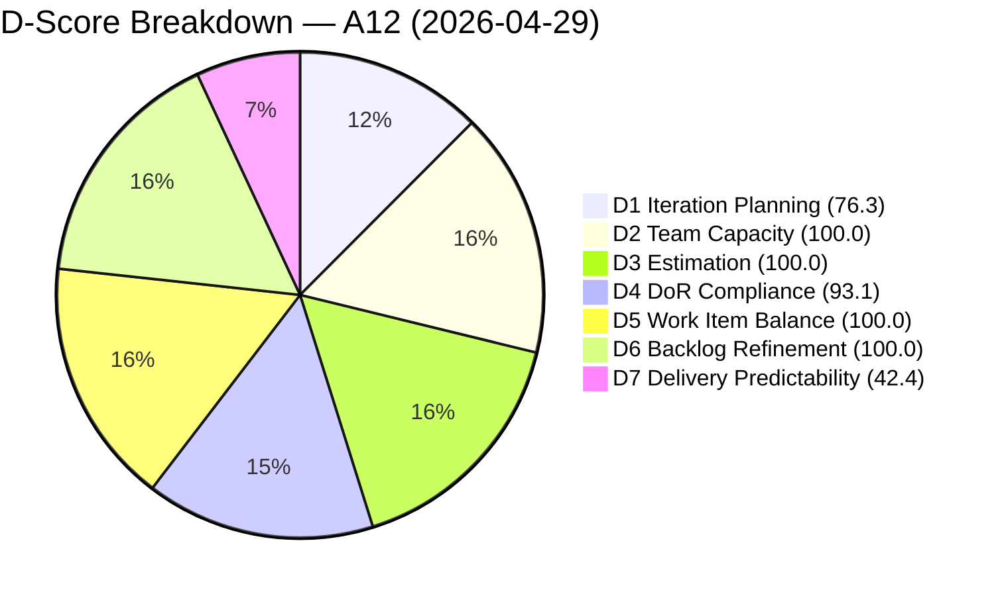
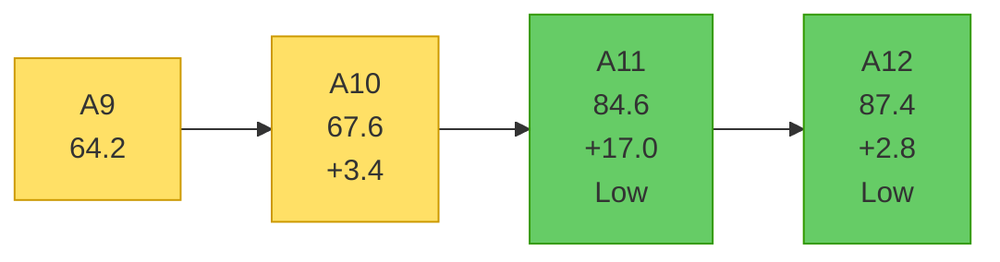
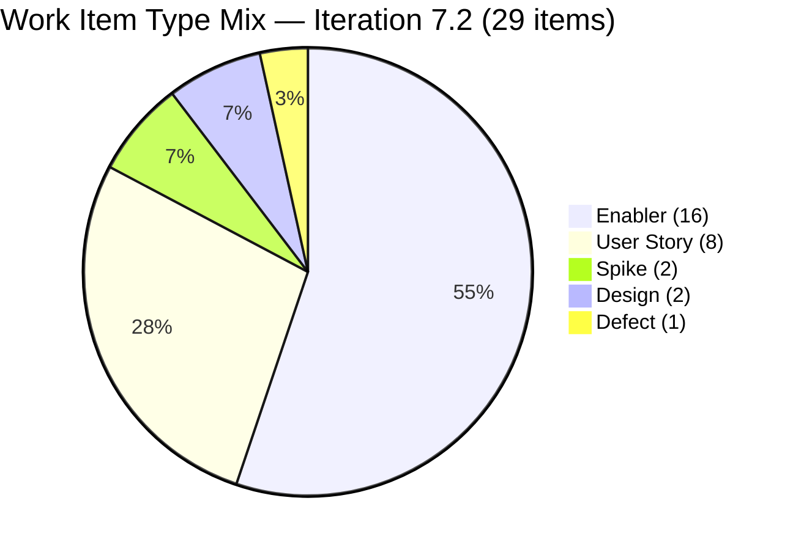
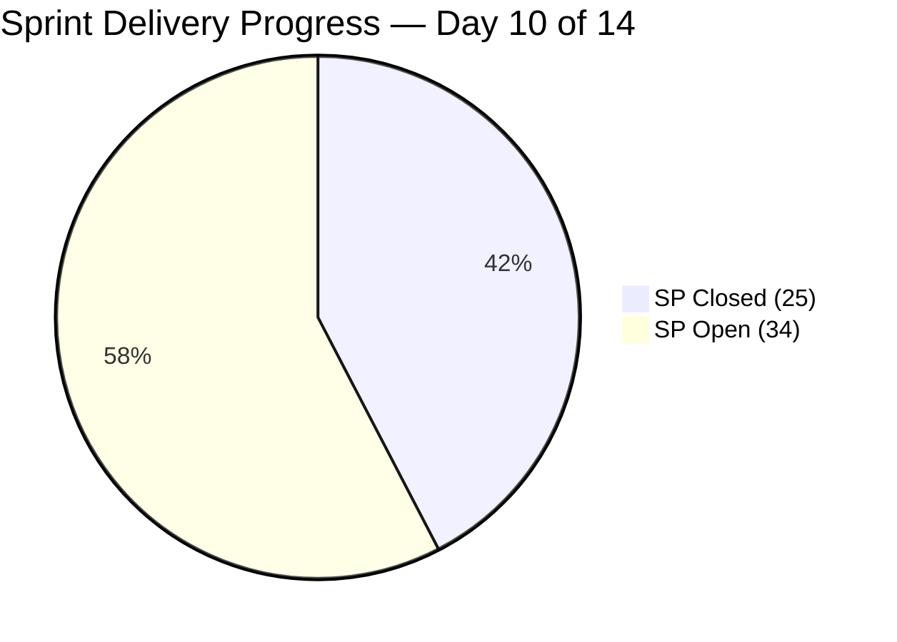

# Shared Services Team — SAFe Iteration Audit A12
**Date:** 2026-04-29 | **Sprint Day:** 10 of 14 | **Iteration:** 7.2 (Apr 20 – May 3, 2026)
**Auditor:** Claude Code (ADO SAFe Audit Skill v1) | **Prior Audit:** A11 (2026-04-28 02:04)

---

## 1. Audit Metadata

| Field | Value |
|---|---|
| **Audit ID** | A12 |
| **Report File** | `AUDIT_20260429_0207.md` |
| **Prior Audit** | A11 — `AUDIT_20260428_0204.md` (Overall 84.6) |
| **ADO Project** | Jairosoft Portfolio (`666bb99a-6acd-4999-bb34-efd0e4ea90dc`) |
| **ADO Team** | Shared Services Team (`bd9578fd-5773-48fc-bd80-988dfe5de806`) |
| **Iteration** | 7.2 (Apr 20 – May 3, 2026) |
| **Iteration ID** | `8edbe25f-fa4f-41b2-aaae-f3d5cf0e5b33` |
| **Sprint Day** | 10 of 14 |
| **Audit Date** | 2026-04-29 (PHT, UTC+8) |
| **Overall Score** | **87.4 — Low Risk** |
| **Risk Band** | Low (≥ 80) |
| **Visible Backlog Items** | 38 root (via `wit_list_backlog_work_items`) |
| **Iteration Items** | 29 root (via `wit_get_work_items_for_iteration`, IterationPath=7.2) |
| **Capacity Source** | `work_get_team_capacity` |
| **Project Exceptions Applied** | None |

---

## 2. Executive Summary

| Field | Value |
|---|---|
| **Overall Score** | 87.4 — Low Risk |
| **Score vs Prior (A11)** | 84.6 → 87.4 (**+2.8**) |
| **Sprint Day** | 10 of 14 |
| **Iteration** | 7.2 (Apr 20 – May 3, 2026) |
| **Items in Iteration** | 29 |
| **Committed SP** | 59 |
| **SP Closed** | 25 |
| **SP Remaining** | 34 |
| **Risk Band** | Low (≥ 80) — sustained for second consecutive audit |

A12 continues the Low Risk trend established in A11, with the overall score rising +2.8 to 87.4. Four material changes drive the improvement:

1. **D3 Estimation (69.2 → 100.0, +30.8):** All 29 iteration items now carry story points. The 8 previously-unestimated items (AI CLI stories #200807–#200809, Jodex stories #203372–#203375, Spike #203393) have been estimated. This resolves the most-cited prior-audit risk.

2. **D7 Delivery Predictability (60.6 → 42.4, −18.2):** Six new Jodex feature User Stories (#203436–#203441) entered the sprint today in "Ready for Dev" state, adding 21 SP to the committed base without any corresponding closed SP. This sprint-scope expansion is the single largest D7 risk driver. Closed SP grew from 20 to 25 (three AI CLI stories closed: #200807, #200808, #200809) but the denominator grew from 33 to 59.

3. **D1 Iteration Planning (70.3 → 76.3, +6.0):** One new item was added to the visible backlog (38 vs 37) while iteration count grew from 26 to 29, improving the ratio.

4. **D4 DoR Compliance (92.3 → 93.1, +0.8):** Minor improvement as the larger denominator (29 vs 26) dilutes the 2 persistent DoR failures.

The critical issue is **D7 at 42.4 (High Risk)** due to mid-sprint scope injection. With 34 SP open and 4 sprint days remaining, the team faces a structural delivery gap. Immediate priority is progressing and closing the open estimated items (especially #202393 at UAT Testing and the new Jodex items in Ready for Dev).

---

## 3. Previous Audit Delta

| Dimension | A11 (Apr 28) | A12 (Apr 29) | Delta | Driver |
|---|---|---|---|---|
| D1 Iteration Planning | 70.3 | 76.3 | **+6.0** | 29/38 vs 26/37; 3 new items added (203436–203441 in sprint, backlog +1) |
| D2 Team Capacity | 100.0 | 100.0 | = | All 4 members configured; no changes |
| D3 Estimation | 69.2 | 100.0 | **+30.8** | All 29 items now estimated; previously-unestimated items sized |
| D4 DoR Compliance | 92.3 | 93.1 | **+0.8** | Same 2 failures (#202464, #203393); denominator 26→29 dilutes impact |
| D5 Work Item Balance | 100.0 | 100.0 | = | Type mix healthy: Enabler 55.2% (<60%), US present (27.6%) |
| D6 Backlog Refinement | 100.0 | 100.0 | = | All 38 backlog items fresh; 0 stale; 0 untouched |
| D7 Delivery Predictability | 60.6 | 42.4 | **−18.2** | 6 new items (21 SP) entered sprint Ready for Dev; closed SP 20→25 |
| **Overall** | **84.6** | **87.4** | **+2.8** | D3 gain (+30.8) offsets D7 drop (−18.2) |

---

## 4. Current Iteration Snapshot

**Active Iteration:** 7.2 | Apr 20 – May 3, 2026 | Sprint Day 10 of 14

| Metric | Value |
|---|---|
| Current iteration root items | 29 |
| Visible backlog root items | 38 |
| Committed ratio | 76.3% |
| Committed story points | 59 SP |
| SP Closed | 25 SP (16 items) |
| SP Remaining (open estimated) | 34 SP (13 items) |
| Delivery velocity (Day 10) | 25/59 = 42.4% |
| Team capacity (configured) | 15.5 h/day (4 members) |

---

## 5. Work Item Analysis

### Closed Items (25 SP — DP Credit)

| ID | Title | Type | State | SP | Assigned | DoR |
|---|---|---|---|---|---|---|
| #200807 | Detect Claude CLI Availability in Terminal | User Story | **Closed** | 1 | Vicsante | ✅ |
| #200808 | Display Error Message if Claude CLI is Missing | User Story | **Closed** | 1 | Vicsante | ✅ |
| #200809 | Add Automated Tests for CLI Detection | User Story | **Closed** | 1 | Vicsante | ✅ |
| #202396 | GitHub Automation | Enabler | **Closed** | 2 | Teofilo | ✅ |
| #202464 | Auto Allies Blocker | Enabler | **Closed** | 2 | Teofilo | ❌ Desc <30 |
| #203114 | Add new DevOps Users | Enabler | **Closed** | 2 | Teofilo | ✅ |
| #203115 | Add New Network and Footage Monitoring (Cebu) | Enabler | **Closed** | 2 | Teofilo | ✅ |
| #203116 | MAC Mini Setup for AI Agent | Enabler | **Closed** | 2 | Teofilo | ✅ |
| #203117 | Postgress New Access | Enabler | **Closed** | 2 | Teofilo | ✅ |
| #203229 | Backup Autoallies 4/23/2026 | Enabler | **Closed** | 2 | Teofilo | ✅ |
| #203231 | Enforce One-Reviewer Approval Rule on GitHub PRs | Enabler | **Closed** | 1 | Teofilo | ✅ |
| #203266 | JIT Machines Setup and Preparation | Enabler | **Closed** | 2 | Teofilo | ✅ |
| #203296 | Reactivate Grace Google Account & Transfer Files | Enabler | **Closed** | 1 | Teofilo | ✅ |
| #203312 | Adding IP whitelist in Colina DB | Enabler | **Closed** | 2 | Teofilo | ✅ |
| #203315 | Power App License for Jaszmine's Clock-in | Enabler | **Closed** | 1 | Teofilo | ✅ |
| #203374 | Backup for AutoAllies 4/28/2026 Blob Storage | Enabler | **Closed** | 1 | Teofilo | ✅ |

> #202459 (Spike, Closed) has null SP — excluded from committed/closed SP base per estimation rules.

**Total Closed SP: 25**

### Open / In-Progress Items (34 SP Remaining)

| ID | Title | Type | State | SP | Assigned | DoR |
|---|---|---|---|---|---|---|
| #202393 | Branch Protection & Enforcement AutoAllies | Enabler | UAT Testing | 2 | Teofilo | ✅ |
| #202551 | Bride Account Management | Design | Design Approved | 3 | Jaszmeine | ✅ |
| #202687 | Onboarding & Subscription Management | Design | Design Approved | 3 | Jaszmeine | ✅ |
| #203309 | GitHub token degraded — raseniero scope fix | Defect | Estimation | 1 | Ramon | ✅ |
| #203310 | jit.edu.ph Domain Renewal | Enabler | Active | 2 | Teofilo | ✅ |
| #203393 | Claude Course Training | Spike | Active | 2 | Vicsante | ❌ Desc <30 |
| #203436 | Plugin Lifecycle & Extract Skill Verification | User Story | Ready for Dev | 5 | Vicsante | ✅ |
| #203437 | Plugin Generate Skill — Playwright Script Generation | User Story | Ready for Dev | 5 | Vicsante | ✅ |
| #203438 | Generate Test Execution Report (/qa-ai:report) | User Story | Ready for Dev | 2 | Vicsante | ✅ |
| #203439 | Send Report via Outlook Email (/qa-ai:email) | User Story | Ready for Dev | 3 | Vicsante | ✅ |
| #203440 | Scheduled QA Pipeline Orchestration | User Story | Ready for Dev | 3 | Vicsante | ✅ |
| #203441 | Skill Plugin Development Environment Setup | Enabler | Ready for Dev | 3 | Vicsante | ✅ |

**Remaining open SP: 34** (#202393=2, #202551=3, #202687=3, #203309=1, #203310=2, #203393=2, #203436=5, #203437=5, #203438=2, #203439=3, #203440=3, #203441=3)

### Work Item Type Distribution (29 items)

| Type | Count | Share |
|---|---|---|
| Enabler | 16 | 55.2% |
| User Story | 8 | 27.6% |
| Spike | 2 | 6.9% |
| Design | 2 | 6.9% |
| Defect | 1 | 3.4% |

> Enabler share (55.2%) is below the 60% dominant-type threshold.

---

## 6. SAFe Compliance Scorecard

| Dimension | Score | Evidence | Notes |
|---|---|---|---|
| D1 Iteration Planning | 76.3 | 29 / 38 visible backlog items committed | Up from 70.3; 9 uncommitted items remain |
| D2 Team Capacity | 100.0 | 4 / 4 members configured | Teofilo 6h, Vicsante 6h, Jaszmeine 3h, Ramon 0.5h |
| D3 Estimation | 100.0 | 28 / 28 point-eligible items carry SP > 0 | All prior-unestimated items now sized (resolved A11 risk) |
| D4 DoR Compliance | 93.1 | 27 / 29 items pass DoR | #202464 Desc <30 chars (Closed); #203393 Desc <30 chars |
| D5 Work Item Balance | 100.0 | Enabler 55.2% (<60%); US 27.6% (>0%) | All mix thresholds met |
| D6 Backlog Refinement | 100.0 | 38/38 fresh; 0 stale; 0 untouched | All items active in current cycle |
| D7 Delivery Predictability | 42.4 | 25 / 59 SP closed | 6 new Jodex items (21 SP) added sprint scope; D7 regression |
| **Overall** | **87.4** | | **Low Risk — second consecutive audit** |

### Scoring Formulas Applied

- **D1:** round(29 / 38 × 100, 1) = **76.3**
- **D2:** round(4 / 4 × 100, 1) = **100.0**
- **D3:** round(28 / 28 × 100, 1) = **100.0** *(#202459 Spike, null SP excluded from denominator)*
- **D4:** round(27 / 29 × 100, 1) = **93.1** *(2 DoR failures: #202464, #203393)*
- **D5:** Base 100; Enabler 16/29=55.2% (<60% → no −30); Spike 2/29=6.9% (<40% → no −20); US 8/29=27.6% (>0% → no −40) = **100.0**
- **D6:** 38/38 fresh (all ChangedDates ≥ Apr 15); stale_90=0; stale_180=0; untouched_current=0 = **100.0**
- **D7:** round(25 / 59 × 100, 1) = **42.4**
- **Overall:** (76.3 + 100.0 + 100.0 + 93.1 + 100.0 + 100.0 + 42.4) / 7 = 611.8 / 7 = **87.4**

---

## 7. Dimension Findings

### D1 — Iteration Planning (76.3, Moderate)
29 of 38 visible backlog items are committed to Iteration 7.2. The backlog grew from 37 to 38 items (one net addition) while iteration commitment grew from 26 to 29 items (six new Jodex items added, three AI CLI items closed and removed from backlog). The 9 uncommitted backlog items include future-sprint Design items (202553, 202724–202727), Jodex PI7 stories (202059–202065), Jodex PI8 stories (202066–202071), and infrastructure spikes (202807, 202947). Committing the 9 remaining eligible items in 7.3 would push D1 to ≥ 80.

### D2 — Team Capacity (100.0, Low)
All four team members carry configured capacity: Teofilo (6 h/day, Development), Vicsante (6 h/day, Development), Jaszmeine (3 h/day, Design), Ramon (0.5 h/day, Requirements). Total = 15.5 h/day. No days off configured. Steady at 100.0 across all 12 audits.

### D3 — Estimation (100.0, Low)
All 28 point-eligible items now carry SP estimates. The A11 critical risk (8 unestimated items) has been fully resolved. Notable new estimates include:
- #200807, #200808, #200809 (AI CLI stories): each 1 SP — all three now also Closed.
- #203372, #203373, #203375 (Jodex stories): not yet in iteration but estimated in backlog.
- #203393 (Claude Course Training Spike): 2 SP.
- #203436–#203441 (new Jodex QA items): 5, 5, 2, 3, 3, 3 SP.

D3 is at 100.0 for the first time in this workspace's audit history.

### D4 — DoR Compliance (93.1, Low)
Two items fail DoR, unchanged from A11:
- **#202464** (Auto Allies Blocker, Closed): Description contains primarily an image with "Auto Allies Blocker" text — approximately 18 non-whitespace text characters, below the 30-char threshold. Item is Closed — remediation not possible, but informs future work item creation standards.
- **#203393** (Claude Course Training, Spike, Active): Description = "Claude Course Training" — 20 non-whitespace chars, below 30-char threshold. **Action: Expand description to ≥ 30 non-whitespace chars today.** AC ("Completed Claude Course" = 23 chars) passes ≥20.

### D5 — Work Item Balance (100.0, Low)
Type mix remains healthy. Enabler share (55.2%) holds below the 60% threshold; the six new Jodex User Stories (#203436–#203441) increased User Story share from 23.1% (A11) to 27.6% (A12), further strengthening the mix. No dominant-type, spike-excess, or User Story absence penalties apply.

### D6 — Backlog Refinement (100.0, Low)
All 38 visible backlog items are fresh (changed within 45 days). The oldest item in the backlog, #186848 (Apollo.ai and LinkedIn Integration), was last modified Apr 15, 2026 — 14 days ago, well within the 45-day fresh window. No items approach the 90-day stale threshold. Current iteration items are all active (no untouched items since sprint start). D6 has been 100.0 for two consecutive audits.

### D7 — Delivery Predictability (42.4, High)
D7 dropped from 60.6 to 42.4 due to a mid-sprint scope injection of six Jodex QA automation User Stories (#203436–#203441, 21 SP total, added Apr 29 in "Ready for Dev" state). While three AI CLI stories (#200807–#200809, 3 SP) closed today, the net effect is a committed SP expansion from 33 to 59 with only a 5 SP increase in closed SP (20 → 25).

This is a SAFe compliance concern: sprint backlog additions after planning should be limited to critical discoveries. Adding 21 SP of new work at Day 10 of a 14-day sprint violates the "Protect the Sprint" principle. The 6 Jodex items are all in "Ready for Dev" — no in-progress work yet — making near-term closure highly unlikely before May 3.

High-probability closure targets for the remaining 4 days:
- **#202393** (Branch Protection, 2 SP, UAT Testing) — closest to Closed
- **#203310** (Domain Renewal, 2 SP, Active) — Teofilo infrastructure task
- **#203309** (GitHub token defect, 1 SP, Estimation) — quick defect fix

---

## 8. Risks and Bottlenecks

| Risk | Severity | Dimension | Action |
|---|---|---|---|
| **34 SP open at Day 10 with 4 days left** | Critical | D7 | Focus Teofilo on #202393 (UAT) + #203310; focus Vicsante on #203436 start |
| **6 Jodex QA items added Day 10 (21 SP, Ready for Dev)** | High | D7, D1 | SAFe violation — sprint backlog added mid-sprint at Day 10. Flag for retrospective. Most will spill to 7.3. |
| **Vicsante has 21 SP in Ready for Dev vs ~24h remaining capacity** | High | D7 | Vicsante cannot close 21 SP in 4 days at 6h/day. Negotiate scope or accept spill. |
| **#202551, #202687 in Design Approved (6 SP, Jaszmeine)** | Moderate | D7 | Both Design items advanced to Design Approved (vs Design Review in A11). Confirm if handoff to dev is needed. |
| **#203393 DoR failure (Desc < 30 chars)** | Moderate | D4 | Expand description immediately — only 1 item needed to reach 96.6% DoR |
| **#203309 in Estimation state at Day 10** | Moderate | D7 | Defect assigned to Ramon — unstarted at Day 10. Close today (1 SP) |

---

## 9. Prioritized Recommendations

1. **[CRITICAL — D7, today Apr 29]** Close #202393 (Branch Protection & Enforcement, 2 SP, UAT Testing — Teofilo). Item has been in UAT Testing since Apr 27. Final acceptance and closure today adds 2 SP. D7 rises to 45.8.

2. **[HIGH — D7, by Apr 30]** Close #203310 (jit.edu.ph Domain Renewal, 2 SP, Active — Teofilo). Infrastructure task in progress. Closure + #202393 brings D7 to 49.2.

3. **[HIGH — D4, today Apr 29]** Expand #203393 (Claude Course Training) description to ≥ 30 non-whitespace characters. D4 rises from 93.1 → 96.6. One-line fix.

4. **[HIGH — D7, today Apr 29]** Close #203309 (GitHub token defect, 1 SP, Estimation — Ramon). Unstarted at Day 10 — assess if token fix is complete and mark Closed if resolved.

5. **[MODERATE — D7, by May 1]** Progress #202551 (Bride Account Management, Design Approved, 3 SP — Jaszmeine) and #202687 (Onboarding & Subscription, Design Approved, 3 SP — Jaszmeine) to Closed. Design Approved is near-terminal state. Closing both adds 6 SP (D7 → 57.6 combined with items 1–4).

6. **[PLANNING — Retrospective + 7.3]** Flag the 6 mid-sprint Jodex items (#203436–#203441) for sprint retrospective. SAFe principle: sprint backlog is locked after planning. If these are critical-path items, create a 7.3 sprint plan that formally commits them from the start. Vicsante's queue alone carries 21 SP + 2 SP (#203393) = 23 SP into 7.3.

7. **[PLANNING — D1/7.3]** During 7.3 planning, commit the 9 remaining backlog items to achieve D1 ≥ 80. Prioritize Jodex PI7 stories (202059–202065) and Design items (202553, 202724) that are already PI7-scoped.

---

## 10. Evidence Gaps and Limitations

| Gap | Impact | Notes |
|---|---|---|
| Mid-sprint scope injection timing (#203436–#203441, all created Apr 29) | D7 structural regression | Items added 2026-04-29T07:14 UTC — at sprint Day 10. Not in A11 backlog. SAFe non-standard. |
| #202459 (Spike, Closed) SP null | D3/D7 minor | Excluded from estimation and committed SP base per prior audit convention |
| #203372, #203373, #203375 in backlog but not in iteration | D6 minor | PI7-level paths — backlog-only; correctly excluded from iteration scoring |
| Committed SP base for D7 | Minor | Derived from sum of SP on estimated iteration items (28 items). No sprint planning ceremony record available in ADO to verify original commitment. |

---

## 11. Score Visualizations

---

## 12. Projected Scores (Scenarios)

| Scenario | D7 | Overall | Band |
|---|---|---|---|
| Current — Day 10 (25 SP closed) | 42.4 | 87.4 | Low |
| Close #202393 + #203310 + #203309 (+5 SP → 30 total) | 50.8 | 88.4 | Low |
| Above + #202551 + #202687 (+6 SP → 36 total) | 61.0 | 89.9 | Low |
| Close all open estimated items (59 SP total) | 100.0 | 95.6 | Low |
| Fix DoR (#203393) + Close all (full) | 100.0 | 96.0 | Low |

> Full sprint closure is unlikely given 34 SP remaining with Vicsante's queue (23 SP) only at Ready for Dev on Day 10. Realistic target: 36–42 SP closed by May 3 (61–71% D7), overall 90–91.
