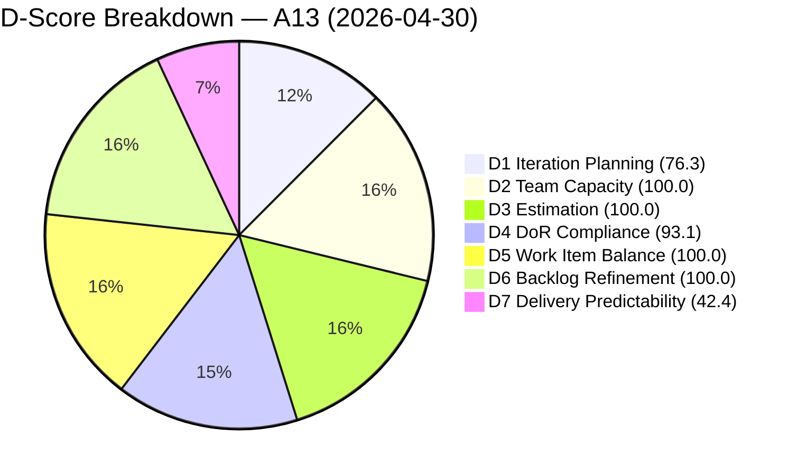
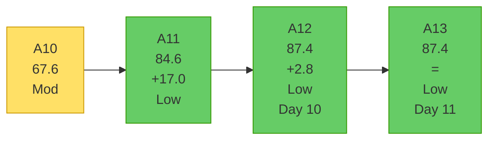
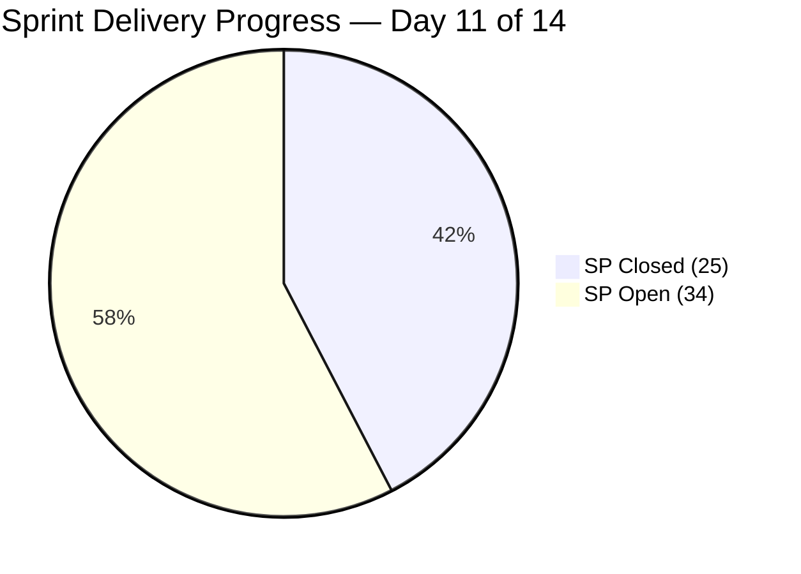
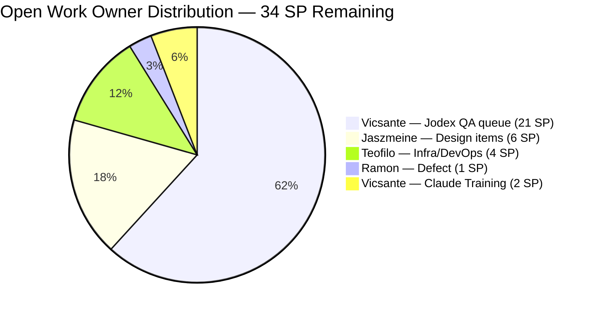
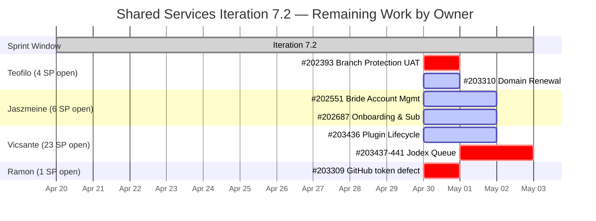

# Shared Services Team — SAFe Iteration Audit A13
**Date:** 2026-04-30 | **Sprint Day:** 11 of 14 | **Iteration:** 7.2 (Apr 20 – May 3, 2026)
**Auditor:** Claude Code (ADO SAFe Audit Skill v1) | **Prior Audit:** A12 (2026-04-29 02:07)

---

## 1. Audit Metadata

| Field | Value |
|---|---|
| **Audit ID** | A13 |
| **Report File** | `AUDIT_20260430_0903.md` |
| **Prior Audit** | A12 — `AUDIT_20260429_0207.md` (Overall 87.4) |
| **ADO Project** | Jairosoft Portfolio (`666bb99a-6acd-4999-bb34-efd0e4ea90dc`) |
| **ADO Team** | Shared Services Team (`bd9578fd-5773-48fc-bd80-988dfe5de806`) |
| **Iteration** | 7.2 (Apr 20 – May 3, 2026) |
| **Iteration ID** | `8edbe25f-fa4f-41b2-aaae-f3d5cf0e5b33` |
| **Sprint Day** | 11 of 14 |
| **Audit Date** | 2026-04-30 (PHT, UTC+8) |
| **Overall Score** | **87.4 — Low Risk** |
| **Risk Band** | Low (≥ 80) |
| **Visible Backlog Items** | 38 root (via `wit_list_backlog_work_items`) |
| **Iteration Items** | 29 root (via `wit_get_work_items_for_iteration`, IterationPath=7.2) |
| **Capacity Source** | `work_get_team_capacity` |
| **Project Exceptions Applied** | None |

---

## 2. Executive Summary

| Field | Value |
|---|---|
| **Overall Score** | 87.4 — Low Risk |
| **Score vs Prior (A12)** | 87.4 → 87.4 (**=**) |
| **Sprint Day** | 11 of 14 |
| **Iteration** | 7.2 (Apr 20 – May 3, 2026) |
| **Items in Iteration** | 29 |
| **Committed SP** | 59 |
| **SP Closed** | 25 |
| **SP Remaining** | 34 |
| **Risk Band** | Low (≥ 80) — third consecutive Low Risk audit |

A13 holds steady at 87.4. No new sprint closures were recorded since A12, maintaining all dimension scores unchanged. The two notable developments today are:

1. **#203436 (Plugin Lifecycle & Extract Skill Verification, 5 SP) moved from Ready for Dev → Active** at 06:03 UTC Apr 30. Vicsante has started on the lead Jodex QA item. This is the first substantive progress on the six Jodex items added at Day 10.

2. **#203310 (jit.edu.ph Domain Renewal, 2 SP) received a comment update** at 06:03 UTC Apr 30 (Active state). Teofilo is actively working the domain renewal.

The critical structural risk remains **D7 at 42.4 (High)**: 34 SP are open with only 3 sprint days remaining. The realistic end-of-sprint target is 36–42 total SP closed (D7 = 61–71%). Full sprint closure is not achievable given Vicsante's 23 SP queue at Ready for Dev/Active with 3 days of capacity remaining.

---

## 3. Previous Audit Delta

| Dimension | A12 (Apr 29) | A13 (Apr 30) | Delta | Driver |
|---|---|---|---|---|
| D1 Iteration Planning | 76.3 | 76.3 | = | 29/38 — no backlog or iteration count changes |
| D2 Team Capacity | 100.0 | 100.0 | = | All 4 members configured; no changes |
| D3 Estimation | 100.0 | 100.0 | = | All 28 point-eligible items estimated |
| D4 DoR Compliance | 93.1 | 93.1 | = | Same 2 failures (#202464 Closed, #203393 Active) |
| D5 Work Item Balance | 100.0 | 100.0 | = | Type mix healthy; Enabler 55.2% stays below 60% threshold |
| D6 Backlog Refinement | 100.0 | 100.0 | = | All 38 items fresh; 0 stale; 0 untouched |
| D7 Delivery Predictability | 42.4 | 42.4 | = | No new SP closed; #203436 moved to Active (progress visible) |
| **Overall** | **87.4** | **87.4** | **=** | **Score stable; active progress on Jodex and domain renewal** |

**Notable change not reflected in score:** #203436 transitioned from Ready for Dev → Active. This is a positive leading indicator — first substantive work started on the Jodex QA suite.

---

## 4. Current Iteration Snapshot

**Active Iteration:** 7.2 | Apr 20 – May 3, 2026 | Sprint Day 11 of 14 (3 days remaining: Apr 30–May 3)

| Metric | Value |
|---|---|
| Current iteration root items | 29 |
| Visible backlog root items | 38 |
| Committed ratio | 76.3% |
| Committed story points | 59 SP |
| SP Closed | 25 SP (16 items) |
| SP Remaining (open) | 34 SP (12 items) |
| Delivery velocity (Day 11) | 25/59 = 42.4% |
| Team capacity (configured) | 15.5 h/day (4 members) |
| Remaining capacity (3 days) | ~46.5 hours total |

---

## 5. Work Item Analysis

### Closed Items (25 SP — Delivery Predictability Credit)

| ID | Title | Type | State | SP | Assigned | DoR |
|---|---|---|---|---|---|---|
| #200807 | Detect Claude CLI Availability in Terminal | User Story | **Closed** | 1 | Vicsante | ✅ |
| #200808 | Display Error Message if Claude CLI is Missing | User Story | **Closed** | 1 | Vicsante | ✅ |
| #200809 | Add Automated Tests for CLI Detection | User Story | **Closed** | 1 | Vicsante | ✅ |
| #202396 | GitHub Automation | Enabler | **Closed** | 2 | Teofilo | ✅ |
| #202464 | Auto Allies Blocker | Enabler | **Closed** | 2 | Teofilo | ❌ Desc ~18 chars |
| #203114 | Add new DevOps Users | Enabler | **Closed** | 2 | Teofilo | ✅ |
| #203115 | Add New Network and Footage Monitoring (Cebu) | Enabler | **Closed** | 2 | Teofilo | ✅ |
| #203116 | MAC Mini Setup for AI Agent | Enabler | **Closed** | 2 | Teofilo | ✅ |
| #203117 | Postgress New Access | Enabler | **Closed** | 2 | Teofilo | ✅ |
| #203229 | Backup Autoallies 4/23/2026 | Enabler | **Closed** | 2 | Teofilo | ✅ |
| #203231 | Enforce One-Reviewer Approval Rule on GitHub PRs | Enabler | **Closed** | 1 | Teofilo | ✅ |
| #203266 | JIT Machines Setup and Preparation | Enabler | **Closed** | 2 | Teofilo | ✅ |
| #203296 | Reactivate Grace Google Account & Transfer Files | Enabler | **Closed** | 1 | Teofilo | ✅ |
| #203312 | Adding IP whitelist in Colina DB | Enabler | **Closed** | 2 | Teofilo | ✅ |
| #203315 | Power App License for Jaszmine's Clock-in | Enabler | **Closed** | 1 | Teofilo | ✅ |
| #203374 | Backup for AutoAllies 4/28/2026 Blob Storage | Enabler | **Closed** | 1 | Teofilo | ✅ |

> #202459 (Spike, Closed) has null SP — excluded from committed/closed SP base per estimation rules.

**Total Closed SP: 25**

### Open / In-Progress Items (34 SP Remaining)

| ID | Title | Type | State | SP | Assigned | DoR | Notes |
|---|---|---|---|---|---|---|---|
| #202393 | Branch Protection & Enforcement AutoAllies | Enabler | UAT Testing | 2 | Teofilo | ✅ | Closest to Done — unchanged since Apr 27 |
| #202551 | Bride Account Management | Design | Design Approved | 3 | Jaszmeine | ✅ | Design Approved — near-terminal |
| #202687 | Onboarding & Subscription Management | Design | Design Approved | 3 | Jaszmeine | ✅ | Design Approved — near-terminal |
| #203309 | GitHub token degraded — raseniero scope fix | Defect | Estimation | 1 | Ramon | ✅ | Unstarted at Day 11 |
| #203310 | jit.edu.ph Domain Renewal | Enabler | Active | 2 | Teofilo | ✅ | Comment added Apr 30 — active progress |
| #203393 | Claude Course Training | Spike | Active | 2 | Vicsante | ❌ Desc <30 | DoR failure pending fix |
| #203436 | Plugin Lifecycle & Extract Skill Verification | User Story | **Active** | 5 | Vicsante | ✅ | **Moved Active Apr 30** — Jodex work started |
| #203437 | Plugin Generate Skill — Playwright Script Generation | User Story | Ready for Dev | 5 | Vicsante | ✅ | Queued after #203436 |
| #203438 | Generate Test Execution Report (/qa-ai:report) | User Story | Ready for Dev | 2 | Vicsante | ✅ | Queued |
| #203439 | Send Report via Outlook Email (/qa-ai:email) | User Story | Ready for Dev | 3 | Vicsante | ✅ | Queued |
| #203440 | Scheduled QA Pipeline Orchestration | User Story | Ready for Dev | 3 | Vicsante | ✅ | Queued |
| #203441 | Skill Plugin Development Environment Setup | Enabler | Ready for Dev | 3 | Vicsante | ✅ | Queued |

**Remaining open SP: 34**

### Backlog Item Not in Iteration (New)

| ID | Title | Type | State | IterationPath | Notes |
|---|---|---|---|---|---|
| #202732 | Add to Flawless ADO as Stakeholder - QA Intern | Enabler | Ready for UAT | 7.1 | In backlog view; assigned to 7.1 — not scored in 7.2 iteration |

### Work Item Type Distribution (29 items)

| Type | Count | Share | D5 Penalty? |
|---|---|---|---|
| Enabler | 16 | 55.2% | No (< 60%) |
| User Story | 8 | 27.6% | No (> 0%) |
| Spike | 2 | 6.9% | No (< 40%) |
| Design | 2 | 6.9% | — |
| Defect | 1 | 3.4% | — |

---

## 6. SAFe Compliance Scorecard

| Dimension | Score | Evidence | Notes |
|---|---|---|---|
| D1 Iteration Planning | 76.3 | 29 / 38 visible backlog items committed | 9 uncommitted: #202732(7.1), #202553/#202724–202727(Design), #202059–202065/#202066–202071(Jodex PI7/PI8), #202807/#202947 |
| D2 Team Capacity | 100.0 | 4 / 4 members configured | Teofilo 6h, Vicsante 6h, Jaszmeine 3h, Ramon 0.5h |
| D3 Estimation | 100.0 | 28 / 28 point-eligible items carry SP > 0 | #202459 (Spike, null SP) excluded from denominator |
| D4 DoR Compliance | 93.1 | 27 / 29 items pass DoR | #202464 Desc ~18 chars (Closed); #203393 Desc 22 chars (Active) |
| D5 Work Item Balance | 100.0 | Enabler 55.2% (<60%); US 27.6% (>0%) | All mix thresholds met; type balance healthy |
| D6 Backlog Refinement | 100.0 | 38/38 fresh; 0 stale; 0 untouched | #202732 newest addition (Apr 27); oldest #186848 (Apr 15 = 15 days) |
| D7 Delivery Predictability | 42.4 | 25 / 59 SP closed | No new closures since A12; 34 SP open with 3 days remaining |
| **Overall** | **87.4** | | **Low Risk — third consecutive audit** |

### Scoring Formulas Applied

- **D1:** round(29 / 38 × 100, 1) = **76.3**
- **D2:** round(4 / 4 × 100, 1) = **100.0**
- **D3:** round(28 / 28 × 100, 1) = **100.0** *(#202459 Spike null SP excluded from denominator)*
- **D4:** round(27 / 29 × 100, 1) = **93.1** *(2 DoR failures: #202464, #203393)*
- **D5:** Base 100; Enabler 16/29=55.2% (<60% → no −30); Spike 2/29=6.9% (<40% → no −20); US 8/29=27.6% (>0% → no −40) = **100.0**
- **D6:** 38/38 fresh (all ChangedDates ≥ Apr 15); stale_90=0; stale_180=0; untouched_current=0 = **100.0**
- **D7:** round(25 / 59 × 100, 1) = **42.4**
- **Overall:** (76.3 + 100.0 + 100.0 + 93.1 + 100.0 + 100.0 + 42.4) / 7 = 611.8 / 7 = **87.4**

---

## 7. Dimension Findings

### D1 — Iteration Planning (76.3, Moderate)

29 of 38 visible backlog items are committed to Iteration 7.2. No changes from A12. The 9 uncommitted items include:
- **#202732** (Add to Flawless ADO as Stakeholder, 7.1) — in backlog but assigned to 7.1; should be closed or moved to current iteration if still relevant.
- **Design items** (#202553, #202724–202727) — slated for future sprints.
- **Jodex PI7/PI8 stories** (#202059–202071) — backlog-only; appropriately staged for post-7.2 planning.
- **Infrastructure spikes** (#202807, #202947) — backlog-pending.

To reach D1 ≥ 80 in 7.3, at least 7 of the 9 uncommitted items should be committed at sprint planning. Priority candidates: Jodex PI7 stories (#202059–202065) and Design items (#202553, #202724).

### D2 — Team Capacity (100.0, Low)

All four team members maintain configured capacity: Teofilo (6 h/day), Vicsante (6 h/day), Jaszmeine (3 h/day), Ramon (0.5 h/day). Total = 15.5 h/day. No days off. With 3 sprint days remaining, total remaining capacity is approximately 46.5 hours. This is sufficient for Teofilo to close #202393 (UAT Testing) and #203310 (Active), and for Jaszmeine to close #202551 and #202687 (both Design Approved).

### D3 — Estimation (100.0, Low)

All 28 point-eligible items carry story points. The milestone from A12 (first-ever 100% estimation for this workspace) is maintained. D3 steady at 100.0.

### D4 — DoR Compliance (93.1, Low)

Two persistent DoR failures:
- **#202464** (Auto Allies Blocker, Closed, Enabler): Description is primarily an image attachment with ~18 non-whitespace text chars — below 30-char threshold. Item is Closed; remediation is not possible. This failure informs future work item creation standards: descriptions must include ≥30 non-whitespace text characters independent of attached images.
- **#203393** (Claude Course Training, Spike, Active): Description = "Claude Course Training" — 22 non-whitespace chars, below 30-char threshold. **This is immediately remediable.** Adding ~8+ chars to the description (e.g., appending "for the Jodex QA team") would resolve the failure and improve D4 to 96.6%.

### D5 — Work Item Balance (100.0, Low)

Type mix remains healthy. Enabler share (55.2%) holds below the 60% dominant-type threshold. User Story share (27.6%, 8 items) ensures the −40 "no User Story" penalty does not apply. Spike share (6.9%) is well below the 40% threshold. D5 has been 100.0 for three consecutive audits.

### D6 — Backlog Refinement (100.0, Low)

All 38 visible backlog items are fresh (changed within 45 days). The oldest item in the backlog, #186848 (Apollo.ai and LinkedIn Integration), was last modified Apr 15 — 15 days ago. The newest backlog addition, #202732 (Add to Flawless ADO as Stakeholder), was modified Apr 27. No items are approaching the 90-day stale threshold. All current iteration items remain active (all have ChangedDate ≥ Apr 20 sprint start). D6 steady at 100.0 for three consecutive audits.

### D7 — Delivery Predictability (42.4, High)

No new closures have occurred since A12. The 34 SP of open work remains entirely open with 3 sprint days left. The critical development today is that **#203436 moved to Active**, indicating Vicsante has started on the Plugin Lifecycle story (5 SP). Given the complexity of this story (full plugin publish/install/lifecycle test), closure before May 3 is possible but requires sustained focus.

Realistic delivery outlook for the remaining 3 days:

**High-probability targets (Teofilo, ~9 SP capacity remaining):**
- **#202393** (Branch Protection, 2 SP, UAT Testing) — has been in UAT Testing since Apr 27. The item is one acceptance step away from Closed. Highest-probability closure today.
- **#203310** (Domain Renewal, 2 SP, Active) — active as of today with a comment update, indicating imminent completion.
- Teofilo residual capacity (~14h remaining) could also yield 1–2 additional smaller Enabler items if injected.

**Moderate-probability targets (Jaszmeine, ~9 SP capacity):**
- **#202551** (Bride Account Management, 3 SP, Design Approved) — near-terminal state. Handoff to dev or formal acceptance needed.
- **#202687** (Onboarding & Subscription, 3 SP, Design Approved) — same. Closing both adds 6 SP.

**Lower-probability targets (Vicsante, ~18 SP capacity, 21 SP in queue):**
- **#203436** (Plugin Lifecycle, 5 SP, Active) — started today; possible by May 2 with focused effort.
- **#203441** (Skill Plugin Dev Environment, 3 SP, Ready for Dev) — setup-type story; quicker closure candidate vs. generate/report/email stories.

**D7 Scenarios from current position (Day 11):**

| Scenario | Additional SP | Total Closed | D7 | Overall |
|---|---|---|---|---|
| Current — no new closures | 0 | 25 | 42.4 | 87.4 |
| Close #202393 + #203310 (+4 SP) | 4 | 29 | 49.2 | 88.4 |
| Above + #202551 + #202687 (+6 SP) | 10 | 35 | 59.3 | 89.9 |
| Above + #203436 (+5 SP) | 15 | 40 | 67.8 | 91.1 |
| Close all feasible items (max realistic ~14 SP) | 14 | 39 | 66.1 | 90.8 |
| Full sprint closure | 34 | 59 | 100.0 | 95.6 |

Realistic end-of-sprint target: 35–40 SP closed, D7 = 59–68%, overall = 89–91.

---

## 8. Risks and Bottlenecks

| Risk | Severity | Dimension | Action |
|---|---|---|---|
| **34 SP open at Day 11 with 3 days remaining** | Critical | D7 | Focus Teofilo on #202393 (UAT closure today); Jaszmeine on #202551/#202687 close-out |
| **Vicsante queue: 21 SP (6 Jodex items) with 18h remaining capacity** | High | D7 | #203436 Active (started today) is achievable; #203437–203441 will likely spill to 7.3. Begin 7.3 sprint plan now. |
| **#203309 (GitHub token defect, 1 SP) still in Estimation at Day 11** | High | D7 | Ramon: if fix is complete, transition to Closed today. If not, escalate or reassign. |
| **#202393 stalled in UAT Testing since Apr 27** | Moderate | D7 | UAT Testing for 3+ days without closure suggests a review dependency. Identify reviewer and unblock today. |
| **#203393 DoR failure (#203393 Desc < 30 chars)** | Moderate | D4 | One-line fix: expand description to ≥ 30 chars. D4 rises from 93.1 → 96.6. |
| **Mid-sprint scope injection: #203436–203441 (21 SP added Day 10)** | Moderate | D7, Process | SAFe retrospective flag: sprint backlog additions after planning violate "Protect the Sprint." Flag for 7.3 kickoff retro. |
| **#202732 (7.1 Enabler) appearing in backlog** | Low | D1 | Item is in "Ready for UAT" state with 7.1 iteration path. Should be closed or assigned to 7.2/7.3. |

---

## 9. Prioritized Recommendations

1. **[CRITICAL — D7, today Apr 30]** Close #202393 (Branch Protection & Enforcement, 2 SP, UAT Testing — Teofilo). In UAT Testing since Apr 27. Identify who holds the UAT sign-off and get acceptance today. D7 rises to 45.8.

2. **[HIGH — D7, today Apr 30]** Close #203309 (GitHub token defect, 1 SP, Estimation — Ramon). Unstarted at Day 11. If the token scope fix is complete (even informally), move to Closed. If not resolved, reassign to Teofilo or close as "won't fix this sprint." D7 reaches 47.5 with #202393.

3. **[HIGH — D4, today Apr 30]** Expand #203393 (Claude Course Training) description by ≥ 8 non-whitespace characters (e.g., append "for the Jodex QA team development"). D4 rises from 93.1 → 96.6 with a single edit.

4. **[HIGH — D7, by May 1]** Close #203310 (jit.edu.ph Domain Renewal, 2 SP, Active — Teofilo). Comment activity today indicates imminent completion. Confirm WHOIS expiry date updated and close.

5. **[MODERATE — D7, by May 1]** Close #202551 (Bride Account Management, 3 SP, Design Approved — Jaszmeine) and #202687 (Onboarding & Subscription, 3 SP, Design Approved — Jaszmeine). Both are in Design Approved (near-terminal). Confirm dev handoff is complete and close. Combined with Recs 1–4, D7 reaches 61.0.

6. **[MODERATE — D7, by May 2]** Focus Vicsante on completing #203436 (Plugin Lifecycle, 5 SP, Active). Item started today. This is the highest-SP single item Vicsante can close in the remaining 3 days. Closure adds 5 SP → D7 reaches 67.8 combined with Recs 1–5.

7. **[PLANNING — Retrospective + 7.3]** Run a sprint retrospective flag on mid-sprint scope injection (#203436–203441, 21 SP added Day 10). SAFe principle: sprint backlog is locked after planning. Formally plan these items into 7.3 from the start with DoR/estimation complete. Vicsante's 7.3 queue: ~16 SP (203437–203441 minus #203436 if closed this sprint).

8. **[PLANNING — D1/7.3]** During 7.3 planning, commit the 9 remaining backlog items to achieve D1 ≥ 80. Priority: Jodex PI7 stories (#202059–202065) and Design items (#202553, #202724). Address #202732 (7.1 item) — close or move to current sprint.

---

## 10. Evidence Gaps and Limitations

| Gap | Impact | Notes |
|---|---|---|
| Mid-sprint scope injection #203436–203441 (added Apr 29 07:14 UTC) | D7 structural regression | 6 items (21 SP) added at Day 10. SAFe non-standard. Sprint backlog additions should be exceptional. |
| #202459 (Spike, Closed) SP null | D3/D7 minor | Excluded from estimation and committed SP base per prior audit convention |
| #202464 (Enabler, Closed) DoR failure | D4 persistent | Description is an image with ~18 non-whitespace chars. Closed — cannot remediate, but sets a standards precedent. |
| #202732 (Enabler, 7.1 path) in backlog view | D1 minor | Item assigned to 7.1 appears in current backlog; backlog count of 38 includes this item |
| Committed SP base for D7 | Minor | Derived from sum of estimated iteration root items. No formal sprint planning ceremony record available. |
| #203309 state "Estimation" | Minor | Non-standard state for a Defect — suggests item may not be prioritized actively by Ramon |

---

## 11. Score Visualizations

---

## 12. Projected Scores

| Scenario | SP Closed | D7 | Overall | Band |
|---|---|---|---|---|
| Current — Day 11 (25 SP Closed) | 25 | 42.4 | 87.4 | Low |
| Close #202393 + #203309 + #203310 (+5 SP) | 30 | 50.8 | 88.4 | Low |
| Above + #202551 + #202687 (+6 SP) | 36 | 61.0 | 89.9 | Low |
| Above + #203436 (+5 SP) | 41 | 69.5 | 91.3 | Low |
| Fix DoR #203393 (no SP change) | 25 | 42.4 | 87.6 | Low |
| Fix DoR + Close all feasible (~40 SP) | 40 | 67.8 | 91.3 | Low |
| Full sprint closure (all 59 SP) | 59 | 100.0 | 95.6 | Low |

> Full sprint closure (59 SP) is structurally impossible in 3 days — Vicsante alone has 23 SP at Ready for Dev/Active. Realistic end-of-sprint projection is 36–41 SP closed (D7 = 61–70%), overall = 90–91.
