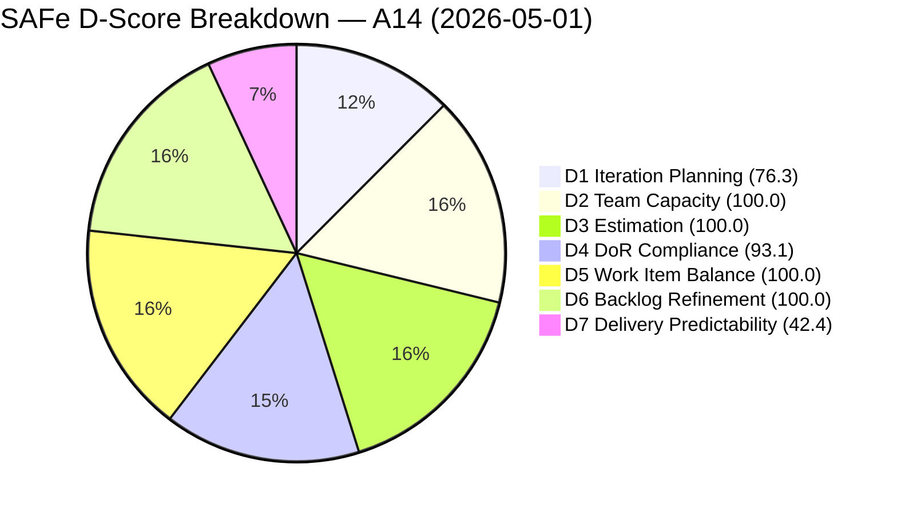
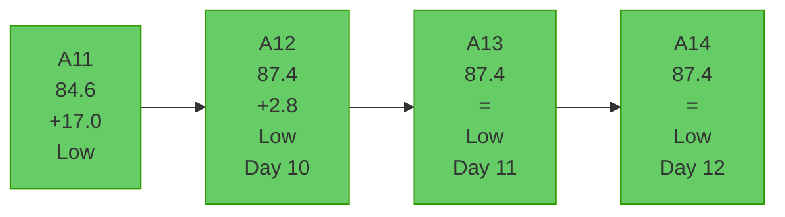
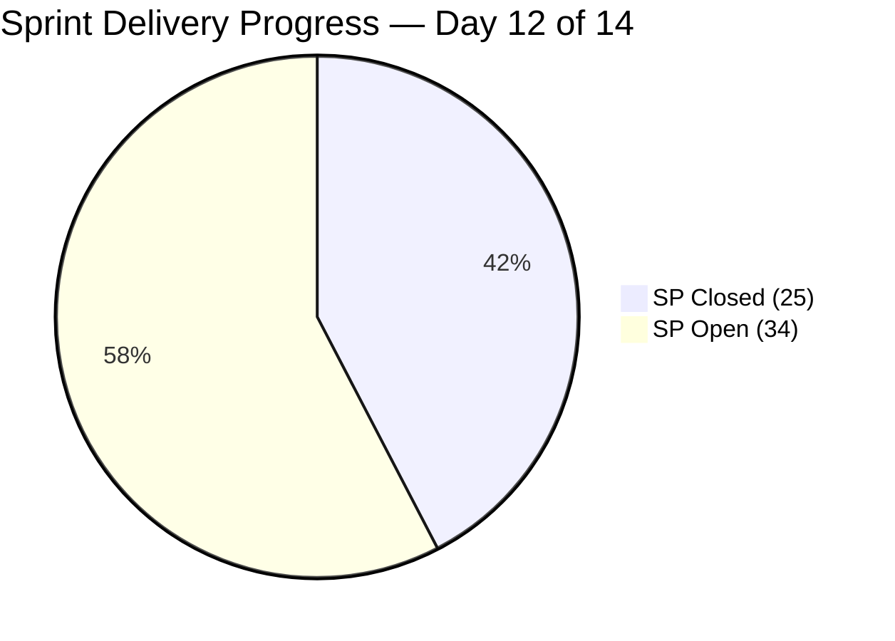
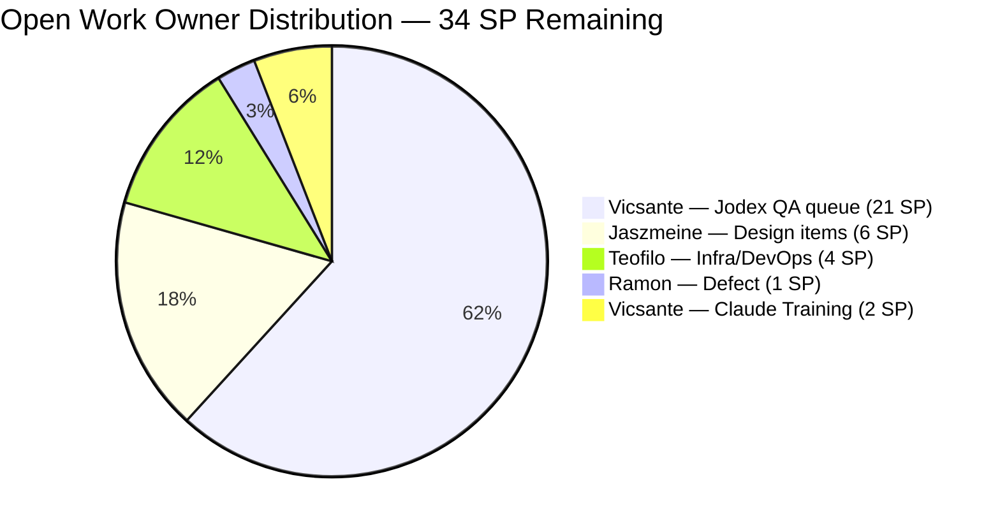
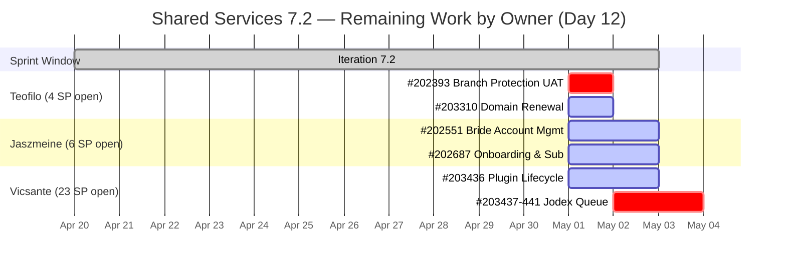

# Shared Services Team — SAFe Iteration Audit A14
**Date:** 2026-05-01 | **Sprint Day:** 12 of 14 | **Iteration:** 7.2 (Apr 20 – May 3, 2026)
**Auditor:** Claude Code (ADO SAFe Audit Skill v1) | **Prior Audit:** A13 (2026-04-30 09:03)

---

## 1. Audit Metadata

| Field | Value |
|---|---|
| **Audit ID** | A14 |
| **Report File** | `AUDIT_20260501_0907.md` |
| **Prior Audit** | A13 — `AUDIT_20260430_0903.md` (Overall 87.4) |
| **ADO Project** | Jairosoft Portfolio (`666bb99a-6acd-4999-bb34-efd0e4ea90dc`) |
| **ADO Team** | Shared Services Team (`bd9578fd-5773-48fc-bd80-988dfe5de806`) |
| **Iteration** | 7.2 (Apr 20 – May 3, 2026) |
| **Iteration ID** | `8edbe25f-fa4f-41b2-aaae-f3d5cf0e5b33` |
| **Sprint Day** | 12 of 14 |
| **Audit Date** | 2026-05-01 (PHT, UTC+8) |
| **Overall Score** | **87.4 — Low Risk** |
| **Risk Band** | Low (≥ 80) |
| **Visible Backlog Items** | 38 root (via `wit_list_backlog_work_items`) |
| **Iteration Items** | 29 root (IterationPath = 7.2, confirmed) |
| **Capacity Source** | `work_get_team_capacity` — 4 members configured |
| **Project Exceptions Applied** | None |

---

## 2. Executive Summary

| Field | Value |
|---|---|
| **Overall Score** | 87.4 — Low Risk |
| **Score vs Prior (A13)** | 87.4 → 87.4 (**=**) |
| **Sprint Day** | 12 of 14 |
| **Iteration** | 7.2 (Apr 20 – May 3, 2026) |
| **Items in Iteration** | 29 |
| **Committed SP** | 59 |
| **SP Closed** | 25 |
| **SP Remaining** | 34 |
| **Risk Band** | Low (≥ 80) — fourth consecutive Low Risk audit |

A14 holds at 87.4 overall. No new sprint closures were recorded since A13. All seven dimension scores are unchanged. The critical development today is **#203310 (jit.edu.ph Domain Renewal, 2 SP, Active)** received a comment on Apr 30 confirming "we just sent the receipt and all required documents for jit.edu.ph domain" — a strong signal that Teofilo has completed the deliverable and closure is imminent.

With 2 sprint days remaining (May 2–3), the window to improve D7 above 60 is narrow but achievable. The highest-probability targets remain: #202393 (Branch Protection, UAT Testing), #203310 (Domain Renewal, Active), and #202551/#202687 (Design Approved, Jaszmeine). Closing these 8 SP raises total closed SP to 33/59 → D7=55.9, overall=88.8. If Vicsante closes #203436 (Plugin Lifecycle, 5 SP, Active), D7 reaches 64.4 and overall crosses into the mid-89s.

---

## 3. Previous Audit Delta (A13 → A14)

| Dimension | A13 Score | A14 Score | Delta | Driver |
|---|---|---|---|---|
| D1 Iteration Planning | 76.3 | 76.3 | = | 29/38 — no backlog or iteration count changes |
| D2 Team Capacity | 100.0 | 100.0 | = | 4 members configured; no changes |
| D3 Estimation | 100.0 | 100.0 | = | All 28 point-eligible items estimated |
| D4 DoR Compliance | 93.1 | 93.1 | = | Same 2 failures (#202464 Closed, #203393 Active) |
| D5 Work Item Balance | 100.0 | 100.0 | = | Type mix healthy; Enabler 55.2% stays below 60% threshold |
| D6 Backlog Refinement | 100.0 | 100.0 | = | All 38 items fresh; 0 stale; 0 untouched |
| D7 Delivery Predictability | 42.4 | 42.4 | = | No new SP closed |
| **Overall** | **87.4** | **87.4** | **=** | Stable; positive leading indicators |

### Notable Developments Not Reflected in Score

| Item | Event | Significance |
|---|---|---|
| **#203310** (jit.edu.ph Domain Renewal) | Comment Apr 30: "sent receipt and all required documents" | Pre-closure signal — Teofilo likely completing today |
| **#203436** (Plugin Lifecycle, 5 SP) | Moved Active Apr 30 (confirmed in A13) | Vicsante engaged; Day 12 progress tracking |
| **#203393** (Claude Course Training, DoR failure) | No description update observed | Remediable D4 failure remains unaddressed |

---

## 4. Current Iteration Snapshot

**Active Iteration:** 7.2 | Apr 20 – May 3, 2026 | Sprint Day 12 of 14 (2 days remaining: May 2–3)

| Metric | Value |
|---|---|
| Current iteration root items | 29 |
| Visible backlog root items | 38 |
| Committed ratio | 76.3% |
| Committed story points | 59 SP |
| SP Closed | 25 SP (16 items) |
| SP Remaining (open) | 34 SP (13 items) |
| Delivery velocity (Day 12) | 25/59 = 42.4% |
| Team capacity (configured) | 15.5 h/day (4 members) |
| Remaining capacity (2 days) | ~31 hours total |

---

## 5. Work Item Analysis

### Closed Items (25 SP — Delivery Credit)

| ID | Title | Type | State | SP | Assigned | DoR |
|---|---|---|---|---|---|---|
| #200807 | Detect Claude CLI Availability in Terminal | User Story | Closed | 1 | Vicsante | ✅ |
| #200808 | Display Error Message if Claude CLI is Missing | User Story | Closed | 1 | Vicsante | ✅ |
| #200809 | Add Automated Tests for CLI Detection | User Story | Closed | 1 | Vicsante | ✅ |
| #202396 | GitHub Automation | Enabler | Closed | 2 | Teofilo | ✅ |
| #202464 | Auto Allies Blocker | Enabler | Closed | 2 | Teofilo | ❌ Desc ~18 chars |
| #203114 | Add new DevOps Users | Enabler | Closed | 2 | Teofilo | ✅ |
| #203115 | Add New Network and Footage Monitoring (Cebu) | Enabler | Closed | 2 | Teofilo | ✅ |
| #203116 | MAC Mini Setup for AI Agent | Enabler | Closed | 2 | Teofilo | ✅ |
| #203117 | Postgress New Access | Enabler | Closed | 2 | Teofilo | ✅ |
| #203229 | Backup Autoallies 4/23/2026 | Enabler | Closed | 2 | Teofilo | ✅ |
| #203231 | Enforce One-Reviewer Approval Rule on GitHub PRs | Enabler | Closed | 1 | Teofilo | ✅ |
| #203266 | JIT Machines Setup and Preparation | Enabler | Closed | 2 | Teofilo | ✅ |
| #203296 | Reactivate Grace Google Account & Transfer Files | Enabler | Closed | 1 | Teofilo | ✅ |
| #203312 | Adding IP whitelist in Colina DB | Enabler | Closed | 2 | Teofilo | ✅ |
| #203315 | Power App License for Jaszmine's Clock-in | Enabler | Closed | 1 | Teofilo | ✅ |
| #203374 | Backup for AutoAllies 4/28/2026 Blob Storage | Enabler | Closed | 1 | Teofilo | ✅ |

> #202459 (Spike, Closed) has null SP — excluded from committed/closed SP base.

**Total Closed SP: 25**

### Open / In-Progress Items (34 SP Remaining)

| ID | Title | Type | State | SP | Assigned | DoR | Day 12 Notes |
|---|---|---|---|---|---|---|---|
| #202393 | Branch Protection & Enforcement AutoAllies | Enabler | UAT Testing | 2 | Teofilo | ✅ | In UAT Testing since Apr 27 — 5 days; unblock today |
| #202551 | Bride Account Management | Design | Design Approved | 3 | Jaszmeine | ✅ | Design Approved — near-terminal; 2 sprint days to close |
| #202687 | Onboarding & Subscription Management | Design | Design Approved | 3 | Jaszmeine | ✅ | Design Approved — near-terminal |
| #203309 | GitHub token degraded — raseniero scope fix | Defect | Estimation | 1 | Ramon | ✅ | Unstarted at Day 12 — escalate or close |
| #203310 | jit.edu.ph Domain Renewal | Enabler | Active | 2 | Teofilo | ✅ | **Documents submitted Apr 30 — imminent closure** |
| #203393 | Claude Course Training | Spike | Active | 2 | Vicsante | ❌ | DoR failure; Desc < 30 chars — remediable |
| #203436 | Plugin Lifecycle & Extract Skill Verification | User Story | Active | 5 | Vicsante | ✅ | Active since Apr 30; Day 12 progress expected |
| #203437 | Plugin Generate Skill — Playwright Script Generation | User Story | Ready for Dev | 5 | Vicsante | ✅ | Queued after #203436 |
| #203438 | Generate Test Execution Report (/qa-ai:report) | User Story | Ready for Dev | 2 | Vicsante | ✅ | Queued |
| #203439 | Send Report via Outlook Email (/qa-ai:email) | User Story | Ready for Dev | 3 | Vicsante | ✅ | Queued |
| #203440 | Scheduled QA Pipeline Orchestration | User Story | Ready for Dev | 3 | Vicsante | ✅ | Queued |
| #203441 | Skill Plugin Development Environment Setup | Enabler | Ready for Dev | 3 | Vicsante | ✅ | Queued |

**Remaining open SP: 34** (no change from A13)

### Work Item Type Distribution (29 in-iteration items)

| Type | Count | Share | D5 Flag |
|---|---|---|---|
| Enabler | 16 | 55.2% | None — below 60% threshold |
| User Story | 8 | 27.6% | None — above 0% threshold |
| Spike | 2 | 6.9% | None — below 40% threshold |
| Design | 2 | 6.9% | None |
| Defect | 1 | 3.4% | None |

---

## 6. SAFe Compliance Scorecard

| Dimension | Score | Band | Formula |
|---|---|---|---|
| D1 Iteration Planning | 76.3 | Moderate | 29/38 × 100 |
| D2 Team Capacity | 100.0 | Low | 4/4 members configured (Teofilo 6h, Vicsante 6h, Jaszmeine 3h, Ramon 0.5h) |
| D3 Estimation | 100.0 | Low | 28/28 point-eligible items have SP |
| D4 DoR Compliance | 93.1 | Low | 27/29 pass DoR (#202464 Closed, #203393 Active — both fail) |
| D5 Work Item Balance | 100.0 | Low | No dominant type >60%; US present >0% |
| D6 Backlog Refinement | 100.0 | Low | 38/38 fresh; 0 stale; 0 untouched |
| D7 Delivery Predictability | 42.4 | High | 25/59 SP Closed × 100 |
| **Overall** | **87.4** | **Low** | (76.3+100+100+93.1+100+100+42.4)/7 = 611.8/7 |

### Scoring Formulas

- **D1:** round(29 / 38 × 100, 1) = **76.3**
- **D2:** round(4 / 4 × 100, 1) = **100.0**
- **D3:** round(28 / 28 × 100, 1) = **100.0** *(#202459 Spike null SP excluded)*
- **D4:** round(27 / 29 × 100, 1) = **93.1** *(2 failures: #202464, #203393)*
- **D5:** Enabler 55.2% (<60% → no −30); Spike 6.9% (<40% → no −20); US 27.6% (>0% → no −40) = **100.0**
- **D6:** 38/38 fresh; stale_90=0; stale_180=0; untouched_current=0 = **100.0**
- **D7:** round(25 / 59 × 100, 1) = **42.4**
- **Overall:** 611.8 / 7 = **87.4**

---

## 7. Dimension Findings

### D1 — Iteration Planning: 76.3 (Moderate)

29 of 38 visible backlog items committed to iteration 7.2. No changes from A13. The 9 uncommitted items include:
- **#202732** (Add to Flawless ADO as Stakeholder, 7.1) — in backlog; assigned to 7.1. Should be closed or migrated to 7.2/7.3 if still relevant.
- **Design items** (#202553, #202724–202727) — staged for future iterations.
- **Jodex PI7/PI8 backlog stories** — appropriately staged; should be committed at 7.3 planning.

To reach D1 ≥ 80 in 7.3, at least 7 of the 9 uncommitted items must be committed at planning. Priority: Jodex PI7 stories and Design items.

### D2 — Team Capacity: 100.0 (Low)

All four members active: Teofilo (6 h/day), Vicsante (6 h/day), Jaszmeine (3 h/day), Ramon (0.5 h/day). Total = 15.5 h/day. With 2 sprint days remaining, ~31 hours of capacity remain. Sufficient for Teofilo to close #202393 (UAT step) and #203310 (domain renewal), and Jaszmeine to close #202551 and #202687 (both Design Approved). No days off reported. D2 steady at 100.0 for four consecutive audits.

### D3 — Estimation: 100.0 (Low)

All 28 point-eligible items carry story points. #202459 (Spike, null SP, Closed) excluded from denominator per prior audit convention. D3 steady at 100.0 — the milestone achieved at A12 holds.

### D4 — DoR Compliance: 93.1 (Low)

Two persistent DoR failures:
- **#202464** (Auto Allies Blocker, Closed): Description ~18 non-whitespace chars. Item is Closed — cannot remediate. Serves as a standards reminder for future work item creation.
- **#203393** (Claude Course Training, Spike, Active): Description = "Claude Course Training" — 22 non-whitespace chars. **Immediately remediable.** Adding ≥8 chars to the description raises D4 to 96.6% (28/29). This is a one-minute fix.

### D5 — Work Item Balance: 100.0 (Low)

Type mix remains healthy. Enabler share (55.2%) stays below the 60% dominant-type threshold. User Story share (27.6%) ensures the −40 "no User Story" penalty does not apply. Spike share (6.9%) is well below 40%. D5 has been 100.0 for four consecutive audits.

### D6 — Backlog Refinement: 100.0 (Low)

All 38 visible backlog items are fresh (changed within 45 days). The oldest active item in the backlog was last modified Apr 15 (16 days ago). The mid-sprint additions (#203436–203441, added Apr 29) are all freshly updated. No items approaching the 90-day stale threshold. D6 steady at 100.0 for four consecutive audits.

### D7 — Delivery Predictability: 42.4 (High)

No new closures since A13. 34 SP remain open with only 2 days left. The positive signal is **#203310 documents submitted Apr 30** — this item is ready to close. #202393 has been in UAT Testing for 5 days (Apr 27–May 1); a reviewer sign-off is the only blocker.

**D7 closure scenarios from Day 12:**

| Scenario | Additional SP | Total Closed | D7 | Overall |
|---|---|---|---|---|
| Status quo (no new closures) | 0 | 25 | 42.4 | 87.4 |
| Close #202393 + #203310 (+4 SP) | 4 | 29 | 49.2 | 88.4 |
| Above + #202551 + #202687 (+6 SP) | 10 | 35 | 59.3 | 89.9 |
| Above + #203436 (+5 SP) | 15 | 40 | 67.8 | 91.1 |
| Above + #203441 (+3 SP) | 18 | 43 | 72.9 | 91.8 |
| Max realistic close (19 SP) | 19 | 44 | 74.6 | 92.0 |
| Full sprint closure | 34 | 59 | 100.0 | 95.6 |

Realistic end-of-sprint target: **35–43 SP closed, D7 = 59–73%, overall = 89–92.**

---

## 8. Risks and Bottlenecks

| Risk | Severity | Dimension | Action |
|---|---|---|---|
| **34 SP open at Day 12 with 2 days remaining** | Critical | D7 | Immediate: Teofilo closes #202393 + #203310; Jaszmeine closes #202551 + #202687 |
| **#202393 stalled in UAT Testing since Apr 27 (5 days)** | High | D7 | Identify UAT reviewer and get acceptance today. This item has been one sign-off away from Closed for 5 days. |
| **Vicsante queue: 21 SP with ~12h capacity remaining** | High | D7 | Only #203436 (Active) and possibly #203441 (setup-type) are achievable. #203437–203440 will spill to 7.3. |
| **#203309 (GitHub token defect, 1 SP) unstarted at Day 12** | High | D7 | Ramon: if fix is done, close today. If not, either assign to Teofilo or formally close as deferred. |
| **#203393 DoR failure unresolved (Day 12)** | Moderate | D4 | One-line description fix: expand to ≥30 chars. D4 rises 93.1 → 96.6. This has been flagged since A13. |
| **Mid-sprint scope injection (21 SP Day 10)** | Moderate | Process | SAFe retro flag for 7.3 planning kickoff. Sprint backlog additions after planning violate sprint protection principles. |
| **#202732 (7.1 item) in backlog** | Low | D1 | Close or reassign to 7.3 during sprint closeout. |

---

## 9. Prioritized Recommendations

1. **[CRITICAL — D7, today May 1]** Close #202393 (Branch Protection & Enforcement, 2 SP, UAT Testing — Teofilo). In UAT Testing for 5 days. Identify the UAT reviewer and get sign-off today. D7 rises to 45.8.

2. **[CRITICAL — D7, today May 1]** Close #203310 (jit.edu.ph Domain Renewal, 2 SP, Active — Teofilo). Documents were submitted Apr 30. If the domain renewal is confirmed, transition this item to Closed. D7 reaches 49.2 combined with Rec 1.

3. **[HIGH — D4, today May 1]** Expand #203393 (Claude Course Training) description to ≥ 30 non-whitespace characters. Example: append "for the Jodex QA team." This resolves the only remediable DoR failure, raising D4 from 93.1 → 96.6.

4. **[HIGH — D7, by May 2]** Close #202551 (Bride Account Management, 3 SP, Design Approved — Jaszmeine) and #202687 (Onboarding & Subscription, 3 SP, Design Approved — Jaszmeine). Both are near-terminal. With Recs 1–3, closing these adds 6 SP → D7 = 59.3, overall = 89.9.

5. **[HIGH — D7, by May 2]** Escalate #203309 (GitHub token defect, 1 SP, Estimation — Ramon). Unstarted at Day 12. If the scope fix is complete, close today. If not, reassign to Teofilo or formally defer to 7.3.

6. **[MODERATE — D7, by May 3]** Focus Vicsante on closing #203436 (Plugin Lifecycle, 5 SP, Active) before sprint end. If completed, D7 reaches 67.8 combined with Recs 1–4. If not closeable, ensure DoR is 100% for 7.3 carry-forward.

7. **[PLANNING — 7.3]** Run sprint retrospective on mid-sprint scope injection (#203436–203441, 21 SP added Day 10). Formally plan Vicsante's carry-forward queue into 7.3 from day one with full DoR and estimation.

8. **[PLANNING — D1/7.3]** During 7.3 sprint planning, commit the 9 uncommitted backlog items to achieve D1 ≥ 80. Priority: Jodex PI7 stories and Design items. Address #202732 (7.1 item) — close or reassign.

---

## 10. Evidence Gaps and Limitations

| Gap | Impact | Notes |
|---|---|---|
| No new SP closures confirmed (data from ADO as of audit time) | D7 may improve intraday if #203310 closes | Re-audit recommended May 2 or at sprint close (May 3) |
| #202459 (Spike, Closed) null SP | D3/D7 minor | Excluded from estimation and committed SP base per prior audit convention |
| #202464 (Enabler, Closed) DoR failure | D4 persistent | Closed — cannot remediate; sets description quality standards going forward |
| Mid-sprint scope injection #203436–203441 (Day 10) | D7 structural | 21 SP added post-planning violates sprint protection; flagged for retrospective |
| Committed SP base for D7 | Minor | Derived from sum of estimated iteration root items; no formal sprint planning ceremony record |
| #202732 (7.1 item) in backlog view | D1 minor | Assigned to 7.1; appears in 7.2 backlog count; minor denominator inflation |

---

## 11. Score Visualizations

---

*Audit produced by Claude Code — ADO SAFe Audit Skill v1. SAFe 6.0 framework. Next audit recommended: 2026-05-02 (penultimate day) or 2026-05-03 (closing audit).*
