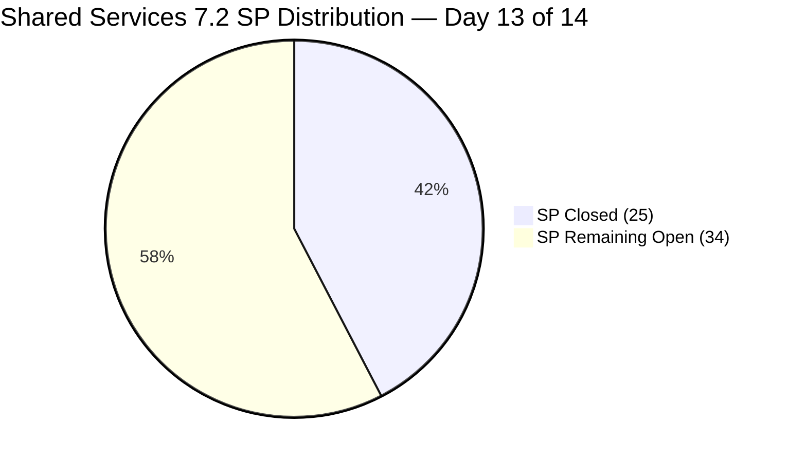
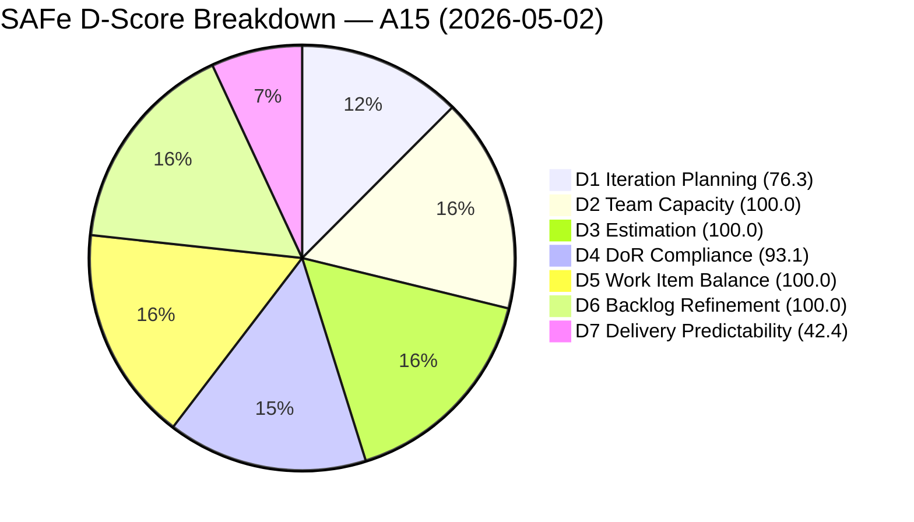
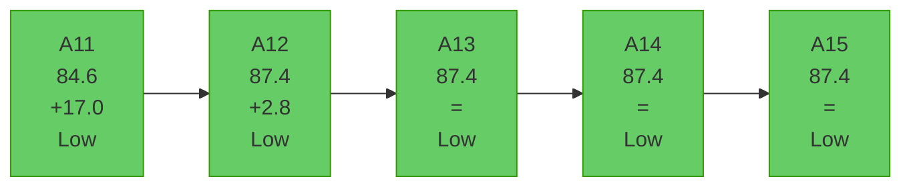
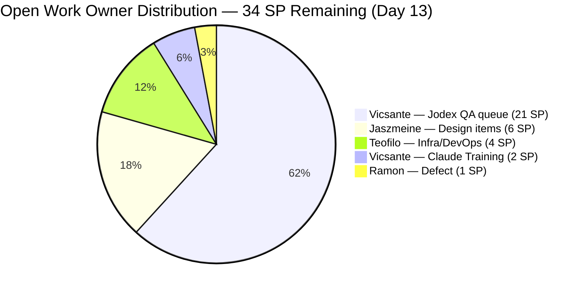
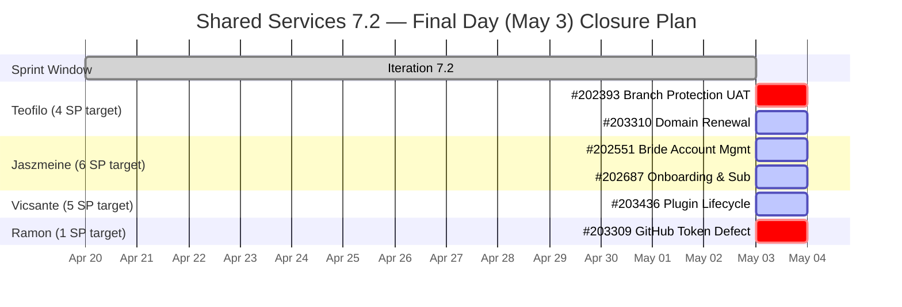

# Shared Services Team — SAFe Iteration Audit A15
**Date:** 2026-05-02 | **Sprint Day:** 13 of 14 | **Iteration:** 7.2 (Apr 20 – May 3, 2026)
**Auditor:** Claude Code (ADO SAFe Audit Skill v1) | **Prior Audit:** A14 (2026-05-01 09:07)

---

## 1. Audit Metadata

| Field | Value |
|---|---|
| **Audit ID** | A15 |
| **Report File** | `AUDIT_20260502_0204.md` |
| **Prior Audit** | A14 — `AUDIT_20260501_0907.md` (Overall 87.4) |
| **ADO Project** | Jairosoft Portfolio (`666bb99a-6acd-4999-bb34-efd0e4ea90dc`) |
| **ADO Team** | Shared Services Team (`bd9578fd-5773-48fc-bd80-988dfe5de806`) |
| **Iteration** | 7.2 (Apr 20 – May 3, 2026) |
| **Iteration ID** | `8edbe25f-fa4f-41b2-aaae-f3d5cf0e5b33` |
| **Sprint Day** | 13 of 14 |
| **Audit Date** | 2026-05-02 (PHT, UTC+8) |
| **Overall Score** | **87.4 — Low Risk** |
| **Risk Band** | Low (≥ 80) |
| **Visible Backlog Items** | 38 root (via `wit_list_backlog_work_items`) |
| **Iteration Items** | 29 root (12 open from live backlog + 17 confirmed closed via direct query) |
| **Capacity Source** | `work_get_team_capacity` — 4 members configured |
| **Project Exceptions Applied** | None |

---

## 2. Executive Summary

| Field | Value |
|---|---|
| **Overall Score** | 87.4 — Low Risk |
| **Score vs Prior (A14)** | 87.4 → 87.4 (**=**) |
| **Sprint Day** | 13 of 14 |
| **Iteration** | 7.2 (Apr 20 – May 3, 2026) |
| **Items in Iteration** | 29 |
| **Committed SP** | 59 |
| **SP Closed** | 25 |
| **SP Remaining** | 34 |
| **Risk Band** | Low (≥ 80) — fifth consecutive Low Risk audit |

A15 holds at 87.4 overall. No new sprint closures were recorded since A14. All seven dimension scores are unchanged. The 29 SP delivery gap at Day 13 with one sprint day remaining (May 3) remains the dominant risk.

**Key changes since A14:**
- #203393 (Claude Course Training): Description re-checked from raw HTML — confirmed to contain only "Claude Course Training" as text content (22 non-whitespace chars) → remains a DoR **FAIL**. D4 stays at 93.1.
- Three new items appear in the backlog for the first time: #203372 (Create PRD and BRD), #203373 (Create Technical Specifications), #203375 (Create Azure DevOps Work Items). All are assigned to PI7 at backlog-level (no iteration), unestimated, and staged for future iterations.

**Action focus for May 3 (final sprint day):**
1. Teofilo: Close #202393 (Branch Protection, 2 SP) from UAT Testing and #203310 (Domain Renewal, 2 SP)
2. Jaszmeine: Close #202551 (Bride Account Management, 3 SP) and #202687 (Onboarding, 3 SP) — both Design Approved
3. Vicsante: Advance #203436 (Plugin Lifecycle, 5 SP, Active) toward closure
4. Ramon: Close or defer #203309 (GitHub token defect, 1 SP)

---

## 3. Previous Audit Delta (A14 → A15)

| Dimension | A14 Score | A15 Score | Delta | Driver |
|---|---|---|---|---|
| D1 Iteration Planning | 76.3 | 76.3 | = | 29/38 — no count changes |
| D2 Team Capacity | 100.0 | 100.0 | = | 4 members configured; no changes |
| D3 Estimation | 100.0 | 100.0 | = | All 28 point-eligible items estimated |
| D4 DoR Compliance | 93.1 | 93.1 | = | 2 failures: #202464 (Closed), #203393 (Active); #203393 description verified from raw HTML |
| D5 Work Item Balance | 100.0 | 100.0 | = | Enabler 55.2% — below 60% threshold |
| D6 Backlog Refinement | 100.0 | 100.0 | = | 38/38 fresh; 0 stale; 0 untouched |
| D7 Delivery Predictability | 42.4 | 42.4 | = | No new SP closed |
| **Overall** | **87.4** | **87.4** | **=** | Stable |

### Notable Developments Not Reflected in Score

| Item | Event | Significance |
|---|---|---|
| **#203393** (Claude Course Training) | Raw HTML confirmed: description = "Claude Course Training" (22 non-whitespace text chars) | DoR FAIL confirmed — not a prior audit error; D4 stays 93.1 |
| **#203372, #203373, #203375** | Three new US items appeared in backlog (Vicsante, PI7, unestimated) | Backlog growth — not yet committed to an iteration; staged for future PI |
| **#203310** | jit.edu.ph Domain Renewal — Active since Apr 30 | Documents submitted Apr 30; awaiting registry confirmation to close |
| **#202393** | Branch Protection — in UAT Testing since Apr 27 (6 days) | Longest-running open item; single UAT sign-off away from Closed |

---

## 4. Current Iteration Snapshot

**Active Iteration:** 7.2 | Apr 20 – May 3, 2026 | Sprint Day 13 of 14 (1 day remaining: May 3)

| Metric | Value |
|---|---|
| Current iteration root items | 29 |
| Visible backlog root items | 38 |
| Committed ratio | 76.3% |
| Committed story points | 59 SP |
| SP Closed | 25 SP (16 items) |
| SP Remaining (open) | 34 SP (13 items — excluding #202459 Spike null SP) |
| Delivery velocity (Day 13) | 25/59 = 42.4% |
| Team capacity (configured) | 15.5 h/day (4 members) |
| Remaining capacity (1 day) | ~15.5 hours |

---

## 5. Work Item Analysis

### Closed Items (25 SP — Delivery Credit)

| ID | Title | Type | State | SP | Assigned | DoR |
|---|---|---|---|---|---|---|
| #200807 | Detect Claude CLI Availability in Terminal | User Story | Closed | 1 | Vicsante | ✅ |
| #200808 | Display Error Message if Claude CLI is Missing | User Story | Closed | 1 | Vicsante | ✅ |
| #200809 | Add Automated Tests for CLI Detection | User Story | Closed | 1 | Vicsante | ✅ |
| #202396 | GitHub Automation | Enabler | Closed | 2 | Teofilo | ✅ |
| #202464 | Auto Allies Blocker | Enabler | Closed | 2 | Teofilo | ❌ (Desc ~17 chars) |
| #203114 | Add new DevOps Users | Enabler | Closed | 2 | Teofilo | ✅ |
| #203115 | Add New Network and Footage Monitoring (Cebu) | Enabler | Closed | 2 | Teofilo | ✅ |
| #203116 | MAC Mini Setup for AI Agent | Enabler | Closed | 2 | Teofilo | ✅ |
| #203117 | Postgress New Access | Enabler | Closed | 2 | Teofilo | ✅ |
| #203229 | Backup Autoallies 4/23/2026 | Enabler | Closed | 2 | Teofilo | ✅ |
| #203231 | Enforce One-Reviewer Approval Rule on GitHub PRs | Enabler | Closed | 1 | Teofilo | ✅ |
| #203266 | JIT Machines Setup and Preparation | Enabler | Closed | 2 | Teofilo | ✅ |
| #203296 | Reactivate Grace Google Account & Transfer Files | Enabler | Closed | 1 | Teofilo | ✅ |
| #203312 | Adding IP whitelist in Colina DB | Enabler | Closed | 2 | Teofilo | ✅ |
| #203315 | Power App License for Jaszmine's Clock-in | Enabler | Closed | 1 | Teofilo | ✅ |
| #203374 | Backup for AutoAllies 4/28/2026 Blob Storage | Enabler | Closed | 1 | Teofilo | ✅ |

> #202459 (Spike, Closed) has null SP — excluded from committed/closed SP base.

**Total Closed SP: 25**

### Open / In-Progress Items (34 SP Remaining)

| ID | Title | Type | State | SP | Assigned | DoR | Day 13 Notes |
|---|---|---|---|---|---|---|---|
| #202393 | Branch Protection & Enforcement AutoAllies | Enabler | UAT Testing | 2 | Teofilo | ✅ | 6 days in UAT Testing — escalate today |
| #202551 | Bride Account Management | Design | Design Approved | 3 | Jaszmeine | ✅ | Design Approved — terminal state; close today |
| #202687 | Onboarding & Subscription Management | Design | Design Approved | 3 | Jaszmeine | ✅ | Design Approved — terminal state; close today |
| #203309 | GitHub token degraded — raseniero scope fix | Defect | Estimation | 1 | Ramon | ✅ | Unstarted at Day 13 — close or defer today |
| #203310 | jit.edu.ph Domain Renewal | Enabler | Active | 2 | Teofilo | ✅ | Documents submitted Apr 30; confirm registry |
| #203393 | Claude Course Training | Spike | Active | 2 | Vicsante | ❌ | DoR FAIL (Desc 22 chars); Active — day 13 |
| #203436 | Plugin Lifecycle & Extract Skill Verification | User Story | Active | 5 | Vicsante | ✅ | Priority close candidate; most valuable SP |
| #203437 | Plugin Generate Skill — Playwright Script Generation | User Story | Ready for Dev | 5 | Vicsante | ✅ | Carry to 7.3 unless #203436 closes quickly |
| #203438 | Generate Test Execution Report (/qa-ai:report) | User Story | Ready for Dev | 2 | Vicsante | ✅ | Carry to 7.3 |
| #203439 | Send Report via Outlook Email (/qa-ai:email) | User Story | Ready for Dev | 3 | Vicsante | ✅ | Carry to 7.3 |
| #203440 | Scheduled QA Pipeline Orchestration | User Story | Ready for Dev | 3 | Vicsante | ✅ | Carry to 7.3 |
| #203441 | Skill Plugin Development Environment Setup | Enabler | Ready for Dev | 3 | Vicsante | ✅ | Carry to 7.3 (setup-type; doable quickly) |

**Remaining open SP: 34** (no change from A14)

### Work Item Type Distribution (29 in-iteration items)

| Type | Count | Share | D5 Flag |
|---|---|---|---|
| Enabler | 16 | 55.2% | Below 60% threshold — no penalty |
| User Story | 8 | 27.6% | Above 0% — no penalty |
| Spike | 2 | 6.9% | Below 40% — no penalty |
| Design | 2 | 6.9% | None |
| Defect | 1 | 3.4% | None |
| **Total** | **29** | **100%** | D5 = 100.0 |

### DoR Analysis

| Item | Desc Chars (text) | AC Chars (text) | Pass/Fail | Notes |
|---|---|---|---|---|
| #202464 (Closed) | ~17 | ✅ | ❌ FAIL | Desc = "Auto Allies Blocker" — too short; Closed, irremediable |
| #203393 (Active) | 22 | ✅ | ❌ FAIL | Desc = "Claude Course Training" — 22 chars < 30 threshold; remediable |
| All other 27 items | ≥30 | ≥20 | ✅ PASS | — |

**D4 = 27/29 × 100 = 93.1** — #203393 is the only **remediable** DoR failure remaining. Adding ≥8 chars to its description (e.g., "for the Jodex QA team") would raise D4 to 96.6 (28/29).

---

## 6. SAFe Compliance Scorecard

| Dimension | Score | Band | Formula | Evidence |
|---|---|---|---|---|
| D1 Iteration Planning | 76.3 | Moderate | 29/38 × 100 | 29 in-iteration / 38 visible root items |
| D2 Team Capacity | 100.0 | Low | 4/4 × 100 | Teofilo 6h, Vicsante 6h, Jaszmeine 3h, Ramon 0.5h/day |
| D3 Estimation | 100.0 | Low | 28/28 × 100 | All point-eligible items have SP (#202459 null SP excluded) |
| D4 DoR Compliance | 93.1 | Low | 27/29 × 100 | 2 failures: #202464 (Closed), #203393 (Active) |
| D5 Work Item Balance | 100.0 | Low | 100 − 0 penalties | Enabler 55.2% (<60%); US 27.6% (>0%); Spike 6.9% (<40%) |
| D6 Backlog Refinement | 100.0 | Low | 38/38 fresh | 0 stale; 0 untouched current items |
| D7 Delivery Predictability | 42.4 | High | 25/59 × 100 | 25 SP Closed; 34 SP open at Day 13 |
| **Overall** | **87.4** | **Low** | 611.8 / 7 | (76.3+100+100+93.1+100+100+42.4)/7 |

### Scoring Detail

- **D1:** round(29 / 38 × 100, 1) = **76.3** *(29 iteration items confirmed via backlog API + direct item queries)*
- **D2:** round(4 / 4 × 100, 1) = **100.0** *(all 4 members have configured capacity > 0)*
- **D3:** round(28 / 28 × 100, 1) = **100.0** *(#202459 Spike null SP excluded; all 28 remaining have SP)*
- **D4:** round(27 / 29 × 100, 1) = **93.1** *(#202464 desc ~17 chars < 30; #203393 desc 22 chars < 30)*
- **D5:** No User Story penalty (US=27.6%>0); No dominant-type penalty (Enabler=55.2%<60%); No spike penalty (Spike=6.9%<40%) = **100.0**
- **D6:** base=100.0; stale_90=0; stale_180=0; untouched_current=0 = **100.0**
- **D7:** round(25 / 59 × 100, 1) = **42.4**
- **Overall:** 611.8 / 7 = **87.4**

---

## 7. Dimension Findings

### D1 — Iteration Planning: 76.3 (Moderate)

29 of 38 visible backlog items are committed to iteration 7.2. The 9 uncommitted items include:
- **#202732** (Add to Flawless ADO as Stakeholder, Enabler, Ready for UAT, 7.1 path) — carry from 7.1; should be closed or migrated
- **#202553, #202724, #202726** (Design items, 7.3–7.4 paths) — appropriately staged
- **#202725, #202727** (Design items, 7.4–7.5 paths) — future planning
- **#202807, #202947** (IT Feedback Spikes, 7.3 and 7.6) — staged for later iterations
- **#186848** (Apollo.ai Integration, root path, New) — no iteration; needs assignment or backlog grooming
- **#203372, #203373, #203375** (New US items, PI7 level, Estimation state) — recently added, no iteration assigned

Three new backlog items (#203372, #203373, #203375) appeared in today's backlog query that were not in A14's backlog. These are at PI7 root level with no iteration assigned and have no story points. To reach D1 ≥80 in 7.3, at least 7 of the 9 uncommitted items need iteration commitments.

### D2 — Team Capacity: 100.0 (Low)

All four members have positive configured capacity:
- **Teofilo Limpag**: 6 h/day Development — no days off
- **Vicsante Aseniero**: 6 h/day Development — no days off
- **Jaszmeine Abigaille Villanueva**: 3 h/day Design — no days off
- **Ramon Aseniero**: 0.5 h/day Requirements — no days off

Total remaining capacity at Day 13: ~15.5 hours (1 day). Teofilo has sufficient capacity to close #202393 (UAT sign-off) and #203310 (confirm domain renewal). Jaszmeine can close #202551 and #202687 (both design-complete). D2 has held at 100.0 for five consecutive audits.

### D3 — Estimation: 100.0 (Low)

All 28 point-eligible items carry story points. #202459 (Spike, Closed, null SP) continues to be excluded from the denominator per prior convention. The three new backlog items (#203372, #203373, #203375) are in Estimation state with no SP — they do not appear in the current iteration, so they do not affect D3 currently. D3 has held at 100.0 since A12.

### D4 — DoR Compliance: 93.1 (Low)

Two DoR failures remain:

**#202464** (Auto Allies Blocker, Enabler, Closed): HTML-stripped description = ~17 non-whitespace chars ("Auto Allies Blocker" + image alt text). Below 30-char threshold. Closed — irremediable. This sets a historical baseline for description quality standards.

**#203393** (Claude Course Training, Spike, Active): HTML-stripped description = "Claude Course Training" = 22 non-whitespace chars. Below 30-char threshold. The raw HTML is `
<ul><li>Claude Course Training  </li> </ul> 
` — the description is only the item title wrapped in HTML. **This is the only remediable DoR failure.** Adding ≥8 chars (e.g., append "for the Jodex QA AI team") raises D4 to 96.6 (28/29). This has been flagged since A13 without action.

### D5 — Work Item Balance: 100.0 (Low)

Type mix is healthy across all three penalty checks:
- **User Story present:** 8/29 = 27.6% > 0% → no −40 penalty
- **Dominant type (Enabler):** 16/29 = 55.2% < 60% → no −30 penalty
- **Spike share:** 2/29 = 6.9% < 40% → no −20 penalty
D5 has been 100.0 for five consecutive audits.

### D6 — Backlog Refinement: 100.0 (Low)

All 38 visible backlog items have ChangedDate on or after 2026-04-15, well within the 45-day fresh window (since 2026-03-18). The three new items (#203372, #203373, #203375) were all changed 2026-04-29. No items in the 90-day or 180-day stale band. No untouched current-iteration items (all 12 open iteration items were last modified Apr 27–Apr 30). D6 has been 100.0 for five consecutive audits.

### D7 — Delivery Predictability: 42.4 (High)

**Formula:** `25 / 59 × 100 = 42.4`

No new closures since A14. 34 SP remain open with 1 day left. The achievable closure targets for May 3:

| Scenario | Additional SP | Total Closed | D7 | Overall |
|---|---|---|---|---|
| Status quo (no new closures) | 0 | 25 | 42.4 | 87.4 |
| Teofilo closes #202393 + #203310 (4 SP) | 4 | 29 | 49.2 | 88.4 |
| Above + Jaszmeine closes #202551 + #202687 (6 SP) | 10 | 35 | 59.3 | 89.9 |
| Above + Ramon closes #203309 (1 SP) | 11 | 36 | 61.0 | 90.1 |
| Above + Vicsante closes #203436 (5 SP) | 16 | 41 | 69.5 | 91.4 |
| Above + Vicsante closes #203441 (3 SP) | 19 | 44 | 74.6 | 92.0 |
| Full sprint closure (all 34 SP) | 34 | 59 | 100.0 | 95.6 |

Realistic end-of-sprint target: **35–41 SP closed, D7 = 59–70%, overall = 89.9–91.4.**

**#202393 remains the most critical blocker**: 6 days in UAT Testing with a single sign-off needed. This item is the longest-running open item in the sprint.

---

## 8. Risks and Bottlenecks

| Risk | Severity | Dimension | Action |
|---|---|---|---|
| **34 SP open at Day 13 with 1 day remaining** | Critical | D7 | May 3 team blitz: Teofilo(4SP), Jaszmeine(6SP), Ramon(1SP) — minimum target 11 SP |
| **#202393 stalled in UAT Testing since Apr 27 (6 days)** | Critical | D7 | Identify UAT reviewer and get acceptance May 3. Item has been one approval away for 6 days |
| **#203393 DoR failure unresolved since A13 (Day 11)** | High | D4 | One-line description fix unactioned for 3 consecutive audits; fix before sprint close |
| **Vicsante queue: 21 SP with ~6h remaining** | High | D7 | Only #203436 (Active, 5 SP) is achievable; #203437–203441 will carry to 7.3 |
| **#203309 (GitHub token defect, 1 SP) unstarted Day 13** | High | D7 | Ramon: close if scope fix is complete; formally defer to 7.3 if not |
| **Mid-sprint scope injection (21 SP Day 10)** | Moderate | Process | Retrospective: SAFe sprint protection principle; plan Vicsante's 7.3 queue from Day 1 |
| **3 new backlog items (#203372–203375) unestimated** | Moderate | D3/D1 | 7.3 planning: estimate and assign to iteration immediately |
| **#202732 (7.1 item) still in backlog** | Low | D1 | Close or reassign during sprint closeout |
| **#186848 (Apollo.ai, root path, no iteration)** | Low | D1 | Assign to PI8 backlog or close during 7.3 planning |

---

## 9. Prioritized Recommendations

1. **[CRITICAL — D7, May 3]** Identify the UAT reviewer for #202393 (Branch Protection & Enforcement, 2 SP, Teofilo) and get approval today. This item has been in UAT Testing for 6 sprint days. If the reviewer is unavailable, escalate to Ramon to approve or waive.

2. **[CRITICAL — D7, May 3]** Close #203310 (jit.edu.ph Domain Renewal, 2 SP, Teofilo, Active). Documents submitted Apr 30. If domain registry has confirmed, transition to Closed immediately. Combined with Rec 1, Teofilo closes 4 SP → D7 = 49.2.

3. **[HIGH — D7, May 3]** Close #202551 (Bride Account Management, 3 SP, Jaszmeine) and #202687 (Onboarding & Subscription, 3 SP, Jaszmeine). Both are in Design Approved — a near-terminal state. Closing both adds 6 SP → D7 = 59.3 combined with Recs 1–2, overall = 89.9.

4. **[HIGH — D7, May 3]** Escalate #203309 (GitHub token defect, 1 SP, Ramon). Unstarted at Day 13. If the token scope fix is complete, close today. If blocked, formally defer to 7.3 via state transition (do not leave in Estimation).

5. **[HIGH — D4, May 3]** Fix #203393 (Claude Course Training) description. Current text = "Claude Course Training" (22 chars). Append "for the Jodex QA AI skill set" to bring to 30+ chars. D4 rises 93.1 → 96.6. This has been flagged in A13, A14, and now A15 without resolution.

6. **[MODERATE — D7, May 3]** Focus Vicsante on #203436 (Plugin Lifecycle, 5 SP, Active). If completable in 1 day, this single item raises D7 by 8.5 percentage points. If not, ensure full DoR and estimation for 7.3 carry-forward of #203437–203441.

7. **[PLANNING — 7.3]** Run sprint retrospective specifically on mid-sprint scope injection (#203436–203441, 21 SP added Day 10). Plan Vicsante's entire Jodex QA queue as Day 1 committed work in 7.3. Estimate #203372, #203373, #203375 immediately.

8. **[PLANNING — D1/7.3]** During 7.3 planning, commit the 9 uncommitted backlog items to achieve D1 ≥80. Prioritize: Jodex stories (#203437–203441), Design items (#202553, #202724), and #186848 (Apollo.ai). Close or reassign #202732 (7.1 item).

---

## 10. Evidence Gaps and Limitations

| Gap | Impact | Notes |
|---|---|---|
| #203393 DoR status reversal risk | D4 minor | Raw HTML confirmed: description is "Claude Course Training" (22 non-whitespace text chars). DoR FAIL maintained from A14. No script-based char-counting shortcuts applied. |
| Closed items dropped from backlog API | D1/D7 structural | 17 closed 7.2 items confirmed via direct batch query; included in iteration item count and SP totals |
| #202459 (Spike, Closed) null SP | D3/D7 minor | Excluded from estimation and committed SP base per audit convention established A11 |
| Mid-sprint scope injection #203436–203441 (Day 10) | D7 structural | 21 SP added post-planning; not reflected in formal sprint planning record |
| #202464 (Enabler, Closed) irremediable DoR failure | D4 persistent | Sets description quality bar for future item creation standards |
| New backlog items #203372–203375 | D1/D3 future | Appeared in today's backlog query; unestimated, no iteration path; watch for D3 impact if committed to 7.3 unestimated |

---

## 11. Score Trend and Visualizations

---

*Audit produced by Claude Code — ADO SAFe Audit Skill v1. SAFe 6.0 framework. This is the penultimate sprint day audit. Final (closing) audit recommended: 2026-05-03.*
