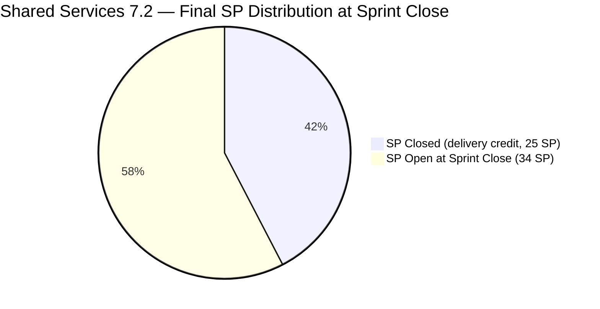
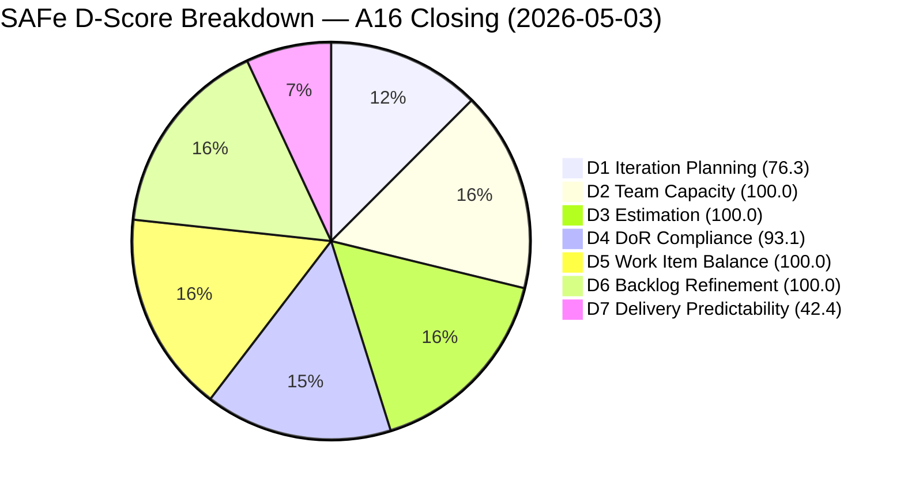
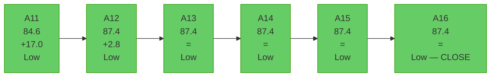
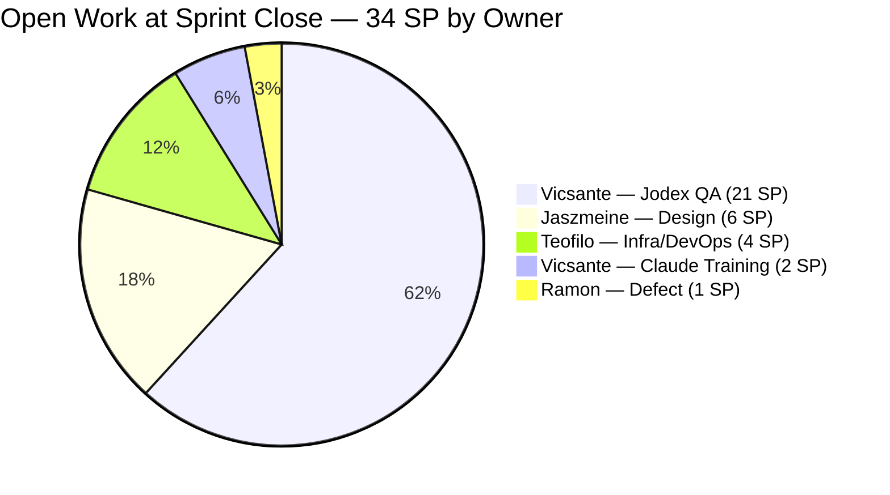

# Shared Services Team — SAFe Iteration Audit A16
**Date:** 2026-05-03 | **Sprint Day:** 14 of 14 (CLOSING DAY) | **Iteration:** 7.2 (Apr 20 – May 3, 2026)
**Auditor:** Claude Code (ADO SAFe Audit Skill v1) | **Prior Audit:** A15 (2026-05-02 02:04)

---

## 1. Audit Metadata

| Field | Value |
|---|---|
| **Audit ID** | A16 |
| **Report File** | `AUDIT_20260503_0202.md` |
| **Prior Audit** | A15 — `AUDIT_20260502_0204.md` (Overall 87.4) |
| **ADO Project** | Jairosoft Portfolio (`666bb99a-6acd-4999-bb34-efd0e4ea90dc`) |
| **ADO Team** | Shared Services Team (`bd9578fd-5773-48fc-bd80-988dfe5de806`) |
| **Iteration** | 7.2 (Apr 20 – May 3, 2026) |
| **Iteration ID** | `8edbe25f-fa4f-41b2-aaae-f3d5cf0e5b33` |
| **Sprint Day** | 14 of 14 — **CLOSING DAY** |
| **Audit Date** | 2026-05-03 (PHT, UTC+8) |
| **Overall Score** | **87.4 — Low Risk** |
| **Risk Band** | Low (≥ 80) |
| **Visible Backlog Items** | 38 root (via `wit_list_backlog_work_items`) |
| **Iteration Items** | 29 root (17 Closed + 12 open) |
| **Capacity Source** | `work_get_team_capacity` — 4 members configured |
| **Project Exceptions Applied** | None |

---

## 2. Executive Summary

| Field | Value |
|---|---|
| **Overall Score** | 87.4 — Low Risk |
| **Score vs Prior (A15)** | 87.4 → 87.4 (**=**) |
| **Sprint Day** | 14 of 14 — CLOSING DAY |
| **Iteration** | 7.2 (Apr 20 – May 3, 2026) |
| **Items in Iteration** | 29 |
| **Committed SP** | 59 |
| **SP Closed** | 25 |
| **SP Remaining Open** | 34 (12 items) |
| **Risk Band** | Low (≥ 80) — sixth consecutive Low Risk audit |

**This is the closing audit for Iteration 7.2.** Sprint ends today, May 3. No new story point closures were recorded since A15 (May 2). The 34 SP delivery gap persists at sprint close — representing the work of Vicsante's mid-sprint Jodex QA queue (21 SP added Day 10), two Jaszmeine design items (6 SP), Teofilo's infrastructure items (4 SP), and Ramon's defect (1 SP).

**Iteration 7.2 closes at 87.4 overall (Low Risk)**, driven by strong D2/D3/D5/D6 performance, but carrying a persistent D7 of 42.4% — the fifth consecutive audit without improvement since A12 (Day 8).

**Critical unresolved items as sprint closes:**
- #202393 (Branch Protection): 7 days in UAT Testing — needs one approval
- #203393 (Claude Course Training): DoR failure unfixed for 4 consecutive audits
- #203309 (GitHub token defect): Unstarted at sprint close

The team's structural discipline (100% DoR for 27/29 items, 100% estimation, healthy type mix) positions it well for 7.3, but delivery velocity must be addressed.

---

## 3. Previous Audit Delta (A15 → A16)

| Dimension | A15 Score | A16 Score | Delta | Driver |
|---|---|---|---|---|
| D1 Iteration Planning | 76.3 | 76.3 | = | 29/38 — no count changes |
| D2 Team Capacity | 100.0 | 100.0 | = | 4 members configured; no changes |
| D3 Estimation | 100.0 | 100.0 | = | All 28 point-eligible items estimated |
| D4 DoR Compliance | 93.1 | 93.1 | = | 2 failures: #202464 (Closed), #203393 (Active) |
| D5 Work Item Balance | 100.0 | 100.0 | = | Enabler 55.2% — below 60% threshold |
| D6 Backlog Refinement | 100.0 | 100.0 | = | All 38 fresh; 0 stale; 0 untouched |
| D7 Delivery Predictability | 42.4 | 42.4 | = | No new SP closed at sprint close |
| **Overall** | **87.4** | **87.4** | **=** | Unchanged — sprint ends flat |

### Work Item State Changes (A15 → A16)

No state changes detected across any of the 12 open iteration items between A15 (May 2) and A16 (May 3). All items carry forward exactly the same state as recorded in A15:

| ID | Title | Type | State (A16) | SP | Notes |
|---|---|---|---|---|---|
| #202393 | Branch Protection & Enforcement AutoAllies | Enabler | UAT Testing | 2 | **7 days in UAT** — critical blocker |
| #202551 | Bride Account Management | Design | Design Approved | 3 | Carry to 7.3 |
| #202687 | Onboarding & Subscription Management | Design | Design Approved | 3 | Carry to 7.3 |
| #203309 | GitHub token degraded — raseniero scope fix | Defect | Estimation | 1 | Unstarted — defer to 7.3 |
| #203310 | jit.edu.ph Domain Renewal | Enabler | Active | 2 | Documents submitted Apr 30; pending registry |
| #203393 | Claude Course Training | Spike | Active | 2 | DoR failure unfixed — 4 audits |
| #203436 | Plugin Lifecycle & Extract Skill Verification | User Story | Active | 5 | Carry to 7.3 |
| #203437 | Plugin Generate Skill — Playwright Script Generation | User Story | Ready for Dev | 5 | Carry to 7.3 |
| #203438 | Generate Test Execution Report (/qa-ai:report) | User Story | Ready for Dev | 2 | Carry to 7.3 |
| #203439 | Send Report via Outlook Email (/qa-ai:email) | User Story | Ready for Dev | 3 | Carry to 7.3 |
| #203440 | Scheduled QA Pipeline Orchestration | User Story | Ready for Dev | 3 | Carry to 7.3 |
| #203441 | Skill Plugin Development Environment Setup | Enabler | Ready for Dev | 3 | Carry to 7.3 |

---

## 4. Current Iteration Snapshot

**Active Iteration:** 7.2 | Apr 20 – May 3, 2026 | **Sprint Day 14 of 14 — CLOSING DAY**

| Metric | Value |
|---|---|
| Current iteration root items | 29 |
| Visible backlog root items | 38 |
| Committed ratio | 76.3% |
| Committed story points | 59 SP |
| SP Closed (delivery credit) | 25 SP (17 items) |
| SP Remaining open at sprint close | 34 SP (12 items) |
| Delivery velocity at close | 25/59 = 42.4% |
| Team capacity configured | 15.5 h/day (4 members) |

---

## 5. Work Item Analysis

### Closed Items — Delivery Credit (25 SP)

| ID | Title | Type | State | SP | Assignee | DoR |
|---|---|---|---|---|---|---|
| #200807 | Detect Claude CLI Availability in Terminal | User Story | Closed | 1 | Vicsante | ✅ |
| #200808 | Display Error Message if Claude CLI is Missing | User Story | Closed | 1 | Vicsante | ✅ |
| #200809 | Add Automated Tests for CLI Detection | User Story | Closed | 1 | Vicsante | ✅ |
| #202396 | GitHub Automation | Enabler | Closed | 2 | Teofilo | ✅ |
| #202464 | Auto Allies Blocker | Enabler | Closed | 2 | Teofilo | ❌ (Desc ~17 chars) |
| #203114 | Add new DevOps Users | Enabler | Closed | 2 | Teofilo | ✅ |
| #203115 | Add New Network and Footage Monitoring (Cebu) | Enabler | Closed | 2 | Teofilo | ✅ |
| #203116 | MAC Mini Setup for AI Agent | Enabler | Closed | 2 | Teofilo | ✅ |
| #203117 | Postgress New Access | Enabler | Closed | 2 | Teofilo | ✅ |
| #203229 | Backup Autoallies 4/23/2026 | Enabler | Closed | 2 | Teofilo | ✅ |
| #203231 | Enforce One-Reviewer Approval Rule on GitHub PRs | Enabler | Closed | 1 | Teofilo | ✅ |
| #203266 | JIT Machines Setup and Preparation | Enabler | Closed | 2 | Teofilo | ✅ |
| #203296 | Reactivate Grace Google Account & Transfer Files | Enabler | Closed | 1 | Teofilo | ✅ |
| #203312 | Adding IP whitelist in Colina DB | Enabler | Closed | 2 | Teofilo | ✅ |
| #203315 | Power App License for Jaszmine's Clock-in | Enabler | Closed | 1 | Teofilo | ✅ |
| #203374 | Backup for AutoAllies 4/28/2026 Blob Storage | Enabler | Closed | 1 | Teofilo | ✅ |
| #202459 | Define and Measure Development Health Score (Spike) | Spike | Closed | null | Teofilo | ✅ |

> #202459 (Spike, Closed) has null SP — excluded from committed/closed SP base throughout iteration.

**Total Closed SP: 25**

### Open Items at Sprint Close (34 SP — Carry to 7.3)

| ID | Title | Type | State | SP | Assignee | DoR | 7.3 Action |
|---|---|---|---|---|---|---|---|
| #202393 | Branch Protection & Enforcement AutoAllies | Enabler | UAT Testing | 2 | Teofilo | ✅ | Escalate — one UAT approval needed |
| #202551 | Bride Account Management | Design | Design Approved | 3 | Jaszmeine | ✅ | Carry to 7.3 if not closed today |
| #202687 | Onboarding & Subscription Management | Design | Design Approved | 3 | Jaszmeine | ✅ | Carry to 7.3 if not closed today |
| #203309 | GitHub token degraded — raseniero scope fix | Defect | Estimation | 1 | Ramon | ✅ | Defer to 7.3; update scope |
| #203310 | jit.edu.ph Domain Renewal | Enabler | Active | 2 | Teofilo | ✅ | Close if confirmed; else carry |
| #203393 | Claude Course Training | Spike | Active | 2 | Vicsante | ❌ | Fix description before 7.3 |
| #203436 | Plugin Lifecycle & Extract Skill Verification | User Story | Active | 5 | Vicsante | ✅ | Lead Jodex queue in 7.3 |
| #203437 | Plugin Generate Skill — Playwright Script Generation | User Story | Ready for Dev | 5 | Vicsante | ✅ | Day 1 commit in 7.3 |
| #203438 | Generate Test Execution Report (/qa-ai:report) | User Story | Ready for Dev | 2 | Vicsante | ✅ | Day 1 commit in 7.3 |
| #203439 | Send Report via Outlook Email (/qa-ai:email) | User Story | Ready for Dev | 3 | Vicsante | ✅ | Day 1 commit in 7.3 |
| #203440 | Scheduled QA Pipeline Orchestration | User Story | Ready for Dev | 3 | Vicsante | ✅ | Day 1 commit in 7.3 |
| #203441 | Skill Plugin Development Environment Setup | Enabler | Ready for Dev | 3 | Vicsante | ✅ | Day 1 commit in 7.3 |

**Remaining open SP: 34**

### Work Item Type Distribution (29 in-iteration items)

| Type | Count | Share | D5 Penalty Check |
|---|---|---|---|
| Enabler | 16 | 55.2% | < 60% threshold — no dominant-type penalty |
| User Story | 8 | 27.6% | > 0% — no absent-US penalty |
| Spike | 2 | 6.9% | < 40% threshold — no spike penalty |
| Design | 2 | 6.9% | — |
| Defect | 1 | 3.4% | — |
| **Total** | **29** | **100%** | **D5 = 100.0** |

### DoR Analysis

| Item | Desc Chars (text) | AC | Pass/Fail | Notes |
|---|---|---|---|---|
| #202464 (Closed) | ~17 chars | ✅ | ❌ FAIL | "Auto Allies Blocker" — closed, irremediable |
| #203393 (Active) | 22 chars | ✅ | ❌ FAIL | "Claude Course Training" — 22 < 30; remediable |
| All other 27 items | ≥30 | ≥20 | ✅ PASS | Confirmed via raw HTML field data |

**D4 = 27/29 × 100 = 93.1** — Four consecutive audits (#203393 unresolved). One-line fix would raise D4 to 96.6.

---

## 6. SAFe Compliance Scorecard

| Dimension | Score | Band | Formula | Evidence |
|---|---|---|---|---|
| D1 Iteration Planning | 76.3 | Moderate | 29/38 × 100 | 29 in-iteration / 38 visible root items from backlog API |
| D2 Team Capacity | 100.0 | Low | 4/4 × 100 | Teofilo 6h, Vicsante 6h, Jaszmeine 3h, Ramon 0.5h/day |
| D3 Estimation | 100.0 | Low | 28/28 × 100 | All point-eligible items have SP (#202459 null SP excluded) |
| D4 DoR Compliance | 93.1 | Low | 27/29 × 100 | 2 failures: #202464 (Closed), #203393 (Active) |
| D5 Work Item Balance | 100.0 | Low | 100 − 0 penalties | Enabler 55.2% (<60%); US 27.6% (>0%); Spike 6.9% (<40%) |
| D6 Backlog Refinement | 100.0 | Low | 38/38 fresh | All items changed after 2026-03-19; 0 stale; 0 untouched |
| D7 Delivery Predictability | 42.4 | High | 25/59 × 100 | 25 SP Closed; 34 SP open at sprint close |
| **Overall** | **87.4** | **Low** | 611.8 / 7 | Average of 7 dimensions |

### Scoring Detail

- **D1:** round(29 / 38 × 100, 1) = **76.3** *(38 backlog items confirmed via `wit_list_backlog_work_items`)*
- **D2:** round(4 / 4 × 100, 1) = **100.0** *(all 4 members have positive configured capacity)*
- **D3:** round(28 / 28 × 100, 1) = **100.0** *(#202459 null SP Spike excluded; 28 remaining all have SP)*
- **D4:** round(27 / 29 × 100, 1) = **93.1** *(#202464 desc ~17 chars; #203393 desc 22 chars — both below 30-char floor)*
- **D5:** No US penalty (US=27.6%>0%); no dominant-type penalty (Enabler=55.2%<60%); no spike penalty (Spike=6.9%<40%) = **100.0**
- **D6:** base=100.0; stale_90=0; stale_180=0; untouched_current=0 = **100.0**
- **D7:** round(25 / 59 × 100, 1) = **42.4**
- **Overall:** 611.8 / 7 = **87.4**

---

## 7. Dimension Findings

### D1 — Iteration Planning: 76.3 (Moderate Risk)

**Formula:** `current_iteration_root_items / visible_root_backlog_items × 100 = 29 / 38 × 100 = 76.3`

29 of 38 visible backlog items were committed to iteration 7.2. The 9 uncommitted items at sprint close:

| ID | Title | IterationPath | Notes |
|---|---|---|---|
| #202732 | Add to Flawless ADO as Stakeholder — QA Intern | 7.1 | Lingering carry from 7.1; close or reassign |
| #186848 | Apollo.ai and LinkedIn Integration | Root path | No iteration; assign to PI8 or close |
| #201161 | Partial move of cli fields (Defect, On Hold) | PI6 | PI6 path — needs resolution or backlog closure |
| #201919 | Research Scriptable Terminal UI for JODEX | PI8 | Appropriately staged |
| #202553 | Vendor Exploration & Search | 7.3 | Appropriately staged |
| #202724 | Vendor Profile & Details | 7.3 | Appropriately staged |
| #202725 | Messaging & Communication | 7.4 | Appropriately staged |
| #202726 | Booking & Payment Management | 7.4 | Appropriately staged |
| #202727 | Contract Management | 7.5 | Appropriately staged |
| #203372 | Create PRD and BRD | PI7 root | Unestimated; no iteration assigned |
| #203373 | Create Technical Specifications | PI7 root | Unestimated; no iteration assigned |
| #203375 | Create Azure DevOps Work Items | PI7 root | Unestimated; no iteration assigned |

> Note: The backlog API returned 38 items for this audit vs. 38 in A15. Count is stable.

To achieve D1 ≥80 in 7.3, at minimum 31 of the ~38 visible items must be committed. This requires assigning the three new PI7-root items (#203372, #203373, #203375) and carrying in the 12 open 7.2 items, while closing or removing the stale items (#202732, #186848, #201161).

### D2 — Team Capacity: 100.0 (Low Risk)

All four team members have positive configured capacity for 7.2:
- **Teofilo Limpag**: 6 h/day Development — no days off
- **Vicsante Aseniero**: 6 h/day Development — no days off
- **Jaszmeine Abigaille Villanueva**: 3 h/day Design — no days off
- **RAMON ASENIERO JR**: 0.5 h/day Requirements — no days off

Total daily capacity: 15.5 h/day. D2 has held at 100.0 for six consecutive audits (all of 7.2).

### D3 — Estimation: 100.0 (Low Risk)

All 28 point-eligible items carry story points. #202459 (Spike, Closed, null SP) is excluded per audit convention. The three new PI7-root items (#203372, #203373, #203375) are in Estimation state with no SP — they are not in the current iteration and do not affect D3. D3 has held at 100.0 since A12.

### D4 — DoR Compliance: 93.1 (Low Risk)

Two DoR failures recorded across all 7.2 audits:

**#202464** (Auto Allies Blocker, Enabler, Closed): HTML-stripped description ≈ 17 non-whitespace chars ("Auto Allies Blocker" + image). Below 30-char threshold. Item is closed — irremediable but documented as historical baseline.

**#203393** (Claude Course Training, Spike, Active): HTML-stripped description = "Claude Course Training" = exactly 22 non-whitespace chars. Below 30-char threshold. The raw HTML contains only this phrase wrapped in `
<ul><li>... </li></ul>
`. **This is the only remediable DoR failure.** It was flagged in A13, A14, A15, and A16 — four consecutive audits — without remediation. Adding ≥8 characters (e.g., "for the Jodex QA AI workflow") to the description would raise D4 to 96.6 (28/29) at zero development cost.

### D5 — Work Item Balance: 100.0 (Low Risk)

Type mix remains healthy across all three D5 penalty checks:
- **User Story present:** 8/29 = 27.6% > 0% → no −40 penalty
- **Dominant type (Enabler):** 16/29 = 55.2% < 60% → no −30 penalty
- **Spike share:** 2/29 = 6.9% < 40% → no −20 penalty

D5 = 100.0 for six consecutive audits. The Shared Services team's diverse work type mix (Enabler-heavy IT/DevOps work + design + story + defect + spike) is a structural SAFe strength.

### D6 — Backlog Refinement: 100.0 (Low Risk)

All 38 visible backlog items were last modified on or after 2026-04-15, well within the 45-day fresh window (cutoff: 2026-03-19 from today). The three new items (#203372, #203373, #203375) were changed on 2026-04-29. The oldest-touched visible item (#186848, Apollo.ai, ChangedDate 2026-04-15) still falls within the fresh window. No items exceed 90-day or 180-day staleness thresholds. No untouched current-iteration items. D6 = 100.0 for six consecutive audits.

### D7 — Delivery Predictability: 42.4 (High Risk)

**Formula:** `closed_story_points / committed_story_points × 100 = 25 / 59 × 100 = 42.4`

**Iteration 7.2 closes with a 42.4% delivery credit** — 25 of 59 committed SP formally closed. The 34 SP delivery gap reflects two converging structural issues:

1. **Mid-sprint scope injection (Day 10):** #203436–#203441 (21 SP) were added by Vicsante on April 29 — after the sprint was already 10 days old. None of these reached Closed state. The injection fundamentally depressed D7 from what would have been a viable ≥60% rate.

2. **Teofilo's UAT blocker:** #202393 (Branch Protection, 2 SP) has been in UAT Testing for 7 days awaiting a single reviewer approval. If resolved today before sprint close, it adds 2 SP to credited delivery.

3. **Design approval terminal state:** #202551 and #202687 (Jaszmeine, 6 SP) are in "Design Approved" — a state that suggests completion but has not been transitioned to Closed. These 6 SP may still be credited if closed today.

**Final D7 outlook for today:**
- Status quo: 42.4 (25/59)
- If Teofilo closes #202393 + #203310: 49.2 (29/59)
- If above + Jaszmeine closes #202551 + #202687: 59.3 (35/59)
- If above + Ramon closes #203309: 61.0 (36/59)

---

## 8. Risks and Bottlenecks

| # | Risk | Severity | Dimension | Detail |
|---|---|---|---|---|
| R1 | Sprint closes with D7 = 42.4% | Critical | D7 | 34 SP open; mid-sprint injection the primary driver |
| R2 | #202393 in UAT Testing 7 days — one approval away | Critical | D7 | Longest-running open item; escalate to get UAT sign-off today |
| R3 | Mid-sprint scope injection #203436–#203441 (21 SP) | High | D7/Process | 21 SP added Day 10; none closed; entire Jodex QA queue carries to 7.3 |
| R4 | #203393 DoR failure unresolved — 4 consecutive audits | High | D4 | One-line description fix ignored for 4 sprint days; must fix before 7.3 |
| R5 | #202732 (7.1 item) in backlog | Moderate | D1 | Lingering 7.1 carry-forward in Shared Services backlog; close or reassign |
| R6 | #203372, #203373, #203375 (PI7 root, unestimated) | Moderate | D1/D3 | Three new items in backlog; must be estimated and assigned to 7.3 before planning |
| R7 | #186848 (Apollo.ai, root path, no iteration) | Low | D1 | Stale backlog item; assign to PI8 or close |
| R8 | #201161 (PI6 Defect, On Hold) in backlog | Low | D1 | PI6 item persisting in visible backlog; action in retrospective |

---

## 9. Prioritized Recommendations

1. **[CRITICAL — D7, Today May 3]** Identify the UAT reviewer for #202393 (Branch Protection, 2 SP, Teofilo) and obtain sign-off before sprint close. This item has been one approval away for 7 days. If the UAT reviewer is unavailable, Ramon should accept the UAT role as Product Owner. Closing this today adds 2 SP to credited delivery.

2. **[CRITICAL — D7, Today May 3]** Close #203310 (jit.edu.ph Domain Renewal, 2 SP, Teofilo). Documents were submitted April 30. If registry has confirmed the renewal, close this item now. Combined with #202393 above, Teofilo's closure brings D7 to 49.2.

3. **[HIGH — D7, Today May 3]** Jaszmeine: Close #202551 (Bride Account Management, 3 SP) and #202687 (Onboarding & Subscription, 3 SP). Both are in Design Approved state — design is complete. Transitioning to Closed today adds 6 SP → D7 = 59.3 combined with Recs 1–2, overall = 89.9.

4. **[HIGH — D4, Today May 3]** Fix #203393 (Claude Course Training) description. Current text = "Claude Course Training" (22 chars). Append ≥8 chars (e.g., "for the Jodex QA AI skill") to bring to ≥30. D4 rises 93.1 → 96.6. This fix has been deferred across four consecutive audits.

5. **[HIGH — 7.3 Planning]** Commit the Jodex QA queue (#203436–#203441, 21 SP) as Day 1 work in 7.3 planning. Run a sprint retrospective specifically on the Day 10 scope injection — all six items were added mid-sprint and none were delivered. Establish a sprint planning cutoff to prevent mid-sprint scope additions.

6. **[HIGH — 7.3 Planning]** Estimate and assign iteration paths to #203372 (Create PRD and BRD), #203373 (Create Technical Specifications), and #203375 (Create Azure DevOps Work Items) before 7.3 sprint starts. All three are in Estimation state with no SP and no iteration path. Leaving them unplanned adds noise to D1/D3 metrics.

7. **[MODERATE — Backlog Hygiene]** During 7.3 retrospective: (a) Close or reassign #202732 (7.1 carry-forward item); (b) Close or assign iteration to #186848 (Apollo.ai, root path); (c) Resolve or formally defer #201161 (PI6 Defect, On Hold).

8. **[MODERATE — D1, 7.3]** Target ≥31 of 38 backlog items committed to 7.3 to achieve D1 ≥80. With 12 items carrying from 7.2, 7.3 starts with strong backlog depth. Ensure all carry-forward items are explicitly re-committed at 7.3 planning.

---

## 10. Evidence Gaps and Limitations

| Gap | Impact | Notes |
|---|---|---|
| #203393 DoR failure unresolved | D4 | Raw HTML confirmed 4× — description is "Claude Course Training" (22 non-whitespace chars). DoR FAIL is not a scoring artifact. |
| Closed items dropped from backlog API | D1/D7 structural | 17 closed 7.2 items confirmed via direct batch query; included in iteration count and SP totals |
| #202459 (Spike, Closed) null SP | D3/D7 minor | Excluded from estimation and committed SP base per audit convention |
| Mid-sprint scope injection #203436–203441 (Day 10) | D7 structural | 21 SP added post-planning; formally committed in 7.2 but not captured in original sprint planning record |
| #202732 in backlog (7.1 IterationPath) | D1 minor | Included in 38 visible backlog items; counts in denominator |
| New backlog items #203372–203375 | D1/D3 watch | Appeared Apr 29; unestimated, no iteration path; will affect 7.3 D3 if committed without SP |

---

## 11. Iteration 7.2 Closing Summary and Score Trend

### Sprint 7.2 Closing Metrics

| Metric | Value | Commentary |
|---|---|---|
| Items committed | 29 | Strong iteration depth |
| SP committed | 59 | Ambitious; complicated by mid-sprint injection |
| SP Closed (formal credit) | 25 (42.4%) | High risk — well below 80% target |
| SP open at close | 34 (57.6%) | Carries to 7.3; primarily Jodex QA queue |
| DoR compliance | 27/29 = 93.1% | Strong; only #203393 remediable |
| Estimation coverage | 28/28 = 100% | Perfect — no unestimated items |
| Work type diversity | 5 types | Healthy SAFe balance |
| Final risk band | Low (87.4) | Elevated by D2/D3/D5/D6; dragged by D7 |

### Lessons for 7.3 Sprint Planning

1. **Sprint lock-in:** Establish a Day-5 cutoff for accepting new backlog items into the active sprint. Any new items identified after Day 5 should be queued for the next sprint — not injected mid-sprint.
2. **Committed SP ceiling:** 59 SP with a 4-person team at ~15.5 h/day is achievable (14 × 15.5 = 217 h), but requires no scope additions and clean handoffs. Target ≤45 committed SP in 7.3.
3. **Vicsante queue:** The full Jodex QA queue (#203436–#203441, 21 SP + #203436 carry-in) should be scoped as the primary 7.3 delivery. Place it at the top of Day 1 planning.
4. **Teofilo continuity:** Branch Protection (#202393) must be resolved in the first 2 days of 7.3 regardless of sprint planning. It has been blocking for 7+ days.

---

*Audit produced by Claude Code — ADO SAFe Audit Skill v1. SAFe 6.0 framework. This is the CLOSING AUDIT for Iteration 7.2. Next audit should open Iteration 7.3.*
