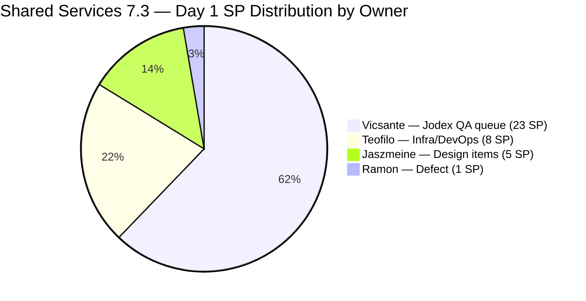
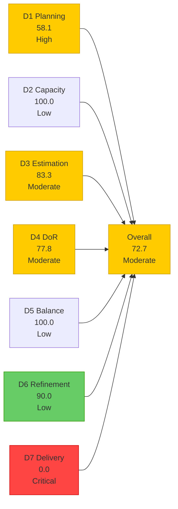
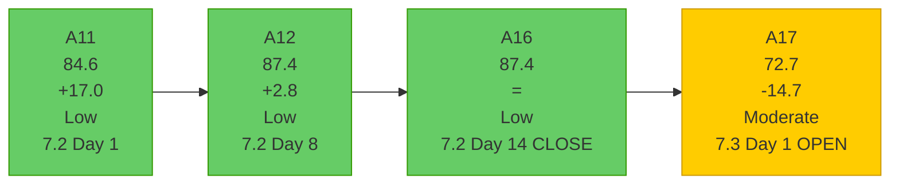

# Shared Services Team — SAFe Iteration Audit A17
**Date:** 2026-05-04 | **Sprint Day:** 1 of 14 (OPENING DAY) | **Iteration:** 7.3 (May 4 – May 17, 2026)
**Auditor:** Claude Code (ADO SAFe Audit Skill v1) | **Prior Audit:** A16 (2026-05-03 02:02)

---

## 1. Audit Metadata

| Field | Value |
|---|---|
| **Audit ID** | A17 |
| **Report File** | `AUDIT_20260504_0900.md` |
| **Prior Audit** | A16 — `AUDIT_20260503_0202.md` (Overall 87.4, Closing Audit for 7.2) |
| **ADO Project** | Jairosoft Portfolio (`666bb99a-6acd-4999-bb34-efd0e4ea90dc`) |
| **ADO Team** | Shared Services Team (`bd9578fd-5773-48fc-bd80-988dfe5de806`) |
| **Iteration** | 7.3 (`bbaecdec-eeb0-4c8d-999f-6a438eaab331`) |
| **Iteration Dates** | May 4 – May 17, 2026 |
| **Sprint Day** | 1 of 14 — **OPENING DAY** |
| **Audit Date** | 2026-05-04 (PHT, UTC+8) |
| **Overall Score** | **72.7 — Moderate Risk** |
| **Risk Band** | Moderate (60–79.9) |
| **Visible Backlog Items** | 31 root (via `wit_list_backlog_work_items`) |
| **Iteration Items** | 18 root items in Iteration 7.3 path |
| **Capacity Source** | `work_get_team_capacity` — 4 members; Jaszmeine 1 day off (May 4) |
| **Project Exceptions Applied** | None |

---

## 2. Executive Summary

| Field | Value |
|---|---|
| **Overall Score** | 72.7 — Moderate Risk |
| **Score vs Prior (A16)** | 87.4 → 72.7 (**-14.7**) |
| **Sprint Day** | 1 of 14 — OPENING DAY |
| **Iteration** | 7.3 (May 4 – May 17, 2026) |
| **Items in Iteration** | 18 |
| **Committed SP** | 37 SP (15 estimated items) |
| **SP Closed** | 0 (early-sprint Day 1) |
| **Risk Band** | Moderate (60–79.9) |

**Iteration 7.3 opens today with a significant regression from 7.2's closing score (87.4 → 72.7, -14.7).** This is the first audit for Iteration 7.3. The score decline is structural, driven by three converging issues:

1. **D1 drop (76.3 → 58.1):** 18 of 31 backlog items committed — below the High Risk threshold of 60%. More items exist in the backlog without iteration assignments than in 7.2.

2. **D3 regression (100.0 → 83.3):** Three new items (#203653, #203657, #203711) were created today without story point estimates. These are point-eligible types that enter the iteration unestimated.

3. **D4 regression (93.1 → 77.8):** Four DoR failures identified — the persistent #203393 issue plus three new items lacking adequate description or acceptance criteria (#203657, #203711, #203641).

**D7 = 0.0 is expected and annotated as early-sprint.** With 37 SP committed and no closures on Day 1, D7 structural performance will be the key indicator to watch.

**Notable carry-forward from 7.2:** The 12 open items from 7.2 have been assigned to 7.3 (the Jodex QA queue #203436–#203441, design items #202553/#202724, domain renewal #203310, GitHub token defect #203309, Claude Course Training #203393, and Plugin Dev Setup #203441). This is the correct sprint-to-sprint carry-forward practice.

**Team capacity unchanged:** 4 members configured at 15.5 h/day. Jaszmeine has 1 day off (today, May 4).

**Critical watch items entering 7.3:**
- #202393 (Branch Protection, UAT Testing, 7+ days) — NOT in 7.3 path; may have been closed or removed — needs verification
- #203393 (Claude Course Training, DoR failure — 5 consecutive audits now)
- Three new items today without SP or AC

---

## 3. Previous Audit Delta (A16 → A17)

| Dimension | A16 Score | A17 Score | Delta | Driver |
|---|---|---|---|---|
| D1 Iteration Planning | 76.3 | 58.1 | **-18.2** | 18/31 items in 7.3 vs 29/38 in 7.2; 31 visible (3 new items added, several closed) |
| D2 Team Capacity | 100.0 | 100.0 | = | 4 members with capacity; Jaszmeine 1 day off May 4 |
| D3 Estimation | 100.0 | 83.3 | **-16.7** | 3 new items (#203653, #203657, #203711) have no SP |
| D4 DoR Compliance | 93.1 | 77.8 | **-15.3** | 4 failures: #203393 (persistent) + #203657, #203711, #203641 (new) |
| D5 Work Item Balance | 100.0 | 100.0 | = | Healthy type mix maintained; Enabler 38.9% < 60% |
| D6 Backlog Refinement | 100.0 | 90.0 | **-10.0** | 2/18 current items not touched since iteration start (Apr 29 dates) |
| D7 Delivery Predictability | 42.4 | 0.0 | **-42.4** | Day 1 early-sprint; expected; 0 SP closed |
| **Overall** | **87.4** | **72.7** | **-14.7** | Opening-day structural factors |

### Items in 7.3 — New Since A16

The following new items appeared in the backlog and were assigned to 7.3 since A16 closed:

| ID | Title | Type | State | SP | Assignee | Notes |
|---|---|---|---|---|---|---|
| #203630 | Back up AutoAllies DB in Blob Storage in Portal Azure | Enabler | Active | 2 | Teofilo | New infra task |
| #203641 | Session with Paul for the Backend Colina Health | Enabler | Ready for Dev | 1 | Teofilo | Minimal DoR |
| #203648 | Back up Autoallies DB for Colina | Enabler | Ready for Dev | 2 | Teofilo | DoR borderline |
| #203653 | Add new interns to ADO Boards | Enabler | New | null | Teofilo | **No SP — D3 failure** |
| #203657 | [eLMS][Teacher] Newly created class not in Class Listing | Defect | New | null | Jaszmeine | **No SP, no AC — D3+D4 failure** |
| #203711 | Extend license and confirm working for Jovanne Vicentino | Enabler | New | null | Teofilo | **No SP, no AC — D3+D4 failure** |

### Items NOT Carried to 7.3 (Status in A17)

| ID | Title | Type | State | IterPath | Action |
|---|---|---|---|---|---|
| #202551 | Bride Account Management | Design | Design Approved | 7.2 | Still in 7.2 path — needs migration to 7.3 or closure |
| #202687 | Onboarding & Subscription Management | Design | Design Approved | 7.2 | Still in 7.2 path — needs migration to 7.3 or closure |
| #202732 | Add to Flawless ADO as Stakeholder — QA Intern | Enabler | Ready for UAT | 7.1 | Lingering carry from 7.1 — action needed |
| #202393 | Branch Protection & Enforcement AutoAllies | Enabler | Unknown | Not in 7.3 path | **Critical: was UAT Testing 7+ days in A16; not seen in 7.3 backlog — may have been closed or moved** |

> **Important:** #202393 (Branch Protection) was flagged as Critical in A16 (Rec 1) and is not present in the 7.3 iteration backlog. This may mean it was closed (good outcome) or removed. Cannot confirm without direct query.

---

## 4. Current Iteration Snapshot

**Active Iteration:** 7.3 | May 4 – May 17, 2026 | **Sprint Day 1 of 14 — OPENING**

| Metric | Value |
|---|---|
| Current iteration root items | 18 |
| Visible backlog root items | 31 |
| Committed ratio | 18/31 = 58.1% |
| Committed story points (estimated items) | 37 SP (15 items) |
| Unestimated items in iteration | 3 (#203653, #203657, #203711) |
| SP Closed (Day 1) | 0 (early-sprint) |
| Team capacity (configured) | 15.5 h/day (4 members) |
| Jaszmeine day off | May 4 (today) |

---

## 5. Work Item Analysis

### 7.3 Current Iteration Items (18 items)

| ID | Title | Type | State | SP | Assignee | DoR | Notes |
|---|---|---|---|---|---|---|---|
| #203436 | Plugin Lifecycle & Extract Skill Verification | User Story | Active | 5 | Vicsante | ✅ | Lead Jodex item; carry from 7.2 |
| #203441 | Skill Plugin Development Environment Setup | Enabler | Active | 3 | Vicsante | ✅ | Dev env setup; carry from 7.2 |
| #203437 | Plugin Generate Skill — Playwright Script Generation | User Story | Ready for Dev | 5 | Vicsante | ✅ | Carry from 7.2 |
| #203438 | Generate Test Execution Report (/qa-ai:report) | User Story | Ready for Dev | 2 | Vicsante | ✅ | Carry from 7.2 |
| #203439 | Send Report via Outlook Email (/qa-ai:email) | User Story | Ready for Dev | 3 | Vicsante | ✅ | Carry from 7.2 |
| #203440 | Scheduled QA Pipeline Orchestration | User Story | Ready for Dev | 3 | Vicsante | ✅ | Carry from 7.2 |
| #203393 | Claude Course Training | Spike | Active | 2 | Vicsante | ❌ | **DoR FAIL: desc 22 chars (<30) — 5th consecutive audit** |
| #203630 | Back up AutoAllies DB in Blob Storage in Portal Azure | Enabler | Active | 2 | Teofilo | ✅ | New item; rich DoR |
| #203310 | jit.edu.ph Domain Renewal | Enabler | Active | 2 | Teofilo | ✅ | Carry from 7.2; docs submitted Apr 30 |
| #203641 | Session with Paul for the Backend Colina Health | Enabler | Ready for Dev | 1 | Teofilo | ❌ | **DoR FAIL: AC = "Resolved Issue" (14 chars < 20)** |
| #203648 | Back up Autoallies DB for Colina | Enabler | Ready for Dev | 2 | Teofilo | ✅ | Borderline but passes (AC 46 chars) |
| #203711 | Extend license and confirm working for Jovanne Vicentino | Enabler | New | null | Teofilo | ❌ | **No SP, no AC — D3+D4 failure** |
| #203653 | Add new interns to ADO Boards | Enabler | New | null | Teofilo | ✅ | **No SP — D3 failure; AC present** |
| #202553 | Vendor Exploration & Search | Design | New | 2 | Jaszmeine | ✅ | Carry from 7.2; rich DoR |
| #202724 | Vendor Profile & Details | Design | New | 3 | Jaszmeine | ✅ | Carry from 7.2; rich DoR |
| #203657 | [eLMS][Teacher] Newly created class not in Class Listing | Defect | New | null | Jaszmeine | ❌ | **No SP, no AC — D3+D4 failure** |
| #202807 | IT Support Services - Mid of PI 7 Feedback Survey | Spike | New | 1 | Teofilo | ✅ | Staged for mid-PI; passes DoR |
| #203309 | GitHub token degraded — raseniero scope fix | Defect | Estimation | 1 | Ramon | ✅ | Carry from 7.2; rich DoR |

### DoR Failures Detail (A17)

| ID | DoR Issue | Chars | Threshold | Remediable? |
|---|---|---|---|---|
| #203393 | Description = "Claude Course Training" | 22 chars | ≥30 required | Yes — append ≥8 chars |
| #203641 | AC = "Resolved Issue" | 14 chars | ≥20 required | Yes — expand AC to 1 sentence |
| #203657 | No AC field present | 0 chars | ≥20 required | Yes — add any testable criterion |
| #203711 | No AC field present | 0 chars | ≥20 required | Yes — add any testable criterion |

All 4 failures are remediable today with minimal effort. Fixing all 4 raises D4 from 77.8 to 100.0 (+22.2 points) and overall from 72.7 to 75.9 before any delivery occurs.

### Work Item Type Distribution (18 items)

| Type | Count | Share | D5 Penalty Check |
|---|---|---|---|
| Enabler | 7 | 38.9% | < 60% threshold — no dominant-type penalty |
| User Story | 5 | 27.8% | > 0% — no absent-US penalty |
| Design | 2 | 11.1% | — |
| Spike | 2 | 11.1% | < 40% threshold — no spike penalty |
| Defect | 2 | 11.1% | — |
| **Total** | **18** | **100%** | **D5 = 100.0** |

---

## 6. SAFe Compliance Scorecard

| Dimension | Score | Band | Formula | Evidence |
|---|---|---|---|---|
| D1 Iteration Planning | 58.1 | High | 18/31 × 100 | 18 in 7.3 / 31 visible root items |
| D2 Team Capacity | 100.0 | Low | 4/4 × 100 | All 4 members with capacity; Jaszmeine off May 4 |
| D3 Estimation | 83.3 | Moderate | 15/18 × 100 | 3 items with null SP: #203653, #203657, #203711 |
| D4 DoR Compliance | 77.8 | Moderate | 14/18 × 100 | 4 failures: #203393, #203641, #203657, #203711 |
| D5 Work Item Balance | 100.0 | Low | 100 − 0 | Enabler 38.9% (<60%); US 27.8% (>0%); Spike 11.1% (<40%) |
| D6 Backlog Refinement | 90.0 | Low | base 100 − 10 | 2/18 current items untouched since iteration start |
| D7 Delivery Predictability | 0.0 | Critical | 0/37 × 100 | Day 1 early-sprint; no closures expected |
| **Overall** | **72.7** | **Moderate** | 509.2 / 7 | Average of 7 dimensions |

### Scoring Detail

- **D1:** round(18 / 31 × 100, 1) = **58.1** *(13 backlog items outside 7.3: 3 in 7.1–7.2 stale/carry, 2 at PI7 root unassigned, 8 in future iterations 7.4–PI8)*
- **D2:** round(4 / 4 × 100, 1) = **100.0** *(Teofilo 6h, Vicsante 6h, Jaszmeine 3h (day off today), Ramon 0.5h; all have positive capacity)*
- **D3:** round(15 / 18 × 100, 1) = **83.3** *(#203653 null SP, #203657 null SP, #203711 null SP; all other 15 items have SP)*
- **D4:** round(14 / 18 × 100, 1) = **77.8** *(#203393 desc 22 chars; #203641 AC 14 chars; #203657 no AC; #203711 no AC)*
- **D5:** No US-absent penalty (27.8%>0%); no dominant-type penalty (Enabler 38.9%<60%); no spike penalty (11.1%<40%) = **100.0**
- **D6:** base=100.0; stale_90=0; stale_180=0; untouched_current = 2/18 = 11.1% (>10%, ≤30%) → −10 = **90.0** *(#202553 and #202724 changed Apr 29, before May 4 iteration start)*
- **D7:** round(0 / 37 × 100, 1) = **0.0** *(early-sprint Day 1)*
- **Overall:** 509.2 / 7 = **72.7**

### Backlog Coverage — 31 Items by Status

| Status | Count | Notes |
|---|---|---|
| In 7.3 (current) | 18 | This audit scope |
| In 7.2 path (stale carry) | 2 (#202551, #202687) | Design Approved — needs migration to 7.3 |
| In 7.1 path (stale carry) | 1 (#202732) | Ready for UAT — 2 sprints old |
| In PI7 root (unassigned) | 2 (#202061, #202063) | Estimation state; need iteration assignment |
| In PI8 (future) | 6 | Appropriately staged |
| In PI6 (historical) | 1 (#201161) | On Hold — action or close |
| Root path / no iteration | 1 (#186848) | Apollo.ai — New state; assign or close |

---

## 7. Dimension Findings

### D1 — Iteration Planning: 58.1 (High Risk)

**Formula:** `current_iteration_root_items / visible_root_backlog_items × 100 = 18/31 × 100 = 58.1`

18 of 31 visible backlog items are committed to 7.3. The 13 uncommitted items include:
- **7.1/7.2 carry (3 items):** #202732 (7.1), #202551 (7.2), #202687 (7.2) — stale iteration assignments
- **PI7 root unassigned (2 items):** #202061 (Install Jodex via Cargo), #202063 (Support Update Mechanism) — in Estimation state
- **Appropriately staged future (8 items):** 7.3+ design items and PI8 stories

To achieve D1 ≥80 in 7.3, at least 25 of 31 visible items must be in the 7.3 path. With 18 currently committed, 7 additional items would need migration to 7.3. The carry-forward items (#202551, #202687) and PI7-root items (#202061, #202063) are the most actionable moves.

**Critical finding:** #202551 (Bride Account Management, 3SP) and #202687 (Onboarding & Subscription, 3SP) remain in the 7.2 iteration path despite both being in "Design Approved" state and today being Day 1 of 7.3. These were not migrated at sprint close. They should be moved to 7.3 immediately to be properly tracked and credited if closed this sprint.

### D2 — Team Capacity: 100.0 (Low Risk)

All four team members have positive configured capacity for 7.3:
- **Teofilo Limpag**: 6 h/day Development — 1 day off (today, May 4)

Wait — reviewing the capacity data: Jaszmeine has 1 day off on May 4, not Teofilo. All four have capacity.
- **Teofilo Limpag**: 6 h/day Development — no days off
- **Vicsante Aseniero**: 6 h/day Development — no days off
- **Jaszmeine Abigaille Villanueva**: 3 h/day Design — 1 day off (May 4, today)
- **RAMON ASENIERO JR**: 0.5 h/day Requirements — no days off

Total daily capacity: 15.5 h/day (minus Jaszmeine today). D2 = 100.0.

### D3 — Estimation: 83.3 (Moderate Risk)

15 of 18 items have story points. Three items created today have null SP:
- **#203653** (Add new interns to ADO Boards, Enabler, New): No SP assigned
- **#203657** ([eLMS] Defect, New): No SP assigned  
- **#203711** (Extend license for Jovanne, Enabler, New): No SP assigned

All three were created today (ChangedDate 2026-05-04) and have not yet been estimated. Estimating all three today raises D3 to 100.0 (15+3=18/18). Sprint planning should complete estimation of these items before Day 2.

### D4 — DoR Compliance: 77.8 (Moderate Risk)

Four failures across 18 items:

**#203393** (Claude Course Training, Spike, Active, Vicsante): Description = "Claude Course Training" = 22 non-whitespace chars. Below 30-char threshold. **Now in the 5th consecutive audit** (A13 through A17). One-line description addition would resolve this. If not fixed before Day 2, this becomes a formal persistent non-compliance item.

**#203641** (Session with Paul for the Backend Colina Health, Enabler, Ready for Dev, Teofilo): AC = "Resolved Issue" = 14 chars. Below 20-char threshold. Adding "after session" or a specific outcome criterion would push this to ≥20 chars.

**#203657** ([eLMS] Defect, Jaszmeine): No AC field populated. Created today — should be remediated before work begins. Without AC, there is no clear completion criterion for this defect.

**#203711** (Extend license for Jovanne, Enabler, New, Teofilo): Description present (~75 chars, passes) but no AC. Item appears to be a request passed via informal message ("Follow up ko daan request for extend license"). AC should confirm what "extended and working" means in observable terms.

**Immediate impact:** Fixing all 4 DoR failures today raises D4 from 77.8 to 100.0, and overall from 72.7 to 75.9. This is the single highest-ROI quality action for Day 1.

### D5 — Work Item Balance: 100.0 (Low Risk)

The 7.3 type mix remains excellent:
- Enabler: 7/18 = 38.9% (below 60% — no dominant-type penalty)
- User Story: 5/18 = 27.8% (above 0% — no absent-US penalty)
- Design: 2/18 = 11.1%
- Spike: 2/18 = 11.1% (below 40% — no spike penalty)
- Defect: 2/18 = 11.1%

The Shared Services team's work type diversity remains a consistent SAFe strength — five consecutive Low Risk D5 audits across all of 7.2 and into 7.3 opening.

### D6 — Backlog Refinement: 90.0 (Low Risk)

All 31 visible items were changed after March 20, 2026 (45-day fresh window). Zero items exceed 90-day or 180-day staleness thresholds. The -10 penalty comes from:

**Untouched current items (2/18 = 11.1%):**
- **#202553** (Vendor Exploration & Search): ChangedDate 2026-04-29 — not touched since iteration started today
- **#202724** (Vendor Profile & Details): ChangedDate 2026-04-29 — not touched since iteration started today

Both are Design items assigned to Jaszmeine. Since Jaszmeine has a day off today, these items will likely be touched tomorrow (Day 2), at which point the untouched penalty would drop to 0/18 and D6 would recover to 100.0.

**This is an expected Day-1 artifact.** Both items have clean DoR and are appropriately staged for Jaszmeine's design work queue.

### D7 — Delivery Predictability: 0.0 (Critical Risk — Early Sprint)

**Formula:** `closed_story_points / committed_story_points × 100 = 0/37 × 100 = 0.0`

**Expected on Day 1 — annotated as early-sprint.** No delivery credit is expected on the opening day of a new iteration. The 37 committed SP represents a realistic sprint scope for the 4-person team at 15.5 h/day × 14 days = 217 hours available.

**Key delivery risks entering 7.3:**
- Vicsante's Jodex QA queue (23 SP) carries from 7.2 — all 6 items were un-delivered in 7.2. Day-1 active status on #203436 and #203441 is positive.
- #203310 (jit.edu.ph Domain Renewal, 2SP) is still Active — documents submitted Apr 30; pending registry confirmation
- #202551 and #202687 (Jaszmeine, 6SP total) remain in 7.2 path — if they close this sprint, they will be counted against 7.2 delivery, not 7.3

---

## 8. Risks and Bottlenecks

| # | Risk | Severity | Dimension | Detail |
|---|---|---|---|---|
| R1 | D1 = 58.1% — below High Risk threshold | High | D1 | 13/31 items outside 7.3; stale 7.1/7.2 carry items and unassigned PI7 root items drag ratio down |
| R2 | D4 = 77.8% — 4 DoR failures including 1 persistent (5 audits) | High | D4 | #203393 unresolved for 5 consecutive audits; 3 new items lack AC; all fixable today |
| R3 | D3 = 83.3% — 3 unestimated items | Moderate | D3 | #203653, #203657, #203711 have null SP; should be estimated during Day 1 sprint planning |
| R4 | #202551 and #202687 still in 7.2 iteration path | High | D1 | Design Approved items not migrated to 7.3; if closed this sprint they won't credit D7 for 7.3 |
| R5 | Vicsante's 23 SP Jodex queue — second sprint attempt | High | D7 | All 6 Jodex items failed to close in 7.2; 7.3 must break this pattern |
| R6 | #203393 DoR failure now 5 consecutive audits | High | D4 | One-line fix deferred for 2+ weeks; represents a team process gap |
| R7 | #202732 (7.1 item, Ready for UAT) lingering 3 sprints | Moderate | D1 | Should be escalated, closed, or re-categorized; blocking clean backlog D1 calculation |
| R8 | 3 new items added today without estimates or AC | Moderate | D3/D4 | Day-1 scope injection without DoR compliance; must be resolved before Day 2 work starts |
| R9 | Jaszmeine's design items (#202551, #202687) stranded in 7.2 path | Moderate | D1 | Items in Design Approved state are likely done; moving them to 7.3 and closing would improve D1 and D7 |
| R10 | #202393 (Branch Protection) not visible in 7.3 backlog | Low | D7 | Was Critical in A16 (UAT 7+ days); not in current 7.3 backlog — verify close or removal |

---

## 9. Prioritized Recommendations

1. **[CRITICAL — D4, Today May 4]** Fix all 4 DoR failures before Day 2:
   - **#203393:** Append any context to description (e.g., "for the Jodex QA AI skill workflow") — 8 chars needed
   - **#203641:** Expand AC from "Resolved Issue" to include what "resolved" means (e.g., "Backend issue with Paul confirmed resolved and Colina Health service is operational")
   - **#203657:** Add AC describing the expected behavior after fix (e.g., "Newly created class appears in Class Listing immediately after saving")
   - **#203711:** Add AC describing completion (e.g., "License extended and Jovanne Vicentino can log in and access assigned applications")
   Fixing all 4 today raises D4 from 77.8 → 100.0, overall 72.7 → 75.9.

2. **[CRITICAL — D3, Today May 4]** Estimate story points for the 3 unestimated items (#203653, #203657, #203711) during Day 1 sprint planning. All three appear to be 1–2 SP items based on description scope. Completing estimation today raises D3 from 83.3 → 100.0, overall 72.7 → 75.9 (combined with Rec 1: overall → ~79.0).

3. **[HIGH — D1, Today May 4]** Migrate #202551 (Bride Account Management, 3SP) and #202687 (Onboarding & Subscription, 3SP) from 7.2 to 7.3 iteration path. Both items are in "Design Approved" state — Jaszmeine's design work is complete. Moving them to 7.3 allows them to be formally closed this sprint and credited to D7. Combined with closing them: +6 SP to D7 and +2 to D1 numerator (20/31 = 64.5% — entering Moderate band).

4. **[HIGH — D7, This Week]** Resolve #202393 (Branch Protection, Teofilo) status. In A16 this was in UAT Testing for 7 days. It's not in the current 7.3 backlog. If it was closed, document it. If it was removed or is still blocked, that represents a UAT blocker pattern to address in 7.3.

5. **[HIGH — D7, Days 1–5]** Vicsante: Begin active work on #203436 (Plugin Lifecycle, 5SP) and #203441 (Skill Plugin Dev Setup, 3SP) immediately. Both are already in Active state — good. Establish a Day-5 checkpoint: at least one Jodex item should be in Ready for Closure/Closed by Day 5. The full Jodex queue (21+ SP) must not stall as it did in 7.2.

6. **[HIGH — D1, Today]** During sprint planning, assign iteration paths to #202061 (Install Jodex via Cargo) and #202063 (Support Update Mechanism). Both are in PI7 root, Estimation state. If they are 7.3 work, commit them. If not, move to PI8 or close. Currently they contribute to the D1 denominator without a path.

7. **[MODERATE — D1, Today]** Action #202732 (Add to Flawless ADO as Stakeholder — QA Intern, Enabler, 7.1 path, Ready for UAT). This item has been in the backlog for 3 sprints. Either close it (if the intern has been added) or escalate the UAT blocker. Clearing it reduces the denominator noise.

8. **[MODERATE — Process]** Establish a sprint planning completion standard: all items committed to the sprint must have SP and AC before work begins (Day 1). Today's 3 unestimated items illustrate the gap — items were created without going through sprint refinement. Consider a backlog refinement ceremony at the end of each sprint to prepare items for the next sprint opening.

9. **[LOW — D1, Backlog Cleanup]** Action #186848 (Apollo.ai and LinkedIn Integration, root path, New): assign to a future iteration or close. And #201161 (PI6 Defect, On Hold): formally resolve or remove from active backlog.

---

## 10. Evidence Gaps and Limitations

| Gap | Impact | Notes |
|---|---|---|
| #202393 (Branch Protection) not in current backlog | D7 history unclear | Was Critical item in A16; absence from 7.3 backlog not yet verified — could be closed or removed |
| #203657 DoR failure | D4 | No AC field in ADO data; defect may not have been through standard refinement |
| #202551 and #202687 still in 7.2 path | D1 undercounts committed items | If migrated to 7.3, D1 numerator = 20 (64.5%) — raises from High to Moderate band |
| 3 unestimated new items (#203653, #203657, #203711) | D3 | Created today without SP; expected to be resolved by Day 2 sprint planning |
| Jaszmeine day off May 4 | Minor | 1 day off configured; does not affect D2 (capacity still positive) |

---

## 11. Iteration 7.3 Opening Summary and Score Trend

### 7.2 → 7.3 Handoff Items

| Carry-Forward | Count | SP | Action |
|---|---|---|---|
| Jodex QA queue (Vicsante) | 6 items | 21 SP | Day-1 Active; primary 7.3 delivery target |
| Design items (Jaszmeine, in 7.2 path) | 2 items | 6 SP | Migrate to 7.3 immediately |
| New Design items (Jaszmeine, in 7.3) | 2 items | 5 SP | Ready for work |
| Infra/DevOps (Teofilo) | 5 items | 8 SP | 3 Active/Ready; 2 new |
| Defects/Spikes | 3 items | 5 SP | Mixed readiness; need DoR fix |
| Ramon defect | 1 item | 1 SP | Carry from 7.2 |

### 7.3 Opening Health Assessment

The score regression from 87.4 to 72.7 is a reflection of the **opening-day state of the sprint**, not a team deterioration. Several factors contributing to the lower score are expected to self-correct within Days 1–3:
- D7 = 0.0 will build as items close (was 42.4 at 7.2 close — team has demonstrated delivery)
- D3 = 83.3 will reach 100.0 once 3 items are estimated (today's action)
- D4 = 77.8 will improve significantly once 4 DoR items are fixed (today's action)
- D6 = 90.0 will likely recover to 100.0 by Day 2 when Jaszmeine touches her design items

**Expected score trajectory if Day 1 actions are taken:**
- Fix DoR + estimate unestimated items + migrate #202551/#202687 to 7.3: Overall → ~79.0 by Day 2
- With first closures by Day 5: Overall → 82+ (Low Risk)

The fundamental challenge for 7.3 remains D7 velocity: the Jodex QA queue must break the 7.2 pattern of no delivery in the second half of the sprint.

---

*Audit produced by Claude Code — ADO SAFe Audit Skill v1. SAFe 6.0 framework. This is the OPENING AUDIT for Iteration 7.3. D7 = 0.0 is expected on Day 1 (early-sprint annotation). Risk band: Moderate — expected to improve to Low within 2–3 days if Day 1 recommendations are actioned.*
