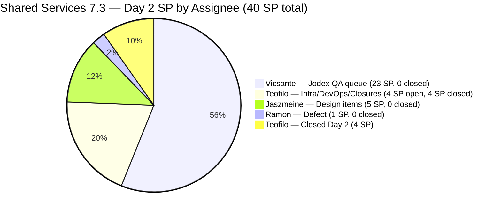
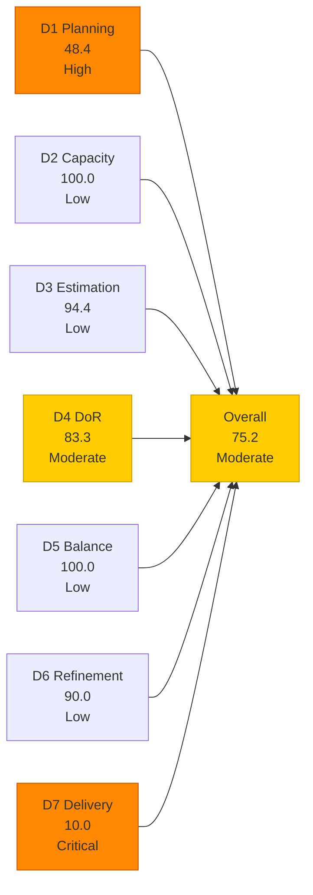
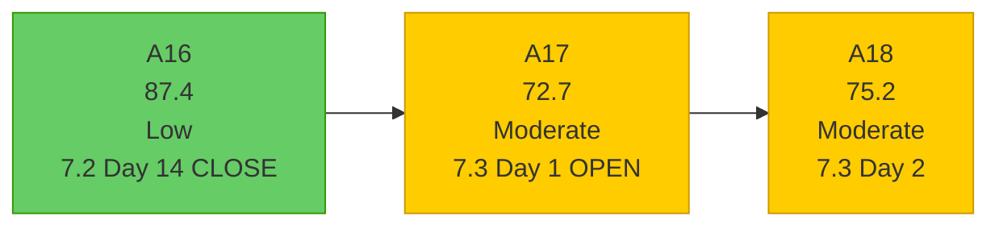
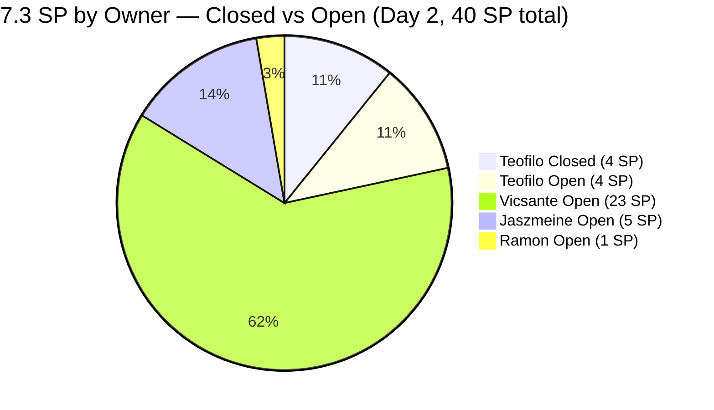

# Shared Services Team — SAFe Iteration Audit A18
**Date:** 2026-05-05 | **Sprint Day:** 2 of 14 | **Iteration:** 7.3 (May 4 – May 17, 2026)
**Auditor:** Claude Code (ADO SAFe Audit Skill v1) | **Prior Audit:** A17 (2026-05-04 09:00)

---

## 1. Audit Metadata

| Field | Value |
|---|---|
| **Audit ID** | A18 |
| **Report File** | `AUDIT_20260505_0204.md` |
| **Prior Audit** | A17 — `AUDIT_20260504_0900.md` (Overall 72.7, Opening Audit 7.3 Day 1) |
| **ADO Project** | Jairosoft Portfolio (`666bb99a-6acd-4999-bb34-efd0e4ea90dc`) |
| **ADO Team** | Shared Services Team (`bd9578fd-5773-48fc-bd80-988dfe5de806`) |
| **Iteration** | 7.3 (`bbaecdec-eeb0-4c8d-999f-6a438eaab331`) |
| **Iteration Dates** | May 4 – May 17, 2026 |
| **Sprint Day** | 2 of 14 |
| **Audit Date** | 2026-05-05 (PHT, UTC+8) |
| **Overall Score** | **75.2 — Moderate Risk** |
| **Risk Band** | Moderate (60–79.9) |
| **Visible Backlog Items** | 31 root (via `wit_list_backlog_work_items`) |
| **Iteration Items** | 18 root items in Iteration 7.3 path |
| **Capacity Source** | `work_get_team_capacity` — 4 members; full team available today (Jaszmeine's day off was May 4) |
| **Project Exceptions Applied** | None |

---

## 2. Executive Summary

| Field | Value |
|---|---|
| **Overall Score** | 75.2 — Moderate Risk |
| **Score vs Prior (A17)** | 72.7 → 75.2 (**+2.5**) |
| **Sprint Day** | 2 of 14 |
| **Iteration** | 7.3 (May 4 – May 17, 2026) |
| **Items in Iteration** | 18 |
| **Committed SP** | 40 SP (17 estimated items) |
| **SP Closed (Day 2)** | 4 SP — 3 items Closed: #203310, #203641, #203711 |
| **Risk Band** | Moderate (60–79.9) |

**The Shared Services team posted notable Day-2 delivery momentum.** Three items were closed on May 5 — the first closures of Iteration 7.3:
- **#203310** (jit.edu.ph Domain Renewal, 2 SP, Teofilo) → Closed May 5
- **#203641** (Session with Paul for Backend Colina Health, 1 SP, Teofilo) → Closed May 5
- **#203711** (Extend license for Jovanne Vicentino, 1 SP, Teofilo) → Closed May 5

Teofilo completed 3 items / 4 SP on Day 2 — strong execution on the Enabler queue.

**Score improved from 72.7 to 75.2 (+2.5) driven by D7 (0.0 → 10.0)** as the first 4 SP are credited. D3 also improved (83.3 → 94.4) as #203653 and #203711 received story points (only #203653 remains unestimated).

**Remaining concerns:**
- D1 = 48.4 (down from 58.1) — 3 closed items dropped from the backlog, reducing the numerator-eligible items in 7.3
- D4 = 83.3 — #203393 DoR failure now in its **6th consecutive audit**; #203844 added without AC
- D6 = 90.0 — #202553 and #202724 (Jaszmeine's design items) still untouched since Apr 29
- #202551 and #202687 still in 7.2 iteration path (Design Approved) — from A17 Rec 3 not yet actioned

**Today is Jaszmeine's first full working day of the sprint** (she had a day off May 4). Her design queue (#202553, #202724) should begin moving today.

---

## 3. Previous Audit Delta (A17 → A18)

| Dimension | A17 Score | A18 Score | Delta | Driver |
|---|---|---|---|---|
| D1 Iteration Planning | 58.1 | 48.4 | **-9.7** | 3 items closed → dropped from backlog; numerator items in 7.3 backlog = 15 (was 18) |
| D2 Team Capacity | 100.0 | 100.0 | = | All 4 members with capacity; Jaszmeine's day off (May 4) cleared |
| D3 Estimation | 83.3 | 94.4 | **+11.1** | #203711 SP assigned (1 SP); #203653 still null; 17/18 estimated |
| D4 DoR Compliance | 77.8 | 83.3 | **+5.5** | #203657 removed from iteration; #203711 now Closed (AC threshold met); net 15/18 pass |
| D5 Work Item Balance | 100.0 | 100.0 | = | Type mix healthy; Enabler 44.4% (<60%), US 27.8% (>0%), Spike 11.1% (<40%) |
| D6 Backlog Refinement | 90.0 | 90.0 | = | #202553 and #202724 still untouched since Apr 29 (day before iteration start) |
| D7 Delivery Predictability | 0.0 | 10.0 | **+10.0** | 3 items Closed (4 SP) by Teofilo; first delivery credit of 7.3 |
| **Overall** | **72.7** | **75.2** | **+2.5** | D7 and D3 improvements offset D1 and D4 structural changes |

### Items Closed on Day 2 (May 5)

| ID | Title | Type | SP | Assignee | Notes |
|---|---|---|---|---|---|
| #203310 | jit.edu.ph Domain Renewal | Enabler | 2 | Teofilo | Documents submitted Apr 30; registry confirmed May 5 |
| #203641 | Session with Paul for the Backend Colina Health | Enabler | 1 | Teofilo | Resolved on Day 2; DoR failure (AC 13 chars) noted |
| #203711 | Extend license for Jovanne Vicentino | Enabler | 1 | Teofilo | SP assigned (was null in A17); Closed Day 2 |

### New Item Added (A17 → A18)

| ID | Title | Type | State | SP | Assignee | Notes |
|---|---|---|---|---|---|---|
| #203844 | Monthly Costing report — Internal and Client Infra - May 2026 | Enabler | Grooming | 2 | Teofilo | Added to 7.3; **no AC field** — D4 failure |

### Items Removed Since A17

| ID | Title | Type | State A17 | Status A18 | Notes |
|---|---|---|---|---|---|
| #203657 | [eLMS][Teacher] Newly created class not in Class Listing | Defect | New, null SP | **Not in iteration/backlog** | Removed or resolved; D3 and D4 failure count reduced |

---

## 4. Current Iteration Snapshot

**Active Iteration:** 7.3 | May 4 – May 17, 2026 | **Sprint Day 2 of 14**

| Metric | Value |
|---|---|
| Current iteration root items | 18 (via iteration query) |
| Visible backlog root items | 31 (via backlog query) |
| Backlog items with 7.3 path | 15 (closed items dropped from backlog) |
| Committed SP (all 18 items) | 40 SP (17 estimated) |
| SP Closed (Day 2) | 4 SP (3 items) |
| SP Remaining | 36 SP (15 items open) |
| Delivery % | 10.0% (4/40 SP) |
| Team capacity (configured) | 15.5 h/day (all 4 members available today) |

---

## 5. Work Item Analysis

### 7.3 Current Iteration Items (18 items)

| ID | Title | Type | State | SP | Assignee | DoR | Notes |
|---|---|---|---|---|---|---|---|
| #203310 | jit.edu.ph Domain Renewal | Enabler | **Closed** | 2 | Teofilo | ✅ | **Closed Day 2** — 2 SP credited |
| #203641 | Session with Paul for Backend Colina Health | Enabler | **Closed** | 1 | Teofilo | ❌ | **Closed Day 2** — 1 SP credited; AC 13 chars < 20 |
| #203711 | Extend license for Jovanne Vicentino | Enabler | **Closed** | 1 | Teofilo | ✅ | **Closed Day 2** — 1 SP credited; SP assigned today |
| #203436 | Plugin Lifecycle & Extract Skill Verification | User Story | Active | 5 | Vicsante | ✅ | Lead Jodex item; Active Day 2 |
| #203441 | Skill Plugin Dev Environment Setup | Enabler | Active | 3 | Vicsante | ✅ | Dev env setup; Active Day 2 |
| #203393 | Claude Course Training | Spike | Active | 2 | Vicsante | ❌ | **DoR FAIL: desc 22 chars — 6th consecutive audit** |
| #202807 | IT Support Services - Mid PI 7 Feedback Survey | Spike | Active | 1 | Teofilo | ✅ | Active Day 2; ChangedDate May 5 |
| #203630 | Back up AutoAllies DB in Blob Storage in Portal Azure | Enabler | Active | 2 | Teofilo | ✅ | Active; changed May 4 |
| #203648 | Back up Autoallies DB for Colina | Enabler | Active | 2 | Teofilo | ✅ | Active; AC 46 chars ✓ |
| #203844 | Monthly Costing report - Internal + Client Infra (May 2026) | Enabler | Grooming | 2 | Teofilo | ❌ | **NEW — no AC field; D4 failure** |
| #203309 | GitHub token degraded — raseniero scope fix | Defect | Estimation | 1 | Ramon | ✅ | Rich DoR; in Estimation state |
| #203437 | Plugin Generate Skill — Playwright Script Generation | User Story | Ready for Dev | 5 | Vicsante | ✅ | Carry from 7.2 |
| #203438 | Generate Test Execution Report (/qa-ai:report) | User Story | Ready for Dev | 2 | Vicsante | ✅ | Carry from 7.2 |
| #203439 | Send Report via Outlook Email (/qa-ai:email) | User Story | Ready for Dev | 3 | Vicsante | ✅ | Carry from 7.2 |
| #203440 | Scheduled QA Pipeline Orchestration | User Story | Ready for Dev | 3 | Vicsante | ✅ | Carry from 7.2 |
| #202553 | Vendor Exploration & Search | Design | New | 2 | Jaszmeine | ✅ | Changed Apr 29 — **untouched since iter start** |
| #202724 | Vendor Profile & Details | Design | New | 3 | Jaszmeine | ✅ | Changed Apr 29 — **untouched since iter start** |
| #203653 | Add new interns to ADO Boards | Enabler | New | **null** | Teofilo | ✅ | AC now rich (intern email list); **still no SP** |

### DoR Failures Detail (A18)

| ID | DoR Issue | Chars | Threshold | Status |
|---|---|---|---|---|
| #203393 | Description = "Claude Course Training" in `<ul>` = 22 chars | 22 chars | ≥30 required | **6th consecutive audit** — critical process gap |
| #203641 | AC = "Resolved Issue" = 13 chars (Closed item) | 13 chars | ≥20 required | Now Closed; historical record |
| #203844 | No AC field present | 0 chars | ≥20 required | New item added without AC |

DoR pass = 15/18. DoR fail = 3/18. D4 = 83.3.

Note: #203641 is Closed but remains a DoR failure on record (item was Closed before AC was remediated). #203657 (a prior D4 failure) is no longer in the iteration/backlog — removed or resolved — reducing DoR failure count from 4 to 3.

### Work Item Type Distribution (18 items)

| Type | Count | Share | D5 Penalty Check |
|---|---|---|---|
| Enabler | 8 | 44.4% | < 60% threshold — no dominant-type penalty |
| User Story | 5 | 27.8% | > 0% — no absent-US penalty |
| Design | 2 | 11.1% | — |
| Spike | 2 | 11.1% | < 40% threshold — no spike penalty |
| Defect | 1 | 5.6% | — |
| **Total** | **18** | **100%** | **D5 = 100.0** |

---

## 6. SAFe Compliance Scorecard

| Dimension | Score | Band | Formula | Evidence |
|---|---|---|---|---|
| D1 Iteration Planning | 48.4 | High | 15/31 × 100 | 15 backlog items with 7.3 path / 31 visible root items |
| D2 Team Capacity | 100.0 | Low | 4/4 × 100 | All 4 members available; Jaszmeine's day off (May 4) cleared |
| D3 Estimation | 94.4 | Low | 17/18 × 100 | Only #203653 has null SP; #203711 SP assigned before closure |
| D4 DoR Compliance | 83.3 | Moderate | 15/18 × 100 | 3 failures: #203393 (desc), #203641 (AC, closed), #203844 (no AC) |
| D5 Work Item Balance | 100.0 | Low | 100 − 0 | Enabler 44.4% (<60%); US 27.8% (>0%); Spike 11.1% (<40%) |
| D6 Backlog Refinement | 90.0 | Low | base 100 − 10 | 2/15 current backlog items untouched since iter start (Apr 29) |
| D7 Delivery Predictability | 10.0 | Critical | 4/40 × 100 | 3 items Closed (4 SP of 40 SP) by Teofilo on Day 2 |
| **Overall** | **75.2** | **Moderate** | 526.1 / 7 | Average of 7 dimensions |

### Scoring Detail

- **D1:** round(15 / 31 × 100, 1) = **48.4** *(3 closed items dropped from backlog view; 15 backlog items with 7.3 iterPath out of 31 visible root)*
- **D2:** round(4 / 4 × 100, 1) = **100.0** *(all 4 members with capacity; Teofilo 6h, Vicsante 6h, Jaszmeine 3h, Ramon 0.5h; 0 days off today)*
- **D3:** round(17 / 18 × 100, 1) = **94.4** *(#203653 null SP; all other 17 estimated; #203711 received SP before closure)*
- **D4:** round(15 / 18 × 100, 1) = **83.3** *(#203393 desc 22 chars; #203641 AC 13 chars (closed); #203844 no AC)*
- **D5:** No absent-US penalty (27.8%>0%); no dominant-type penalty (Enabler 44.4%<60%); no spike penalty (11.1%<40%) = **100.0**
- **D6:** base=100.0; stale_90=0; stale_180=0; untouched_current = 2/15 backlog items in 7.3 with ChangedDate < May 4 (#202553 Apr 29, #202724 Apr 29) = 13.3% (>10%, ≤30%) → −10 = **90.0**
- **D7:** round(4 / 40 × 100, 1) = **10.0** *(4 SP closed of 40 SP committed; 3 Closed items: #203310, #203641, #203711)*
- **Overall:** 526.1 / 7 = **75.2**

### D1 — Backlog Coverage Map (31 Items)

| Status | Count | Notes |
|---|---|---|
| In 7.3 backlog (current) | 15 | Active scope for this audit |
| Closed (dropped from backlog) | 3 | #203310, #203641, #203711 — delivered Day 2 |
| In 7.2 path (stale carry) | 2 | #202551, #202687 — Design Approved; not migrated |
| In 7.1 path | 1 | #202732 — Ready for UAT; 3 sprints old |
| In PI7 root (unassigned) | 2 | #202061, #202063 — Estimation state |
| In PI7 other (7.4, 7.5, 7.6IP) | 5 | Appropriately staged future items |
| In PI8 (future) | 5 | Appropriately staged |
| In PI6 (historical) | 1 | #201161 — On Hold |
| Root path / no iteration | 1 | #186848 — Apollo.ai |

### D7 Delivery Trajectory

| Day | SP Closed | D7 | Overall | Notes |
|---|---|---|---|---|
| Day 1 (May 4) | 0 | 0.0 | 72.7 | Opening; no delivery expected |
| Day 2 (today) | 4 | 10.0 | 75.2 | Teofilo: 3 items Closed (+4 SP) |
| Day 5 target | 15+ | 37.5+ | 82+ | Target: first Jodex item Closed (Vicsante) |
| Day 10 target | 25+ | 62.5+ | 87+ | Target: 5+ items Closed; #203436 and 2 Ready-for-Dev |
| Day 14 target | 40 | 100.0 | 95.7 | Ideal: all 17 estimated items Closed |

---

## 7. Dimension Findings

### D1 — Iteration Planning: 48.4 (High Risk)

**Formula:** `current_iteration_root_items / visible_root_backlog_items × 100 = 15/31 × 100 = 48.4`

D1 dropped from 58.1 (A17) to 48.4 because 3 items were Closed on Day 2 (#203310, #203641, #203711) and dropped out of the backlog view. The numerator decreased from 18 to 15 while the denominator held at 31 (new items 203844 and 203845 added, offsetting closed item removal, but 203657 removed).

**To reach D1 ≥ 80 (Low Risk):** At least 25 of 31 visible backlog items must carry 7.3 iteration path. Currently 15 do. 10 additional items would need to be in 7.3. The most actionable moves:
- Migrate #202551 (Bride Account Mgmt, 3SP, Design Approved) from 7.2 → 7.3
- Migrate #202687 (Onboarding & Subscription, 3SP, Design Approved) from 7.2 → 7.3
- Assign #202061 (Install Jodex via Cargo) and #202063 (Support Update Mechanism) from PI7 root → 7.3
- Action #202732 (QA Intern Stakeholder, 7.1 path) — close or migrate

Even completing all 5 actions above only raises numerator to 20/31 = 64.5% (Moderate band). D1 will remain constrained by the 31-item denominator as long as there are 11+ items outside 7.3.

**Note on D1 structural interpretation:** The 3 Closed items (203310, 203641, 203711) represent genuine sprint delivery — they were committed, completed, and are no longer in the active backlog. The D1 numerator drop is a natural artifact of sprint execution, not a planning failure.

### D2 — Team Capacity: 100.0 (Low Risk)

All four team members have positive configured capacity for 7.3 today:
- **Teofilo Limpag**: 6 h/day Development — 0 days off
- **Vicsante Aseniero**: 6 h/day Development — 0 days off
- **Jaszmeine Abigaille Villanueva**: 3 h/day Design — 0 days off (Day 4 off was May 4)
- **RAMON ASENIERO JR**: 0.5 h/day Requirements — 0 days off

Total daily capacity: 15.5 h/day. D2 = 100.0. Jaszmeine is fully available today — her design queue (#202553, #202724) should begin.

### D3 — Estimation: 94.4 (Low Risk)

17 of 18 items have story points. Only #203653 (Add new interns to ADO Boards) remains unestimated. The A17 recommendation to estimate the 3 unestimated items was partially actioned: #203711 received SP (1 SP) before closure, and #203657 was removed. #203653 still needs a SP assignment.

**Action needed:** Assign SP to #203653 today. Based on description scope (ADO user management for 9 interns), this appears to be a 1–2 SP item. Completing this raises D3 from 94.4 to 100.0.

### D4 — DoR Compliance: 83.3 (Moderate Risk)

**Active DoR failures (3/18 items):**

**#203393** (Claude Course Training, Spike, Active, Vicsante): Description = "Claude Course Training" in `<ul>` = 22 non-whitespace characters. Threshold = 30. **This is the 6th consecutive audit with this failure.** The fix requires 8 additional characters in the description — this is a 30-second edit. The item has been Active for multiple sprints. Escalation is warranted: if this item is not remediated before Day 3, it should be formally flagged as a persistent non-compliance item.

**#203844** (Monthly Costing Report — May 2026, Enabler, Grooming, Teofilo): No Acceptance Criteria field populated. Description is present and adequate (~120 chars). The item was added to 7.3 today without AC. This is a new DoR failure introduced on Day 2. AC should describe what "sent" means and confirm recipients and cost categories.

**#203641** (Session with Paul for Backend Colina Health, Enabler, **Closed**, Teofilo): AC = "Resolved Issue" = 13 chars. The item was Closed on Day 2 before the AC was remediated. This is a historical DoR record for a now-Closed item — it does not block delivery but represents a process gap (item was closed without meeting DoR).

**Immediate impact:** Fixing #203393 and #203844 today raises D4 from 83.3 to 88.9. Fixing only the active failures (2/3 are actionable — #203641 is already closed) improves compliance.

### D5 — Work Item Balance: 100.0 (Low Risk)

The 7.3 type mix remains excellent with 5 distinct types. The Enabler count increased from 7 to 8 (with #203844 added) while #203657 (Defect) was removed. Enabler share is 44.4% — still below the 60% dominant-type threshold. User Story presence at 27.8% prevents the absent-US penalty. D5 = 100.0 for the 4th consecutive Shared Services audit.

### D6 — Backlog Refinement: 90.0 (Low Risk)

All 31 visible backlog items have ChangedDate after March 21, 2026 (45-day window). Zero items exceed 90-day or 180-day staleness thresholds. The -10 penalty persists from the 2 untouched current iteration items (from the backlog-visible 7.3 subset of 15 items):

- **#202553** (Vendor Exploration & Search, Design, New, Jaszmeine): ChangedDate 2026-04-29 — not touched since iteration started May 4. **Jaszmeine was on day off May 4; should be touched today (Day 2).**
- **#202724** (Vendor Profile & Details, Design, New, Jaszmeine): ChangedDate 2026-04-29 — same as above.

Both items have 2/15 = 13.3% untouched share (>10%, ≤30%) → -10 penalty. D6 = 90.0. This penalty should self-resolve as soon as Jaszmeine begins her design work today.

### D7 — Delivery Predictability: 10.0 (Critical — Active Sprint)

**Formula:** `closed_story_points / committed_story_points × 100 = 4/40 × 100 = 10.0`

**Positive signal: 4 SP delivered on Day 2** — all Teofilo's Enabler queue. This is the team's first delivery credit for 7.3. Comparison with 7.2: at this point in 7.2 (Day 2), 0 SP had been closed. Day-2 delivery in 7.3 represents improved early-sprint execution.

**Primary risk remains Vicsante's Jodex queue (23 SP):** 6 items, all in Active or Ready for Dev state. None were closed in 7.2. The pattern must change in 7.3. #203436 (Plugin Lifecycle, 5SP) and #203441 (Dev Setup, 3SP) are both Active — good. The key inflection point is whether #203441 (Dev Setup Enabler) can be closed in Days 3–5, which would unblock the downstream Playwright/report/email skills.

**#203309 (GitHub token defect, 1SP, Estimation state):** This item has been in Estimation state since it was created on May 4. Moving it to Active or Ready for Dev is needed before it can be closed.

---

## 8. Risks and Bottlenecks

| # | Risk | Severity | Dimension | Detail |
|---|---|---|---|---|
| R1 | D1 = 48.4 — below High Risk threshold | High | D1 | 15/31 items in 7.3 path; stale carry items (#202551, #202687, #202732) and unassigned PI7 root items drag ratio |
| R2 | #203393 DoR failure now 6 consecutive audits | Critical | D4 | One-line fix deferred for 3+ weeks; 22-char description; represents systemic team process gap |
| R3 | Vicsante's Jodex queue (23 SP) — 0 closures entering Day 3 | High | D7 | 6 items, all Active/Ready-for-Dev; pattern of no 7.2 delivery must not repeat; Day-5 checkpoint critical |
| R4 | #202551 and #202687 still in 7.2 path | High | D1 | Design Approved items not migrated; from A17 Rec 3, not yet actioned (Day 2) |
| R5 | #203844 added without AC | Moderate | D4 | New item added on Day 2 without Acceptance Criteria; fails DoR immediately |
| R6 | #203653 still unestimated (null SP) | Moderate | D3 | Persists from Day 1; simple fix; 1–2 SP for ADO intern onboarding |
| R7 | Jaszmeine's design items (#202553, #202724) untouched 6 days | Moderate | D6 | Changed Apr 29; unchanged through Day 2; Jaszmeine is available today |
| R8 | #202732 in 7.1 path — now 3 sprints old | Moderate | D1 | Ready for UAT since 7.1; action or close immediately |
| R9 | #203309 (GitHub token defect) in Estimation state | Moderate | D7 | Not started; must move to Active before work begins; 1 SP blocker |
| R10 | #202061, #202063 in PI7 root — unassigned | Low | D1 | 2 items in Estimation state without iteration path; if 7.3 work, commit now |

---

## 9. Prioritized Recommendations

1. **[CRITICAL — D4, Today]** Fix #203393 DoR (Claude Course Training) immediately. This is the 6th consecutive audit failure. One sentence added to the description resolves this. Example: "Claude Course Training to develop AI prompt engineering skills for the Jodex QA workflow." This is 8+ characters that end a multi-sprint compliance gap. If not fixed by Day 3, escalate to team lead.

2. **[HIGH — D4, Today]** Add Acceptance Criteria to #203844 (Monthly Costing Report - May 2026). Suggested: "Azure infrastructure, AWS, and M365 cost reports for May 2026 are compiled and sent to Ramon and Karl by May 17. Reports cover AutoAllies, Colina Health, and all Microsoft 365 users." This closes the DoR gap on the newest item.

3. **[HIGH — D3, Today]** Assign Story Points to #203653 (Add new interns to ADO Boards). Based on description scope (9 interns, ADO access, permissions), estimate 1–2 SP. Completing this raises D3 from 94.4 to 100.0.

4. **[HIGH — D1, Today]** Migrate #202551 (Bride Account Management, 3SP) and #202687 (Onboarding & Subscription, 3SP) from 7.2 iteration path to 7.3. Both are Design Approved — Jaszmeine's work is complete. Moving and closing raises D1 from 15/31 to 17/31 (54.8%) and credits 6 SP to D7.

5. **[HIGH — D7, Days 2–5]** Vicsante: close #203441 (Skill Plugin Dev Setup, 3SP, Active) this week. It is the enabler that gates the downstream Jodex QA skills (#203437–#203440). A Day-5 checkpoint: if #203441 is not closed by Day 5, the Jodex queue risks a second-sprint non-delivery pattern.

6. **[HIGH — Today]** Move #203309 (GitHub token defect) from Estimation to Active state. This 1-SP item needs to be started and closed to restore live evidence quality for git team audits.

7. **[MODERATE — D6, Today]** Jaszmeine: begin work on #202553 (Vendor Exploration & Search) and #202724 (Vendor Profile & Details) today. Both are New and unchanged since Apr 29. Touching them clears the D6 untouched penalty and recovers D6 from 90.0 to 100.0 on Day 3.

8. **[MODERATE — D1, Today]** Action #202732 (Add to Flawless ADO as Stakeholder — QA Intern, 7.1 path, Ready for UAT). This item has been in the backlog for 3 sprints. Confirm if the intern was added and close the item, or escalate the UAT blocker.

9. **[LOW — Backlog Cleanup]** Assign iteration paths to #202061 (Install Jodex via Cargo) and #202063 (Support Update Mechanism) — currently in PI7 root. If 7.3 work: commit to iteration. If not: move to PI8 or close.

---

## 10. Evidence Gaps and Limitations

| Gap | Impact | Notes |
|---|---|---|
| 3 Closed items dropped from backlog view | D1 numerator reduced; D7 must use full iteration set | Expected behavior; closed items no longer in active backlog |
| #203657 removed from iteration and backlog | D3 and D4 failure count improved artificially | Item may have been deleted or resolved; status not confirmed |
| #202551 and #202687 still in 7.2 path | D1 undercounts committed items | Migrating to 7.3 would raise D1 numerator from 15 to 17 |
| #203844 no AC | D4 failure | Item added to 7.3 on Day 2 without completing refinement |
| Jaszmeine's design items (Apr 29 last change) | D6 untouched penalty | Expected to self-resolve on Day 2 when Jaszmeine begins work |

---

## 11. Score Trend — Iteration 7.3

### Team Delivery Progress by Member

**Teofilo leads the team on Day-2 execution** with 3 items Closed (4 SP). Vicsante's Jodex queue (23 SP) represents 57.5% of the sprint's committed story points and has not yet delivered. Jaszmeine's design queue (5 SP) is available for work starting today.

### 7.3 Recovery Path to Low Risk

To exit Moderate Risk (overall ≥ 80.0), the team needs approximately +4.8 points from current 75.2.

| Action | D Dimension | Score Impact | New Overall |
|---|---|---|---|
| Fix #203393 + #203844 DoR | D4: 83.3 → 88.9 | +0.8 | 76.0 |
| Estimate #203653 SP | D3: 94.4 → 100.0 | +0.8 | 76.8 |
| Jaszmeine touches #202553/#202724 | D6: 90.0 → 100.0 | +1.4 | 78.2 |
| Migrate #202551/#202687 to 7.3 + close | D1: 48.4 → ~54.8 + D7: +6 SP | ~+2.0 | 80.2 |
| 2 more Vicsante closures (8 SP) | D7: 10.0 → 30.0 | +2.9 | 81.3 |

**Path to Low Risk exists within this sprint.** If all Day-2 and Day-3 actions are taken and Vicsante closes 2 Jodex items by Day 5, the team can reach Low Risk band by Day 5–6.

---

*Audit produced by Claude Code — ADO SAFe Audit Skill v1. SAFe 6.0 framework. Sprint Day 2 of 14. D7 = 10.0 reflects first delivery credit (3 items, 4 SP by Teofilo). Risk band: Moderate — recovery path to Low Risk available within 3–5 days if Day-2 recommendations are actioned.*
