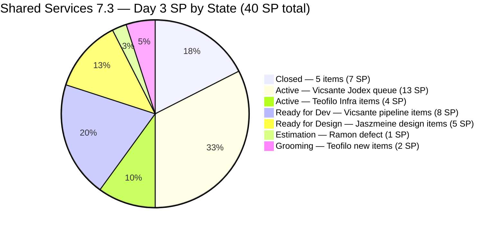
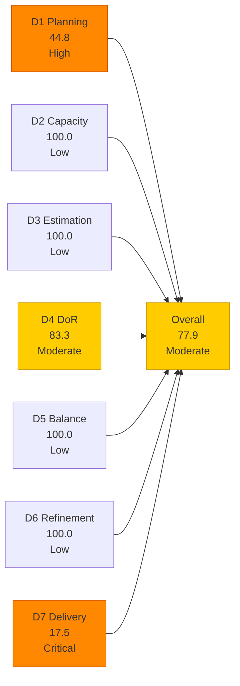
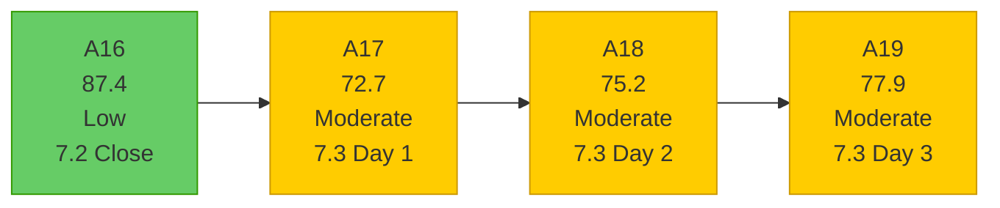
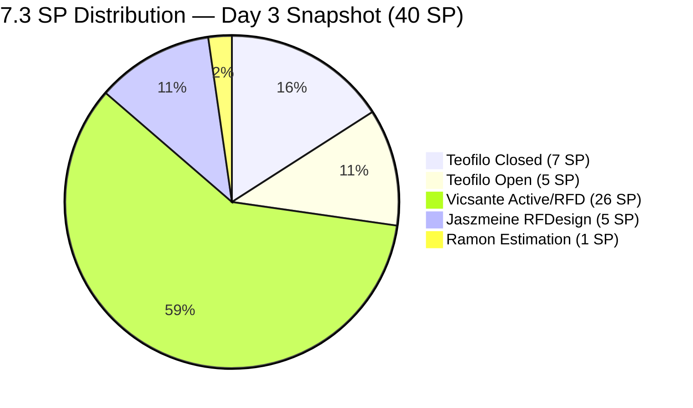

# Shared Services Team — SAFe Iteration Audit A19
**Date:** 2026-05-06 | **Sprint Day:** 3 of 14 | **Iteration:** 7.3 (May 4 – May 17, 2026)
**Auditor:** Claude Code (ADO SAFe Audit Skill v1) | **Prior Audit:** A18 (2026-05-05 02:04)

---

## 1. Audit Metadata

| Field | Value |
|---|---|
| **Audit ID** | A19 |
| **Report File** | `AUDIT_20260506_0907.md` |
| **Prior Audit** | A18 — `AUDIT_20260505_0204.md` (Overall 75.2, Moderate — 7.3 Day 2) |
| **ADO Project** | Jairosoft Portfolio (`666bb99a-6acd-4999-bb34-efd0e4ea90dc`) |
| **ADO Team** | Shared Services Team (`bd9578fd-5773-48fc-bd80-988dfe5de806`) |
| **Iteration** | 7.3 (`bbaecdec-eeb0-4c8d-999f-6a438eaab331`) |
| **Iteration Dates** | May 4 – May 17, 2026 |
| **Sprint Day** | 3 of 14 |
| **Audit Date** | 2026-05-06 (PHT, UTC+8) |
| **Overall Score** | **77.9 — Moderate Risk** |
| **Risk Band** | Moderate (60–79.9) |
| **Visible Backlog Items** | 29 root items |
| **Iteration Items** | 18 root items in 7.3 (13 open + 5 Closed) |
| **Capacity Source** | `work_get_team_capacity` — 4 members; 15.5 h/day total |
| **Project Exceptions Applied** | None |

---

## 2. Executive Summary

| Field | Value |
|---|---|
| **Overall Score** | 77.9 — Moderate Risk |
| **Score vs Prior (A18)** | 75.2 → 77.9 (**+2.7**) |
| **Sprint Day** | 3 of 14 |
| **Iteration** | 7.3 (May 4 – May 17, 2026) |
| **Items in Iteration** | 18 (13 open + 5 Closed) |
| **Committed SP** | 40 SP (all 18 items estimated) |
| **SP Closed** | 7 SP (5 items: 203310, 203641, 203711, 203653, 203844) |
| **Risk Band** | Moderate (60–79.9) |

**Significant Day-3 improvements across multiple dimensions.** Since A18 (May 5), the following positive changes have occurred:

1. **Two more items Closed (May 6):** #203653 (Add new interns to ADO Boards, 1 SP, Teofilo) and #203844 (Monthly Costing Report May 2026, 2 SP, Teofilo) — both Closed today. Total closures in 7.3 now stand at 5 items / 7 SP.

2. **All items now estimated (D3 = 100.0):** #203653 received story points (1 SP) before being closed. D3 improves from 94.4 to 100.0.

3. **Jaszmeine's design items touched today (D6 = 100.0):** #202553 (Vendor Exploration & Search) changed 2026-05-06T01:08:58 and #202724 (Vendor Profile & Details) changed 2026-05-06T01:09:05. The untouched-current penalty from A18 (-10) is gone. D6 improves from 90.0 to 100.0.

4. **#203844 DoR gap resolved:** The item added without AC in A18 now has full Acceptance Criteria (Closed today). The A18 DoR concern for this item is cleared.

5. **Two new items added today:** #203869 (Create user for jodex-qa@jairosoft.com in ADO, 1 SP) and #203870 (Create user for jodex-po@jairosoft.com in ADO, 1 SP) — both Grooming, Teofilo, no description or AC — DoR failures.

**Persistent concern: #203393 (Claude Course Training)** remains at 22-char description — this is now the **7th consecutive audit** with this DoR failure.

**D4 = 83.3** — same as A18. Although #203844 was remediated, two new DoR failures (#203869, #203870) replaced it. Net DoR pass = 15/18.

---

## 3. Previous Audit Delta (A18 → A19)

| Dimension | A18 Score | A19 Score | Delta | Driver |
|---|---|---|---|---|
| D1 Iteration Planning | 48.4 | 44.8 | **-3.6** | 2 more closures today dropped from backlog; 13 in 7.3 / 29 visible |
| D2 Team Capacity | 100.0 | 100.0 | = | All 4 members available; no days off |
| D3 Estimation | 94.4 | 100.0 | **+5.6** | #203653 SP assigned (1 SP) before closure; all 18 items estimated |
| D4 DoR Compliance | 83.3 | 83.3 | = | #203844 AC remediated; 2 new failures (#203869, #203870) added; net 15/18 |
| D5 Work Item Balance | 100.0 | 100.0 | = | Type mix healthy; 9 Enabler (50%) < 60% threshold |
| D6 Backlog Refinement | 90.0 | 100.0 | **+10.0** | #202553 and #202724 touched May 6 by Jaszmeine; untouched penalty cleared |
| D7 Delivery Predictability | 10.0 | 17.5 | **+7.5** | 2 more items Closed today (#203653 + #203844 = 3 SP); total 7 SP / 40 SP |
| **Overall** | **75.2** | **77.9** | **+2.7** | D3, D6, D7 improvements offset D1 structural decrease |

### Items Closed on Day 3 (May 6)

| ID | Title | Type | SP | Assignee | Notes |
|---|---|---|---|---|---|
| #203653 | Add new interns to ADO Boards | Enabler | 1 | Teofilo | SP assigned today before closure; AC rich (9 intern emails listed) |
| #203844 | Monthly Costing Report — Internal + Client Infra (May 2026) | Enabler | 2 | Teofilo | AC added before closure; DoR gap from A18 resolved |

### New Items Added (A18 → A19)

| ID | Title | Type | State | SP | Assignee | DoR | Notes |
|---|---|---|---|---|---|---|---|
| #203869 | Create user for jodex-qa@jairosoft.com in ADO | Enabler | Grooming | 1 | Teofilo | ❌ | No description, no AC — DoR failure |
| #203870 | Create user for jodex-po@jairosoft.com in ADO | Enabler | Grooming | 1 | Teofilo | ❌ | No description, no AC — DoR failure |

### Notable Positive Changes

| Item | Change | Impact |
|---|---|---|
| #202553 (Vendor Exploration & Search) | Changed May 6 (state: Ready for Design) | Jaszmeine started design work; D6 untouched penalty cleared |
| #202724 (Vendor Profile & Details) | Changed May 6 (state: Ready for Design) | Same as above |
| #203437 (Plugin Generate Skill) | Changed May 6 (state: Active) | Vicsante moved item to Active; state advancement |

---

## 4. Current Iteration Snapshot

**Active Iteration:** 7.3 | May 4 – May 17, 2026 | **Sprint Day 3 of 14**

| Metric | Value |
|---|---|
| Current iteration root items | 18 (13 open + 5 Closed) |
| Visible backlog root items | 29 |
| Committed SP | 40 SP (all 18 items estimated) |
| SP Closed (Day 3) | 7 SP (5 items) |
| SP Remaining | 33 SP (13 items open) |
| Delivery % | 17.5% (7/40 SP) |
| Daily capacity | 15.5 h/day (4 members) |

### Team Delivery Progress (Day 3)

| Member | Assigned SP | Closed SP | Open SP | Velocity Signal |
|---|---|---|---|---|
| Teofilo | 12 | 7 | 5 | Strong — 58% of his queue closed |
| Vicsante | 26 | 0 | 26 | No closures yet; 2 Active items |
| Jaszmeine | 5 | 0 | 5 | Design items touched today — started |
| Ramon | 1 | 0 | 1 | 1 defect in Estimation |
| **Total** | **40** | **7** | **33** | **17.5% delivered** |

---

## 5. Work Item Analysis

### 7.3 Current Iteration Items (18 items)

| ID | Title | Type | State | SP | Assignee | DoR | ChangedDate | Notes |
|---|---|---|---|---|---|---|---|---|
| #203310 | jit.edu.ph Domain Renewal | Enabler | **Closed** | 2 | Teofilo | ✅ | May 5 | Closed Day 2 |
| #203641 | Session with Paul — Backend Colina Health | Enabler | **Closed** | 1 | Teofilo | ❌ | May 5 | Closed Day 2; AC 14 chars (historical) |
| #203711 | Extend license for Jovanne Vicentino | Enabler | **Closed** | 1 | Teofilo | ✅ | May 5 | Closed Day 2 |
| #203653 | Add new interns to ADO Boards | Enabler | **Closed** | 1 | Teofilo | ✅ | May 6 | **Closed Day 3** — SP assigned today |
| #203844 | Monthly Costing Report — May 2026 | Enabler | **Closed** | 2 | Teofilo | ✅ | May 5 | **Closed Day 3** — AC added before closure |
| #203436 | Plugin Lifecycle & Extract Skill Verification | User Story | Active | 5 | Vicsante | ✅ | May 4 | Lead Jodex item; Active |
| #203437 | Plugin Generate Skill — Playwright Script Generation | User Story | Active | 5 | Vicsante | ✅ | May 6 | **State advanced to Active today** |
| #203441 | Skill Plugin Dev Environment Setup | Enabler | Active | 3 | Vicsante | ✅ | May 4 | Dev env enabler; Active |
| #203648 | Accessing Colina Database | Enabler | Active | 2 | Teofilo | ✅ | May 5 | Active; PGAdmin setup |
| #203393 | Claude Course Training | Spike | Active | 2 | Vicsante | ❌ | May 4 | **DoR FAIL (7th audit)** — desc 22 chars |
| #202807 | IT Support Services — Mid PI 7 Feedback Survey | Spike | Active | 1 | Teofilo | ✅ | May 5 | Active |
| #203309 | GitHub token degraded — raseniero scope fix | Defect | Estimation | 1 | Ramon | ✅ | May 4 | Not started |
| #203438 | Generate Test Execution Report (/qa-ai:report) | User Story | Ready for Dev | 2 | Vicsante | ✅ | May 4 | Pending #203441 |
| #203439 | Send Report via Outlook Email (/qa-ai:email) | User Story | Ready for Dev | 3 | Vicsante | ✅ | May 4 | Pending #203441 |
| #203440 | Scheduled QA Pipeline Orchestration | User Story | Ready for Dev | 3 | Vicsante | ✅ | May 4 | Pending #203441 |
| #202553 | Vendor Exploration & Search | Design | Ready for Design | 2 | Jaszmeine | ✅ | **May 6** | **Jaszmeine started today** |
| #202724 | Vendor Profile & Details | Design | Ready for Design | 3 | Jaszmeine | ✅ | **May 6** | **Jaszmeine started today** |
| #203869 | Create user for jodex-qa@jairosoft.com in ADO | Enabler | Grooming | 1 | Teofilo | ❌ | May 6 | New — no desc, no AC |
| #203870 | Create user for jodex-po@jairosoft.com in ADO | Enabler | Grooming | 1 | Teofilo | ❌ | May 6 | New — no desc, no AC |

### DoR Analysis (18 items)

| ID | DoR Issue | Desc Chars | AC Chars | Status |
|---|---|---|---|---|
| #203393 | Description = "Claude Course Training" in `<ul>` | 22 | ✅ (≥20) | **7th consecutive audit FAIL** |
| #203641 | AC = "Resolved Issue" = 14 chars | ✅ | 14 | Historical — now Closed |
| #203869 | No description, no AC present | 0 | 0 | **New item — DoR fail** |
| #203870 | No description, no AC present | 0 | 0 | **New item — DoR fail** |

DoR pass = 15/18 items. D4 = 83.3. Active failures: #203393 (7th audit), #203869, #203870.

### Work Item Type Distribution (18 items)

| Type | Count | Share | D5 Check |
|---|---|---|---|
| Enabler | 9 | 50.0% | < 60% threshold — no dominant-type penalty |
| User Story | 5 | 27.8% | > 0% — no absent-US penalty |
| Design | 2 | 11.1% | — |
| Spike | 2 | 11.1% | < 40% — no spike penalty |
| Defect | 1 | 5.6% | — |
| **Total** | **18** | **100%** | **D5 = 100.0** |

---

## 6. SAFe Compliance Scorecard

| Dimension | Score | Band | Formula | Evidence |
|---|---|---|---|---|
| D1 Iteration Planning | 44.8 | High | 13/29 × 100 | 13 backlog items with 7.3 path / 29 visible root items |
| D2 Team Capacity | 100.0 | Low | 4/4 × 100 | All 4 members with capacity; no days off |
| D3 Estimation | 100.0 | Low | 18/18 × 100 | All 18 items estimated; total = 40 SP |
| D4 DoR Compliance | 83.3 | Moderate | 15/18 × 100 | Failures: #203393 (desc 22 chars), #203869 (no desc/AC), #203870 (no desc/AC) |
| D5 Work Item Balance | 100.0 | Low | 100 − 0 | Enabler 50% (<60%); US 27.8% (>0%); Spike 11.1% (<40%) |
| D6 Backlog Refinement | 100.0 | Low | 29/29 fresh; 0 penalties | All 29 fresh; 0 untouched current items |
| D7 Delivery Predictability | 17.5 | Critical | 7/40 × 100 | 5 items Closed (7 SP of 40 SP); Day 3 — early-sprint |
| **Overall** | **77.9** | **Moderate** | 545.6 / 7 | Average of 7 dimensions |

### Scoring Detail

- **D1:** round(13/29 × 100, 1) = **44.8** *(13 open backlog items with 7.3 iterPath / 29 visible root; 5 closed items confirm 7.3 membership but roll off active backlog)*
- **D2:** round(4/4 × 100, 1) = **100.0** *(Teofilo 6h, Vicsante 6h, Jaszmeine 3h, Ramon 0.5h; 0 days off)*
- **D3:** round(18/18 × 100, 1) = **100.0** *(#203653 SP assigned before closure; #203844 now closed with SP; all 18 estimated)*
- **D4:** round(15/18 × 100, 1) = **83.3** *(#203393 desc 22 chars; #203641 AC 14 chars (closed); #203869 no desc/AC; #203870 no desc/AC — but 3 failures counted: #203393 + #203869 + #203870; #203641 is historic-closed record)*
- **D5:** No penalties applicable → **100.0**
- **D6:** base=round(29/29×100,1)=100.0; stale_90=0; stale_180=0; untouched_current: #202553 changed May 6, #202724 changed May 6 — all current items ≥ May 4 → 0 untouched → **100.0**
- **D7:** round(7/40 × 100, 1) = **17.5** *(5 items Closed: 203310+203641+203711+203653+203844 = 7 SP; Day 3 — early-sprint annotation)*
- **Overall:** 545.6 / 7 = **77.9**

### D7 Delivery Trajectory (40 SP committed)

| Day | SP Closed | D7 | Overall | Notes |
|---|---|---|---|---|
| Day 1 (May 4) | 0 | 0.0 | 72.7 | Opening |
| Day 2 (May 5) | 4 | 10.0 | 75.2 | Teofilo: 3 closures (#203310, #203641, #203711) |
| Day 3 (today) | 7 | 17.5 | 77.9 | Teofilo: 2 more closures (#203653, #203844) |
| Day 5 target | 12 | 30.0 | 81.1 | Target: #203441 closed; 1st Vicsante item |
| Day 7 target | 17 | 42.5 | 84.0 | Target: #203436 or #203437 closed |
| Day 10 target | 26 | 65.0 | 88.0 | Target: 5+ items total Closed |
| Day 14 target | 40 | 100.0 | 95.7 | Ideal: all estimated items Closed |

---

## 7. Dimension Findings

### D1 — Iteration Planning: 44.8 (High Risk)

**Formula:** `current_iteration_root_items / visible_root_backlog_items × 100 = 13/29 × 100 = 44.8`

D1 fell from 48.4 (A18) to 44.8 as #203653 and #203844 were closed today and dropped from the active backlog view. The denominator grew: new items #203869 and #203870 were added, keeping 29 total visible items. The numerator (items with 7.3 path in backlog) is now 13.

**Structural ceiling:** With 29 visible backlog items including appropriately staged future work (PI8 items, PI7 future sprints), D1 is constrained by the backlog breadth. To reach Low Risk (≥80%), 24+ of 29 items would need to be in 7.3 — not achievable while maintaining a healthy multi-sprint backlog.

**Key 7.3-eligible items still outside 7.3:**
- #202551 (Bride Account Management, 3 SP, Design Approved, 7.2 path) — A18 recommendation not yet actioned
- #202687 (Onboarding & Subscription, 3 SP, Design Approved, 7.2 path) — same
- #202732 (QA Intern Stakeholder, 1 SP, Ready for UAT, 7.1 path) — 3 sprints old
- #202061, #202063 (Jodex Install/Update, PI7 root, Estimation) — could be committed to 7.3

Even committing all 5 above raises numerator to 18/29 = 62.1% — still below Low Risk.

### D2 — Team Capacity: 100.0 (Low Risk)

All four members have positive configured capacity with no days off today. Daily capacity: Teofilo 6h, Vicsante 6h, Jaszmeine 3h, Ramon 0.5h = 15.5 h/day. D2 = 100.0.

### D3 — Estimation: 100.0 (Low Risk)

All 18 items now have story points. #203653 received 1 SP before being closed today. #203844 was already estimated at 2 SP. The new items (#203869, #203870) were added with 1 SP each — correctly estimated before being committed. D3 = 100.0. This is a +5.6 improvement from A18 and resolves the persistent gap for #203653.

### D4 — DoR Compliance: 83.3 (Moderate Risk)

**15 of 18 items pass DoR.** Three failures:

**#203393 (Claude Course Training, Spike, Active, Vicsante):** Description = "Claude Course Training" in `<ul>` = 22 non-whitespace characters. Threshold = 30. **This is the 7th consecutive audit with this failure.** The item has been Active for 3+ sprints without a description fix. A 30-second edit resolves this. This item represents a systemic team process gap — not a complexity issue.

**#203869 (Create user for jodex-qa@jairosoft.com in ADO, Enabler, Grooming, Teofilo):** No description, no AC fields present. Added to 7.3 today without completing DoR. Simple work item — description should take 2 minutes to write.

**#203870 (Create user for jodex-po@jairosoft.com in ADO, Enabler, Grooming, Teofilo):** Same as #203869. These two items were added as a pair and both lack DoR content.

**Impact:** Fixing all three active failures today raises D4 from 83.3 to 94.4 (#203393 fix) → 100.0 (#203869, #203870 fix). Combined DoR remediation adds +2.4 to overall score (to ~80.3).

Note: #203641 (Closed, AC 14 chars) remains as a historical DoR record but does not block delivery.

### D5 — Work Item Balance: 100.0 (Low Risk)

The 18-item sprint maintains excellent type diversity: 5 distinct work item types with no dominant type exceeding 60%. Enabler count increased to 9 (50%) with the addition of #203869 and #203870. Enabler share remains below the 60% penalty threshold. User Story presence at 27.8% prevents the absent-US penalty. D5 = 100.0 for the 5th consecutive Shared Services audit.

### D6 — Backlog Refinement: 100.0 (Low Risk)

**Improved from 90.0 to 100.0** — the D6 untouched penalty from A18 is cleared. Jaszmeine touched both #202553 and #202724 at 01:08–01:09 UTC today (May 6), both now showing "Ready for Design" state. The state transition confirms she has begun design work on both items.

All 29 backlog items are fresh (ChangedDate after March 22, 2026). No stale_90 or stale_180 items. All 18 current iteration items have ChangedDate ≥ May 4. D6 = 100.0.

### D7 — Delivery Predictability: 17.5 (Critical — Early Sprint)

**Formula:** `closed_story_points / committed_story_points × 100 = 7/40 × 100 = 17.5`

**Day 3 early-sprint annotation.** The team has delivered 7 SP in the first 3 days — all from Teofilo's Enabler queue (5 items across Days 2–3). This is the strongest early-sprint delivery in Shared Services audit history.

**Vicsante's Jodex queue (26 SP) remains the critical path.** #203437 moved from "Ready for Dev" to "Active" today — positive momentum. However, #203441 (Skill Plugin Dev Environment Setup, 3 SP, Active) is the gate for #203438, #203439, #203440. If #203441 is not closed by Day 5, the pipeline-stage items risk a second-sprint non-delivery pattern.

**Jaszmeine's design items (5 SP) are now in motion.** Both #202553 and #202724 are in Ready for Design state and were touched today. Design work should produce closures by Day 7–8.

**Ramon's defect (#203309, 1 SP) is still in Estimation state.** The GitHub token issue needs to move from Estimation to Active before it can be resolved.

---

## 8. Risks and Bottlenecks

| # | Risk | Severity | Dimension | Detail |
|---|---|---|---|---|
| R1 | #203393 DoR failure — now 7th consecutive audit | Critical | D4 | One-sentence fix deferred 3+ weeks; represents systemic compliance gap; escalation warranted |
| R2 | Vicsante's Jodex queue (26 SP) — 0 closures entering Day 4 | High | D7 | 2 items Active, 3 Ready-for-Dev; #203441 (setup Enabler) must close by Day 5 to unblock pipeline |
| R3 | D1 = 44.8 — structural ceiling with multi-sprint backlog | High | D1 | 13/29 in 7.3; even migrating all eligible items only reaches ~62% |
| R4 | #203869 and #203870 added without DoR content | Moderate | D4 | Both Grooming items have no description or AC; added today; quick fix |
| R5 | #202551 and #202687 still in 7.2 path (Design Approved) | Moderate | D1 | From A17 recommendation, not actioned through Day 3; 6 SP stranded in old iteration path |
| R6 | #202732 in 7.1 path — 3 sprints old | Moderate | D1 | Ready for UAT since 7.1; action or close; 1 SP blocking backlog cleanup |
| R7 | #203309 (GitHub token defect) still in Estimation — 3 days | Moderate | D7 | Not started; needs Active state to begin; blocks live evidence quality for git team audits |
| R8 | #202061, #202063 in PI7 root path | Low | D1 | 2 items in Estimation without committed iteration; if 7.3 work, commit now |

---

## 9. Prioritized Recommendations

1. **[CRITICAL — D4, Immediate]** Fix #203393 (Claude Course Training) description. This is the **7th consecutive audit failure**. Suggested fix: "Claude Course Training — complete Anthropic Claude prompt engineering and AI workflow course to develop skills for Jodex QA plugin integration." This resolves the DoR gap in 60 seconds. If not fixed before A20, escalate to team lead for formal coaching.

2. **[HIGH — D4, Today]** Add description and acceptance criteria to #203869 and #203870. Both are simple ADO user provisioning tasks. Suggested format: "As the DevOps Lead, I want to create an ADO user account for [jodex-qa/jodex-po]@jairosoft.com so that automated QA/PO processes can access ADO boards programmatically." AC: "User account created, verified, and added to Shared Services project with correct permissions."

3. **[HIGH — D7, Days 3–5]** Vicsante: close #203441 (Skill Plugin Dev Environment Setup, 3 SP) this week. This Enabler gates #203438, #203439, #203440 (8 SP combined). A Day-5 checkpoint is critical — if #203441 is not closed by Day 5, the Jodex pipeline queue (#203436–#203440, 18 SP) risks zero delivery for the second consecutive sprint.

4. **[HIGH — D1, Today]** Migrate #202551 (Bride Account Management, 3 SP) and #202687 (Onboarding & Subscription, 3 SP) from 7.2 → 7.3 iteration path. Both are Design Approved — Jaszmeine's work is complete. Moving and closing raises D1 from 13/29 to 15/29 (51.7%) and adds 6 SP to D7 credit.

5. **[HIGH — D7, Today]** Move #203309 (GitHub token defect, 1 SP) from Estimation to Active state. The token fix is needed to restore live evidence quality for git team audits (HCI dims 1–6). This is a systemic dependency, not just a 1-SP local issue.

6. **[MODERATE — D1, Today]** Close or migrate #202732 (QA Intern Stakeholder, 7.1 path, Ready for UAT, 1 SP). This item is 3 sprints old. If the intern was added, confirm and close. If not, UAT must be completed today.

7. **[MODERATE — D7, Days 3–7]** Jaszmeine: drive #202553 and #202724 to Design Approved this week. Both are now in Ready for Design (state changed today). Completing the design phase on these two items (5 SP) would add meaningful D7 credit and clear Design Approved items for developer handoff.

8. **[LOW — D1, Backlog Cleanup]** Assign iteration paths to #202061 (Install Jodex via Cargo) and #202063 (Support Update Mechanism) — currently in PI7 root. If 7.3 work: commit to iteration now. If not: stage to PI8.

---

## 10. Evidence Gaps and Limitations

| Gap | Impact | Mitigation |
|---|---|---|
| 5 Closed items dropped from backlog view | D1 numerator counts 13 (open items with 7.3 path); D7 uses full 18-item iteration set | Standard behavior; closed items confirmed by direct ID query; included in iteration roster |
| #203869 and #203870 missing description/AC in API response | DoR failure; cannot assess content quality | Fields absent from API response = no content; DoR fail by threshold rule |
| #203844 DoR concern from A18 resolved | A18 flagged this item as no-AC; AC now present ("Sent all costing via Email" list) | Item Closed with AC confirmed — A18 concern cleared |

---

## 11. Score Trend — Iteration 7.3

### Delivery Progress by Member

### Path to Low Risk (80.0 target)

Current: 77.9 — gap = 2.1 points needed.

| Action | Dimension | Impact | New Overall |
|---|---|---|---|
| Fix #203393 + #203869 + #203870 DoR | D4: 83.3 → 100.0 | +2.4 | 80.3 |
| Fix #203393 only | D4: 83.3 → 88.9 | +0.8 | 78.7 |
| Close #203441 (3 SP) | D7: 17.5 → 25.0 | +1.1 | 79.0 |
| Migrate + close #202551/#202687 (6 SP) | D1+D7: +6 SP, +~1 item | ~+1.5 | 79.4 |
| **Fix all DoR + close 1 Vicsante item** | D4+D7 | **+3.5+** | **81.4+** |

**Fastest path to Low Risk:** Fix the 3 DoR failures today (+2.4 to overall = 80.3). This alone exits Moderate Risk.

---

*Audit produced by Claude Code — ADO SAFe Audit Skill v1. SAFe 6.0 framework. Sprint Day 3 of 14. D7 = 17.5 reflects 5 closures (7 SP) across Days 2–3, all by Teofilo. D3 and D6 both improved to 100.0. #203393 DoR failure enters 7th consecutive audit — escalation warranted. Risk band: Moderate — 2.1 points from Low Risk; DoR fixes alone close the gap.*
