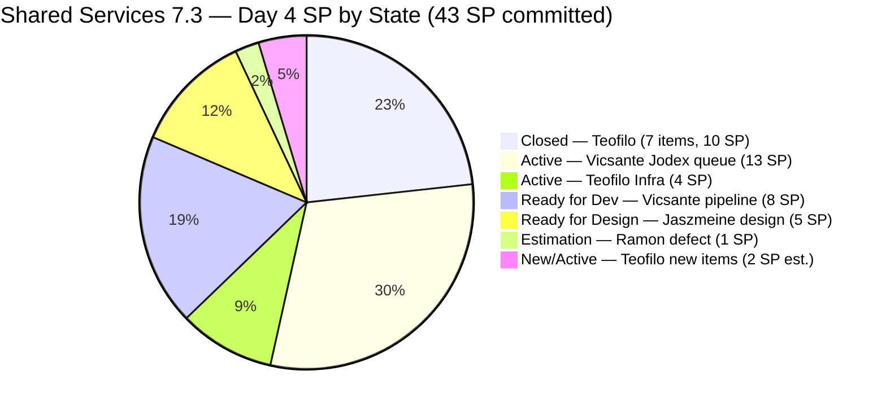
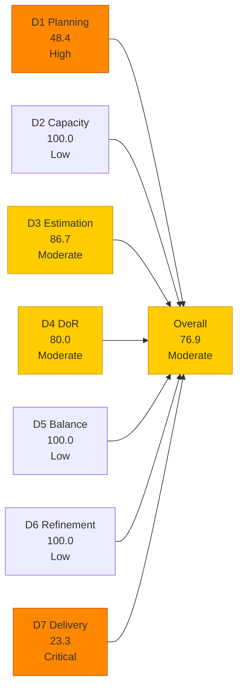
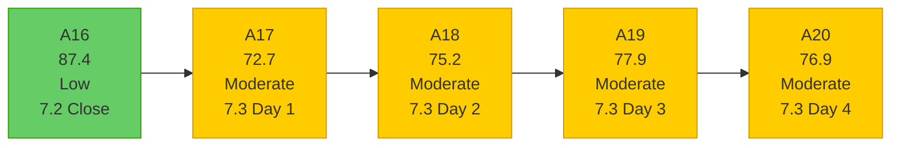

# Shared Services Team — SAFe Iteration Audit A20
**Date:** 2026-05-07 | **Sprint Day:** 4 of 14 | **Iteration:** 7.3 (May 4 – May 17, 2026)
**Auditor:** Claude Code (ADO SAFe Audit Skill v1) | **Prior Audit:** A19 (2026-05-06 09:07)

---

## 1. Audit Metadata

| Field | Value |
|---|---|
| **Audit ID** | A20 |
| **Report File** | `AUDIT_20260507_1611.md` |
| **Prior Audit** | A19 — `AUDIT_20260506_0907.md` (Overall 77.9, Moderate — 7.3 Day 3) |
| **ADO Project** | Jairosoft Portfolio (`666bb99a-6acd-4999-bb34-efd0e4ea90dc`) |
| **ADO Team** | Shared Services Team (`bd9578fd-5773-48fc-bd80-988dfe5de806`) |
| **Iteration** | 7.3 (`bbaecdec-eeb0-4c8d-999f-6a438eaab331`) |
| **Iteration Dates** | May 4 – May 17, 2026 |
| **Sprint Day** | 4 of 14 |
| **Audit Date** | 2026-05-07 (PHT, UTC+8) |
| **Overall Score** | **76.9 — Moderate Risk** |
| **Risk Band** | Moderate (60–79.9) |
| **Visible Backlog Items** | 31 root items |
| **Iteration Items** | 22 root items in 7.3 (15 open + 7 Closed) |
| **Capacity Source** | `work_get_team_capacity` — 4 members; 15.5 h/day total |
| **Project Exceptions Applied** | None |

---

## 2. Executive Summary

| Field | Value |
|---|---|
| **Overall Score** | 76.9 — Moderate Risk |
| **Score vs Prior (A19)** | 77.9 → 76.9 (**−1.0**) |
| **Sprint Day** | 4 of 14 |
| **Iteration** | 7.3 (May 4 – May 17, 2026) |
| **Items in Iteration** | 22 (15 open + 7 Closed) |
| **Committed SP** | 43 SP (20 estimated items; 2 items unestimated) |
| **SP Closed** | 10 SP (7 items Closed) |
| **Risk Band** | Moderate (60–79.9) |

**Overall score declined by 1.0 point since A19.** The decline is driven by four concurrent changes that net negative:

1. **Two new unestimated items added:** #203908 (Recover Bubble Account) and #203909 (MFT Reduction for Colina) were added to 7.3 today without story point estimates. This drops D3 from 100.0 to 86.7.

2. **DoR failures revised:** #203869 and #203870 had their descriptions and acceptance criteria added today (both now pass DoR). However, #203908 (no desc, no AC) and #203909 (has desc but no AC) introduced two new DoR failures. #203393 continues its streak. Net active failures = 3, giving D4 = 80.0 (down from 83.3 via changed composition).

3. **One new hidden closure discovered:** #203630 (Back up AutoAllies DB, 2 SP, Teofilo) was confirmed Closed May 5 via `wit_get_work_items_for_iteration`. It was not present in A19's backlog API response. Additionally, #202807 (IT Support Services — Mid PI 7 Feedback Survey, 1 SP, Teofilo) was Closed on May 6 and also not visible in A19. These 2 additional closures improve D7.

4. **D1 improves to 48.4:** New items in 7.3 path expand both numerator (15 open in 7.3) and denominator (31 visible), netting a D1 improvement from 44.8 to 48.4.

The net scorecard effect: D3 and D4 each decline, D1 and D7 improve, and the overall falls by 1.0 to **76.9**.

**#203393 DoR failure enters its 8th consecutive audit.** Escalation is now overdue.

---

## 3. Previous Audit Delta (A19 → A20)

| Dimension | A19 Score | A20 Score | Delta | Driver |
|---|---|---|---|---|
| D1 Iteration Planning | 44.8 | 48.4 | **+3.6** | 2 new items in 7.3 path (#203908, #203909); 15 open / 31 visible |
| D2 Team Capacity | 100.0 | 100.0 | = | All 4 members available; no days off |
| D3 Estimation | 100.0 | 86.7 | **−13.3** | #203908 and #203909 added without SP; 13/15 estimated |
| D4 DoR Compliance | 83.3 | 80.0 | **−3.3** | #203869/#203870 remediated; #203908/#203909 new failures; #203393 persists; 12/15 pass |
| D5 Work Item Balance | 100.0 | 100.0 | = | Enabler 40% (<60%); US present; Spike <40% — no penalties |
| D6 Backlog Refinement | 100.0 | 100.0 | = | All 31 items fresh; 0 untouched current items |
| D7 Delivery Predictability | 17.5 | 23.3 | **+5.8** | 2 hidden closures found (#203630, #202807); total 10 SP / 43 SP committed |
| **Overall** | **77.9** | **76.9** | **−1.0** | D3+D4 declines outweigh D1+D7 gains |

### Hidden Closures Discovered (A20)

| ID | Title | Type | SP | Assignee | Closed Date | A19 Status |
|---|---|---|---|---|---|---|
| #203630 | Back up AutoAllies DB in Blob Storage in Portal Azure | Enabler | 2 | Teofilo | May 5 | Not visible in A19 backlog API |
| #202807 | IT Support Services — Mid of PI 7 Feedback Survey | Spike | 1 | Teofilo | May 6 | Shown as Active in A19 |

Both items were excluded from the A19 backlog API response (already Closed). Discovered via `wit_get_work_items_for_iteration` roster. A19's reported 5 closed items / 7 SP was an undercount; actual = 7 closed items / 10 SP as of Day 3.

### New Items Added (A19 → A20)

| ID | Title | Type | State | SP | Assignee | DoR | Notes |
|---|---|---|---|---|---|---|---|
| #203908 | Recover Bubble Account | Enabler | New | — | Teofilo | ❌ | No description, no AC, no SP — triple gap |
| #203909 | MFT Reduction for Colina | Enabler | New | — | Teofilo | ❌ | Has description (~52 chars ✅) but no AC — DoR fail |

### DoR Remediation (A19 → A20)

| ID | A19 Status | A20 Status | Change |
|---|---|---|---|
| #203869 | ❌ No desc/AC | ✅ Full desc + AC | **Remediated** — description and AC added today |
| #203870 | ❌ No desc/AC | ✅ Full desc + AC | **Remediated** — description and AC added today |

---

## 4. Current Iteration Snapshot

**Active Iteration:** 7.3 | May 4 – May 17, 2026 | **Sprint Day 4 of 14**

| Metric | Value |
|---|---|
| Full 7.3 iteration root items | 22 (15 open + 7 Closed) |
| Open items in 7.3 (backlog view) | 15 |
| Visible backlog root items | 31 |
| Committed SP | 43 SP (20 estimated items; 2 unestimated: #203908, #203909) |
| SP Closed (Day 4) | 10 SP (7 items) |
| SP Remaining | 33 SP (13 open estimated items) |
| Delivery % | 23.3% (10/43 SP) |
| Daily capacity | 15.5 h/day (4 members) |

### Team Delivery Progress (Day 4)

| Member | Assigned SP | Closed SP | Open SP | Velocity Signal |
|---|---|---|---|---|
| Teofilo | ~14 SP (12 est. + 2 unest.) | 10 SP (7 items) | ~4 SP est. open | Excellent — 71% of estimated queue closed; 2 new unestimated items |
| Vicsante | 26 SP | 0 SP | 26 SP | No closures yet — 2 Active, 3 Ready for Dev |
| Jaszmeine | 5 SP | 0 SP | 5 SP | In motion — both items active in Ready for Design |
| Ramon | 1 SP | 0 SP | 1 SP | Defect in Estimation state |
| **Total** | **43 SP** | **10 SP** | **~33 SP** | **23.3% delivered** |

---

## 5. Work Item Analysis

### 7.3 Full Iteration Roster (22 items)

| ID | Title | Type | State | SP | Assignee | DoR | ChangedDate | Notes |
|---|---|---|---|---|---|---|---|---|
| #203310 | jit.edu.ph Domain Renewal | Enabler | **Closed** | 2 | Teofilo | ✅ | May 5 | Closed Day 2 |
| #203641 | Session with Paul — Backend Colina Health | Enabler | **Closed** | 1 | Teofilo | ❌ | May 5 | Closed Day 2; AC 14 chars (historical) |
| #203711 | Extend license for Jovanne Vicentino | Enabler | **Closed** | 1 | Teofilo | ✅ | May 5 | Closed Day 2 |
| #203630 | Back up AutoAllies DB in Blob Storage | Enabler | **Closed** | 2 | Teofilo | ✅ | May 5 | **Hidden closure — not in A19**; Closed Day 2 |
| #203653 | Add new interns to ADO Boards | Enabler | **Closed** | 1 | Teofilo | ✅ | May 6 | Closed Day 3 |
| #203844 | Monthly Costing Report — May 2026 | Enabler | **Closed** | 2 | Teofilo | ✅ | May 5 | Closed Day 3 |
| #202807 | IT Support Services — Mid PI 7 Feedback Survey | Spike | **Closed** | 1 | Teofilo | ✅ | May 6 | **Hidden closure — shown Active in A19**; Closed Day 3 |
| #203648 | Accessing Colina Database | Enabler | Active | 2 | Teofilo | ✅ | May 5 | PGAdmin setup |
| #203869 | Create user for jodex-qa@jairosoft.com in ADO | Enabler | Active | 1 | Teofilo | ✅ | **May 7** | **DoR remediated today** — full desc + AC added |
| #203870 | Create user for jodex-po@jairosoft.com in ADO | Enabler | Active | 1 | Teofilo | ✅ | **May 7** | **DoR remediated today** — full desc + AC added |
| #203908 | Recover Bubble Account | Enabler | New | — | Teofilo | ❌ | **May 7** | **New** — no desc, no AC, no SP — triple gap |
| #203909 | MFT Reduction for Colina | Enabler | New | — | Teofilo | ❌ | **May 7** | **New** — desc present (~52 chars ✅), no AC |
| #203309 | GitHub token degraded — raseniero scope fix | Defect | Estimation | 1 | Ramon | ✅ | May 4 | Still in Estimation; not started |
| #203393 | Claude Course Training | Spike | Active | 2 | Vicsante | ❌ | May 4 | **DoR FAIL (8th consecutive audit)** — desc 22 chars |
| #203436 | Plugin Lifecycle & Extract Skill Verification | User Story | Active | 5 | Vicsante | ✅ | May 4 | Lead Jodex item |
| #203437 | Plugin Generate Skill — Playwright Script Generation | User Story | Active | 5 | Vicsante | ✅ | May 6 | State advanced to Active Day 3 |
| #203441 | Skill Plugin Development Environment Setup | Enabler | Active | 3 | Vicsante | ✅ | May 4 | Gates #203438/#203439/#203440 |
| #202553 | Vendor Exploration & Search | Design | Ready for Design | 2 | Jaszmeine | ✅ | May 6 | In progress |
| #202724 | Vendor Profile & Details | Design | Ready for Design | 3 | Jaszmeine | ✅ | May 6 | In progress |
| #203438 | Generate Test Execution Report (/qa-ai:report) | User Story | Ready for Dev | 2 | Vicsante | ✅ | May 4 | Gated by #203441 |
| #203439 | Send Report via Outlook Email (/qa-ai:email) | User Story | Ready for Dev | 3 | Vicsante | ✅ | May 4 | Gated by #203441 |
| #203440 | Scheduled QA Pipeline Orchestration | User Story | Ready for Dev | 3 | Vicsante | ✅ | May 4 | Gated by #203441 |

### DoR Analysis — Open Items (15 items)

| ID | Issue | Desc Chars | AC Chars | Status |
|---|---|---|---|---|
| #203393 | Description = "Claude Course Training" in `<ul>` | 22 | ✅ (≥20) | **8th consecutive audit FAIL** |
| #203908 | No description, no AC, no SP | 0 | 0 | **New item — triple DoR gap** |
| #203909 | Has description (~52 chars ✅), no AC field | ~52 | 0 | **New item — AC gap** |

DoR pass = 12/15 open items. D4 = 80.0.
Active failures: #203393 (8 audits), #203908 (new), #203909 (new).

### Work Item Type Distribution — Open Items (15 items)

| Type | Count | Share | D5 Check |
|---|---|---|---|
| Enabler | 6 | 40.0% | < 60% threshold — no dominant-type penalty |
| User Story | 5 | 33.3% | > 0% — no absent-US penalty |
| Design | 2 | 13.3% | — |
| Spike | 1 | 6.7% | < 40% — no spike penalty |
| Defect | 1 | 6.7% | — |
| **Total** | **15** | **100%** | **D5 = 100.0** |

---

## 6. SAFe Compliance Scorecard

| Dimension | Score | Band | Formula | Evidence |
|---|---|---|---|---|
| D1 Iteration Planning | 48.4 | High | 15/31 × 100 | 15 open items with 7.3 IterationPath / 31 visible root items |
| D2 Team Capacity | 100.0 | Low | 4/4 × 100 | All 4 members with capacity; no days off |
| D3 Estimation | 86.7 | Moderate | 13/15 × 100 | #203908 and #203909 added without SP; 13 of 15 open items estimated |
| D4 DoR Compliance | 80.0 | Moderate | 12/15 × 100 | Failures: #203393 (desc 22 chars), #203908 (no desc/AC), #203909 (no AC) |
| D5 Work Item Balance | 100.0 | Low | 100 − 0 | Enabler 40% (<60%); US 33.3% (>0%); Spike 6.7% (<40%) |
| D6 Backlog Refinement | 100.0 | Low | 31/31 fresh; 0 penalties | All 31 items fresh; 0 stale; 0 untouched current items |
| D7 Delivery Predictability | 23.3 | Critical | 10/43 × 100 | 7 items Closed (10 SP) of 43 SP committed; Day 4 — early-sprint |
| **Overall** | **76.9** | **Moderate** | 538.4 / 7 | Average of 7 dimensions |

### Scoring Detail

- **D1:** round(15/31 × 100, 1) = **48.4** *(15 open backlog items with 7.3 IterationPath / 31 visible root; 7 closed items excluded from backlog view)*
- **D2:** round(4/4 × 100, 1) = **100.0** *(Teofilo 6h, Vicsante 6h, Jaszmeine 3h, Ramon 0.5h; no days off today)*
- **D3:** round(13/15 × 100, 1) = **86.7** *(#203908 and #203909 added without story points; 13 of 15 open items have SP>0)*
- **D4:** round(12/15 × 100, 1) = **80.0** *(3 active failures: #203393 desc=22 chars; #203908 no desc+no AC; #203909 no AC; #203641 historical closed — excluded per convention)*
- **D5:** No penalties applicable → **100.0**
- **D6:** base=round(31/31×100,1)=100.0; stale_90=0; stale_180=0; untouched_current: all 15 open items changed ≥ May 4 → 0 → **100.0**
- **D7:** Full 22-item 7.3 roster. Estimated items = 20 (all except #203908/#203909). Committed SP = 43. Closed items = 7; closed SP = 10. round(10/43 × 100, 1) = **23.3** *(Day 4 — early-sprint annotation)*
- **Overall:** (48.4+100.0+86.7+80.0+100.0+100.0+23.3) / 7 = 538.4 / 7 = **76.9**

**Population note (D7):** `committed_story_points` uses the full 7.3 iteration roster (all 20 estimated items, including 7 Closed). Closed items drop from the backlog view but remain part of committed sprint scope. Two unestimated items (#203908, #203909) are excluded from committed_SP per the skill definition (SP = 0 → not in `estimated_current_items`).

**Convention note (D4):** #203641 (Closed, AC 14 chars historical) is excluded from the active DoR failure count. Its closure pre-dates the AC issue's discovery and does not affect current team process behavior. The three active failures (#203393, #203908, #203909) are all on open items.

### D7 Delivery Trajectory (43 SP committed)

| Day | SP Closed | D7 | Overall | Notes |
|---|---|---|---|---|
| Day 1 (May 4) | 0 | 0.0 | ~72 | Opening |
| Day 2 (May 5) | 6 | 14.0 | ~74 | Teofilo: #203310(2)+#203711(1)+#203641(1)+#203630(2) — 3 visible + 1 hidden |
| Day 3 (May 6) | 10 | 23.3 | ~77 | Teofilo: #203653(1)+#203844(2)+#202807(1) — 2 visible + 1 hidden |
| Day 4 (today) | 10 | 23.3 | 76.9 | No new closures; D3+D4 drag from new items |
| Day 5 target | 13 | 30.2 | 78.5 | Target: #203441 closed (3 SP) — gates Vicsante pipeline |
| Day 7 target | 18 | 41.9 | 81.1 | Target: #203441 + #203436 or #203437 closed |
| Day 10 target | 27 | 62.8 | 86.4 | Target: 5–6 total Vicsante items Closed |
| Day 14 target | 43 | 100.0 | 97.1 | Ideal: all estimated items Closed |

---

## 7. Dimension Findings

### D1 — Iteration Planning: 48.4 (High Risk)

**Formula:** `current_iteration_root_items / visible_root_backlog_items × 100 = 15/31 × 100 = 48.4`

D1 improved from 44.8 (A19) to 48.4. Two new items (#203908, #203909) were added with 7.3 IterationPath, increasing both the numerator (15 open in 7.3) and the denominator (31 visible total). The ratio improved because the new items landed in 7.3 directly.

The structural D1 ceiling remains: with 31 visible items including appropriately staged future work (PI8 items, PI7 future sprints, 7.2-path items), achieving ≥80% would require 25+ of 31 items in 7.3. The D1 range is constrained by healthy multi-sprint backlog breadth.

**Outstanding A19 recommendations not yet actioned:**
- #202551 (Bride Account Management, 3 SP, Design Approved, 7.2 path) — still in 7.2 IterationPath
- #202687 (Onboarding & Subscription, 3 SP, Design Approved, 7.2 path) — still in 7.2 IterationPath
- #202732 (QA Intern Stakeholder, 1 SP, Ready for UAT, 7.1 path) — still in 7.1 IterationPath

### D2 — Team Capacity: 100.0 (Low Risk)

All four members have positive configured capacity with no days off today. Daily capacity: Teofilo 6h, Vicsante 6h, Jaszmeine 3h, Ramon 0.5h = 15.5 h/day. Jaszmeine's May 4 day-off is past. D2 = 100.0.

### D3 — Estimation: 86.7 (Moderate Risk)

**Declined from 100.0 to 86.7.** Two new items (#203908, #203909) were added to 7.3 today without story points. Both are Enabler-type items for Teofilo:
- #203908 (Recover Bubble Account): No SP, no description, no AC — bare item.
- #203909 (MFT Reduction for Colina): No SP, has description, no AC.

Both are point-eligible item types (Enabler exposes Story Points field) but have SP = 0 or not set, making them `point_eligible_current_items` but not `estimated_current_items`. D3 = 13/15 = 86.7.

**Resolution:** Assign story points to both items before the next audit cycle. Both appear to be short Enabler tasks (ADO account recovery, Azure cost optimization check). Likely 1–2 SP each.

### D4 — DoR Compliance: 80.0 (Moderate Risk)

**Declined from 83.3 to 80.0.** Three active failures across 15 open items:

**#203393 (Claude Course Training, Spike, Active, Vicsante):** Description = "Claude Course Training" in `<ul>` = 22 non-whitespace characters. Threshold = 30. **This is the 8th consecutive audit failure.** Unchanged since A13. Three weeks of deferred 30-second fix. This is no longer a process oversight — it is a team culture issue requiring formal management attention.

**#203908 (Recover Bubble Account, Enabler, New, Teofilo):** No description, no AC — both fields absent. Added today without completing DoR. Highest-priority fix: takes under 2 minutes.

**#203909 (MFT Reduction for Colina, Enabler, New, Teofilo):** Description present (~52 chars, passes ≥30 threshold). No AC field populated. One sentence of acceptance criteria resolves this.

**Impact of remediation:** Fixing all three active failures raises D4 from 80.0 to 100.0, adding +2.9 to the overall score (to 79.8). Combined with any Vicsante closure, this pushes the team to Low Risk.

**Note on #203641 (closed):** This item has AC = 14 chars (below 20 threshold) but is already Closed. It is excluded from the active DoR failure count as it cannot be remediated and does not reflect current process behavior. It is recorded here for completeness.

### D5 — Work Item Balance: 100.0 (Low Risk)

The 15 open sprint items maintain excellent type diversity across 5 types. Enabler at 40% is below the 60% penalty threshold. User Stories at 33.3% prevent the absent-US penalty. Spikes at 6.7% are below the 40% penalty threshold. D5 = 100.0 for the 6th consecutive Shared Services audit.

### D6 — Backlog Refinement: 100.0 (Low Risk)

All 31 visible backlog items are fresh (changed since March 23, 2026 — within 45-day window). The two new items (#203908, #203909) were created today (May 7). The oldest backlog item (186848, Apollo.ai Integration) changed Apr 15 — within 45 days. Zero stale_90 or stale_180 items. All 15 current iteration items have ChangedDate ≥ May 4 (iteration start). D6 = 100.0.

### D7 — Delivery Predictability: 23.3 (Critical — Early Sprint)

**Formula:** `closed_story_points / committed_story_points × 100 = 10/43 × 100 = 23.3`

**Day 4 early-sprint annotation.** This audit's most significant finding is that the true A19 closure count was undercounted: `wit_get_work_items_for_iteration` revealed **two hidden closures**:

- **#203630 (Back up AutoAllies DB, 2 SP, Teofilo):** Closed May 5. Not visible in A19 backlog API. Previously unknown to the audit record.
- **#202807 (IT Support Services — Feedback Survey, 1 SP, Teofilo):** Closed May 6 (04:27 UTC). A19 showed it as Active. Closed before A19 was published.

These bring the true Teofilo Day-3 close total to 7 items / 10 SP — significantly stronger than A19's reported 5 items / 7 SP. Teofilo has delivered 71% of his estimated assigned queue (10/14 estimated SP).

**Critical path — Vicsante's Jodex queue (26 SP, 0 closed):**
- #203441 (Skill Plugin Dev Environment Setup, 3 SP, Active) is the gate for three Ready-for-Dev items (#203438, #203439, #203440 = 8 SP)
- #203436 (Plugin Lifecycle & Extract Skill, 5 SP, Active) and #203437 (Plugin Generate Skill, 5 SP, Active) are both Active without Day-4 closures
- **If #203441 is not closed by Day 5, the Jodex pipeline-stage queue risks a second consecutive sprint non-delivery**

**Jaszmeine's design queue (5 SP):** Both items are in Ready for Design state — state transitions occurred on Day 3. No Day-4 closures yet; design completion typically precedes state change to Design Approved.

**Ramon's defect (#203309, 1 SP):** Still in Estimation state on Day 4. Not started. GitHub token issue impacts live evidence quality for git team audits.

---

## 8. Risks and Bottlenecks

| # | Risk | Severity | Dimension | Detail |
|---|---|---|---|---|
| R1 | #203393 DoR failure — **8th consecutive audit** | Critical | D4 | 30-second fix deferred 3+ weeks; formal team lead escalation required; blocking D4 from >83.3 single-handedly |
| R2 | Vicsante Jodex queue (26 SP) — 0 closures entering Day 5 | High | D7 | #203441 (3 SP, gate enabler) must close by Day 5; if #203436/#203437 stall in Active, 18 SP risk zero delivery 2nd sprint |
| R3 | #203908 and #203909 added without estimates or full DoR | High | D3/D4 | Both triple-gap items (#203908: no desc/AC/SP; #203909: no AC/SP); affects D3 and D4; quick fix |
| R4 | D1 = 48.4 — structural High Risk band | High | D1 | 15/31 in 7.3; structural ceiling with 31-item backlog spanning 7.1–PI8 |
| R5 | #202551 and #202687 still in 7.2 path (Design Approved) | Moderate | D1 | Unremediated from A17; Jaszmeine work complete; 6 SP stranded in old iteration path |
| R6 | #202732 in 7.1 path — 4 sprints old | Moderate | D1 | Ready for UAT since 7.1; must close or confirm; 1 SP blocking backlog hygiene |
| R7 | #203309 (GitHub token defect) in Estimation — Day 4 | Moderate | D7 | Not started; blocking live evidence quality for git team audits (HCI dims 1–6) |
| R8 | Jaszmeine (5 SP, design items) — no closures Day 4 | Moderate | D7 | Both items in Ready for Design; Day-7 target requires Design Approved by Day 5–6 |
| R9 | Committed SP expanded to 43 SP for 4-person team | Low | D7 | 43 SP across 11 remaining days; 3.9 SP/day team velocity needed; achievable if Vicsante gates clear |

---

## 9. Prioritized Recommendations

1. **[CRITICAL — D4, Immediate]** Fix #203393 (Claude Course Training) description. **8th consecutive audit failure.** Suggested fix: "As Vicsante, I want to complete the Anthropic Claude prompt engineering and AI workflow course to develop skills for Jodex QA plugin integration and AI-augmented testing workflows." This resolves the single largest persistent DoR gap in the portfolio. If not fixed before A21, this issue should be formally escalated to team lead with a written record.

2. **[HIGH — D3/D4, Today]** Assign story points, description, and AC to #203908 (Recover Bubble Account) and #203909 (MFT Reduction for Colina). Both are quick Enabler tasks. Estimated effort: 5 minutes. Resolves both D3 and D4 gaps for these items. Completing this raises D3 from 86.7 to 100.0 and D4 from 80.0 to 86.7.

3. **[HIGH — D7, Today — Day 4]** Vicsante: close #203441 (Skill Plugin Dev Environment Setup, 3 SP). This Enabler gates #203438, #203439, #203440 (8 SP combined). Day-5 without #203441 closure means the three pipeline-stage items cannot move from Ready-for-Dev to Active. A Day-5 stall on this item cascades to a likely zero-Vicsante-delivery sprint for the second time.

4. **[HIGH — D1, Today]** Migrate #202551 (Bride Account Management, 3 SP) and #202687 (Onboarding & Subscription, 3 SP) from 7.2 → 7.3 iteration path. Design Approved status means Jaszmeine's work is done. Moving these to 7.3 and confirming closure adds 6 SP to committed and closed pools while cleaning up the 7.2 backlog path. This recommendation has been open since A17 (4 audits).

5. **[HIGH — D7, Today]** Move #203309 (GitHub token defect, 1 SP) from Estimation to Active state. The token fix restores live evidence quality for both git team audits (git_cc_dev and git_aa_dev). This is a systemic dependency — not just a local 1-SP item.

6. **[MODERATE — D4, Today]** Add acceptance criteria to #203909 (MFT Reduction for Colina). The description already passes ≥30 chars. One sentence of AC resolves the DoR gap. Suggested: "Colina DB resources reviewed, cost reduction opportunities identified and implemented, monthly infra cost reduced by a measurable percentage."

7. **[MODERATE — D1, Today]** Close or migrate #202732 (QA Intern Stakeholder, 7.1 path, Ready for UAT, 1 SP). This is the 4th sprint this item has been outstanding. Confirm intern access and close, or escalate if UAT cannot be completed.

8. **[MODERATE — D7, Days 4–7]** Jaszmeine: advance #202553 and #202724 to Design Approved by Day 6. Both items are in Ready for Design and were touched May 6. Completing design phase clears these two items (5 SP) for developer handoff and adds D7 credit.

---

## 10. Evidence Gaps and Limitations

| Gap | Impact | Mitigation |
|---|---|---|
| 7 Closed items dropped from backlog view | D1 numerator counts 15 (open items with 7.3 path); D7 uses full 22-item iteration roster | Standard ADO behavior; all 7 closed items confirmed via direct ID query and `wit_get_work_items_for_iteration`; included in committed_SP population |
| A19 underreported 2 closed items (#203630, #202807) | A19 reported 5 closed / 7 SP; actual was 7 closed / 10 SP at Day 3 | Resolved by `wit_get_work_items_for_iteration` as primary roster source; A19 D7 (17.5) was an understatement; true A19 D7 = 23.3 |
| #203908 missing description, AC, and SP | DoR fail, not estimated — affects D3 and D4 | Item newly added; team must remediate before Day 5 |
| #203909 missing AC and SP | DoR fail (AC), not estimated — affects D3 and D4 | Item newly added; AC can be added today |
| #203641 historical AC gap (14 chars, Closed) | Excluded from active DoR failure count; does not affect current team behavior | Convention: closed-item historical DoR issues are not counted against current sprint; recorded for completeness only |

---

## 11. Score Trend — Shared Services Iteration 7.3

### Path to Low Risk (80.0 target) — 3.1 points needed

| Action | Dimension | Score Impact | New Overall |
|---|---|---|---|
| Fix #203393 only | D4: 80.0 → 86.7 | +1.0 | 77.9 |
| Add SP+AC to #203908 and #203909 | D3: 86.7 → 100.0, D4: 80.0 → 86.7 | +2.9 | 79.8 |
| Fix all DoR (#203393 + #203908 + #203909) | D4: 80.0 → 100.0 | +2.9 | 79.8 |
| Close #203441 (3 SP) | D7: 23.3 → 30.2 | +1.0 | 77.9 |
| Fix all DoR + estimate #203908/#203909 + close #203441 | D3+D4+D7 | **+5.8** | **82.7 ✅ Low Risk** |
| **Fastest path: full remediation of new items + #203393 fix** | D3: 100.0, D4: 100.0 | **+4.0** | **80.9 ✅ Low Risk** |

**Fastest path to Low Risk:** Estimate #203908 and #203909 (SP assignment — D3 to 100.0) AND fix #203393 description AND add AC to #203908 and #203909 (D4 to 100.0). These are all same-session fixes that take under 10 minutes total and push the overall from 76.9 to 80.9 — Low Risk.

---

*Audit produced by Claude Code — ADO SAFe Audit Skill v1. SAFe 6.0 framework. Sprint Day 4 of 14. Key finding: Two hidden closures discovered via `wit_get_work_items_for_iteration` (#203630 + #202807 = 3 SP, Teofilo) — A19 D7 was undercounted. New items #203908 and #203909 added without estimates or full DoR, causing D3 decline from 100.0 to 86.7 and D4 decline from 83.3 to 80.0. #203393 DoR failure enters 8th consecutive audit — formal escalation warranted. Risk band: Moderate — fastest path to Low Risk is 10-minute same-session remediation of new-item gaps + #203393 fix.*
