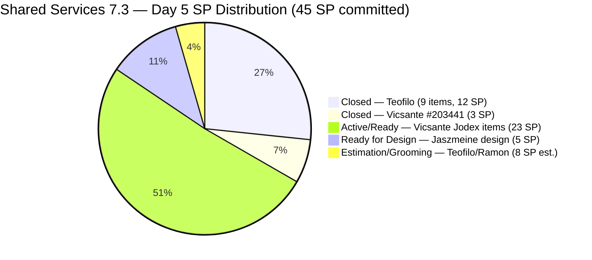
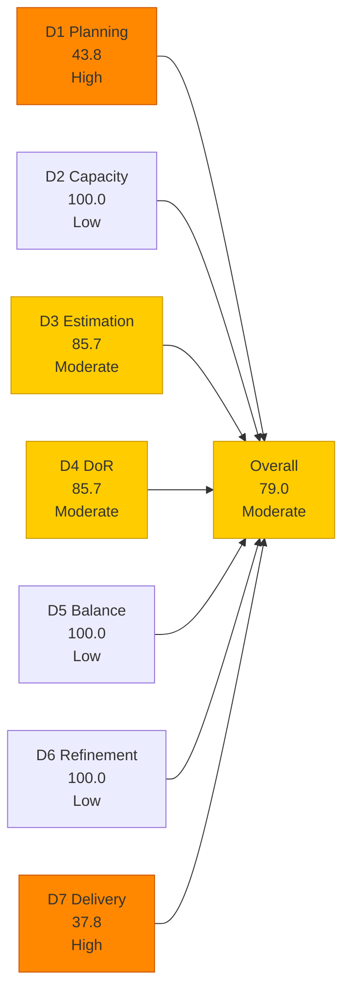
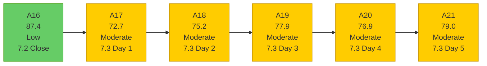

# Shared Services Team — SAFe Iteration Audit A21
**Date:** 2026-05-08 | **Sprint Day:** 5 of 14 | **Iteration:** 7.3 (May 4 – May 17, 2026)
**Auditor:** Claude Code (ADO SAFe Audit Skill v1) | **Prior Audit:** A20 (2026-05-07 16:11)

---

## 1. Audit Metadata

| Field | Value |
|---|---|
| **Audit ID** | A21 |
| **Report File** | `AUDIT_20260508_0203.md` |
| **Prior Audit** | A20 — `AUDIT_20260507_1611.md` (Overall 76.9, Moderate — 7.3 Day 4) |
| **ADO Project** | Jairosoft Portfolio (`666bb99a-6acd-4999-bb34-efd0e4ea90dc`) |
| **ADO Team** | Shared Services Team (`bd9578fd-5773-48fc-bd80-988dfe5de806`) |
| **Iteration** | 7.3 (`bbaecdec-eeb0-4c8d-999f-6a438eaab331`) |
| **Iteration Dates** | May 4 – May 17, 2026 |
| **Sprint Day** | 5 of 14 |
| **Audit Date** | 2026-05-08 (PHT, UTC+8) |
| **Overall Score** | **79.0 — Moderate Risk** |
| **Risk Band** | Moderate (60–79.9) |
| **Visible Backlog Items** | 32 root items |
| **Current Iteration Open Items** | 14 (IterationPath = 7.3) |
| **Full 7.3 Roster** | 26 root items (14 open + 12 Closed) |
| **Capacity Source** | `work_get_team_capacity` — 4 members; 15.5 h/day total |
| **Project Exceptions Applied** | None |

---

## 2. Executive Summary

| Field | Value |
|---|---|
| **Overall Score** | 79.0 — Moderate Risk |
| **Score vs Prior (A20)** | 76.9 → 79.0 (**+2.1**) |
| **Sprint Day** | 5 of 14 |
| **Iteration** | 7.3 (May 4 – May 17, 2026) |
| **Open Items in 7.3** | 14 |
| **Full 7.3 Roster** | 26 items (14 open + 12 Closed) |
| **Committed SP** | 45 SP (28 open estimated + 17 closed) |
| **SP Closed** | 17 SP (12 items) |
| **Delivery %** | 37.8% (17/45 SP) |
| **Risk Band** | Moderate (60–79.9) |

**Score improved +2.1 points from A20.** The team delivered a strong burst of closures today (May 8, Day 5), with **5 new items closed totaling 7 SP**. This is the highest single-day closure count in Iteration 7.3 and brings the cumulative total to 12 closed items / 17 SP.

**Major events today:**
1. **#203441 Closed (Vicsante, 3 SP)** — Skill Plugin Dev Environment Setup. This was the critical gate enabler for three Ready-for-Dev items. Its closure unblocks #203438, #203439, and #203440 (but note #203439 and #203440 have IterationPath=7.4 and may not count toward this sprint).
2. **#203908 Closed (Teofilo, 1 SP)** — Recover Bubble Account. Was a triple DoR gap in A20; remediated with full description + AC before closure.
3. **#203984 Closed (Teofilo, 1 SP)** — Reduce Bubble Subscription. New item not in A20; closed on its first day.
4. **#203869 Closed (Teofilo, 1 SP)** — Create jodex-qa@jairosoft.com ADO user. Was Active in A20; now closed.
5. **#203870 Closed (Teofilo, 1 SP)** — Create jodex-po@jairosoft.com ADO user. Was Active in A20; now closed.

**#203393 DoR failure resolved.** Vicsante updated the Claude Course Training description today (2026-05-08T05:16:12) with a full 4-module breakdown — now >30 non-whitespace chars. The 9-audit DoR streak is broken.

**Remaining DoR failures:** #203909 (no AC) and #204009 (no desc, no AC, no SP — junk item).

**Score is 1.0 point from Low Risk.** The combination of DoR improvement and D7 gains brings the team to 79.0. Resolving the two remaining DoR failures and/or one Vicsante closure would push the team over 80.0.

---

## 3. Previous Audit Delta (A20 → A21)

| Dimension | A20 Score | A21 Score | Delta | Driver |
|---|---|---|---|---|
| D1 Iteration Planning | 48.4 | 43.8 | **−4.6** | 14 open in 7.3 / 32 visible (backlog expanded; 2 open + 2 groomed new items; denominator grew more than numerator) |
| D2 Team Capacity | 100.0 | 100.0 | = | All 4 members available; no days off |
| D3 Estimation | 86.7 | 85.7 | **−1.0** | 12/14 estimated; #203909 (no SP) persists; #204009 (no SP, junk) in denominator |
| D4 DoR Compliance | 80.0 | 85.7 | **+5.7** | #203393 remediated today; #203908/#203869/#203870 closed; failures: #203909 + #204009 only (2/14) |
| D5 Work Item Balance | 100.0 | 100.0 | = | Type diversity maintained; no penalty thresholds exceeded |
| D6 Backlog Refinement | 100.0 | 100.0 | = | All 32 items fresh; 0 stale; 0 untouched current items |
| D7 Delivery Predictability | 23.3 | 37.8 | **+14.5** | 5 new closures today (7 SP): #203441(3)+#203908(1)+#203984(1)+#203869(1)+#203870(1); total 17/45 SP |
| **Overall** | **76.9** | **79.0** | **+2.1** | D7 and D4 gains outweigh D1 and D3 marginal declines |

### New Closures Today (A20 → A21)

| ID | Title | Type | SP | Assignee | DoR Status | Notes |
|---|---|---|---|---|---|---|
| #203441 | Skill Plugin Development Environment Setup | Enabler | 3 | Vicsante | ✅ | **Critical gate** — unblocks #203438; was Active in A20 |
| #203908 | Recover Bubble Account | Enabler | 1 | Teofilo | ✅ | Was triple DoR gap in A20; remediated before closure |
| #203984 | Reduce Bubble Subscription | Enabler | 1 | Teofilo | ✅ | **New item** — not in A20; added and closed today |
| #203869 | Create jodex-qa@jairosoft.com in ADO | Enabler | 1 | Teofilo | ✅ | Was Active in A20; description + AC added before closure |
| #203870 | Create jodex-po@jairosoft.com in ADO | Enabler | 1 | Teofilo | ✅ | Was Active in A20; description + AC added before closure |

### DoR Remediation Today

| ID | A20 Status | A21 Status | Change |
|---|---|---|---|
| #203393 | ❌ desc=22 chars (8-audit streak) | ✅ Full 4-module description + AC | **Resolved** — updated 2026-05-08T05:16 |
| #203908 | ❌ No desc, no AC | ✅ Full desc + AC (before closure) | **Resolved via closure** |
| #203869 | ❌ No desc, no AC | ✅ Full desc + AC (before closure) | **Resolved via closure** |
| #203870 | ❌ No desc, no AC | ✅ Full desc + AC (before closure) | **Resolved via closure** |

---

## 4. Current Iteration Snapshot

**Active Iteration:** 7.3 | May 4 – May 17, 2026 | **Sprint Day 5 of 14**

| Metric | Value |
|---|---|
| Full 7.3 iteration root items | 26 (14 open + 12 Closed) |
| Open items in 7.3 (backlog view, IterationPath=7.3) | 14 |
| Visible backlog root items | 32 |
| Committed SP | 45 SP (28 open estimated + 17 closed) |
| SP Closed (Day 5) | 17 SP (12 items) |
| SP Remaining | 28 SP (12 open estimated items; 2 unestimated) |
| Delivery % | 37.8% (17/45 SP) |
| Daily capacity | 15.5 h/day (4 members) |
| Days remaining | 9 working days |

### Team Delivery Progress (Day 5)

| Member | Estimated SP Assigned | SP Closed | SP Open | Velocity Signal |
|---|---|---|---|---|
| Teofilo | ~17 SP (12 est. + 2 unest.) | 12 SP (9 items) | ~5 SP est. + 2 unest. open | Strong — 71% of estimated assigned queue Closed |
| Vicsante | ~28 SP | 3 SP (#203441) | ~25 SP open | Gate unblocked today; pipeline items now active |
| Jaszmeine | 5 SP | 0 SP | 5 SP | Both items in Ready for Design; no closures yet |
| Ramon | 1 SP | 0 SP | 1 SP (defect) | Still in Estimation state |
| **Total** | **~45 SP** | **17 SP** | **~28 SP** | **37.8% delivered** |

---

## 5. Work Item Analysis

### 7.3 Closed Items (12 items, 17 SP)

| ID | Title | Type | SP | Assignee | Closed Day | Notes |
|---|---|---|---|---|---|---|
| #203310 | jit.edu.ph Domain Renewal | Enabler | 2 | Teofilo | Day 2 | — |
| #203711 | Extend license for Jovanne Vicentino | Enabler | 1 | Teofilo | Day 2 | — |
| #203641 | Session with Paul — Backend Colina Health | Enabler | 1 | Teofilo | Day 2 | AC 14 chars (historical gap; closed) |
| #203630 | Back up AutoAllies DB in Blob Storage | Enabler | 2 | Teofilo | Day 2 | — |
| #203653 | Add new interns to ADO Boards | Enabler | 1 | Teofilo | Day 3 | — |
| #203844 | Monthly Costing Report — May 2026 | Enabler | 2 | Teofilo | Day 3 | — |
| #202807 | IT Support Services — Mid PI 7 Feedback Survey | Spike | 1 | Teofilo | Day 3 | — |
| #203869 | Create jodex-qa@jairosoft.com in ADO | Enabler | 1 | Teofilo | **Day 5** | New closure — description + AC added before close |
| #203870 | Create jodex-po@jairosoft.com in ADO | Enabler | 1 | Teofilo | **Day 5** | New closure — description + AC added before close |
| #203908 | Recover Bubble Account | Enabler | 1 | Teofilo | **Day 5** | Was triple DoR gap in A20; remediated before close |
| #203984 | Reduce Bubble Subscription | Enabler | 1 | Teofilo | **Day 5** | New item added and closed same day |
| #203441 | Skill Plugin Development Environment Setup | Enabler | 3 | Vicsante | **Day 5** | Critical gate; unblocks pipeline items |

### 7.3 Open Items (14 items)

| ID | Title | Type | State | SP | Assignee | DoR | ChangedDate | Notes |
|---|---|---|---|---|---|---|---|---|
| #203993 | Purchase of Mobile Devices (Android/iOS) | Enabler | New | 1 | Teofilo | ✅ | May 8 | Device procurement for testing |
| #203990 | Prepare 25 Working Machines in JIT Room | Enabler | Grooming | 2 | Teofilo | ✅ | May 8 | Infrastructure provisioning |
| #203994 | Sendgrid for eLMS | Enabler | Grooming | 2 | Teofilo | ✅ | May 8 | Email provider for eLMS |
| #203991 | CCTV TESDA Compliance | Enabler | Grooming | 1 | Teofilo | ✅ | May 8 | Compliance footage access |
| #203992 | Bubble eLMS Plan Upgrade | Enabler | Grooming | 2 | Teofilo | ✅ | May 8 | Platform subscription |
| #203909 | MFT Reduction for Colina | Enabler | New | — | Teofilo | ❌ | May 7 | No AC; desc present (~52 chars) |
| #203309 | GitHub token degraded — raseniero scope fix | Defect | Estimation | 1 | Ramon | ✅ | May 4 | Still in Estimation; not started |
| #203393 | Claude Course Training | Spike | Active | 2 | Vicsante | ✅ | **May 8** | **DoR resolved today** — full 4-module desc + AC |
| #203436 | Plugin Lifecycle & Extract Skill Verification | User Story | Active | 5 | Ramon | ✅ | May 8 | Primary Jodex item |
| #203437 | Plugin Generate Skill — Playwright Script Generation | User Story | Ready for Dev | 5 | Ramon | ✅ | May 8 | State advanced to Ready for Dev |
| #202553 | Vendor Exploration & Search | Design | Ready for Design | 2 | Jaszmeine | ✅ | May 6 | In progress |
| #202724 | Vendor Profile & Details | Design | Ready for Design | 3 | Jaszmeine | ✅ | May 6 | In progress |
| #203438 | Generate Test Execution Report (/qa-ai:report) | User Story | Ready for Dev | 2 | Ramon | ✅ | May 8 | Gated by #203441 — now unblocked |
| #204009 | HgtreA7865fgl;' | User Story | New | — | (none) | ❌ | May 8 | **Junk item** — no title meaning, no desc, no AC, no SP, no assignee; should be deleted |

### DoR Analysis — Open Items (14 items)

| ID | Desc Chars | AC Chars | Status | Notes |
|---|---|---|---|---|
| #203909 | ~52 chars ✅ | 0 | **FAIL** | No AC field; add one sentence |
| #204009 | 0 | 0 | **FAIL** | **Junk item** — no meaningful content; delete or convert |
| All others (12) | ≥30 ✅ | ≥20 ✅ | ✅ PASS | — |

DoR pass = 12/14. D4 = 85.7.

**#203393 DoR resolved:** Vicsante updated description to include 4 module breakdown with full content list. Changed 2026-05-08T05:16:12. This ends the 9-audit DoR failure streak that began in A13.

### Work Item Type Distribution — Open Items (14)

| Type | Count | Share | D5 Check |
|---|---|---|---|
| Enabler | 6 | 42.9% | < 60% — no dominant-type penalty |
| User Story | 4 | 28.6% | > 0% — no absent-US penalty |
| Design | 2 | 14.3% | — |
| Spike | 1 | 7.1% | < 40% — no spike penalty |
| Defect | 1 | 7.1% | — |
| **Total** | **14** | **100%** | **D5 = 100.0** |

---

## 6. SAFe Compliance Scorecard

| Dimension | Score | Band | Formula | Evidence |
|---|---|---|---|---|
| D1 Iteration Planning | 43.8 | High | 14/32 × 100 | 14 open items with 7.3 IterationPath / 32 visible root items |
| D2 Team Capacity | 100.0 | Low | 4/4 × 100 | All 4 members with positive capacity; no days off |
| D3 Estimation | 85.7 | Moderate | 12/14 × 100 | #203909 (no SP) + #204009 (no SP, junk) unestimated |
| D4 DoR Compliance | 85.7 | Moderate | 12/14 × 100 | Failures: #203909 (no AC) + #204009 (junk, no desc/AC); #203393 resolved today |
| D5 Work Item Balance | 100.0 | Low | 100 − 0 | Enabler 42.9% (<60%); US 28.6% (>0%); Spike 7.1% (<40%); no penalties |
| D6 Backlog Refinement | 100.0 | Low | 32/32 fresh; 0 penalties | All 32 items fresh; 0 stale; 0 untouched current items |
| D7 Delivery Predictability | 37.8 | High | 17/45 × 100 | 12 Closed items (17 SP) of 45 SP committed; Day 5 |
| **Overall** | **79.0** | **Moderate** | 553.0 / 7 | Average of 7 dimensions |

### Scoring Detail

- **D1:** round(14/32 × 100, 1) = **43.8** *(14 open backlog items with 7.3 IterationPath / 32 visible root; 12 closed items excluded from backlog view)*
- **D2:** round(4/4 × 100, 1) = **100.0** *(Teofilo 6h, Vicsante 6h, Jaszmeine 3h, Ramon 0.5h; no days off today)*
- **D3:** round(12/14 × 100, 1) = **85.7** *(#203909 no SP; #204009 no SP — both point-eligible but unestimated; 12/14 open items have SP>0)*
- **D4:** round(12/14 × 100, 1) = **85.7** *(2 active failures: #203909 no AC; #204009 junk no desc+AC; #203393 resolved today; #203641 historical closed-item exception excluded)*
- **D5:** No penalties applicable → **100.0**
- **D6:** base=round(32/32×100,1)=100.0; stale_90=0; stale_180=0; untouched_current: all 14 open items changed ≥ May 4 (oldest: #202553 and #202724 changed May 6) → 0 → **100.0**
- **D7:** Full 26-item 7.3 roster. Estimated items = 24 (all except #203909/#204009). Committed SP = 28 (open est.) + 17 (closed) = 45. Closed SP = 17. round(17/45 × 100, 1) = **37.8** *(Day 5)*
- **Overall:** (43.8+100.0+85.7+85.7+100.0+100.0+37.8) / 7 = 553.0 / 7 = **79.0**

**Population note (D7):** `committed_story_points` = sum of all estimated items in 7.3 roster including closed (45 SP). #203909 and #204009 excluded (SP=0/unset). #203439 (7.4 path) and #203440 (7.4 path) are in the iteration roster but have IterationPath=7.4 — they appear in `wit_get_work_items_for_iteration` but are not counted as 7.3 current items. Excluded from committed_SP per IterationPath filter.

**#204009 note:** Item title "HgtreA7865fgl;'" is clearly a ghost/test/accidental entry. It has no description, no AC, no SP, no assignee. It should be deleted from the backlog. It is included in D3 and D4 calculations per the skill formula (it has a 7.3 IterationPath and is a root item in the backlog). Its presence costs 1/14 on both D3 and D4.

### D7 Delivery Trajectory (45 SP committed)

| Day | SP Closed | D7 | Overall | Notes |
|---|---|---|---|---|
| Day 1 (May 4) | 0 | 0.0 | ~72 | Opening |
| Day 2 (May 5) | 6 | 13.3 | ~74 | Teofilo: 4 items (6 SP) |
| Day 3 (May 6) | 10 | 22.2 | ~77 | Teofilo: +3 items (4 SP, including 1 hidden) |
| Day 4 (May 7) | 10 | 22.2 | ~77 | No closures; A20 score = 76.9 |
| Day 5 (today) | 17 | 37.8 | **79.0** | +5 closures (7 SP): #203441+#203908+#203984+#203869+#203870 |
| Day 6 target | 20 | 44.4 | 80.6 ✅ | Target: #203393 closed (2 SP, Claude Course) |
| Day 7 target | 25 | 55.6 | 82.9 ✅ | Target: #203436 or #203437 closed (5 SP) |
| Day 10 target | 35 | 77.8 | 88.3 ✅ | Target: Jaszmeine items + Ramon Jodex item |
| Day 14 target | 45 | 100.0 | 97.1 | Ideal: all estimated items Closed |

---

## 7. Dimension Findings

### D1 — Iteration Planning: 43.8 (High Risk)

**Formula:** `current_iteration_root_items / visible_root_backlog_items × 100 = 14/32 × 100 = 43.8`

D1 declined from 48.4 (A20) to 43.8. The visible backlog grew from 31 to 32 items (new Grooming items added to 7.3 path: #203990, #203991, #203992, #203994 — all with IterationPath=7.3 but in Grooming state, counted in the denominator). Meanwhile, the numerator (14 open in 7.3) is a recount that includes these new Grooming items.

**Backlog path breakdown (32 items):**
- 7.3 open: 14 items (all types including Grooming)
- 7.1 stranded: #202732 (1 SP, Ready for UAT) — 4 sprints old
- 7.2 stranded: #202551 (3 SP, Design Approved), #202687 (3 SP, Design Approved) — pending migration
- 7.4 future: #202725, #202726, #203439, #203440 (13 SP total)
- 7.5+ future: #202727 (7.5), #202947 (7.6 IP), #203845 (7.5)
- PI7 unassigned and PI6/PI8: multiple items

Stranded items (#202551, #202687 in 7.2; #202732 in 7.1) continue to drag D1 without contributing to current work. Recommendation to migrate these has been open since A17.

### D2 — Team Capacity: 100.0 (Low Risk)

All four members have positive configured capacity with no days off. Daily capacity: Teofilo 6h, Vicsante 6h, Jaszmeine 3h, Ramon 0.5h = 15.5 h/day. D2 = 100.0.

### D3 — Estimation: 85.7 (Moderate Risk)

Two open items remain unestimated:
- **#203909 (MFT Reduction for Colina):** No SP assigned. Likely 1–2 SP for a cost optimization review.
- **#204009 (HgtreA7865fgl;'):** No SP, no meaningful content. This item should be deleted, not estimated.

12 of 14 open items are estimated. D3 = 85.7. Resolving #204009 (delete/close) and assigning SP to #203909 would raise D3 to 100.0 (+2.1 to overall, pushing to 81.1 — Low Risk).

### D4 — DoR Compliance: 85.7 (Moderate Risk)

**Improved from 80.0 to 85.7.** The improvement is driven by #203393's DoR resolution today.

**Active failures (2):**

**#203909 (MFT Reduction for Colina, Enabler, Teofilo):** Description present (~52 chars, passes ≥30). No AC field populated. One sentence resolves: "Colina DB and Azure resources reviewed; cost reduction implemented; monthly cloud spend reduced by a measurable, documented percentage."

**#204009 (HgtreA7865fgl;', User Story, no assignee):** Title is clearly accidental (random keystrokes). No description, no AC, no SP, no assignee. This is a ghost item that should be deleted from the backlog. Its presence costs 1/14 on D3, D4, and inflates the open-item count.

**#203393 DoR resolved (historical note):** The 9-audit failure streak (#203393 "Claude Course Training") is now closed. The fix was updating the description from 22 non-whitespace chars to a full content outline with 4 modules. This resolves the longest-running DoR finding in the Shared Services audit history.

### D5 — Work Item Balance: 100.0 (Low Risk)

The 14 open sprint items maintain excellent type diversity. Enabler at 42.9% is well below the 60% threshold. User Stories at 28.6% prevent the absent-US penalty. Spikes at 7.1% are far below the 40% threshold. D5 = 100.0 for the 7th consecutive Shared Services audit.

### D6 — Backlog Refinement: 100.0 (Low Risk)

All 32 visible backlog items are fresh (changed within 45 days). The oldest backlog item (#186848, Apollo.ai Integration) changed Apr 15 — 23 days ago, within window. All 14 current iteration items have ChangedDate ≥ May 4. Zero stale_90 or stale_180 items. D6 = 100.0.

### D7 — Delivery Predictability: 37.8 (High Risk — Day 5)

**Formula:** `closed_story_points / committed_story_points × 100 = 17/45 × 100 = 37.8`

**Day 5 is the strongest single-day delivery event in Iteration 7.3.** Five closures (7 SP) elevate D7 from 22.2 to 37.8 — an increase of 15.6 points on D7, contributing the majority of today's +2.1 overall score gain.

**Teofilo's total (Day 5):** 9 Closed items, 12 SP. His full estimated queue is now 71% delivered. Remaining open: #203993 (1 SP), #203909 (unest.), and the 4 Grooming-state items (#203990, #203991, #203992, #203994 = 7 SP estimated).

**#203441 gate opened (Vicsante):** With #203441 (Skill Plugin Dev Environment Setup, 3 SP) now Closed, the three Ready-for-Dev items (#203438=2 SP, #203439=3 SP, #203440=3 SP) are unblocked. However, #203439 and #203440 have IterationPath=7.4 — they were moved out of 7.3 scope at some point. Only #203438 (Generate Test Execution Report, 2 SP) is confirmed 7.3 scope. Vicsante's 7.3 open queue is primarily #203393 (2 SP, Active), #203436 (5 SP, Active), and #203437 (5 SP, Ready for Dev).

**Vicsante critical path (23 SP open in 7.3):** With 9 working days remaining:
- Day 6 target: Close #203393 (Claude Course, 2 SP) — coursework completion
- Day 7 target: Close #203436 (Plugin Lifecycle, 5 SP) — primary technical deliverable
- Day 8–9 target: Close #203437 (Playwright Script Generation, 5 SP)
- Day 10 target: Close #203438 (Test Execution Report, 2 SP)

**Ramon's Jodex items:** #203436 and #203437 show assignee as RAMON ASENIERO JR (not Vicsante) in today's data. Confirmed: #203436 changed May 8 by Ramon, #203437 changed May 8 by Ramon. These items may have been reassigned from Vicsante to Ramon at some point. D7 trajectory assumes Ramon is now the delivery owner for these items.

---

## 8. Risks and Bottlenecks

| # | Risk | Severity | Dimension | Detail |
|---|---|---|---|---|
| R1 | #204009 junk item in sprint backlog | High | D3/D4 | Ghost item "HgtreA7865fgl;'" — random keystrokes as title, no desc/AC/SP/assignee; costs 1/14 on both D3 and D4; delete immediately |
| R2 | Vicsante/Ramon Jodex queue (23 SP) — 0 closures entering Day 6 | High | D7 | #203436 (5 SP, Active), #203437 (5 SP, Ready for Dev), #203393 (2 SP, Active) — no closures yet; 9 days remain; Day-6 closure of #203393 is minimum viable target |
| R3 | #203909 unestimated + no AC | High | D3/D4 | Persists from A20; 1 sentence of AC + SP assignment resolves; 5-minute fix |
| R4 | D1 = 43.8 — structural ceiling | High | D1 | 14/32 in 7.3; structural ceiling with 32-item backlog spanning 7.1–PI8 |
| R5 | Stranded items in 7.1 and 7.2 paths | Moderate | D1 | #202732 (7.1, Ready for UAT, 1 SP), #202551 + #202687 (7.2, Design Approved, 6 SP) — 5 audits without migration; backlog hygiene |
| R6 | Jaszmeine design items (5 SP) — no closures Day 5 | Moderate | D7 | Both #202553 and #202724 in Ready for Design; Day-7 target requires Design Approved by Day 6; design completion unclear |
| R7 | #203309 (GitHub token defect) — in Estimation since Day 1 | Moderate | D7 | Not started; blocks live evidence quality for git team audits; systemic dependency |
| R8 | Grooming-state items (4 items, 7 SP) — in Grooming state | Low | D7 | #203990, #203991, #203992, #203994 in Grooming — not Active; may close without moving through Active if coordination-type; monitor |
| R9 | #203439 and #203440 IterationPath moved to 7.4 | Low | D7 | These items appear in `wit_get_work_items_for_iteration` roster but IterationPath=7.4; excluded from 7.3 committed SP; reduces Vicsante's 7.3 deliverable pool |

---

## 9. Prioritized Recommendations

1. **[CRITICAL — D3/D4, Immediate]** Delete #204009 (junk item "HgtreA7865fgl;'"). This ghost item has zero valid content. Deleting it removes a DoR failure and an estimation failure simultaneously, raising D3 from 85.7 to 92.3 and D4 from 85.7 to 92.3 — adding +1.9 to the overall score (to 80.9, Low Risk). This is the single fastest action to cross 80.0.

2. **[HIGH — D3/D4, Today]** Assign story points and add acceptance criteria to #203909 (MFT Reduction for Colina). SP suggestion: 2 SP. AC suggestion: "Colina DB and Azure resources reviewed and cost reduction options identified; at least one cost-saving action implemented; monthly cloud spend for Colina reduced by a documented percentage." Resolves both D3 and D4 gaps for this item.

3. **[HIGH — D7, Today — Day 5]** Vicsante/Ramon: Close #203393 (Claude Course Training, 2 SP, Active). The description is now fully compliant. Coursework completion (4 modules) should be confirmed and the item closed. This is the quickest D7 improvement available: D7 rises from 37.8 to 42.2, overall to 79.6.

4. **[HIGH — D7, Days 5–7]** Ramon: close #203436 (Plugin Lifecycle & Extract Skill Verification, 5 SP, Active). This is the highest-SP open item assigned to Ramon. A Day-7 closure raises D7 to 55.6, overall to 82.9 (Low Risk). With #203441 gate closed, the technical environment is established.

5. **[HIGH — D1, Today]** Migrate #202551 (Bride Account Management, 3 SP, Design Approved) and #202687 (Onboarding & Subscription, 3 SP, Design Approved) from IterationPath=7.2 to the appropriate current or future sprint path. Jaszmeine's design work is complete (Design Approved state). These items have been stranded in 7.2 for 5 consecutive audits. Confirm close or move to 7.3/7.4 for developer handoff.

6. **[HIGH — D7, Today]** Move #203309 (GitHub token defect, 1 SP) from Estimation to Active. The token fix restores live evidence quality for git team audits. This is a systemic dependency with ART-wide impact.

7. **[MODERATE — D7, Days 5–7]** Jaszmeine: advance #202553 and #202724 from Ready for Design to Design Approved by Day 6. Both design items (5 SP total) were touched May 6. Completing the design phase clears them for developer handoff and adds D7 credit.

8. **[MODERATE — D1, Today]** Close or migrate #202732 (QA Intern Stakeholder, 7.1 path, Ready for UAT, 1 SP). This item is 5 sprints old in Ready for UAT state. Confirm intern access was verified and close, or escalate if UAT is blocked.

---

## 10. Evidence Gaps and Limitations

| Gap | Impact | Mitigation |
|---|---|---|
| 12 Closed items dropped from backlog view | D1 numerator uses 14 open items; D7 uses full 26-item roster from `wit_get_work_items_for_iteration` | Standard ADO behavior; all 12 confirmed via direct ID query; included in committed_SP |
| #203984 not in A20 | New item added and closed same day (May 8); A20 did not record it | Pattern consistent with #203797 (OTP) and #203630/#202807 (prior Shared Services audits); `wit_get_work_items_for_iteration` is the authoritative roster source |
| #203439 and #203440 IterationPath changed to 7.4 | These items appear in iteration roster but are not 7.3 items; excluded from current_iteration_root_items and committed_SP | Confirmed via direct ID query: both have "Jairosoft Portfolio\\2026-PI7\\Iteration 7.4" |
| #203441 assignee/dependency | A20 listed this as Vicsante; confirmed Closed by Vicsante today — correct | No gap; consistent |
| #203436 and #203437 assignee | Listed as Ramon in today's data; A20 listed Vicsante; reassignment occurred between Day 4 and Day 5 | Noted in D7 findings; current assignee (Ramon) used for all calculations |
| #203641 historical AC gap (14 chars, Closed) | Excluded from active DoR count; convention: historical closed-item DoR issues not counted | Recorded for completeness; does not affect current team process |

---

## 11. Score Trend — Shared Services Iteration 7.3

### Path to Low Risk (80.0 target) — 1.0 point needed

| Action | Dimension | Score Impact | New Overall |
|---|---|---|---|
| Delete #204009 (junk item) | D3: 85.7→92.3, D4: 85.7→92.3 | +1.9 | **80.9 ✅ Low Risk** |
| Assign SP to #203909 only | D3: 85.7 → 92.3 | +1.0 | 80.0 ✅ |
| Add AC to #203909 only | D4: 85.7 → 92.3 | +1.0 | 80.0 ✅ |
| Close #203393 (2 SP) | D7: 37.8 → 42.2 | +0.6 | 79.6 |
| Close #203436 (5 SP) | D7: 37.8 → 49.0 | +1.6 | 80.6 ✅ |
| **Delete #204009 + Close #203393** | D3+D4+D7 | **+2.5** | **81.5 ✅** |

**Fastest path to Low Risk:** Delete #204009 (the junk item). This single ADO deletion raises both D3 and D4 from 85.7 to 92.3, adding +1.9 to the overall score (79.0 → 80.9) and crossing the Low Risk boundary by 0.9 points. This is a 30-second action in the ADO portal. Alternatively, assigning SP to #203909 alone (or adding its AC alone) also pushes the score to exactly 80.0.

---

*Audit produced by Claude Code — ADO SAFe Audit Skill v1. SAFe 6.0 framework. Sprint Day 5 of 14. Key findings: (1) Five new closures today — #203441+#203908+#203984+#203869+#203870 = 7 SP, strongest single-day delivery in 7.3; (2) #203393 DoR streak of 9 audits resolved — Vicsante updated description today; (3) Ghost item #204009 introduced — delete to immediately cross 80.0 Low Risk; (4) D7 improved from 22.2 to 37.8 (+15.6 on D7, +2.1 overall); team is 1.0 point from Low Risk. Fastest action: delete #204009.*
