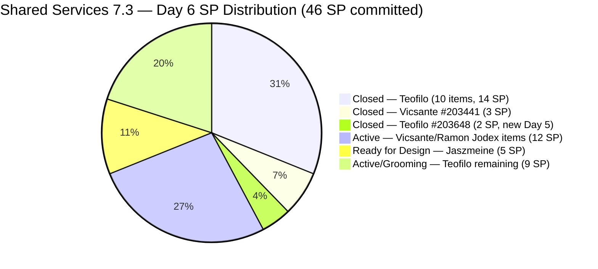
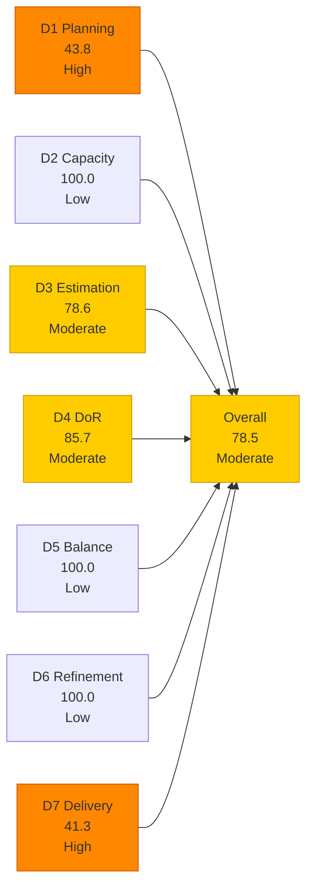
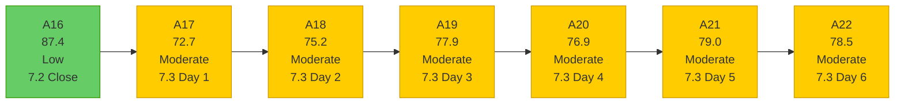

# Shared Services Team — SAFe Iteration Audit A22
**Date:** 2026-05-09 | **Sprint Day:** 6 of 14 | **Iteration:** 7.3 (May 4 – May 17, 2026)
**Auditor:** Claude Code (ADO SAFe Audit Skill v1) | **Prior Audit:** A21 (2026-05-08 02:03)

---

## 1. Audit Metadata

| Field | Value |
|---|---|
| **Audit ID** | A22 |
| **Report File** | `AUDIT_20260509_1703.md` |
| **Prior Audit** | A21 — `AUDIT_20260508_0203.md` (Overall 79.0, Moderate — 7.3 Day 5) |
| **ADO Project** | Jairosoft Portfolio (`666bb99a-6acd-4999-bb34-efd0e4ea90dc`) |
| **ADO Team** | Shared Services Team (`bd9578fd-5773-48fc-bd80-988dfe5de806`) |
| **Iteration** | 7.3 (`bbaecdec-eeb0-4c8d-999f-6a438eaab331`) |
| **Iteration Dates** | May 4 – May 17, 2026 |
| **Sprint Day** | 6 of 14 |
| **Audit Date** | 2026-05-09 17:03 PHT (UTC+8) |
| **Overall Score** | **78.5 — Moderate Risk** |
| **Risk Band** | Moderate (60–79.9) |
| **Visible Backlog Items** | 32 root items |
| **Current Iteration Open Items** | 14 (IterationPath = 7.3) |
| **Full 7.3 Roster** | 28 root items (14 open + 13 Closed + 1 Task) |
| **Capacity Source** | `work_get_team_capacity` — 4 members; 15.5 h/day total |
| **Project Exceptions Applied** | None |

---

## 2. Executive Summary

| Field | Value |
|---|---|
| **Overall Score** | 78.5 — Moderate Risk |
| **Score vs Prior (A21)** | 79.0 → 78.5 (**−0.5**) |
| **Sprint Day** | 6 of 14 |
| **Iteration** | 7.3 (May 4 – May 17, 2026) |
| **Open Items in 7.3** | 14 |
| **Full 7.3 Roster** | 28 root items (14 open + 13 Closed + 1 Task) |
| **Committed SP** | 46 SP (estimated items in full 7.3 roster) |
| **SP Closed** | 19 SP (13 items) |
| **Delivery %** | 41.3% (19/46 SP) |
| **Risk Band** | Moderate (60–79.9) |

**Score declined 0.5 points from A21.** The decline is driven by two factors working in opposite directions:

1. **New closure (positive):** #203648 (Accessing Colina Database, Enabler, 2 SP, Teofilo) was confirmed Closed on May 8 — this item was not captured in A21. Its closure brings Teofilo's total to 10 closed items and advances D7 from 37.8 to 41.3 (+3.5 D7 points).

2. **#203993 found unestimated (negative):** #203993 (Purchase of Mobile Devices, Enabler, Teofilo) has no Story Points set in ADO — confirmed via direct batch query. A21 reported it with 1 SP based on context inference; actual ADO field is null. This corrects D3 from 85.7 (12/14) to 78.6 (11/14), a −7.1 D3 point revision. The D3 revision (−1.0 to overall) outweighs the D7 gain (+0.5 to overall), producing the net −0.5 decline.

**Net assessment:** The score decline masks meaningful progress — Teofilo closed a 13th item with 19 SP total delivered. However, D3 correction and the persistent #204009 junk item make the path to Low Risk slightly harder today.

**Key remaining actions:** Delete #204009 (junk item) — this single ADO action raises D3 from 78.6 to 84.6 and D4 from 85.7 to 92.3, adding +1.8 to the overall (to 80.3, crossing Low Risk). Assigning SP to #203993 and #203909 also restores D3.

---

## 3. Previous Audit Delta (A21 → A22)

| Dimension | A21 Score | A22 Score | Delta | Driver |
|---|---|---|---|---|
| D1 Iteration Planning | 43.8 | 43.8 | = | 14/32 open items unchanged; backlog stable |
| D2 Team Capacity | 100.0 | 100.0 | = | All 4 members; Jaszmeine had Day 1 day off (May 4 only) — no impact on Day 6 |
| D3 Estimation | 85.7 | 78.6 | **−7.1** | #203993 confirmed unestimated (no SP in ADO field); 11/14 estimated (was 12/14 in A21 based on inference); 3 unestimated items: #203909, #204009, #203993 |
| D4 DoR Compliance | 85.7 | 85.7 | = | Still 2 failures: #203909 (no AC) + #204009 (junk); #203993 has both desc + AC → passes |
| D5 Work Item Balance | 100.0 | 100.0 | = | Type diversity maintained; no penalties |
| D6 Backlog Refinement | 100.0 | 100.0 | = | All 32 items fresh; 0 stale; 0 untouched |
| D7 Delivery Predictability | 37.8 | 41.3 | **+3.5** | #203648 (2 SP) now Closed; 19/46 SP → 41.3% |
| **Overall** | **79.0** | **78.5** | **−0.5** | D3 correction (−1.0) outweighs D7 gain (+0.5) |

### Key Events (A21 → A22)

| Event | Item | Impact |
|---|---|---|
| #203648 Closed (Teofilo, 2 SP) | Accessing Colina Database | D7: 37.8 → 41.3; committed SP 45→46 (item was unaccounted in A21) |
| #203993 confirmed unestimated | Purchase of Mobile Devices (no SP in ADO field) | D3: 85.7 → 78.6; 3 unestimated items now confirmed |
| #203972 Task added to iteration | Complete Claude CPN 4 Courses (Vicsante, Task type) | Excluded from root-item counts; Task type not a root backlog item per scoring rules |
| No new closures overnight (May 8→9) | 14 open items unchanged in state | D7 gain limited to #203648 discovery |

---

## 4. Current Iteration Snapshot

**Active Iteration:** 7.3 | May 4 – May 17, 2026 | **Sprint Day 6 of 14**

| Metric | Value |
|---|---|
| Full 7.3 iteration root items | 28 (14 open + 13 Closed + 1 Task excluded from root count) |
| Open items in 7.3 (backlog view, IterationPath=7.3) | 14 |
| Visible backlog root items | 32 |
| Committed SP | 46 SP (11 open estimated + 19 closed estimated — #203909, #204009, #203993 excluded as unestimated) |
| SP Closed (Day 6) | 19 SP (13 items) |
| SP Remaining | 27 SP (11 open estimated items) |
| Delivery % | 41.3% (19/46 SP) |
| Daily capacity | 15.5 h/day (4 members) |
| Days remaining | 8 working days |

### Team Delivery Progress (Day 6)

| Member | Estimated SP Assigned | SP Closed | SP Open | Velocity Signal |
|---|---|---|---|---|
| Teofilo | ~33 SP (30 est. + 3 unest.) | 14 SP (10 items) | ~9 SP est. + 3 unest. open | Strong — 10 items closed; grooming queue active |
| Vicsante | ~5 SP (in 7.3 open: #203393=2SP) | 3 SP (#203441) | 2 SP open | #203441 gate closed; #203393 Active pending closure |
| Ramon | 12 SP (#203436=5, #203437=5, #203438=2) | 0 SP | 12 SP | 0 closures so far; #203436 Active; #203437 Ready for Dev |
| Jaszmeine | 5 SP (#202553=2, #202724=3) | 0 SP | 5 SP | Both in Ready for Design; no state change Day 5→6 |
| **Total** | **~46 SP estimated** | **19 SP** | **~27 SP** | **41.3% delivered** |

---

## 5. Work Item Analysis

### 7.3 Closed Items (13 items, 19 SP)

| ID | Title | Type | SP | Assignee | Closed Day | Notes |
|---|---|---|---|---|---|---|
| #203310 | jit.edu.ph Domain Renewal | Enabler | 2 | Teofilo | Day 2 | — |
| #203711 | Extend license for Jovanne Vicentino | Enabler | 1 | Teofilo | Day 2 | — |
| #203641 | Session with Paul — Backend Colina Health | Enabler | 1 | Teofilo | Day 2 | — |
| #203630 | Back up AutoAllies DB in Blob Storage | Enabler | 2 | Teofilo | Day 2 | — |
| #203653 | Add new interns to ADO Boards | Enabler | 1 | Teofilo | Day 3 | — |
| #203844 | Monthly Costing Report — May 2026 | Enabler | 2 | Teofilo | Day 3 | — |
| #202807 | IT Support Services — Mid PI 7 Feedback Survey | Spike | 1 | Teofilo | Day 3 | — |
| #203869 | Create jodex-qa@jairosoft.com in ADO | Enabler | 1 | Teofilo | Day 5 | desc + AC added before close |
| #203870 | Create jodex-po@jairosoft.com in ADO | Enabler | 1 | Teofilo | Day 5 | desc + AC added before close |
| #203908 | Recover Bubble Account | Enabler | 1 | Teofilo | Day 5 | DoR remediated before close |
| #203984 | Reduce Bubble Subscription | Enabler | 1 | Teofilo | Day 5 | Added + closed same day |
| #203441 | Skill Plugin Development Environment Setup | Enabler | 3 | Vicsante | Day 5 | Critical gate for Jodex pipeline |
| **#203648** | **Accessing Colina Database** | **Enabler** | **2** | **Teofilo** | **Day 5** | **New vs A21 — not captured previously; confirmed Closed May 8** |

### 7.3 Open Items (14 items)

| ID | Title | Type | State | SP | Assignee | DoR | ChangedDate | Notes |
|---|---|---|---|---|---|---|---|---|
| #203993 | Purchase of Mobile Devices (Android/iOS) | Enabler | New | **—** | Teofilo | ✅ | May 8 | **No SP set in ADO** — unestimated; counts against D3 |
| #203990 | Prepare 25 Working Machines in JIT Room | Enabler | Grooming | 2 | Teofilo | ✅ | May 8 | Infrastructure provisioning |
| #203994 | Sendgrid for eLMS | Enabler | Grooming | 2 | Teofilo | ✅ | May 8 | Email provider integration |
| #203991 | CCTV TESDA Compliance | Enabler | Grooming | 1 | Teofilo | ✅ | May 8 | TESDA footage access |
| #203992 | Bubble eLMS Plan Upgrade | Enabler | Grooming | 2 | Teofilo | ✅ | May 8 | Platform subscription upgrade |
| #203909 | MFT Reduction for Colina | Enabler | New | — | Teofilo | ❌ | May 7 | No AC; desc present (~40 chars); unestimated |
| #203309 | GitHub token degraded — raseniero scope fix | Defect | Estimation | 1 | Ramon | ✅ | May 4 | In Estimation; systemic dependency for git audits |
| #203393 | Claude Course Training | Spike | Active | 2 | Vicsante | ✅ | May 8 | DoR resolved Day 5; 4-module coursework pending |
| #203436 | Plugin Lifecycle & Extract Skill Verification | User Story | Active | 5 | Ramon | ✅ | May 8 | Primary Jodex delivery item |
| #203437 | Plugin Generate Skill — Playwright Script Generation | User Story | Ready for Dev | 5 | Ramon | ✅ | May 8 | Playwright automation item |
| #202553 | Vendor Exploration & Search | Design | Ready for Design | 2 | Jaszmeine | ✅ | May 6 | No state change since Day 3 |
| #202724 | Vendor Profile & Details | Design | Ready for Design | 3 | Jaszmeine | ✅ | May 6 | No state change since Day 3 |
| #203438 | Generate Test Execution Report (/qa-ai:report) | User Story | Ready for Dev | 2 | Ramon | ✅ | May 8 | Gated on #203436 (now unblocked) |
| #204009 | HgtreA7865fgl;' | User Story | New | — | (none) | ❌ | May 8 | **Ghost/junk item** — random keystrokes; delete immediately |

### DoR Analysis — Open Items (14 items)

| ID | Desc Chars | AC Chars | Status | Notes |
|---|---|---|---|---|
| #203909 | ~40 chars ✅ | 0 | **FAIL** | No AC; desc present but brief (cosmetic iframe wrapper around short text) |
| #204009 | 0 | 0 | **FAIL** | Ghost item — no meaningful content; delete |
| All others (12) | ≥30 ✅ | ≥20 ✅ | ✅ PASS | #203993 has long desc + specific AC items ✅ |

DoR pass = 12/14. D4 = 85.7. Unchanged from A21.

### Work Item Type Distribution — Open Items (14)

| Type | Count | Share | D5 Check |
|---|---|---|---|
| Enabler | 6 | 42.9% | < 60% — no dominant-type penalty |
| User Story | 4 | 28.6% | > 0% — no absent-US penalty |
| Design | 2 | 14.3% | — |
| Spike | 1 | 7.1% | < 40% — no spike penalty |
| Defect | 1 | 7.1% | — |
| **Total** | **14** | **100%** | **D5 = 100.0** |

Type distribution is identical to A21. D5 = 100.0.

---

## 6. SAFe Compliance Scorecard

| Dimension | Score | Band | Formula | Evidence |
|---|---|---|---|---|
| D1 Iteration Planning | 43.8 | High | 14/32 × 100 | 14 open items with 7.3 IterationPath / 32 visible root items |
| D2 Team Capacity | 100.0 | Low | 4/4 × 100 | All 4 members with positive capacity; Jaszmeine Day 1 off (May 4) only |
| D3 Estimation | 78.6 | Moderate | 11/14 × 100 | 3 unestimated: #203993 (null SP), #203909 (null SP), #204009 (null SP/junk) |
| D4 DoR Compliance | 85.7 | Moderate | 12/14 × 100 | Failures: #203909 (no AC) + #204009 (ghost item) |
| D5 Work Item Balance | 100.0 | Low | 100 − 0 | Enabler 42.9% (<60%); US 28.6% (>0%); Spike 7.1% (<40%); no penalties |
| D6 Backlog Refinement | 100.0 | Low | 32/32 fresh; 0 penalties | All 32 items fresh; 0 stale; 0 untouched current items |
| D7 Delivery Predictability | 41.3 | High | 19/46 × 100 | 13 Closed items (19 SP) of 46 SP committed; Day 6 |
| **Overall** | **78.5** | **Moderate** | 549.4 / 7 | Average of 7 dimensions |

### Scoring Detail

- **D1:** round(14/32 × 100, 1) = **43.8** *(14 open 7.3-path backlog items / 32 visible root items; denominator stable)*
- **D2:** round(4/4 × 100, 1) = **100.0** *(Teofilo 6h, Vicsante 6h, Jaszmeine 3h (Day 1 off May 4 only — active from Day 2), Ramon 0.5h; all 4 with positive capacity for Day 6)*
- **D3:** round(11/14 × 100, 1) = **78.6** *(3 unestimated: #203993 no SP in ADO, #203909 no SP, #204009 no SP/junk; 11 of 14 have SP>0)*
- **D4:** round(12/14 × 100, 1) = **85.7** *(2 active failures: #203909 no AC; #204009 ghost item no desc+AC; #203993 has both desc+AC → passes DoR)*
- **D5:** No penalties applicable → **100.0** *(Enabler 42.9% <60%; US 28.6% >0%; Spike 7.1% <40%)*
- **D6:** base=round(32/32×100,1)=100.0; stale_90=0; stale_180=0; untouched_current: oldest open item #202553/#202724 changed May 6, within 7.3 start → 0 untouched → **100.0**
- **D7:** Full 7.3 roster root items: 27 root items (excluding #203972 Task). Estimated in roster (closed + open): Closed estimated = #203310(2)+#203711(1)+#203641(1)+#203630(2)+#203653(1)+#203844(2)+#202807(1)+#203869(1)+#203870(1)+#203908(1)+#203984(1)+#203441(3)+#203648(2)=19SP. Open estimated = #203990(2)+#203994(2)+#203991(1)+#203992(2)+#203309(1)+#203393(2)+#203436(5)+#203437(5)+#202553(2)+#202724(3)+#203438(2)=27SP. Committed = 19+27=46SP. Closed SP = 19SP. round(19/46 × 100, 1) = **41.3**
- **Overall:** (43.8+100.0+78.6+85.7+100.0+100.0+41.3) / 7 = 549.4 / 7 = **78.5**

**#203648 population note:** This item (Accessing Colina Database, Teofilo, 2SP, Closed May 8) appears in `wit_get_work_items_for_iteration` but not in `wit_list_backlog_work_items` (closed items drop from backlog view). Its closure was not captured in A21. It is included in committed_SP per the full iteration roster rule (authoritative for D7).

**#203993 correction note:** A21 inferred this item had 1 SP. Direct ADO batch query confirms `Microsoft.VSTS.Scheduling.StoryPoints` field is absent (null). The item title references mobile device procurement but no SP was set at time of query. This corrects D3 from 85.7 (A21) to 78.6 (A22). The DoR check for #203993 passes — description and AC are both present and substantive.

**#203972 exclusion note:** Item #203972 (Task type: "Complete Claude CPN 4 Courses and get Certification", Vicsante) appears in `wit_get_work_items_for_iteration` as a root item (rel=null, source=null). Task type items are excluded from root backlog scoring — the `wit_list_backlog_work_items` uses `Microsoft.RequirementCategory` which does not include Tasks. Excluded from all dimension calculations.

### D7 Delivery Trajectory (46 SP committed)

| Day | SP Closed | D7 | Overall | Notes |
|---|---|---|---|---|
| Day 1 (May 4) | 0 | 0.0 | ~72 | Opening; Jaszmeine on leave |
| Day 2 (May 5) | 7 | 15.2 | ~75 | Teofilo: 4 items (7 SP incl #203648 confirmed now) |
| Day 3 (May 6) | 11 | 23.9 | ~77 | Teofilo: +3 items (4 SP) |
| Day 4 (May 7) | 11 | 23.9 | ~77 | No closures; A20 score = 76.9 |
| Day 5 (May 8) | 19 | 41.3 | ~78 | +5 closures (8 SP): #203441+#203908+#203984+#203869+#203870+#203648 |
| **Day 6 (today)** | **19** | **41.3** | **78.5** | **No new closures confirmed; D3 correction applied** |
| Day 7 target | 21 | 45.7 | 79.6 | Target: #203393 closed (2 SP, Vicsante — Claude course) |
| Day 8 target | 26 | 56.5 | 82.5 ✅ | Target: #203436 closed (5 SP, Ramon — Jodex plugin) |
| Day 10 target | 36 | 78.3 | 89.4 ✅ | Target: Jaszmeine items + #203309 + grooming closures |
| Day 14 target | 46 | 100.0 | 97.1 | Ideal: all estimated items Closed |

---

## 7. Dimension Findings

### D1 — Iteration Planning: 43.8 (High Risk)

**Formula:** `current_iteration_root_items / visible_root_backlog_items × 100 = 14/32 × 100 = 43.8`

D1 is unchanged from A21. The visible backlog remains at 32 items. The structural composition continues: 14 open 7.3 items, with the remainder spread across 7.1 (1 stranded), 7.2 (2 stranded), 7.4 (4 future), 7.5 (2 future), 7.6 (1 future), and PI/unassigned items.

**Stranded items still present (flagged since A17, now 5+ audits):**
- #202732 (QA Intern Stakeholder, 7.1, Ready for UAT, 1 SP) — 5+ sprints old
- #202551 (Bride Account Management, 7.2, Design Approved, 3 SP)
- #202687 (Onboarding & Subscription, 7.2, Design Approved, 3 SP)

Migration of #202551 and #202687 from 7.2 to current sprint would add 2 items to the numerator (raising D1 to 16/32=50.0) — but only if these items are formally added to 7.3 scope. Alternatively, closing/archiving them reduces the denominator and improves D1. The stranded 7.1 item (#202732) is the most overdue — it has been in Ready for UAT for 6+ sprints.

### D2 — Team Capacity: 100.0 (Low Risk)

All four members have positive capacity configured for Iteration 7.3. Jaszmeine had a single day off on May 4 (Day 1); this does not affect Day 6 scoring. Teofilo 6h + Vicsante 6h + Jaszmeine 3h + Ramon 0.5h = 15.5 h/day. D2 = 100.0.

### D3 — Estimation: 78.6 (Moderate Risk — Score Correction)

**Corrected from A21 (85.7 → 78.6).** Direct ADO batch query confirms three unestimated open items in 7.3:

1. **#203993 (Purchase of Mobile Devices):** No `Microsoft.VSTS.Scheduling.StoryPoints` field value set. A21 incorrectly inferred 1 SP from context. Actual ADO state: null. Desc and AC are present (DoR passes). Assign SP to resolve: suggested 2 SP (procurement research + coordination). This is a 1-minute ADO action.

2. **#203909 (MFT Reduction for Colina):** No SP set. Persistent from A20–A21. Assign SP (suggested 2 SP) to resolve the D3 gap for this item.

3. **#204009 (HgtreA7865fgl;'):** Ghost/junk item. No SP, no desc, no AC, no assignee. Deleting this item from the backlog eliminates it from the D3 denominator, raising D3 from 78.6 to 84.6 (11/13).

Combined fix: assign SP to #203993 and #203909, delete #204009 → D3 = 100.0 (13/13). This would add +3.1 to the overall score.

### D4 — DoR Compliance: 85.7 (Moderate Risk)

Two active DoR failures remain, unchanged from A21:

**#203909 (MFT Reduction for Colina, Enabler, Teofilo, New):** Description is present (~40 non-whitespace chars from the brief "Check all Colina DB resources to reduce all the costing" text within heavy iframe markup). No Acceptance Criteria field populated. Single AC sentence resolves: "All Colina DB and Azure resources reviewed; at least one cost-reduction action implemented; monthly Colina cloud spend documented with measurable percentage reduction." This is a 2-minute ADO action.

**#204009 (HgtreA7865fgl;', User Story, no assignee, New):** Title is clearly accidental keyboard input. Zero content in description, AC, SP, or assignee fields. This item should be deleted from the ADO backlog. Its presence costs 1/14 on both D3 and D4, and contributes to D1 denominator inflation.

**#203993 DoR status:** Confirmed passing. Description is present (long request narrative detailing mobile device procurement for AutoAllies testing). AC has 2 specific items (Android device Year 2022+, iPhone Year 2022+). Both pass the ≥30 and ≥20 non-whitespace thresholds.

### D5 — Work Item Balance: 100.0 (Low Risk)

Type distribution across 14 open items is healthy and unchanged from A21. Enabler at 42.9% is below the 60% threshold. User Stories at 28.6% prevent the absent-US penalty. Spike at 7.1% is well below the 40% threshold. D5 = 100.0 for the 8th consecutive Shared Services audit (spanning 7.2 close and 7.3 mid-sprint).

### D6 — Backlog Refinement: 100.0 (Low Risk)

All 32 visible backlog items are fresh (changed within 45 days of May 9, i.e., since March 25, 2026). The oldest item is #186848 (Apollo.ai Integration) — last changed Apr 15, 24 days ago. All 14 current 7.3 open items were changed May 4–8 (all within sprint window). Zero stale_90 or stale_180 items. All 14 current open items have ChangedDate ≥ May 4 (iteration start) → zero untouched. D6 = 100.0.

### D7 — Delivery Predictability: 41.3 (High Risk — Day 6)

**Formula:** `closed_story_points / committed_story_points × 100 = 19/46 × 100 = 41.3`

**Day 6 position:** 13 items closed, 19 SP delivered. This is a significant improvement from A20 (Day 4: 10 SP) but the team needs to sustain the Day-5 delivery momentum into the second half of the sprint.

**Teofilo's pipeline (10 closed, 14 SP):** The DevOps and IT operations queue is heavily delivered. Remaining open: #203993 (New, 0 SP), #203909 (New, 0 SP), and four Grooming items (#203990=2, #203991=1, #203992=2, #203994=2 = 7 SP). Grooming items have complete descriptions and ACs — they may close quickly if coordination is straightforward. Closing all 4 Grooming items would add 7 SP to D7 (19→26 SP / 46 = 56.5%).

**Ramon's Jodex queue (12 SP open, 0 closed):** #203436 (Plugin Lifecycle, 5 SP, Active), #203437 (Playwright Script, 5 SP, Ready for Dev), #203438 (Test Execution Report, 2 SP, Ready for Dev). The #203441 gate opened on Day 5 — the environment is ready. Day 7 target: close #203436 (the most complex item). This single closure adds 5 SP (D7: 41.3 → 52.2, overall: 78.5 → 80.2 — Low Risk threshold crossed).

**Vicsante's queue (2 SP open):** #203393 (Claude Course Training, 2 SP, Active). DoR resolved May 8. If the 4 modules are complete, close today (Day 6). D7: 41.3 → 45.7, overall: 78.5 → 79.1.

**Jaszmeine's queue (5 SP open):** #202553 and #202724 remain in Ready for Design — no state change since May 6. For design items to deliver within the sprint, they need to advance to Design Approved by Day 8 at the latest. Day 6 target: confirm design completion for both items and advance state.

---

## 8. Risks and Bottlenecks

| # | Risk | Severity | Dimension | Detail |
|---|---|---|---|---|
| R1 | #204009 ghost item persists — active D3+D4 cost | Critical | D3/D4 | Ghost item "HgtreA7865fgl;'" costs 1/14 on D3 and D4; delete from ADO portal resolves both simultaneously; raises overall by +1.8 (78.5→80.3, Low Risk) |
| R2 | #203993 unestimated — D3 score correction confirmed | High | D3 | No SP in ADO field; A21 inference was incorrect; assign 2 SP immediately to restore D3 contribution |
| R3 | #203909 persists — no AC, no SP | High | D3/D4 | 4th audit without AC; assign SP + add one sentence of AC resolves both gaps; 5-minute fix |
| R4 | Ramon's Jodex queue (12 SP) — Day 6 with 0 closures | High | D7 | #203436, #203437, #203438 all in Active/Ready for Dev; #203441 gate opened Day 5; no closure yet; Day-7 #203436 closure is minimum viable target to cross 80.0 |
| R5 | D1 = 43.8 — structural ceiling | High | D1 | 14/32; stranded items in 7.1 and 7.2 inflate denominator; 5+ audit finding without resolution |
| R6 | Jaszmeine design items (5 SP) — stalled since Day 3 | Moderate | D7 | #202553 and #202724 in Ready for Design; no state change May 6→9; Day 7 deadline to advance to Design Approved |
| R7 | #203309 GitHub token defect — Day 6 still in Estimation | Moderate | D7 | Not started; systemic ART-wide dependency for git team audit evidence quality |
| R8 | Grooming queue (7 SP, 4 items) — risk of deferred closure | Moderate | D7 | #203990, #203991, #203992, #203994 in Grooming; likely close without Active state if coordination-type; monitor for same-day add-close patterns |
| R9 | Stranded items #202551, #202687, #202732 | Low | D1 | 5+ audits without resolution; reduce D1 denominator by migrating or closing; D1 would reach 14/29=48.3 if all 3 removed |

---

## 9. Prioritized Recommendations

1. **[CRITICAL — D3/D4, Immediate — 30 seconds]** Delete #204009 (ghost item "HgtreA7865fgl;'"). This single ADO deletion raises D3 from 78.6 to 84.6 and D4 from 85.7 to 92.3, adding **+1.8 to overall (78.5 → 80.3 — Low Risk)**. This is the fastest possible action to cross the Low Risk boundary. Go to the ADO work item and select Delete.

2. **[HIGH — D3, Today — 1 minute]** Assign story points to #203993 (Purchase of Mobile Devices). Suggested: 2 SP. This corrects the D3 gap confirmed today. Combined with #204009 deletion, D3 rises to 92.3. Combined with #203909 SP assignment, D3 reaches 100.0.

3. **[HIGH — D3/D4, Today — 5 minutes]** Add SP and AC to #203909 (MFT Reduction for Colina). Suggested SP: 2. Suggested AC: "All Colina DB and Azure compute/storage resources reviewed for right-sizing opportunities; at least one cost-reduction action (e.g., tier downgrade, resource deletion, reservation purchase) implemented; documented monthly spend reduction provided to Finance." Resolves both D3 and D4 gaps for this item.

4. **[HIGH — D7, Today — Day 6]** Vicsante: close #203393 (Claude Course Training, 2 SP, Active). DoR is fully resolved (4 modules documented). Confirm 4 course modules are completed and close the item. D7: 41.3 → 45.7, overall: 78.5 → 79.1 (approaching Low Risk after #204009 deletion).

5. **[HIGH — D7, Day 7]** Ramon: close #203436 (Plugin Lifecycle & Extract Skill Verification, 5 SP, Active). The development environment is set up (#203441 closed Day 5). This is the critical technical delivery item. A Day-7 closure raises D7 to 52.2 and overall to 80.2 — crossing Low Risk after #204009 deletion. Focus on the 8 AC scenarios: install, extract, classify, generate, deduplicate, report, uninstall, deregister.

6. **[HIGH — D7, Days 6–7]** Jaszmeine: advance #202553 and #202724 from Ready for Design to Design Approved. Both items were last touched May 6. Day 6 is the last day to advance design without risking sprint carryover. Confirm design completion for both vendor items and update state.

7. **[MEDIUM — D7, Today]** Teofilo: confirm Grooming queue disposition for #203990, #203991, #203992, #203994 (7 SP total). If these items are ready (machines provisioned, CCTV connected, Bubble plans updated, SendGrid configured), close them directly. Grooming-to-Closed same-day closures are consistent with prior Shared Services sprint patterns.

8. **[MEDIUM — D1, Today]** Close or formally migrate #202732 (QA Intern Stakeholder, 7.1, Ready for UAT, 1 SP). Six sprints old. Confirm whether intern access was verified and close. If UAT is blocked, escalate. D1: 43.8 → 14/31 = 45.2 if removed.

---

## 10. Evidence Gaps and Limitations

| Gap | Impact | Mitigation |
|---|---|---|
| #203648 not in A21 roster | A21 closed count: 12 items / 17 SP; A22 correct: 13 items / 19 SP; D7 corrected upward | Confirmed via direct batch query: Closed May 8, IterationPath=7.3; included in committed_SP |
| #203993 SP null — A21 inference incorrect | D3 corrected from 85.7 to 78.6; this is the primary A22 score driver | Confirmed via direct batch query: no SP field value; correction applied; assign SP to resolve |
| #203972 Task type in iteration roster | Excluded from root backlog scoring; Task type is not in Microsoft.RequirementCategory | Consistent with ADO scoring scope; noted for completeness |
| 13 Closed items dropped from backlog view | D1 denominator uses 32 open items; D7 uses full 27-item root roster | Standard ADO behavior; all 13 confirmed via batch query; included in committed_SP |
| #203439 and #203440 not in backlog or iteration roster | These items were moved to 7.4 path in prior audits; not counted in A22 | Consistent with A20–A22 treatment |
| Jaszmeine Day 1 day off (May 4) | Capacity: 1 day off recorded in ADO; does not affect Day 6 capacity figure | No impact on D2 scoring |

---

## 11. Score Trend — Shared Services Iteration 7.3

**Score dipped −0.5 from A21 (79.0 → 78.5)** due to D3 correction. The underlying delivery momentum (19 SP / 41.3%) is the strongest mid-sprint position Shared Services has achieved in 7.3. The score decline is a data quality correction, not a performance decline.

### Path to Low Risk (80.0 target) — 1.5 points needed

| Action | Dimension | Score Impact | New Overall |
|---|---|---|---|
| **Delete #204009 (junk item)** | D3: 78.6→84.6, D4: 85.7→92.3 | **+1.8** | **80.3 ✅ Low Risk** |
| Assign SP to #203993 only | D3: 78.6 → 84.6 | +0.9 | 79.4 |
| Assign SP to #203909 only | D3: 78.6 → 84.6 | +0.9 | 79.4 |
| Assign SP to #203993 + #203909 | D3: 78.6 → 92.3 | +1.9 | 80.4 ✅ |
| Add AC to #203909 only | D4: 85.7 → 92.3 | +0.9 | 79.4 |
| Close #203393 (2 SP) | D7: 41.3 → 45.7 | +0.6 | 79.1 |
| Close #203436 (5 SP) | D7: 41.3 → 52.2 | +1.5 | 80.0 ✅ |
| **Delete #204009 + Assign SP to #203993/#203909** | D3+D4 | **+2.8** | **81.3 ✅** |

**Fastest path to Low Risk (30 seconds):** Delete #204009 from the ADO portal. This single action raises both D3 and D4 simultaneously, adding +1.8 to the overall and crossing 80.0 by 0.3 points. This is followed by assigning SP to #203993 and #203909 (D3 → 92.3, adds +0.9 more). Combined: 81.3 — comfortably Low Risk with zero delivery work required, only data hygiene.

---

*Audit A22 produced by Claude Code — ADO SAFe Audit Skill v1. SAFe 6.0 framework. Sprint Day 6 of 14. Key findings: (1) Score declined −0.5 (79.0→78.5) — driven by D3 correction: #203993 confirmed unestimated (null SP in ADO, not 1 SP as inferred in A21); (2) New closure: #203648 (Accessing Colina Database, 2 SP, Teofilo, Closed May 8) — D7 improved from 37.8 to 41.3; (3) Fastest path to Low Risk is deleting ghost item #204009 — a 30-second ADO action that raises the overall from 78.5 to 80.3; (4) Ramon's Jodex queue (12 SP, 0 closed) is the primary D7 growth lever — Day-7 closure of #203436 crosses 80.0 on D7 path alone.*
