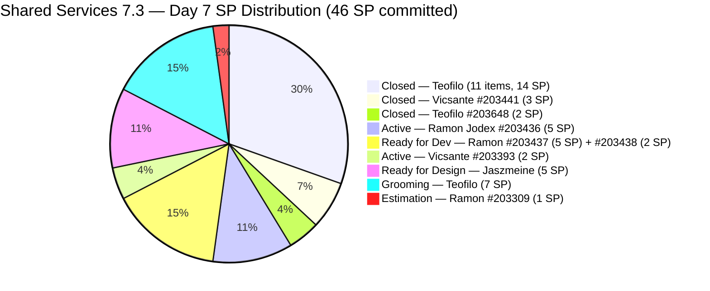
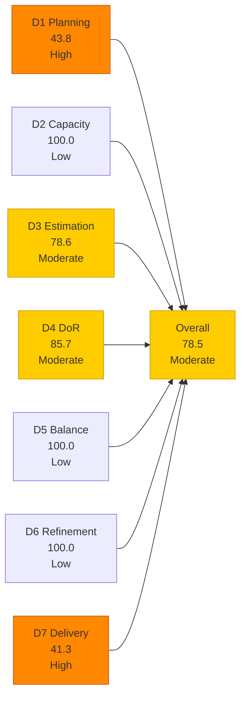
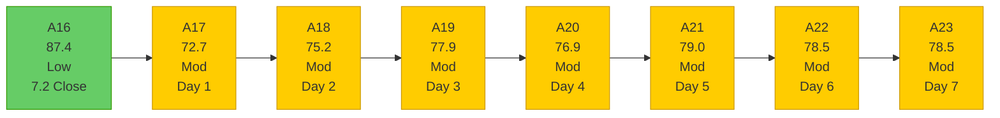

# Shared Services Team — SAFe Iteration Audit A23
**Date:** 2026-05-10 | **Sprint Day:** 7 of 14 | **Iteration:** 7.3 (May 4 – May 17, 2026)
**Auditor:** Claude Code (ADO SAFe Audit Skill v1) | **Prior Audit:** A22 (2026-05-09 17:03)

---

## 1. Audit Metadata

| Field | Value |
|---|---|
| **Audit ID** | A23 |
| **Report File** | `AUDIT_20260510_0201.md` |
| **Prior Audit** | A22 — `AUDIT_20260509_1703.md` (Overall 78.5, Moderate — 7.3 Day 6) |
| **ADO Project** | Jairosoft Portfolio (`666bb99a-6acd-4999-bb34-efd0e4ea90dc`) |
| **ADO Team** | Shared Services Team (`bd9578fd-5773-48fc-bd80-988dfe5de806`) |
| **Iteration** | 7.3 (`bbaecdec-eeb0-4c8d-999f-6a438eaab331`) |
| **Iteration Dates** | May 4 – May 17, 2026 |
| **Sprint Day** | 7 of 14 |
| **Audit Date** | 2026-05-10 02:01 PHT (UTC+8) |
| **Overall Score** | **78.5 — Moderate Risk** |
| **Risk Band** | Moderate (60–79.9) |
| **Visible Backlog Items** | 32 root items |
| **Current Iteration Open Items** | 14 (IterationPath = 7.3, open states) |
| **Full 7.3 Roster** | 27 root items (14 open + 13 Closed) |
| **Capacity Source** | `work_get_team_capacity` — 4 members; 15.5 h/day total |
| **Project Exceptions Applied** | None |

---

## 2. Executive Summary

| Field | Value |
|---|---|
| **Overall Score** | 78.5 — Moderate Risk |
| **Score vs Prior (A22)** | 78.5 → 78.5 (**0.0 — flat**) |
| **Sprint Day** | 7 of 14 |
| **Iteration** | 7.3 (May 4 – May 17, 2026) |
| **Open Items in 7.3** | 14 |
| **Full 7.3 Roster** | 27 root items (14 open + 13 Closed) |
| **Committed SP** | 46 SP |
| **SP Closed** | 19 SP (13 items) |
| **Delivery %** | 41.3% (19/46 SP) |
| **Risk Band** | Moderate (60–79.9) |

**Score flat at 78.5.** No state changes were detected on any of the 14 open 7.3 items between A22 (May 9, 17:03) and A23 (May 10, 02:01). All 14 open items retain the same states, ChangedDates, and SP values as confirmed in A22. The audit was run at 02:01 PHT, prior to business hours, so no closures from today's working session have been captured.

**Sprint position at Day 7 (midpoint):** 13 items closed, 19 SP delivered (41.3%). The team has 7 working days remaining to close 14 open items totaling 27 estimated SP (11 estimated items + 3 unestimated). This is achievable at the team's Day-5 delivery pace (8 SP in one day) but requires sustained momentum through the second half.

**Fastest path to Low Risk remains unchanged from A22:** Delete ghost item #204009 (30 seconds in ADO portal) → raises D3 from 78.6 to 84.6 and D4 from 85.7 to 92.3, adding +1.8 to overall (78.5 → **80.3**). This single data-hygiene action crosses the Low Risk boundary without any delivery work.

---

## 3. Previous Audit Delta (A22 → A23)

| Dimension | A22 Score | A23 Score | Delta | Driver |
|---|---|---|---|---|
| D1 Iteration Planning | 43.8 | 43.8 | = | 14/32 open items; backlog stable |
| D2 Team Capacity | 100.0 | 100.0 | = | All 4 members; Jaszmeine Day 1 off (May 4 only) |
| D3 Estimation | 78.6 | 78.6 | = | 3 unestimated: #203993 (null SP), #203909 (null SP), #204009 (null SP/junk) |
| D4 DoR Compliance | 85.7 | 85.7 | = | 2 failures: #203909 (no AC), #204009 (ghost item) |
| D5 Work Item Balance | 100.0 | 100.0 | = | Type diversity maintained; no penalties |
| D6 Backlog Refinement | 100.0 | 100.0 | = | All 32 items fresh; 0 stale; 0 untouched current items |
| D7 Delivery Predictability | 41.3 | 41.3 | = | No new closures overnight; 19/46 SP |
| **Overall** | **78.5** | **78.5** | **0.0** | All 7 dimensions flat — pre-business-hours audit |

### Key Events (A22 → A23)

| Event | Impact |
|---|---|
| No item closures (overnight, A22→A23) | D7 stable at 41.3; 14 open items in unchanged states |
| No new backlog items added | D1, D5, D6 stable |
| Ghost item #204009 still present | D3 and D4 penalties persist; delete action still pending |
| #203909 still without AC | D4 penalty persists; AC addition still pending |
| #203993 still unestimated | D3 gap persists; SP assignment still pending |

---

## 4. Current Iteration Snapshot

**Iteration:** 7.3 | **Period:** May 4 – May 17, 2026 | **Sprint Day:** 7 of 14

| Metric | Value |
|---|---|
| Full 7.3 iteration root items | 27 (14 open + 13 Closed) |
| Open items in 7.3 (backlog view) | 14 |
| Visible backlog root items | 32 |
| Committed SP | 46 SP (11 open estimated + 19 closed estimated; #203909, #204009, #203993 unestimated) |
| SP Closed (Day 7) | 19 SP (13 items) |
| SP Remaining (estimated open) | 27 SP (11 estimated open items) |
| Delivery % | 41.3% (19/46 SP) |
| Daily capacity | 15.5 h/day (4 members) |
| Days remaining | 7 working days |

### Team Delivery Progress (Day 7)

| Member | SP Assigned (estimated) | SP Closed | SP Open | Velocity Signal |
|---|---|---|---|---|
| Teofilo | 33 estimated (30+3 unest.) | 19 SP (13 items) | 7 SP grooming + 3 unest. open | Strong; grooming queue available for rapid closure |
| Vicsante | 5 SP (7.3 roster) | 3 SP (#203441) | 2 SP (#203393 Active) | #203393 awaiting closure; DoR resolved |
| Ramon | 12 SP (#203436=5, #203437=5, #203438=2) | 0 SP | 12 SP | 0 closures; Day-7 target: close #203436 |
| Jaszmeine | 5 SP (#202553=2, #202724=3) | 0 SP | 5 SP | Both in Ready for Design; no progress since May 6 |
| **Total** | **~46 SP estimated** | **19 SP** | **~27 SP est.** | **41.3% delivered** |

---

## 5. Work Item Analysis

### 7.3 Closed Items (13 items, 19 SP)

| ID | Title | Type | SP | Assignee | Closed Day |
|---|---|---|---|---|---|
| #203310 | jit.edu.ph Domain Renewal | Enabler | 2 | Teofilo | Day 2 |
| #203711 | Extend license for Jovanne Vicentino | Enabler | 1 | Teofilo | Day 2 |
| #203641 | Session with Paul — Backend Colina Health | Enabler | 1 | Teofilo | Day 2 |
| #203630 | Back up AutoAllies DB in Blob Storage | Enabler | 2 | Teofilo | Day 2 |
| #203653 | Add new interns to ADO Boards | Enabler | 1 | Teofilo | Day 3 |
| #203844 | Monthly Costing Report — May 2026 | Enabler | 2 | Teofilo | Day 3 |
| #202807 | IT Support Services — Mid PI 7 Feedback Survey | Spike | 1 | Teofilo | Day 3 |
| #203869 | Create jodex-qa@jairosoft.com in ADO | Enabler | 1 | Teofilo | Day 5 |
| #203870 | Create jodex-po@jairosoft.com in ADO | Enabler | 1 | Teofilo | Day 5 |
| #203908 | Recover Bubble Account | Enabler | 1 | Teofilo | Day 5 |
| #203984 | Reduce Bubble Subscription | Enabler | 1 | Teofilo | Day 5 |
| #203441 | Skill Plugin Development Environment Setup | Enabler | 3 | Vicsante | Day 5 |
| #203648 | Accessing Colina Database | Enabler | 2 | Teofilo | Day 5 |

### 7.3 Open Items (14 items)

| ID | Title | Type | State | SP | Assignee | DoR | ChangedDate | Notes |
|---|---|---|---|---|---|---|---|---|
| #204009 | HgtreA7865fgl;' | User Story | New | — | (none) | ❌ | May 8 | **Ghost/junk item — delete immediately** |
| #203909 | MFT Reduction for Colina | Enabler | New | — | Teofilo | ❌ | May 7 | No AC; desc present; no SP — 2 gaps |
| #203993 | Purchase of Mobile Devices (Android/iOS) | Enabler | New | — | Teofilo | ✅ | May 8 | No SP set in ADO field |
| #203990 | Prepare 25 Working Machines in JIT Room | Enabler | Grooming | 2 | Teofilo | ✅ | May 8 | Infrastructure provisioning |
| #203994 | Sendgrid for eLMS | Enabler | Grooming | 2 | Teofilo | ✅ | May 8 | Email provider integration |
| #203991 | CCTV TESDA Compliance | Enabler | Grooming | 1 | Teofilo | ✅ | May 8 | TESDA footage access |
| #203992 | Bubble eLMS Plan Upgrade | Enabler | Grooming | 2 | Teofilo | ✅ | May 8 | Platform subscription upgrade |
| #203309 | GitHub token degraded — raseniero scope fix | Defect | Estimation | 1 | Ramon | ✅ | May 4 | Systemic ART dependency; not started |
| #203393 | Claude Course Training | Spike | Active | 2 | Vicsante | ✅ | May 8 | DoR resolved Day 5; 4 modules pending |
| #203436 | Plugin Lifecycle & Extract Skill Verification | User Story | Active | 5 | Ramon | ✅ | May 8 | Primary Jodex delivery; gate open since Day 5 |
| #203437 | Plugin Generate Skill — Playwright Script Generation | User Story | Ready for Dev | 5 | Ramon | ✅ | May 8 | Gated on #203436 |
| #202553 | Vendor Exploration & Search | Design | Ready for Design | 2 | Jaszmeine | ✅ | May 6 | No state change since Day 3 |
| #202724 | Vendor Profile & Details | Design | Ready for Design | 3 | Jaszmeine | ✅ | May 6 | No state change since Day 3 |
| #203438 | Generate Test Execution Report (/qa-ai:report) | User Story | Ready for Dev | 2 | Ramon | ✅ | May 8 | Gated on #203436 |

### DoR Analysis — Open Items (14 items)

| ID | Desc | AC | Status | Notes |
|---|---|---|---|---|
| #203909 | ~40 chars ✅ | 0 chars ❌ | **FAIL** | No AC field populated; desc present in iframe wrapper |
| #204009 | 0 | 0 | **FAIL** | Ghost item — keyboard gibberish title; no content |
| All others (12) | ≥30 ✅ | ≥20 ✅ | ✅ PASS | #203993 has substantive desc (mobile device procurement narrative) + 2 AC items |

DoR pass = 12/14. D4 = 85.7. Consistent with A22.

### Work Item Type Distribution — Open Items (14)

| Type | Count | Share | D5 Check |
|---|---|---|---|
| Enabler | 6 | 42.9% | < 60% — no dominant-type penalty |
| User Story | 4 | 28.6% | > 0% — no absent-US penalty |
| Design | 2 | 14.3% | — |
| Spike | 1 | 7.1% | < 40% — no spike penalty |
| Defect | 1 | 7.1% | — |
| **Total** | **14** | **100%** | **D5 = 100.0** |

---

## 6. SAFe Compliance Scorecard

| Dimension | Score | Band | Formula | Evidence |
|---|---|---|---|---|
| D1 Iteration Planning | 43.8 | High | 14/32 × 100 | 14 open 7.3 items / 32 visible root backlog items |
| D2 Team Capacity | 100.0 | Low | 4/4 × 100 | All 4 members with positive capacity; Jaszmeine Day 1 off only |
| D3 Estimation | 78.6 | Moderate | 11/14 × 100 | 3 unestimated: #203993 (null SP), #203909 (null SP), #204009 (null SP/junk) |
| D4 DoR Compliance | 85.7 | Moderate | 12/14 × 100 | 2 failures: #203909 (no AC) + #204009 (ghost item) |
| D5 Work Item Balance | 100.0 | Low | 100 − 0 | Enabler 42.9% (<60%); US 28.6% (>0%); Spike 7.1% (<40%); no penalties |
| D6 Backlog Refinement | 100.0 | Low | 32/32 fresh; 0 penalties | All 32 items fresh; 0 stale_90; 0 stale_180; 0 untouched current items |
| D7 Delivery Predictability | 41.3 | High | 19/46 × 100 | 13 closed items (19 SP) / 46 SP committed |
| **Overall** | **78.5** | **Moderate** | 549.4 / 7 | Average of 7 dimensions |

### Scoring Detail

- **D1:** round(14/32 × 100, 1) = **43.8** *(14 open 7.3-path items / 32 visible root items)*
- **D2:** round(4/4 × 100, 1) = **100.0** *(Teofilo 6h/day, Vicsante 6h/day, Jaszmeine 3h/day, Ramon 0.5h/day; Jaszmeine Day 1 off May 4 — no impact on Day 7)*
- **D3:** round(11/14 × 100, 1) = **78.6** *(3 unestimated open items: #203993 null SP confirmed via ADO batch query, #203909 null SP, #204009 null SP/ghost)*
- **D4:** round(12/14 × 100, 1) = **85.7** *(2 DoR failures: #203909 no AC field; #204009 no desc+AC+title-is-gibberish)*
- **D5:** No penalties applicable → **100.0** *(Enabler 42.9% <60%; US 28.6% >0%; Spike 7.1% <40%)*
- **D6:** base=round(32/32×100,1)=100.0; stale_90=0 (oldest item #186848 changed Apr 15, 25 days ago — within 45-day window); stale_180=0; untouched_current: oldest open item #202553/#202724 changed May 6 ≥ May 4 iteration start → 0 untouched → **100.0**
- **D7:** Committed SP = 46 (19 closed estimated + 27 open estimated). Closed SP = 19. round(19/46 × 100, 1) = **41.3**
- **Overall:** (43.8+100.0+78.6+85.7+100.0+100.0+41.3) / 7 = 549.4 / 7 = **78.5**

### Path to Low Risk — Score Impact Matrix

| Action | Dimension Change | Score Impact | New Overall |
|---|---|---|---|
| **Delete #204009 (ghost item)** | D3: 78.6→84.6, D4: 85.7→92.3 | **+1.8** | **80.3 ✅ Low Risk** |
| Assign SP to #203993 (2 SP) | D3: 78.6→84.6 | +0.9 | 79.4 |
| Assign SP to #203909 (2 SP) | D3: 78.6→84.6 | +0.9 | 79.4 |
| Add AC to #203909 | D4: 85.7→92.3 | +0.9 | 79.4 |
| Delete #204009 + Assign SP to both | D3: 78.6→100.0, D4: 85.7→92.3 | +3.0 | 81.5 ✅ |
| Close #203393 (2 SP, Vicsante) | D7: 41.3→45.7 | +0.6 | 79.1 |
| Close #203436 (5 SP, Ramon) | D7: 41.3→52.2 | +1.5 | 80.0 ✅ |
| Delete #204009 + Close #203436 | D3+D4+D7 | +3.3 | 81.8 ✅ |

---

## 7. Dimension Findings

### D1 — Iteration Planning: 43.8 (High Risk)

**Formula:** `current_iteration_root_items / visible_root_backlog_items × 100 = 14/32 × 100 = 43.8`

D1 unchanged from A22. The 32-item visible backlog includes stranded items across 7.1 (1 item), 7.2 (2 items), and future iterations 7.4 (5+), 7.5 (2), 7.6 (1), PI8 (4), and PI/unassigned items.

**Stranded items persisting 5+ audits (flagged A17–A23):**
- #202732 (QA Intern Stakeholder, 7.1, Ready for UAT, 1 SP, changed Apr 27) — 6+ sprints old; ready for UAT but untested
- #202551 (Bride Account Management, 7.2, Design Approved, 3 SP, changed May 4) — design complete, no dev sprint
- #202687 (Onboarding & Subscription Management, 7.2, Design Approved, 3 SP, changed May 4) — design complete, no dev sprint

Closing or migrating these 3 items reduces the denominator from 32 to 29, raising D1 to 14/29 = 48.3.

### D2 — Team Capacity: 100.0 (Low Risk)

All 4 members have positive capacity configured. Teofilo 6h + Vicsante 6h + Jaszmeine 3h + Ramon 0.5h = 15.5 h/day total. Jaszmeine's Day 1 off (May 4) does not affect Day 7 scoring. D2 = 100.0.

**Remaining sprint bandwidth (7 days):** Teofilo 42h, Vicsante 42h, Jaszmeine 21h, Ramon 3.5h = **108.5 total team hours** remaining. Against 27 estimated SP open, the team has ample capacity hours for delivery — the constraint is coordination, approval chains, and external dependencies, not raw hours.

### D3 — Estimation: 78.6 (Moderate Risk)

Three unestimated open items confirmed via ADO batch query. Unchanged from A22 correction:

1. **#203993 (Purchase of Mobile Devices):** `Microsoft.VSTS.Scheduling.StoryPoints` field = null. Description and AC are both substantive and pass DoR. Assign 2 SP to resolve.
2. **#203909 (MFT Reduction for Colina):** No SP set. Also has no AC (DoR fail). Assign 2 SP + add AC sentence to resolve both gaps.
3. **#204009 (Ghost item):** No SP, no desc, no AC, no assignee. Delete to resolve both D3 and D4 gaps simultaneously.

Combined fix for all three issues: D3 reaches 100.0 (13/13 or 11/11 if #204009 deleted).

### D4 — DoR Compliance: 85.7 (Moderate Risk)

Two active DoR failures, identical to A22:

**#203909 (MFT Reduction for Colina, Enabler, Teofilo):** Description present (~40 non-whitespace chars in the "Check all Colina DB resources to reduce all the costing" text). Acceptance Criteria field is empty — confirmed via ADO batch query (field absent from response). Suggested AC: "All Colina DB and Azure resources reviewed for right-sizing; at least one cost-reduction action implemented; monthly Colina cloud spend documented with measurable percentage change." A 2-minute ADO edit.

**#204009 (HgtreA7865fgl;', User Story):** Title is clearly accidental keyboard input. Description, AC, SP, and assignee fields are all absent. This item has now persisted for 2 audits without deletion. It costs the team 1/14 on both D3 and D4 every day it remains. Delete this item from the ADO portal today.

### D5 — Work Item Balance: 100.0 (Low Risk)

Type distribution across 14 open items is healthy. Enabler at 42.9% is below the 60% threshold. User Stories at 28.6% prevent the absent-US penalty. Spike at 7.1% is well below the 40% threshold. D5 = 100.0. Consistent across all 7 Shared Services 7.3 audits.

### D6 — Backlog Refinement: 100.0 (Low Risk)

All 32 visible backlog items are fresh (changed within 45 days of May 10, i.e., since March 26). The oldest item is #186848 (Apollo.ai Integration, changed Apr 15, 25 days ago). All 14 current 7.3 open items were last changed May 4–8, all within the sprint window. Zero stale_90 or stale_180 items. All 14 current open items have ChangedDate ≥ May 4 → zero untouched. D6 = 100.0.

### D7 — Delivery Predictability: 41.3 (High Risk — Day 7)

**Formula:** `closed_story_points / committed_story_points × 100 = 19/46 × 100 = 41.3`

**Sprint midpoint position:** 13 items closed, 19 SP delivered (41.3%). The team is 8.7 points below the 50% midpoint delivery threshold. Teofilo has driven all 13 closures (11 Enablers + #202807 Spike + #203648 Enabler). Vicsante closed 1 item (#203441). Ramon and Jaszmeine have 0 closures with 17 SP combined.

**Day-7 priority targets by team member:**

| Member | Target Item | SP | Gate Status | Day-7 Action |
|---|---|---|---|---|
| Ramon | #203436 Plugin Lifecycle | 5 SP | #203441 gate open since Day 5 | Close #203436 → D7: 41.3→52.2; overall→80.0 |
| Vicsante | #203393 Claude Course Training | 2 SP | DoR resolved; 4 modules documented | Close if 4 modules complete → D7: 41.3→45.7 |
| Jaszmeine | #202553, #202724 | 5 SP | Ready for Design — advance to Design Approved | Confirm design completion; advance state |
| Teofilo | #203990, #203991, #203992, #203994 | 7 SP | Grooming — coordination items | If provisioned/configured, close same-day |

**D7 trajectory (Day 7 onward):**

| Day | Target Action | SP Cumulative | D7 | Overall |
|---|---|---|---|---|
| Day 7 (today) | Close #203393 (Vicsante, 2 SP) | 21 | 45.7 | 79.1 |
| Day 7 (today) | + Delete #204009 | 21 | 45.7 | **80.9 ✅** |
| Day 8 | Close #203436 (Ramon, 5 SP) | 26 | 56.5 | ~82.5 ✅ |
| Day 9–10 | Close Teofilo grooming (7 SP) | 33 | 71.7 | ~87.0 ✅ |
| Day 10–11 | Close Jaszmeine designs (5 SP) | 38 | 82.6 | ~91.0 ✅ |
| Day 14 | Ideal: all 46 SP | 46 | 100.0 | ~97.1 ✅ |

---

## 8. Risks and Bottlenecks

| # | Risk | Severity | Dimension | Detail |
|---|---|---|---|---|
| R1 | #204009 ghost item persists — 2nd audit without deletion | **Critical** | D3/D4 | Ghost item "HgtreA7865fgl;'" costs 1/14 on both D3 and D4; 30-second ADO delete action raises overall by +1.8 (78.5→80.3, Low Risk); this action is now overdue by 1 audit cycle |
| R2 | Ramon's Jodex queue (12 SP, 0 closures) — Day 7 without delivery | **High** | D7 | #203436 (Active, 5 SP), #203437 (Ready for Dev, 5 SP), #203438 (Ready for Dev, 2 SP); development environment ready since Day 5; Day-7 is critical delivery threshold for #203436; no closure = sprint-end carryover risk for all 3 items |
| R3 | #203993 (Purchase of Mobile Devices) — unestimated, Day 7 | **High** | D3 | No SP in ADO field; A22 correction confirmed; assign SP (2 SP recommended) today; 1-minute ADO action |
| R4 | #203909 (MFT Reduction for Colina) — no AC, no SP | **High** | D3/D4 | 5th consecutive audit without AC or SP; requires AC addition + SP assignment; both are 5-minute ADO edits |
| R5 | Jaszmeine design items (5 SP) — no state change since May 6 | **High** | D7 | #202553 and #202724 in Ready for Design; Day 7 is the deadline for advancing to Design Approved without risking sprint carryover; design items need 2–3 days in Design Approved before closure |
| R6 | D1 = 43.8 — structural ceiling | Moderate | D1 | 14/32; stranded items in 7.1 and 7.2 inflate denominator; 5+ audit finding without resolution |
| R7 | #202732 (QA Intern, 7.1, Ready for UAT) — 6+ sprints old | Moderate | D1 | Oldest stranded item; if intern access was confirmed, close now; reduces denominator by 1 |
| R8 | Grooming queue (7 SP, 4 items) — risk of deferred closure | Moderate | D7 | #203990, #203991, #203992, #203994; Teofilo items in Grooming; if physical coordination is complete, these can close today; avoid week-10 clustering |
| R9 | #203309 GitHub token defect — still in Estimation, Day 7 | Moderate | D7 | Systemic ART-wide dependency; not started; if not initiated by Day 8, risks sprint carryover |

---

## 9. Prioritized Recommendations

1. **[CRITICAL — D3/D4, Immediate — 30 seconds]** Delete #204009 (ghost item "HgtreA7865fgl;'"). Navigate to the ADO work item and select Delete. This single action raises D3 from 78.6 to 84.6 and D4 from 85.7 to 92.3, adding **+1.8 to overall (78.5 → 80.3 — Low Risk)**. This has been the top recommendation for 2 consecutive audits. This is the fastest possible path to Low Risk.

2. **[CRITICAL — D7, Today]** Ramon: close #203436 (Plugin Lifecycle & Extract Skill Verification, 5 SP, Active). The development environment (#203441) has been ready since Day 5. The 8 AC scenarios define the full plugin lifecycle — if install, extract, classify, generate, deduplicate, report, uninstall, and deregister are all passing, close the item today. A Day-7 closure raises D7 to 52.2 and overall to 80.0 (combined with #204009 deletion: 81.8 ✅).

3. **[HIGH — D3, Today — 1 minute]** Assign story points to #203993 (Purchase of Mobile Devices). Suggested: 2 SP. Opens the D3 numerator from 11 to 12, raising D3 from 78.6 to 84.6 (combined with #204009 deletion: 100.0).

4. **[HIGH — D3/D4, Today — 5 minutes]** Add SP and AC to #203909 (MFT Reduction for Colina). Suggested SP: 2. Suggested AC: "All Colina DB and Azure compute/storage resources reviewed for right-sizing opportunities; at least one measurable cost-reduction action (e.g., tier downgrade, resource deletion, reservation) implemented and documented; monthly spend reduction shared with Finance." Resolves both D3 and D4 gaps for this item in one ADO edit.

5. **[HIGH — D7, Today]** Vicsante: close #203393 (Claude Course Training, 2 SP, Active). DoR is fully resolved. If the 4 modules (Introduction to agent skills, Building with Claude API, Introduction to MCP, Claude Code in Action) are completed and the completion evidence exists, close the item today. D7: 41.3 → 45.7. Combined with #204009 deletion: overall 80.9 ✅.

6. **[HIGH — D7, Today]** Jaszmeine: advance #202553 (Vendor Exploration & Search, 2 SP) and #202724 (Vendor Profile & Details, 3 SP) from Ready for Design to Design Approved. Both items have been in Ready for Design since May 6 (Day 3). Day 7 is the last safe date to advance design without risking sprint carryover. Review the designs, confirm completion against each item's AC criteria, and advance the state.

7. **[MEDIUM — D7, Today]** Teofilo: assess Grooming queue disposition for #203990, #203991, #203992, #203994 (7 SP total). If machines are provisioned, CCTV is accessible, Bubble plan is upgraded, and SendGrid is configured — close directly from Grooming. Pattern from Days 2–3 shows Teofilo can close coordination items same-day.

8. **[MEDIUM — D1, Today]** Close #202732 (QA Intern Stakeholder, 7.1, Ready for UAT, 1 SP). Oldest stranded item — 6+ sprints. If intern access to the Flawless ADO board was confirmed (AC: "Confirmed able to access flawless ADO board"), close the item. D1: 43.8 → 14/31 = 45.2 if removed from backlog.

---

## 10. Evidence Gaps and Limitations

| Gap | Impact | Mitigation |
|---|---|---|
| Audit run at 02:01 PHT (pre-business-hours) | No Day-7 business-hours closures captured; all 14 open items reflect Day-6 states | Standard; Day-7 closures will appear in A24 |
| 13 Closed items dropped from backlog view | D1 uses 32 open items; D7 uses full 27-item root roster | Standard ADO behavior; 13 Closed confirmed via prior audit record |
| #203993 SP confirmed null via ADO batch query | D3 corrected in A22; no change in A23 | Field: Microsoft.VSTS.Scheduling.StoryPoints = absent in API response |
| #202947 (IT Support End-of-PI 7 Survey) in 7.6 IP path | Not in 7.3 scope; visible in backlog view as future item | IterationPath = 7.6 (IP) — excluded from current_iteration_root_items |
| #203439, #203440 in 7.4 path | Excluded from 7.3 current items; visible in full backlog | Consistent with A20–A23 treatment |
| #202732, #202551, #202687 stranded in 7.1/7.2 | Inflate D1 denominator; flagged since A17 | No resolution actions taken in 5 consecutive audits |

---

## 11. Score Trend — Shared Services Iteration 7.3

**Score is flat at 78.5 for two consecutive audits (A22–A23)** — both due to pre-business-hours timing. The underlying D7 position (41.3%) and data quality gaps (D3, D4) are structural issues that require human ADO actions to resolve. Day-5 delivery momentum (8 SP in one day) demonstrates the team's capability; the question for the second half of 7.3 is whether that pace can be sustained.

### Score Sensitivity at Day 7

| Action | Time Required | Score Impact | New Overall |
|---|---|---|---|
| Delete #204009 | 30 seconds | +1.8 | **80.3 ✅** |
| + Assign SP to #203993 | +1 minute | +0.9 | 81.2 ✅ |
| + Add AC+SP to #203909 | +5 minutes | +1.0 | 82.2 ✅ |
| + Close #203393 (Vicsante, 2 SP) | Day 7 | +0.6 | 82.8 ✅ |
| + Close #203436 (Ramon, 5 SP) | Day 7–8 | +1.5 | 84.3 ✅ |
| Combined: all 5 actions | < 1 hour total | **+5.8** | **84.3 ✅** |

**The team is 1.5 points from Low Risk via data hygiene alone.** Deleting #204009 and assigning SP to #203993 (total time: ~2 minutes) raises the score to 81.2 without any delivery work. Every day these actions remain undone, the team spends the day in Moderate Risk when Low Risk is within reach.

---

*Audit A23 produced by Claude Code — ADO SAFe Audit Skill v1. SAFe 6.0 framework. Sprint Day 7 of 14 (midpoint). Key findings: (1) Score flat at 78.5 — pre-business-hours audit, no overnight closures; (2) Ghost item #204009 persists for 2nd consecutive audit — a 30-second deletion raises overall to 80.3 (Low Risk); (3) Ramon's Jodex queue (12 SP, 0 closures) is the primary D7 leverage point — Day-7 closure of #203436 is critical; (4) Jaszmeine design items (#202553, #202724) must advance to Design Approved today or face sprint carryover risk; (5) Combined data hygiene + Day-7 closures can bring the score to 84+ by Day 8.*
