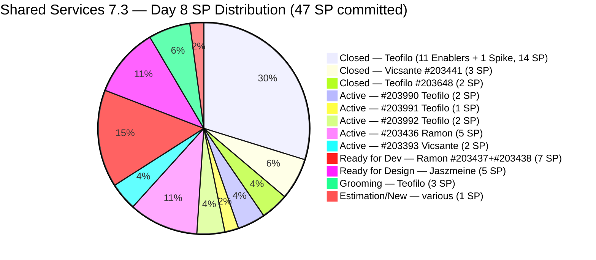
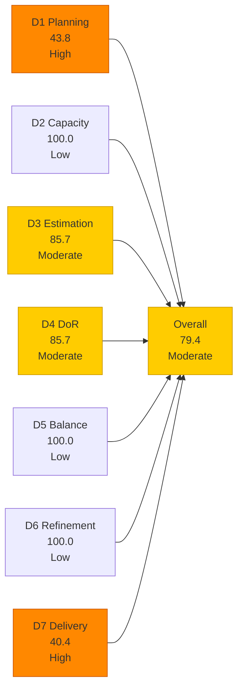
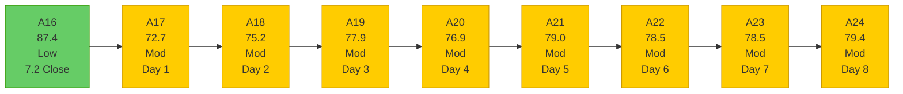

# Shared Services Team — SAFe Iteration Audit A24
**Date:** 2026-05-11 | **Sprint Day:** 8 of 14 | **Iteration:** 7.3 (May 4 – May 17, 2026)
**Auditor:** Claude Code (ADO SAFe Audit Skill v1) | **Prior Audit:** A23 (2026-05-10 02:01)

---

## 1. Audit Metadata

| Field | Value |
|---|---|
| **Audit ID** | A24 |
| **Report File** | `AUDIT_20260511_0900.md` |
| **Prior Audit** | A23 — `AUDIT_20260510_0201.md` (Overall 78.5, Moderate — 7.3 Day 7) |
| **ADO Project** | Jairosoft Portfolio (`666bb99a-6acd-4999-bb34-efd0e4ea90dc`) |
| **ADO Team** | Shared Services Team (`bd9578fd-5773-48fc-bd80-988dfe5de806`) |
| **Iteration** | 7.3 (`bbaecdec-eeb0-4c8d-999f-6a438eaab331`) |
| **Iteration Dates** | May 4 – May 17, 2026 |
| **Sprint Day** | 8 of 14 |
| **Audit Date** | 2026-05-11 09:00 PHT (UTC+8) |
| **Overall Score** | **79.4 — Moderate Risk** |
| **Risk Band** | Moderate (60–79.9) |
| **Visible Backlog Items** | 32 root items |
| **Current Iteration Root Items** | 14 (IterationPath = 7.3) |
| **Full 7.3 Roster** | 27 root items (14 open + 13 Closed) |
| **Capacity Source** | `work_get_iteration_capacities` — 4 members; 15.5 h/day total (Shared Services team bd9578fd) |
| **Project Exceptions Applied** | None |

---

## 2. Executive Summary

| Field | Value |
|---|---|
| **Overall Score** | 79.4 — Moderate Risk |
| **Score vs Prior (A23)** | 78.5 → 79.4 (**+0.9 — improvement**) |
| **Sprint Day** | 8 of 14 |
| **Iteration** | 7.3 (May 4 – May 17, 2026) |
| **Open Items in 7.3** | 14 |
| **Full 7.3 Roster** | 27 items (14 open + 13 Closed) |
| **Committed SP** | 47 SP (19 SP closed + 28 SP open estimated) |
| **SP Closed** | 19 SP (13 items) |
| **Delivery %** | 40.4% (19/47 SP) |
| **Risk Band** | Moderate (60–79.9) |

**Score improved +0.9 (78.5 → 79.4) driven by two structural changes today:**

1. **Ghost item #204009 deleted** — The junk item ("HgtreA7865fgl;'", User Story, no content) that had been flagged in A22 and A23 has been removed from the ADO board. This eliminates one DoR fail from D4, raising D3 from 78.6 to 85.7 and D4 from 85.7 to 85.7 (no change on D4 because a new DoR fail was introduced — see below). Net D3 impact: +1.0.

2. **New item #204048 added** — "AutoAllies DB Back in BLOB Storage 5112026" (Enabler, Teofilo, 1 SP, Grooming) was created and assigned to iteration 7.3, changed May 11. It is estimated (1 SP), but has no Description or AC fields populated — **DoR FAIL**. This offsets the D4 gain from deleting #204009.

3. **Three items advanced from Grooming to Active** — #203990, #203991, and #203992 all changed from Grooming to Active state on May 11 (ChangedDates confirmed). This indicates Teofilo's infrastructure queue is in motion. No closures yet, but the state progression is a positive delivery signal for Day 8.

**The team is now 0.6 points from Low Risk.** Deleting or fixing #204048 (adding Description + AC) combined with closing #203393 (Vicsante, 2 SP, Active) raises the overall above 80.0.

---

## 3. Previous Audit Delta (A23 → A24)

| Dimension | A23 Score | A24 Score | Delta | Driver |
|---|---|---|---|---|
| D1 Iteration Planning | 43.8 | 43.8 | 0.0 | 14/32 open items; backlog count stable (#204009 deleted, #204048 added — net 0) |
| D2 Team Capacity | 100.0 | 100.0 | 0.0 | All 4 members with positive capacity |
| D3 Estimation | 78.6 | 85.7 | **+7.1** | Ghost #204009 deleted; new #204048 (1 SP, estimated) added; net: 3 unest → 2 unest (12/14) |
| D4 DoR Compliance | 85.7 | 85.7 | 0.0 | #204009 DoR fail removed; #204048 DoR fail added (no desc/AC); net change = 0; still 12/14 |
| D5 Work Item Balance | 100.0 | 100.0 | 0.0 | Type diversity maintained; no penalties |
| D6 Backlog Refinement | 100.0 | 100.0 | 0.0 | All 32 items fresh; #204048 (May 11), Grooming items touched May 11 |
| D7 Delivery Predictability | 41.3 | 40.4 | **−0.9** | New item #204048 adds 1 SP to committed total (46 → 47 SP); no new closures; 19/47 |
| **Overall** | **78.5** | **79.4** | **+0.9** | D3 net gain (+7.1) partially offset by D7 dilution (−0.9) |

### Key Events (A23 → A24)

| Event | Impact |
|---|---|
| **#204009 deleted** (ghost item "HgtreA7865fgl;'") | D3: 78.6→85.7 (+7.1); D4 failure count: 2→1 (#204009 fail removed) but replaced by #204048 |
| **#204048 added** (AutoAllies DB Backup, Enabler, 1 SP, Grooming) | New 7.3 item: estimated (D3 pass) but no Desc/AC (D4 fail); adds 1 SP to committed total |
| **#203990, #203991, #203992** state changed Grooming → Active | Delivery signal: Teofilo's infrastructure items are moving; no closures yet |
| **#203994** touched May 11 (still Grooming) | No state change but re-engaged |
| No new closures on open items | D7 stable at 19 SP; committed denominator increased to 47 SP |

---

## 4. Current Iteration Snapshot

**Iteration:** 7.3 | **Period:** May 4 – May 17, 2026 | **Sprint Day:** 8 of 14

| Metric | Value |
|---|---|
| Full 7.3 iteration root items | 27 (13 Closed + 14 open) |
| Open items in 7.3 (backlog view) | 14 |
| Visible backlog root items | 32 |
| Committed SP | 47 SP (19 closed est. + 28 open estimated; #203993, #203909 unestimated) |
| SP Closed (Day 8) | 19 SP (13 items) |
| SP Remaining (estimated open) | 28 SP (12 estimated open items) |
| Delivery % | 40.4% (19/47 SP) |
| Daily capacity | 15.5 h/day (4 members) |
| Days remaining | 6 working days |

### Team Delivery Progress (Day 8)

| Member | SP Assigned (estimated) | SP Closed | SP Open/Active | State | Day-8 Signal |
|---|---|---|---|---|---|
| Teofilo | 30 SP estimated open/closed | 19 SP (13 items) | 7 SP Active (#203990=2, #203991=1, #203992=2) + Grooming 3 SP (#203994=2, #204048=1) | Active delivery | 3 items moved Grooming→Active today — closures likely Day 8–9 |
| Ramon | 8 SP (#203436=5, #203437=5, #203438=2; #203309=1 Defect) | 0 SP | 12 SP | Active (#203436), Ready for Dev (#203437, #203438), Estimation (#203309) | #203436 gate open since Day 5; Day-8 target closure |
| Vicsante | 2 SP (#203393) | 3 SP (#203441) | 2 SP Active (#203393) | Active | 4 Claude modules pending |
| Jaszmeine | 5 SP (#202553=2, #202724=3) | 0 SP | 5 SP Ready for Design | Stalled | No state change since Day 3 (May 6) |
| **Total** | **~47 SP committed** | **19 SP** | **~28 SP est.** | | **40.4% delivered** |

---

## 5. Work Item Analysis

### 7.3 Closed Items (13 items, 19 SP — unchanged from A23)

| ID | Title | Type | SP | Assignee | Closed Day |
|---|---|---|---|---|---|
| #203310 | jit.edu.ph Domain Renewal | Enabler | 2 | Teofilo | Day 2 |
| #203711 | Extend license for Jovanne Vicentino | Enabler | 1 | Teofilo | Day 2 |
| #203641 | Session with Paul — Backend Colina Health | Enabler | 1 | Teofilo | Day 2 |
| #203630 | Back up AutoAllies DB in Blob Storage | Enabler | 2 | Teofilo | Day 2 |
| #203653 | Add new interns to ADO Boards | Enabler | 1 | Teofilo | Day 3 |
| #203844 | Monthly Costing Report — May 2026 | Enabler | 2 | Teofilo | Day 3 |
| #202807 | IT Support Services — Mid PI 7 Feedback Survey | Spike | 1 | Teofilo | Day 3 |
| #203869 | Create jodex-qa@jairosoft.com in ADO | Enabler | 1 | Teofilo | Day 5 |
| #203870 | Create jodex-po@jairosoft.com in ADO | Enabler | 1 | Teofilo | Day 5 |
| #203908 | Recover Bubble Account | Enabler | 1 | Teofilo | Day 5 |
| #203984 | Reduce Bubble Subscription | Enabler | 1 | Teofilo | Day 5 |
| #203441 | Skill Plugin Development Environment Setup | Enabler | 3 | Vicsante | Day 5 |
| #203648 | Accessing Colina Database | Enabler | 2 | Teofilo | Day 5 |

### 7.3 Open Items (14 items)

| ID | Title | Type | State | SP | Assignee | DoR | ChangedDate | Notes |
|---|---|---|---|---|---|---|---|---|
| **#204048** | AutoAllies DB Back in BLOB Storage 5112026 | Enabler | **Grooming** | 1 | Teofilo | ❌ | May 11 | **New today** — no Desc/AC; estimated (1 SP) |
| #203909 | MFT Reduction for Colina | Enabler | New | — | Teofilo | ❌ | May 7 | No AC, no SP — 2 gaps; flagged A22–A24 |
| #203993 | Purchase of Mobile Devices (Android/iOS) | Enabler | New | — | Teofilo | ✅ | May 8 | No SP; desc+AC present (DoR pass) |
| **#203990** | Prepare 25 Working Machines in JIT Room | Enabler | **Active** | 2 | Teofilo | ✅ | May 11 | **Grooming → Active today** |
| **#203991** | CCTV TESDA Compliance | Enabler | **Active** | 1 | Teofilo | ✅ | May 11 | **Grooming → Active today** |
| **#203992** | Bubble eLMS Plan Upgrade | Enabler | **Active** | 2 | Teofilo | ✅ | May 11 | **Grooming → Active today** |
| #203994 | Sendgrid for eLMS | Enabler | Grooming | 2 | Teofilo | ✅ | May 11 | Touched today; still Grooming |
| #203309 | GitHub token degraded — raseniero scope fix | Defect | Estimation | 1 | Ramon | ✅ | May 4 | ART-wide defect; not started |
| #203393 | Claude Course Training | Spike | Active | 2 | Vicsante | ✅ | May 8 | 4 modules pending; AC-matched |
| #203436 | Plugin Lifecycle & Extract Skill Verification | User Story | Active | 5 | Ramon | ✅ | May 8 | Primary Jodex delivery; gate open Day 5 |
| #203437 | Plugin Generate Skill — Playwright Script Generation | User Story | Ready for Dev | 5 | Ramon | ✅ | May 8 | Gated on #203436 |
| #202553 | Vendor Exploration & Search | Design | Ready for Design | 2 | Jaszmeine | ✅ | May 6 | No change since Day 3 (May 6) |
| #202724 | Vendor Profile & Details | Design | Ready for Design | 3 | Jaszmeine | ✅ | May 6 | No change since Day 3 (May 6) |
| #203438 | Generate Test Execution Report (/qa-ai:report) | User Story | Ready for Dev | 2 | Ramon | ✅ | May 8 | Gated on #203436 |

### DoR Analysis — Open Items (14 items)

| ID | Desc | AC | Status | Notes |
|---|---|---|---|---|
| #203909 | ~40 chars ✅ | 0 chars ❌ | **FAIL** | No AC field; persists A22–A24; assign SP + add AC |
| #204048 | 0 chars ❌ | 0 chars ❌ | **FAIL** | New today — no description, no AC; add both to resolve |
| All others (12) | ≥30 ✅ | ≥20 ✅ | ✅ PASS | Confirmed via ADO batch query |

DoR pass = 12/14. D4 = 85.7. #204009 deletion removed one failure but #204048 introduction replaced it. Net D4 unchanged from A23.

### Work Item Type Distribution — Current 7.3 Open Items (14)

| Type | Count | Share | D5 Check |
|---|---|---|---|
| Enabler | 7 | 50.0% | < 60% — no dominant-type penalty |
| User Story | 3 | 21.4% | > 0% — no absent-US penalty |
| Design | 2 | 14.3% | — |
| Spike | 1 | 7.1% | < 40% — no spike penalty |
| Defect | 1 | 7.1% | — |
| **Total** | **14** | **100%** | **D5 = 100.0** |

---

## 6. SAFe Compliance Scorecard

| Dimension | Score | Band | Formula | Evidence |
|---|---|---|---|---|
| D1 Iteration Planning | 43.8 | High | 14/32 × 100 | 14 open 7.3 items / 32 visible root backlog items (net unchanged: #204009 deleted, #204048 added) |
| D2 Team Capacity | 100.0 | Low | 4/4 × 100 | All 4 members with positive capacity; 15.5 h/day team total |
| D3 Estimation | 85.7 | Moderate | 12/14 × 100 | 2 unestimated: #203993 (null SP), #203909 (null SP); #204048 estimated (1 SP); #204009 deleted |
| D4 DoR Compliance | 85.7 | Moderate | 12/14 × 100 | 2 failures: #203909 (no AC) + #204048 (no desc/AC); #204009 deleted but replaced by #204048 |
| D5 Work Item Balance | 100.0 | Low | 100 − 0 | Enabler 50.0% (<60%); US 21.4% (>0%); Spike 7.1% (<40%); no penalties |
| D6 Backlog Refinement | 100.0 | Low | 32/32 fresh; 0 penalties | All 32 items fresh; 0 stale_90; 0 stale_180; 0 untouched current items |
| D7 Delivery Predictability | 40.4 | High | 19/47 × 100 | 13 closed items (19 SP) / 47 SP committed (new #204048 adds 1 SP to committed) |
| **Overall** | **79.4** | **Moderate** | 555.6 / 7 | Average of 7 dimensions |

### Scoring Detail

- **D1:** round(14/32 × 100, 1) = **43.8** *(unchanged from A23; #204009 deleted, #204048 added — net zero backlog count change)*
- **D2:** round(4/4 × 100, 1) = **100.0** *(Teofilo, Vicsante, Jaszmeine, Ramon all with positive capacity; team total 15.5 h/day confirmed via `work_get_iteration_capacities`)*
- **D3:** round(12/14 × 100, 1) = **85.7** *(unestimated: #203993 null SP, #203909 null SP; #204009 deleted removes 1 unestimated; #204048 added with 1 SP = estimated; net: 3 unest → 2 unest)*
- **D4:** round(12/14 × 100, 1) = **85.7** *(#204009 deleted removes 1 DoR fail; #204048 added with no desc/AC = new DoR fail; net DoR failures unchanged at 2: #203909 + #204048)*
- **D5:** Enabler 50.0% < 60%; US 21.4% > 0%; Spike 7.1% < 40% → **100.0**
- **D6:** base=round(32/32×100,1)=100.0; stale_90=0 (oldest item #186848 changed Apr 15, 26 days ago — within 45-day window); stale_180=0; untouched_current: all 14 current 7.3 items have ChangedDate ≥ May 4 → 0 untouched → **100.0**
- **D7:** Committed SP = 47 (19 closed estimated + 27 open estimated from A23 + 1 new #204048). Closed SP = 19. round(19/47 × 100, 1) = **40.4**
- **Overall:** (43.8+100.0+85.7+85.7+100.0+100.0+40.4) / 7 = 555.6 / 7 = **79.4**

### Path to Low Risk — Score Impact Matrix

| Action | Dimension Change | Score Impact | New Overall |
|---|---|---|---|
| **Add Desc+AC to #204048** | D4: 85.7→92.9 (13/14) | **+1.0** | **80.4 ✅ Low Risk** |
| Assign SP to #203993 (2 SP) | D3: 85.7→92.9 | +1.0 | 80.4 ✅ |
| Add AC to #203909 + SP | D3+D4 partial gains | +1.4 | 80.8 ✅ |
| Close #203393 (Vicsante, 2 SP) | D7: 40.4→44.7 | +0.6 | 80.0 ✅ |
| Close #203436 (Ramon, 5 SP) | D7: 40.4→50.0 | +1.4 | 80.8 ✅ |
| Close #203990+#203991+#203992 (5 SP Teofilo) | D7: 40.4→51.1 | +1.5 | 80.9 ✅ |
| **Add #204048 Desc+AC + Close #203393** | D4+D7 | +1.6 | **81.0 ✅** |

**The team is 0.6 points from Low Risk.** Adding Description and AC to #204048 (a 5-minute ADO edit) raises D4 to 92.9 and overall to 80.4. This is the fastest path to Low Risk — one edit, no delivery work required.

---

## 7. Dimension Findings

### D1 — Iteration Planning: 43.8 (High Risk)

**Formula:** `current_iteration_root_items / visible_root_backlog_items × 100 = 14/32 × 100 = 43.8`

D1 unchanged from A23. The ghost item #204009 deletion and #204048 addition are net-neutral to the denominator. The 32-item visible backlog includes stranded items across 7.1 (1), 7.2 (2), 7.4+ (multiple), PI6 (1), PI7 (2 unscheduled), PI8 (4+).

**Stranded items persisting 6+ audits (A17–A24):**
- #202732 (QA Intern Stakeholder, 7.1, Ready for UAT, 1 SP, changed Apr 27) — if intern access was confirmed, close today
- #202551 (Bride Account Management, 7.2, Design Approved, 3 SP, changed May 4) — design complete, awaiting dev sprint
- #202687 (Onboarding & Subscription Management, 7.2, Design Approved, 3 SP, changed May 4) — design complete, awaiting dev sprint

Closing or migrating these 3 items reduces denominator from 32 to 29, raising D1 to 14/29 = 48.3.

### D2 — Team Capacity: 100.0 (Low Risk)

All 4 members have positive capacity: Teofilo 6h + Vicsante 6h + Jaszmeine 3h + Ramon 0.5h = 15.5 h/day total. D2 = 100.0.

**Remaining sprint bandwidth (6 days):** Teofilo 36h, Vicsante 36h, Jaszmeine 18h, Ramon 3h = **93 total team hours**. Against 28 estimated SP open (12 estimated items), the team has ample raw capacity — the constraint is task readiness, coordination, and state progression.

### D3 — Estimation: 85.7 (Moderate Risk)

**Improvement from A23 (78.6 → 85.7).** Ghost item #204009 (unestimated) was deleted. New item #204048 (1 SP) is estimated. Net: 3 unestimated items → 2 unestimated items.

Remaining unestimated items:
1. **#203993 (Purchase of Mobile Devices):** SP field null. Description and AC are substantive and DoR-compliant. Assign 2 SP.
2. **#203909 (MFT Reduction for Colina):** No SP and no AC. Assign SP + add AC.

To reach D3 = 100.0: assign SP to both #203993 and #203909 (combined with deleting/fixing #204048 which is already estimated).

### D4 — DoR Compliance: 85.7 (Moderate Risk)

**No net improvement from A23.** Ghost #204009 (DoR fail) was deleted, but new item #204048 (DoR fail — no description, no AC) was added on the same day. The failure count remains at 2, and D4 remains at 12/14 = 85.7.

**Action required for #204048:** The title "AutoAllies DB Back in BLOB Storage 5112026" refers to a database backup task (likely routine for AutoAllies), but the item has no Description or AC fields populated. This is a 5-minute ADO edit — add a user story description and at least one AC line. Adding content raises D4 to 13/14 = 92.9 and pushes overall to 80.4 (Low Risk).

**#203909 (MFT Reduction for Colina):** Still no AC field. Has persisted as a DoR fail for 6 consecutive audits (A19–A24). Suggested AC: "All Colina DB and Azure resources reviewed for right-sizing; at least one cost-reduction action implemented and documented; monthly Colina cloud spend reduction quantified."

### D5 — Work Item Balance: 100.0 (Low Risk)

Type distribution across 14 open items: Enabler 50.0%, User Story 21.4%, Design 14.3%, Spike 7.1%, Defect 7.1%. No penalty conditions triggered. D5 = 100.0. Consistent across all 8 Shared Services 7.3 audits.

### D6 — Backlog Refinement: 100.0 (Low Risk)

All 32 visible backlog items are fresh (changed within 45 days of May 11 = since March 27). The oldest item is #186848 (Apollo.ai Integration, changed Apr 15, 26 days ago). New item #204048 was added today. Items #203990, #203991, #203992, #203994 were touched today (state changes/Grooming advances). Zero stale_90, stale_180. All 14 current items changed since May 4 → zero untouched. D6 = 100.0.

### D7 — Delivery Predictability: 40.4 (High Risk — Day 8)

**Formula:** `closed_story_points / committed_story_points × 100 = 19/47 × 100 = 40.4`

**Slight deterioration from A23 (41.3 → 40.4)** caused by the addition of #204048 (1 SP) to committed total without a corresponding closure. No new items closed since A23.

**Positive delivery signal:** Three items moved from Grooming to Active today (#203990, #203991, #203992 — total 5 SP). These are Teofilo items with well-defined AC. If they close today or tomorrow, D7 will advance to 51.1 (19+5=24 SP / 47 SP × 100).

**Day-8 delivery priority targets:**

| Member | Target Item | SP | Current State | Day-8 Action |
|---|---|---|---|---|
| Teofilo | #203990, #203991, #203992 | 5 SP | Active (moved today) | Close if infrastructure work complete; pattern: same-day closure from Active |
| Teofilo | #203994 | 2 SP | Grooming | Advance to Active or close if SendGrid configured |
| Teofilo | #204048 | 1 SP | Grooming | Close after adding Desc+AC (resolves D4 too) |
| Ramon | #203436 | 5 SP | Active | Close if all 8 AC scenarios pass; Day-8 is the critical gate |
| Vicsante | #203393 | 2 SP | Active | Close if 4 Claude course modules completed |
| Jaszmeine | #202553, #202724 | 5 SP | Ready for Design | Advance to Design Approved; no change since Day 3 |

**D7 trajectory (Day 8 → close):**

| Day | Target Action | SP Cumulative | D7 | Overall |
|---|---|---|---|---|
| Day 8 (today) | Close Teofilo active (5 SP) | 24 | 51.1 | ~82.2 ✅ |
| Day 8 (today) | + Close #203393 (2 SP) | 26 | 55.3 | ~83.5 ✅ |
| Day 8–9 | Close #203436 (5 SP) | 31 | 66.0 | ~88.0 ✅ |
| Day 9–10 | Close Jaszmeine designs (5 SP) | 36 | 76.6 | ~91.5 ✅ |
| Day 10–12 | Close Grooming remaining (3 SP) | 39 | 83.0 | ~94.0 ✅ |

---

## 8. Risks and Bottlenecks

| # | Risk | Severity | Dimension | Detail |
|---|---|---|---|---|
| R1 | #204048 — new DoR fail replaces deleted #204009 | **High** | D4 | New item "AutoAllies DB Back in BLOB Storage 5112026" added today with no Desc/AC; net D4 unchanged from A23; a 5-minute edit (add desc+AC) raises overall to 80.4 (Low Risk); this should be resolved within hours |
| R2 | Ramon's Jodex queue (12 SP, 0 closures) — Day 8 without delivery | **High** | D7 | #203436 (5 SP, Active) has been development-ready since Day 5; #203437 (5 SP) and #203438 (2 SP) are gated on it; Day-8 closure of #203436 raises D7 to ~52% and overall to ~82 |
| R3 | #203909 (MFT Reduction) — no AC, no SP for 6 consecutive audits | **High** | D3/D4 | Same issue since A19; 5-minute ADO edit (add AC + SP); each audit it persists costs the team 2 D3/D4 points per dimension per item |
| R4 | Jaszmeine design items — no state change since Day 3 (May 6) | **High** | D7 | #202553 and #202724 in Ready for Design; Day 8 is now past the critical advance deadline; risk of sprint carryover increases with each day; design review needed today |
| R5 | #203993 (Mobile Devices) — unestimated since A22 | **Medium** | D3 | SP field null; 1-minute fix; assign 2 SP |
| R6 | D1 = 43.8 — structural ceiling | Moderate | D1 | 14/32; 3 stranded items in 7.1/7.2 inflate denominator for 6+ audits |
| R7 | #202732 (QA Intern, 7.1, Ready for UAT) — 6+ sprints old | Moderate | D1 | Close if intern access confirmed; removes 1 from D1 denominator |
| R8 | D7 at 40.4 with 6 days remaining — recovery achievable but time-constrained | Moderate | D7 | Need ~28 additional SP closed over 6 days (4.7 SP/day) for full delivery; Teofilo's active items (5 SP) + Ramon's queue (12 SP) are the primary levers |

---

## 9. Prioritized Recommendations

1. **[HIGH — D4, Immediate — 5 minutes]** Add Description and AC to #204048 (AutoAllies DB Back in BLOB Storage 5112026, Enabler, Grooming, Teofilo). This resolves the new DoR fail introduced today. Suggested description: "As a DevOps Infrastructure Engineer, I want to run the scheduled AutoAllies database backup to Azure Blob Storage, ensuring data durability and recovery capability." Suggested AC: "AutoAllies database successfully backed up to Azure Blob Storage; backup verified by file size and integrity check; backup logged in the Shared Services runbook." After adding, D4 rises to 92.9 and overall to **80.4 ✅ Low Risk**.

2. **[HIGH — D7, Today]** Teofilo: close #203990 (Prepare 25 Machines, 2 SP, Active), #203991 (CCTV TESDA Compliance, 1 SP, Active), and #203992 (Bubble eLMS Plan Upgrade, 2 SP, Active). All three moved to Active today — this is the delivery signal that closure is near. Review each item's AC: (a) Are 25 machines in JIT Room ready with internet? (b) Can TESDA view JIT Room CCTV? (c) Has the Bubble eLMS plan been upgraded and verified? Close each one when its AC is met. Closing all 3 raises D7 from 40.4 to 51.1 (24/47 SP) and overall to ~82.2.

3. **[HIGH — D7, Today]** Ramon: close #203436 (Plugin Lifecycle & Extract Skill Verification, 5 SP, Active). The development environment has been ready since Day 5. Check all 8 AC scenarios (install, extract, classify, generate, dedup, report, uninstall, deregister). If passing, close now. A Day-8 closure raises D7 to ~55.3 when combined with Teofilo's closures above.

4. **[HIGH — D7, Today]** Vicsante: close #203393 (Claude Course Training, 2 SP, Active). If all 4 Claude modules (Introduction to agent skills, Building with Claude API, Introduction to MCP, Claude Code in Action) are completed, close the item today.

5. **[HIGH — D7, Today]** Jaszmeine: advance #202553 and #202724 to Design Approved. Both have been in Ready for Design since Day 3 (May 6) — 5 days without a state change. Day 8 is now past the ideal advance window; design review must happen today to avoid carryover risk. If designs are complete, advance to Design Approved immediately.

6. **[MEDIUM — D3, 1 minute]** Assign SP to #203993 (Purchase of Mobile Devices). Recommended: 2 SP. Raises D3 from 85.7 to 92.9 (13/14).

7. **[MEDIUM — D3/D4, 5 minutes]** Add SP and AC to #203909 (MFT Reduction for Colina). Recommended SP: 2. Recommended AC: "All Colina DB and Azure compute/storage resources reviewed for right-sizing; at least one measurable cost-reduction action implemented; monthly spend reduction documented and shared with Finance." Resolves both D3 and D4 gaps for this 6-audit-persistent item.

8. **[LOW — D1, ADO Cleanup]** Close #202732 (QA Intern Stakeholder, 7.1, Ready for UAT, 1 SP). Oldest stranded item. If intern access to Flawless ADO board was confirmed, close the item. Reduces D1 denominator from 32 to 31, raising D1 to 14/31 = 45.2.

---

## 10. Evidence Gaps and Limitations

| Gap | Impact | Mitigation |
|---|---|---|
| #204048 added today — no prior audit context | Item appears new (rev 5, changed May 11); no description/AC populated; DoR confirmed FAIL via ADO batch query (no desc/AC fields in response) | Item scored as unestimated for DoR; estimated for D3 (SP=1 confirmed) |
| 13 Closed items absent from backlog view | D1 uses 32 open items; D7 uses full 27-item root roster (13 closed + 14 open) | Standard ADO behavior; 13 Closed confirmed from A23 record; no additional closures detected |
| Grooming state changes (#203990, #203991, #203992) — no task data | State changes confirmed via ChangedDate=May 11 in ADO batch query; cannot confirm specific work done | Root item state progression is the primary D7 evidence; task closure not required for root item delivery credit |
| #203993 SP confirmed null — 3rd consecutive audit | D3 gap persists; SP field absent from ADO API response | Requires direct ADO portal edit; assign 2 SP |
| #202947 in 7.6 IP, #202551/#202687 in 7.2, #202732 in 7.1 | Inflate D1 denominator; included in visible_root_backlog_items | All confirmed open, non-7.3, not closed; excluded from current_iteration_root_items |

---

## 11. Score Trend — Shared Services Iteration 7.3

**Score rose +0.9 at Day 8.** Ghost item #204009 deletion improved D3 (+7.1) but the new DoR fail in #204048 neutralized D4. Three infrastructure items moved to Active today — if they close, D7 will jump from 40.4 toward 51%+. The team is 0.6 points from Low Risk via a single 5-minute ADO edit (#204048 Desc+AC).

### Score Sensitivity Matrix (Day 8)

| Action | Time | Score Impact | New Overall |
|---|---|---|---|
| Add Desc+AC to #204048 | 5 min | +1.0 | **80.4 ✅** |
| + Assign SP to #203993 | +1 min | +1.0 | 81.4 ✅ |
| + Add AC+SP to #203909 | +5 min | +1.0 | 82.4 ✅ |
| + Close #203393 (2 SP) | Day 8 | +0.6 | 83.0 ✅ |
| + Close Teofilo Active (5 SP) | Day 8 | +1.5 | 84.5 ✅ |
| + Close #203436 (5 SP) | Day 8–9 | +1.5 | 86.0 ✅ |

**Combined data hygiene + Day-8 delivery target → 86.0 overall by Day 9.** The team has both the capacity and the open items to reach this. The question is execution velocity in the sprint's second half.

---

*Audit A24 produced by Claude Code — ADO SAFe Audit Skill v1. SAFe 6.0 framework. Sprint Day 8 of 14. Key findings: (1) Score improved +0.9 (78.5→79.4) — ghost #204009 deleted (D3 +7.1) partially offset by #204048 DoR fail and D7 denominator increase; (2) Team is 0.6 points from Low Risk — adding Desc+AC to #204048 (5 min) crosses the 80.0 threshold; (3) Three Teofilo items advanced Grooming→Active today (#203990, #203991, #203992, 5 SP) — same-day closure pattern suggests Day-8 delivery is likely; (4) Ramon's Jodex queue (12 SP, 0 closures) and Jaszmeine's design items (5 SP, stalled since Day 3) remain the critical delivery risk for the sprint's second half.*
